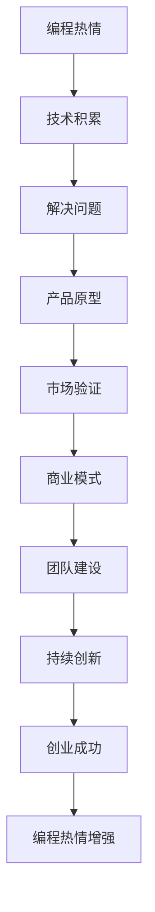

                 

# 如何将编程热情转化为创业动力

## 1. 背景介绍

编程，作为一项充满创造力和挑战性的工作，对于许多人来说既是兴趣也是事业。但如何将这种热情转化为创业的动力，成为许多有志之士面临的难题。本文将从编程热情到创业动力的转化过程，探讨其中的关键要素，并给出具体的方法和策略，希望能为那些有志于创业的程序员提供一些参考和启发。

## 2. 核心概念与联系

### 2.1 核心概念概述

在探讨如何将编程热情转化为创业动力之前，首先要理解编程热情和创业动力之间的内在联系。

- **编程热情**：是指程序员对编程的热爱和投入，包括对编程语言的掌握、解决问题的喜悦、技术创新的渴望等。
- **创业动力**：是指创业者推动创业项目发展、实现商业目标的内在驱动力，包括对市场的洞察、对产品需求的理解、对团队和资源的整合等。

这两个概念之间的联系在于，编程热情是创业动力的基础。编程技能的掌握、技术创新的能力、解决问题的经验，都是创业者在创业过程中不可或缺的资源。同时，创业动力的实现，又能进一步激发和巩固编程热情，形成一个良性循环。

### 2.2 核心概念原理和架构的 Mermaid 流程图

这个流程图展示了从编程热情到创业成功的路径。编程热情通过技术积累转化为解决问题的能力，进而生成产品原型；产品原型通过市场验证，逐步形成商业模式；商业模式驱动团队建设，最终实现创业成功，并再次增强编程热情。

## 3. 核心算法原理 & 具体操作步骤

### 3.1 算法原理概述

将编程热情转化为创业动力，实际上是一个从内到外的转换过程。这个过程中，编程技能是基础，问题解决能力是核心，而商业模式和团队建设则是外部条件。

### 3.2 算法步骤详解

#### 3.2.1 技能积累

编程热情转化为创业动力的第一步是技能积累。这包括但不限于以下几个方面：

- **编程语言**：掌握一门或多门编程语言，尤其是那些应用广泛的高级编程语言，如Python、JavaScript等。
- **数据结构与算法**：深入理解数据结构与算法的原理和应用，能够在实际问题中灵活运用。
- **系统设计**：学习系统设计的基本原则和方法，能够设计和实现高效、可扩展的系统。

#### 3.2.2 问题解决

编程热情转化为创业动力的第二步是问题解决。这要求程序员不仅能够解决技术问题，还要能够理解业务需求，找到技术解决方案。具体步骤包括：

- **业务理解**：深入了解所在行业的业务模式、市场趋势、用户需求等，能够从业务角度识别问题和机会。
- **需求分析**：根据业务需求，进行详细的需求分析，明确产品的功能、界面、性能等要求。
- **技术选型**：根据需求分析结果，选择合适的技术栈，进行技术实现。

#### 3.2.3 产品原型

编程热情转化为创业动力的第三步是产品原型。通过构建可行的产品原型，验证技术方案和市场需求的匹配度。具体步骤包括：

- **UI/UX设计**：设计简洁、易用的用户界面和用户体验，确保产品的高可用性和易用性。
- **技术实现**：将产品原型转化为可运行的软件，进行单元测试和集成测试，确保系统的稳定性和可靠性。
- **用户反馈**：收集用户反馈，根据反馈进行迭代优化，确保产品的市场适应性。

#### 3.2.4 市场验证

编程热情转化为创业动力的第四步是市场验证。通过市场验证，确认产品是否能够满足市场需求，是否具有商业化潜力。具体步骤包括：

- **市场调研**：进行市场调研，了解目标市场的规模、用户需求、竞争格局等。
- **产品推广**：通过各种渠道推广产品，收集用户反馈，确认产品的市场接受度。
- **商业模式**：根据市场调研和用户反馈，设计商业模型，明确盈利方式和市场定位。

#### 3.2.5 团队建设

编程热情转化为创业动力的最后一步是团队建设。一个高效的创业团队是创业成功的关键。具体步骤包括：

- **人才招募**：根据项目需求，招募具有相关技术背景和业务经验的人才，构建团队核心。
- **角色分工**：明确团队成员的角色和职责，确保每个人都能够发挥自己的优势。
- **团队管理**：建立有效的沟通和协作机制，确保团队的高效运作。

### 3.3 算法优缺点

将编程热情转化为创业动力的过程，既有其优势，也存在一定的局限性。

#### 3.3.1 优势

- **技术优势**：程序员通常具备较强的编程能力和技术创新能力，能够快速实现产品原型。
- **问题解决能力**：程序员能够从技术角度解决实际问题，找到有效的解决方案。
- **产品迭代快**：程序员能够根据用户反馈快速迭代产品，缩短产品开发周期。

#### 3.3.2 局限性

- **市场洞察不足**：程序员可能缺乏对市场趋势和用户需求的深入理解，导致产品方向偏离市场需求。
- **商业思维缺乏**：程序员可能缺乏商业化思维，难以设计出具有市场竞争力的商业模式。
- **团队协作困难**：程序员可能难以与非技术背景的团队成员进行有效协作，导致团队运作不畅。

### 3.4 算法应用领域

将编程热情转化为创业动力的过程，可以应用于多种领域，包括但不限于：

- **软件开发**：利用编程技能开发软件产品，解决特定业务问题。
- **互联网创业**：基于互联网技术，开发创新的互联网产品或服务，开拓新市场。
- **硬件创业**：结合编程技能和硬件设计能力，开发智能硬件产品，满足市场需求。

## 4. 数学模型和公式 & 详细讲解 & 举例说明

### 4.1 数学模型构建

在将编程热情转化为创业动力的过程中，可以建立一个数学模型来描述这一过程。这个模型包括四个关键变量：编程热情$P$、技术积累$T$、市场需求$D$和团队协作$C$。模型表达式为：

$$
R = f(P, T, D, C)
$$

其中$R$代表创业成功的概率，$f$是映射函数，将四个变量映射为成功概率。

### 4.2 公式推导过程

为了简化问题，假设$f$为线性映射，则模型可以表示为：

$$
R = aP + bT + cD + dC
$$

其中$a, b, c, d$是系数，代表各个变量对创业成功的贡献度。

### 4.3 案例分析与讲解

假设创业者小张对编程充满热情$P=10$，具备三年以上的技术积累$T=8$，对市场需求有深入洞察$D=7$，但团队协作能力一般$C=5$。根据模型推导，小张的创业成功概率为：

$$
R = 10a + 8b + 7c + 5d
$$

通过对比不同变量的系数，小张可以明确在哪些方面进行改进，以提高创业成功的概率。

## 5. 项目实践：代码实例和详细解释说明

### 5.1 开发环境搭建

在进行项目实践之前，需要搭建一个适合编程和创业的环境。以下是一些常用的开发工具和环境：

- **编程环境**：安装Python、Java、C++等常用编程语言的环境，以及IDE如PyCharm、Visual Studio等。
- **版本控制**：使用Git等版本控制系统，方便代码管理和团队协作。
- **开发框架**：选择适合的开发框架和库，如Flask、Django、React等，加速项目开发。
- **云平台**：使用云平台如AWS、Google Cloud等，提供弹性计算和存储资源，支持快速部署和扩展。

### 5.2 源代码详细实现

下面以一个简单的电子商务平台为例，介绍如何将编程热情转化为创业动力。

首先，设计系统的整体架构：

- **用户管理**：包括用户注册、登录、信息管理等功能。
- **商品管理**：包括商品列表、商品详情、商品评价等功能。
- **订单管理**：包括订单列表、订单详情、订单支付等功能。
- **物流管理**：包括物流信息、订单跟踪、物流结算等功能。

然后，根据架构需求，选择合适的技术栈，进行具体实现：

- **前端**：使用React或Vue等前端框架，设计用户界面。
- **后端**：使用Flask或Django等后端框架，实现用户管理和订单管理等核心功能。
- **数据库**：使用MySQL或MongoDB等数据库，存储用户数据和订单信息。
- **支付接口**：使用第三方支付接口，实现订单支付功能。

### 5.3 代码解读与分析

代码实现中，需要注意以下几个方面：

- **安全性**：确保用户数据的安全性和支付接口的稳定性，防止数据泄露和支付异常。
- **性能优化**：优化数据库查询和业务逻辑，提高系统的响应速度和并发处理能力。
- **用户体验**：优化用户界面和交互逻辑，提升用户体验和满意度。

### 5.4 运行结果展示

运行上述系统后，可以进行以下测试：

- **用户注册和登录测试**：确保用户能够顺利注册和登录系统。
- **商品浏览和购买测试**：测试商品展示、订单支付和物流跟踪等功能。
- **订单管理和退换货测试**：测试订单管理和退换货流程，确保用户体验。

## 6. 实际应用场景

### 6.1 软件开发

软件开发是编程热情转化为创业动力的典型场景。通过开发具有市场竞争力的软件产品，解决用户的具体问题，满足市场需求，实现商业化。例如，开发一款电商管理系统，解决中小型电商企业的痛点，提升其运营效率。

### 6.2 互联网创业

互联网创业是将编程热情转化为创业动力的另一个重要场景。通过开发创新的互联网产品或服务，开拓新市场，获取更多用户。例如，开发一款基于AI的智能客服系统，帮助企业提升客服效率和用户满意度。

### 6.3 硬件创业

硬件创业是将编程热情转化为创业动力的另一个方向。结合编程技能和硬件设计能力，开发智能硬件产品，满足市场需求。例如，开发一款智能家居设备，提供安全、便捷的家庭生活体验。

## 7. 工具和资源推荐

### 7.1 学习资源推荐

为了更好地将编程热情转化为创业动力，以下是一些推荐的资源：

- **在线课程**：如Coursera、Udacity等平台上的计算机科学课程，涵盖编程语言、算法、数据结构等内容。
- **技术博客**：如Stack Overflow、Medium等技术博客，获取最新的技术趋势和开发技巧。
- **创业书籍**：如《精益创业》、《创业维艰》等经典创业书籍，提供创业思路和实战经验。

### 7.2 开发工具推荐

以下是一些推荐的开发工具：

- **代码编辑器**：如Visual Studio Code、Sublime Text等，支持多种编程语言和代码片段。
- **版本控制系统**：如Git、SVN等，方便代码管理和团队协作。
- **开发框架**：如Flask、Django、React等，提供高效开发工具和库。
- **云平台**：如AWS、Google Cloud等，提供弹性计算和存储资源，支持快速部署和扩展。

### 7.3 相关论文推荐

以下是一些推荐的论文：

- **《软件工程原理》**：阐述了软件开发的基本原理和方法，适合初学者入门。
- **《软件项目管理》**：介绍了软件项目管理的基本概念和实践，适合项目管理者阅读。
- **《商业模型画布》**：介绍了如何构建商业模式，适合创业者参考。

## 8. 总结：未来发展趋势与挑战

### 8.1 研究成果总结

将编程热情转化为创业动力的过程，是程序员创业成功的关键步骤。通过技能积累、问题解决、产品原型、市场验证和团队建设，可以将编程热情转化为创业动力，实现商业化。

### 8.2 未来发展趋势

未来，编程热情转化为创业动力的过程将会更加复杂和多样化。随着新技术的不断涌现，如区块链、人工智能、大数据等，将为创业者提供更多的技术手段和应用场景。同时，市场竞争的加剧和用户需求的多样化，也将对创业者的技术能力和商业思维提出更高的要求。

### 8.3 面临的挑战

尽管编程热情转化为创业动力的过程具有广阔前景，但也面临一些挑战：

- **技术门槛提高**：新技术的快速迭代要求创业者不断学习新知识，提升技术能力。
- **市场竞争激烈**：市场竞争的加剧要求创业者具备敏锐的洞察力和创新能力。
- **资源限制**：创业初期的资源限制要求创业者进行高效的资源管理，最大化利用资源。

### 8.4 研究展望

未来的研究将围绕以下几个方面展开：

- **技术创新**：探索新的编程技术和工具，提升开发效率和质量。
- **市场洞察**：研究市场趋势和用户需求，寻找新的商业机会。
- **商业模式**：设计更加灵活和多样化的商业模式，提升商业化能力。
- **团队协作**：探索高效团队协作的方法，提升团队合作效率。

## 9. 附录：常见问题与解答

### Q1: 如何评估自己的编程热情是否适合创业？

A: 评估编程热情是否适合创业，可以从以下几个方面考虑：

- **技术能力**：评估自己的技术能力和知识储备，是否有足够的能力实现产品原型和商业模型。
- **市场洞察**：评估自己是否对市场有深入的了解，能否找到市场需求和痛点。
- **团队协作**：评估自己是否具备良好的团队协作能力，能否与不同背景的团队成员有效沟通和合作。

### Q2: 创业初期需要考虑哪些关键问题？

A: 创业初期需要考虑的关键问题包括：

- **产品定位**：明确产品的目标用户、市场定位和核心功能。
- **商业模式**：设计具有可行性的商业模式，明确盈利方式和市场策略。
- **资源配置**：合理配置资源，确保技术、市场和人才的均衡发展。

### Q3: 如何提升创业团队的协作效率？

A: 提升创业团队的协作效率，可以从以下几个方面入手：

- **明确分工**：明确团队成员的职责和分工，确保每个人都能发挥自己的优势。
- **建立沟通机制**：建立高效的沟通机制，如定期会议、即时通讯工具等，确保信息透明和及时传递。
- **文化建设**：建立积极的团队文化，增强团队凝聚力和归属感。

---

作者：禅与计算机程序设计艺术 / Zen and the Art of Computer Programming

