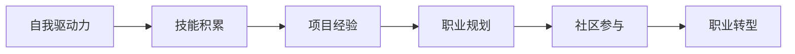

                 

# 如何将编程热情转化为长期事业

编程，一直以来是许多人的梦想和追求。从早期的BASIC、FORTRAN，到现在的Python、Java，编程语言不断演进，编程工具不断进步，编程范式不断革新。然而，许多人在编码的海洋中沉浮，无法找到心灵的归属和事业的方向。本文将深入探讨如何将编程热情转化为长期的职业道路，希望能为每一位编程爱好者提供一份清晰的职业指南。

## 1. 背景介绍

### 1.1 问题由来

在计算机科学的长河中，编程从未停止过脚步。从黑客帝国到人工智能，编程始终是推动社会进步的重要引擎。然而，计算机科学也面临一些严峻的挑战，比如编程语言的复杂性、技术栈的庞杂、开发效率的低下等问题，这些问题往往让程序员感到疲惫和困惑。因此，如何将编程热情转化为一种长期的事业，成为了许多编程爱好者的梦想。

### 1.2 问题核心关键点

如何将编程热情转化为长期事业，主要取决于以下几个核心关键点：

- **自我驱动力**：明确自己的目标和兴趣，才能长期坚持编程事业。
- **技能积累**：持续学习新知识，积累编程技能，才能在技术栈中游刃有余。
- **项目经验**：通过实际项目锻炼，提升编程能力，积累实战经验。
- **职业规划**：制定明确的职业规划，才能在编程领域内不断进步。
- **社区参与**：加入技术社区，参与开源项目，扩展人脉和资源。
- **职业转型**：适时进行职业转型，开拓新的技术领域。

本文将详细讨论以上关键点，并提供实际的操作指南。

## 2. 核心概念与联系

### 2.1 核心概念概述

为了更好地理解如何将编程热情转化为长期事业，本文将介绍几个核心概念：

- **自我驱动力**：编程事业的长期成功离不开持续的自我驱动力。
- **技能积累**：通过系统的学习和实践，积累丰富的编程技能。
- **项目经验**：在实际项目中锻炼，提升编程能力。
- **职业规划**：明确职业方向，制定清晰的职业目标。
- **社区参与**：加入开源社区，拓展人脉和资源。
- **职业转型**：适时进行职业转型，开拓新的技术领域。

这些概念之间相互联系，共同构成了编程事业的基石。

### 2.2 核心概念原理和架构的 Mermaid 流程图

这个流程图展示了核心概念之间的逻辑关系。

## 3. 核心算法原理 & 具体操作步骤

### 3.1 算法原理概述

将编程热情转化为长期事业，本质上是一种自我驱动的学习和成长过程。通过不断的学习、实践和反馈，逐步提升编程技能，积累项目经验，最终形成自己的技术栈和职业路径。

### 3.2 算法步骤详解

#### 3.2.1 自我驱动力

- **确定目标**：明确自己的编程目标，比如成为高级开发工程师、技术架构师或CTO等。
- **设定里程碑**：制定具体的时间节点和任务，比如每月完成一个新的技术栈学习，每季度完成一个实际项目。
- **自我激励**：通过奖励机制（比如完成目标后给自己一个小奖励）来保持动力。

#### 3.2.2 技能积累

- **在线学习**：利用Coursera、Udacity、edX等平台学习新技能。
- **阅读技术书籍**：选择权威的技术书籍，深入理解编程原理和实践技巧。
- **参与开源项目**：加入GitHub等平台上的开源项目，贡献代码和文档。

#### 3.2.3 项目经验

- **参与公司项目**：在工作中积极参与公司项目，积累实际开发经验。
- **个人项目**：利用业余时间开发个人项目，提升技术能力。
- **技术博客**：撰写技术博客，记录学习心得和技术实践，分享给更多人。

#### 3.2.4 职业规划

- **职业调研**：了解不同职业路径的特点和要求，选择合适的职业方向。
- **制定计划**：根据自己的技能和兴趣，制定详细的职业发展计划。
- **定期评估**：定期回顾自己的职业发展进展，调整计划。

#### 3.2.5 社区参与

- **加入技术社区**：加入Stack Overflow、GitHub等技术社区，参与讨论和交流。
- **参加技术会议**：参加技术会议，拓展视野，学习新知识。
- **贡献开源代码**：在开源项目中贡献代码和文档，提升影响力。

#### 3.2.6 职业转型

- **持续学习**：不断学习新技术和新知识，保持竞争力。
- **跨领域交流**：参与不同领域的项目和讨论，拓展技术视野。
- **考虑转型**：根据个人兴趣和市场需求，适时进行职业转型。

### 3.3 算法优缺点

将编程热情转化为长期事业的算法具有以下优点：

- **系统性**：通过系统的学习和实践，能够全面提升编程技能。
- **灵活性**：可以根据自己兴趣和市场需求，灵活调整职业方向。
- **可扩展性**：积累的知识和经验可以迁移到新的领域，提升工作效率。

同时，这种算法也存在一些缺点：

- **时间投入**：需要大量的时间和精力进行学习和实践。
- **资源限制**：需要一定的经济和时间资源支持。
- **心理压力**：需要持续的自我驱动力和毅力。

## 4. 数学模型和公式 & 详细讲解 & 举例说明

### 4.1 数学模型构建

将编程热情转化为长期事业的数学模型可以表示为：

$$
\text{Career Growth} = \text{Self Motivation} \times \text{Skill Accumulation} \times \text{Project Experience} \times \text{Career Planning} \times \text{Community Participation} \times \text{Career Transition}
$$

### 4.2 公式推导过程

- **自驱动力**：
$$
\text{Self Motivation} = \text{Goal Setting} \times \text{Milestone Achievement} \times \text{Self Incentives}
$$

- **技能积累**：
$$
\text{Skill Accumulation} = \text{Online Learning} \times \text{Technical Books} \times \text{Open Source Contributions}
$$

- **项目经验**：
$$
\text{Project Experience} = \text{Company Projects} \times \text{Personal Projects} \times \text{Technical Blogs}
$$

- **职业规划**：
$$
\text{Career Planning} = \text{Job Market Research} \times \text{Development Plan} \times \text{Regular Assessment}
$$

- **社区参与**：
$$
\text{Community Participation} = \text{Tech Communities} \times \text{Technical Conferences} \times \text{Open Source Contributions}
$$

- **职业转型**：
$$
\text{Career Transition} = \text{Continuous Learning} \times \text{Cross-Field Interaction} \times \text{Considered Transformations}
$$

### 4.3 案例分析与讲解

以一名前端开发工程师为例，他可以通过以下步骤将编程热情转化为长期事业：

1. **确定目标**：成为全栈开发工程师。
2. **设定里程碑**：每月学习一个新编程语言，每季度完成一个实际项目。
3. **自我激励**：完成目标后，奖励自己一次短途旅行。
4. **在线学习**：利用Coursera学习新的编程语言和技术栈。
5. **阅读技术书籍**：选择权威的前端技术书籍，深入理解新技术。
6. **参与开源项目**：在GitHub上贡献代码和文档，积累开源经验。
7. **参与公司项目**：在工作中积极参与公司项目，积累实际开发经验。
8. **个人项目**：利用业余时间开发个人项目，提升技术能力。
9. **技术博客**：撰写技术博客，记录学习心得和技术实践，分享给更多人。
10. **职业调研**：了解不同职业路径的特点和要求，选择合适的职业方向。
11. **制定计划**：根据自己的技能和兴趣，制定详细的职业发展计划。
12. **定期评估**：定期回顾自己的职业发展进展，调整计划。
13. **加入技术社区**：加入Stack Overflow、GitHub等技术社区，参与讨论和交流。
14. **参加技术会议**：参加技术会议，拓展视野，学习新知识。
15. **贡献开源代码**：在开源项目中贡献代码和文档，提升影响力。
16. **持续学习**：不断学习新技术和新知识，保持竞争力。
17. **跨领域交流**：参与不同领域的项目和讨论，拓展技术视野。
18. **考虑转型**：根据个人兴趣和市场需求，适时进行职业转型。

## 5. 项目实践：代码实例和详细解释说明

### 5.1 开发环境搭建

#### 5.1.1 选择编程语言和工具

- **编程语言**：Python、Java、C++等。
- **开发工具**：IntelliJ IDEA、Visual Studio Code、Atom等。
- **版本控制系统**：Git、SVN等。
- **代码托管平台**：GitHub、Bitbucket等。

#### 5.1.2 安装开发环境

- **Python环境**：使用Anaconda或Miniconda搭建Python环境，安装所需库。
- **IDE配置**：配置IntelliJ IDEA或Visual Studio Code，设置快捷键和环境变量。
- **版本控制**：安装Git，并配置远程仓库。
- **代码托管**：注册GitHub账号，创建仓库，克隆到本地。

### 5.2 源代码详细实现

#### 5.2.1 在线学习

- **平台选择**：Coursera、Udacity、edX等。
- **课程选择**：选择权威的编程语言和技术栈课程。
- **课程学习**：按照课程安排完成学习任务，并提交作业。

#### 5.2.2 阅读技术书籍

- **书籍选择**：选择权威的技术书籍，如《Clean Code》、《Effective Java》等。
- **书籍阅读**：深入理解编程原理和实践技巧。
- **笔记整理**：总结读书笔记，记录学习心得。

#### 5.2.3 参与开源项目

- **平台选择**：GitHub、Bitbucket等。
- **项目选择**：选择感兴趣的开源项目，阅读项目文档。
- **代码贡献**：提交代码和文档，参与项目讨论。
- **贡献确认**：在GitHub中提交Pull Request，等待项目维护者审核。

### 5.3 代码解读与分析

#### 5.3.1 在线学习

- **Coursera平台**：提供在线课程，涵盖编程语言、算法、数据结构等多个领域。
- **Udacity平台**：提供实践导向的课程，强调项目实战经验。
- **edX平台**：提供高质量课程，包括MIT、Harvard等顶尖学府的课程。

#### 5.3.2 阅读技术书籍

- **《Clean Code》**：由Robert C. Martin撰写，涵盖编码规范和最佳实践。
- **《Effective Java》**：由Joshua Bloch撰写，介绍Java编程的最佳实践。

#### 5.3.3 参与开源项目

- **GitHub平台**：全球最大的代码托管平台，提供海量的开源项目。
- **Bitbucket平台**：提供代码托管、问题跟踪和团队协作等功能。

### 5.4 运行结果展示

#### 5.4.1 学习成果展示

- **在线学习证书**：在Coursera、Udacity、edX等平台完成课程后，可以获得证书。
- **技术博客**：撰写技术博客，记录学习心得和技术实践，分享给更多人。

#### 5.4.2 项目成果展示

- **开源贡献记录**：在GitHub中提交Pull Request，记录开源贡献记录。
- **项目展示**：在GitHub上展示项目代码和文档，吸引更多人关注和贡献。

## 6. 实际应用场景

### 6.1 企业环境

- **项目需求**：在企业项目中开发新功能或优化现有功能。
- **技术栈选择**：根据项目需求选择对应的编程语言和技术栈。
- **团队协作**：参与团队讨论和代码评审，提升团队合作效率。
- **性能优化**：优化代码性能，提升系统稳定性。
- **问题解决**：解决项目中出现的问题，积累实际开发经验。

### 6.2 创业环境

- **创业需求**：开发新功能，拓展产品线，提升用户体验。
- **技术栈选择**：根据产品需求选择对应的编程语言和技术栈。
- **创新思维**：运用创新思维，开发差异化功能。
- **快速迭代**：快速迭代开发，快速响应市场变化。
- **用户反馈**：根据用户反馈，不断优化产品功能。

### 6.3 学术环境

- **研究需求**：进行编程语言和算法的研究。
- **论文发表**：撰写并发表技术论文，推广研究成果。
- **开源贡献**：在GitHub上贡献代码和文档，推广研究成果。
- **学术交流**：参加学术会议和研讨会，交流研究成果。
- **创新突破**：不断探索新技术和新算法，推动技术进步。

## 7. 工具和资源推荐

### 7.1 学习资源推荐

#### 7.1.1 编程语言和工具

- **Python编程**：选择Python作为入门语言，学习编程基础。
- **Java编程**：选择Java作为高级语言，学习编程高级特性。
- **C++编程**：选择C++作为系统编程语言，学习底层编程技巧。
- **开发工具**：选择IntelliJ IDEA、Visual Studio Code等开发工具，提高编程效率。
- **版本控制**：选择Git作为版本控制工具，管理代码版本。

#### 7.1.2 在线学习平台

- **Coursera**：提供高质量的编程课程，涵盖多个编程语言和技术栈。
- **Udacity**：提供实践导向的课程，强调项目实战经验。
- **edX**：提供高质量课程，包括MIT、Harvard等顶尖学府的课程。

#### 7.1.3 技术博客和社区

- **博客平台**：Medium、CSDN等技术博客平台，分享学习心得和技术实践。
- **技术社区**：Stack Overflow、GitHub等技术社区，参与讨论和交流。
- **开源项目**：选择感兴趣的开源项目，参与贡献和讨论。

### 7.2 开发工具推荐

#### 7.2.1 编程语言和工具

- **Python环境**：使用Anaconda或Miniconda搭建Python环境，安装所需库。
- **IDE配置**：配置IntelliJ IDEA或Visual Studio Code，设置快捷键和环境变量。
- **版本控制**：安装Git，并配置远程仓库。
- **代码托管**：注册GitHub账号，创建仓库，克隆到本地。

#### 7.2.2 开发环境搭建

- **Anaconda**：搭建Python环境，安装所需库。
- **IntelliJ IDEA**：配置开发环境，设置快捷键和环境变量。
- **Git**：安装版本控制工具，配置远程仓库。
- **GitHub**：注册GitHub账号，创建仓库，克隆到本地。

### 7.3 相关论文推荐

#### 7.3.1 编程语言和工具

- **《Clean Code》**：由Robert C. Martin撰写，涵盖编码规范和最佳实践。
- **《Effective Java》**：由Joshua Bloch撰写，介绍Java编程的最佳实践。

#### 7.3.2 在线学习平台

- **Coursera**：提供高质量的编程课程，涵盖多个编程语言和技术栈。
- **Udacity**：提供实践导向的课程，强调项目实战经验。
- **edX**：提供高质量课程，包括MIT、Harvard等顶尖学府的课程。

#### 7.3.3 技术博客和社区

- **Medium**：技术博客平台，分享学习心得和技术实践。
- **CSDN**：技术博客平台，分享学习心得和技术实践。
- **Stack Overflow**：技术社区，参与讨论和交流。
- **GitHub**：代码托管平台，参与开源项目和讨论。

## 8. 总结：未来发展趋势与挑战

### 8.1 研究成果总结

通过上述讨论，我们可以总结出以下研究成果：

- **编程热情转化为长期事业的关键在于自我驱动力、技能积累、项目经验、职业规划、社区参与和职业转型。**
- **选择适合的编程语言和技术栈，使用先进的开发工具和平台，参与开源项目和社区，是编程事业成功的关键。**
- **持续学习、创新思维、跨领域交流、适时转型，是编程事业持续发展的关键。**

### 8.2 未来发展趋势

未来的编程事业将呈现以下发展趋势：

- **编程语言的多样化**：Python、Java、C++等主流编程语言将持续发展，同时新的编程语言也将不断涌现。
- **编程工具的智能化**：IntelliJ IDEA、Visual Studio Code等开发工具将不断智能化，提升编程效率。
- **编程环境的生态化**：Anaconda、Git等工具将不断完善，构建更完善的编程生态。
- **编程社区的全球化**：Stack Overflow、GitHub等社区将更加国际化，全球程序员将更方便地交流和协作。
- **编程领域的跨界化**：编程技术和方法将不断跨界，推动人工智能、机器学习等领域的快速发展。

### 8.3 面临的挑战

尽管编程事业充满希望，但也面临一些挑战：

- **技术栈的庞杂**：编程语言和技术栈越来越多，学习成本增加。
- **项目需求的频繁变化**：项目需求不断变化，开发难度增加。
- **编程效率的瓶颈**：编程效率有待提高，开发周期较长。
- **创新思维的缺乏**：编程思维和创新思维缺乏，难以突破瓶颈。
- **职业转型的难度**：跨领域转型难度大，需要不断学习和积累。

### 8.4 研究展望

未来的编程事业将更加智能化、生态化和跨界化。我们需要不断学习新知识，提升编程技能，拓展技术视野，才能跟上技术发展的步伐。同时，我们也需要不断创新，探索新的编程语言、工具和技术，推动技术进步。只有勇于探索、勇于创新，才能在编程事业中获得持续的成功和成长。

## 9. 附录：常见问题与解答

**Q1: 如何将编程热情转化为长期事业？**

A: 将编程热情转化为长期事业的关键在于自我驱动力、技能积累、项目经验、职业规划、社区参与和职业转型。选择适合的编程语言和技术栈，使用先进的开发工具和平台，参与开源项目和社区，是编程事业成功的关键。持续学习、创新思维、跨领域交流、适时转型，是编程事业持续发展的关键。

**Q2: 如何选择合适的编程语言和技术栈？**

A: 选择编程语言和技术栈需要考虑项目需求、个人兴趣和市场趋势。一般来说，Python适合快速开发和数据处理，Java适合大型系统开发，C++适合系统编程和底层开发。同时，需要关注技术栈的生态化、成熟度和兼容性。

**Q3: 如何提升编程效率？**

A: 提升编程效率需要不断学习新知识和技能，使用先进的开发工具和平台，参与开源项目和社区。同时，需要注重代码规范、重构和测试，提升代码质量和可维护性。

**Q4: 如何应对项目需求的频繁变化？**

A: 应对项目需求的频繁变化需要具备快速学习新技能和新技术的能力，同时需要建立良好的项目管理机制和团队协作方式。定期进行需求分析和变更管理，保持项目进展透明。

**Q5: 如何突破编程瓶颈？**

A: 突破编程瓶颈需要不断学习新知识，积累经验和技能，拓展技术视野。同时，需要保持创新思维，勇于探索新的编程语言、工具和技术。

通过本文的讨论，希望能够帮助广大编程爱好者，将编程热情转化为长期的职业事业。编程是一个不断学习和探索的过程，只有不断学习和创新，才能在编程事业中取得长期的成功和成就。

