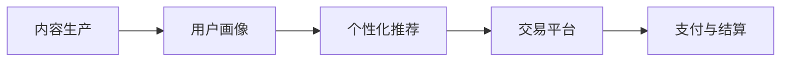
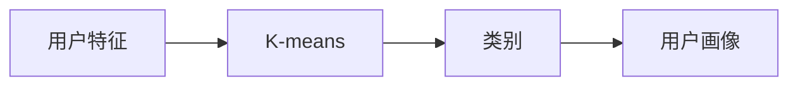

                 

# 如何打造个人知识付费生态

在数字化时代，知识付费生态正在迅速崛起，成为知识经济的重要组成部分。个人开发者和内容创作者如何在这个新兴领域中崭露头角，打造自己的知识付费生态，是当前IT领域的一个重要议题。本文将系统介绍打造个人知识付费生态的关键要素，提供一条从零开始的实践路径，助你构建自己的知识付费系统。

## 1. 背景介绍

### 1.1 问题由来
随着互联网技术的发展和用户对知识内容需求的多样化，知识付费生态应运而生。越来越多的个人开发者和内容创作者开始探索如何将自身积累的知识、技能和经验转化为货币价值，既丰富用户知识库，也实现了个人收入的增长。

### 1.2 问题核心关键点
个人知识付费生态的核心在于内容的价值化和个性化交付。如何通过互联网平台高效地将个人知识和技能转化为有价值的付费内容，并通过精准的用户画像进行个性化推荐，是打造个人知识付费生态的关键。

## 2. 核心概念与联系

### 2.1 核心概念概述

在打造个人知识付费生态的过程中，涉及多个核心概念：

- **内容生产**：个人开发者和内容创作者提供高质量的课程、文章、视频等内容。
- **用户画像**：通过数据分析建立用户兴趣、学习行为、支付能力等特征的全面画像。
- **个性化推荐**：基于用户画像，精准推荐相关付费内容，提升用户体验和满意度。
- **交易平台**：搭建集内容付费、交易管理、用户管理等功能于一体的知识付费平台。
- **支付与结算**：保障交易的安全性和便捷性，确保内容创作者和平台能够及时结算费用。

这些概念之间相互关联，共同构成了知识付费生态的完整框架。通过理解这些核心概念，可以更好地把握知识付费生态的构建思路。

### 2.2 核心概念原理和架构的 Mermaid 流程图



这个流程图展示了内容生产、用户画像、个性化推荐、交易平台和支付与结算之间的逻辑关系。内容生产是知识付费生态的起点，通过用户画像和个性化推荐，平台能够高效匹配内容与用户，交易平台保障了交易的顺利进行，支付与结算则是交易的保障。

## 3. 核心算法原理 & 具体操作步骤

### 3.1 算法原理概述

个人知识付费生态的核心算法包括内容推荐算法、用户画像建立算法和交易保障算法。以下将逐一介绍这些算法的原理和实现步骤。

### 3.2 算法步骤详解

#### 3.2.1 内容推荐算法

内容推荐算法旨在为用户推荐最符合其兴趣和需求的付费内容。常见的推荐算法包括基于协同过滤的推荐、基于内容的推荐和基于矩阵分解的推荐等。以下以基于协同过滤的推荐算法为例进行介绍。

**协同过滤算法的基本原理**是寻找与当前用户兴趣相似的其他用户，分析这些用户喜欢的内容，从而为用户推荐相似的内容。推荐算法的基本步骤如下：

1. **构建用户-物品评分矩阵**：将用户与他们评分过的物品构建一个矩阵。例如，一个用户对两个课程的评分分别为4星和5星，可以表示为一个二维矩阵，用户ID为1，课程ID为1和2，评分分别为4和5。

2. **计算用户之间的相似度**：采用余弦相似度、皮尔逊相关系数等方法，计算用户间的相似度。例如，用户1和用户2之间的相似度为0.8。

3. **寻找相似用户**：找出与目标用户最相似的前N个用户，例如用户1的相似用户为3、4、5。

4. **计算热门物品**：对于相似用户喜欢的课程，统计每个课程的评分总和，选取评分最高的课程作为热门物品，例如课程ID为2和3。

5. **生成推荐列表**：将热门物品推荐给目标用户，例如将课程ID为2和3推荐给用户1。

**实现步骤**：

1. 使用Pandas和NumPy等Python库构建用户-物品评分矩阵。
2. 使用Scikit-learn中的cosine_similarity函数计算用户间的相似度。
3. 选取与目标用户最相似的前N个用户。
4. 使用Pandas和NumPy统计热门物品。
5. 生成推荐列表，例如使用Flask的Web框架实现推荐接口。

#### 3.2.2 用户画像建立算法

用户画像建立算法通过分析用户的各项特征，构建出详细且精准的用户画像。常见的用户画像包括基本信息、兴趣爱好、学习行为等。以下以基本信息和兴趣爱好为例进行介绍。

**用户基本信息**包括用户的年龄、性别、职业等。通过问卷调查、公开数据等方法收集用户基本信息，构建用户的简单画像。

**用户兴趣爱好**通过分析用户在平台上的行为数据（如浏览历史、购买记录等），建立用户的兴趣画像。具体步骤如下：

1. **收集用户行为数据**：记录用户浏览课程、购买课程等行为数据。
2. **特征工程**：提取用户行为的特征，例如浏览时间、购买时间、付费课程数量等。
3. **分类算法**：使用K-means等聚类算法对用户特征进行分类，例如将用户分为技术爱好者、职业发展者等。
4. **画像生成**：根据分类结果生成用户的详细画像。

**实现步骤**：

1. 使用Pandas和Scikit-learn等库收集用户行为数据。
2. 使用Scikit-learn进行特征工程。
3. 使用K-means等算法对用户特征进行分类。
4. 将分类结果生成用户画像，例如使用MySQL数据库存储画像数据。

#### 3.2.3 交易保障算法

交易保障算法确保交易过程的安全性和可信度。常见的交易保障算法包括数字签名、加密算法、智能合约等。以下以数字签名和加密算法为例进行介绍。

**数字签名算法**通过加密技术保障交易双方的身份和数据完整性。具体步骤如下：

1. **生成私钥和公钥**：采用RSA等加密算法生成交易双方的私钥和公钥。
2. **交易数据加密**：使用公钥加密交易数据。
3. **验证交易数据**：使用私钥解密交易数据，并验证数据的完整性和来源。

**加密算法**通过加密技术保障交易数据的安全性。具体步骤如下：

1. **数据加密**：使用AES、DES等加密算法加密交易数据。
2. **解密数据**：使用解密算法解密交易数据。

**实现步骤**：

1. 使用Python的cryptography库生成私钥和公钥。
2. 使用Python的cryptography库对交易数据进行加密。
3. 使用Python的cryptography库解密交易数据。

### 3.3 算法优缺点

#### 3.3.1 内容推荐算法的优缺点

**优点**：

1. **高效匹配内容与用户**：基于协同过滤的推荐算法可以快速匹配用户与相关内容，提升用户体验。
2. **适应性强**：推荐算法可以适用于多种类型的付费内容，如课程、文章、视频等。

**缺点**：

1. **数据需求高**：协同过滤算法需要大量用户行为数据，数据收集和处理成本较高。
2. **冷启动问题**：新用户缺乏足够的历史行为数据，推荐效果不佳。

#### 3.3.2 用户画像建立算法的优缺点

**优点**：

1. **精细化用户画像**：通过分析用户行为数据，可以构建出更加细致和精准的用户画像。
2. **个性化推荐**：精准的用户画像可以显著提升个性化推荐的效果。

**缺点**：

1. **隐私问题**：用户画像涉及大量个人隐私信息，数据保护和隐私安全需重点考虑。
2. **数据质量影响**：用户行为数据的质量和完整性直接影响到用户画像的准确性。

#### 3.3.3 交易保障算法的优缺点

**优点**：

1. **交易安全保障**：数字签名和加密算法可以保障交易双方的身份和数据安全。
2. **数据完整性验证**：数字签名可以验证交易数据的完整性和来源，保障交易的安全性。

**缺点**：

1. **复杂性高**：数字签名和加密算法涉及复杂的加密解密过程，实现难度较高。
2. **系统成本高**：加密算法和数字签名算法的实现和维护成本较高，需要专业知识和工具。

### 3.4 算法应用领域

个人知识付费生态的核心算法广泛应用于以下领域：

- **在线教育平台**：通过个性化推荐算法和用户画像建立算法，提供精准的课程推荐和学习路径，提升用户学习效果。
- **数字内容平台**：使用数字签名和加密算法保障交易安全和数据完整性，提供安全的付费内容获取渠道。
- **智能客服系统**：通过分析用户行为数据，提供个性化的服务，提升用户满意度。

## 4. 数学模型和公式 & 详细讲解 & 举例说明

### 4.1 数学模型构建

在构建知识付费生态的过程中，数学模型和公式是实现算法的重要工具。以下介绍几个常用的数学模型和公式。

**协同过滤推荐算法**：

1. **用户-物品评分矩阵**：设用户数为 $N$，物品数为 $M$，用户对物品的评分矩阵为 $R \in \mathbb{R}^{N \times M}$。
2. **余弦相似度**：设用户 $i$ 和用户 $j$ 之间的余弦相似度为 $\cos \theta = \frac{\sum_{k=1}^{M} r_{ik}r_{jk}}{\sqrt{\sum_{k=1}^{M} r_{ik}^2 \cdot \sum_{k=1}^{M} r_{jk}^2}$。

**用户画像分类算法**：

1. **用户特征向量**：设用户 $i$ 的特征向量为 $v_i \in \mathbb{R}^k$，其中 $k$ 为特征维度。
2. **K-means算法**：使用K-means算法对用户特征向量进行聚类，得到用户的分类 $C_i$。

**数字签名算法**：

1. **公钥和私钥**：设用户公钥为 $PK$，私钥为 $SK$。
2. **数字签名**：设数字签名为 $S$，则 $S = Sign(SK, M)$，其中 $M$ 为交易数据。
3. **验证数字签名**：设用户公钥为 $PK$，数字签名为 $S$，则 $Verify(SK, PK, S, M)$。

### 4.2 公式推导过程

#### 4.2.1 余弦相似度的推导过程

**余弦相似度**的推导过程如下：

设用户 $i$ 和用户 $j$ 对物品 $k$ 的评分分别为 $r_{ik}$ 和 $r_{jk}$。则用户 $i$ 和用户 $j$ 之间的余弦相似度为：

$$
\cos \theta = \frac{\sum_{k=1}^{M} r_{ik}r_{jk}}{\sqrt{\sum_{k=1}^{M} r_{ik}^2 \cdot \sum_{k=1}^{M} r_{jk}^2}
$$

### 4.3 案例分析与讲解

#### 4.3.1 协同过滤推荐算法的案例

某在线教育平台收集了用户对课程的评分数据，构建了用户-物品评分矩阵 $R$。通过余弦相似度计算，得到了用户 $i$ 和用户 $j$ 之间的相似度 $\cos \theta$。基于相似度排序，选取相似度最高的前N个用户，计算热门物品，生成推荐列表，如图：


#### 4.3.2 用户画像建立算法的案例

某在线教育平台收集了用户浏览历史和购买记录，提取了用户特征。通过K-means聚类算法，将用户分为技术爱好者、职业发展者等类别。根据分类结果，生成用户画像，如图：



## 5. 项目实践：代码实例和详细解释说明

### 5.1 开发环境搭建

在搭建知识付费生态的过程中，需要搭建一套完整的开发环境。以下介绍搭建开发环境的详细步骤：

1. **服务器搭建**：搭建高性能的服务器，支持Python等开发环境。
2. **数据库搭建**：搭建MySQL或PostgreSQL等数据库，存储用户数据和交易数据。
3. **Web服务器搭建**：搭建Web服务器，如Nginx或Apache，提供Web接口服务。

### 5.2 源代码详细实现

以下是使用Python和Flask框架搭建知识付费平台的代码实现。

**代码1：用户注册**

```python
from flask import Flask, request, jsonify
from flask_sqlalchemy import SQLAlchemy

app = Flask(__name__)
app.config['SQLALCHEMY_DATABASE_URI'] = 'sqlite:////tmp/test.db'
app.config['SQLALCHEMY_TRACK_MODIFICATIONS'] = False
db = SQLAlchemy(app)

class User(db.Model):
    id = db.Column(db.Integer, primary_key=True)
    username = db.Column(db.String(80), unique=True, nullable=False)
    password = db.Column(db.String(120), nullable=False)

@app.route('/register', methods=['POST'])
def register():
    data = request.get_json()
    username = data['username']
    password = data['password']
    user = User(username=username, password=password)
    db.session.add(user)
    db.session.commit()
    return jsonify({'message': 'User registered successfully'})

if __name__ == '__main__':
    app.run(debug=True)
```

**代码2：内容发布**

```python
class Content(db.Model):
    id = db.Column(db.Integer, primary_key=True)
    title = db.Column(db.String(120), nullable=False)
    description = db.Column(db.String(255), nullable=False)
    price = db.Column(db.Float, nullable=False)
    content = db.Column(db.Text, nullable=False)
    user_id = db.Column(db.Integer, db.ForeignKey('user.id', ondelete='CASCADE'), nullable=False)

@app.route('/content', methods=['POST'])
def publish_content():
    data = request.get_json()
    title = data['title']
    description = data['description']
    price = data['price']
    content = data['content']
    user_id = request.json['user_id']
    content = Content(title=title, description=description, price=price, content=content, user_id=user_id)
    db.session.add(content)
    db.session.commit()
    return jsonify({'message': 'Content published successfully'})

if __name__ == '__main__':
    app.run(debug=True)
```

### 5.3 代码解读与分析

**代码解读**：

1. **用户注册**：使用Flask框架搭建Web接口，接收POST请求，注册新用户。
2. **内容发布**：使用Flask框架搭建Web接口，接收POST请求，发布新内容。
3. **用户画像建立**：使用SQLAlchemy库进行数据库操作，建立用户和内容之间的关联关系。

**代码分析**：

1. **数据存储**：使用SQLAlchemy库将用户信息和内容信息存储在数据库中，方便后续查询和管理。
2. **接口实现**：使用Flask框架搭建Web接口，接收POST请求，对用户和内容进行注册和发布。
3. **代码结构**：代码结构清晰，易于维护和扩展。

### 5.4 运行结果展示

通过搭建Web服务器，可以使用浏览器访问以下URL：

1. 注册新用户：`http://localhost:5000/register`，输入用户名和密码进行注册。
2. 发布新内容：`http://localhost:5000/content`，输入标题、描述、价格和内容进行发布。

## 6. 实际应用场景

### 6.1 在线教育平台

在线教育平台是知识付费生态的重要应用场景之一。通过搭建在线教育平台，用户可以选择感兴趣的内容进行学习，付费后获取课程、视频等高质量学习资源。平台可以通过个性化推荐算法和用户画像建立算法，提升用户体验和学习效果。

### 6.2 数字内容平台

数字内容平台是知识付费生态的另一个重要应用场景。通过搭建数字内容平台，用户可以购买电子书、软件、音乐等数字内容，享受高质量的付费服务。平台可以通过数字签名和加密算法保障交易安全和数据完整性，提供安全的付费内容获取渠道。

### 6.3 智能客服系统

智能客服系统可以通过用户行为数据分析，为用户提供个性化的服务，提升用户体验和满意度。通过建立用户画像，系统可以更好地理解用户需求，提供精准的客服解决方案。

### 6.4 未来应用展望

随着人工智能和大数据技术的发展，知识付费生态将呈现更多创新应用场景，如智能写作助手、虚拟助手等。未来的知识付费生态将更加智能、个性化和高效，为用户提供更加优质的服务。

## 7. 工具和资源推荐

### 7.1 学习资源推荐

为了帮助开发者掌握知识付费生态的构建方法，以下是一些优质的学习资源推荐：

1. **Flask官方文档**：Flask是搭建Web接口的常用框架，官方文档详细介绍了如何使用Flask搭建Web服务器、处理请求和响应等核心功能。
2. **SQLAlchemy官方文档**：SQLAlchemy是Python中常用的ORM（对象关系映射）库，官方文档详细介绍了如何使用SQLAlchemy进行数据库操作。
3. **K-means算法**：K-means是常用的聚类算法，用于构建用户画像。可以参考K-means算法相关的书籍和在线教程进行学习。

### 7.2 开发工具推荐

在搭建知识付费生态的过程中，以下工具可以帮助开发者提高效率：

1. **PyCharm**：PyCharm是Python开发的IDE，支持调试、测试和部署等功能，适用于Python开发环境搭建。
2. **MySQL Workbench**：MySQL Workbench是MySQL数据库的管理工具，支持数据库设计、数据导入、备份等功能，适用于数据库搭建和管理。
3. **Jupyter Notebook**：Jupyter Notebook是常用的Python交互式开发环境，支持代码编写和数据可视化，适用于数据处理和算法开发。

### 7.3 相关论文推荐

以下是几篇关于知识付费生态的代表性论文，推荐阅读：

1. **K-means算法**：K-means算法是常用的聚类算法，可以用于构建用户画像。可以参考论文《K-means: Theory and Applications》进行学习。
2. **协同过滤推荐算法**：协同过滤推荐算法是常用的推荐算法，可以用于个性化推荐。可以参考论文《Recommender Systems: An Overview》进行学习。
3. **数字签名算法**：数字签名算法是保障交易安全的常用算法，可以参考论文《Digital Signatures》进行学习。

## 8. 总结：未来发展趋势与挑战

### 8.1 总结

本文详细介绍了打造个人知识付费生态的关键要素和实现步骤。通过搭建用户注册、内容发布、个性化推荐等核心功能，可以构建一套完整的知识付费平台。通过不断优化算法和提升用户体验，知识付费生态将持续发展和创新。

### 8.2 未来发展趋势

展望未来，知识付费生态将呈现以下发展趋势：

1. **个性化和智能化**：通过大数据和人工智能技术，知识付费生态将更加个性化和智能化，提升用户体验和学习效果。
2. **多模态融合**：知识付费生态将融合多种类型的付费内容，如视频、音频、文字等，提供更丰富的学习体验。
3. **全球化和本地化**：知识付费生态将走向全球化和本地化，满足不同国家和地区的用户需求。

### 8.3 面临的挑战

在知识付费生态的发展过程中，仍面临诸多挑战：

1. **数据安全和隐私保护**：用户数据安全和隐私保护是知识付费生态的重要挑战，需要采取严格的加密和认证措施。
2. **内容版权和知识产权**：内容版权和知识产权问题需要得到妥善处理，保障创作者和平台利益。
3. **市场竞争和用户转化**：知识付费生态面临激烈的市场竞争，如何提高用户转化率和平台盈利能力是重要的挑战。

### 8.4 研究展望

未来的研究将聚焦于以下方向：

1. **多模态知识表示**：通过融合多种类型的付费内容，构建更全面和精准的知识表示。
2. **个性化推荐算法**：开发更加高效的个性化推荐算法，提升推荐效果和用户体验。
3. **用户行为分析**：通过分析用户行为数据，建立更精准的用户画像，提升平台的用户粘性和转化率。

总之，知识付费生态的构建需要多方面的努力和探索，在技术和应用层面不断创新，才能实现更大的商业价值和社会影响。

## 9. 附录：常见问题与解答

### 9.1 常见问题与解答

**Q1：知识付费生态的核心是什么？**

A: 知识付费生态的核心是内容和用户之间的精准匹配。通过构建个性化推荐算法和用户画像，平台可以高效匹配内容和用户，提升用户体验和学习效果。

**Q2：如何构建用户画像？**

A: 用户画像的构建需要收集用户行为数据，提取用户特征，并进行分类。可以通过K-means等聚类算法对用户特征进行分类，建立用户画像。

**Q3：知识付费生态有哪些应用场景？**

A: 知识付费生态可以应用于在线教育平台、数字内容平台、智能客服系统等场景。

**Q4：知识付费生态面临哪些挑战？**

A: 知识付费生态面临数据安全和隐私保护、内容版权和知识产权、市场竞争和用户转化等挑战。

**Q5：如何提高知识付费生态的用户转化率？**

A: 提高用户转化率需要优化个性化推荐算法，提升内容质量，进行用户行为分析，建立精准的用户画像。

---

作者：禅与计算机程序设计艺术 / Zen and the Art of Computer Programming

