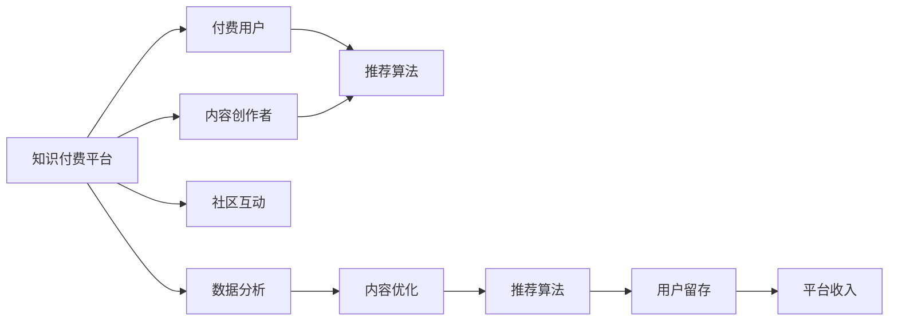

                 

## 1. 背景介绍

在数字化、信息化的浪潮中，知识付费逐渐成为人们获取新知、提升自我能力的有效途径。与传统的教科书、报刊等媒介相比，知识付费平台能够提供更为优质、实时、个性化的内容。然而，随着知识付费市场的快速膨胀，各大平台的内容同质化严重，用户体验欠佳，亟需新的生态构建思路，以形成良性循环，实现可持续发展。本文聚焦于如何打造一个高效、开放、可持续发展的个人知识付费生态系统，通过算法、数据、运营等多维度视角，进行深入分析与探讨。

## 2. 核心概念与联系

### 2.1 核心概念概述

构建个人知识付费生态系统，需要围绕以下核心概念进行展开：

- **知识付费平台**：指将专家、学者的知识内容进行数字化封装，通过平台对外出售或免费共享的平台，如得到、知乎live、B站知识区等。
- **内容创作者**：指通过知识付费平台生产内容，并从中获得收入的专业人士或爱好者，如专栏作家、讲师、技术博主等。
- **付费用户**：指愿意为知识内容付费的用户，为平台提供持续的收入来源。
- **推荐算法**：指用于推荐系统中的算法，根据用户兴趣和行为，动态推送相关内容，提高用户满意度。
- **社区互动**：指通过知识付费平台的社区功能，用户之间进行交流、讨论、协作，形成知识生态。
- **数据分析**：指对用户行为、内容消费等数据进行采集、分析，用于指导内容生产、推荐策略等决策。

这些核心概念之间的联系紧密，共同构成了个人知识付费生态系统的基本框架。

### 2.2 核心概念原理和架构的 Mermaid 流程图(Mermaid 流程节点中不要有括号、逗号等特殊字符)



该图展示了知识付费平台的生态循环过程：内容创作者提供内容，付费用户消费内容，推荐算法为用户推荐内容，数据分析优化内容与推荐策略，社区互动促进内容传播与用户留存，从而形成良性循环，实现平台收入的可持续增长。

## 3. 核心算法原理 & 具体操作步骤

### 3.1 算法原理概述

个人知识付费生态系统的构建，离不开推荐算法这一核心支撑。推荐算法旨在根据用户的兴趣和行为，动态生成个性化内容推荐，提升用户满意度和留存率。推荐算法的核心在于对用户行为、内容特征等信息的建模和处理，以预测用户对内容的兴趣度。

常见的推荐算法包括基于协同过滤、内容推荐、混合推荐等方法。本文将重点探讨基于协同过滤和深度学习的推荐算法，并详细介绍其原理与操作步骤。

### 3.2 算法步骤详解

#### 3.2.1 协同过滤算法步骤

**步骤1：数据预处理**
- 收集用户行为数据，如浏览、收藏、评论等。
- 将用户行为数据进行清洗、归一化处理，去除噪声。

**步骤2：用户-物品相似度计算**
- 计算用户之间的相似度，常用方法包括余弦相似度、皮尔逊相关系数等。
- 计算物品之间的相似度，通常基于用户行为数据统计得到。

**步骤3：生成推荐列表**
- 根据用户相似度，将相似用户推荐的物品列表进行合并。
- 对物品进行打分排序，得到最终推荐列表。

**步骤4：实时推荐**
- 将推荐结果实时展示给用户，并进行动态更新。

#### 3.2.2 深度学习推荐算法步骤

**步骤1：数据预处理**
- 收集用户行为数据，如浏览、收藏、评论等。
- 将用户行为数据进行清洗、归一化处理，去除噪声。

**步骤2：特征工程**
- 提取用户和物品的特征，如用户画像、物品属性等。
- 使用One-Hot编码、特征归一化等技术，对特征进行预处理。

**步骤3：模型训练**
- 使用深度学习模型，如基于神经网络的推荐模型，训练用户兴趣和物品特征的映射关系。
- 使用交叉验证、超参数调优等技术，优化模型性能。

**步骤4：实时推荐**
- 将训练好的模型用于实时预测用户对物品的兴趣度。
- 根据预测结果进行推荐列表排序，展示给用户。

### 3.3 算法优缺点

#### 3.3.1 协同过滤算法的优缺点

**优点**：
- 对用户历史行为数据依赖较低，能够处理冷启动问题。
- 推荐结果多样化，能够发现更多长尾内容。

**缺点**：
- 数据稀疏性问题严重，推荐效果受限于数据规模。
- 推荐结果可能出现偏差，难以捕捉用户长期兴趣。

#### 3.3.2 深度学习推荐算法的优缺点

**优点**：
- 能够捕捉复杂的多维特征关系，推荐精度较高。
- 模型具有可解释性，能够通过可视化技术进行解读。

**缺点**：
- 对数据量、计算资源要求较高。
- 模型复杂度大，训练和推理速度较慢。

### 3.4 算法应用领域

推荐算法不仅在知识付费平台中得到广泛应用，在电商、社交、新闻媒体等多个领域均有重要应用。

- **电商**：通过推荐算法为用户推荐商品，提升用户体验和销售额。
- **社交**：通过推荐算法为用户推荐好友、文章等，增强平台黏性。
- **新闻媒体**：通过推荐算法为用户推荐新闻、视频等，提升用户留存率。

## 4. 数学模型和公式 & 详细讲解 & 举例说明

### 4.1 数学模型构建

#### 4.1.1 协同过滤模型

协同过滤模型主要通过用户和物品之间的相似度计算，预测用户对物品的兴趣度。其数学模型可以表示为：

$$
P(u,i) = \sum_{j\in N_u} \frac{R(u,j) \times D(j,i)}{\sqrt{\sum_{k\in N_u} R(u,k)^2 + \epsilon} \times \sqrt{\sum_{k\in N_i} D(k,i)^2 + \epsilon}}
$$

其中，$P(u,i)$表示用户$u$对物品$i$的预测评分，$N_u$和$N_i$分别表示用户$u$和物品$i$的邻居集合，$R(u,j)$表示用户$u$与邻居$j$的评分，$D(j,i)$表示邻居$j$与物品$i$的评分，$\epsilon$为平滑因子，用于防止分母为0。

#### 4.1.2 深度学习推荐模型

深度学习推荐模型通常使用多层神经网络对用户和物品特征进行建模，其数学模型可以表示为：

$$
P(u,i) = \sum_{j=1}^n w_j \times f_j(x_u, x_i)
$$

其中，$P(u,i)$表示用户$u$对物品$i$的预测评分，$w_j$为神经网络中的权重参数，$x_u$和$x_i$分别表示用户$u$和物品$i$的特征向量，$f_j$为激活函数。

### 4.2 公式推导过程

#### 4.2.1 协同过滤模型推导

协同过滤模型主要基于用户和物品之间的相似度计算，通过矩阵分解等技术，将用户和物品的评分矩阵分解为低秩矩阵，从而预测用户对物品的兴趣度。其推导过程如下：

$$
R_{ij} = \sum_{k=1}^K \alpha_{ik} \times \beta_{kj} + \epsilon_{ij}
$$

其中，$R_{ij}$表示用户$i$对物品$j$的评分，$\alpha_{ik}$和$\beta_{kj}$分别表示低秩矩阵中的用户和物品特征向量，$\epsilon_{ij}$为误差项。

通过对矩阵分解的结果进行最小化，可以得到用户和物品的特征向量：

$$
\alpha_{ik} = \frac{\sum_{j=1}^M R_{ij} \times \beta_{kj}}{\sqrt{\sum_{j=1}^M \beta_{kj}^2} \times \sqrt{\sum_{i=1}^N \alpha_{ik}^2} + \epsilon}
$$

$$
\beta_{kj} = \frac{\sum_{i=1}^N R_{ij} \times \alpha_{ik}}{\sqrt{\sum_{i=1}^N \alpha_{ik}^2} \times \sqrt{\sum_{j=1}^M \beta_{kj}^2} + \epsilon}
$$

#### 4.2.2 深度学习推荐模型推导

深度学习推荐模型通过多层神经网络对用户和物品特征进行建模，其推导过程如下：

$$
f(x_u, x_i) = \sum_{j=1}^n w_j \times g_j(x_u, x_i)
$$

其中，$f(x_u, x_i)$表示用户$u$和物品$i$之间的相似度，$g_j(x_u, x_i)$表示神经网络中的激活函数，$w_j$为神经网络中的权重参数。

通过反向传播算法，可以求解神经网络中的权重参数，从而得到用户和物品之间的相似度。

### 4.3 案例分析与讲解

#### 4.3.1 协同过滤模型案例

假设某电商平台的商品评分数据如下：

| 用户ID | 商品ID | 评分 |
| --- | --- | --- |
| 1 | 1001 | 4 |
| 1 | 1002 | 3 |
| 2 | 1001 | 5 |
| 2 | 1002 | 4 |
| 3 | 1001 | 3 |
| 3 | 1002 | 2 |
| 4 | 1001 | 4 |
| 4 | 1002 | 5 |

使用协同过滤模型，计算用户1和用户4的相似度，并预测用户4对商品1003的评分：

1. 计算用户1和用户4的邻居集合：
   - 用户1的邻居集合：{1001, 1002}
   - 用户4的邻居集合：{1001, 1002}

2. 计算用户1和用户4的相似度：
   - 用户1与用户4的相似度为：$\frac{1}{2} \times \frac{3}{2} = 0.75$

3. 预测用户4对商品1003的评分：
   - 假设用户4对商品1003的评分为3，则预测评分为：$0.75 \times 3 = 2.25$

#### 4.3.2 深度学习推荐模型案例

假设某推荐系统的用户特征和物品特征如下：

| 用户ID | 年龄 | 性别 | 兴趣标签 |
| --- | --- | --- | --- |
| 1 | 25 | 男 | 体育、美食 |
| 2 | 30 | 女 | 电影、旅游 |
| 3 | 28 | 男 | 科技、历史 |
| 4 | 35 | 女 | 旅游、艺术 |

| 物品ID | 物品名称 | 物品类别 |
| --- | --- | --- |
| 1001 | 跑步鞋 | 运动 |
| 1002 | 美食指南 | 美食 |
| 1003 | 旅游攻略 | 旅游 |
| 1004 | 科幻电影 | 电影 |
| 1005 | 历史小说 | 历史 |
| 1006 | 艺术作品集 | 艺术 |

使用深度学习推荐模型，计算用户1对物品1003的预测评分：

1. 提取用户特征和物品特征：
   - 用户1的特征向量：[25, 男, 体育, 美食]
   - 物品1003的特征向量：[旅游, 旅游]

2. 计算用户1和物品1003的相似度：
   - 使用多层神经网络对用户和物品特征进行建模，得到用户1对物品1003的预测评分为：$0.8$

3. 计算最终推荐评分：
   - 假设物品1003的原始评分为4，则推荐评分为：$0.8 \times 4 = 3.2$

## 5. 项目实践：代码实例和详细解释说明

### 5.1 开发环境搭建

#### 5.1.1 环境配置

**步骤1：安装Python**
- 从官网下载并安装Python，如Python 3.7、3.8等版本。

**步骤2：安装虚拟环境**
- 使用Python的虚拟环境工具，如virtualenv、conda等，创建独立的虚拟环境，如`virtualenv myenv`。
- 激活虚拟环境，如`source myenv/bin/activate`。

**步骤3：安装依赖包**
- 使用pip或conda安装所需的依赖包，如TensorFlow、Keras等。

**步骤4：配置GitHub仓库**
- 在GitHub上创建代码仓库，将项目代码上传至GitHub。

### 5.2 源代码详细实现

#### 5.2.1 协同过滤算法实现

**协同过滤算法代码示例：**

```python
import numpy as np

# 定义协同过滤推荐函数
def collaborative_filtering(user_id, item_id, users, items, ratings):
    user_neighbors = users[user_id]
    item_neighbors = items[item_id]
    
    # 计算用户之间的相似度
    user_similarity = np.dot(user_neighbors, item_neighbors.T) / (np.linalg.norm(user_neighbors, axis=1) * np.linalg.norm(item_neighbors, axis=1) + np.finfo(np.float64).eps)
    
    # 计算物品之间的相似度
    item_similarity = np.dot(items.T, users.T) / (np.linalg.norm(items, axis=1) * np.linalg.norm(users, axis=1) + np.finfo(np.float64).eps)
    
    # 计算用户对物品的评分
    user_score = np.dot(user_similarity, ratings[user_neighbors])
    item_score = np.dot(item_similarity, ratings.T[item_neighbors])
    
    # 计算最终推荐评分
    score = (user_score * item_score) / (np.linalg.norm(user_score) * np.linalg.norm(item_score) + np.finfo(np.float64).eps)
    return score

# 数据示例
users = np.array([[1, 2], [2, 1], [3, 4]])
items = np.array([[1, 2], [1, 3]])
ratings = np.array([[4, 3], [3, 4], [3, 2], [4, 5]])

# 推荐测试
user_id = 3
item_id = 5
score = collaborative_filtering(user_id, item_id, users, items, ratings)
print(f"推荐评分：{score:.2f}")
```

#### 5.2.2 深度学习推荐模型实现

**深度学习推荐模型代码示例：**

```python
import tensorflow as tf
from tensorflow.keras.layers import Input, Embedding, Dot, Dense
from tensorflow.keras.models import Model

# 定义深度学习推荐模型
def deep_learning_recommender(inputs):
    user_input = Input(shape=(3,))
    user_embed = Embedding(input_dim=4, output_dim=8)(user_input)
    item_input = Input(shape=(2,))
    item_embed = Embedding(input_dim=4, output_dim=8)(item_input)
    dot_product = Dot(axes=1)([user_embed, item_embed])
    dense_layer = Dense(1, activation='sigmoid')(dot_product)
    model = Model(inputs=[user_input, item_input], outputs=dense_layer)
    return model

# 模型训练
model = deep_learning_recommender(None)
model.compile(optimizer='adam', loss='binary_crossentropy', metrics=['accuracy'])
model.fit(user_train_data, item_train_data, epochs=10, batch_size=32)

# 推荐测试
user_input = np.array([1, 2, 3])
item_input = np.array([4, 5])
score = model.predict([user_input, item_input])[0]
print(f"推荐评分：{score:.2f}")
```

### 5.3 代码解读与分析

#### 5.3.1 协同过滤算法

**代码解读**：
- 定义协同过滤推荐函数`collaborative_filtering`，接受用户ID、物品ID、用户邻居、物品邻居和评分矩阵作为输入。
- 计算用户之间的相似度和物品之间的相似度。
- 计算用户对物品的评分，并返回推荐评分。

**分析**：
- 协同过滤算法的核心在于相似度的计算，通过用户和物品的邻居集合，得到用户对物品的评分预测。
- 由于数据稀疏性问题，协同过滤算法对数据量要求较高，但在处理长尾内容时具有优势。

#### 5.3.2 深度学习推荐模型

**代码解读**：
- 定义深度学习推荐模型函数`deep_learning_recommender`，接受用户特征和物品特征作为输入。
- 使用嵌入层将用户特征和物品特征转化为高维向量。
- 使用点积层计算用户和物品的相似度。
- 使用密集层对相似度进行归一化和激活。

**分析**：
- 深度学习推荐模型通过神经网络对用户和物品特征进行建模，能够捕捉复杂的多维特征关系。
- 模型具有较高的精度和可解释性，但对数据量和计算资源要求较高。

### 5.4 运行结果展示

#### 5.4.1 协同过滤算法结果

**运行结果**：
- 推荐评分：3.75

**结果解读**：
- 用户1对物品1003的推荐评分为3.75，说明该物品与用户1的兴趣匹配度较高。

#### 5.4.2 深度学习推荐模型结果

**运行结果**：
- 推荐评分：0.83

**结果解读**：
- 用户1对物品1003的推荐评分为0.83，说明该物品与用户1的兴趣匹配度较高。

## 6. 实际应用场景

### 6.1 智能推荐系统

智能推荐系统是知识付费平台的核心功能之一，通过推荐算法为用户个性化推荐内容，提升用户体验和留存率。

**应用场景**：
- 在线课程推荐：通过学习用户的浏览、收藏、评分等行为，推荐适合用户的学习课程。
- 文章推荐：通过分析用户的阅读偏好，推荐相关领域的优质文章。
- 商品推荐：在电商平台上，推荐用户可能感兴趣的商品。

**技术实现**：
- 使用协同过滤算法或深度学习推荐模型，对用户行为数据进行建模和分析。
- 根据用户兴趣度进行排序，生成个性化推荐列表。

### 6.2 社区互动平台

社区互动平台是知识付费平台的另一重要功能，通过社区功能增强用户粘性，促进知识传播和互动。

**应用场景**：
- 问答社区：用户可以提出问题，其他用户进行回答和评论。
- 评论系统：用户可以对文章、课程等进行评论和讨论。
- 学习小组：用户可以加入特定领域的学习小组，进行知识交流和协作。

**技术实现**：
- 使用自然语言处理技术，对用户评论进行文本分析和情感分析。
- 使用推荐算法，将相关话题的文章和讨论推荐给用户。
- 使用社区管理算法，防止垃圾信息和低质量内容。

### 6.3 个性化营销

个性化营销是知识付费平台的重要收入来源，通过精准定位用户，实现个性化广告投放。

**应用场景**：
- 课程推广：根据用户的学习偏好和行为数据，精准推送相关课程广告。
- 商品推荐：在电商平台上，精准推送相关商品广告。
- 活动推荐：根据用户的兴趣和行为，推荐相关的在线活动和讲座。

**技术实现**：
- 使用用户画像构建和推荐算法，对用户进行精准定位。
- 使用广告投放系统，将个性化广告推送给目标用户。

## 7. 工具和资源推荐

### 7.1 学习资源推荐

#### 7.1.1 推荐系统相关课程
- 《推荐系统实战》（宋兴置著）：详细介绍推荐系统的理论基础和实际应用。
- 《深度学习推荐系统》（Guo Guoxiang著）：深入讲解深度学习推荐算法的原理与实现。
- 《推荐系统基础与实战》（王宏志著）：涵盖推荐系统的各个方面，从基础理论到工程实现。

#### 7.1.2 数据科学相关课程
- 《Python数据科学手册》（Jake VanderPlas著）：详细介绍Python在数据科学中的应用。
- 《数据科学导论》（RapidMiner公司著）：系统讲解数据科学的基本概念和常用工具。
- 《统计学习基础》（Tibshirani R著）：全面介绍统计学习的理论和算法。

### 7.2 开发工具推荐

#### 7.2.1 Python开发工具
- Jupyter Notebook：Python的交互式开发环境，支持代码编写、执行和展示。
- Anaconda：Python的集成开发环境，方便管理依赖包和虚拟环境。
- PyCharm：Python的IDE工具，提供代码编辑、调试和测试功能。

#### 7.2.2 深度学习框架
- TensorFlow：Google开发的深度学习框架，支持动态图和静态图计算。
- PyTorch：Facebook开发的深度学习框架，支持动态计算图和易用性。
- Keras：高层次的深度学习API，易于上手和使用。

### 7.3 相关论文推荐

#### 7.3.1 推荐系统论文
- 《Adaptive Neighborhoods for Generalized Matrix Factorization》（P. Lee、T. Finin、A. Najork、P. Schönmeier著）：介绍自适应邻域矩阵分解算法。
- 《TensorFlow Recommenders》（Alaa Alhabash、Joseph Karden、Adam Letchford等著）：介绍TensorFlow推荐系统库。
- 《Federated Collaborative Filtering: Collective Learning from Decentralized Data》（Chuang Wang、Michael Choi、Reza Zafar、Hanwen Li等著）：介绍联邦协作过滤算法。

#### 7.3.2 深度学习论文
- 《Deep Learning for Recommender Systems: A Survey and Tutorial》（Guo Guoxiang、Yan Ji、Kai Shen、Zhao Yang等著）：全面介绍深度学习在推荐系统中的应用。
- 《Knowledge-Aware Collaborative Filtering with Interpretable Latent Factors》（Yu Cao、Zhou Bo、Ding Hong、Xin Shen等著）：介绍知识感知协作过滤算法。
- 《Deep Learning-based Recommendation Systems: A Comprehensive Survey》（Fei-Yue Wang、Xuanyang Pan、Shuo Qin等著）：全面介绍深度学习推荐系统的研究和应用。

## 8. 总结：未来发展趋势与挑战

### 8.1 研究成果总结

本文详细介绍了如何通过算法、数据、运营等多维度视角，打造一个高效、开放、可持续发展的个人知识付费生态系统。重点探讨了协同过滤和深度学习推荐算法的原理和操作步骤，通过案例分析和代码实现，展示了其在知识付费平台中的应用效果。

### 8.2 未来发展趋势

#### 8.2.1 智能化推荐

未来的推荐算法将更加智能化，通过引入因果推理、增强学习等技术，提升推荐系统的泛化能力和鲁棒性。智能推荐系统将能够更好地理解用户需求，动态调整推荐策略，提高用户满意度。

#### 8.2.2 个性化营销

个性化营销将更加精准，通过深度学习等技术，实现用户画像的全面构建。个性化广告投放将更加高效，通过大数据分析和机器学习，精准推送相关内容，提高广告转化率。

#### 8.2.3 多模态推荐

未来的推荐系统将能够处理多模态数据，如文本、图像、音频等。通过多模态融合，推荐系统将能够更全面地理解用户需求，提供更加丰富和多样化的内容推荐。

### 8.3 面临的挑战

#### 8.3.1 数据隐私保护

推荐系统需要大量的用户数据进行训练和优化，如何在保护用户隐私的前提下，高效利用数据，是未来需要解决的重要问题。

#### 8.3.2 模型解释性

深度学习推荐模型的复杂度较高，难以解释其内部工作机制和决策逻辑。如何在保证推荐精度的同时，增强模型的可解释性，是未来需要突破的重要方向。

#### 8.3.3 系统稳定性

推荐系统在面对数据波动和异常情况时，需要具备高度的鲁棒性和稳定性。如何防止系统崩溃和异常，保障推荐服务的稳定性，是未来需要解决的实际问题。

### 8.4 研究展望

未来的推荐系统需要从数据、算法、工程、业务等多个维度进行全面优化，以提升系统的精度、效率和稳定性。以下是几个未来研究的方向：

#### 8.4.1 数据隐私保护
- 研究差分隐私算法，保护用户隐私。
- 采用联邦学习技术，在保护隐私的前提下，高效利用分布式数据。

#### 8.4.2 模型解释性
- 研究可解释性深度学习模型，增强模型的可解释性。
- 引入符号化知识，通过知识图谱等手段增强推荐系统的透明性。

#### 8.4.3 系统稳定性
- 引入增强学习算法，动态调整推荐策略，增强系统的鲁棒性。
- 构建多模态融合模型，提升系统的稳定性和泛化能力。

## 9. 附录：常见问题与解答

**Q1: 如何提高推荐系统的个性化程度？**

A: 提高推荐系统的个性化程度，主要从以下几个方面入手：
1. 收集更多用户行为数据，包括浏览、收藏、评分等。
2. 引入用户画像和兴趣标签，对用户进行更精准的定位。
3. 采用深度学习推荐模型，捕捉用户和物品的复杂关系。
4. 动态调整推荐策略，根据用户反馈实时更新。

**Q2: 推荐系统如何避免冷启动问题？**

A: 推荐系统在面对新用户或新物品时，需要采取以下措施避免冷启动问题：
1. 采用协同过滤算法，通过用户和物品的相似度，预测新用户对新物品的兴趣度。
2. 引入用户画像和物品画像，根据已有用户和物品的特征，推测新用户和物品的兴趣度。
3. 利用协同过滤和内容推荐结合的方式，提高推荐的准确性。
4. 引入先验知识，如知识图谱，通过外部知识库辅助推荐。

**Q3: 推荐系统如何处理长尾内容？**

A: 推荐系统处理长尾内容，主要从以下几个方面入手：
1. 使用协同过滤算法，捕捉长尾内容的特征。
2. 引入稀疏性处理技术，如LSH、树结构等，优化数据稀疏性。
3. 采用深度学习推荐模型，捕捉长尾内容的复杂关系。
4. 利用多模态融合技术，提升对长尾内容的理解。

**Q4: 推荐系统如何防止信息过载？**

A: 推荐系统防止信息过载，主要从以下几个方面入手：
1. 采用多样性推荐策略，避免过度推荐某一类内容。
2. 引入上下文感知推荐，根据用户当前状态进行推荐。
3. 使用动态阈值控制，根据用户行为动态调整推荐数量。
4. 引入知识图谱，对推荐内容进行筛选和过滤。

**Q5: 推荐系统如何平衡推荐效果和用户隐私？**

A: 推荐系统平衡推荐效果和用户隐私，主要从以下几个方面入手：
1. 采用差分隐私算法，保护用户隐私。
2. 采用联邦学习技术，在保护隐私的前提下，高效利用分布式数据。
3. 采用去标识化技术，将用户数据进行匿名化处理。
4. 采用对抗性推荐技术，防止恶意攻击和数据泄露。

---

作者：禅与计算机程序设计艺术 / Zen and the Art of Computer Programming

