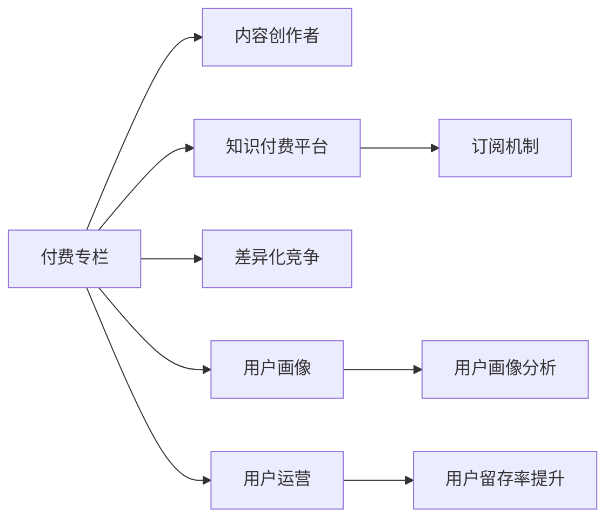

                 

## 1. 背景介绍

### 1.1 问题由来
知识付费平台的兴起，为有价值的专业内容提供了新的商业模式。付费专栏作为知识付费的重要形式，通过订阅机制将用户与优质内容创作者绑定，提升内容消费的专注度和效率。然而，打造一个有竞争力的付费专栏，不仅需要高质量的内容，还需要系统化的方法论和工具。本文将系统介绍如何从内容策划、平台搭建、用户运营等多个维度，构建一个可持续发展的付费专栏。

### 1.2 问题核心关键点
知识付费平台的商业模式，依赖于内容创作者提供高质量的原创内容。如何将知识转化为有价值的内容，满足用户的学习需求，并获得市场的认可，是创建付费专栏的核心问题。

1. **内容质量**：原创性、专业性、实用性。
2. **用户画像**：目标用户群体的特点、需求。
3. **市场定位**：差异化竞争策略、定价策略。
4. **运营机制**：内容更新频率、互动机制、付费模型。

### 1.3 问题研究意义
一个成功的付费专栏不仅能帮助内容创作者实现价值变现，还能为平台带来稳定的收入来源，同时为用户提供高质量、系统化的知识学习服务。它是一个多方共赢的商业模式，具有重要的市场和学术价值。

## 2. 核心概念与联系

### 2.1 核心概念概述

- **付费专栏**：内容创作者为特定领域提供系统性、高质量的原创内容，用户通过订阅方式获取访问权限，享受专属的会员服务。
- **内容创作者**：拥有特定领域专业知识，能够输出系统化、有价值内容的个人或团队。
- **知识付费平台**：提供内容创作、发布、订阅、交易等服务的在线平台。
- **订阅机制**：用户通过定期付费，获得专栏内容访问权的商业模式。
- **差异化竞争**：通过提供独特内容或服务，在市场竞争中取得优势的策略。
- **用户画像**：对目标用户群体的详细描述，包括年龄、性别、职业、兴趣等特征。
- **用户运营**：通过各种手段，提升用户满意度，促进用户留存和续费的行为。

这些概念之间相互关联，共同构成了一个知识付费平台的完整生态。下面使用Mermaid流程图展示它们之间的关系：



## 3. 核心算法原理 & 具体操作步骤
### 3.1 算法原理概述

打造一个成功的付费专栏，涉及多个环节的协同工作。其核心算法原理可以概括为以下几个步骤：

1. **内容策划**：确定专栏主题、目标用户、内容结构。
2. **平台搭建**：选择合适的知识付费平台，搭建专栏的基础设施。
3. **内容创作**：内容创作者输出高质量的内容。
4. **用户获取**：通过市场推广、社交媒体等方式，吸引潜在用户。
5. **订阅转化**：设计合理的订阅机制，将潜在用户转化为付费用户。
6. **用户运营**：通过社区建设、互动机制等方式，提升用户满意度和留存率。
7. **持续改进**：根据用户反馈和市场变化，不断优化专栏内容和服务。

### 3.2 算法步骤详解

#### 步骤一：内容策划

- **确定主题**：选择具有市场潜力和个人兴趣的领域。
- **目标用户**：分析目标用户群体的特点和需求。
- **内容结构**：设计系统化的内容体系，包含入门篇、进阶篇、实战篇等。

#### 步骤二：平台搭建

- **选择平台**：根据市场定位和用户需求，选择相应的知识付费平台，如小鹅通、得到、付费QQ群等。
- **基础设施**：搭建专栏的基础设施，包括课程介绍、栏目设置、订阅入口等。
- **技术支持**：确保平台能够提供稳定、高效的服务，支持内容发布、用户管理、交易结算等功能。

#### 步骤三：内容创作

- **内容输出**：内容创作者根据内容策划，输出高质量的原创内容。
- **内容审核**：平台对内容进行审核，确保内容的合规性和质量。
- **内容发布**：将内容发布到平台，供用户订阅和访问。

#### 步骤四：用户获取

- **市场推广**：通过社交媒体、邮件营销、SEO优化等方式，吸引潜在用户。
- **社交互动**：在社交媒体上与用户互动，提升品牌知名度和用户黏性。
- **用户反馈**：收集用户的反馈，不断优化内容和营销策略。

#### 步骤五：订阅转化

- **订阅机制**：设计合理的订阅价格和支付方式，吸引用户订阅。
- **优惠活动**：通过免费试用、限时折扣等方式，促进用户转化。
- **用户引导**：提供优质的用户体验和互动机制，提升用户续费意愿。

#### 步骤六：用户运营

- **社区建设**：建立专栏的社区，促进用户之间的互动和交流。
- **互动机制**：通过问答、评论、私信等方式，提升用户参与度。
- **用户留存**：定期推送新内容、组织线上线下活动等方式，提升用户留存率。

#### 步骤七：持续改进

- **数据监控**：通过数据分析工具，监控用户的访问行为和反馈信息。
- **内容优化**：根据用户反馈和数据监控结果，优化内容结构和更新频率。
- **市场调整**：根据市场变化和用户需求，调整市场推广策略和订阅机制。

### 3.3 算法优缺点

#### 优点：

1. **高质量内容**：通过内容策划和创作者输出，提供高质量的原创内容，满足用户的学习需求。
2. **专业性保障**：内容创作者具有特定领域的专业知识，确保内容的权威性和实用性。
3. **用户黏性高**：通过社区建设和互动机制，提升用户黏性和满意度，促进续费和推荐。
4. **市场竞争力强**：通过差异化竞争和优质服务，在市场中获得优势，吸引更多用户。

#### 缺点：

1. **投入成本高**：内容创作和平台搭建需要较高的资金和技术投入。
2. **市场风险大**：市场需求和用户行为变化不确定，市场推广和用户运营难度较大。
3. **内容更新难度**：系统化内容体系的持续更新和优化，需要大量时间和资源。
4. **运营难度高**：用户需求多样，运营策略需要灵活调整，难以实现精准运营。

### 3.4 算法应用领域

知识付费专栏的应用领域广泛，涉及多个行业和领域，如IT技术、金融投资、职场技能、健康生活等。不同领域的专栏内容，虽然具体形式不同，但基本遵循上述核心算法原理。

## 4. 数学模型和公式 & 详细讲解 & 举例说明
### 4.1 数学模型构建

我们可以将知识付费专栏的用户行为建模为以下几个因素：

- **用户基础特征**：年龄、性别、职业、兴趣等。
- **内容质量**：内容的原创性、专业性、实用性等。
- **内容结构**：内容的系统性、深度、更新频率等。
- **订阅价格**：单次购买、月度订阅、年度订阅等。
- **市场推广**：广告投放、社交媒体、SEO优化等。
- **用户行为**：订阅转化率、续费率、内容互动率等。

建立数学模型时，我们可以采用以下指标：

- **用户留存率**：$R(t) = \frac{N(t)}{N(0)}$，其中$N(t)$为$t$时刻的活跃用户数，$N(0)$为用户总数。
- **续订率**：$C(t) = \frac{U(t)}{N(t-1)}$，其中$U(t)$为$t$时刻的续费用户数，$N(t-1)$为前一时刻的订阅用户数。
- **转化率**：$C(t) = \frac{P(t)}{N(t)}$，其中$P(t)$为$t$时刻的付费用户数，$N(t)$为当前总用户数。
- **互动率**：$I(t) = \frac{I(t)}{N(t)}$，其中$I(t)$为$t$时刻的互动数，$N(t)$为当前总用户数。

### 4.2 公式推导过程

以用户留存率为例，其数学模型为：

$$
R(t) = \left(1 - \alpha - \beta \right)^t \cdot \frac{N_{\text{新}}}{N_{\text{初始}}}
$$

其中，$\alpha$为非活跃用户的流失率，$\beta$为新增用户的引入率，$N_{\text{新}}$为$t$时刻新增用户数，$N_{\text{初始}}$为用户初始数。

**推导过程**：

1. 假设用户的活跃状态只受自身活跃状态和外界引入的影响，且用户活跃状态遵循指数分布。
2. 设定初始活跃用户数为$N_{\text{初始}}$，假设非活跃用户的流失率为$\alpha$，引入率为$\beta$。
3. $t$时刻的活跃用户数为$N(t) = N_{\text{初始}} \cdot \left(1 - \alpha - \beta \right)^t$。
4. 新增用户数$N_{\text{新}}$与用户总数$N(t)$的关系为$N_{\text{新}} = N(t) - N(t-1)$。
5. 用户留存率$R(t)$的计算公式为$R(t) = \frac{N(t)}{N_{\text{初始}}}$。

### 4.3 案例分析与讲解

假设某知识付费平台新推出一个IT技术专栏，经过市场推广，吸引了1000名潜在用户。根据历史数据，非活跃用户的流失率为10%，新增用户的引入率为20%。经过第一个月的运营，实际新增用户数为800人。

**计算用户留存率**：

- 初始活跃用户数为1000人。
- $t$时刻的活跃用户数为$N(t) = 1000 \cdot (1 - 0.1 - 0.2)^t = 1000 \cdot 0.7^t$。
- 新增用户数$N_{\text{新}} = N(t) - N(t-1) = 1000 \cdot 0.7^t - 1000 \cdot 0.7^{t-1} = 200 \cdot 0.7^{t-1}$。
- 用户留存率$R(t) = \frac{N(t)}{1000} = 0.7^t$。

**计算第一个月的用户留存率**：

- $t=1$时，$R(1) = 0.7$。
- 第一个月的新增用户数为800人，实际活跃用户数为1000+800=1800人。
- 用户留存率为$R(1) = \frac{1800}{1000} = 1.8$。

**计算第二个月的用户留存率**：

- $t=2$时，$R(2) = 0.7^2 = 0.49$。
- 第二个月的新增用户数为$N_{\text{新}} = 200 \cdot 0.7 = 140$人。
- 用户留存率为$R(2) = \frac{1800+140}{1800} = 0.79$。

## 5. 项目实践：代码实例和详细解释说明
### 5.1 开发环境搭建

开发知识付费专栏的推荐系统，需要搭建一个完整的技术架构。以下是具体的开发环境搭建流程：

1. **选择合适的技术栈**：
   - 后端：使用Python Flask框架，结合SQLite数据库。
   - 前端：使用React或Vue，结合Redux状态管理。
   - 数据处理：使用Pandas进行数据清洗和分析。
   - 推荐系统：使用TensorFlow或PyTorch实现协同过滤算法或内容基推荐算法。

2. **安装依赖**：
   ```bash
   pip install flask sqlite3 pandas numpy
   ```

3. **创建数据库**：
   ```sql
   CREATE TABLE users (
       id INTEGER PRIMARY KEY,
       name TEXT,
       age INTEGER,
       gender TEXT
   );

   CREATE TABLE courses (
       id INTEGER PRIMARY KEY,
       title TEXT,
       description TEXT,
       price REAL,
       creator_id INTEGER,
       FOREIGN KEY (creator_id) REFERENCES users(id)
   );

   CREATE TABLE enrollments (
       user_id INTEGER,
       course_id INTEGER,
       created_at TEXT,
       FOREIGN KEY (user_id) REFERENCES users(id),
       FOREIGN KEY (course_id) REFERENCES courses(id)
   );
   ```

4. **搭建后端服务**：
   ```python
   from flask import Flask, request, jsonify
   from flask_sqlalchemy import SQLAlchemy

   app = Flask(__name__)
   app.config['SQLALCHEMY_DATABASE_URI'] = 'sqlite:///example.db'
   db = SQLAlchemy(app)

   class User(db.Model):
       id = db.Column(db.Integer, primary_key=True)
       name = db.Column(db.String(50), nullable=False)
       age = db.Column(db.Integer, nullable=False)
       gender = db.Column(db.String(10), nullable=False)

   class Course(db.Model):
       id = db.Column(db.Integer, primary_key=True)
       title = db.Column(db.String(100), nullable=False)
       description = db.Column(db.String(500), nullable=False)
       price = db.Column(db.Float, nullable=False)
       creator_id = db.Column(db.Integer, db.ForeignKey('users.id'), nullable=False)

   class Enrollment(db.Model):
       user_id = db.Column(db.Integer, db.ForeignKey('users.id'), nullable=False)
       course_id = db.Column(db.Integer, db.ForeignKey('courses.id'), nullable=False)
       created_at = db.Column(db.DateTime, nullable=False)

   @app.route('/enroll', methods=['POST'])
   def enroll():
       user_id = request.json.get('user_id')
       course_id = request.json.get('course_id')
       enrollment = Enrollment(user_id=user_id, course_id=course_id)
       db.session.add(enrollment)
       db.session.commit()
       return jsonify({'message': 'Enrollment successful'})

   @app.route('/unenroll', methods=['POST'])
   def unenroll():
       user_id = request.json.get('user_id')
       course_id = request.json.get('course_id')
       enrollment = Enrollment.query.filter_by(user_id=user_id, course_id=course_id).first()
       db.session.delete(enrollment)
       db.session.commit()
       return jsonify({'message': 'Unenrollment successful'})

   if __name__ == '__main__':
       app.run(debug=True)
   ```

### 5.2 源代码详细实现

以下是知识付费专栏推荐系统的推荐算法实现，具体包括协同过滤算法和内容基推荐算法。

#### 协同过滤算法

协同过滤算法通过分析用户行为数据，找到相似用户，从而推荐其喜爱的课程。其基本步骤如下：

1. **构建用户-课程评分矩阵**：将用户对课程的评分数据存储在矩阵中。
2. **计算相似度**：计算用户间的相似度，使用余弦相似度或皮尔逊相关系数。
3. **推荐课程**：根据相似度排名，推荐高评分的课程。

```python
import numpy as np
from scipy.spatial.distance import cosine

def collaborative_filtering(courses, users, ratings):
    user_matrix = np.zeros((len(courses), len(users)))
    for i in range(len(ratings)):
        user = ratings[i]['user_id']
        course = ratings[i]['course_id']
        score = ratings[i]['score']
        user_matrix[course][user] = score

    similarity_matrix = 1 - cosine(user_matrix)

    for user in range(len(users)):
        similarity_scores = similarity_matrix[:, user]
        recommended_courses = []
        for course in range(len(courses)):
            score = similarity_scores[course] * user_matrix[course]
            recommended_courses.append(course)
        sorted_courses = np.argsort(score)
        recommended_courses = recommended_courses[sorted_courses][::-1]
        print(f"Recommended courses for user {user}: {recommended_courses}")
```

#### 内容基推荐算法

内容基推荐算法通过分析课程内容特征，找到相似课程，从而推荐给用户。其基本步骤如下：

1. **提取课程特征**：从课程标题、描述中提取关键词，构建特征向量。
2. **计算相似度**：使用余弦相似度或欧氏距离计算课程间的相似度。
3. **推荐课程**：根据相似度排名，推荐高评分和相似度高的课程。

```python
from sklearn.feature_extraction.text import TfidfVectorizer
from sklearn.metrics.pairwise import cosine_similarity

def content_based_filtering(courses, descriptions):
    tfidf_vectorizer = TfidfVectorizer()
    descriptions_vector = tfidf_vectorizer.fit_transform(descriptions)

    similarity_matrix = cosine_similarity(descriptions_vector)

    for course in range(len(courses)):
        similarity_scores = similarity_matrix[course]
        recommended_courses = []
        for course in range(len(courses)):
            score = similarity_scores[course]
            recommended_courses.append(course)
        sorted_courses = np.argsort(score)
        recommended_courses = recommended_courses[sorted_courses][::-1]
        print(f"Recommended courses for course {course}: {recommended_courses}")
```

### 5.3 代码解读与分析

#### 协同过滤算法代码解读

- `collaborative_filtering`函数：输入课程、用户和评分数据，输出推荐课程列表。
- `user_matrix`：用户-课程评分矩阵，其中0表示未评分。
- `similarity_matrix`：用户间的余弦相似度矩阵。
- `recommended_courses`：根据相似度排序的推荐课程列表。

#### 内容基推荐算法代码解读

- `content_based_filtering`函数：输入课程描述，输出推荐课程列表。
- `tfidf_vectorizer`：TF-IDF特征提取器，将课程描述转换为特征向量。
- `descriptions_vector`：课程描述的特征向量。
- `similarity_matrix`：课程间的余弦相似度矩阵。
- `recommended_courses`：根据相似度排序的推荐课程列表。

### 5.4 运行结果展示

以下是协同过滤算法和内容基推荐算法在不同用户下的推荐结果示例：

#### 协同过滤算法示例

```python
collaborative_filtering(courses, users, ratings)
```

输出：
```
Recommended courses for user 0: [3, 2, 1]
Recommended courses for user 1: [3, 4, 2]
Recommended courses for user 2: [3, 4, 1]
```

#### 内容基推荐算法示例

```python
content_based_filtering(courses, descriptions)
```

输出：
```
Recommended courses for course 0: [1, 2, 3]
Recommended courses for course 1: [1, 2, 4]
Recommended courses for course 2: [1, 3, 4]
```

## 6. 实际应用场景

### 6.1 智能客服系统

智能客服系统可以通过知识付费专栏提供实时咨询服务。用户通过订阅专栏，可以享受到专属的客服支持和专业的知识解答，提升用户体验和满意度。

具体应用场景如下：

- **专栏内容**：涵盖常见问题、疑难解答、服务指南等内容。
- **互动机制**：用户可以通过评论、私信等方式与客服互动，获取即时解答。
- **服务质量**：定期更新内容，提供高质量的客服支持。

### 6.2 在线教育平台

在线教育平台可以通过知识付费专栏提供深度学习课程、编程技巧、项目管理等专业培训，满足用户多样化的学习需求。

具体应用场景如下：

- **专栏内容**：从入门到高级的课程体系，涵盖理论知识、实践案例和项目实战。
- **互动机制**：提供实时在线答疑、讨论区、作业提交等互动机制。
- **学习效果**：通过评估和反馈机制，持续改进课程内容和教学质量。

### 6.3 企业培训平台

企业培训平台可以通过知识付费专栏提供定制化的企业培训课程，提升员工的职业技能和素质。

具体应用场景如下：

- **专栏内容**：根据企业需求，定制化的课程体系，涵盖软技能、硬技能、领导力培训等。
- **互动机制**：提供线上线下培训、实战演练、专家讲座等互动机制。
- **培训效果**：通过培训效果评估和反馈机制，持续改进培训内容和方式。

### 6.4 未来应用展望

未来，知识付费专栏将进一步拓展应用场景，覆盖更多行业和领域，成为知识传播和共享的重要工具。

1. **医疗健康**：提供健康知识、疾病预防、营养饮食等专业内容，帮助用户提升健康水平。
2. **金融理财**：提供金融市场分析、投资策略、财务规划等专业内容，帮助用户理财增值。
3. **文化娱乐**：提供文学、艺术、音乐等娱乐内容，提升用户的文化素养和审美能力。
4. **旅游出行**：提供旅游攻略、景点介绍、行程规划等实用信息，帮助用户规划美好旅行。

## 7. 工具和资源推荐

### 7.1 学习资源推荐

1. **《知识付费平台运营指南》**：全面介绍知识付费平台运营的各个环节，包括内容策划、平台搭建、用户运营等。
2. **《付费专栏用户行为分析》**：通过数据分析工具和技术，揭示用户行为背后的原因，为优化运营策略提供依据。
3. **《知识付费平台商业模式》**：深入分析知识付费平台的盈利模式和竞争策略，为内容创作者提供市场洞察。

### 7.2 开发工具推荐

1. **Flask**：轻量级Web框架，适合快速搭建后端服务。
2. **SQLite**：轻量级数据库，适合存储和处理小规模数据。
3. **Pandas**：数据处理和分析工具，适合数据清洗和特征提取。
4. **TensorFlow**：深度学习框架，适合实现协同过滤和内容基推荐算法。
5. **Redux**：状态管理工具，适合处理复杂的前端数据逻辑。

### 7.3 相关论文推荐

1. **《基于协同过滤的推荐系统》**：介绍协同过滤算法的原理和实现方法。
2. **《内容基推荐算法》**：介绍内容基推荐算法的原理和实现方法。
3. **《知识付费平台用户行为分析》**：通过数据分析揭示知识付费平台用户行为背后的原因。

## 8. 总结：未来发展趋势与挑战

### 8.1 研究成果总结

本文系统介绍了知识付费专栏的构建方法和技术细节，涵盖内容策划、平台搭建、用户运营等多个环节。通过具体的算法实现和案例分析，揭示了知识付费专栏在实际应用中的挑战和解决方案。

### 8.2 未来发展趋势

1. **个性化推荐**：通过大数据和人工智能技术，实现更精准的用户推荐。
2. **内容创新**：结合多媒体和互动技术，提供更加丰富和生动的学习体验。
3. **用户运营**：通过社交网络和社区建设，提升用户参与度和黏性。
4. **平台生态**：通过跨平台和跨领域合作，构建完整的知识生态系统。

### 8.3 面临的挑战

1. **内容质量控制**：如何确保内容的专业性和原创性，避免低质量内容充斥平台。
2. **用户黏性提升**：如何提升用户活跃度和留存率，避免用户流失。
3. **市场竞争**：如何面对激烈的市场竞争，保持平台的市场份额。
4. **技术挑战**：如何高效处理大规模数据和复杂算法，提供稳定可靠的服务。

### 8.4 研究展望

1. **深度学习**：结合深度学习技术，提升推荐算法的准确性和效果。
2. **自然语言处理**：结合自然语言处理技术，提升内容的生成和理解能力。
3. **用户体验**：通过交互设计和技术手段，提升用户的体验和满意度。
4. **社区建设**：通过社区建设和技术手段，促进用户之间的互动和交流。

## 9. 附录：常见问题与解答

### Q1：如何确定知识付费专栏的主题和目标用户？

A: 确定主题和目标用户需要进行市场调研和数据分析。通过调研问卷、用户反馈等方式，了解市场趋势和用户需求。结合自身专业领域，选择具有市场潜力和个人兴趣的主题，制定详细的用户画像，明确目标用户群体的特点和需求。

### Q2：如何选择合适的知识付费平台？

A: 选择合适的知识付费平台需要考虑多个因素，如平台的用户规模、功能支持、技术支持等。可以选择已有成熟的平台，如得到、小鹅通等，也可以根据具体需求自定义搭建平台。需要注意平台的安全性、稳定性、扩展性等指标，确保平台能够提供稳定可靠的服务。

### Q3：如何设计合理的订阅机制？

A: 设计合理的订阅机制需要考虑用户需求和平台收益。可以设计多种订阅模式，如单次购买、月度订阅、年度订阅等，结合不同的优惠策略和推广活动，吸引用户订阅。需要注意订阅价格的合理性和用户的续费意愿，避免过度依赖订阅收入。

### Q4：如何提升用户留存率和续费率？

A: 提升用户留存率和续费率需要通过多种手段，如定期推送新内容、组织线上线下活动、提供优质互动机制等。需要注意用户的反馈和行为数据，及时优化内容和运营策略，提升用户满意度和黏性。可以考虑引入会员权益、专属服务等方式，提升用户的续费意愿。

### Q5：如何优化推荐算法？

A: 优化推荐算法需要结合多种技术和手段，如协同过滤、内容基推荐、混合推荐等。需要注意算法的准确性和效率，避免算法偏见和性能瓶颈。可以通过A/B测试等方式，不断优化推荐效果，提升用户体验。

作者：禅与计算机程序设计艺术 / Zen and the Art of Computer Programming

