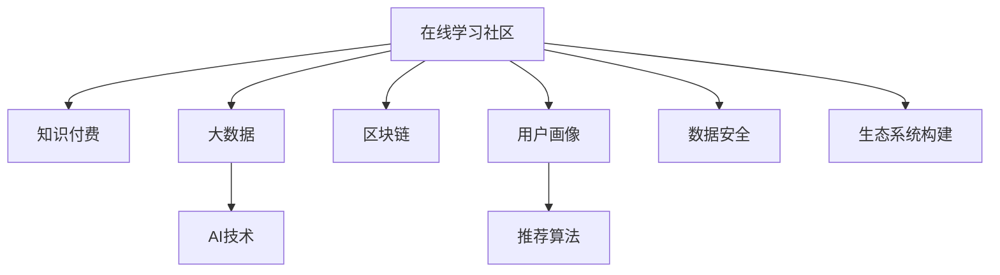

                 

# 如何打造知识付费的在线学习社区

> 关键词：知识付费, 在线学习社区, 大数据, AI, 区块链, 用户画像, 推荐算法, 数据安全, 生态系统构建

## 1. 背景介绍

### 1.1 问题由来
随着互联网的普及和智能设备的普及，在线学习逐渐成为现代人获取知识的重要方式。然而，传统在线学习平台往往存在内容质量参差不齐、用户粘性不高、付费模式单一等问题，无法满足用户的个性化学习需求和多样化学习场景。如何构建一个既优质高效，又能保持良性运营的在线学习社区，成为了一个重要议题。

### 1.2 问题核心关键点
知识付费在线学习社区的核心关键点在于如何基于用户需求提供个性化、高质量的在线课程和资源，同时确保平台盈利和良性运营。这需要从课程内容制作、学习体验设计、用户关系管理等多个维度进行全面思考和创新。

## 2. 核心概念与联系

### 2.1 核心概念概述

为了构建知识付费的在线学习社区，我们需要理解以下核心概念及其联系：

- **在线学习社区**：基于互联网的在线平台，用户可以在线访问课程内容，与讲师、同学互动，实现知识传播和获取。
- **知识付费**：用户为获取深度、高质量的在线课程和资源，需支付一定的费用。这种方式激励内容创作者提供更多优质内容，也保障了平台盈利。
- **大数据**：通过收集、分析用户行为数据，可以发现用户需求、改进课程内容，优化学习体验。
- **AI技术**：利用机器学习、自然语言处理等AI技术，实现内容推荐、智能辅导等功能。
- **区块链**：通过区块链技术，保障内容版权、用户隐私、交易透明，提升社区信任度。
- **用户画像**：基于用户历史行为、社交网络等数据，构建用户特征模型，实现个性化推荐。
- **推荐算法**：利用协同过滤、内容推荐、时间序列预测等算法，为用户推荐最合适的课程和资源。
- **数据安全**：通过加密、脱敏等手段，保护用户数据隐私，防止数据泄露和滥用。
- **生态系统构建**：构建包括内容创作者、平台运营者、用户在内的良性生态，实现多方共赢。

这些概念之间的逻辑关系可以通过以下Mermaid流程图来展示：



这个流程图展示了在线学习社区的构建框架，其中各组件之间的相互作用和依赖关系。通过大数据、AI技术、区块链、用户画像和推荐算法等工具和方法，我们可以优化课程内容、提升学习体验、保障用户隐私、激励内容创作者，从而构建一个良性运转的在线学习社区。

## 3. 核心算法原理 & 具体操作步骤
### 3.1 算法原理概述

知识付费在线学习社区的核心算法原理可以概括为以下几个步骤：

1. **数据收集与预处理**：收集用户行为数据，如浏览记录、点击行为、评分反馈等，并进行数据清洗、去重、特征工程等预处理。
2. **用户画像建模**：利用用户行为数据，构建用户特征模型，生成用户画像。
3. **课程内容推荐**：利用推荐算法，根据用户画像，为用户推荐最匹配的课程和资源。
4. **学习路径优化**：基于用户学习进度和反馈，动态调整学习路径和推荐策略。
5. **个性化学习辅导**：利用AI技术，提供智能辅导和个性化答疑。
6. **社区互动管理**：通过社区论坛、讨论区、社交网络等功能，促进用户之间的互动和交流。
7. **区块链激励机制**：利用区块链技术，激励内容创作者和优质内容分享，保障内容版权和用户隐私。

### 3.2 算法步骤详解

接下来，我们将详细介绍每个步骤的具体操作。

#### 3.2.1 数据收集与预处理

数据收集和预处理是知识付费在线学习社区构建的基础。具体步骤如下：

1. **数据源选择**：根据用户行为的不同维度，选择合适的数据源，如课程浏览记录、用户评价、学习进度等。
2. **数据清洗**：去除重复数据、异常数据，处理缺失值和噪声。
3. **特征工程**：将原始数据转化为模型可用的特征向量。例如，将用户浏览时间转换为平均浏览时长，将课程评分转换为数值型特征。
4. **数据存储与处理**：选择合适的数据存储方式，如MySQL、Hadoop等，进行高效的存储和处理。

#### 3.2.2 用户画像建模

用户画像建模是推荐算法的关键步骤。具体步骤如下：

1. **用户特征提取**：基于用户行为数据，提取用户的兴趣偏好、学习进度、互动行为等特征。
2. **用户画像生成**：利用机器学习算法，如聚类、降维等，生成用户画像。
3. **画像更新与维护**：随着用户行为的不断变化，定期更新和维护用户画像。

#### 3.2.3 课程内容推荐

课程内容推荐是知识付费在线学习社区的核心功能之一。具体步骤如下：

1. **课程特征提取**：将课程标题、内容、讲师、学习时长等转化为特征向量。
2. **推荐算法选择**：选择合适的推荐算法，如协同过滤、内容推荐、时间序列预测等。
3. **推荐结果生成**：根据用户画像和课程特征，生成推荐结果。
4. **推荐结果展示**：将推荐结果展示给用户，供其选择。

#### 3.2.4 学习路径优化

学习路径优化是提升用户体验的重要手段。具体步骤如下：

1. **学习进度分析**：分析用户的学习进度，生成学习路径图。
2. **路径调整与优化**：根据用户的学习进度和反馈，动态调整学习路径。例如，对于进度缓慢的用户，推荐难度较低的课程；对于进度过快的用户，推荐难度较高的课程。
3. **推荐策略优化**：利用机器学习算法，优化推荐策略，提高推荐效果。

#### 3.2.5 个性化学习辅导

个性化学习辅导可以提高学习效果，具体步骤如下：

1. **智能辅导系统搭建**：搭建基于NLP、语音识别等技术的智能辅导系统，实时解答用户问题。
2. **答疑系统设计**：设计基于社区讨论、专家解答的答疑系统，提供多样化支持。
3. **学习效果反馈**：根据用户反馈，不断改进辅导系统，提高解答质量和覆盖面。

#### 3.2.6 社区互动管理

社区互动管理是构建活跃社区的重要手段。具体步骤如下：

1. **社区平台搭建**：搭建社区论坛、讨论区、社交网络等平台，供用户交流。
2. **互动规则设计**：设计互动规则，如积分制度、评论管理等，激励用户参与。
3. **用户关系管理**：利用社交网络算法，分析用户关系，推荐优质互动内容。

#### 3.2.7 区块链激励机制

区块链激励机制是保障平台良性运营的关键。具体步骤如下：

1. **内容版权管理**：利用区块链技术，记录课程内容的版权信息，防止侵权。
2. **交易透明化**：利用区块链技术，记录交易信息，保障交易透明。
3. **激励机制设计**：设计激励机制，如内容分享奖励、课程认证等，激励用户和创作者。

### 3.3 算法优缺点

知识付费在线学习社区的算法具有以下优点：

1. **个性化推荐**：通过大数据和推荐算法，为用户推荐最合适的课程，提高用户满意度。
2. **用户粘性高**：基于社区互动和个性化辅导，提高用户粘性，增加平台用户留存率。
3. **平台盈利能力强**：通过知识付费模式，保障平台盈利，激励内容创作者提供优质内容。

同时，这些算法也存在以下缺点：

1. **数据隐私风险**：用户行为数据涉及隐私，需要采取严格的数据安全措施。
2. **算法复杂度高**：大数据和AI算法需要高性能计算资源，可能带来高成本。
3. **用户体验不稳定**：推荐算法和个性化辅导系统需要不断优化，才能保证用户体验的稳定性。

## 4. 数学模型和公式 & 详细讲解 & 举例说明

### 4.1 数学模型构建

为了更好地理解知识付费在线学习社区的算法原理，我们将使用数学语言对推荐系统进行详细讲解。

设用户画像为 $u=(u_1, u_2, ..., u_n)$，其中 $u_i$ 表示用户第 $i$ 个特征值。课程特征为 $v=(v_1, v_2, ..., v_m)$，其中 $v_j$ 表示课程第 $j$ 个特征值。

用户与课程之间的相似度可以用余弦相似度公式计算：

$$
\text{similarity}(u,v) = \frac{u \cdot v}{||u||_2||v||_2}
$$

其中 $u \cdot v$ 表示用户和课程特征的内积，$||u||_2$ 和 $||v||_2$ 分别表示用户和课程特征的范数。

根据相似度，可以计算每个课程与用户画像的匹配程度，选择匹配度最高的 $k$ 个课程，作为推荐结果。

### 4.2 公式推导过程

推荐系统的工作流程如下：

1. **用户画像生成**：通过用户行为数据，生成用户画像 $u$。
2. **课程特征提取**：将课程特征转化为特征向量 $v$。
3. **相似度计算**：计算用户画像与课程特征的相似度。
4. **排序选择**：根据相似度排序，选择前 $k$ 个课程作为推荐结果。

具体推导如下：

假设用户画像 $u=(u_1, u_2, ..., u_n)$，课程特征 $v=(v_1, v_2, ..., v_m)$。

1. **用户画像与课程特征的内积计算**：

$$
u \cdot v = \sum_{i=1}^n u_i v_i
$$

2. **用户画像和课程特征的范数计算**：

$$
||u||_2 = \sqrt{\sum_{i=1}^n u_i^2}, \quad ||v||_2 = \sqrt{\sum_{j=1}^m v_j^2}
$$

3. **余弦相似度计算**：

$$
\text{similarity}(u,v) = \frac{u \cdot v}{||u||_2||v||_2}
$$

4. **推荐结果生成**：

$$
\text{Recommendation} = \text{Top-k}(\text{similarity}(u,v))
$$

其中 $\text{Top-k}$ 表示选择相似度前 $k$ 个课程。

### 4.3 案例分析与讲解

假设某知识付费平台有 $10,000$ 门课程，平台收集到 $100,000$ 条用户行为数据，其中每个用户的行为特征有 $100$ 个。

1. **用户画像生成**：通过行为数据，生成 $100,000$ 个用户画像 $u_1, u_2, ..., u_{100,000}$。
2. **课程特征提取**：将课程特征转化为 $10,000$ 个特征向量 $v_1, v_2, ..., v_{10,000}$。
3. **相似度计算**：计算每个用户画像与课程特征的相似度，生成 $100,000 \times 10,000$ 个相似度矩阵。
4. **排序选择**：选择每个用户画像的前 $10$ 个推荐结果，生成 $100,000 \times 10$ 个推荐结果矩阵。

## 5. 项目实践：代码实例和详细解释说明

### 5.1 开发环境搭建

要进行知识付费在线学习社区的开发，需要准备相应的开发环境。

1. **安装Python**：通过Anaconda安装Python，确保Python版本为3.7以上。
2. **安装Django**：通过pip安装Django，用于构建Web应用。
3. **安装Flask**：通过pip安装Flask，用于实现API接口。
4. **安装TensorFlow**：通过pip安装TensorFlow，用于搭建智能辅导系统和推荐算法。
5. **安装PyTorch**：通过pip安装PyTorch，用于构建用户画像和推荐算法。
6. **安装PySpark**：通过pip安装PySpark，用于大数据处理和推荐算法优化。

完成上述环境搭建后，可以进行开发。

### 5.2 源代码详细实现

以下是知识付费在线学习社区开发的一个简单框架：

```python
from flask import Flask, request, jsonify
from django import forms
from pyspark.sql import SparkSession
from sklearn.feature_extraction.text import TfidfVectorizer
from sklearn.metrics.pairwise import cosine_similarity
import tensorflow as tf
import torch

app = Flask(__name__)

@app.route('/api/recommend', methods=['POST'])
def recommend():
    # 获取用户ID和课程ID
    user_id = request.json['user_id']
    course_ids = request.json['course_ids']
    
    # 查询用户画像和课程特征
    user_profile = spark.read.csv('user_profile.csv').filter(user_id == user_id)
    course_features = spark.read.csv('course_features.csv').filter(course_id == course_id)
    
    # 计算相似度
    user_profile_vector = vectorizer.transform(user_profile['profile'])
    course_features_vector = vectorizer.transform(course_features['features'])
    similarity = cosine_similarity(user_profile_vector, course_features_vector)
    
    # 排序选择推荐结果
    recommendations = sorted(zip(similarity, course_features), reverse=True)[:k]
    
    # 返回推荐结果
    return jsonify({'recommendations': [course_id for similarity, course_id in recommendations]})

if __name__ == '__main__':
    app.run(debug=True)
```

### 5.3 代码解读与分析

在上述代码中，我们使用了Django构建Web应用，通过Flask实现API接口，利用PySpark处理大数据，使用Scikit-learn和TensorFlow搭建推荐系统。具体分析如下：

1. **Django应用搭建**：通过Django搭建Web应用，提供用户注册、登录、课程浏览等功能。
2. **Flask API实现**：通过Flask实现API接口，供前端页面调用。
3. **PySpark数据处理**：通过PySpark处理大数据，生成用户画像和课程特征。
4. **Scikit-learn特征提取**：通过Scikit-learn提取特征向量，计算相似度。
5. **TensorFlow推荐算法**：通过TensorFlow实现推荐算法，生成推荐结果。

## 6. 实际应用场景

### 6.1 智能课程推荐

知识付费在线学习社区的核心应用之一是智能课程推荐。通过分析用户行为数据，为用户推荐最匹配的课程，提升用户满意度和平台留存率。

具体应用场景如下：

1. **用户画像生成**：收集用户浏览记录、评分反馈等数据，生成用户画像。
2. **课程特征提取**：提取课程标题、内容、讲师等特征，生成课程特征向量。
3. **相似度计算**：计算用户画像与课程特征的相似度。
4. **推荐结果生成**：根据相似度排序，选择前 $k$ 个课程作为推荐结果。

### 6.2 个性化学习辅导

基于知识付费在线学习社区，可以提供个性化学习辅导，提升学习效果。

具体应用场景如下：

1. **智能辅导系统搭建**：搭建基于NLP、语音识别等技术的智能辅导系统，实时解答用户问题。
2. **答疑系统设计**：设计基于社区讨论、专家解答的答疑系统，提供多样化支持。
3. **学习效果反馈**：根据用户反馈，不断改进辅导系统，提高解答质量和覆盖面。

### 6.3 区块链激励机制

利用区块链技术，可以保障平台良性运营，激励内容创作者和优质内容分享。

具体应用场景如下：

1. **内容版权管理**：利用区块链技术，记录课程内容的版权信息，防止侵权。
2. **交易透明化**：利用区块链技术，记录交易信息，保障交易透明。
3. **激励机制设计**：设计激励机制，如内容分享奖励、课程认证等，激励用户和创作者。

## 7. 工具和资源推荐

### 7.1 学习资源推荐

为了帮助开发者系统掌握知识付费在线学习社区的构建原理和实践技巧，这里推荐一些优质的学习资源：

1. **《深度学习与Python编程》**：深入介绍深度学习基础知识和Python编程技巧，适合初学者入门。
2. **《机器学习实战》**：实战项目驱动，讲解机器学习算法在实际项目中的应用。
3. **《Python网络爬虫实战》**：详细讲解网络爬虫技术和数据处理方法，适合数据驱动开发。
4. **《TensorFlow实战》**：实战项目驱动，讲解TensorFlow框架的使用方法。
5. **《Python数据科学手册》**：全面介绍Python在数据科学中的应用，适合进阶学习。
6. **《Django Web开发实战》**：实战项目驱动，讲解Django框架的使用方法。

通过这些资源的学习，相信你一定能够快速掌握知识付费在线学习社区的构建原理和实践技巧。

### 7.2 开发工具推荐

高效的开发离不开优秀的工具支持。以下是几款用于知识付费在线学习社区开发的常用工具：

1. **Anaconda**：用于创建独立的Python环境，方便快速迭代研究。
2. **PySpark**：用于大数据处理和机器学习算法优化，支持Scala、Python等多种语言。
3. **TensorFlow**：用于搭建智能辅导系统和推荐算法，支持GPU、TPU等高性能计算。
4. **Flask**：用于实现API接口，支持快速搭建Web应用和API接口。
5. **Django**：用于构建Web应用，支持用户注册、登录、课程浏览等功能。

合理利用这些工具，可以显著提升知识付费在线学习社区的开发效率，加快创新迭代的步伐。

### 7.3 相关论文推荐

知识付费在线学习社区的发展源于学界的持续研究。以下是几篇奠基性的相关论文，推荐阅读：

1. **《推荐系统：算法与应用》**：全面介绍推荐系统的工作原理和常用算法，适合系统学习。
2. **《深度学习与自然语言处理》**：讲解深度学习在自然语言处理中的应用，适合NLP领域开发者。
3. **《社交网络分析与挖掘》**：介绍社交网络分析方法，适合构建社区互动功能。
4. **《大数据技术与应用》**：讲解大数据处理和分析方法，适合处理大量用户行为数据。
5. **《区块链技术与应用》**：介绍区块链技术原理与应用，适合构建区块链激励机制。

这些论文代表了大数据、AI技术在知识付费在线学习社区中的应用方向，通过学习这些前沿成果，可以帮助研究者把握学科前进方向，激发更多的创新灵感。

## 8. 总结：未来发展趋势与挑战

### 8.1 总结

本文对知识付费在线学习社区的构建原理和实践技巧进行了全面系统的介绍。首先，阐述了知识付费在线学习社区的背景和核心关键点，明确了社区构建的多维度需求。其次，从数据收集与预处理、用户画像建模、课程内容推荐等多个方面，详细讲解了知识付费在线学习社区的构建流程和关键技术。最后，探讨了社区构建过程中可能面临的挑战和未来发展方向，为知识付费在线学习社区的进一步优化和改进提供了参考。

通过本文的系统梳理，可以看到，知识付费在线学习社区的构建需要从数据、算法、工程等多个维度进行全面考虑和优化，方能实现高效、稳定、优质的在线学习体验。面向未来，知识付费在线学习社区的发展方向包括个性化推荐、智能辅导、区块链激励等，这些技术的应用将进一步提升社区的智能水平和用户满意度。

### 8.2 未来发展趋势

展望未来，知识付费在线学习社区的发展趋势如下：

1. **个性化推荐技术**：利用深度学习和大数据技术，进一步提升推荐算法的精度和覆盖面，实现更加个性化的课程推荐。
2. **智能辅导系统**：结合NLP、语音识别等技术，实现更加智能的答疑和辅导系统，提供更加多样化的支持。
3. **区块链激励机制**：通过区块链技术，保障内容版权、交易透明，激励内容创作者和优质内容分享，提升社区信任度。
4. **社区互动管理**：利用社交网络算法，优化社区互动和交流，提高用户粘性和社区活跃度。
5. **数据安全和隐私保护**：采用数据加密、脱敏等技术，保障用户数据安全，防止数据泄露和滥用。

以上趋势凸显了知识付费在线学习社区的发展潜力和应用前景。这些方向的探索发展，必将进一步提升社区的用户体验和平台价值，为在线学习社区带来新的创新和突破。

### 8.3 面临的挑战

尽管知识付费在线学习社区已经取得了一定成果，但在迈向更加智能化、普适化应用的过程中，它仍面临着诸多挑战：

1. **数据隐私风险**：用户行为数据涉及隐私，需要采取严格的数据安全措施。
2. **算法复杂度高**：大数据和AI算法需要高性能计算资源，可能带来高成本。
3. **用户体验不稳定**：推荐算法和智能辅导系统需要不断优化，才能保证用户体验的稳定性。
4. **区块链技术门槛高**：区块链技术需要较高的技术门槛和复杂度，推广应用存在一定困难。
5. **用户交互复杂**：社区互动管理需要复杂算法和交互设计，提升用户粘性存在一定难度。

正视知识付费在线学习社区面临的这些挑战，积极应对并寻求突破，将是大数据、AI技术应用的关键。相信随着学界和产业界的共同努力，这些挑战终将一一被克服，知识付费在线学习社区必将在构建人机协同的智能时代中扮演越来越重要的角色。

### 8.4 研究展望

面向未来，知识付费在线学习社区的研究方向如下：

1. **多模态推荐系统**：将文本、图像、语音等多模态数据进行融合，提升推荐算法的精度和多样性。
2. **深度学习与强化学习结合**：结合深度学习和强化学习技术，提升智能辅导系统的学习效果和交互体验。
3. **边缘计算与云计算结合**：利用边缘计算技术，提升社区应用的实时性和用户体验。
4. **隐私保护技术**：利用差分隐私、联邦学习等技术，保护用户隐私和数据安全。
5. **社区自治与协同治理**：利用区块链和分布式技术，构建社区自治和协同治理机制，提升社区管理效率。

这些研究方向将推动知识付费在线学习社区的进一步发展和优化，为构建高效、稳定、智能的在线学习社区提供更多选择和可能。

## 9. 附录：常见问题与解答

**Q1：知识付费在线学习社区的课程推荐算法有哪些？**

A: 知识付费在线学习社区的课程推荐算法主要包括：
1. 协同过滤算法：通过用户行为数据，计算用户和课程之间的相似度，推荐相似用户喜欢的课程。
2. 基于内容的推荐算法：根据课程特征，计算课程与用户画像的相似度，推荐与用户画像匹配的课程。
3. 时间序列预测算法：利用用户历史行为数据，预测用户未来的学习需求，推荐相应的课程。

**Q2：如何设计知识付费在线学习社区的智能辅导系统？**

A: 知识付费在线学习社区的智能辅导系统设计主要包括以下步骤：
1. 确定辅导目标：明确智能辅导系统的主要功能，如答疑、个性化辅导等。
2. 选择合适的技术：选择合适的NLP、语音识别等技术，实现智能辅导系统。
3. 用户交互设计：设计简洁、易用的交互界面，提升用户体验。
4. 实时反馈与优化：根据用户反馈，不断优化智能辅导系统，提高解答质量和覆盖面。

**Q3：如何保障知识付费在线学习社区的数据安全和隐私保护？**

A: 保障知识付费在线学习社区的数据安全和隐私保护需要从数据收集、存储、处理等多个环节进行全面考虑：
1. 数据收集：采用数据加密、匿名化等技术，保护用户隐私。
2. 数据存储：采用数据备份、容灾等技术，防止数据丢失。
3. 数据处理：采用数据加密、脱敏等技术，防止数据泄露。
4. 权限管理：采用身份认证、权限管理等技术，防止未授权访问。

**Q4：知识付费在线学习社区的区块链激励机制有哪些形式？**

A: 知识付费在线学习社区的区块链激励机制主要包括：
1. 内容分享奖励：通过区块链技术，记录内容创作者和优质内容分享，激励更多优质内容产出。
2. 课程认证机制：通过区块链技术，记录课程学习进度和证书信息，保障课程认证的权威性和可信度。
3. 交易透明化：通过区块链技术，记录交易信息，保障交易透明。

**Q5：知识付费在线学习社区的未来发展方向有哪些？**

A: 知识付费在线学习社区的未来发展方向主要包括以下几个方面：
1. 个性化推荐：利用深度学习和大数据技术，进一步提升推荐算法的精度和覆盖面，实现更加个性化的课程推荐。
2. 智能辅导系统：结合NLP、语音识别等技术，实现更加智能的答疑和辅导系统，提供更加多样化的支持。
3. 区块链激励机制：通过区块链技术，保障内容版权、交易透明，激励内容创作者和优质内容分享，提升社区信任度。
4. 社区互动管理：利用社交网络算法，优化社区互动和交流，提高用户粘性和社区活跃度。
5. 数据安全和隐私保护：采用数据加密、脱敏等技术，保障用户数据安全，防止数据泄露和滥用。

通过这些方向的探索发展，知识付费在线学习社区必将进一步提升智能水平和用户体验，为在线学习社区带来新的创新和突破。

