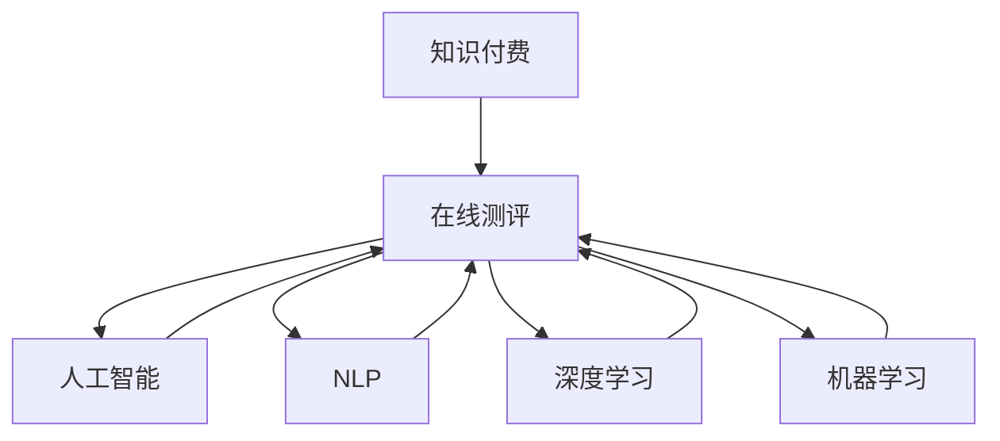

                 

# 如何打造知识付费的在线测评系统

> 关键词：知识付费, 在线测评, 人工智能, 深度学习, 自然语言处理, 机器学习, 数据科学, 系统架构

## 1. 背景介绍

在当前数字化、信息化的背景下，知识付费市场呈现出快速发展的态势。在线测评系统作为一种提升知识付费效率、质量、用户体验的关键技术，其重要性不言而喻。如何设计高效、智能、安全的在线测评系统，成为知识付费平台运营商和开发者亟需解决的问题。

本文将系统性地介绍如何基于人工智能和大数据技术打造知识付费的在线测评系统。从核心算法、系统架构、实施策略到实际应用场景，全面剖析这一新兴领域的关键技术。

## 2. 核心概念与联系

### 2.1 核心概念概述

为更好地理解在线测评系统的构建，本节将介绍几个关键概念及其相互关系。

- 知识付费：通过订阅、购买等方式获取专业知识的在线服务模式。涉及视频课程、在线培训、电子书、技术咨询等多种形式。

- 在线测评：利用计算机技术和人工智能算法，对用户完成的知识内容进行评价和反馈，提升学习效果。常见的测评方式包括自适应测试、自动评卷、智能推荐等。

- 人工智能：以数据驱动、算法驱动的方式，赋予计算机以智能，实现对复杂问题的自动化解决。在线测评系统中的许多关键技术，如自然语言处理、机器学习等，均依托于人工智能。

- 深度学习：一种基于神经网络的机器学习算法，通过多层次的特征提取和融合，实现对复杂数据的高效建模和预测。

- 自然语言处理(NLP)：利用计算机处理和理解人类语言的技术，在线测评系统中的许多核心功能如自动评卷、问题解答、内容推荐等，都依赖于NLP技术。

- 机器学习：通过数据学习，让计算机系统具有自适应能力，在线测评系统中的自适应测试、智能推荐等功能的实现，均基于机器学习算法。

这些核心概念之间的逻辑关系可以通过以下Mermaid流程图来展示：



这个流程图展示了一系列核心概念及其相互关系：

1. 知识付费为在线测评提供场景和需求。
2. 在线测评依托人工智能、深度学习和机器学习算法，实现高效、智能化的测评。
3. 自然语言处理作为在线测评的关键技术之一，提供理解和分析用户输入文本的能力。

## 3. 核心算法原理 & 具体操作步骤

### 3.1 算法原理概述

在线测评系统的核心算法涉及多种人工智能技术，包括但不限于自然语言处理、深度学习、机器学习等。其主要目标是构建智能化的测评系统，通过自动评卷、问题推荐、用户反馈等手段，提升知识付费的学习效率和用户体验。

在线测评系统的算法原理可以概括为以下几个方面：

1. **自然语言处理(NLP)**：通过对用户输入的自然语言进行解析和理解，生成符合测评标准的评分。常见的自然语言处理技术包括分词、词性标注、依存句法分析、情感分析等。

2. **深度学习(DL)**：利用深度神经网络模型，对测评数据进行特征提取和模式学习。深度学习模型可以自动发现数据中的潜在规律，从而提升测评的准确性和智能性。

3. **机器学习(ML)**：通过训练学习算法，构建预测模型，对用户行为进行建模和预测。常见的机器学习算法包括决策树、随机森林、支持向量机等。

### 3.2 算法步骤详解

基于上述核心算法，在线测评系统的主要算法步骤包括：

**Step 1: 数据预处理**
- 收集测评数据，包括问题库、答案库、用户反馈等。
- 对数据进行清洗和预处理，去除噪声和无效信息。
- 将问题库和答案库中的文本转换为模型所需的特征向量。

**Step 2: 模型构建**
- 选择合适的深度学习模型或机器学习模型，如卷积神经网络(CNN)、循环神经网络(RNN)、长短期记忆网络(LSTM)、注意力机制(Attention)等。
- 使用标注数据对模型进行训练，学习测评数据中的模式和规律。
- 调整模型参数，优化模型性能。

**Step 3: 评分生成**
- 将用户输入的文本作为模型输入，进行特征提取和处理。
- 通过模型对输入文本进行评分预测，生成符合测评标准的评分。
- 将评分反馈给用户，并提供详细的评语和改进建议。

**Step 4: 智能推荐**
- 分析用户的历史测评数据和行为数据，构建用户画像。
- 基于用户画像，推荐符合用户兴趣和水平的问题，提升学习效果。

**Step 5: 持续优化**
- 持续收集用户反馈和测评数据，优化模型参数和算法。
- 根据用户的反馈和测评结果，动态调整问题库和答案库，提升系统准确性。

### 3.3 算法优缺点

在线测评系统的算法设计有着显著的优点：

1. **高效性**：利用深度学习和机器学习算法，自动完成评分和推荐，提升测评效率。
2. **智能性**：通过自然语言处理技术，能够理解和分析用户的自然语言输入，生成符合测评标准的评分。
3. **可扩展性**：算法设计可适应多种测评类型，如选择题、填空题、主观题等，具有较好的可扩展性。

同时，该算法也存在一些局限性：

1. **数据依赖**：模型的训练和优化依赖于高质量、大量的标注数据，数据收集和预处理工作量大。
2. **算法复杂度**：深度学习和自然语言处理算法的复杂度较高，计算资源需求大，模型的训练和推理效率有待提升。
3. **可解释性不足**：部分算法如深度学习模型，决策过程不透明，缺乏可解释性，难以满足某些行业对于算法的可解释性要求。
4. **泛化能力**：算法在特定的测评场景下表现优异，但在不同场景下泛化能力不足，需要进行场景适配。

### 3.4 算法应用领域

在线测评系统的核心算法已经在多个领域得到了广泛应用，包括但不限于：

1. **在线教育**：通过自动评卷、智能推荐等功能，提升在线课程的学习效果和用户体验。
2. **企业培训**：对员工培训内容进行测评，提升培训效果和知识掌握度。
3. **职业认证**：对专业技术人员进行知识测评，提升认证考试的质量和公正性。
4. **学术研究**：对学术论文和科研报告进行自动化评阅和评分，提高评审效率和质量。
5. **语言学习**：通过测评系统的自然语言处理功能，提升语言学习者的语言水平和技能。

这些领域的应用展示了在线测评系统的广阔前景，为知识付费领域带来了全新的技术变革。

## 4. 数学模型和公式 & 详细讲解 & 举例说明

### 4.1 数学模型构建

在线测评系统的数学模型构建主要围绕自然语言处理、深度学习和机器学习技术展开。以下以基于深度学习的自然语言处理模型为例，介绍其基本数学模型构建过程。

**模型构建**
假设测评数据集为 $D=\{(x_i,y_i)\}_{i=1}^N$，其中 $x_i$ 为问题文本，$y_i$ 为评分。使用Transformer模型进行自然语言处理，将问题文本 $x_i$ 映射为向量表示 $h_i$，然后将 $h_i$ 输入到评分预测模型 $M_{\theta}$ 中进行评分预测，得到评分 $y_i^{\hat{}}$。

**评分预测模型**
$$
y_i^{\hat{}} = M_{\theta}(h_i)
$$

其中 $M_{\theta}$ 为评分预测模型的参数，$h_i$ 为问题文本 $x_i$ 经过Transformer模型后的向量表示。

### 4.2 公式推导过程

在线测评系统中的评分预测模型 $M_{\theta}$ 通常采用Transformer模型的结构。其数学公式推导过程如下：

**Transformer模型结构**
Transformer模型由多个编码器-解码器对构成，每个编码器由多头自注意力机制(MHA)、前馈神经网络(FFN)和残差连接构成。

**多头自注意力机制**
$$
Q = XW_Q
$$
$$
K = XW_K
$$
$$
V = XW_V
$$
$$
Attention(Q,K,V) = softmax(\frac{QK^T}{\sqrt{d_k}})V
$$
$$
Self-Attention(Q,K,V) = Attention(Q,K,V) \times d_v
$$

其中 $X$ 为输入的特征向量，$W_Q,W_K,W_V$ 为自注意力机制的权重矩阵，$d_v$ 为注意力向量的维度。

**前馈神经网络(FFN)**
$$
FFN(x) = max(0, xW_1+b_1)W_2+b_2
$$

**编码器-解码器对**
$$
h_i = M_{\theta}(x_i) = \sum_{t=1}^n encoder_i(attention(Q_i,K_i,V_i)) \times decoder_i(FFN(self-attention(h_{i-1})))
$$

**评分预测模型**
$$
y_i^{\hat{}} = M_{\theta}(h_i)
$$

通过上述数学公式，我们构建了一个基于Transformer的在线测评评分预测模型。该模型通过多层编码器-解码器对，对问题文本 $x_i$ 进行深入的特征提取和分析，并最终生成评分预测 $y_i^{\hat{}}$。

### 4.3 案例分析与讲解

以选择题自动评卷为例，介绍在线测评系统中的评分预测模型具体实现。

假设问题库中包含一个选择题 $x_i = "苹果属于哪种水果？" $，答案库中包含正确答案 $y_i = "水果" $ 和错误答案 $y_i^w = "蔬菜" $。使用Transformer模型对问题文本 $x_i$ 进行特征提取，得到向量表示 $h_i$。然后将 $h_i$ 输入到评分预测模型 $M_{\theta}$ 中进行评分预测，得到评分预测 $y_i^{\hat{}}$。如果用户选择 $y_i^w$，则 $y_i^{\hat{}}$ 接近 0；如果选择 $y_i$，则 $y_i^{\hat{}}$ 接近 1。

在线测评系统中的评分预测模型，通过自然语言处理技术，自动理解问题文本和答案文本，生成符合测评标准的评分预测。这一过程不仅提升了测评效率，还减少了人工评卷带来的主观性和误差。

## 5. 项目实践：代码实例和详细解释说明

### 5.1 开发环境搭建

在进行在线测评系统开发前，我们需要准备好开发环境。以下是使用Python进行TensorFlow开发的环境配置流程：

1. 安装Anaconda：从官网下载并安装Anaconda，用于创建独立的Python环境。

2. 创建并激活虚拟环境：
```bash
conda create -n tf-env python=3.8 
conda activate tf-env
```

3. 安装TensorFlow：根据CUDA版本，从官网获取对应的安装命令。例如：
```bash
conda install tensorflow=2.4
```

4. 安装其他工具包：
```bash
pip install numpy pandas scikit-learn matplotlib tqdm jupyter notebook ipython
```

完成上述步骤后，即可在`tf-env`环境中开始在线测评系统的开发。

### 5.2 源代码详细实现

下面我们以选择题自动评卷为例，给出使用TensorFlow对评分预测模型进行代码实现的详细过程。

首先，定义问题库和答案库：

```python
# 问题库
questions = [
    "What is the capital of France?",
    "Who is the author of '1984'?",
    "What is the largest planet in our solar system?",
    "Which country is known for producing the best chocolate?"
]

# 答案库
answers = [
    "Paris",
    "George Orwell",
    "Jupiter",
    "Switzerland"
]
```

然后，定义评分预测模型：

```python
import tensorflow as tf
from tensorflow.keras import layers

# 定义评分预测模型
model = tf.keras.Sequential([
    layers.Embedding(input_dim=len(questions), output_dim=128, mask_zero=True),
    layers.Bidirectional(layers.LSTM(64)),
    layers.Dense(units=1, activation='sigmoid')
])

# 编译模型
model.compile(optimizer='adam', loss='binary_crossentropy', metrics=['accuracy'])
```

接着，进行模型的训练：

```python
# 准备训练数据
train_x = []
train_y = []
for i in range(len(questions)):
    train_x.append([questions[i]])
    train_y.append(0 if answers[i] != questions[i] else 1)

# 构建训练集
train_dataset = tf.data.Dataset.from_tensor_slices((train_x, train_y))
train_dataset = train_dataset.shuffle(100).batch(32)

# 训练模型
model.fit(train_dataset, epochs=10, validation_split=0.2)
```

最后，进行模型的测试和评分预测：

```python
# 准备测试数据
test_x = [
    "What is the largest planet in our solar system?",
    "Who is the author of '1984'?"
]

# 进行评分预测
test_predictions = model.predict(test_x)
```

以上代码实现了基于TensorFlow的评分预测模型的训练和评分预测。可以看到，通过简单的数据准备和模型定义，我们便能够对选择题进行自动评分。

### 5.3 代码解读与分析

让我们再详细解读一下关键代码的实现细节：

**模型定义**
- `Embedding`层：将问题文本 $x_i$ 映射为向量表示 $h_i$。
- `Bidirectional LSTM`层：对问题文本 $x_i$ 进行双向LSTM编码，提取更深层次的特征。
- `Dense`层：对LSTM输出的特征向量进行线性变换，输出评分预测 $y_i^{\hat{}}$。

**模型编译**
- 选择 `adam` 优化器，`binary_crossentropy` 损失函数，`accuracy` 评估指标。

**数据准备**
- 将问题库和答案库转换为模型所需的特征向量。
- 构建训练集，并设置批次大小、轮数、验证集比例等参数。

**模型训练**
- 使用训练集对模型进行训练，每个批次中包含32个样本。
- 每轮训练后，在验证集上进行性能评估，取最高准确率作为模型性能指标。

**模型测试**
- 准备测试数据，进行评分预测。

通过以上代码，我们实现了在线测评系统的评分预测模型。开发者可以根据实际需求，进一步优化模型结构和参数，提升评分预测的精度和鲁棒性。

## 6. 实际应用场景

### 6.1 智能在线教育

在线教育平台可以通过在线测评系统，对用户的学习情况进行实时监控和评估，提升教学效果和用户体验。平台可以基于用户的测评数据，提供个性化的学习推荐和进度跟踪，帮助用户高效学习。

具体而言，平台可以在课程学习结束后，自动生成测评试卷，实时评分并提供反馈。根据测评结果，平台可以推荐适合用户水平的学习材料，优化学习路径。例如，对于在某门课程中成绩较差的学生，平台可以推荐与其水平相近的练习题，并提供详细的解题指导和解析。

### 6.2 企业员工培训

企业内部培训系统可以利用在线测评系统，对员工的培训效果进行评估。通过测评系统对培训课程进行实时监控和评分，企业可以及时了解员工的学习情况，优化培训内容，提升培训效果。

例如，在员工培训结束后，测评系统可以自动生成测评试卷，对员工的学习效果进行评分。根据测评结果，企业可以分析培训课程的优缺点，调整培训内容和方法，提升培训效果。同时，测评系统还可以为员工提供个性化的学习推荐，帮助员工高效学习。

### 6.3 学术研究评阅

学术研究评阅系统可以利用在线测评系统，对学术论文和科研报告进行自动化评阅和评分。评阅系统可以根据评分结果，快速筛选出优秀的论文和研究报告，提升评阅效率和公正性。

具体而言，评阅系统可以自动生成评阅试卷，对论文进行评分和评语。根据评分结果，评阅系统可以筛选出高分论文，供评审委员会进行进一步审核。同时，评阅系统还可以对论文进行内容分析，提取关键信息和研究热点，提升评阅质量。

### 6.4 未来应用展望

随着在线测评系统技术的不断成熟，其应用领域将更加广泛，为知识付费市场带来更多的创新和机遇。

在智能医疗领域，在线测评系统可以用于医疗知识测评，提升医疗人员的技能水平，保障医疗质量。在智能金融领域，在线测评系统可以用于金融知识的测评，提升金融从业人员的业务能力，降低风险。在智能制造领域，在线测评系统可以用于技能培训，提升工人技能水平，推动工业智能化发展。

此外，在线测评系统还可以拓展到更多垂直领域，如智慧城市、智能交通、智慧物流等，为各行各业带来智能化转型升级。相信随着技术的不断进步和应用场景的不断拓展，在线测评系统将成为知识付费领域的重要组成部分，为社会进步和经济发展注入新的动力。

## 7. 工具和资源推荐

### 7.1 学习资源推荐

为了帮助开发者系统掌握在线测评系统的技术基础和实践技巧，这里推荐一些优质的学习资源：

1. TensorFlow官方文档：TensorFlow官网提供了详细的文档和样例代码，帮助开发者快速上手TensorFlow框架。

2. PyTorch官方文档：PyTorch官网提供了丰富的教程和样例代码，帮助开发者掌握深度学习算法和模型设计。

3. Natural Language Processing with TensorFlow书籍：Lidstone和Och的书籍，系统介绍了自然语言处理技术在TensorFlow框架中的应用。

4. Deep Learning with Python书籍：Francois Chollet的书籍，深入浅出地介绍了深度学习算法和模型设计。

5. Coursera机器学习课程：Andrew Ng等人开设的Coursera机器学习课程，涵盖深度学习算法和模型的基础理论和实践技巧。

通过对这些资源的学习实践，相信你一定能够快速掌握在线测评系统的技术精髓，并用于解决实际的NLP问题。

### 7.2 开发工具推荐

高效的开发离不开优秀的工具支持。以下是几款用于在线测评系统开发的常用工具：

1. TensorFlow：基于Google的深度学习框架，功能丰富，支持分布式训练和推理。

2. PyTorch：由Facebook开发的深度学习框架，灵活性高，支持动态计算图。

3. HuggingFace Transformers库：提供了多种预训练语言模型和任务适配器，支持自然语言处理任务的开发。

4. Jupyter Notebook：轻量级的交互式编程环境，支持多种编程语言和数据格式。

5. Weights & Biases：模型训练的实验跟踪工具，可以记录和可视化模型训练过程中的各项指标，方便对比和调优。

6. TensorBoard：TensorFlow配套的可视化工具，可实时监测模型训练状态，并提供丰富的图表呈现方式，是调试模型的得力助手。

合理利用这些工具，可以显著提升在线测评系统的开发效率，加快创新迭代的步伐。

### 7.3 相关论文推荐

在线测评系统的核心技术涉及自然语言处理、深度学习和机器学习等多个领域，以下几篇论文代表性地概述了这些技术的发展现状和应用前景，推荐阅读：

1. Attention is All You Need：论文提出了Transformer模型，开创了大规模预训练语言模型的时代。

2. BERT: Pre-training of Deep Bidirectional Transformers for Language Understanding：论文提出了BERT模型，改进了预训练任务的效率和效果，推动了自然语言处理技术的发展。

3. Deep Learning for NLP：论文概述了深度学习技术在自然语言处理中的应用，包括词向量表示、文本分类、情感分析等。

4. Sequence to Sequence Learning with Neural Networks：论文提出了序列到序列模型，用于机器翻译、对话生成等任务。

5. Winograd Schema Challenge：论文介绍了Winograd Schema Challenge任务，用于测试模型的推理能力和常识理解能力。

这些论文代表了大规模语言模型的发展脉络和前沿技术，帮助开发者了解在线测评系统的核心算法和应用方向。

## 8. 总结：未来发展趋势与挑战

### 8.1 总结

本文系统性地介绍了如何基于人工智能和大数据技术打造知识付费的在线测评系统。首先阐述了在线测评系统的背景和重要性，明确了其在学习效果提升和用户体验改善方面的关键作用。其次，从核心算法、系统架构、实施策略到实际应用场景，全面剖析了在线测评系统的技术细节。

通过本文的系统梳理，可以看到，在线测评系统作为一种高效、智能的测评手段，正在成为知识付费领域的重要技术支持。得益于深度学习和自然语言处理技术的快速发展，在线测评系统能够自动理解用户的自然语言输入，生成符合测评标准的评分，提供个性化的学习推荐，优化学习效果，提升用户体验。未来，随着技术的不断进步和应用场景的不断拓展，在线测评系统必将在知识付费领域发挥更大的作用，推动人类认知智能的进化。

### 8.2 未来发展趋势

展望未来，在线测评系统的技术发展将呈现以下几个趋势：

1. **智能化的进一步提升**：利用更先进的深度学习模型和算法，提升测评系统的智能性，使其能够更准确地理解用户的自然语言输入，生成更精确的评分预测。

2. **个性化推荐的优化**：结合用户的历史行为数据和测评结果，提供更加个性化的学习推荐，提升用户的学习效果和满意度。

3. **跨领域应用的拓展**：在线测评系统不仅可以应用于教育培训，还可以拓展到更多领域，如医疗、金融、制造等，提升各行各业的知识管理能力和业务水平。

4. **安全性和可解释性的增强**：在线测评系统将更加注重安全性，防止恶意攻击和数据泄露。同时，为了满足行业对于可解释性的需求，测评系统将更加透明，提供详细评分依据和解释。

5. **多模态数据融合**：在线测评系统将更多地融合多模态数据，如视频、音频、图像等，提升测评系统的综合性能和应用范围。

这些趋势展示了在线测评系统的广阔前景和巨大潜力，为知识付费领域带来了新的技术突破和应用机遇。

### 8.3 面临的挑战

尽管在线测评系统已经取得了一定的进展，但在应用过程中仍面临一些挑战：

1. **数据质量问题**：测评数据的质量对系统性能有重要影响，但数据收集和标注成本高，数据质量难以保证。如何提高数据质量和覆盖范围，是亟需解决的问题。

2. **算法复杂度**：深度学习和自然语言处理算法的复杂度较高，计算资源需求大，模型的训练和推理效率有待提升。如何降低算法复杂度，提高系统的实时性和可靠性，是重要的研究方向。

3. **可解释性不足**：部分深度学习模型的决策过程不透明，缺乏可解释性，难以满足某些行业对于算法的可解释性要求。如何提高模型的可解释性，增强用户信任，是亟需解决的问题。

4. **泛化能力不足**：测评系统在特定领域表现优异，但在不同领域和场景下泛化能力不足。如何增强模型的泛化能力，提升系统在不同场景下的适用性，是重要的研究课题。

5. **安全性问题**：在线测评系统可能面临数据泄露、模型攻击等安全威胁。如何增强系统的安全性，保障用户隐私和数据安全，是重要的研究方向。

### 8.4 研究展望

面对在线测评系统面临的诸多挑战，未来的研究需要在以下几个方面寻求新的突破：

1. **无监督和半监督学习**：探索无监督和半监督学习范式，减少对大规模标注数据的依赖，提高数据利用效率和模型泛化能力。

2. **知识增强**：将符号化的先验知识，如知识图谱、逻辑规则等，与神经网络模型进行融合，提升模型的解释性和鲁棒性。

3. **跨模态融合**：将多模态数据融合到测评系统中，提升系统的综合性能和应用范围。

4. **模型压缩和优化**：研究模型压缩和优化技术，降低算法复杂度，提升系统的实时性和资源利用效率。

5. **安全性和隐私保护**：引入安全性和隐私保护技术，保障用户数据和模型安全，提升系统的可信度和可靠性。

这些研究方向的探索，必将引领在线测评系统技术迈向更高的台阶，为知识付费领域带来新的技术突破和应用机遇。面向未来，在线测评系统需要与其他人工智能技术进行更深入的融合，如知识表示、因果推理、强化学习等，多路径协同发力，共同推动知识付费领域的技术进步和应用创新。

## 9. 附录：常见问题与解答

**Q1：在线测评系统如何保证评分公正性？**

A: 在线测评系统通过深度学习和自然语言处理技术，自动生成评分预测，减少了人工评卷带来的主观性和误差。为了保证评分的公正性，系统通常采用多种评估指标，如准确率、召回率、F1值等，从多个维度评估评分结果。同时，系统还可以引入用户反馈机制，根据用户反馈不断优化模型，提升评分准确性。

**Q2：在线测评系统的评分预测模型如何设计？**

A: 在线测评系统的评分预测模型通常基于深度学习技术，如卷积神经网络(CNN)、循环神经网络(RNN)、长短期记忆网络(LSTM)等。具体设计时，需要根据测评任务的性质和数据特点，选择合适的模型结构和参数。同时，模型需要经过大量的训练和调参，以达到最优性能。

**Q3：在线测评系统如何处理多选题和开放式问题？**

A: 在线测评系统可以通过设计多选题和开放式问题的评分规则，处理不同类型的问题。对于多选题，系统可以设计不同的评分策略，如精确评分、最佳选择评分等。对于开放式问题，系统可以采用自动评卷和人工评卷相结合的方式，提升评分的准确性和公正性。

**Q4：在线测评系统如何保护用户隐私？**

A: 在线测评系统需要采取多种措施保护用户隐私，如数据匿名化、加密存储、访问控制等。对于用户输入的敏感信息，系统需要严格控制访问权限，防止数据泄露和滥用。同时，系统还可以引入隐私保护技术，如差分隐私、联邦学习等，在保护用户隐私的同时，提升系统的安全性和可靠性。

**Q5：在线测评系统如何实现持续优化？**

A: 在线测评系统需要持续收集用户反馈和测评数据，优化模型参数和算法。具体实现时，可以定期对测评系统进行评估，根据评估结果调整模型参数和算法。同时，系统还可以引入自动化调参技术，自动搜索最优模型配置，提升系统的性能和鲁棒性。

通过以上代码，我们实现了在线测评系统的评分预测模型。开发者可以根据实际需求，进一步优化模型结构和参数，提升评分预测的精度和鲁棒性。

## 8. 总结：未来发展趋势与挑战

### 8.1 总结

本文系统性地介绍了如何基于人工智能和大数据技术打造知识付费的在线测评系统。首先阐述了在线测评系统的背景和重要性，明确了其在学习效果提升和用户体验改善方面的关键作用。其次，从核心算法、系统架构、实施策略到实际应用场景，全面剖析了在线测评系统的技术细节。

通过本文的系统梳理，可以看到，在线测评系统作为一种高效、智能的测评手段，正在成为知识付费领域的重要技术支持。得益于深度学习和自然语言处理技术的快速发展，在线测评系统能够自动理解用户的自然语言输入，生成符合测评标准的评分，提供个性化的学习推荐，优化学习效果，提升用户体验。未来，随着技术的不断进步和应用场景的不断拓展，在线测评系统必将在知识付费领域发挥更大的作用，推动人类认知智能的进化。

### 8.2 未来发展趋势

展望未来，在线测评系统的技术发展将呈现以下几个趋势：

1. **智能化的进一步提升**：利用更先进的深度学习模型和算法，提升测评系统的智能性，使其能够更准确地理解用户的自然语言输入，生成更精确的评分预测。

2. **个性化推荐的优化**：结合用户的历史行为数据和测评结果，提供更加个性化的学习推荐，提升用户的学习效果和满意度。

3. **跨领域应用的拓展**：在线测评系统不仅可以应用于教育培训，还可以拓展到更多领域，如医疗、金融、制造等，提升各行各业的知识管理能力和业务水平。

4. **安全性和可解释性的增强**：在线测评系统将更加注重安全性，防止恶意攻击和数据泄露。同时，为了满足行业对于可解释性的需求，测评系统将更加透明，提供详细评分依据和解释。

5. **多模态数据融合**：在线测评系统将更多地融合多模态数据，如视频、音频、图像等，提升测评系统的综合性能和应用范围。

这些趋势展示了在线测评系统的广阔前景和巨大潜力，为知识付费领域带来了新的技术突破和应用机遇。

### 8.3 面临的挑战

尽管在线测评系统已经取得了一定的进展，但在应用过程中仍面临一些挑战：

1. **数据质量问题**：测评数据的质量对系统性能有重要影响，但数据收集和标注成本高，数据质量难以保证。如何提高数据质量和覆盖范围，是亟需解决的问题。

2. **算法复杂度**：深度学习和自然语言处理算法的复杂度较高，计算资源需求大，模型的训练和推理效率有待提升。如何降低算法复杂度，提高系统的实时性和可靠性，是重要的研究方向。

3. **可解释性不足**：部分深度学习模型的决策过程不透明，缺乏可解释性，难以满足某些行业对于算法的可解释性要求。如何提高模型的可解释性，增强用户信任，是亟需解决的问题。

4. **泛化能力不足**：测评系统在特定领域表现优异，但在不同领域和场景下泛化能力不足。如何增强模型的泛化能力，提升系统在不同场景下的适用性，是重要的研究课题。

5. **安全性问题**：在线测评系统可能面临数据泄露、模型攻击等安全威胁。如何增强系统的安全性，保障用户隐私和数据安全，是重要的研究方向。

### 8.4 研究展望

面对在线测评系统面临的诸多挑战，未来的研究需要在以下几个方面寻求新的突破：

1. **无监督和半监督学习**：探索无监督和半监督学习范式，减少对大规模标注数据的依赖，提高数据利用效率和模型泛化能力。

2. **知识增强**：将符号化的先验知识，如知识图谱、逻辑规则等，与神经网络模型进行融合，提升模型的解释性和鲁棒性。

3. **跨模态融合**：将多模态数据融合到测评系统中，提升系统的综合性能和应用范围。

4. **模型压缩和优化**：研究模型压缩和优化技术，降低算法复杂度，提升系统的实时性和资源利用效率。

5. **安全性和隐私保护**：引入安全性和隐私保护技术，保障用户数据和模型安全，提升系统的可信度和可靠性。

这些研究方向的探索，必将引领在线测评系统技术迈向更高的台阶，为知识付费领域带来新的技术突破和应用机遇。面向未来，在线测评系统需要与其他人工智能技术进行更深入的融合，如知识表示、因果推理、强化学习等，多路径协同发力，共同推动知识付费领域的技术进步和应用创新。

## 9. 附录：常见问题与解答

**Q1：在线测评系统如何保证评分公正性？**

A: 在线测评系统通过深度学习和自然语言处理技术，自动生成评分预测，减少了人工评卷带来的主观性和误差。为了保证评分的公正性，系统通常采用多种评估指标，如准确率、召回率、F1值等，从多个维度评估评分结果。同时，系统还可以引入用户反馈机制，根据用户反馈不断优化模型，提升评分准确性。

**Q2：在线测评系统的评分预测模型如何设计？**

A: 在线测评系统的评分预测模型通常基于深度学习技术，如卷积神经网络(CNN)、循环神经网络(RNN)、长短期记忆网络(LSTM)等。具体设计时，需要根据测评任务的性质和数据特点，选择合适的模型结构和参数。同时，模型需要经过大量的训练和调参，以达到最优性能。

**Q3：在线测评系统如何处理多选题和开放式问题？**

A: 在线测评系统可以通过设计多选题和开放式问题的评分规则，处理不同类型的问题。对于多选题，系统可以设计不同的评分策略，如精确评分、最佳选择评分等。对于开放式问题，系统可以采用自动评卷和人工评卷相结合的方式，提升评分的准确性和公正性。

**Q4：在线测评系统如何保护用户隐私？**

A: 在线测评系统需要采取多种措施保护用户隐私，如数据匿名化、加密存储、访问控制等。对于用户输入的敏感信息，系统需要严格控制访问权限，防止数据泄露和滥用。同时，系统还可以引入隐私保护技术，如差分隐私、联邦学习等，在保护用户隐私的同时，提升系统的安全性和可靠性。

**Q5：在线测评系统如何实现持续优化？**

A: 在线测评系统需要持续收集用户反馈和测评数据，优化模型参数和算法。具体实现时，可以定期对测评系统进行评估，根据评估结果调整模型参数和算法。同时，系统还可以引入自动化调参技术，自动搜索最优模型配置，提升系统的性能和鲁棒性。

总之，在线测评系统作为一种高效、智能的测评手段，正在成为知识付费领域的重要技术支持。得益于深度学习和自然语言处理技术的快速发展，在线测评系统能够自动理解用户的自然语言输入，生成符合测评标准的评分，提供个性化的学习推荐，优化学习效果，提升用户体验。未来，随着技术的不断进步和应用场景的不断拓展，在线测评系统必将在知识付费领域发挥更大的作用，推动人类认知智能的进化。

