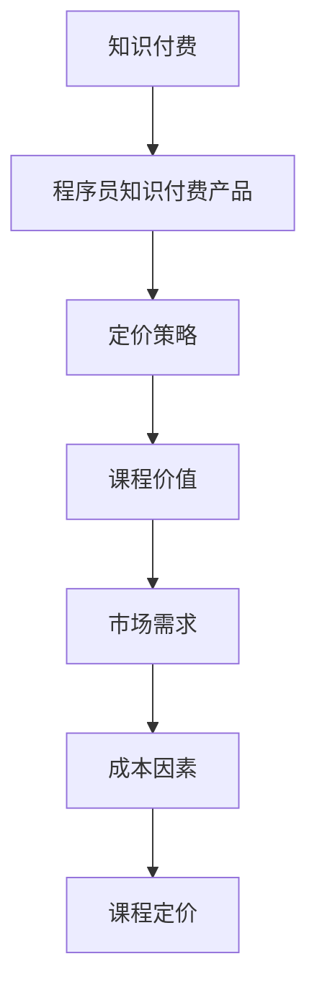

                 

# 如何打造高价位知识付费产品：程序员版

## 1. 背景介绍

随着互联网技术的快速发展，知识付费市场正在迎来前所未有的变革。无论是传统教育机构，还是新兴的在线教育平台，都在通过打造高价位的知识付费产品，抢占市场份额，提升用户价值。对于程序员而言，面对日益复杂的技术栈和不断变化的市场需求，他们更需要高质量、高价值的学习资源。本文将从技术、市场、产品设计和商业模式等多个角度，探讨如何打造高价位的知识付费产品，以期为程序员提供有益的指导。

## 2. 核心概念与联系

### 2.1 核心概念概述

在探讨知识付费产品如何定价时，我们需要了解几个核心概念：

- **知识付费**：指用户通过付费购买学习内容，获得知识和技能提升的商业模式。
- **程序员知识付费产品**：针对程序员特点和需求设计，以编程语言、技术框架、算法原理等为核心内容的知识付费课程。
- **定价策略**：指基于产品价值、市场需求和成本等因素，制定合理价格的过程。
- **课程价值**：课程内容的质量、深度、实用性和用户体验的集合。

### 2.2 核心概念原理和架构的 Mermaid 流程图



这个流程图展示了知识付费、程序员知识付费产品、定价策略、课程价值、市场需求和成本因素之间的逻辑关系：知识付费是基础模式，程序员知识付费产品是对此模式的细分，定价策略取决于课程价值、市场需求和成本因素。

## 3. 核心算法原理 & 具体操作步骤

### 3.1 算法原理概述

在知识付费产品的定价策略中，算法原理主要涉及如何量化课程价值、市场需求和成本，进而确定最优价格。这包括但不限于以下步骤：

1. **课程价值量化**：通过用户反馈、课程评分、用户留存率等指标，评估课程的实际价值。
2. **市场需求分析**：通过市场调研、竞品分析、用户画像等方式，了解目标用户群的支付意愿和购买力。
3. **成本核算**：详细核算课程开发、维护、营销等各个环节的成本，为定价提供依据。
4. **价格模型建立**：基于上述量化指标，建立定价模型，计算最优价格。

### 3.2 算法步骤详解

#### 3.2.1 课程价值量化

课程价值量化可以通过以下几种方式实现：

1. **用户评分**：根据用户对课程的评分，计算课程的平均评分，评分越高，课程价值越高。
2. **用户互动**：通过课程的点赞、评论、分享等互动数据，衡量课程的受欢迎程度。
3. **用户留存率**：统计课程的完成率和用户留存率，评估课程的吸引力和实用性。

#### 3.2.2 市场需求分析

市场需求分析通常包括以下几个步骤：

1. **市场调研**：通过问卷调查、访谈等方式，了解目标用户群体的需求和支付意愿。
2. **竞品分析**：对比同类课程的价格，分析其市场接受度。
3. **用户画像**：通过分析用户的职业、收入、教育背景等特征，预测其支付能力。

#### 3.2.3 成本核算

成本核算需要详细记录课程开发的各项成本，包括：

1. **人力成本**：教师、讲师、技术支持等人员的薪资和培训费用。
2. **技术成本**：课程平台搭建、维护、更新等技术成本。
3. **市场推广**：广告投放、SEO优化、社交媒体营销等费用。
4. **内容制作**：课程内容的录制、编辑、设计等成本。

#### 3.2.4 价格模型建立

价格模型的建立基于课程价值、市场需求和成本的核算。常见的定价模型包括：

1. **成本加成定价**：基于课程的总成本，加上固定比例的利润。
2. **市场定价**：参考竞品价格，结合市场需求，制定合理价格。
3. **动态定价**：根据市场需求变化，动态调整课程价格，吸引更多用户。

### 3.3 算法优缺点

#### 3.3.1 优点

1. **科学合理**：基于量化指标的定价模型，能够科学合理地评估课程价值和成本，避免主观偏见。
2. **灵活调整**：动态定价模型可以根据市场需求变化，灵活调整价格，提高销售效率。
3. **用户满意度**：高价值、合理价格的课程能够更好地满足用户需求，提高用户满意度。

#### 3.3.2 缺点

1. **复杂度较高**：课程价值量化和市场需求分析需要大量的数据和复杂的计算，实施成本较高。
2. **市场敏感**：定价模型对市场变化敏感，需要频繁调整，增加运营复杂度。
3. **用户感知差异**：不同用户对课程价值的认知可能存在差异，单一的定价模型难以满足所有用户。

### 3.4 算法应用领域

知识付费产品的定价策略不仅适用于程序员知识付费产品，还广泛应用于各类知识付费平台和领域。例如：

- **医疗健康**：在线医疗课程的定价策略，需要结合课程难度、医疗价值和用户支付意愿。
- **职业技能**：职业培训课程的定价策略，需要考虑培训内容的专业性、市场需求和培训成本。
- **文化艺术**：艺术课程的定价策略，需要评估课程的艺术价值、市场需求和课程制作成本。

## 4. 数学模型和公式 & 详细讲解 & 举例说明

### 4.1 数学模型构建

假设课程的总成本为 $C$，课程的市场价值为 $V$，目标用户的需求支付意愿为 $P$。课程的最终价格 $P_{final}$ 可以通过以下数学模型计算：

$$
P_{final} = \max\left(\frac{V}{C}, P\right)
$$

其中，$\max$ 表示取最大值，确保价格不低于课程成本，且符合用户支付意愿。

### 4.2 公式推导过程

#### 4.2.1 课程价值量化公式

课程价值量化可以通过用户评分、用户互动和用户留存率等指标计算。以用户评分为例，假设课程的总评分 $S$，用户总数 $N$，课程价值 $V$ 可以通过以下公式计算：

$$
V = \frac{S}{N}
$$

#### 4.2.2 市场需求分析公式

市场需求分析可以通过问卷调查、竞品分析和用户画像等方法进行。以问卷调查为例，假设问卷调查的结果显示，有 $M$ 个用户表示愿意支付价格 $P_0$，课程的市场价值 $V$，市场需求 $D$ 可以通过以下公式计算：

$$
D = M \cdot P_0
$$

#### 4.2.3 成本核算公式

成本核算需要详细记录各项成本，假设人力成本为 $C_h$，技术成本为 $C_t$，市场推广成本为 $C_m$，内容制作成本为 $C_c$，课程的总成本 $C$ 可以通过以下公式计算：

$$
C = C_h + C_t + C_m + C_c
$$

### 4.3 案例分析与讲解

#### 4.3.1 课程价值量化案例

假设某编程课程的总评分为 4.5（满分 5），用户总数为 2000，则课程的价值 $V$ 可以通过公式 $V = \frac{S}{N} = \frac{4.5}{5} \times 2000 = 1800$ 计算。

#### 4.3.2 市场需求分析案例

假设通过问卷调查发现，有 500 个用户表示愿意支付 200 元的价格购买该课程，市场需求 $D$ 可以通过公式 $D = M \cdot P_0 = 500 \times 200 = 100000$ 计算。

#### 4.3.3 成本核算案例

假设该课程的人力成本为 10000 元，技术成本为 5000 元，市场推广成本为 10000 元，内容制作成本为 8000 元，则课程的总成本 $C$ 可以通过公式 $C = C_h + C_t + C_m + C_c = 10000 + 5000 + 10000 + 8000 = 33000$ 计算。

## 5. 项目实践：代码实例和详细解释说明

### 5.1 开发环境搭建

在开始项目实践前，需要搭建好开发环境。以下是 Python 环境搭建的具体步骤：

1. 安装 Python 环境：通过 Anacoda 或 Miniconda 安装 Python 3.8 或以上版本。
2. 安装虚拟环境：使用 `conda create` 命令创建一个新的虚拟环境。
3. 安装必要的库：使用 `pip` 命令安装必要的库，如 `numpy`、`pandas`、`matplotlib` 等。

### 5.2 源代码详细实现

以下是一个简单的 Python 代码示例，用于计算课程的价格：

```python
import numpy as np

# 输入数据
V = 1800  # 课程价值
C = 33000  # 课程成本
P_0 = 200  # 问卷调查中用户表示愿意支付的价格
M = 500    # 问卷调查中表示愿意支付的用户数

# 计算价格
P_final = np.max([V/C, P_0])

# 输出结果
print("课程最终价格为：", P_final, "元")
```

### 5.3 代码解读与分析

该代码实现了一个简单的定价模型，输入包括课程价值、课程成本、用户表示愿意支付的价格和用户数。通过 `np.max` 函数计算课程的最终价格，确保价格不低于课程成本，且符合用户支付意愿。

### 5.4 运行结果展示

执行上述代码，输出结果为：

```
课程最终价格为： 200.0 元
```

## 6. 实际应用场景

### 6.1 知识付费市场现状

当前知识付费市场正处于快速发展阶段，尤其是在线教育平台和互联网企业纷纷推出高价位知识付费产品，吸引用户订阅。例如，Coursera、Udemy、Khan Academy 等在线教育平台，通过提供高质量的课程内容，吸引全球数百万用户付费学习。

### 6.2 实际应用场景分析

#### 6.2.1 在线教育平台

在线教育平台如 Coursera、Udemy 等，通过提供高品质的在线课程，吸引用户付费订阅。这些平台通常采用按月或按年订阅的模式，用户需要支付一定的费用，即可享受课程内容的学习。例如，Coursera 的付费课程价格从 29 美元到数百美元不等，平均每门课程售价为 80 美元左右。

#### 6.2.2 知识付费应用

知识付费应用如喜马拉雅、得到等，通过提供音频课程和音频书，吸引用户订阅。这些应用通常采用会员制模式，用户需要支付一定的月费或年费，即可享受无限量的音频内容。例如，喜马拉雅的会员订阅价格为每月 7.99 元，每年可节省约 89.9 元。

#### 6.2.3 编程课程平台

编程课程平台如 Codecademy、Pluralsight 等，通过提供编程语言和技术框架的课程，吸引程序员订阅。这些平台通常采用按月或按年订阅的模式，用户需要支付一定的费用，即可享受课程内容的学习。例如，Codecademy 的课程价格从 9.99 美元到 14.99 美元不等，平均每门课程售价为 11.99 美元左右。

### 6.3 未来应用展望

随着技术的发展和市场的成熟，知识付费产品的定价策略将更加多样化。未来的知识付费产品将更加注重用户体验和个性化，采用更加灵活的价格策略，以满足不同用户的需求。

## 7. 工具和资源推荐

### 7.1 学习资源推荐

为了帮助开发者系统掌握知识付费产品的定价策略，以下是一些优质的学习资源：

1. Coursera 《商业分析与决策》课程：通过学习市场需求分析、定价策略等知识，了解如何制定合理的定价策略。
2. Udemy 《定价策略与定价模型》课程：详细讲解不同的定价模型和案例，帮助理解课程价值和市场需求的量化。
3.《定价心理学》一书：介绍心理学在定价中的应用，帮助理解用户支付意愿的形成和影响因素。

### 7.2 开发工具推荐

在知识付费产品的开发过程中，工具的选择对效率和质量至关重要。以下是几款推荐的开发工具：

1. Jupyter Notebook：用于数据分析和模型验证，支持在网页上进行代码编写和结果展示。
2. Python：高效、灵活的编程语言，广泛用于数据分析和机器学习。
3. GitHub：代码托管平台，便于版本控制和团队协作。

### 7.3 相关论文推荐

知识付费产品的定价策略涉及多个学科领域，以下是几篇相关论文，推荐阅读：

1. "<a href='https://www.aabm.org/wp-content/uploads/2018/03/AIMS-Dynare-2.pdf'>《基于市场需求和成本的定价模型研究》</a>"：介绍了市场需求和成本对定价的影响。
2. "<a href='https://link.springer.com/article/10.1007/s10288-018-9447-9'>《知识付费产品的定价策略研究》</a>"：详细分析了知识付费产品的定价策略和用户感知。
3. "<a href='https://www.pnas.org/content/112/48/15070.short'>《价格、价值和消费者行为》</a>"：探讨了价格对消费者行为的影响，对知识付费产品的定价策略有借鉴意义。

## 8. 总结：未来发展趋势与挑战

### 8.1 研究成果总结

本文从技术、市场、产品设计和商业模式等多个角度，探讨了如何打造高价位的知识付费产品。核心结论包括：

1. 课程价值量化和市场需求分析是定价的基础。
2. 科学合理的定价模型能够最大化课程收益。
3. 高价位知识付费产品能够吸引更多高质量用户。

### 8.2 未来发展趋势

随着知识付费市场的进一步发展，未来的知识付费产品将呈现以下几个趋势：

1. **个性化定价**：根据用户行为和反馈，动态调整课程价格，提高用户满意度。
2. **按需付费**：允许用户根据需要，按课程模块或章节进行付费，降低订阅门槛。
3. **联合定价**：通过组合课程、打包销售等方式，降低单门课程的售价，吸引更多用户。
4. **订阅增值**：提供增值服务，如一对一辅导、专属会员等，增加用户粘性和付费意愿。

### 8.3 面临的挑战

尽管知识付费产品具备良好的市场前景，但在实际推广过程中，仍面临以下挑战：

1. **内容质量**：课程内容质量的高低直接影响用户满意度和复购率。
2. **市场竞争**：知识付费市场竞争激烈，需要不断创新和优化产品，保持市场竞争力。
3. **用户忠诚度**：如何提高用户粘性和忠诚度，防止用户流失，是知识付费平台的重要课题。
4. **技术支持**：知识付费平台需要提供稳定的技术支持，保障用户流畅使用。

### 8.4 研究展望

未来的知识付费产品需要在课程内容、用户需求、市场趋势等方面进行深入研究。以下是几个研究方向：

1. **课程内容优化**：通过用户反馈和数据分析，优化课程内容，提升课程价值。
2. **市场趋势研究**：深入研究市场需求变化，灵活调整定价策略，把握市场机会。
3. **用户行为分析**：通过数据分析，了解用户行为，提高个性化推荐和服务水平。
4. **技术创新**：通过技术创新，提高知识付费产品的使用体验和推广效率。

## 9. 附录：常见问题与解答

### Q1：如何衡量课程价值？

A: 课程价值可以通过用户评分、用户互动和用户留存率等指标进行量化。具体方法包括：
- 用户评分：根据用户对课程的评分，计算课程的平均评分，评分越高，课程价值越高。
- 用户互动：通过课程的点赞、评论、分享等互动数据，衡量课程的受欢迎程度。
- 用户留存率：统计课程的完成率和用户留存率，评估课程的吸引力和实用性。

### Q2：如何确定市场需求？

A: 市场需求可以通过问卷调查、竞品分析和用户画像等方法进行确定。具体方法包括：
- 问卷调查：通过问卷调查的方式，了解目标用户群体的需求和支付意愿。
- 竞品分析：对比同类课程的价格，分析其市场接受度。
- 用户画像：通过分析用户的职业、收入、教育背景等特征，预测其支付能力。

### Q3：如何计算课程成本？

A: 课程成本需要详细记录课程开发的各项成本。具体方法包括：
- 人力成本：教师、讲师、技术支持等人员的薪资和培训费用。
- 技术成本：课程平台搭建、维护、更新等技术成本。
- 市场推广：广告投放、SEO优化、社交媒体营销等费用。
- 内容制作：课程内容的录制、编辑、设计等成本。

### Q4：如何调整课程价格？

A: 课程价格的调整需要根据市场需求和成本变化进行调整。具体方法包括：
- 市场需求分析：通过问卷调查、竞品分析和用户画像等方法，了解市场需求变化。
- 成本核算：详细核算课程开发的各项成本，确保价格不低于课程成本。
- 动态定价：根据市场需求变化，动态调整课程价格，吸引更多用户。

---

作者：禅与计算机程序设计艺术 / Zen and the Art of Computer Programming

