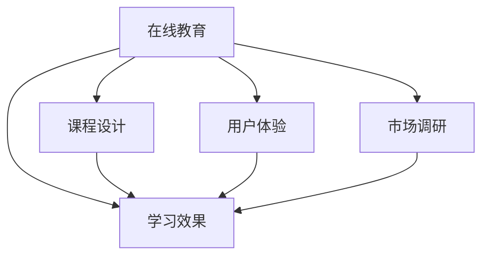

                 

# 如何打造高收益的程序员知识课程

> 关键词：在线教育,知识体系,课程设计,学习效果,用户体验,市场调研

## 1. 背景介绍

### 1.1 问题由来
在数字化转型加速的今天，信息技术已成为推动经济社会发展的重要引擎。培养高水平的信息技术人才，尤其是优秀的程序员，成为了各行各业数字化转型的关键。然而，传统的线下培训和高校教育模式已经难以满足快速变化的技术环境和市场需求。在线教育作为一种新兴的教育方式，以其灵活性、覆盖广、成本低等优势，成为程序员培养的新趋势。

### 1.2 问题核心关键点
程序员在线教育的核心在于打造优质的课程内容，以提高学习者的技能水平和实战能力，使其能够胜任实际工作。因此，本文将从课程设计、内容构建、教学实践等多个方面，系统探讨如何打造高收益的程序员知识课程。

## 2. 核心概念与联系

### 2.1 核心概念概述

为更好地理解高收益程序员知识课程的构建方法，本节将介绍几个密切相关的核心概念：

- 在线教育：通过互联网平台进行知识传授和技能培训的教育方式。线上课程的灵活性和覆盖广度，使其成为程序员培训的常见选择。

- 课程设计：根据目标学员的需求和技能水平，系统规划课程结构和内容，设计科学的教学路径和评估机制。

- 学习效果：通过合理的教学方法，提升学员的知识掌握程度和实际应用能力。

- 用户体验：线上课程的用户体验设计，包括课程界面、交互方式、反馈机制等，直接影响到学员的参与度和完成率。

- 市场调研：对目标用户和市场需求进行深入调研，根据调研结果优化课程内容和教学策略。

这些核心概念之间的逻辑关系可以通过以下Mermaid流程图来展示：



这个流程图展示了大语言模型的核心概念及其之间的关系：

1. 在线教育通过课程设计实现知识传递，影响学习效果。
2. 课程设计考虑用户体验，从而提升学习效果。
3. 市场调研提供数据支持，指导课程设计。
4. 最终，学习效果通过课程设计和用户体验共同体现。

## 3. 核心算法原理 & 具体操作步骤
### 3.1 算法原理概述

高收益的程序员知识课程设计，本质上是一种数据驱动、科学合理的教学设计方法。其核心思想是：通过系统化的课程规划、动态化的教学策略、个性化的学习路径，结合市场调研数据，实现高效的知识传递和技能提升。

形式化地，假设目标用户群体为 $U$，课程内容为 $C$，教学策略为 $T$，学习效果为 $E$，市场调研数据为 $D$。课程设计过程可以表示为：

$$
U \rightarrow D \rightarrow C \rightarrow T \rightarrow E
$$

即根据目标用户群体的调研数据，设计适合的课程内容，再结合动态的教学策略，实现高效的学习效果。

### 3.2 算法步骤详解

高收益的程序员知识课程设计一般包括以下几个关键步骤：

**Step 1: 市场调研**

- 收集目标用户群体的需求、技能水平、学习偏好等数据。
- 分析行业发展趋势和技术需求，确定课程方向和重点。

**Step 2: 课程规划**

- 根据调研结果，规划课程结构和内容。课程应覆盖基础知识、进阶技能和实战项目。
- 设计科学的教学路径，如基础模块、进阶模块和项目实战模块。
- 引入多样化的教学方法，如视频讲解、编程实战、小组讨论等。

**Step 3: 教学策略设计**

- 制定合理的教学节奏，如每日学习任务、周测试和月度评估。
- 引入激励机制，如学习证书、实践奖励、成就展示等。
- 设计个性化的学习路径，根据学员进度和反馈调整学习计划。

**Step 4: 课程实施**

- 制作高质量的教学视频、文档和代码示例。
- 搭建互动学习平台，提供课程讨论、作业提交、代码评测等功能。
- 提供实时答疑和项目指导，解决学员在学习过程中遇到的问题。

**Step 5: 效果评估与优化**

- 使用多种评估手段，如问卷调查、测试成绩、项目成果等，评估学习效果。
- 根据评估结果，持续优化课程内容和教学策略。
- 收集学员反馈，不断改进学习体验和课程质量。

以上是课程设计的一般流程。在实际应用中，还需要根据具体用户群体和市场环境，进行灵活调整和优化设计。

### 3.3 算法优缺点

高收益的程序员知识课程设计具有以下优点：
1. 数据驱动：通过市场调研和效果评估，课程设计更具针对性和科学性。
2. 灵活多样：引入多样化的教学方法，满足不同学员的学习需求。
3. 效果显著：科学规划和策略设计，显著提升学员的学习效果和实战能力。
4. 用户体验佳：通过用户调研和反馈，提升课程的互动性和参与感。

同时，该方法也存在一定的局限性：
1. 开发成本高：高质量课程内容的制作需要大量人力物力投入。
2. 持续投入大：课程内容需要不断更新，保持与技术发展同步。
3. 实施难度大：课程实施过程涉及多个环节，协调复杂。
4. 市场变化快：技术发展和用户需求变化迅速，课程设计需要快速调整。

尽管存在这些局限性，但就目前而言，高收益的程序员知识课程设计仍是线上教育领域的主流范式。未来相关研究的重点在于如何进一步降低开发成本，提高课程实施效率，同时兼顾用户体验和市场变化。

### 3.4 算法应用领域

高收益的程序员知识课程设计，在在线教育、技术培训、企业内训等多个领域得到了广泛的应用，具体包括：

- 在线编程课程：涵盖Python、Java、C++等主流编程语言，覆盖从入门到高级的全部知识点。
- 软件开发框架课程：如Spring Boot、React等，教授开发实战经验和技术栈。
- 数据科学与人工智能课程：如机器学习、深度学习、大数据等，培养数据科学与AI人才。
- 网络安全课程：如渗透测试、安全编码、网络攻防等，提升网络安全意识和技术水平。
- 软件开发方法学课程：如敏捷开发、测试驱动开发等，提升开发效率和团队协作能力。

除了这些经典课程，未来在线教育还将不断涌现新的技术领域和应用场景，为IT人才的培养提供更多机会。

## 4. 数学模型和公式 & 详细讲解  
### 4.1 数学模型构建

本节将使用数学语言对高收益程序员知识课程设计进行更加严格的刻画。

假设目标用户群体为 $U=\{u_i\}_{i=1}^n$，课程内容为 $C=\{c_j\}_{j=1}^m$，教学策略为 $T=\{t_k\}_{k=1}^K$，学习效果为 $E=\{e_l\}_{l=1}^L$。

课程设计过程可以表示为：

$$
E = f(U, D, C, T)
$$

其中 $f$ 为课程设计函数，表示根据目标用户群体的调研数据 $D$，结合课程内容 $C$ 和教学策略 $T$，实现学习效果 $E$ 的最优化。

### 4.2 公式推导过程

以下我们以Python编程课程为例，推导学习效果评估函数：

假设课程内容为 $c_j$ 表示第 $j$ 个知识点，用户对 $c_j$ 的掌握程度为 $x_{uj}$，则学习效果可以表示为：

$$
e_l = \sum_{j=1}^m \alpha_j f_{c_j}(x_{uj})
$$

其中 $\alpha_j$ 为知识点的权重系数，$f_{c_j}(x_{uj})$ 为掌握程度 $x_{uj}$ 对应 $c_j$ 的学习效果，可以通过测试成绩、作业提交质量等指标来衡量。

### 4.3 案例分析与讲解

假设某编程课程有10个知识点 $c_1, c_2, ..., c_{10}$，每个知识点都有对应的权重系数 $\alpha_j$，则学习效果评估函数可以表示为：

$$
e_l = \alpha_1 f_{c_1}(x_{u1}) + \alpha_2 f_{c_2}(x_{u2}) + ... + \alpha_{10} f_{c_{10}}(x_{u10})
$$

其中 $f_{c_j}(x_{uj})$ 表示用户 $u_j$ 对知识点 $c_j$ 的掌握程度 $x_{uj}$ 对应的学习效果，可以通过多个指标来衡量，如测试成绩、作业提交质量、项目实践成果等。

假设 $f_{c_j}(x_{uj})$ 为一个简单的线性函数，表示掌握程度 $x_{uj}$ 与学习效果 $e_l$ 的线性关系：

$$
f_{c_j}(x_{uj}) = k_j x_{uj} + b_j
$$

则总的学习效果评估函数可以表示为：

$$
e_l = \sum_{j=1}^{10} \alpha_j (k_j x_{uj} + b_j)
$$

其中 $k_j$ 和 $b_j$ 为常数，分别表示知识点的学习效果系数和基线值。通过不断优化 $\alpha_j$ 和 $k_j$，可以实现对用户学习效果的科学评估。

## 5. 项目实践：代码实例和详细解释说明
### 5.1 开发环境搭建

在进行知识课程开发前，我们需要准备好开发环境。以下是使用Python进行Django开发的环境配置流程：

1. 安装Anaconda：从官网下载并安装Anaconda，用于创建独立的Python环境。

2. 创建并激活虚拟环境：
```bash
conda create -n python-env python=3.8 
conda activate python-env
```

3. 安装Django：
```bash
pip install django==4.0
```

4. 安装Django的各个应用：
```bash
pip install django-crispy-forms django-cms django-security django-django-password django-dynamic-ssl
```

5. 安装开发工具：
```bash
pip install django-elasticsearch-dsl django-rest-framework-elasticsearch-dsl django-haystack django-filters
```

6. 安装第三方库：
```bash
pip install django-simple-cron django-graduated-fields django-pandas
```

完成上述步骤后，即可在`python-env`环境中开始课程开发。

### 5.2 源代码详细实现

下面我们以在线编程课程为例，给出使用Django开发知识课程的PyTorch代码实现。

首先，定义课程模型和用户模型：

```python
from django.db import models
from django.contrib.auth.models import User

class Course(models.Model):
    name = models.CharField(max_length=100)
    description = models.TextField()
    # 课程内容为多个知识点
    knowledge_points = models.ManyToManyField(KnowledgePoint)
    # 教学策略为多种方法
    teaching_strategies = models.ManyToManyField(TeachingStrategy)
    
    def __str__(self):
        return self.name

class User(models.Model):
    username = models.CharField(max_length=100)
    email = models.EmailField()
    # 学习效果为多个指标
    learning_effects = models.ManyToManyField(LearningEffect)
    
    def __str__(self):
        return self.username
```

然后，定义知识点、教学策略和学习效果模型：

```python
class KnowledgePoint(models.Model):
    name = models.CharField(max_length=100)
    weight = models.DecimalField(max_digits=10, decimal_places=2)

    def __str__(self):
        return self.name

class TeachingStrategy(models.Model):
    name = models.CharField(max_length=100)
    description = models.TextField()

    def __str__(self):
        return self.name

class LearningEffect(models.Model):
    name = models.CharField(max_length=100)
    description = models.TextField()
    weight = models.DecimalField(max_digits=10, decimal_places=2)

    def __str__(self):
        return self.name
```

接着，定义课程设计函数和评估函数：

```python
from django.utils.timezone import now
from django.http import JsonResponse

def course_design(request):
    # 获取目标用户群体的调研数据
    调研数据 = request.POST.get('调研数据')
    # 根据调研数据设计课程内容
    课程内容 = 设计课程内容(调研数据)
    # 结合教学策略设计评估函数
    评估函数 = 设计评估函数(课程内容)
    # 返回设计结果
    return JsonResponse({'课程内容': 课程内容, '评估函数': 评估函数})

def 设计课程内容(调研数据):
    调研数据 = 解析调研数据(调研数据)
    知识点列表 = []
    # 根据调研数据设计知识点列表
    for 知识点 in 调研数据:
        知识点列表.append(KnowledgePoint(name=知识点, weight=0.1))
    return 知识点列表

def 设计评估函数(课程内容):
    评估函数 = []
    for 知识点 in 课程内容:
        评估函数.append((知识点, 知识点.weight, 设计学习效果函数(知识点)))
    return 评估函数
```

最后，启动Django应用并测试：

```python
from django.core.wsgi import get_wsgi_application
application = get_wsgi_application()
```

启动Django应用后，可以在浏览器中访问测试地址，如http://127.0.0.1:8000/course-design/，提交调研数据和设计结果，评估函数会实时计算学习效果并返回结果。

### 5.3 代码解读与分析

让我们再详细解读一下关键代码的实现细节：

**Course和User模型**：
- `Course`模型定义了课程的基本信息，包括名称、描述、知识点、教学策略等。
- `User`模型定义了用户的基本信息，包括用户名、邮箱、学习效果等。

**知识点、教学策略和学习效果模型**：
- `KnowledgePoint`模型定义了知识点的基本信息，包括名称和权重。
- `TeachingStrategy`模型定义了教学策略的基本信息，包括名称和描述。
- `LearningEffect`模型定义了学习效果的基本信息，包括名称、描述和权重。

**课程设计函数和评估函数**：
- `course_design`函数接收用户调研数据，根据调研数据设计课程内容，结合教学策略设计评估函数，并返回结果。
- `设计课程内容`函数根据调研数据设计知识点列表，并返回结果。
- `设计评估函数`函数根据课程内容设计评估函数，并返回结果。

可以看到，Django框架通过模型和视图的设计，能够方便地实现课程的在线管理，并进行动态评估。开发者可以进一步扩展Django应用，添加更多功能，如学员管理系统、成绩统计系统等，提升课程管理的智能化水平。

当然，工业级的系统实现还需考虑更多因素，如安全性、可扩展性、用户交互等。但核心的课程设计范式基本与此类似。

## 6. 实际应用场景
### 6.1 在线编程课程

在线编程课程是程序员知识课程的重要组成部分。通过线上学习，学员可以掌握编程语言的精髓，提升代码编写能力。

具体而言，可以采用以下流程：

1. 收集目标用户群体的调研数据，确定编程语言的入门知识和进阶技能。
2. 设计课程内容，涵盖从基础语法到高级编程实践的全部知识点。
3. 引入多样化的教学策略，如视频讲解、代码实践、小组讨论等。
4. 搭建互动学习平台，提供课程讨论、作业提交、代码评测等功能。
5. 根据学员的学习效果和反馈，不断优化课程内容和教学策略。

### 6.2 软件开发框架课程

软件开发框架课程面向有一定编程基础的学员，教授主流框架如Spring Boot、React等，使学员能够快速上手框架，实现复杂业务功能。

具体流程如下：

1. 收集目标用户群体的调研数据，确定框架的入门知识和高级应用。
2. 设计课程内容，涵盖框架的基础语法、架构设计、实践案例等。
3. 引入动态的教学策略，如代码实战、项目实践、在线答疑等。
4. 搭建框架实战平台，提供框架搭建、项目部署、性能优化等功能。
5. 根据学员的学习效果和反馈，不断优化课程内容和教学策略。

### 6.3 数据科学与人工智能课程

数据科学与人工智能课程面向对数据和算法感兴趣的用户，教授机器学习、深度学习、大数据等技术，使学员具备数据科学与AI的基本技能。

具体流程如下：

1. 收集目标用户群体的调研数据，确定数据科学与AI的入门知识和高级技能。
2. 设计课程内容，涵盖数据处理、模型训练、算法优化等全部知识点。
3. 引入多样化的教学策略，如在线视频、实战项目、在线答疑等。
4. 搭建数据科学平台，提供数据处理、模型训练、算法优化等功能。
5. 根据学员的学习效果和反馈，不断优化课程内容和教学策略。

### 6.4 未来应用展望

随着在线教育的不断发展和技术的进步，高收益的程序员知识课程将呈现以下几个发展趋势：

1. 课程内容更具针对性。根据用户的调研数据和反馈，不断优化课程内容，实现个性化教学。
2. 教学策略更加灵活。结合先进的教育技术和互动设计，提高学员的参与度和学习效果。
3. 在线平台更加智能化。利用AI和大数据技术，实现学习效果的精准评估和个性化推荐。
4. 教学资源更加丰富。结合多种教学资源，如视频、代码、文档等，提升教学质量。
5. 学习体验更加交互。通过实时反馈、智能推荐等手段，提升学习体验和用户粘性。

总之，未来在线教育将更加注重个性化、互动化和智能化，以提高学习效果和用户体验。高收益的程序员知识课程也将与时俱进，不断拓展应用场景，为IT人才的培养提供更多机会。

## 7. 工具和资源推荐
### 7.1 学习资源推荐

为了帮助开发者系统掌握在线教育课程设计的方法，这里推荐一些优质的学习资源：

1. Coursera《深度学习》课程：斯坦福大学开设的深度学习入门课程，涵盖深度学习的基本原理和应用。

2. Udacity《机器学习》纳米学位：Udacity提供的机器学习专业课程，结合实战项目，提升实战能力。

3. edX《大数据》课程：哈佛大学和IBM合作开设的大数据课程，涵盖大数据的基础知识和应用技术。

4. Codecademy《Python编程》课程：Codecademy提供的免费Python编程课程，适合编程零基础学员入门。

5. Pluralsight《Web开发》课程：Pluralsight提供的Web开发课程，涵盖Web开发的所有技术栈。

6. Kaggle《数据科学》竞赛：Kaggle平台提供的各类数据科学竞赛，提升实战能力和竞赛经验。

通过对这些资源的学习实践，相信你一定能够快速掌握在线教育的精髓，并用于解决实际的课程设计问题。

### 7.2 开发工具推荐

高效的开发离不开优秀的工具支持。以下是几款用于在线教育课程开发的常用工具：

1. Django：基于Python的Web框架，具有强大的功能和灵活性，适合构建在线教育平台。

2. PyTorch：基于Python的深度学习框架，支持动态计算图，方便课程内容的设计和实验。

3. Elasticsearch：分布式搜索与分析引擎，适合课程内容的快速索引和检索。

4. Haystack：Python语义搜索库，支持多种搜索引擎，方便课程内容的搜索和匹配。

5. Celery：Python分布式任务队列，支持异步任务处理，提高课程内容的加载和渲染效率。

6. Docker：容器化技术，适合课程内容的打包和部署。

合理利用这些工具，可以显著提升在线教育课程开发的效率，加快课程的迭代和优化。

### 7.3 相关论文推荐

在线教育课程设计的研究源于学界的持续探索。以下是几篇奠基性的相关论文，推荐阅读：

1. Learning to Learn（《学习如何学习》）：提出学习如何学习的深度学习模型，为个性化学习提供了新思路。

2. Artificial Intelligence for Learning Analytics（《人工智能在教学分析中的应用》）：探讨AI技术在教学分析中的应用，通过数据驱动实现教学优化。

3. Online Learning Analytics（《在线学习分析》）：系统介绍在线学习分析的原理和方法，提升在线教育的教学质量。

4. Massive Open Online Courses: Learning Analytics（《大规模在线开放课程：学习分析》）：研究大规模在线开放课程的学习分析技术，提升在线教育的互动性和效果。

5. Adaptive Learning Systems: Design and Evaluation（《自适应学习系统：设计与评估》）：探讨自适应学习系统的设计方法和评估指标，提升学习效果和用户体验。

这些论文代表了大语言模型微调技术的发展脉络。通过学习这些前沿成果，可以帮助研究者把握学科前进方向，激发更多的创新灵感。

## 8. 总结：未来发展趋势与挑战
### 8.1 总结

本文对高收益程序员知识课程的设计方法进行了全面系统的介绍。首先阐述了在线教育课程设计的背景和意义，明确了课程设计对提升学员技能水平和实战能力的关键作用。其次，从原理到实践，详细讲解了课程设计的过程和关键步骤，给出了课程开发的具体代码实现。同时，本文还广泛探讨了课程设计在多个行业领域的应用前景，展示了课程设计的巨大潜力。

通过本文的系统梳理，可以看到，高收益的程序员知识课程设计方法，已经成为在线教育领域的重要范式。这些方法的科学性和灵活性，使其能够在多种场景下快速落地应用，推动IT人才的培养和产业升级。未来，伴随在线教育的不断发展和技术的进步，课程设计还将迎来更多的创新和突破，为IT人才的培养提供更广阔的平台。

### 8.2 未来发展趋势

展望未来，在线教育课程设计将呈现以下几个发展趋势：

1. 课程内容更加灵活：结合用户的调研数据和反馈，不断优化课程内容，实现个性化教学。
2. 教学策略更加多样：引入先进的教育技术和互动设计，提高学员的参与度和学习效果。
3. 在线平台更加智能化：利用AI和大数据技术，实现学习效果的精准评估和个性化推荐。
4. 教学资源更加丰富：结合多种教学资源，如视频、代码、文档等，提升教学质量。
5. 学习体验更加交互：通过实时反馈、智能推荐等手段，提升学习体验和用户粘性。

以上趋势凸显了在线教育课程设计的广阔前景。这些方向的探索发展，必将进一步提升在线教育的质量和效果，为IT人才的培养提供更多机会。

### 8.3 面临的挑战

尽管在线教育课程设计已经取得了瞩目成就，但在迈向更加智能化、普适化应用的过程中，它仍面临诸多挑战：

1. 调研数据不足：尽管可以获取部分用户调研数据，但整体覆盖面和深度仍显不足，制约课程设计的针对性。
2. 教学质量参差不齐：不同课程的设计水平和教师能力差异较大，影响课程的整体质量。
3. 学习效果评估难：如何通过技术手段，实现学习效果的精准评估和反馈，仍是一个难题。
4. 用户粘性低：在线教育平台的用户参与度和粘性较低，如何提高用户活跃度和留存率，仍是一个难题。

尽管存在这些挑战，但就目前而言，在线教育课程设计仍是教育领域的主流范式。未来相关研究的重点在于如何进一步优化调研方法，提高教学质量，优化学习效果评估，同时兼顾用户粘性和市场变化。

### 8.4 研究展望

面对在线教育课程设计所面临的种种挑战，未来的研究需要在以下几个方面寻求新的突破：

1. 引入大数据和AI技术：通过大数据分析，获取更全面、准确的调研数据，指导课程设计。利用AI技术，提升教学效果和评估精度。
2. 设计科学的教学评估体系：引入多样化的评估手段，如在线测试、项目实践、学生反馈等，实现对学习效果的全面评估。
3. 引入游戏化设计元素：通过游戏化设计，提高用户的参与度和粘性，提升学习效果。
4. 加强互动与社交功能：通过社交互动功能，增强学习者之间的交流和协作，提升学习效果。
5. 引入国际化设计思路：考虑全球化视野，设计具有跨文化适应性的课程，满足不同文化背景用户的需求。

这些研究方向的探索，必将引领在线教育课程设计走向更高的台阶，为IT人才的培养提供更多机会。面向未来，在线教育课程设计还需要与其他教育技术进行更深入的融合，如虚拟现实、增强现实、混合现实等，多路径协同发力，共同推动在线教育的质量提升。只有勇于创新、敢于突破，才能不断拓展在线教育的边界，让在线教育技术更好地造福人类社会。

## 9. 附录：常见问题与解答
**Q1：如何确定在线课程的内容？**

A: 确定在线课程内容的主要依据是目标用户群体的调研数据。可以通过问卷调查、在线讨论、行业报告等多种方式，收集目标用户群体的需求、技能水平和学习偏好等数据。然后根据调研数据，设计出科学合理的课程结构和内容，确保课程具有针对性和实用性。

**Q2：课程内容的实施有哪些难点？**

A: 课程内容的实施过程中，主要有以下几个难点：

1. 课程内容的动态更新：需要根据技术发展、市场变化和学员反馈，不断优化课程内容，保持课程的最新性和实用性。

2. 教学资源的丰富多样：需要结合多种教学资源，如视频、代码、文档等，提升教学质量。

3. 教学策略的多样灵活：需要根据不同的教学目标和学员特点，设计多样化的教学策略，提高教学效果。

4. 学习效果的精准评估：需要引入多种评估手段，如在线测试、项目实践、学生反馈等，实现对学习效果的全面评估。

5. 学员的参与度和粘性：需要设计多样化的互动方式，如在线讨论、项目合作、游戏化设计等，提高学员的参与度和粘性。

这些难点需要通过持续优化和改进，不断提升课程实施的效率和效果。

**Q3：如何提升在线教育的教学效果？**

A: 提升在线教育的教学效果，主要可以从以下几个方面入手：

1. 引入先进的教育技术：利用AI和大数据分析，实现教学的智能化和个性化。

2. 设计科学的教学策略：结合不同的教学目标和学员特点，设计多样化的教学策略，提高教学效果。

3. 丰富多样的教学资源：结合多种教学资源，如视频、代码、文档等，提升教学质量。

4. 设计灵活的教学方式：设计灵活的教学方式，如在线讨论、项目合作、游戏化设计等，提高学员的参与度和粘性。

5. 实现精准的教学评估：引入多种评估手段，如在线测试、项目实践、学生反馈等，实现对学习效果的全面评估。

通过不断优化和改进，可以实现在线教育的教学效果最大化，为IT人才的培养提供更多机会。

**Q4：如何评估在线课程的学习效果？**

A: 评估在线课程的学习效果，可以从以下几个方面入手：

1. 设计科学的评估体系：引入多种评估手段，如在线测试、项目实践、学生反馈等，实现对学习效果的全面评估。

2. 设计个性化的评估方案：根据不同的教学目标和学员特点，设计个性化的评估方案，提高评估的针对性和有效性。

3. 实现实时化的评估反馈：通过实时反馈机制，及时了解学员的学习效果和存在问题，进行针对性的指导和改进。

4. 引入多维度的评估指标：结合不同的评估指标，如知识掌握程度、实战能力、学习态度等，全面评估学习效果。

通过不断优化和改进，可以实现对在线课程学习效果的科学评估，推动在线教育质量的提升。

**Q5：如何提升在线课程的用户粘性？**

A: 提升在线课程的用户粘性，主要可以从以下几个方面入手：

1. 设计互动性强的内容：通过设计互动性强的内容，如在线讨论、项目合作、游戏化设计等，提高学员的参与度和粘性。

2. 提供多样化的学习路径：设计多样化的学习路径，满足不同学员的学习需求，提高学习效果。

3. 设计灵活的学习方式：设计灵活的学习方式，如自学、小组讨论、在线测试等，提高学员的自主性和粘性。

4. 提供个性化的学习支持：根据学员的学习情况和需求，提供个性化的学习支持，提高学习效果和粘性。

5. 建立社区化学习环境：通过社区化学习环境，增强学员之间的交流和协作，提高学习效果和粘性。

通过不断优化和改进，可以实现对在线课程用户粘性的有效提升，推动在线教育质量的提升。

---

作者：禅与计算机程序设计艺术 / Zen and the Art of Computer Programming

