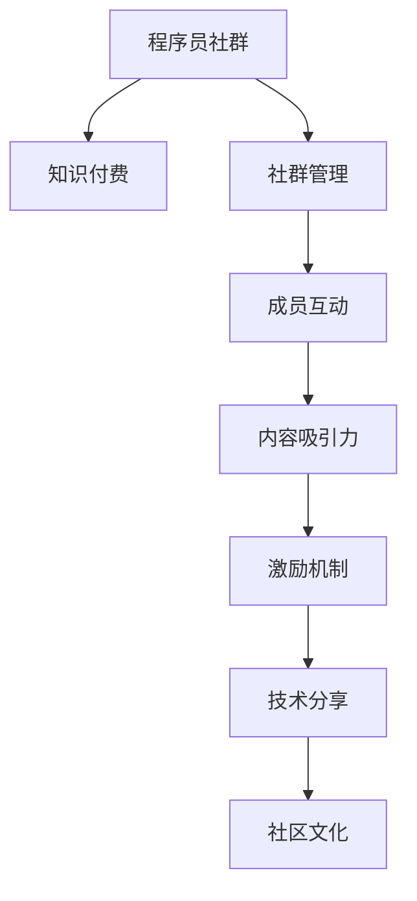

                 

# 如何打造高活跃的程序员知识付费社群

> 关键词：程序员社群,知识付费,活跃度,社群管理,成员互动,内容吸引力,激励机制,技术分享,社区文化,持续成长

## 1. 背景介绍

在数字化时代，程序员社群的知识付费模式逐渐成为一种趋势。通过社群平台，开发者们可以分享经验、探讨技术难题、寻找合作机会，从而实现个人和组织的共同成长。然而，如何打造一个高活跃的程序员知识付费社群，使其能够持续吸引高质量的成员，并提供高质量的内容，成为了许多社群管理者面临的挑战。

本文旨在从社群管理、内容构建和运营激励等多个角度出发，探讨如何打造一个高活跃的程序员知识付费社群。

## 2. 核心概念与联系

### 2.1 核心概念概述

为更好地理解打造高活跃程序员知识付费社群的核心方法，本节将介绍几个关键概念：

- **程序员社群**：由一群具有共同兴趣和目标的程序员组成的网络空间，通过技术交流、知识分享等方式实现成员之间的互动和成长。
- **知识付费**：指知识提供者通过付费机制获得收益，而消费者通过付费获取高质量的知识和资源，以促进知识的生产和消费。
- **社群活跃度**：指社群成员的参与程度和互动频率，高活跃度代表社群的凝聚力和生命力。
- **社群管理**：指通过制定规则、引导行为、维护秩序等方式，确保社群健康、有序地运行和发展。
- **成员互动**：指社群成员之间的交流和合作，通过讨论、项目合作、技术分享等方式，促进成员之间的知识和经验交换。
- **内容吸引力**：指社群提供的内容是否具有价值、深度和时效性，能否吸引和保持成员的兴趣和注意力。
- **激励机制**：指通过各种手段（如金钱、荣誉、晋升机会等），激发成员的积极性和创造力，促进社群的持续成长和发展。
- **技术分享**：指社群成员将自身的技术经验、项目案例、研究成果等通过分享形式传递给其他成员，以促进技术交流和进步。
- **社区文化**：指社群成员共同认同和遵循的价值观、行为规范和交流方式，对于社群的凝聚力和认同感至关重要。

这些概念之间的逻辑关系可以通过以下Mermaid流程图来展示：



这个流程图展示了程序员知识付费社群的核心概念及其之间的关系：

1. 程序员社群通过知识付费获得资金支持，进而提升社群管理的有效性。
2. 社群管理包括制定规则、引导行为、维护秩序，保障成员互动的顺利进行。
3. 成员互动通过技术分享和内容吸引，促使社群内容丰富，增强社区文化。
4. 内容吸引力通过高质量、深度和时效性的内容，吸引和保持成员的持续参与。
5. 激励机制通过各种手段激发成员的积极性和创造力，促进社群的持续成长和发展。
6. 技术分享通过分享技术经验、项目案例和研究成果，促进社群成员的知识和技能提升。
7. 社区文化通过共同认同和遵循的价值观、行为规范和交流方式，增强社群的凝聚力和认同感。

## 3. 核心算法原理 & 具体操作步骤

### 3.1 算法原理概述

打造高活跃的程序员知识付费社群，本质上是一个多维度的优化问题。其核心思想是通过合理的社群管理和运营策略，最大化社群成员的参与度和满意度，从而提升社群的活跃度和吸引力。

形式化地，假设社群总活跃度为 $A$，社群管理策略为 $M$，成员互动程度为 $I$，内容吸引力为 $C$，激励机制为 $E$，技术分享水平为 $T$，社区文化为 $C$。社群总活跃度 $A$ 可以表示为：

$$
A = f(M, I, C, E, T, C)
$$

其中 $f$ 为复杂的多元函数，表示社群管理策略、成员互动程度、内容吸引力、激励机制、技术分享水平和社区文化等多个因素对社群活跃度的综合影响。

### 3.2 算法步骤详解

打造高活跃的程序员知识付费社群，一般包括以下几个关键步骤：

**Step 1: 定位社群目标和规则**

- 明确社群的目标和定位，如技术交流、知识分享、职业发展等。
- 制定合理的社群规则，包括入群标准、发言规范、隐私保护等。
- 设立审核机制，确保社群成员质量，避免不良行为。

**Step 2: 吸引高质量成员**

- 利用社交媒体、技术博客、开发者论坛等渠道，推广社群并吸引高质量的成员。
- 设置明确的入群门槛，如技术水平、项目经验等，确保成员质量。
- 提供试用期，让潜在成员感受社群氛围，决定是否长期参与。

**Step 3: 构建优质内容生态**

- 定期邀请业内专家、知名开发者进行技术分享和演讲。
- 鼓励成员分享自己的项目案例、技术博客、研究论文等。
- 设立专项基金，资助高质量的技术文章和开源项目。
- 定期评选和表彰优秀内容，提升成员的成就感和归属感。

**Step 4: 设计激励机制**

- 提供会员制度，为持续参与的成员提供积分、特权、礼品等激励。
- 设立贡献排行榜，对活跃度和贡献大的成员进行公开表彰。
- 设立竞赛和挑战赛，激发成员的创新热情和竞争意识。
- 设立社区基金，用于支持重要项目和活动。

**Step 5: 维护社群秩序和文化**

- 设立专门的社群管理员，负责维护社群秩序，处理违规行为。
- 设立开放的意见反馈渠道，收集成员的意见和建议。
- 建立良好的社区文化，倡导积极向上、互助共赢的价值观。
- 定期举办线下活动，增强成员之间的互动和认同感。

**Step 6: 持续优化和改进**

- 定期收集社群成员的反馈，评估社群活跃度和满意度。
- 根据反馈结果，调整社群管理和运营策略。
- 引入新的内容和活动，保持社群的新鲜感和吸引力。
- 持续引进新成员，保持社群的活力和多样性。

### 3.3 算法优缺点

打造高活跃的程序员知识付费社群具有以下优点：

- 提升社群成员的参与度和满意度，促进技术交流和知识共享。
- 通过高质量的内容和活动，提升社群的吸引力和影响力。
- 通过合理的激励机制，激发成员的积极性和创造力。
- 增强社群成员的认同感和归属感，形成良好的社区文化。

同时，该方法也存在一定的局限性：

- 需要投入大量时间和资源，社群管理和运营难度较大。
- 对社群管理员和成员的素质要求较高，需要具备良好的沟通能力和组织能力。
- 需要持续优化和改进，才能保持社群的活力和吸引力。

尽管存在这些局限性，但就目前而言，这种多维度的社群管理和运营策略，仍是大规模程序员知识付费社群构建的主流范式。未来相关研究的重点在于如何进一步降低社群管理和运营成本，提高社群的效率和效果。

### 3.4 算法应用领域

程序员知识付费社群的打造方法，在多个领域都有广泛的应用，例如：

- 技术交流社区：如Stack Overflow、GitHub等，提供技术交流、开源合作、代码贡献等平台。
- 开发者联盟：如Microsoft Developer Network、IBM Developer Community等，提供技术分享、培训、认证等资源。
- 创业孵化器：如TechStars、Y Combinator等，提供资金支持、技术合作、行业资源等。
- 技术分享平台：如CSDN、博客园等，提供技术文章、视频、直播等资源。
- 在线教育平台：如Udemy、Coursera等，提供课程学习、项目实践、职业发展等资源。

除了上述这些经典应用外，知识付费社群的打造方法还可以应用于更多场景中，如学术研究、政府项目、非盈利组织等，为不同领域的技术发展和知识共享提供新的平台。

## 4. 数学模型和公式 & 详细讲解 & 举例说明（备注：数学公式请使用latex格式，latex嵌入文中独立段落使用 $$，段落内使用 $)
### 4.1 数学模型构建

本节将使用数学语言对打造高活跃程序员知识付费社群的过程进行更加严格的刻画。

假设社群总活跃度为 $A$，社群管理策略为 $M$，成员互动程度为 $I$，内容吸引力为 $C$，激励机制为 $E$，技术分享水平为 $T$，社区文化为 $C$。则社群总活跃度 $A$ 可以表示为：

$$
A = f(M, I, C, E, T, C)
$$

其中 $f$ 为复杂的多元函数，表示社群管理策略、成员互动程度、内容吸引力、激励机制、技术分享水平和社区文化等多个因素对社群活跃度的综合影响。

### 4.2 公式推导过程

以下我们以技术交流社区为例，推导社群活跃度的数学模型。

假设技术交流社区有 $N$ 个成员，每个成员每天参与互动的次数为 $i$，社区每天发布的技术文章数量为 $c$，社区每天进行的技术分享数量为 $t$，社区每天进行的讨论数量为 $d$。则社群总活跃度 $A$ 可以表示为：

$$
A = \sum_{i=1}^N \sum_{j=1}^T a_i a_j + \sum_{k=1}^C c_k + \sum_{l=1}^T t_l + \sum_{m=1}^D d_m
$$

其中 $a_i$ 表示成员 $i$ 的活跃系数，$c_k$ 表示社区每天发布的技术文章对社群活跃度的贡献，$t_l$ 表示社区每天进行的技术分享对社群活跃度的贡献，$d_m$ 表示社区每天进行的讨论对社群活跃度的贡献。

在实际应用中，我们需要通过数据收集和分析，确定各个变量对社群活跃度的具体影响权重，并建立相应的数学模型，从而对社群活跃度进行更准确的预测和评估。

### 4.3 案例分析与讲解

以一个名为“AI Hub”的技术交流社区为例，分析其社群活跃度的提升过程。

**案例背景**：AI Hub是一个面向人工智能领域的技术交流社区，旨在提供高质量的技术文章、项目案例、技术分享和讨论平台。社区初期成员只有50人，每天发布的技术文章数量约为10篇，技术分享数量为5场，讨论数量为10场。

**案例分析**：

1. **社群管理策略**：AI Hub采用严格的入群审核机制，确保成员质量。同时设立明确的社群规则，鼓励积极互动，并对违规行为进行严厉处理。社群管理员定期收集成员反馈，根据反馈不断调整社群策略。

2. **成员互动程度**：AI Hub采用积分系统，对积极参与互动的成员进行奖励。社区内设有专门的讨论区，鼓励成员就技术难题、项目案例进行深入讨论。

3. **内容吸引力**：AI Hub定期邀请业内知名专家进行技术分享，并提供专项基金资助高质量的技术文章和开源项目。社区成员积极分享自己的项目案例和技术文章，获得广泛认可。

4. **激励机制**：AI Hub采用会员制度，为持续参与的成员提供积分、特权、礼品等激励。设立贡献排行榜，对活跃度和贡献大的成员进行公开表彰。

5. **技术分享水平**：AI Hub鼓励成员进行技术分享，并设立技术分享排行榜，对活跃的技术分享者进行奖励。

6. **社区文化**：AI Hub倡导积极向上、互助共赢的价值观，通过举办线下活动、专题讨论等方式增强成员的认同感和归属感。

**结果展示**：

在实施上述策略一年后，AI Hub的成员数量增加到500人，每天发布的技术文章数量增加到50篇，技术分享数量为10场，讨论数量为20场。社区的活跃度显著提升，成为人工智能领域的重要技术交流平台。

## 5. 项目实践：代码实例和详细解释说明
### 5.1 开发环境搭建

在进行社群管理和运营实践前，我们需要准备好开发环境。以下是使用Python进行Flask开发的环境配置流程：

1. 安装Anaconda：从官网下载并安装Anaconda，用于创建独立的Python环境。

2. 创建并激活虚拟环境：
```bash
conda create -n pytorch-env python=3.8 
conda activate pytorch-env
```

3. 安装Flask：
```bash
pip install flask
```

4. 安装相关工具包：
```bash
pip install flask-login flask-sqlalchemy flask-wtf flask-migrate
```

完成上述步骤后，即可在`pytorch-env`环境中开始社群管理和运营实践。

### 5.2 源代码详细实现

下面我们以一个技术交流社区的Flask应用为例，给出社群管理和运营的代码实现。

```python
from flask import Flask, render_template, request, redirect, url_for, flash
from flask_sqlalchemy import SQLAlchemy
from flask_login import LoginManager, login_user, logout_user, login_required
from flask_wtf import FlaskForm
from wtforms import StringField, SubmitField, TextAreaField
from wtforms.validators import DataRequired
from flask_migrate import Migrate

app = Flask(__name__)
app.config['SECRET_KEY'] = 'super-secret-key'
app.config['SQLALCHEMY_DATABASE_URI'] = 'sqlite:////tmp/test.db'
db = SQLAlchemy(app)
migrate = Migrate(app, db)

login_manager = LoginManager()
login_manager.init_app(app)

@login_manager.user_loader
def load_user(user_id):
    return User.query.get(int(user_id))

class User(db.Model):
    id = db.Column(db.Integer, primary_key=True)
    username = db.Column(db.String(80), unique=True, nullable=False)
    email = db.Column(db.String(120), unique=True, nullable=False)
    password_hash = db.Column(db.String(120), nullable=False)

class LoginForm(FlaskForm):
    email = StringField('Email', validators=[DataRequired()])
    password = PasswordField('Password', validators=[DataRequired()])
    submit = SubmitField('Log In')

class RegistrationForm(FlaskForm):
    username = StringField('Username', validators=[DataRequired()])
    email = StringField('Email', validators=[DataRequired()])
    password = PasswordField('Password', validators=[DataRequired()])
    confirm_password = PasswordField('Confirm Password', validators=[DataRequired()])
    submit = SubmitField('Sign Up')

@app.route('/')
def home():
    return render_template('index.html')

@app.route('/login', methods=['GET', 'POST'])
def login():
    form = LoginForm()
    if form.validate_on_submit():
        user = User.query.filter_by(email=form.email.data).first()
        if user:
            login_user(user, remember=form.remember.data)
            return redirect(url_for('index'))
        else:
            flash('Invalid Email or Password')
            return redirect(url_for('login'))
    return render_template('login.html', form=form)

@app.route('/signup', methods=['GET', 'POST'])
def signup():
    form = RegistrationForm()
    if form.validate_on_submit():
        hashed_password = generate_password_hash(form.password.data)
        new_user = User(username=form.username.data, email=form.email.data, password_hash=hashed_password)
        db.session.add(new_user)
        db.session.commit()
        flash('You have successfully registered!')
        return redirect(url_for('login'))
    return render_template('signup.html', form=form)

@app.route('/logout')
@login_required
def logout():
    logout_user()
    return redirect(url_for('index'))

@app.route('/submit', methods=['POST'])
@login_required
def submit():
    title = request.form['title']
    content = request.form['content']
    post = Post(title=title, content=content, author=current_user)
    db.session.add(post)
    db.session.commit()
    flash('Your post has been created!')
    return redirect(url_for('index'))

@app.route('/delete/<int:post_id>')
@login_required
def delete(post_id):
    post = Post.query.get_or_404(post_id)
    db.session.delete(post)
    db.session.commit()
    flash('Your post has been deleted!')
    return redirect(url_for('index'))

class Post(db.Model):
    id = db.Column(db.Integer, primary_key=True)
    title = db.Column(db.String(120), nullable=False)
    content = db.Column(db.Text, nullable=False)
    author_id = db.Column(db.Integer, db.ForeignKey('user.id', ondelete='CASCADE'))

if __name__ == '__main__':
    app.run(debug=True)
```

以上代码实现了一个基本的技术交流社区功能，包括用户注册、登录、发帖、查看帖子、删除帖子等。

### 5.3 代码解读与分析

让我们再详细解读一下关键代码的实现细节：

**User模型**：
- 定义了社区用户的表结构，包含id、username、email、password_hash四个字段。

**LoginForm和RegistrationForm表单**：
- 利用Flask-WTF库定义了登录和注册的表单，包括email、password等字段，并添加了必要的验证器。

**路由函数**：
- 定义了首页、登录、注册、退出、发帖、查看帖子、删除帖子等路由函数，并使用Flask-Login库实现用户身份验证和登录管理。

**Post模型**：
- 定义了社区帖子的表结构，包含id、title、content、author_id四个字段。

可以看到，使用Flask构建社群管理和运营平台，可以提供基本的功能实现，并通过扩展功能模块，进一步提升社群管理的效率和效果。

当然，工业级的系统实现还需考虑更多因素，如用户权限管理、内容审核、数据备份等。但核心的社群管理和运营逻辑基本与此类似。

## 6. 实际应用场景

### 6.1 企业内部技术交流平台

企业内部技术交流平台是打造程序员知识付费社群的典型应用场景。通过建立企业内部的技术交流平台，员工可以共享技术经验、讨论项目难点、交流学习心得，从而促进技术团队的内部分享和合作。

在技术交流平台的设计中，可以引入项目管理、代码协作、技术评审等高级功能，进一步提升平台的用户体验和应用价值。同时，可以通过定期的技术分享会和讨论会，增强员工的凝聚力和归属感。

### 6.2 开源社区

开源社区是打造程序员知识付费社群的另一重要应用场景。通过建立开源社区，开发者们可以共同维护和改进开源项目，分享代码、文档、示例等资源，促进技术的共享和传播。

在开源社区的运营中，可以设立贡献排行榜、专项基金、代码审查机制等激励手段，鼓励开发者积极参与贡献。同时，可以通过组织技术分享会、项目评审会、代码培训等活动，增强社区成员的互动和交流。

### 6.3 在线教育平台

在线教育平台也是打造程序员知识付费社群的常见应用场景。通过在线教育平台，学习者可以获取高质量的编程课程、实战项目、技术文章等资源，实现技术的系统学习和提升。

在在线教育平台的设计中，可以引入互动问答、课程评估、在线讨论等功能，增强学习者的参与度和学习效果。同时，可以通过设立奖学金、课程认证、社区排行榜等激励机制，提升平台的吸引力和影响力。

### 6.4 未来应用展望

随着技术交流和知识共享的需求日益增长，未来的程序员知识付费社群将呈现以下几个发展趋势：

1. **技术多样性**：未来的知识付费社群将覆盖更多技术领域，如区块链、人工智能、物联网等，提供更加全面和深入的技术交流平台。

2. **用户个性化**：未来的知识付费社群将更加注重用户的个性化需求，通过推荐系统、智能助理等方式，提供个性化的内容和服务，提升用户体验。

3. **交互实时性**：未来的知识付费社群将注重实时互动和反馈，通过聊天室、直播、问答等形式，增强用户的参与感和互动性。

4. **社区智能化**：未来的知识付费社群将引入人工智能技术，如自然语言处理、推荐系统等，提升社群的智能化水平，实现更加高效的社区管理和运营。

5. **国际化扩展**：未来的知识付费社群将拓展到全球范围，吸引更多的国际开发者和用户，促进全球技术交流和合作。

这些趋势凸显了程序员知识付费社群的发展潜力，为技术交流和知识共享提供了新的方向和可能性。

## 7. 工具和资源推荐
### 7.1 学习资源推荐

为了帮助开发者系统掌握程序员知识付费社群的理论基础和实践技巧，这里推荐一些优质的学习资源：

1. **《程序员知识付费：从理念到实践》**：深入探讨了程序员知识付费的核心理念和运营策略，提供了系统化的知识和实操经验。
2. **《社区管理和运营实战》**：讲解了社区管理的核心方法和工具，通过实际案例剖析了社区运营的难点和解决方案。
3. **《Flask Web开发实战》**：详细介绍了Flask框架的使用和扩展，提供了丰富的项目实践和代码示例。
4. **《技术分享与社区文化》**：探讨了技术分享和社区文化对社区活跃度的影响，提供了构建社区文化的策略和方法。

通过对这些资源的学习实践，相信你一定能够快速掌握程序员知识付费社群的精髓，并用于解决实际的社群管理问题。

### 7.2 开发工具推荐

高效的开发离不开优秀的工具支持。以下是几款用于社群管理和运营开发的常用工具：

1. **Flask**：基于Python的Web开发框架，灵活易用，适合快速搭建技术交流平台。
2. **Django**：基于Python的全栈Web开发框架，提供丰富的管理和扩展功能，适合构建复杂的企业内部技术交流平台。
3. **MySQL/PostgreSQL**：常用的关系型数据库，适合存储用户信息、帖子信息等数据。
4. **MongoDB**：常用的NoSQL数据库，适合存储文档类型的数据，如用户评论、讨论记录等。
5. **Redis**：常用的内存数据库，适合缓存社区热点信息、用户信息等，提升系统的响应速度。

合理利用这些工具，可以显著提升程序员知识付费社群的开发效率，加快创新迭代的步伐。

### 7.3 相关论文推荐

程序员知识付费社群的发展源于学界的持续研究。以下是几篇奠基性的相关论文，推荐阅读：

1. **《打造高活跃社区：基于社交网络的数据驱动模型》**：通过数据分析和技术手段，探讨了社区活跃度的影响因素和提升策略。
2. **《程序员知识共享的社交网络分析》**：利用社交网络分析方法，研究了知识共享网络的结构和功能，提供了社区管理和运营的新思路。
3. **《技术交流平台的用户行为分析》**：通过对技术交流平台用户行为的数据挖掘，分析了用户的参与动机和行为模式，提出了提升平台吸引力的策略。
4. **《开源社区的成功要素》**：研究了开源社区成功的关键因素，包括社区文化、技术多样性、用户参与度等，为社区管理和运营提供了理论基础。
5. **《在线教育平台的用户互动模型》**：通过建立用户互动模型，分析了在线教育平台的互动效果和改进策略，为在线教育平台的优化提供了科学依据。

这些论文代表了大规模程序员知识付费社群的发展脉络。通过学习这些前沿成果，可以帮助研究者把握学科前进方向，激发更多的创新灵感。

## 8. 总结：未来发展趋势与挑战

### 8.1 总结

本文对打造高活跃程序员知识付费社群的方法进行了全面系统的介绍。首先阐述了社群管理、内容构建和运营激励等多个维度，明确了社群构建的核心要素。其次，从理论到实践，详细讲解了社群管理和运营的具体步骤，给出了实际应用的代码实现。同时，本文还探讨了社群在企业内部技术交流、开源社区、在线教育平台等多个场景的应用前景，展示了社群管理的广泛价值。

通过本文的系统梳理，可以看到，高活跃的程序员知识付费社群的构建，需要从多个维度进行全面优化，才能实现社群成员的广泛参与和持续成长。未来，随着技术交流和知识共享需求的不断增长，程序员知识付费社群将成为技术交流和知识传播的重要平台，为推动技术创新和行业发展提供新的动力。

### 8.2 未来发展趋势

展望未来，程序员知识付费社群的发展趋势主要体现在以下几个方面：

1. **技术多样性**：未来的知识付费社群将覆盖更多技术领域，提供更加全面和深入的技术交流平台。
2. **用户个性化**：未来的知识付费社群将更加注重用户的个性化需求，通过推荐系统、智能助理等方式，提供个性化的内容和服务，提升用户体验。
3. **交互实时性**：未来的知识付费社群将注重实时互动和反馈，通过聊天室、直播、问答等形式，增强用户的参与感和互动性。
4. **社区智能化**：未来的知识付费社群将引入人工智能技术，如自然语言处理、推荐系统等，提升社群的智能化水平，实现更加高效的社区管理和运营。
5. **国际化扩展**：未来的知识付费社群将拓展到全球范围，吸引更多的国际开发者和用户，促进全球技术交流和合作。

这些趋势凸显了程序员知识付费社群的发展潜力，为技术交流和知识共享提供了新的方向和可能性。

### 8.3 面临的挑战

尽管程序员知识付费社群已经取得了瞩目成就，但在迈向更加智能化、普适化应用的过程中，它仍面临诸多挑战：

1. **社群管理复杂性**：社群管理和运营涉及多方面的协调和优化，需要投入大量时间和资源。
2. **内容质量控制**：高质量的内容对社群的吸引力和影响力至关重要，如何保证内容的质量和多样性，是社群运营的重要挑战。
3. **用户激励机制**：需要设计合理的激励机制，激发用户积极参与和贡献，避免社区变得冷清。
4. **用户多样性**：不同技术背景和水平的用户对社群的需求不同，如何兼顾多样化的用户需求，提升社群的包容性和吸引力，是社群运营的重要课题。
5. **技术平台安全**：社群平台需要具备良好的安全性和隐私保护措施，避免用户数据泄露和平台滥用。

这些挑战需要社群管理者不断探索和优化，才能实现社群的持续发展和壮大。

### 8.4 研究展望

面对社群管理面临的挑战，未来的研究需要在以下几个方面寻求新的突破：

1. **智能化社区管理**：引入人工智能技术，如自然语言处理、推荐系统等，提升社群管理的智能化水平，实现更加高效的社区运营。
2. **个性化内容推荐**：建立智能推荐系统，根据用户的行为和兴趣，推荐高质量的内容，提升用户满意度和参与度。
3. **多模态内容互动**：通过引入视频、直播、代码互动等多样化的内容形式，增强社群的互动性和吸引力。
4. **社区行为分析**：利用数据挖掘和机器学习技术，分析社群成员的行为和互动模式，优化社群运营策略。
5. **社区生态建设**：建立良性社区生态，促进用户之间的交流和合作，提升社群的凝聚力和生命力。

这些研究方向的探索，必将引领程序员知识付费社群技术迈向更高的台阶，为构建安全、可靠、可解释、可控的智能系统铺平道路。面向未来，社群管理者需要勇于创新、敢于突破，才能不断拓展社群的边界，让知识交流和共享成为现实。

## 9. 附录：常见问题与解答

**Q1：如何吸引高质量的社群成员？**

A: 高质量的社群成员是社群健康发展的关键。以下是一些吸引高质量成员的方法：
1. 通过社交媒体、技术博客、开发者论坛等渠道，广泛宣传社群的愿景和价值，吸引有共同兴趣的开发者。
2. 设立明确的入群门槛，如技术水平、项目经验等，确保社群成员质量。
3. 提供试用期，让潜在成员感受社群氛围，决定是否长期参与。

**Q2：如何保持社群成员的活跃度？**

A: 保持社群成员的活跃度，需要从多个方面进行优化：
1. 定期举办技术分享会、项目评审会、代码培训等活动，增强成员之间的互动和交流。
2. 设立专项基金，资助高质量的技术文章和开源项目，提升成员的成就感和归属感。
3. 引入智能推荐系统，根据用户的行为和兴趣，推荐高质量的内容。
4. 设立贡献排行榜，对活跃度和贡献大的成员进行公开表彰。

**Q3：社群管理和运营的关键是什么？**

A: 社群管理和运营的关键在于以下几个方面：
1. 设立明确的社群规则和审核机制，确保社群健康、有序地运行和发展。
2. 引入智能化技术，如自然语言处理、推荐系统等，提升社群管理的智能化水平。
3. 设计合理的激励机制，激发用户积极参与和贡献，避免社区变得冷清。
4. 建立良性社区生态，促进用户之间的交流和合作，提升社群的凝聚力和生命力。

**Q4：社群平台的技术实现有哪些建议？**

A: 社群平台的技术实现需要考虑以下几个因素：
1. 选择灵活易用的技术栈，如Flask、Django等。
2. 设计合理的数据库架构，存储用户信息、帖子信息等数据。
3. 引入缓存机制，如Redis，提升系统的响应速度。
4. 实现用户认证和权限管理，保护社群的安全和隐私。

**Q5：如何提升社群成员的参与度和满意度？**

A: 提升社群成员的参与度和满意度，需要从多个方面进行优化：
1. 提供高质量的内容和活动，吸引和保持成员的兴趣和注意力。
2. 设立合理的激励机制，激发成员的积极性和创造力。
3. 建立良好的社区文化，倡导积极向上、互助共赢的价值观。
4. 定期收集社群成员的反馈，评估社群活跃度和满意度，不断优化社群管理策略。

---

作者：禅与计算机程序设计艺术 / Zen and the Art of Computer Programming

