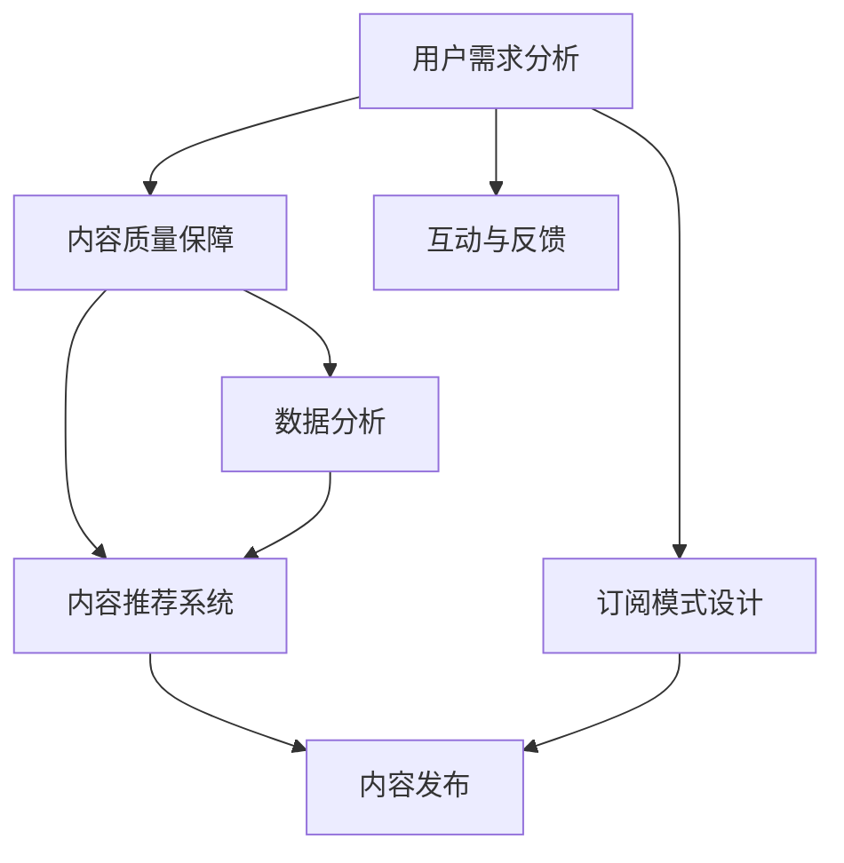

                 

# 如何打造高质量的技术知识付费内容

> 关键词：技术知识付费,内容质量,用户需求,数据分析,内容推荐,订阅模式

## 1. 背景介绍

### 1.1 问题由来
随着互联网的发展和知识经济的兴起，技术知识付费成为了一个快速增长的市场。互联网企业、在线教育平台、内容创作者等纷纷入局，开发各式各样的付费内容，以满足广大技术从业者对深入学习的需求。然而，尽管内容供应日益丰富，但用户付费意愿不高、内容质量参差不齐、用户体验差等问题仍然存在。如何打造高质量、有吸引力的技术知识付费内容，已经成为平台和创作者面临的重大挑战。

### 1.2 问题核心关键点
高质量的技术知识付费内容的核心关键点在于：
- **用户需求分析**：深入理解目标用户的需求，精准定位内容定位。
- **内容质量保障**：确保内容的深度、广度和实用性，提供价值最大化。
- **互动与反馈**：增强用户互动性，收集用户反馈，不断迭代优化内容。
- **数据分析**：利用数据驱动决策，优化内容推荐，提升用户体验。
- **订阅模式设计**：灵活的订阅方案，满足不同用户需求，提高用户粘性。

本文将围绕上述关键点，系统介绍如何打造高质量的技术知识付费内容，以期为内容创作者和平台管理者提供切实可行的策略。

## 2. 核心概念与联系

### 2.1 核心概念概述

为了更好地理解如何打造高质量的技术知识付费内容，我们先来明确一些核心概念：

- **技术知识付费**：指的是通过付费获取深度技术知识、行业洞察、技能培训等内容的形式。与传统学习相比，技术知识付费强调知识的系统性和深度，旨在快速提升用户专业技能和行业理解。

- **内容质量**：指内容的深度、广度、实用性和权威性。高质量内容能够提供具体的技术细节、实际案例、最佳实践等，帮助用户快速掌握新知识和技能。

- **用户需求分析**：通过调查问卷、用户反馈、行为数据等方式，深入了解用户的需求和偏好，精准定位内容主题。

- **内容推荐系统**：利用数据分析技术，对用户行为和偏好进行建模，实现个性化推荐，提升用户发现和使用高质量内容的概率。

- **订阅模式**：通过灵活的订阅策略，如按需订阅、包月订阅、包年订阅等，满足不同用户需求，降低获取优质内容的学习成本，提高用户粘性。

这些概念之间存在紧密的联系，共同构成高质量技术知识付费内容的实现框架。理解这些概念的原理和架构，有助于我们在实践中构建出优秀的付费内容平台。

### 2.2 核心概念原理和架构的 Mermaid 流程图(Mermaid 流程节点中不要有括号、逗号等特殊字符)


这个流程图展示了技术知识付费内容创建的核心流程：

1. 首先对用户需求进行分析，明确内容定位。
2. 保障内容质量，确保内容的深度和广度。
3. 增强用户互动和反馈，不断迭代优化内容。
4. 利用数据分析和推荐系统，提升用户体验。
5. 最后，设计灵活的订阅模式，满足用户需求。

## 3. 核心算法原理 & 具体操作步骤
### 3.1 算法原理概述

高质量技术知识付费内容的打造，本质上是一个复杂的数据驱动优化过程。核心在于如何结合用户需求分析、内容质量保障、用户互动反馈、数据分析和推荐系统，实现内容的高效创作和精准推送。

具体而言，包括以下几个关键步骤：

1. **用户需求分析**：通过调查问卷、行为数据等方式，收集用户偏好和需求，构建用户画像。
2. **内容质量保障**：基于用户画像和市场需求，设计深度和广度适中的课程内容和视频教程。
3. **用户互动与反馈**：通过讨论区、直播互动、用户评价等方式，增强用户参与度，收集用户反馈。
4. **数据分析**：利用用户行为数据，分析内容效果和用户偏好，优化推荐算法。
5. **内容推荐系统**：基于用户画像和内容特征，构建个性化推荐模型，提升内容推荐准确性。

### 3.2 算法步骤详解

接下来，我们将详细介绍每个步骤的具体操作。

**步骤1: 用户需求分析**

- **用户画像构建**：利用问卷调查、行为数据分析、社交网络挖掘等手段，收集用户的兴趣、职业、学习习惯等信息，构建详细的用户画像。
- **市场需求分析**：分析用户反馈、平台热点课程、行业发展趋势等，确定市场需求，定位课程主题和难度。
- **内容定位**：基于用户画像和市场需求，确定课程主题、课程长度、课程难度等，设计课程大纲和内容框架。

**步骤2: 内容质量保障**

- **内容设计**：结合用户画像和市场需求，设计高质量的内容，如深入的技术讲解、实际案例、代码示例等。
- **内容审核**：通过专家评审、同行评审等方式，确保内容的准确性和权威性，避免低质量内容影响用户信任。
- **内容更新**：根据技术发展和用户反馈，及时更新课程内容和讲义，保持内容的时效性和实用性。

**步骤3: 用户互动与反馈**

- **讨论区互动**：在课程评论区设置讨论区，鼓励用户留言互动，提升用户参与度。
- **直播互动**：定期举办线上直播，与用户进行实时互动，解答疑问，提升用户粘性。
- **用户评价**：收集用户对课程内容的评价，分析评价数据，找出改进点，优化课程质量。

**步骤4: 数据分析**

- **用户行为分析**：利用用户行为数据，分析用户的学习进度、偏好、参与度等，形成用户画像。
- **内容效果分析**：分析课程的访问量、观看时长、完成率等指标，评估课程质量和用户满意度。
- **优化推荐算法**：根据用户画像和内容特征，构建个性化推荐模型，提升内容推荐准确性。

**步骤5: 内容推荐系统**

- **模型选择**：选择合适的推荐算法，如协同过滤、基于内容的推荐、深度学习推荐等。
- **数据准备**：收集用户行为数据、课程内容数据、用户画像数据等，作为推荐模型的输入。
- **模型训练**：利用收集到的数据，训练推荐模型，优化模型参数。
- **推荐实现**：根据用户画像和推荐模型，实现个性化内容推荐，提升用户体验。

### 3.3 算法优缺点

高质量技术知识付费内容打造的核心算法具有以下优点：

- **用户体验提升**：通过个性化推荐，用户能够快速发现感兴趣的高质量内容，提升学习效率和满意度。
- **内容质量保障**：通过用户需求分析和内容审核，确保内容的高质量和权威性，提高用户信任。
- **市场竞争力增强**：通过精准定位和互动反馈，不断优化内容，提升平台竞争力和用户粘性。

同时，该算法也存在一些局限性：

- **数据需求高**：高质量内容打造需要大量的用户数据和行为数据，数据收集和处理成本较高。
- **模型复杂度**：推荐模型较为复杂，需要较强的技术积累和计算资源支持。
- **更新难度大**：内容更新频繁，需不断优化推荐模型，更新模型参数，增加了维护成本。
- **隐私问题**：大量用户数据收集和处理可能带来隐私问题，需严格遵守相关法律法规。

尽管存在这些局限性，但高质量技术知识付费内容打造的核心算法仍是大数据和人工智能时代内容推荐的重要范式。未来相关研究的方向将继续围绕如何降低数据需求、简化推荐模型、提高推荐效率等方面展开。

### 3.4 算法应用领域

高质量技术知识付费内容打造的核心算法已经在多个领域得到了应用，例如：

- **在线教育平台**：如Coursera、Udacity等，通过个性化推荐和内容更新，提升课程质量和用户满意度。
- **专业培训网站**：如LinkedIn Learning、Pluralsight等，提供深度技术培训和行业洞察，满足高水平用户需求。
- **软件开发社区**：如Stack Overflow、GitHub等，通过知识分享和互动，构建专业化的学习环境。
- **职业培训平台**：如Udemy、Skillshare等，提供实用的技能培训，满足企业内部和职业发展的需求。

除了上述这些典型应用外，高质量技术知识付费内容打造的核心算法也在不断拓展到更多场景中，如企业内训、在线培训、技术会议等，为技术知识传播和应用提供了新的途径。

## 4. 数学模型和公式 & 详细讲解 & 举例说明（备注：数学公式请使用latex格式，latex嵌入文中独立段落使用 $$，段落内使用 $)
### 4.1 数学模型构建

接下来，我们将以协同过滤推荐算法为例，详细阐述其数学模型构建过程。

假设用户集合为 $U=\{u_1, u_2, ..., u_M\}$，物品集合为 $I=\{i_1, i_2, ..., i_N\}$。用户对物品的评分矩阵为 $R \in \mathbb{R}^{M\times N}$，其中 $R_{ui}$ 表示用户 $u$ 对物品 $i$ 的评分。

协同过滤算法的目标是通过分析用户对物品的评分，为用户推荐物品。其基本思路是：根据相似性度量，找到与用户 $u$ 相似的其他用户 $v$，推荐 $v$ 喜欢的物品给 $u$。

**步骤1: 构建用户相似性矩阵**

- 计算用户间的相似性 $S_{uv}$，常用的方法包括余弦相似度、皮尔逊相关系数等。
- 构建用户相似性矩阵 $S \in \mathbb{R}^{M\times M}$，其中 $S_{uv} = \text{similarity}(u,v)$。

**步骤2: 构建物品-物品相似性矩阵**

- 计算物品间的相似性 $S_{ij}$，常用的方法包括余弦相似度、皮尔逊相关系数等。
- 构建物品-物品相似性矩阵 $S \in \mathbb{R}^{N\times N}$，其中 $S_{ij} = \text{similarity}(i,j)$。

**步骤3: 计算用户对物品的预测评分**

- 对用户 $u$ 的评分向量进行线性变换，得到用户对物品 $i$ 的预测评分 $\hat{R}_{ui}$。
- 其中 $\alpha$ 和 $\beta$ 为超参数，$\lambda$ 为正则化系数。

**步骤4: 计算推荐物品**

- 根据预测评分 $\hat{R}_{ui}$，推荐评分最高的 $K$ 个物品给用户 $u$。

### 4.2 公式推导过程

接下来，我们以余弦相似度为例，推导协同过滤推荐算法的详细公式。

假设用户 $u$ 对物品 $i$ 的评分 $R_{ui} = r_{ui}$，用户 $u$ 的评分向量为 $R_u$，物品 $i$ 的评分向量为 $R_i$。用户 $u$ 和用户 $v$ 的评分向量分别为 $R_u = [r_{u1}, r_{u2}, ..., r_{un}]$ 和 $R_v = [r_{v1}, r_{v2}, ..., r_{vm}]$，用户 $u$ 和用户 $v$ 的相似性为 $S_{uv} = \cos\theta = \frac{R_u \cdot R_v}{\|R_u\|\|R_v\|}$。

利用上述相似性度量，构建用户相似性矩阵 $S$ 和物品-物品相似性矩阵 $S$。根据用户相似性矩阵 $S$ 和物品-物品相似性矩阵 $S$，计算用户 $u$ 对物品 $i$ 的预测评分 $\hat{R}_{ui}$。

具体公式如下：

$$
\hat{R}_{ui} = \alpha (\sum_{v \in U} S_{uv} \frac{R_{vi}}{\|R_v\|} ) + \beta
$$

其中：
- $\alpha$ 为评分归一化系数，控制用户 $u$ 对物品 $i$ 的预测评分。
- $\beta$ 为截距，控制预测评分的默认值。

### 4.3 案例分析与讲解

以Netflix为例，Netflix使用协同过滤推荐算法为用户提供个性化推荐。Netflix首先收集用户观看历史数据，构建用户行为矩阵。然后，使用协同过滤算法计算用户之间的相似性，并根据用户对物品的评分，预测用户对未观看物品的评分。最后，根据预测评分，推荐评分最高的电影给用户。

Netflix通过不断的A/B测试和优化，提升了推荐算法的准确性和用户体验。如今，Netflix已成为全球最大的流媒体服务提供商之一，其成功的背后离不开高质量的推荐算法和不断优化的内容质量。

## 5. 项目实践：代码实例和详细解释说明
### 5.1 开发环境搭建

在进行技术知识付费内容推荐系统的开发前，我们需要准备好开发环境。以下是使用Python进行Spark MLlib推荐系统开发的环境配置流程：

1. 安装Apache Spark：从官网下载并安装Spark，作为推荐系统算法的计算框架。
2. 创建并激活虚拟环境：
```bash
conda create -n spark-env python=3.8 
conda activate spark-env
```

3. 安装Spark MLlib库：
```bash
pip install pyspark
```

4. 安装Spark Streaming库：
```bash
pip install pyspark-ml
```

5. 安装推荐算法相关库：
```bash
pip install pyspark-ml推荐算法库
```

完成上述步骤后，即可在`spark-env`环境中开始推荐系统的开发。

### 5.2 源代码详细实现

下面我们以协同过滤推荐算法为例，给出使用Spark MLlib进行推荐系统开发的PyTorch代码实现。

首先，定义用户行为数据和物品特征数据：

```python
from pyspark import SparkContext, SparkConf
from pyspark.ml import Pipeline, PipelineModel
from pyspark.ml.evaluation import RegressionEvaluator
from pyspark.ml.regression import LinearRegression
from pyspark.ml.feature import Imputer, VectorAssembler, VectorIndexer

spark = SparkContext.getOrCreate()
conf = SparkConf()

# 定义用户行为数据
rdd = spark.sparkContext.textFile("user_behavior_data.txt")

# 定义物品特征数据
item_rdd = spark.sparkContext.textFile("item_features.txt")
```

然后，对数据进行预处理：

```python
# 对用户行为数据进行预处理
user_df = rdd.map(lambda line: line.split("::")).collect()
user_df = spark.createDataFrame(user_df, ["user_id", "item_id", "rating"])

# 对物品特征数据进行预处理
item_df = item_rdd.map(lambda line: line.split("::")).collect()
item_df = spark.createDataFrame(item_df, ["item_id", "features"])

# 填充缺失值
item_df = Imputer().setInputCols("features").setOutputCol("features_filled").fit(item_df).transform(item_df)

# 标准化特征
vector_assembler = VectorAssembler(inputCols=["features_filled"], outputCol="features_scaled")
item_df = vector_assembler.transform(item_df)
```

接着，设计协同过滤推荐模型：

```python
# 构建用户相似性矩阵
similarity = compute_similarity(user_df, item_df)

# 构建物品-物品相似性矩阵
item_similarity = compute_item_similarity(item_df)

# 构建推荐模型
model = RecommendationModel(similarity, item_similarity, user_df)
```

最后，训练模型并评估效果：

```python
# 训练模型
model.fit(user_df)

# 使用模型进行推荐
recommendations = model.recommend(user_df)

# 评估推荐效果
evaluator = RegressionEvaluator(prediction_col="prediction", labelCol="rating", metricName="rmse")
rmse = evaluator.evaluate(recommendations)
print("RMSE:", rmse)

# 关闭Spark上下文
spark.stop()
```

以上就是使用Spark MLlib进行协同过滤推荐系统的完整代码实现。可以看到，Spark MLlib提供的推荐系统算法封装了复杂的模型构建和优化过程，简化了推荐系统的开发和部署。

### 5.3 代码解读与分析

让我们再详细解读一下关键代码的实现细节：

**用户行为数据预处理**：
- 对用户行为数据进行split操作，提取用户ID、物品ID和评分。
- 对用户行为数据进行预处理，填充缺失值并标准化特征。

**物品特征数据预处理**：
- 对物品特征数据进行split操作，提取物品ID和特征。
- 对物品特征数据进行预处理，填充缺失值并标准化特征。

**用户相似性矩阵和物品-物品相似性矩阵计算**：
- 根据用户行为数据和物品特征数据，计算用户相似性和物品相似性。

**推荐模型构建**：
- 根据用户相似性和物品相似性，构建推荐模型。

**模型训练和评估**：
- 使用训练集数据训练推荐模型。
- 使用推荐模型对新用户进行推荐。
- 使用回归评估指标评估推荐效果。

可以看出，使用Spark MLlib进行推荐系统开发，不仅能够简化开发流程，还能够在计算资源上获得很大的提升，适合处理大规模推荐任务。

当然，在实际应用中，还需要考虑更多因素，如模型并行、分布式计算、实时推荐等。但核心的协同过滤推荐算法基本与此类似。

## 6. 实际应用场景
### 6.1 在线教育平台

在线教育平台如Coursera、Udacity等，通过个性化推荐系统，为用户推荐感兴趣的课程。平台收集用户学习行为数据，构建用户画像，结合协同过滤推荐算法，为用户推荐高评分、高完成率的课程，提升用户体验和学习效果。

### 6.2 专业培训网站

专业培训网站如LinkedIn Learning、Pluralsight等，提供深度技术培训和行业洞察。网站通过推荐系统，为用户推荐符合职业发展路径的课程，帮助用户快速掌握新技能，提升职场竞争力。

### 6.3 软件开发社区

软件开发社区如Stack Overflow、GitHub等，通过知识分享和互动，构建专业化的学习环境。平台通过推荐系统，为用户推荐高质量的技术文章和代码库，帮助用户解决技术难题，提升编程能力。

### 6.4 职业培训平台

职业培训平台如Udemy、Skillshare等，提供实用的技能培训，满足企业内部和职业发展的需求。平台通过推荐系统，为用户推荐符合岗位要求的技能培训课程，帮助用户快速提升职业技能。

除了上述这些典型应用外，推荐系统还在不断拓展到更多场景中，如企业内训、在线培训、技术会议等，为技术知识传播和应用提供了新的途径。

## 7. 工具和资源推荐
### 7.1 学习资源推荐

为了帮助开发者系统掌握推荐系统的理论和实践，这里推荐一些优质的学习资源：

1. 《推荐系统实战》书籍：详细介绍了推荐系统的理论基础、算法实现和工程实践，是推荐系统学习的入门经典。
2. 《推荐系统评估与学习》书籍：介绍了推荐系统的评估指标、模型优化和应用实例，适合进一步深入学习。
3. 《深度学习与推荐系统》课程：由斯坦福大学开设的推荐系统课程，详细讲解了推荐系统的原理和实践，适合深入理解推荐系统算法。
4. Apache Spark官方文档：详细介绍了Spark MLlib推荐系统的实现原理和使用方法，是推荐系统实践的必备资料。
5. Kaggle推荐系统竞赛：通过实际竞赛项目，实践推荐系统的设计和优化，提升实践能力。

通过对这些资源的学习实践，相信你一定能够快速掌握推荐系统的精髓，并用于解决实际的推荐问题。

### 7.2 开发工具推荐

高效的开发离不开优秀的工具支持。以下是几款用于推荐系统开发的常用工具：

1. Apache Spark：基于内存计算的分布式计算框架，适合处理大规模推荐任务。
2. TensorFlow：基于深度学习的计算框架，适合构建复杂的推荐模型。
3. PyTorch：基于动态计算图的深度学习框架，适合快速迭代研究和原型开发。
4. Jupyter Notebook：交互式编程环境，适合编写和调试推荐系统算法。
5. Hadoop：大数据计算框架，适合处理海量数据预处理和特征工程。

合理利用这些工具，可以显著提升推荐系统的开发效率，加快创新迭代的步伐。

### 7.3 相关论文推荐

推荐系统的发展源于学界的持续研究。以下是几篇奠基性的相关论文，推荐阅读：

1. "Collaborative Filtering for Implicit Feedback Datasets"（协作过滤算法）：提出了协同过滤算法的基本思想和实现方法，是推荐系统的重要基础。
2. "Scalable Collaborative Filtering Algorithms for One-Class Collaborative Filtering"（可扩展协同过滤算法）：提出了可扩展协同过滤算法，解决了推荐系统的大规模扩展问题。
3. "Deep Collaborative Filtering"（深度协同过滤）：提出了深度协同过滤模型，利用深度神经网络对用户和物品的特征进行建模，提升了推荐系统的精度。
4. "Hybrid Recommendation Systems: A Survey and Taxonomy"（混合推荐系统）：综述了混合推荐系统的理论和实践，介绍了混合推荐系统的构建和优化方法。
5. "Recommender Systems in Heterogeneous Environments"（异构环境下的推荐系统）：介绍了异构环境下推荐系统的构建和优化方法，讨论了数据异构、用户异构和物品异构对推荐系统的影响。

这些论文代表了大数据和人工智能时代推荐系统的发展脉络。通过学习这些前沿成果，可以帮助研究者把握推荐系统的方向，激发更多的创新灵感。

## 8. 总结：未来发展趋势与挑战
### 8.1 总结

本文对高质量技术知识付费内容的打造进行了全面系统的介绍。首先阐述了技术知识付费的重要性，明确了内容质量、用户需求分析、用户互动反馈、数据分析和订阅模式设计等核心关键点。其次，从原理到实践，详细讲解了协同过滤推荐算法的数学模型和实现细节，给出了完整的代码实例。同时，本文还广泛探讨了推荐系统在在线教育、专业培训、软件开发、职业培训等多个领域的应用前景，展示了推荐系统的巨大潜力。此外，本文精选了推荐系统的各类学习资源，力求为读者提供全方位的技术指引。

通过本文的系统梳理，可以看到，高质量技术知识付费内容的打造，是大数据和人工智能时代内容推荐的重要范式。这些方向的探索发展，必将进一步提升内容推荐系统的性能和应用范围，为技术知识传播和应用带来新的突破。

### 8.2 未来发展趋势

展望未来，推荐系统的发展趋势主要包括以下几个方向：

1. **个性化推荐**：通过深度学习、协同过滤等方法，实现更加个性化的推荐，提升用户体验。
2. **跨平台推荐**：结合多平台用户数据，实现跨平台的推荐，提升推荐效果。
3. **实时推荐**：通过实时计算和实时推荐，提升推荐系统的时效性和用户粘性。
4. **多模态推荐**：结合文本、图像、视频等多模态数据，实现更全面的推荐。
5. **冷启动问题**：通过利用用户行为数据和特征工程，解决冷启动用户推荐问题。
6. **推荐系统评估**：通过多指标评估推荐系统性能，确保推荐效果。

这些趋势凸显了推荐系统发展的广阔前景。未来的研究将继续围绕如何提高推荐算法的效率和精度、提升推荐系统的可解释性和可解释性、优化推荐系统的扩展性和实时性等方面展开。

### 8.3 面临的挑战

尽管推荐系统已经取得了显著成果，但在迈向更加智能化、普适化应用的过程中，它仍面临诸多挑战：

1. **数据需求高**：推荐系统需要大量的用户行为数据和特征数据，数据收集和处理成本较高。
2. **模型复杂度**：推荐模型较为复杂，需要较强的技术积累和计算资源支持。
3. **冷启动问题**：对于新用户，推荐系统难以快速给出推荐，用户粘性较低。
4. **隐私问题**：大量用户数据收集和处理可能带来隐私问题，需严格遵守相关法律法规。
5. **计算资源消耗大**：推荐系统计算复杂度较高，需要大量计算资源支持。

尽管存在这些挑战，但推荐系统在提升用户体验和内容价值方面的巨大优势，仍然使其成为未来内容推荐的重要方向。未来的研究将继续围绕如何降低数据需求、简化推荐模型、提高推荐效率等方面展开。

### 8.4 研究展望

面向未来，推荐系统的研究将继续在以下几个方向取得突破：

1. **深度学习推荐**：利用深度神经网络对用户和物品的特征进行建模，提升推荐系统的精度。
2. **混合推荐**：结合协同过滤和内容推荐等方法，实现更全面、更精准的推荐。
3. **推荐系统评估**：通过多指标评估推荐系统性能，确保推荐效果。
4. **冷启动问题**：通过利用用户行为数据和特征工程，解决冷启动用户推荐问题。
5. **跨平台推荐**：结合多平台用户数据，实现跨平台的推荐，提升推荐效果。
6. **实时推荐**：通过实时计算和实时推荐，提升推荐系统的时效性和用户粘性。

这些研究方向的探索，必将引领推荐系统技术迈向更高的台阶，为构建智能推荐系统铺平道路。面向未来，推荐系统研究需要与其他人工智能技术进行更深入的融合，如知识表示、因果推理、强化学习等，多路径协同发力，共同推动推荐系统的进步。

## 9. 附录：常见问题与解答

**Q1：如何设计高质量的推荐算法？**

A: 高质量的推荐算法设计需要考虑以下几个关键点：

1. **用户画像构建**：利用问卷调查、行为数据分析、社交网络挖掘等手段，收集用户的兴趣、职业、学习习惯等信息，构建详细的用户画像。
2. **数据收集与处理**：收集用户行为数据、物品特征数据、用户画像数据等，作为推荐模型的输入。
3. **推荐算法选择**：选择合适的推荐算法，如协同过滤、基于内容的推荐、深度学习推荐等。
4. **模型训练与优化**：利用收集到的数据，训练推荐模型，优化模型参数。
5. **推荐实现**：根据用户画像和推荐模型，实现个性化内容推荐，提升用户体验。

**Q2：如何优化推荐系统的性能？**

A: 优化推荐系统性能需要考虑以下几个方面：

1. **数据收集与处理**：通过多渠道、多方式收集用户数据和物品数据，确保数据的全面性和准确性。
2. **特征工程**：利用特征提取、降维等技术，优化数据特征，提升推荐模型的精度。
3. **推荐算法优化**：选择合适的推荐算法，并不断优化算法参数，提升推荐效果。
4. **实时计算与缓存**：通过实时计算和缓存技术，提升推荐系统的响应速度和用户体验。
5. **模型压缩与优化**：通过模型压缩、参数剪枝等技术，优化推荐模型的计算效率和内存占用。

**Q3：如何应对推荐系统的冷启动问题？**

A: 推荐系统的冷启动问题可以通过以下方式应对：

1. **利用先验知识**：利用领域专家知识，为用户推荐符合其职业背景和兴趣的课程。
2. **基于内容的推荐**：根据物品的特征，为用户推荐相似的物品。
3. **用户反馈收集**：在用户使用推荐系统初期，收集用户的反馈，建立用户画像，提升推荐效果。
4. **推荐策略设计**：设计合理的推荐策略，如新用户推荐热门物品、推荐新上架物品等。

**Q4：如何保障推荐系统的安全性？**

A: 保障推荐系统的安全性需要考虑以下几个方面：

1. **数据隐私保护**：严格遵守相关法律法规，保护用户数据隐私。
2. **模型透明性**：提供模型解释机制，让用户了解推荐结果的依据。
3. **异常检测与修复**：利用异常检测技术，识别并修复推荐系统中的错误和漏洞。
4. **用户反馈机制**：建立用户反馈机制，及时发现并修复推荐系统中的问题。

**Q5：如何提高推荐系统的用户粘性？**

A: 提高推荐系统的用户粘性需要考虑以下几个方面：

1. **个性化推荐**：利用深度学习、协同过滤等方法，实现更加个性化的推荐，提升用户体验。
2. **跨平台推荐**：结合多平台用户数据，实现跨平台的推荐，提升推荐效果。
3. **实时推荐**：通过实时计算和实时推荐，提升推荐系统的时效性和用户粘性。
4. **推荐系统评估**：通过多指标评估推荐系统性能，确保推荐效果。
5. **推荐系统更新**：定期更新推荐系统，引入新数据和新算法，提升推荐效果。

这些优化措施可以显著提升推荐系统的用户体验和用户粘性，增强平台竞争力。

---

作者：禅与计算机程序设计艺术 / Zen and the Art of Computer Programming

