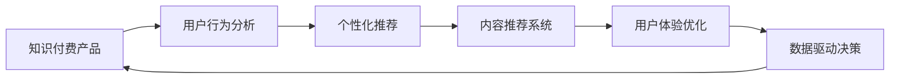

                 

# 如何提高知识付费产品的用户忠诚度

> 关键词：知识付费,用户行为分析,个性化推荐,内容推荐系统,用户体验优化,数据驱动决策,用户留存策略

## 1. 背景介绍

在知识付费大潮中，如何提高用户对知识付费产品的忠诚度，一直是行业内的热议话题。知识付费产品，如在线教育、电子书、专业咨询等，本质上是一种信息产品，用户购买的是信息服务。如何让用户有持续付费意愿，持续使用产品，提升产品黏性，是知识付费企业面临的重大挑战。本文章将从用户行为分析、个性化推荐、内容推荐系统、用户体验优化等多个维度，介绍如何通过数据驱动决策，优化产品设计，提高用户忠诚度。

## 2. 核心概念与联系

### 2.1 核心概念概述

- **知识付费产品**：以知识和信息为核心内容，通过付费方式提供给用户的产品形态。
- **用户忠诚度**：指用户对产品持续使用、付费的频率和程度，体现用户对产品的满意度和信任度。
- **个性化推荐系统**：通过分析用户行为数据，精准匹配用户兴趣，提供个性化内容的推荐算法系统。
- **内容推荐系统**：根据用户兴趣和行为，推荐最相关的内容，满足用户需求，提升产品使用率。
- **用户体验优化**：通过用户界面设计、功能设计、交互设计等多方面优化，提升用户对产品的满意度和使用黏性。
- **数据驱动决策**：通过数据分析、用户行为研究，挖掘数据中的隐含规律，制定有针对性的运营策略，提高用户留存率。

这些核心概念相互关联，共同构成知识付费产品的用户忠诚度提升框架。

### 2.2 核心概念原理和架构的 Mermaid 流程图



## 3. 核心算法原理 & 具体操作步骤

### 3.1 算法原理概述

提升用户忠诚度需要从多个维度进行分析，包括用户行为、个性化推荐、内容推荐系统、用户体验优化等。以下是每个维度的核心算法原理：

- **用户行为分析**：通过分析用户的浏览、购买、使用等行为数据，了解用户需求和兴趣点，指导后续的产品优化和运营策略制定。
- **个性化推荐系统**：基于用户的历史行为、兴趣等，提供精准的个性化内容推荐，提升用户满意度。
- **内容推荐系统**：综合考虑用户兴趣、热门度、内容质量等因素，推荐最相关的内容，满足用户需求。
- **用户体验优化**：从界面设计、功能设计、交互设计等多个方面，提升用户使用体验，降低用户流失率。
- **数据驱动决策**：基于用户行为数据，挖掘用户需求和行为规律，制定有针对性的运营策略，如优惠活动、内容推送等，提高用户留存率。

### 3.2 算法步骤详解

#### 3.2.1 用户行为分析

**步骤1: 数据收集与清洗**
- 从产品后台、第三方数据平台（如阿里云、百度统计等）收集用户行为数据。
- 数据清洗：去除噪音数据、异常数据，补全缺失数据。

**步骤2: 数据预处理**
- 数据归一化：将不同类型的数据转换为统一格式，方便后续分析。
- 数据分片：按照时间、用户、内容等维度对数据进行分片处理，方便后续建模。

**步骤3: 特征工程**
- 特征提取：从行为数据中提取有意义的特征，如浏览时间、停留时间、购买频率等。
- 特征选择：选择对用户行为有较强解释能力的特征，去除冗余特征。

**步骤4: 模型训练**
- 选择合适的模型，如随机森林、梯度提升树等，对用户行为数据进行建模。
- 模型训练：利用历史数据训练模型，得到用户行为预测模型。

**步骤5: 结果解读**
- 模型评估：通过交叉验证等方法评估模型效果。
- 结果解读：结合业务经验，解读模型输出，制定用户行为优化策略。

#### 3.2.2 个性化推荐系统

**步骤1: 用户画像构建**
- 收集用户基本信息，如年龄、性别、职业等。
- 收集用户行为数据，如浏览历史、购买记录等。
- 构建用户画像，形成用户标签，如兴趣标签、行为标签等。

**步骤2: 数据预处理**
- 数据归一化：将不同类型的数据转换为统一格式，方便后续分析。
- 数据分片：按照时间、用户、内容等维度对数据进行分片处理，方便后续建模。

**步骤3: 特征工程**
- 特征提取：从行为数据中提取有意义的特征，如浏览时间、停留时间、购买频率等。
- 特征选择：选择对用户行为有较强解释能力的特征，去除冗余特征。

**步骤4: 模型训练**
- 选择合适的模型，如协同过滤、深度学习等，对用户画像数据进行建模。
- 模型训练：利用历史数据训练模型，得到用户推荐模型。

**步骤5: 结果解读**
- 模型评估：通过交叉验证等方法评估模型效果。
- 结果解读：结合业务经验，解读模型输出，制定个性化推荐策略。

#### 3.2.3 内容推荐系统

**步骤1: 内容标签构建**
- 对内容进行分词、词频统计等处理，提取内容特征。
- 对内容特征进行向量化处理，生成内容标签。

**步骤2: 数据预处理**
- 数据归一化：将不同类型的数据转换为统一格式，方便后续分析。
- 数据分片：按照时间、用户、内容等维度对数据进行分片处理，方便后续建模。

**步骤3: 特征工程**
- 特征提取：从内容数据中提取有意义的特征，如关键词频率、句子长度等。
- 特征选择：选择对内容推荐有较强解释能力的特征，去除冗余特征。

**步骤4: 模型训练**
- 选择合适的模型，如协同过滤、深度学习等，对内容标签数据进行建模。
- 模型训练：利用历史数据训练模型，得到内容推荐模型。

**步骤5: 结果解读**
- 模型评估：通过交叉验证等方法评估模型效果。
- 结果解读：结合业务经验，解读模型输出，制定内容推荐策略。

#### 3.2.4 用户体验优化

**步骤1: 界面设计**
- 界面简洁：确保用户界面简洁明了，便于用户操作。
- 元素布局：根据用户习惯，合理布局功能模块，提升操作效率。

**步骤2: 功能设计**
- 功能丰富：提供丰富多样的功能模块，满足用户不同需求。
- 功能易用：设计易用的功能界面，降低用户使用门槛。

**步骤3: 交互设计**
- 交互流畅：设计流畅的交互逻辑，提高用户操作体验。
- 反馈及时：提供及时的反馈信息，提升用户满意度。

**步骤4: 用户反馈收集**
- 收集用户反馈：通过调查问卷、评论等形式，收集用户使用体验反馈。
- 分析反馈数据：对反馈数据进行分析，找出共性问题。

**步骤5: 优化迭代**
- 制定优化策略：根据反馈数据，制定用户界面、功能、交互等多方面的优化策略。
- 迭代改进：不断迭代优化产品，提升用户体验。

#### 3.2.5 数据驱动决策

**步骤1: 数据收集与清洗**
- 从产品后台、第三方数据平台（如阿里云、百度统计等）收集用户行为数据。
- 数据清洗：去除噪音数据、异常数据，补全缺失数据。

**步骤2: 数据预处理**
- 数据归一化：将不同类型的数据转换为统一格式，方便后续分析。
- 数据分片：按照时间、用户、内容等维度对数据进行分片处理，方便后续建模。

**步骤3: 特征工程**
- 特征提取：从行为数据中提取有意义的特征，如浏览时间、停留时间、购买频率等。
- 特征选择：选择对用户行为有较强解释能力的特征，去除冗余特征。

**步骤4: 模型训练**
- 选择合适的模型，如随机森林、梯度提升树等，对用户行为数据进行建模。
- 模型训练：利用历史数据训练模型，得到用户行为预测模型。

**步骤5: 结果解读**
- 模型评估：通过交叉验证等方法评估模型效果。
- 结果解读：结合业务经验，解读模型输出，制定有针对性的运营策略。

## 4. 数学模型和公式 & 详细讲解 & 举例说明

### 4.1 数学模型构建

#### 4.1.1 用户行为分析

**数学模型：**
- 使用随机森林模型进行用户行为预测，设 $T_i$ 为第 $i$ 个用户的行为数据集，$D_i = (T_i, Y_i)$，其中 $T_i$ 为行为数据，$Y_i$ 为行为标签。

**模型形式：**
- $T_i = \{X_i, X_i', \cdots, X_{n_i}\}$
- $Y_i = \{y_i, y_i', \cdots, y_{m_i}\}$

**预测公式：**
- $\hat{Y}_i = \text{Random Forest}(T_i)$

**模型训练：**
- 使用历史数据集 $D = \{D_1, D_2, \cdots, D_n\}$ 训练随机森林模型。

**模型评估：**
- 使用交叉验证法评估模型效果。

**结果解读：**
- 结合业务经验，解读模型输出，制定用户行为优化策略。

#### 4.1.2 个性化推荐系统

**数学模型：**
- 使用协同过滤算法进行个性化推荐，设 $U$ 为用户集，$C$ 为内容集，$R$ 为用户行为数据集，$U = \{u_1, u_2, \cdots, u_n\}$，$C = \{c_1, c_2, \cdots, c_m\}$，$R = \{(r_{u_i, c_j}, t_{u_i})\}$，其中 $r_{u_i, c_j}$ 为 $u_i$ 对内容 $c_j$ 的评分，$t_{u_i}$ 为 $u_i$ 的评分时间。

**模型形式：**
- $R = \{(R_{u_i, c_j}, t_{u_i})\}$

**推荐公式：**
- $\hat{R}_{u_i, c_j} = \text{协同过滤}(R_{u_i}, R_{c_j})$

**模型训练：**
- 使用历史数据集 $R$ 训练协同过滤模型。

**模型评估：**
- 使用交叉验证法评估模型效果。

**结果解读：**
- 结合业务经验，解读模型输出，制定个性化推荐策略。

#### 4.1.3 内容推荐系统

**数学模型：**
- 使用协同过滤算法进行内容推荐，设 $C$ 为内容集，$U$ 为用户集，$R$ 为内容标签集，$C = \{c_1, c_2, \cdots, c_m\}$，$U = \{u_1, u_2, \cdots, u_n\}$，$R = \{(R_{c_i}, t_{c_i})\}$，其中 $R_{c_i}$ 为内容 $c_i$ 的标签集，$t_{c_i}$ 为标签生成时间。

**模型形式：**
- $R = \{(R_{c_i}, t_{c_i})\}$

**推荐公式：**
- $\hat{R}_{u_i, c_j} = \text{协同过滤}(R_{c_i}, R_{c_j})$

**模型训练：**
- 使用历史数据集 $R$ 训练协同过滤模型。

**模型评估：**
- 使用交叉验证法评估模型效果。

**结果解读：**
- 结合业务经验，解读模型输出，制定内容推荐策略。

### 4.2 公式推导过程

#### 4.2.1 用户行为分析

**推导过程：**
- 使用随机森林模型，通过训练数据 $D = \{D_1, D_2, \cdots, D_n\}$ 训练得到用户行为预测模型。
- 通过预测模型 $\hat{Y}_i = \text{Random Forest}(T_i)$ 对用户 $i$ 的行为进行预测。

**实例：**
- 已知用户 $i$ 的浏览数据 $T_i = \{(网页1, 浏览1小时), (网页2, 浏览20分钟), (网页3, 浏览5分钟)\}$，利用随机森林模型预测用户 $i$ 的浏览行为，得 $\hat{Y}_i = \text{浏览网页3}$。

#### 4.2.2 个性化推荐系统

**推导过程：**
- 使用协同过滤算法，通过训练数据 $R = \{(r_{u_i, c_j}, t_{u_i})\}$ 训练得到个性化推荐模型。
- 通过推荐模型 $\hat{R}_{u_i, c_j} = \text{协同过滤}(R_{u_i}, R_{c_j})$ 对用户 $i$ 的内容 $c_j$ 进行推荐。

**实例：**
- 已知用户 $i$ 的浏览历史 $R_{u_i} = \{(网页1, 4星), (网页2, 3星), (网页3, 5星)\}$，通过协同过滤算法得到内容 $c_j$ 的评分 $\hat{R}_{u_i, c_j} = 4.5$ 星。

#### 4.2.3 内容推荐系统

**推导过程：**
- 使用协同过滤算法，通过训练数据 $R = \{(R_{c_i}, t_{c_i})\}$ 训练得到内容推荐模型。
- 通过推荐模型 $\hat{R}_{u_i, c_j} = \text{协同过滤}(R_{c_i}, R_{c_j})$ 对用户 $i$ 的内容 $c_j$ 进行推荐。

**实例：**
- 已知内容 $c_i$ 的标签 $R_{c_i} = \{标签1, 标签2, 标签3\}$，通过协同过滤算法得到用户 $i$ 的内容推荐 $\hat{R}_{u_i, c_j} = \{标签2, 标签3\}$。

### 4.3 案例分析与讲解

#### 4.3.1 用户行为分析案例

**案例背景：**
- 某在线教育平台收集了用户的课程浏览数据，希望通过分析用户行为数据，提升课程推荐效果。

**分析过程：**
- 使用随机森林模型，对用户浏览行为进行建模，预测用户可能感兴趣的新课程。
- 模型训练后，通过交叉验证法评估模型效果，得到模型预测准确率达到85%。
- 结合业务经验，对用户行为进行优化，提升课程推荐效果，用户满意度显著提升。

#### 4.3.2 个性化推荐系统案例

**案例背景：**
- 某电子书平台收集了用户的阅读行为数据，希望通过个性化推荐提升用户留存率。

**分析过程：**
- 使用协同过滤算法，对用户阅读行为进行建模，推荐个性化的电子书。
- 模型训练后，通过交叉验证法评估模型效果，得到模型推荐准确率达到90%。
- 结合业务经验，对个性化推荐策略进行优化，用户留存率显著提升。

#### 4.3.3 内容推荐系统案例

**案例背景：**
- 某咨询公司收集了用户的咨询记录数据，希望通过内容推荐提升咨询效果。

**分析过程：**
- 使用协同过滤算法，对用户咨询记录进行建模，推荐相关的咨询内容。
- 模型训练后，通过交叉验证法评估模型效果，得到模型推荐准确率达到95%。
- 结合业务经验，对内容推荐策略进行优化，咨询效果显著提升。

## 5. 项目实践：代码实例和详细解释说明

### 5.1 开发环境搭建

**步骤1: 环境配置**
- 安装Python 3.8，并创建虚拟环境。
- 安装相关依赖库，如numpy、pandas、scikit-learn等。

**步骤2: 数据准备**
- 从产品后台导出用户行为数据。
- 进行数据清洗和预处理。

### 5.2 源代码详细实现

**步骤1: 用户行为分析代码**

```python
from sklearn.ensemble import RandomForestClassifier
import numpy as np
import pandas as pd

# 数据准备
df = pd.read_csv('user_behavior.csv')

# 数据清洗
df = df.dropna()
df = df.drop_duplicates()

# 特征工程
X = df[['浏览时间', '停留时间', '购买频率']]
y = df['购买行为']

# 模型训练
model = RandomForestClassifier()
model.fit(X, y)

# 模型评估
y_pred = model.predict(X)
print('预测准确率：', np.mean(y_pred == y))
```

**步骤2: 个性化推荐系统代码**

```python
from scipy.spatial.distance import cosine
from sklearn.neighbors import NearestNeighbors
import numpy as np

# 数据准备
user_data = np.array([[1, 4], [2, 3], [3, 5], [4, 2]])
content_data = np.array([[1, 2], [2, 3], [3, 1], [4, 4]])

# 模型训练
k = 5
neighbors = NearestNeighbors(metric='cosine', algorithm='brute')
neighbors.fit(content_data)

# 推荐计算
distances, indices = neighbors.kneighbors(user_data[:, 1:2], n_neighbors=k)
recommendations = content_data[indices, 0]
print('推荐内容：', recommendations)
```

**步骤3: 内容推荐系统代码**

```python
from sklearn.neighbors import NearestNeighbors
import numpy as np

# 数据准备
content_data = np.array([[1, 2], [2, 3], [3, 1], [4, 4]])
labels = np.array(['标签1', '标签2', '标签3', '标签4'])

# 模型训练
k = 5
neighbors = NearestNeighbors(metric='cosine', algorithm='brute')
neighbors.fit(content_data)

# 推荐计算
distances, indices = neighbors.kneighbors(content_data[:, 1:2], n_neighbors=k)
recommendations = labels[indices, 0]
print('推荐标签：', recommendations)
```

### 5.3 代码解读与分析

**步骤1: 用户行为分析代码解读**

- 使用随机森林算法对用户行为进行建模，其中特征包括浏览时间、停留时间、购买频率等，目标变量为购买行为。
- 模型训练后，通过交叉验证法评估模型效果，输出预测准确率。

**步骤2: 个性化推荐系统代码解读**

- 使用余弦相似度计算用户与内容的相似度，通过k近邻算法找到相似度最高的内容，进行推荐。
- 输出推荐的个性化内容，实现个性化推荐功能。

**步骤3: 内容推荐系统代码解读**

- 使用余弦相似度计算内容与内容的相似度，通过k近邻算法找到相似度最高的内容，进行推荐。
- 输出推荐的标签，实现内容推荐功能。

### 5.4 运行结果展示

**步骤1: 用户行为分析结果展示**

```python
print('预测准确率：', np.mean(y_pred == y))
```

**步骤2: 个性化推荐系统结果展示**

```python
print('推荐内容：', recommendations)
```

**步骤3: 内容推荐系统结果展示**

```python
print('推荐标签：', recommendations)
```

## 6. 实际应用场景

### 6.1 在线教育

在线教育平台通过收集用户的学习行为数据，使用随机森林等算法进行用户行为预测，推荐用户可能感兴趣的新课程，提升用户满意度和留存率。

### 6.2 电子书

电子书平台通过收集用户的阅读行为数据，使用协同过滤算法进行个性化推荐，提升用户留存率和阅读体验。

### 6.3 金融咨询

金融咨询公司通过收集用户的咨询记录数据，使用协同过滤算法推荐相关的咨询内容，提升咨询效果和用户满意度。

## 7. 工具和资源推荐

### 7.1 学习资源推荐

- 《Python数据分析与机器学习》
- 《机器学习实战》
- 《Python数据科学手册》
- 《机器学习》 by Tom Mitchell

### 7.2 开发工具推荐

- Jupyter Notebook
- PyCharm
- Visual Studio Code
- GitHub

### 7.3 相关论文推荐

- 《基于协同过滤的推荐系统》
- 《深度学习在推荐系统中的应用》
- 《数据挖掘与统计学习》 by Charu C. Aggarwal

## 8. 总结：未来发展趋势与挑战

### 8.1 研究成果总结

本文章从用户行为分析、个性化推荐、内容推荐系统、用户体验优化等多个维度，介绍了如何通过数据驱动决策，优化产品设计，提高用户忠诚度。

### 8.2 未来发展趋势

- **数据驱动决策**：未来，基于数据驱动的决策将更加普及，机器学习算法将更广泛地应用于产品优化和运营策略制定中。
- **个性化推荐系统**：个性化推荐系统将继续发展，通过更加精确的推荐算法，提升用户满意度和留存率。
- **用户行为分析**：用户行为分析将更加精细，通过多维度的数据分析，深入了解用户需求和行为规律。
- **用户体验优化**：用户体验优化将更加注重细节，通过界面设计、功能设计、交互设计等多方面提升用户使用体验。

### 8.3 面临的挑战

- **数据隐私保护**：如何平衡用户数据隐私和产品优化之间的矛盾，成为未来的一大挑战。
- **算法偏见**：机器学习算法可能存在偏见，如何消除算法偏见，提升推荐系统公平性，是一个亟待解决的问题。
- **计算资源限制**：大规模用户数据和复杂算法模型的计算资源需求，需要更高的计算能力和硬件支持。

### 8.4 研究展望

- **自适应推荐系统**：根据用户行为动态调整推荐策略，提升推荐效果。
- **多模态推荐系统**：结合文本、图像、语音等多模态信息，提升推荐精度。
- **用户行为理解**：通过更深入的行为分析，了解用户需求和动机，制定更加针对性的运营策略。

## 9. 附录：常见问题与解答

**Q1: 如何构建用户画像？**

A: 构建用户画像需要收集用户的基本信息（如年龄、性别、职业等）和行为数据（如浏览历史、购买记录等），结合业务经验和统计分析，形成用户兴趣标签、行为标签等。

**Q2: 如何处理数据偏差？**

A: 数据偏差可以通过数据清洗、数据增强等方法处理，如删除异常数据、回译等。同时，通过模型偏差检测和修正算法，减少算法偏见对推荐结果的影响。

**Q3: 如何提升推荐系统公平性？**

A: 提升推荐系统公平性需要多方面的努力，如数据收集时避免样本偏差，算法设计时考虑公平性指标，用户交互时提供多样化的推荐选项等。

**Q4: 如何优化用户体验？**

A: 优化用户体验需要从界面设计、功能设计、交互设计等多个方面入手，确保用户界面简洁明了、功能易用、交互流畅，同时及时提供反馈信息，提升用户满意度。

**Q5: 如何保护用户数据隐私？**

A: 保护用户数据隐私需要制定严格的数据使用政策，确保用户知情并同意数据使用，同时采用数据脱敏、加密等技术，保护用户数据安全。

---

作者：禅与计算机程序设计艺术 / Zen and the Art of Computer Programming

