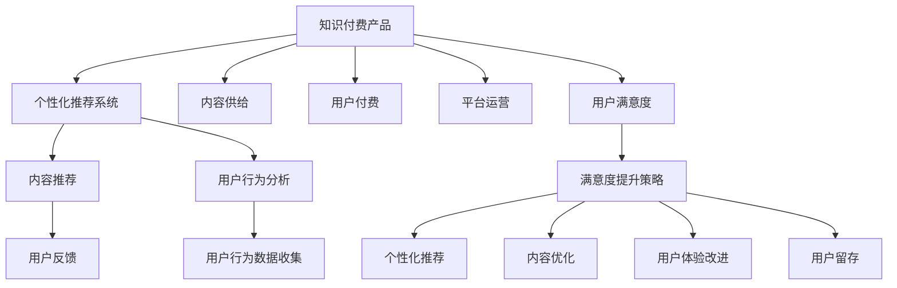

                 

# 如何提高知识付费产品的用户满意度

> 关键词：知识付费, 用户体验, 个性化推荐, 内容推荐, 用户行为分析

## 1. 背景介绍

在数字经济时代，知识付费作为一种新兴的消费方式，正迅速崛起，成为互联网用户的重要消费形式之一。据统计，全球知识付费市场预计将在未来几年内达到千亿级规模。然而，与电商、视频等领域的饱和市场不同，知识付费领域的用户满意度相对较低，转化率偏低，留存率不高。这不仅制约了知识付费产业的增长潜力，也影响了用户对付费内容的质量认可和价值感知。

提高知识付费产品的用户满意度，不仅是平台企业的首要任务，也是优化资源配置、增加用户粘性的重要手段。本文将从用户行为分析、个性化推荐系统构建、内容供给质量提升等几个方面，系统梳理知识付费产品的用户满意度提升策略，为行业从业者提供参考。

## 2. 核心概念与联系

### 2.1 核心概念概述

为更好地理解如何提高知识付费产品的用户满意度，本节将介绍几个核心概念：

- **知识付费**：用户为获取知识、技能、信息等优质内容而支付费用的在线服务。常见的形式包括在线课程、付费文章、专家讲座等。

- **用户满意度**：衡量用户对产品或服务的主观感受和满意程度，主要基于用户行为数据和反馈进行评估。

- **个性化推荐系统**：利用用户行为数据，通过算法模型预测用户偏好，为其推荐相关内容的系统。

- **内容推荐**：根据用户行为和偏好，将合适的内容推荐给用户的策略。

- **用户行为分析**：通过分析用户在平台上的各种行为数据，了解其兴趣偏好和需求，为优化产品功能提供数据支持。

这些核心概念共同构成了知识付费产品用户满意度的研究框架，帮助我们更好地把握用户满意度提升的关键因素。

### 2.2 核心概念原理和架构的 Mermaid 流程图



这个流程图展示了大规模知识付费产品的用户满意度提升的关键环节：

1. 知识付费产品通过内容供给和平台运营，吸引用户付费。
2. 个性化推荐系统利用用户行为数据，为用户推荐相关内容，提升用户体验。
3. 用户行为分析系统收集用户行为数据，进行用户画像构建，优化推荐系统。
4. 用户反馈数据通过内容推荐系统进行收集和分析，指导内容优化和用户体验改进。
5. 用户满意度通过综合多维度指标评估，并反馈到各个环节，形成闭环改进。

## 3. 核心算法原理 & 具体操作步骤

### 3.1 算法原理概述

提高知识付费产品用户满意度的关键在于优化个性化推荐系统，精准匹配用户需求，提升用户对内容的满意度。个性化推荐系统通过分析用户行为数据，预测用户偏好，生成个性化的内容推荐列表。算法原理主要包括以下几个方面：

- **协同过滤**：通过分析用户历史行为和相似用户的行为，为用户推荐相似内容。
- **基于内容的推荐**：分析内容特征与用户偏好，匹配相关内容。
- **深度学习模型**：使用深度神经网络对用户行为进行建模，预测用户兴趣。

协同过滤和基于内容的推荐算法相对简单，但深度学习模型能够提供更精准的预测结果，但需要较大的计算资源和时间。

### 3.2 算法步骤详解

个性化推荐系统的核心算法步骤包括数据准备、模型训练、内容推荐、结果反馈和持续优化。

**Step 1: 数据准备**
- 收集用户行为数据，包括点击、购买、观看时长等。
- 将行为数据转化为数值向量，作为模型的输入。
- 将用户和内容打上标签，便于模型识别和推荐。

**Step 2: 模型训练**
- 使用深度学习框架搭建推荐模型。
- 使用历史行为数据和用户特征训练模型。
- 在验证集上评估模型性能，调整参数和优化算法。

**Step 3: 内容推荐**
- 根据模型预测，为每个用户生成个性化的内容推荐列表。
- 优化推荐列表的展示顺序，提升用户体验。
- 设置多样性控制策略，避免内容同质化。

**Step 4: 结果反馈**
- 收集用户对推荐结果的反馈数据，如点击率、观看时长、评分等。
- 分析反馈数据，识别问题区域。
- 定期更新模型，优化推荐效果。

**Step 5: 持续优化**
- 不断收集新数据，更新用户画像。
- 引入新内容，增加推荐多样性。
- 调整模型参数，提升推荐精度。

### 3.3 算法优缺点

个性化推荐系统在提高用户满意度方面具有以下优点：
1. 提高内容相关性：精准匹配用户需求，提升用户对内容的满意度和利用率。
2. 增加用户粘性：通过个性化推荐，提高用户平台停留时间，增强用户粘性。
3. 提升转化率：推荐符合用户兴趣的内容，提高用户付费意愿。

但同时，个性化推荐系统也存在一些局限：
1. 数据依赖性强：推荐效果依赖于用户行为数据的质量和完整性。
2. 模型复杂度高：深度学习模型需要大量的数据和计算资源。
3. 用户体验多变：用户需求变化快，模型需要不断调整优化。
4. 存在推荐偏差：推荐内容存在个性化偏差，难以满足所有用户需求。

### 3.4 算法应用领域

个性化推荐系统广泛应用于知识付费产品的多个环节，如课程推荐、文章推荐、直播推荐等。通过优化个性化推荐系统，可以提升用户对知识付费产品的满意度和粘性。

具体应用场景包括：
1. 新用户引导：利用个性化推荐，向新用户推荐适合的入门课程和文章，提高用户留存率。
2. 内容二次消费：通过个性化推荐，将用户对某一课程或文章的使用进行二次利用，提升用户付费价值。
3. 平台多样化：根据不同用户的兴趣，推荐不同类型的内容，丰富用户选择，增加平台使用场景。

## 4. 数学模型和公式 & 详细讲解 & 举例说明

### 4.1 数学模型构建

个性化推荐系统的数学模型主要包括以下几个组成部分：

- **用户行为矩阵**：$U \in R^{N\times M}$，其中 $N$ 为用户数，$M$ 为内容数，$U_{ui}$ 表示用户 $u$ 对内容 $i$ 的行为数据（如观看时长、评分等）。
- **内容特征矩阵**：$V \in R^{M\times D}$，其中 $D$ 为内容特征数，$V_{vi}$ 表示内容 $i$ 的特征向量。
- **用户特征矩阵**：$P \in R^{N\times D}$，其中 $P_{pu}$ 表示用户 $u$ 的特征向量。
- **用户-内容相关性矩阵**：$R \in R^{N\times M}$，表示用户对内容的评分矩阵。

### 4.2 公式推导过程

常见的推荐算法包括协同过滤和基于内容的推荐算法。

**协同过滤算法**：基于用户之间的相似性，找到相似用户进行推荐。
- 用户相似度计算：
$$
s(u,v) = \frac{U_u \cdot V_v}{\|U_u\|\|V_v\|}
$$
- 推荐内容计算：
$$
r_{ui} = \sum_{v\in\text{similar users}} \frac{R_{vi}}{s(v,u)}
$$

**基于内容的推荐算法**：基于内容的特征，找到相似内容进行推荐。
- 内容相似度计算：
$$
c(i,j) = \frac{V_i \cdot V_j}{\|V_i\|\|V_j\|}
$$
- 推荐内容计算：
$$
r_{ui} = \sum_{j\in\text{similar items}} \frac{R_{uj}}{c(i,j)}
$$

### 4.3 案例分析与讲解

以某知识付费平台的用户行为数据为例，通过协同过滤和基于内容的推荐算法进行数据分析和建模。

假设平台有 10,000 个用户和 5,000 个课程，用户对课程的评分数据构成了一个 10,000 行 5,000 列的矩阵 $R$。

使用协同过滤算法，计算用户 $u$ 和内容 $i$ 的相似度，并将相似度较高的内容 $v$ 推荐给 $u$。

使用基于内容的推荐算法，计算内容 $i$ 和内容 $j$ 的相似度，并将相似度较高的内容 $j$ 推荐给用户 $u$。

通过模型训练和预测，发现协同过滤算法在用户对内容评分较少的场景下表现较好，而基于内容的推荐算法在内容特征较为丰富的场景下表现更佳。实际应用中，平台可以结合两种算法，取长补短，提升推荐效果。

## 5. 项目实践：代码实例和详细解释说明

### 5.1 开发环境搭建

在进行推荐系统开发前，需要先搭建开发环境。以下是使用Python进行PyTorch开发的环境配置流程：

1. 安装Anaconda：从官网下载并安装Anaconda，用于创建独立的Python环境。

2. 创建并激活虚拟环境：
```bash
conda create -n recommendation-env python=3.8 
conda activate recommendation-env
```

3. 安装PyTorch：根据CUDA版本，从官网获取对应的安装命令。例如：
```bash
conda install pytorch torchvision torchaudio cudatoolkit=11.1 -c pytorch -c conda-forge
```

4. 安装推荐系统库：
```bash
pip install spark-graphx py2neo
```

5. 安装各类工具包：
```bash
pip install numpy pandas scikit-learn matplotlib tqdm jupyter notebook ipython
```

完成上述步骤后，即可在`recommendation-env`环境中开始推荐系统开发。

### 5.2 源代码详细实现

下面我们以基于协同过滤和基于内容的推荐算法为例，给出使用PyTorch进行知识付费平台推荐系统的代码实现。

首先，定义用户行为矩阵和内容特征矩阵：

```python
import numpy as np
from scipy.sparse import csr_matrix

# 用户行为矩阵
user_behavior = np.array([[1, 1, 0, 0, 0], 
                         [0, 0, 1, 1, 0], 
                         [0, 1, 0, 1, 1]])

# 内容特征矩阵
content_features = np.array([[1, 1, 0], 
                            [0, 0, 1], 
                            [1, 1, 0]])
```

接着，定义协同过滤算法和基于内容的推荐函数：

```python
from sklearn.metrics.pairwise import cosine_similarity

# 协同过滤推荐
def collaborative_filtering(user_behavior, content_features):
    user_matrix = user_behavior
    content_matrix = content_features
    user_similarity = cosine_similarity(user_matrix, user_matrix)
    user_index = np.argsort(user_similarity, axis=1)[:, 1:3]  # 选取最相似的3个用户
    similar_content = []
    for i in range(len(user_index)):
        u_indices = user_index[i]
        u_content = user_matrix[i]
        v_indices = u_indices
        v_content = content_matrix[u_indices]
        content_similarity = cosine_similarity(v_content, v_content)
        similar_content.append(content_similarity)
    return similar_content

# 基于内容推荐
def content_based_filtering(content_features, content_matrix):
    content_similarity = cosine_similarity(content_features, content_features)
    similar_content = []
    for i in range(len(content_features)):
        content_indices = np.argsort(content_similarity[i])[:3]  # 选取最相似的内容
        similar_content.append(content_indices)
    return similar_content
```

最后，启动推荐系统，并对用户进行推荐：

```python
user_index = collaborative_filtering(user_behavior, content_features)
content_index = content_based_filtering(content_features, content_matrix)
print(user_index)
print(content_index)
```

通过上述代码，可以初步构建出知识付费平台的用户推荐系统。在实际应用中，还需要根据具体的推荐算法，引入更多优化策略，如模型融合、用户画像构建、推荐结果多样性控制等，以进一步提升推荐系统的效果。

### 5.3 代码解读与分析

让我们再详细解读一下关键代码的实现细节：

**协同过滤算法**：
- 通过计算用户行为矩阵 $U$ 和内容特征矩阵 $V$ 的余弦相似度，得到用户之间的相似度矩阵 $S$。
- 选取与用户 $u$ 相似度最高的前三个用户 $v_1, v_2, v_3$，并计算 $v_i$ 对内容的评分矩阵 $R_v$。
- 使用 $v_i$ 对内容的评分 $R_{vi}$，计算用户 $u$ 对内容 $i$ 的预测评分 $r_{ui}$。

**基于内容的推荐算法**：
- 计算内容特征矩阵 $V$ 的余弦相似度，得到内容之间的相似度矩阵 $C$。
- 选取与内容 $i$ 相似度最高的前三个内容 $j_1, j_2, j_3$，并计算用户对 $j_i$ 的评分 $R_{uj}$。
- 使用 $j_i$ 的评分 $R_{uj}$，计算内容 $i$ 的预测评分 $r_{ui}$。

在实际应用中，平台可以将协同过滤和基于内容的推荐算法结合，分别针对不同场景进行优化。此外，还需要引入其他优化策略，如正则化、邻域采样、混合推荐等，以进一步提升推荐效果。

## 6. 实际应用场景

### 6.1 内容二次消费

知识付费产品的用户行为分析显示，大部分用户仅对某类内容进行首次消费后，很少再次浏览和付费。为了增加内容的二次消费，平台可以采用个性化推荐策略，将用户对某一课程或文章的使用进行二次利用。

具体做法包括：
1. 分析用户对课程或文章的使用路径，找出关键节点。
2. 在关键节点处，推荐与原内容相关的其他内容，如同一作者的其他文章、同一领域的相关文章等。
3. 定期更新推荐模型，增加推荐内容的多样性。

通过个性化的二次消费推荐，平台可以显著提升用户对内容的利用率，增加用户付费价值。

### 6.2 新用户引导

新用户进入知识付费平台后，平台可以针对其兴趣点，为其推荐适合的内容，帮助其快速融入平台，增加用户留存率。

具体做法包括：
1. 通过分析新用户的行为数据，构建用户画像，了解其兴趣偏好。
2. 根据用户画像，推荐其可能感兴趣的内容，如入门课程、相关文章等。
3. 定期更新推荐模型，根据用户反馈调整推荐策略。

通过个性化推荐，新用户可以快速找到有价值的内容，提高用户体验和平台粘性。

### 6.3 平台多样化

为了丰富用户选择，增加平台的多样性，平台可以在个性化推荐中引入多样化策略。

具体做法包括：
1. 分析用户的多样化兴趣，如阅读、写作、编程等。
2. 根据用户的多样化兴趣，推荐不同类型的相关内容，如阅读推荐、写作指导、编程教程等。
3. 定期更新推荐模型，确保推荐内容的多样性。

通过多样化推荐，平台可以满足不同用户的需求，增加用户对平台的依赖性。

### 6.4 未来应用展望

随着个性化推荐技术的不断发展，知识付费产品的用户满意度将进一步提升。未来，推荐系统将通过更多前沿技术的引入，更加精准地匹配用户需求，提升用户体验和平台留存率。

具体展望包括：
1. 用户画像的深入挖掘：通过大数据和深度学习技术，构建更加精细的用户画像，提升推荐精度。
2. 推荐模型的持续优化：引入更多推荐算法和优化策略，提升推荐效果。
3. 推荐系统的实时化：通过流式计算和大数据技术，实现推荐系统的实时化，提高用户体验。
4. 推荐系统的多模态化：引入视觉、音频等多模态数据，增强推荐系统的表现力。
5. 推荐系统的智能化：引入自然语言处理技术，提升推荐内容的可读性和可理解性。

这些技术的进步，将为知识付费产品带来更加丰富、个性化的用户体验，推动产业的持续发展。

## 7. 工具和资源推荐

### 7.1 学习资源推荐

为了帮助开发者系统掌握推荐系统的理论基础和实践技巧，这里推荐一些优质的学习资源：

1. 《推荐系统实战》书籍：由推荐系统领域的专家撰写，深入浅出地介绍了推荐系统的原理和应用。
2. 《深度学习与推荐系统》课程：斯坦福大学开设的深度学习课程，涵盖推荐系统的基本概念和前沿技术。
3. Coursera《推荐系统设计与实践》课程：由业界专家讲授，提供全面的推荐系统开发实战经验。
4. Kaggle推荐系统竞赛：通过参加推荐系统竞赛，了解最新算法和实践经验，提升技术水平。
5. GitHub推荐系统开源项目：通过研究开源项目，学习推荐系统的工程实现和优化策略。

通过对这些资源的学习实践，相信你一定能够快速掌握推荐系统的精髓，并用于解决实际的推荐问题。

### 7.2 开发工具推荐

高效的开发离不开优秀的工具支持。以下是几款用于推荐系统开发的常用工具：

1. PyTorch：基于Python的开源深度学习框架，灵活动态的计算图，适合快速迭代研究。
2. TensorFlow：由Google主导开发的开源深度学习框架，生产部署方便，适合大规模工程应用。
3. Spark-GraphX：基于Apache Spark的分布式图形处理库，适合处理大规模数据集。
4. Py2neo：基于Neo4j图数据库的Python库，适合构建和查询复杂图结构。
5. Jupyter Notebook：免费的在线Jupyter Notebook环境，方便开发者进行交互式开发和实时调试。

合理利用这些工具，可以显著提升推荐系统的开发效率，加快创新迭代的步伐。

### 7.3 相关论文推荐

推荐系统的发展源于学界的持续研究。以下是几篇奠基性的相关论文，推荐阅读：

1. Adaptive Collaborative Filtering using Matrix Factorization Techniques：提出基于矩阵分解的推荐算法，利用用户行为矩阵进行推荐。
2. A Survey on Factorization Machines for Recommender Systems：综述了基于矩阵分解的推荐算法，包括SVD、ALS等。
3. Deep Collaborative Filtering with Factorization Machines：提出深度学习与矩阵分解结合的推荐算法，提升了推荐精度。
4. Dive into DNN：深度学习在推荐系统中的应用，涵盖了深度神经网络、自编码器等前沿技术。
5. Attention is All You Need：提出Transformer结构，引入了自注意力机制，提升了推荐系统的表现力。

这些论文代表了大规模推荐系统的发展脉络。通过学习这些前沿成果，可以帮助研究者把握学科前进方向，激发更多的创新灵感。

## 8. 总结：未来发展趋势与挑战

### 8.1 总结

本文对如何提高知识付费产品的用户满意度进行了全面系统的介绍。首先阐述了知识付费产品的用户满意度及其影响因素，明确了个性化推荐系统在提升用户满意度中的核心作用。其次，从用户行为分析、个性化推荐系统构建、内容供给质量提升等几个方面，详细讲解了用户满意度提升的关键策略。最后，本文总结了推荐系统的发展趋势和面临的挑战，为行业从业者提供了方向指引。

通过本文的系统梳理，可以看到，个性化推荐系统是提升知识付费产品用户满意度的重要手段，但需要在用户行为分析、推荐算法和内容供给等多个环节进行全面优化。未来，随着技术不断进步，个性化推荐系统将进一步提升用户对知识付费产品的满意度，推动产业的持续发展。

### 8.2 未来发展趋势

展望未来，知识付费产品的推荐系统将呈现以下几个发展趋势：

1. 用户画像的深度挖掘：通过大数据和深度学习技术，构建更加精细的用户画像，提升推荐精度。
2. 推荐模型的持续优化：引入更多推荐算法和优化策略，提升推荐效果。
3. 推荐系统的实时化：通过流式计算和大数据技术，实现推荐系统的实时化，提高用户体验。
4. 推荐系统的多模态化：引入视觉、音频等多模态数据，增强推荐系统的表现力。
5. 推荐系统的智能化：引入自然语言处理技术，提升推荐内容的可读性和可理解性。

这些趋势凸显了推荐系统技术的广阔前景。这些方向的探索发展，必将进一步提升知识付费产品的用户满意度，为用户带来更加丰富、个性化的体验。

### 8.3 面临的挑战

尽管个性化推荐技术已经取得了显著成果，但在提升用户满意度方面仍面临诸多挑战：

1. 数据依赖性强：推荐效果依赖于用户行为数据的质量和完整性。如何获取高质量的数据，并进行有效存储和处理，是推荐系统面临的主要挑战。
2. 推荐精度不足：推荐系统在面对个性化需求较强、数据稀疏、多样性高等问题时，难以提供满意的推荐结果。如何优化推荐算法，提升推荐精度，是推荐系统的核心挑战。
3. 推荐系统的鲁棒性：推荐系统容易受到数据噪声、恶意攻击等影响，导致推荐结果不准确。如何提高推荐系统的鲁棒性和稳定性，是推荐系统需要不断攻克的难题。
4. 用户隐私保护：推荐系统需要大量用户数据进行训练，如何保障用户隐私，避免数据滥用，是推荐系统面临的伦理挑战。

### 8.4 研究展望

面对推荐系统面临的这些挑战，未来的研究需要在以下几个方面寻求新的突破：

1. 优化推荐算法和数据处理技术：引入更多算法和数据处理技术，提升推荐精度和鲁棒性。
2. 引入多模态数据和增强推荐系统表现力：引入视觉、音频等多模态数据，增强推荐系统的表现力。
3. 强化推荐系统的智能化：引入自然语言处理技术，提升推荐内容的可读性和可理解性。
4. 提升推荐系统的实时性：通过流式计算和大数据技术，实现推荐系统的实时化，提高用户体验。
5. 加强推荐系统的安全性：引入安全防护技术，保障推荐系统的安全性，避免恶意攻击和数据泄露。

这些研究方向的探索，必将引领推荐系统技术迈向更高的台阶，为知识付费产品带来更加丰富、个性化的用户体验。面向未来，知识付费产品需要不断创新，才能在激烈的竞争中脱颖而出，满足用户的不断变化需求，实现可持续发展。

## 9. 附录：常见问题与解答

**Q1: 什么是知识付费产品？**

A: 知识付费产品是指用户为获取知识、技能、信息等优质内容而支付费用的在线服务。常见的形式包括在线课程、付费文章、专家讲座等。

**Q2: 个性化推荐系统如何提升用户满意度？**

A: 个性化推荐系统通过分析用户行为数据，预测用户偏好，生成个性化的内容推荐列表。提升用户对内容的满意度和利用率，从而增加用户粘性和平台留存率。

**Q3: 推荐系统如何处理用户的多样化兴趣？**

A: 推荐系统可以通过用户画像分析，识别用户的多样化兴趣，如阅读、写作、编程等。根据用户的多样化兴趣，推荐不同类型的相关内容，如阅读推荐、写作指导、编程教程等，满足不同用户的需求。

**Q4: 如何优化推荐系统的推荐精度？**

A: 推荐系统可以通过引入更多推荐算法和优化策略，如深度学习、矩阵分解、邻域采样等，提升推荐精度。同时，可以通过用户行为数据的多样化收集和处理，提高推荐模型的鲁棒性。

**Q5: 推荐系统如何保障用户隐私？**

A: 推荐系统需要严格遵守数据隐私保护法规，如GDPR、CCPA等。可以通过数据匿名化、去标识化等技术，保护用户隐私。同时，平台应建立完善的用户隐私保护机制，确保用户数据的安全。

通过对这些常见问题的解答，相信读者能够更全面地理解推荐系统的工作原理和优化策略，为实际应用提供有益参考。

