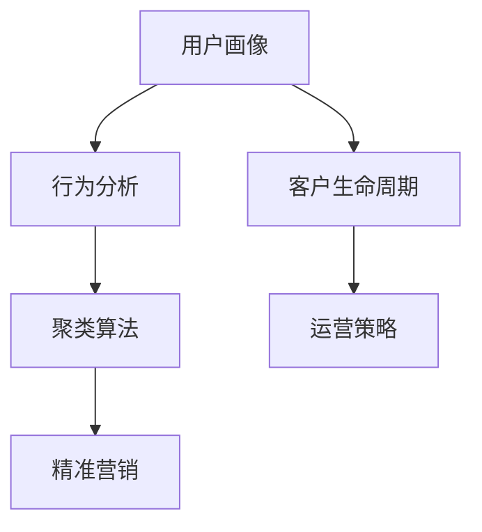

                 

# 如何进行有效的用户分层运营

> 关键词：用户分层, 精准营销, 行为分析, 数据驱动, 用户细分, 客户生命周期

## 1. 背景介绍

随着互联网技术的快速发展，企业的用户运营策略逐渐从粗放式向精细化转变。如何通过数据分析和算法优化，实现对用户行为、需求、价值的多维度理解，并据此进行精准投放和个性化服务，成为当前数字营销的核心课题。

用户分层运营，即通过数据分析将用户群体划分为多个具有相似特征的子群体，以便更有针对性地进行管理和服务。这一策略不仅有助于提升用户体验，还能显著提高运营效率和营销效果。

本博客将围绕用户分层运营的核心概念、算法原理、具体操作步骤，以及实际应用场景等方面展开，帮助读者全面掌握这一领域的专业知识和技术实践。

## 2. 核心概念与联系

### 2.1 核心概念概述

用户分层运营涉及多个关键概念，主要包括用户画像、行为分析、聚类算法等，其核心思想是通过数据驱动的方式，对用户进行科学、精确的分类，实现精细化的运营和营销。

1. **用户画像**：通过数据分析构建用户画像，包括基本信息、行为偏好、消费能力等维度，为分层提供依据。

2. **行为分析**：分析用户的历史行为数据，识别其行为模式和偏好，了解用户需求和价值。

3. **聚类算法**：根据用户特征和行为，利用聚类算法将用户划分为不同的群体，实现用户分层的自动化。

4. **精准营销**：针对不同用户群体，提供个性化的产品推荐、营销活动，提升用户体验和营销效果。

5. **客户生命周期**：将用户按照购买、忠诚、流失等不同生命周期阶段进行分类，制定相应的运营策略。

这些概念之间的联系可以通过以下Mermaid流程图展示：



通过用户画像和行为分析，结合聚类算法，将用户分为不同群体，并根据客户生命周期制定相应的运营策略，从而实现精准营销。

## 3. 核心算法原理 & 具体操作步骤

### 3.1 算法原理概述

用户分层运营的核心在于通过数据分析和算法，将用户群体进行科学划分。这一过程通常包括以下几个步骤：

1. **数据收集**：收集用户的基本信息和行为数据，如年龄、性别、消费记录、浏览历史等。
2. **特征工程**：对收集到的数据进行特征提取和预处理，生成可用于分层的特征向量。
3. **聚类算法**：使用聚类算法（如K-Means、层次聚类、DBSCAN等）对用户进行分组，形成不同的用户群体。
4. **后处理与评估**：对聚类结果进行后处理，如噪声点去除、异常值检测等，并评估模型的效果和稳定性。
5. **动态更新**：随着用户行为的变化和数据的新增，定期更新用户画像和聚类结果，确保分层的动态性和准确性。

### 3.2 算法步骤详解

#### 3.2.1 数据收集

数据收集是用户分层运营的第一步，需要通过多种渠道收集用户的详细信息。以下几种数据来源具有代表性：

1. **用户注册数据**：包括用户名、邮箱、电话等基本信息。
2. **用户行为数据**：如浏览记录、点击行为、购买记录等。
3. **社交媒体数据**：从社交平台获取用户的社交行为和兴趣偏好。
4. **第三方数据**：通过合作企业或数据服务提供商获取用户的行为和消费数据。

#### 3.2.2 特征工程

特征工程是数据预处理的重要环节，旨在提取和生成适用于聚类分析的特征向量。以下几种特征提取方法常见且有效：

1. **统计特征**：如用户的平均购买次数、平均消费金额、浏览时长等。
2. **文本特征**：如用户评论、产品描述等文本数据，通过自然语言处理技术提取关键词和情感倾向。
3. **时间特征**：如用户的访问高峰期、购买高峰期等，分析用户行为的时间分布规律。
4. **地点特征**：如用户的地理位置信息，分析用户的地理分布特征。

#### 3.2.3 聚类算法

聚类算法是用户分层的核心，通过算法将用户根据特征进行分组。以下几种聚类算法具有代表性：

1. **K-Means**：基于距离的聚类算法，将用户分为K个簇，每个簇内用户相似度较高。
2. **层次聚类**：通过构建树状结构进行聚类，可以自顶向下或自底向上进行分类。
3. **DBSCAN**：基于密度的聚类算法，可以发现任意形状的簇，对噪声点有较好的处理能力。
4. **谱聚类**：通过矩阵分解和特征值分析进行聚类，适合处理高维数据。

#### 3.2.4 后处理与评估

聚类结果生成后，需要进行后处理和评估。以下几种后处理方法常见且有效：

1. **噪声点去除**：通过统计学方法或聚类算法本身的功能，去除噪声点和异常值。
2. **簇合并与分裂**：对聚类结果进行进一步调整，如合并相似度高的簇，或对小簇进行分裂。
3. **簇质心优化**：通过优化算法（如K-Means）调整簇质心，提高聚类效果。

#### 3.2.5 动态更新

用户行为和数据是动态变化的，因此需要定期更新用户画像和聚类结果，以确保分层的准确性和时效性。

1. **周期性更新**：定期重新收集用户数据和行为数据，重新进行特征工程和聚类分析。
2. **实时更新**：通过流数据处理技术，对用户行为进行实时监测和更新。
3. **增量更新**：在数据量较大时，采用增量更新的方法，只处理新增或变化的数据，减少计算负担。

### 3.3 算法优缺点

用户分层运营的聚类算法具有以下优点：

1. **自动化**：通过算法自动化用户分层，减少了人工干预和错误，提升了运营效率。
2. **科学性**：利用数据驱动的方式，减少了主观因素的影响，提升了分层的科学性和可靠性。
3. **灵活性**：可根据业务需求和数据特点，选择不同的聚类算法，满足多样化的业务需求。

但聚类算法也存在以下缺点：

1. **依赖数据质量**：聚类算法的准确性依赖于数据的质量和完备性，数据缺失或不一致会影响分层效果。
2. **参数敏感**：部分聚类算法（如K-Means）对参数（如簇数K）的选择较为敏感，需进行多次实验调整。
3. **难以解释**：聚类结果通常是黑盒的，难以直观解释和理解，增加了运营的复杂性。
4. **局部最优**：部分聚类算法（如K-Means）可能陷入局部最优，影响分层的全局效果。

### 3.4 算法应用领域

用户分层运营的应用领域广泛，涵盖了电商、金融、社交、旅游等多个行业。以下是几个典型应用场景：

1. **电商推荐系统**：通过对用户行为数据的分析，将用户分为不同兴趣群体，提供个性化的商品推荐，提升转化率。
2. **金融风控系统**：通过行为数据和信用数据进行聚类分析，识别高风险用户，进行风险控制和贷前审核。
3. **社交网络运营**：分析用户行为和兴趣，对用户进行细分，实现个性化内容和广告投放。
4. **旅游推荐系统**：分析用户的旅游行为和偏好，推荐符合用户喜好的旅游产品，提升用户体验。
5. **健康医疗**：通过患者病历和行为数据进行聚类分析，识别高风险人群，提供个性化健康管理方案。

## 4. 数学模型和公式 & 详细讲解

### 4.1 数学模型构建

用户分层的数学模型可以概括为：

$$
\text{用户分层} = \text{聚类算法}(\text{特征向量})
$$

其中，特征向量由用户的基本信息和行为数据组成。聚类算法的目标是最小化簇内用户间的相似度差异，最大化簇间用户的差异度。

### 4.2 公式推导过程

以K-Means算法为例，其目标函数为：

$$
\text{Minimize} \sum_{i=1}^{K} \sum_{x \in C_i} ||x - \mu_i||^2
$$

其中，$C_i$ 表示第i簇的用户集合，$\mu_i$ 表示第i簇的簇质心。目标函数表示所有簇内用户与簇质心距离的平方和最小化。

求解该问题的方法是通过迭代优化，步骤如下：

1. **随机初始化簇质心**：随机选择K个用户作为初始簇质心。
2. **分配用户到簇**：计算每个用户与所有簇质心的距离，分配到最近的簇。
3. **更新簇质心**：对每个簇，计算其内所有用户的平均值，更新簇质心。
4. **重复步骤2-3**：直到簇质心不再发生变化或达到预设迭代次数。

### 4.3 案例分析与讲解

以电商推荐系统为例，分析用户分层在推荐算法中的应用：

1. **数据收集**：收集用户的基本信息（如年龄、性别）、行为数据（如浏览记录、购买记录）、评价数据（如商品评分）。
2. **特征工程**：对用户的基本信息和行为数据进行特征提取，如用户的平均购买金额、平均浏览时长等。
3. **聚类算法**：使用K-Means算法将用户分为高价值用户、中价值用户和低价值用户三个群体。
4. **后处理与评估**：对聚类结果进行后处理，如去除异常值，评估聚类效果。
5. **推荐算法**：对不同群体的用户，采用不同的推荐策略，如高价值用户推荐高毛利商品，低价值用户推荐高性价比商品。

## 5. 项目实践：代码实例和详细解释说明

### 5.1 开发环境搭建

以下是基于Python和Pandas库的代码实现环境搭建：

1. **安装Python**：使用Anaconda或Miniconda安装Python 3.6或以上版本。
2. **安装Pandas**：使用pip安装Pandas库，用于数据处理和分析。
3. **安装Scikit-learn**：使用pip安装Scikit-learn库，用于聚类算法实现。

### 5.2 源代码详细实现

以下是一个简单的用户分层聚类代码实现，以K-Means算法为例：

```python
import pandas as pd
from sklearn.cluster import KMeans

# 读取用户数据
user_data = pd.read_csv('user_data.csv')

# 特征工程
features = ['age', 'gender', 'purchasing_frequency', 'average_purchase_amount']

# 构建特征向量
X = user_data[features]

# 进行K-Means聚类
kmeans = KMeans(n_clusters=3)
kmeans.fit(X)

# 输出聚类结果
print(kmeans.labels_)
```

### 5.3 代码解读与分析

**用户数据**：
- 通过pandas库读取用户数据，包含基本信息（age、gender）、行为数据（purchasing_frequency、average_purchase_amount）。
**特征工程**：
- 选择需要作为聚类依据的特征，如用户的年龄、性别、购买频率、平均购买金额。
**K-Means聚类**：
- 使用scikit-learn库中的KMeans算法进行聚类，n_clusters参数指定簇的数量为3。
**输出聚类结果**：
- 输出每个用户的聚类标签，表示其所属的簇。

### 5.4 运行结果展示

运行上述代码，将输出用户分层的聚类结果，例如：

```
[0 1 2 0 1 0 1 2 0 2 1 0 0 0 1 1 0 1 2 0]
```

表示前20个用户的聚类标签分别为0、1、2，分别对应三个簇。

## 6. 实际应用场景

### 6.1 电商推荐系统

用户分层运营在电商推荐系统中的应用非常广泛。通过用户分层，可以更准确地了解不同用户群体的需求和行为特征，实现个性化推荐，提升用户体验和转化率。

电商推荐系统的具体实现步骤如下：

1. **数据收集**：收集用户的基本信息和行为数据，如年龄、性别、购买记录等。
2. **特征工程**：对用户的基本信息和行为数据进行特征提取，如用户的平均购买金额、平均浏览时长等。
3. **聚类算法**：使用K-Means或层次聚类算法，将用户分为高价值用户、中价值用户和低价值用户。
4. **推荐算法**：对不同群体的用户，采用不同的推荐策略，如高价值用户推荐高毛利商品，低价值用户推荐高性价比商品。
5. **后处理与评估**：对推荐效果进行后处理和评估，如点击率、转化率等指标。

### 6.2 金融风控系统

金融风控系统通过用户分层运营，可以有效识别和管理高风险用户，降低坏账风险，提升贷款审批效率。

金融风控系统的具体实现步骤如下：

1. **数据收集**：收集用户的信用数据、行为数据、社交数据等。
2. **特征工程**：对用户的信用数据、行为数据等进行特征提取，如用户的平均信用评分、消费金额等。
3. **聚类算法**：使用K-Means或层次聚类算法，将用户分为高风险用户和低风险用户。
4. **风险控制**：对高风险用户进行严格审核，增加贷款门槛或拒绝贷款；对低风险用户简化审批流程，提高审批效率。
5. **后处理与评估**：对风险控制效果进行后处理和评估，如违约率等指标。

### 6.3 社交网络运营

社交网络运营通过用户分层，可以实现个性化内容和广告投放，提升用户活跃度和广告效果。

社交网络运营的具体实现步骤如下：

1. **数据收集**：收集用户的社交行为数据，如点赞、评论、分享等。
2. **特征工程**：对用户的社交行为数据进行特征提取，如用户的点赞频率、评论情感等。
3. **聚类算法**：使用K-Means或层次聚类算法，将用户分为不同兴趣群体。
4. **内容投放**：对不同群体的用户，投放不同类型的内容和广告，提升用户参与度和广告效果。
5. **后处理与评估**：对内容投放效果进行后处理和评估，如用户活跃度、广告点击率等指标。

## 7. 工具和资源推荐

### 7.1 学习资源推荐

1. **《数据科学与人工智能》课程**：通过该课程学习数据挖掘、机器学习、聚类算法等基础理论，为后续实践奠定坚实基础。
2. **《Python数据科学手册》**：详细介绍Python在数据科学和机器学习中的应用，包括Pandas、Scikit-learn等库的使用。
3. **Kaggle竞赛平台**：参与Kaggle数据科学竞赛，实战练习，提升技能和经验。
4. **Coursera和edX在线课程**：选择相关课程进行深入学习，如《机器学习》、《数据科学导论》等。

### 7.2 开发工具推荐

1. **Anaconda**：提供Python环境管理和数据科学工具，方便快速搭建开发环境。
2. **Jupyter Notebook**：交互式编程环境，方便代码调试和结果展示。
3. **TensorFlow和PyTorch**：强大的深度学习框架，支持复杂的模型训练和优化。
4. **Scikit-learn**：Python机器学习库，提供多种聚类算法和评估指标。

### 7.3 相关论文推荐

1. **K-Means算法**：《K-means: A qualitative and quantitative study》
2. **层次聚类**：《A Survey of Hierarchical Clustering Algorithms》
3. **DBSCAN算法**：《Density-Based Clustering》
4. **谱聚类**：《A Tutorial on Spectral Clustering》

## 8. 总结：未来发展趋势与挑战

### 8.1 总结

用户分层运营在大数据和人工智能的驱动下，正在成为企业用户运营的重要工具。通过数据驱动和算法优化，实现对用户的多维度理解和管理，提升了运营效率和营销效果。本文介绍了用户分层运营的核心概念、算法原理和具体操作步骤，并通过实际应用场景展示了其广泛的应用价值。

### 8.2 未来发展趋势

未来，用户分层运营将呈现出以下几个发展趋势：

1. **多维度细分**：用户分层将更加细粒化，结合多维度数据进行综合分析，如行为数据、社交数据、地理数据等。
2. **实时动态更新**：随着用户行为的不断变化，用户分层模型需要实时更新，以保持分层的准确性和时效性。
3. **模型解释性**：未来用户分层模型需要具备更强的解释性，方便运营人员理解和调整。
4. **跨平台整合**：用户分层模型需要跨平台整合，支持不同业务场景和应用系统的集成。
5. **自动化运营**：用户分层运营将更多地向自动化、智能化方向发展，减少人工干预和错误。

### 8.3 面临的挑战

用户分层运营在实际应用中仍面临一些挑战：

1. **数据质量**：用户分层结果的准确性依赖于数据的质量和完备性，数据缺失或不一致会影响分层效果。
2. **模型复杂性**：部分聚类算法（如K-Means）对参数的选择较为敏感，需进行多次实验调整。
3. **计算成本**：用户分层需要处理大量数据，计算成本较高，需要优化算法和硬件配置。
4. **隐私问题**：用户分层涉及大量用户隐私数据，如何保障数据安全性和隐私保护是一个重要问题。

### 8.4 研究展望

未来的研究将集中在以下几个方面：

1. **自动化和智能化**：开发自动化的用户分层模型，提升运营效率和效果。
2. **模型解释性**：增强用户分层模型的解释性，方便运营人员理解和调整。
3. **跨平台整合**：实现用户分层模型的跨平台整合，支持不同业务场景和应用系统的集成。
4. **实时动态更新**：开发实时动态更新的用户分层模型，保持分层的准确性和时效性。
5. **隐私保护**：研究隐私保护技术，保障用户数据的隐私性和安全性。

## 9. 附录：常见问题与解答

**Q1：用户分层运营的原理是什么？**

A: 用户分层运营的核心是通过数据驱动的方式，利用聚类算法将用户根据其特征和行为进行科学划分，形成不同的用户群体，从而实现精细化的运营和营销。

**Q2：用户分层有哪些常见的聚类算法？**

A: 用户分层中常用的聚类算法包括K-Means、层次聚类、DBSCAN、谱聚类等，每种算法有其适用的场景和优缺点，需要根据具体情况选择合适的算法。

**Q3：用户分层的应用场景有哪些？**

A: 用户分层在电商推荐、金融风控、社交网络运营、旅游推荐、健康医疗等多个领域具有广泛的应用价值。

**Q4：用户分层运营需要注意哪些问题？**

A: 用户分层运营需要考虑数据质量、模型复杂性、计算成本和隐私保护等问题，只有全面优化各个环节，才能实现理想的用户分层效果。

**Q5：如何进行用户分层的数据收集？**

A: 用户分层的数据收集可以通过多种渠道进行，如用户注册数据、行为数据、社交数据等，需要保证数据的全面性和准确性。

---

作者：禅与计算机程序设计艺术 / Zen and the Art of Computer Programming

