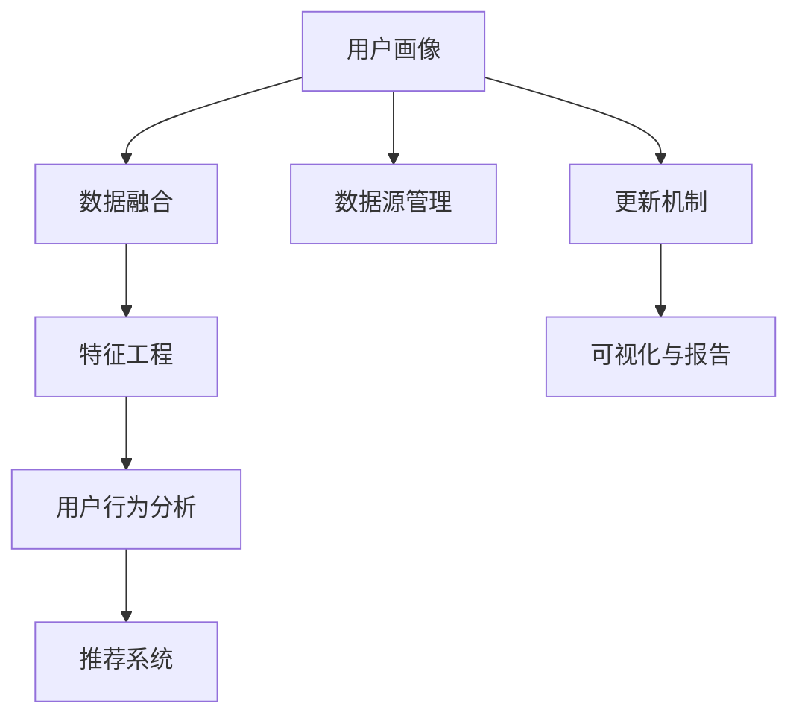

                 

# 如何进行有效的用户画像更新

在数字化转型的大潮下，企业越来越重视用户画像的构建和维护。精准的用户画像不仅有助于企业深入理解目标用户群体，还能为产品开发、市场推广、客户服务等环节提供数据支撑，推动业务智能化发展。然而，构建和更新用户画像并非易事，需要系统的方法和工具。本文将深入探讨如何通过数据驱动和算法优化，实现有效的用户画像更新。

## 1. 背景介绍

### 1.1 问题由来
在互联网时代，用户行为数据日益丰富，如何高效地从海量数据中提取关键信息，构建准确的用户画像，是当前企业数字化转型的重要课题。

传统用户画像的构建主要依赖人工调研和问卷调查，不仅耗时耗力，且难以覆盖全面。近年来，大数据、机器学习等技术在用户画像构建中逐渐普及，提升了画像构建的效率和精度。

然而，随着数据量和用户行为模式的不断变化，已有用户画像的准确性和时效性会逐渐下降。如何定期更新和优化用户画像，保持其动态适应性，已成为企业数据科学团队的重要挑战。

### 1.2 问题核心关键点
用户画像更新核心在于：
- **数据源管理**：从哪些数据源获取用户信息。
- **数据融合与处理**：如何将不同来源的数据进行融合、去重、清洗、标注等处理，形成统一的用户视图。
- **算法模型选择**：选择哪种算法模型对用户画像进行优化，以达到最优效果。
- **可视化与报告**：如何将更新后的用户画像可视化展示，并提供直观的报告和分析。

## 2. 核心概念与联系

### 2.1 核心概念概述

为更好地理解用户画像更新方法，本节将介绍几个关键概念：

- **用户画像(User Profile)**：描绘用户特征和行为的一组数据，包括人口统计、兴趣偏好、行为习惯等，用于深入理解用户需求和行为模式。
- **数据融合(Data Integration)**：将来自不同数据源的数据，如网站、社交媒体、CRM系统等，进行整合处理，形成一致的用户视图。
- **特征工程(Feature Engineering)**：对原始数据进行加工和处理，提取有意义的特征，供机器学习模型使用。
- **用户行为分析(Usage Analysis)**：分析用户与产品或服务的交互行为，提取行为模式，如浏览历史、购买行为、点击率等。
- **推荐系统(Recommender System)**：基于用户画像和行为分析，为每个用户推荐个性化内容，提升用户体验。

这些核心概念之间的逻辑关系可以通过以下Mermaid流程图来展示：



这个流程图展示了两类主要工作流程：
1. 从原始数据到用户画像的生成过程，包括数据融合和特征工程。
2. 从用户画像到推荐系统的应用过程，包括用户行为分析和推荐策略。

同时，展示了用户画像的动态更新和可视化报告的机制。

## 3. 核心算法原理 & 具体操作步骤
### 3.1 算法原理概述

用户画像更新通常采用机器学习算法进行模型优化。其核心思想是：在已有用户画像的基础上，通过新获取的用户数据，对用户画像进行再训练，提升画像的准确性和完整性。

具体步骤如下：

1. **数据收集与预处理**：收集用户最新行为数据，包括浏览记录、点击事件、购买行为等，并进行预处理。
2. **特征提取与融合**：使用特征工程技术，提取有意义的特征，如点击次数、停留时间、购买金额等。对来自不同数据源的数据进行融合，消除冗余，确保数据一致性。
3. **模型训练与优化**：选择合适的机器学习模型（如逻辑回归、决策树、神经网络等），对用户画像进行训练和优化。
4. **可视化与报告**：将更新后的用户画像通过图表、报表等形式展示，便于业务人员理解和应用。

### 3.2 算法步骤详解

**Step 1: 数据收集与预处理**

用户画像更新首先依赖于新数据的收集。这通常包括：
- **事件日志**：如用户在网站上的浏览、点击、购买等行为记录。
- **社交媒体数据**：用户在社交平台上的活动和互动信息。
- **CRM系统数据**：客户关系管理系统中的用户信息、互动记录。
- **调查问卷**：定期的用户满意度调查、行为倾向调查。

收集数据后，需要进行预处理，包括：
- **去重**：删除重复记录，确保数据的唯一性。
- **清洗**：去除错误、异常或无用的数据，如格式错误、缺失值等。
- **标准化**：将不同格式的数据统一，如将日期格式统一为标准格式。
- **归一化**：对数据进行标准化处理，如将数值型数据归一化到[0,1]区间。

**Step 2: 特征提取与融合**

特征提取是用户画像更新的关键步骤。常用的特征提取方法包括：
- **统计特征**：如点击次数、停留时间、购买金额等。
- **文本特征**：如评论内容、标签、关键词等。
- **行为序列**：如用户在网站上的浏览路径、购买路径等。
- **用户画像特征**：如人口统计信息、兴趣爱好等。

特征提取后，需要对不同数据源的数据进行融合。常用的数据融合方法包括：
- **实体对齐**：对不同数据源中的同名实体进行对齐，如通过ID、姓名等进行匹配。
- **数据合并**：将不同数据源中的数据合并，形成一致的用户视图。
- **数据去重**：消除不同数据源中的重复记录，确保数据的准确性。

**Step 3: 模型训练与优化**

选择合适的机器学习模型对用户画像进行训练和优化。常用的模型包括：
- **决策树**：用于分类和回归任务。
- **随机森林**：提升模型的鲁棒性和泛化能力。
- **逻辑回归**：用于二分类任务。
- **神经网络**：适用于复杂的非线性问题。

模型训练和优化的步骤如下：
- **分割数据集**：将数据集划分为训练集和测试集。
- **特征选择**：选择对目标变量（如用户行为）影响较大的特征。
- **模型训练**：使用训练集对模型进行训练。
- **模型评估**：在测试集上评估模型性能，选择合适的模型和参数。
- **模型优化**：调整模型参数，如学习率、正则化等，提升模型效果。

**Step 4: 可视化与报告**

将更新后的用户画像通过图表、报表等形式展示，便于业务人员理解和应用。常用的可视化工具包括：
- **Tableau**：数据可视化报表工具。
- **Power BI**：商业智能分析工具。
- **Plotly**：交互式数据可视化库。
- **Dash**：基于Python的数据可视化框架。

通过可视化报告，可以直观展示用户画像的特征和行为模式，为业务决策提供数据支持。

### 3.3 算法优缺点

用户画像更新采用机器学习算法的优点包括：
- **高效性**：自动从大量数据中提取特征，进行训练和优化，提升更新效率。
- **准确性**：通过算法模型自动学习用户行为模式，提高画像的准确性。
- **可扩展性**：可以处理来自不同数据源的数据，实现多数据融合和全局优化。

缺点包括：
- **模型选择**：选择合适的模型和算法需要一定的技术积累和经验。
- **数据质量**：原始数据的质量和一致性直接影响模型效果。
- **模型复杂度**：复杂的模型可能带来过拟合风险，需要额外调参。
- **计算资源**：模型训练和优化需要较高的计算资源和算力支持。

### 3.4 算法应用领域

用户画像更新在多个领域有广泛应用，例如：

- **电商推荐**：通过用户画像优化推荐算法，提升商品推荐准确性，提高用户转化率。
- **金融风控**：分析用户行为模式，评估信用风险，进行贷款审批和风险控制。
- **广告投放**：根据用户画像进行定向投放，提升广告效果和投资回报率。
- **医疗健康**：分析用户健康行为，提供个性化健康建议和治疗方案。
- **旅游出行**：根据用户偏好和行为，推荐旅行路线和目的地，提升用户体验。

## 4. 数学模型和公式 & 详细讲解 & 举例说明

### 4.1 数学模型构建

假设用户画像由$n$个特征组成，记为$x=(x_1,x_2,...,x_n)$，其中$x_i$为第$i$个特征。目标变量为$y$，表示用户的行为或属性。用户画像更新可以通过回归模型$y=f(x;\theta)$进行建模，其中$\theta$为模型参数。

用户画像更新的目标是最小化预测值与真实值之间的误差，常用的优化目标函数为：

$$
\min_{\theta} \frac{1}{N}\sum_{i=1}^N (y_i - f(x_i; \theta))^2
$$

其中$N$为样本数量，$(y_i, x_i)$为第$i$个样本的实际行为和特征向量。

### 4.2 公式推导过程

以线性回归模型为例，推导目标函数的梯度：

设$f(x;\theta)=\theta_0+\theta_1x_1+\theta_2x_2+...+\theta_nx_n$，目标函数为：

$$
\mathcal{L}(\theta) = \frac{1}{N}\sum_{i=1}^N (y_i - (\theta_0+\theta_1x_{i1}+\theta_2x_{i2}+...+\theta_nx_{in}))^2
$$

求$\mathcal{L}(\theta)$对$\theta$的偏导数：

$$
\frac{\partial \mathcal{L}(\theta)}{\partial \theta_k} = \frac{2}{N} \sum_{i=1}^N (y_i - f(x_i; \theta))x_{ik}
$$

其中$x_{ik}$为第$i$个样本的第$k$个特征值。

### 4.3 案例分析与讲解

假设某电商平台有$m$个用户，每个用户有$p$个行为特征，如浏览次数、停留时间、购买金额等。用户行为标签为$y$，表示用户是否进行了购买行为。

收集到用户历史行为数据后，进行预处理和特征提取。使用线性回归模型对用户画像进行训练和优化：

1. **数据收集与预处理**：
   - 收集用户行为日志，包括浏览记录、点击事件、购买行为等。
   - 去除重复和无用的数据，确保数据的准确性和一致性。
   - 对时间特征进行标准化处理，如将日期格式统一为标准格式。

2. **特征提取与融合**：
   - 提取统计特征，如点击次数、停留时间、购买金额等。
   - 将不同数据源中的数据进行融合，形成一致的用户视图。
   - 对特征进行归一化处理，如将数值型数据归一化到[0,1]区间。

3. **模型训练与优化**：
   - 将数据集划分为训练集和测试集。
   - 选择对目标变量影响较大的特征，如浏览次数、停留时间等。
   - 使用线性回归模型对用户画像进行训练，最小化预测值与真实值之间的误差。
   - 在测试集上评估模型性能，选择最优的模型和参数。
   - 调整模型参数，如学习率、正则化等，提升模型效果。

4. **可视化与报告**：
   - 使用Tableau或Power BI等工具，将用户画像的特征和行为模式可视化展示。
   - 生成可视化报表，直观展示用户行为趋势和特征分布。

通过上述步骤，电商平台可以不断更新用户画像，提升个性化推荐系统的精准性，提高用户转化率和满意度。

## 5. 项目实践：代码实例和详细解释说明

### 5.1 开发环境搭建

在进行用户画像更新实践前，我们需要准备好开发环境。以下是使用Python进行Pandas、Scikit-learn开发的环境配置流程：

1. 安装Anaconda：从官网下载并安装Anaconda，用于创建独立的Python环境。

2. 创建并激活虚拟环境：
```bash
conda create -n user_profile_env python=3.8 
conda activate user_profile_env
```

3. 安装Pandas、Scikit-learn等工具包：
```bash
pip install pandas scikit-learn numpy matplotlib seaborn
```

4. 安装机器学习框架TensorFlow或PyTorch：
```bash
pip install tensorflow==2.0 pytorch torchvision torchaudio
```

完成上述步骤后，即可在`user_profile_env`环境中开始用户画像更新实践。

### 5.2 源代码详细实现

这里我们以用户行为预测为例，给出使用Scikit-learn进行用户画像更新的Python代码实现。

首先，定义数据处理函数：

```python
import pandas as pd
from sklearn.model_selection import train_test_split
from sklearn.linear_model import LinearRegression
from sklearn.metrics import mean_squared_error

def load_data(file_path):
    data = pd.read_csv(file_path)
    X = data.drop('y', axis=1)
    y = data['y']
    return X, y

def train_model(X_train, X_test, y_train, y_test):
    model = LinearRegression()
    model.fit(X_train, y_train)
    y_pred = model.predict(X_test)
    return model, mean_squared_error(y_test, y_pred)

def evaluate_model(model, X_test, y_test):
    y_pred = model.predict(X_test)
    mse = mean_squared_error(y_test, y_pred)
    rmse = mse**0.5
    return rmse

def save_model(model, file_path):
    import pickle
    with open(file_path, 'wb') as f:
        pickle.dump(model, f)
```

然后，读取数据并分割训练集和测试集：

```python
X, y = load_data('user_data.csv')
X_train, X_test, y_train, y_test = train_test_split(X, y, test_size=0.2, random_state=42)
```

接着，训练模型并评估性能：

```python
model, mse = train_model(X_train, X_test, y_train, y_test)
rmse = evaluate_model(model, X_test, y_test)
print(f'RMSE: {rmse:.2f}')
```

最后，保存模型并可视化结果：

```python
save_model(model, 'user_profile_model.pkl')
```

以上代码实现了一个简单的用户画像更新过程，使用线性回归模型进行行为预测。在实际应用中，还需要进一步优化和扩展。

### 5.3 代码解读与分析

让我们再详细解读一下关键代码的实现细节：

**load_data函数**：
- 读取用户行为数据，去除无关特征，保留行为标签。

**train_model函数**：
- 将数据集划分为训练集和测试集，使用线性回归模型对用户画像进行训练。
- 计算模型在测试集上的均方误差，评估模型性能。

**evaluate_model函数**：
- 在测试集上计算模型预测值与真实值之间的均方误差，评估模型效果。
- 计算均方误差和根均方误差（RMSE），输出评估指标。

**save_model函数**：
- 使用pickle保存训练好的模型，便于后续使用。

这些函数实现了用户画像更新的基本流程，从数据预处理到模型训练、评估和保存。通过这些代码，我们可以对用户画像进行不断的更新和优化，提升模型的预测准确性。

## 6. 实际应用场景

### 6.1 电商推荐

电商平台的个性化推荐系统依赖于用户画像的精确性。通过用户画像更新，电商平台可以不断优化推荐算法，提升用户的购物体验。具体而言，可以收集用户的浏览记录、点击事件、购买行为等数据，通过线性回归等模型对用户画像进行优化，预测用户是否会进行购买行为，从而进行个性化推荐。

### 6.2 金融风控

金融行业需要评估用户的信用风险，传统的方法依赖于人工评估和经验判断，效率低且易出错。使用用户画像更新，金融公司可以自动化评估用户的信用风险，提高审批效率和准确性。通过收集用户的消费记录、借贷行为等数据，构建用户画像，使用分类算法预测用户的信用等级，从而进行贷款审批和风险控制。

### 6.3 广告投放

广告主需要精准投放广告，提升广告效果和投资回报率。通过用户画像更新，广告主可以分析用户的行为模式和兴趣偏好，进行定向投放。收集用户的浏览记录、广告点击记录等数据，构建用户画像，使用聚类算法对用户进行分组，针对不同群体的用户投放适合的广告，提升广告效果和投放效率。

### 6.4 医疗健康

医疗健康行业需要个性化推荐健康建议和治疗方案。通过用户画像更新，医疗机构可以提供个性化的健康建议和治疗方案，提高患者的满意度和治疗效果。收集用户的健康数据、行为数据等，构建用户画像，使用推荐系统为用户推荐个性化的健康建议和治疗方案，提升患者治疗效果和生活质量。

### 6.5 旅游出行

旅游出行平台需要推荐个性化的旅游路线和目的地，提升用户体验。通过用户画像更新，旅游平台可以分析用户的行为模式和偏好，提供个性化的旅游推荐。收集用户的浏览记录、预订记录等数据，构建用户画像，使用协同过滤算法推荐适合用户的旅游路线和目的地，提升用户体验和平台收益。

## 7. 工具和资源推荐

### 7.1 学习资源推荐

为了帮助开发者系统掌握用户画像更新的理论基础和实践技巧，这里推荐一些优质的学习资源：

1. 《Python数据分析》系列书籍：全面介绍了Pandas、NumPy等数据处理工具，适合入门学习。

2. 《机器学习实战》：介绍了Scikit-learn等机器学习库，提供了大量的实战案例。

3. 《深度学习入门》：介绍了深度学习框架TensorFlow和PyTorch，适合深入学习。

4. Coursera《机器学习》课程：由斯坦福大学教授主讲，涵盖机器学习的基本概念和算法。

5. Kaggle机器学习竞赛：提供了大量的数据集和实战挑战，适合实践锻炼。

通过对这些资源的学习实践，相信你一定能够快速掌握用户画像更新的精髓，并用于解决实际的业务问题。

### 7.2 开发工具推荐

高效的开发离不开优秀的工具支持。以下是几款用于用户画像更新开发的常用工具：

1. Jupyter Notebook：免费开源的交互式编程环境，支持Python和R语言，适合数据处理和模型开发。

2. Visual Studio Code：轻量级的代码编辑器，支持多种编程语言和数据处理工具。

3. Tableau：数据可视化报表工具，支持多种数据源和图表展示。

4. Power BI：商业智能分析工具，支持复杂的报表和数据可视化。

5. Scikit-learn：机器学习库，提供多种算法模型和评估指标。

6. TensorFlow和PyTorch：深度学习框架，支持高效的模型训练和优化。

合理利用这些工具，可以显著提升用户画像更新任务的开发效率，加快创新迭代的步伐。

### 7.3 相关论文推荐

用户画像更新领域的研究仍在不断深入，以下是几篇奠基性的相关论文，推荐阅读：

1. Privacy-Preserving Spatial-Temporal Pattern Learning from Uncertain Data with Missing Values（隐私保护空间-时间模式学习）：介绍了如何在保护用户隐私的前提下，从缺失数据中学习用户行为模式。

2. A Deep Learning Framework for Personalized Recommendation with User Profiles (用户画像的深度学习推荐框架)：提出了基于深度学习的用户画像推荐系统，提升了推荐系统的个性化能力。

3. User Profiling for Context-Aware Recommender Systems: A Survey (用户画像在上下文推荐系统中的应用)：综述了用户画像在推荐系统中的应用，探讨了多种用户画像构建和优化方法。

4. Multi-view Learning for User Profiling in Recommendation Systems (推荐系统中的用户画像多视图学习)：提出了一种多视图学习方法，综合利用不同数据源构建用户画像，提高了推荐系统的准确性和鲁棒性。

5. User Profiling Using Big Data for Personalized Recommendation (大数据用户画像与个性化推荐)：介绍了如何使用大数据技术构建用户画像，提升个性化推荐的效果。

这些论文代表了大规模用户画像构建和优化的前沿成果，深入理解这些理论和方法，有助于提升用户画像更新的实际效果。

## 8. 总结：未来发展趋势与挑战

### 8.1 总结

本文对用户画像更新的方法和技术进行了全面系统的介绍。首先阐述了用户画像更新的背景和重要性，明确了数据驱动和算法优化在用户画像更新中的关键作用。其次，从原理到实践，详细讲解了用户画像更新的数学模型和操作步骤，给出了用户画像更新的完整代码实现。同时，本文还广泛探讨了用户画像更新在电商推荐、金融风控、广告投放等多个领域的应用前景，展示了用户画像更新的巨大潜力。此外，本文精选了用户画像更新的各类学习资源，力求为读者提供全方位的技术指引。

通过本文的系统梳理，可以看到，用户画像更新方法在企业数字化转型中发挥着越来越重要的作用。借助数据驱动和算法优化，企业可以不断提升用户画像的精准性和时效性，推动业务智能化发展，实现商业价值最大化。

### 8.2 未来发展趋势

展望未来，用户画像更新技术将呈现以下几个发展趋势：

1. **多模态融合**：未来用户画像更新将不仅仅依赖于单一数据源，而是综合利用多种数据模态，如文本、图像、语音等，构建更全面、准确的用户画像。

2. **实时更新**：随着数据量的不断增加，用户行为模式也随之变化。用户画像更新需要实现实时更新，及时捕捉用户行为的最新变化。

3. **隐私保护**：用户隐私保护成为用户画像更新中的重要问题。未来的更新方法需要更加注重隐私保护，避免泄露用户敏感信息。

4. **自动化优化**：通过自动化算法和模型选择，用户画像更新将更加高效和准确。

5. **联邦学习**：利用联邦学习技术，可以在不泄露用户隐私的前提下，实现跨设备和跨机构的用户画像更新。

6. **知识图谱**：将知识图谱与用户画像结合，提升用户画像的理解和推理能力。

以上趋势凸显了用户画像更新技术的广阔前景。这些方向的探索发展，必将进一步提升用户画像的准确性和时效性，为业务智能化发展提供更有力的数据支撑。

### 8.3 面临的挑战

尽管用户画像更新技术已经取得了一定的进展，但在迈向更加智能化、普适化应用的过程中，它仍面临诸多挑战：

1. **数据隐私**：用户数据隐私保护成为用户画像更新中的重大挑战。如何在保护用户隐私的前提下，获取有效的用户数据，需要进一步研究和规范。

2. **数据融合**：来自不同数据源的数据格式和结构差异较大，如何进行有效的数据融合，消除冗余和噪声，需要更加系统的方法和工具。

3. **数据质量**：原始数据的质量和一致性直接影响用户画像的准确性。如何保证数据的质量和一致性，需要更加严格的数据清洗和预处理。

4. **算法选择**：选择合适的算法和模型需要一定的技术积累和经验，如何优化算法选择，提高模型效果，需要更多的研究和实践。

5. **计算资源**：用户画像更新需要大量的计算资源和算力支持，如何提高算法的计算效率，降低资源消耗，需要进一步优化和改进。

6. **实时性**：用户行为模式不断变化，如何在短时间内完成实时更新，保证用户画像的时效性，需要更加高效的技术手段。

### 8.4 研究展望

面对用户画像更新所面临的挑战，未来的研究需要在以下几个方面寻求新的突破：

1. **自动化数据融合**：开发更加高效和准确的数据融合技术，提升不同数据源的数据一致性和质量。

2. **隐私保护算法**：研究基于隐私保护的数据融合和用户画像更新算法，确保用户数据的安全和隐私。

3. **实时更新算法**：开发实时更新的用户画像更新算法，保证用户画像的时效性和动态适应性。

4. **多模态融合技术**：研究多模态数据融合技术，提升用户画像的全面性和准确性。

5. **知识图谱嵌入**：将知识图谱与用户画像结合，提升用户画像的理解和推理能力。

6. **联邦学习框架**：研究联邦学习框架，实现跨设备和跨机构的用户画像更新。

这些研究方向的研究成果将有助于进一步提升用户画像更新的效率和效果，推动业务智能化发展。

## 9. 附录：常见问题与解答

**Q1: 如何选择合适的特征进行用户画像更新？**

A: 选择合适的特征进行用户画像更新需要考虑以下几个方面：
1. 相关性：选择与目标行为相关的特征，如浏览次数、停留时间、购买金额等。
2. 可解释性：选择可解释性强的特征，便于理解用户行为模式。
3. 多样性：选择多样化的特征，覆盖用户行为的不同方面，提升用户画像的全面性。
4. 稳定性：选择稳定的特征，避免因数据波动对用户画像的影响。

**Q2: 在用户画像更新过程中如何避免过拟合？**

A: 在用户画像更新过程中，避免过拟合的关键在于：
1. 数据集划分：将数据集划分为训练集和测试集，评估模型在测试集上的表现，避免在训练集上过拟合。
2. 正则化技术：使用L1正则、L2正则等正则化技术，防止模型过拟合。
3. 特征选择：选择对目标变量影响较大的特征，避免引入过多无关特征。
4. 模型选择：选择泛化能力强的模型，如随机森林、决策树等，避免过度复杂化模型。

**Q3: 如何提高用户画像更新的效率？**

A: 提高用户画像更新的效率需要从以下几个方面入手：
1. 数据预处理：优化数据预处理流程，去除冗余和噪声数据，提升数据质量。
2. 特征工程：优化特征工程方法，选择有意义的特征，提升模型效果。
3. 自动化流程：引入自动化算法和工具，如Pandas、Scikit-learn等，提高数据处理和模型训练的效率。
4. 分布式计算：使用分布式计算框架，如Spark、Hadoop等，加速数据处理和模型训练。

**Q4: 如何保护用户隐私？**

A: 保护用户隐私需要从以下几个方面入手：
1. 数据匿名化：对用户数据进行匿名化处理，去除敏感信息，保护用户隐私。
2. 数据加密：对用户数据进行加密处理，防止数据泄露和非法访问。
3. 访问控制：设置数据访问权限，限制对用户数据的访问和使用。
4. 隐私政策：制定隐私政策，明确用户数据的使用和保护方式，提升用户信任度。

通过这些措施，可以在保证用户数据隐私的前提下，实现高效的用户画像更新。

通过本文的系统梳理，可以看到，用户画像更新方法在企业数字化转型中发挥着越来越重要的作用。借助数据驱动和算法优化，企业可以不断提升用户画像的精准性和时效性，推动业务智能化发展，实现商业价值最大化。未来，随着技术的不断进步和实践的深入，用户画像更新必将为企业带来更多的机会和挑战，推动人工智能技术在各个领域的广泛应用。

