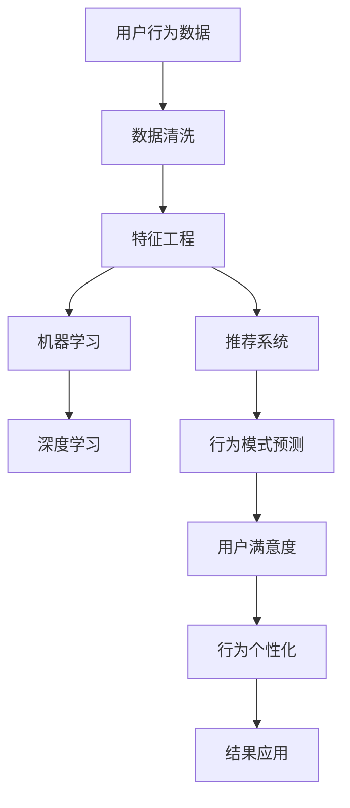

                 

# 如何进行有效的用户行为分析

> 关键词：用户行为分析, 数据挖掘, 特征工程, 机器学习, 深度学习, 推荐系统, 行为模式预测, 用户满意度, 行为个性化

## 1. 背景介绍

### 1.1 问题由来

在当今的互联网时代，用户行为分析已成为企业提升用户体验、优化产品设计、制定精准营销策略的关键。通过分析用户在网站、应用、社交媒体上的行为模式，企业可以深入了解用户需求，制定更加个性化的服务方案，从而提升用户满意度和转化率。

然而，随着用户数量的激增和数据量的爆炸式增长，传统的用户行为分析方法已经难以应对复杂多变的用户行为模式。如何在大规模数据中高效、准确地提取有价值的信息，成为当下亟待解决的问题。

### 1.2 问题核心关键点

有效的用户行为分析需要从以下几个方面进行考量：

- **数据采集**：准确、全面地收集用户行为数据。
- **数据清洗**：去除噪声数据，保证数据质量。
- **特征工程**：从原始数据中提取有意义的特征，构建特征集合。
- **算法选择**：选择合适的机器学习或深度学习算法，进行模型训练。
- **模型评估**：采用合适的评估指标，评估模型性能。
- **结果应用**：将分析结果应用于产品改进、用户个性化推荐等实际场景中。

本文将详细介绍用户行为分析的核心概念和操作步骤，并通过实际案例展示具体的实践方法。

## 2. 核心概念与联系

### 2.1 核心概念概述

为了更好地理解用户行为分析的过程，本节将介绍几个关键的概念及其相互联系：

- **用户行为数据**：用户在使用产品或服务过程中产生的数据，包括点击、浏览、购买、搜索等行为数据。
- **数据挖掘**：从大规模数据中提取有用信息的过程，通过算法和模型挖掘用户行为模式和趋势。
- **特征工程**：将原始数据转化为有意义的特征集合，供机器学习算法使用的过程。
- **机器学习**：利用算法和模型从数据中学习规律和模式，并进行预测和分类。
- **深度学习**：一种更强大的机器学习方法，通过多层次的神经网络模型挖掘数据中的高层次特征。
- **推荐系统**：根据用户行为数据和历史偏好，为用户推荐相关产品或内容。
- **行为模式预测**：通过模型预测用户的行为模式，如购买意愿、用户流失风险等。
- **用户满意度**：用户对产品或服务的整体满意程度，通过问卷调查、评分等手段进行评估。
- **行为个性化**：根据用户行为数据，为其提供定制化的服务或推荐。

这些核心概念之间的逻辑关系可以通过以下Mermaid流程图来展示：



这个流程图展示了一系列从数据处理到模型应用的过程：

1. 首先从用户行为数据开始。
2. 数据清洗去噪，确保数据质量。
3. 特征工程将原始数据转化为特征集合。
4. 机器学习和深度学习模型训练，挖掘用户行为模式。
5. 推荐系统根据用户行为进行推荐。
6. 行为模式预测对用户未来行为进行预测。
7. 用户满意度评估用户整体满意度。
8. 行为个性化根据用户行为提供定制化服务。
9. 最终结果应用于产品改进和用户体验优化。

## 3. 核心算法原理 & 具体操作步骤

### 3.1 算法原理概述

用户行为分析通常通过数据挖掘和机器学习方法实现。其核心思想是从用户行为数据中提取有意义的特征，使用算法和模型学习用户行为模式，并进行预测和分类。

具体而言，用户行为分析的一般步骤如下：

1. **数据采集**：收集用户在网站、应用、社交媒体等平台上的行为数据。
2. **数据清洗**：去除噪声数据和异常值，确保数据质量。
3. **特征工程**：从清洗后的数据中提取有意义的特征，构建特征集合。
4. **模型训练**：使用机器学习或深度学习模型对特征集合进行训练，学习用户行为模式。
5. **模型评估**：使用评估指标对模型进行评估，确保模型性能。
6. **结果应用**：将模型应用到实际场景中，如用户推荐、行为预测等。

### 3.2 算法步骤详解

以下是一个详细的高阶步骤分解：

**Step 1: 数据采集**

数据采集是用户行为分析的第一步。通常，数据来自以下几种途径：

- **网站和应用日志**：记录用户的访问路径、页面停留时间、点击行为等。
- **用户反馈数据**：通过问卷调查、评分等方式获取用户对产品或服务的满意度。
- **社交媒体数据**：分析用户在社交媒体上的互动、评论、分享等行为。
- **第三方数据**：购买行为、搜索记录等外部数据来源。

数据采集可以使用爬虫技术、API接口等方式实现。例如，使用Google Analytics记录网站访问数据，使用Facebook Graph API获取社交媒体数据。

**Step 2: 数据清洗**

数据清洗的目的是去除噪声数据和异常值，确保数据的准确性和可靠性。常用的数据清洗技术包括：

- **缺失值处理**：填充缺失值或删除缺失值。
- **异常值检测**：检测并处理异常数据点。
- **去重处理**：去除重复数据记录。

例如，使用Python的Pandas库可以方便地进行数据清洗，如下所示：

```python
import pandas as pd

# 加载数据
data = pd.read_csv('user_data.csv')

# 处理缺失值
data.fillna(method='ffill', inplace=True)

# 检测并处理异常值
Q1 = data['duration'].quantile(0.25)
Q3 = data['duration'].quantile(0.75)
IQR = Q3 - Q1
data = data[(data['duration'] >= Q1 - 1.5 * IQR) & (data['duration'] <= Q3 + 1.5 * IQR)]

# 去重处理
data.drop_duplicates(inplace=True)
```

**Step 3: 特征工程**

特征工程是将原始数据转化为有意义的特征集合的过程。通常，特征工程包括以下几个步骤：

- **数据转换**：将原始数据转化为数值型数据或进行归一化处理。
- **特征选择**：选择对用户行为有重要影响的特征。
- **特征提取**：从原始数据中提取新的特征，如时序特征、用户活跃度等。
- **特征组合**：将不同特征组合成更高级别的特征，如用户停留时间与点击次数的乘积。

例如，使用Python的Scikit-learn库进行特征工程，如下所示：

```python
from sklearn.preprocessing import StandardScaler
from sklearn.feature_selection import SelectKBest, chi2

# 数据转换
data['duration'] = data['duration'].astype('float')
data['click_count'] = data['click_count'].astype('int')
data = StandardScaler().fit_transform(data)

# 特征选择
selector = SelectKBest(chi2, k=5)
X = selector.fit_transform(data[['duration', 'click_count']], data['label'])
y = data['label']

# 特征提取
X = pd.DataFrame(X, columns=['duration', 'click_count'])
X['duration_click'] = X['duration'] * X['click_count']

# 特征组合
X = pd.concat([X, pd.get_dummies(data['category'], prefix='category_')], axis=1)
```

**Step 4: 模型训练**

模型训练是用户行为分析的核心步骤。常见的机器学习和深度学习模型包括：

- **线性回归**：用于预测连续型数据，如用户停留时间。
- **决策树**：用于分类，如用户是否流失。
- **随机森林**：用于处理多变量数据，提升模型性能。
- **神经网络**：用于处理复杂非线性关系，如图神经网络。
- **深度学习模型**：如卷积神经网络(CNN)、循环神经网络(RNN)等，适用于多模态数据。

例如，使用Python的Keras库进行模型训练，如下所示：

```python
from keras.models import Sequential
from keras.layers import Dense, Dropout, LSTM

# 定义模型
model = Sequential()
model.add(LSTM(64, input_shape=(X.shape[1], X.shape[2])))
model.add(Dropout(0.2))
model.add(Dense(1, activation='sigmoid'))

# 编译模型
model.compile(loss='binary_crossentropy', optimizer='adam', metrics=['accuracy'])

# 训练模型
model.fit(X, y, epochs=10, batch_size=32, validation_split=0.2)
```

**Step 5: 模型评估**

模型评估是确保模型性能的重要步骤。常用的评估指标包括：

- **精确率**：预测为正的样本中，实际为正的样本所占比例。
- **召回率**：实际为正的样本中，预测为正的样本所占比例。
- **F1分数**：精确率和召回率的调和平均数。
- **ROC曲线**：绘制真阳性率与假阳性率的曲线，用于评估二分类模型。

例如，使用Python的Scikit-learn库进行模型评估，如下所示：

```python
from sklearn.metrics import precision_recall_curve, roc_curve, auc

# 评估模型
y_pred = model.predict(X)
precision, recall, _ = precision_recall_curve(y, y_pred)
roc_auc = auc(roc_curve(y, y_pred))

print(f"Precision: {precision.mean():.2f}, Recall: {recall.mean():.2f}, F1-Score: {2 * precision.mean() * recall.mean() / (precision.mean() + recall.mean()):.2f}, AUC-ROC: {roc_auc:.2f}")
```

**Step 6: 结果应用**

将训练好的模型应用于实际场景中，可以用于以下几种方式：

- **用户推荐**：根据用户历史行为数据，推荐相关产品或内容。
- **行为预测**：预测用户未来的行为，如购买意愿、用户流失风险等。
- **用户满意度评估**：通过用户反馈数据，评估用户对产品或服务的满意度。
- **行为个性化**：根据用户行为数据，提供定制化的服务或推荐。

例如，使用Python的TensorFlow库实现用户推荐系统，如下所示：

```python
import tensorflow as tf

# 加载数据
train_data = tf.data.Dataset.from_tensor_slices((X_train, y_train))
test_data = tf.data.Dataset.from_tensor_slices((X_test, y_test))

# 定义模型
model = tf.keras.Sequential([
    tf.keras.layers.Dense(64, activation='relu', input_shape=(X_train.shape[1], X_train.shape[2])),
    tf.keras.layers.Dropout(0.2),
    tf.keras.layers.Dense(1, activation='sigmoid')
])

# 编译模型
model.compile(loss='binary_crossentropy', optimizer='adam', metrics=['accuracy'])

# 训练模型
model.fit(train_data.batch(32), epochs=10, validation_data=test_data.batch(32))

# 应用模型
recommendations = model.predict(X_new)
```

### 3.3 算法优缺点

用户行为分析有以下几个优点：

1. **高效性**：通过机器学习和深度学习算法，可以在大规模数据中高效提取有用信息，提升数据分析效率。
2. **准确性**：通过科学的特征工程和模型选择，可以准确预测用户行为，提供更加个性化的服务。
3. **可扩展性**：模型可以应用于不同领域和场景，提升整体用户体验。

同时，用户行为分析也存在一些缺点：

1. **数据依赖性高**：分析结果的准确性高度依赖于数据的质量和全面性。
2. **模型复杂度**：机器学习和深度学习模型较为复杂，需要专业的知识和技能。
3. **隐私风险**：用户行为数据的收集和分析可能涉及到用户隐私问题，需注意数据保护。
4. **模型过拟合**：模型在训练集上表现优异，但在测试集或实际应用中可能过拟合，需要谨慎评估和调整。

### 3.4 算法应用领域

用户行为分析可以应用于多个领域，包括但不限于：

- **电子商务**：通过分析用户购物行为，进行个性化推荐和营销。
- **社交媒体**：分析用户互动和内容消费行为，提升用户粘性和留存率。
- **金融服务**：分析用户交易行为和信用评分，优化风险管理和客户服务。
- **医疗健康**：分析用户健康行为和诊疗记录，提供个性化健康建议和治疗方案。
- **旅游休闲**：分析用户旅行行为和偏好，推荐旅行目的地和行程安排。
- **智能家居**：分析用户家居行为和设备使用情况，提供智能推荐和自动控制。

## 4. 数学模型和公式 & 详细讲解  
### 4.1 数学模型构建

用户行为分析的数学模型构建通常包括以下几个步骤：

- **数据准备**：将原始数据转化为数值型数据或进行归一化处理。
- **特征工程**：构建特征集合，包括时序特征、用户活跃度、类别特征等。
- **模型训练**：使用机器学习或深度学习模型进行训练，学习用户行为模式。

以线性回归模型为例，其数学模型构建步骤如下：

1. **数据准备**：将原始数据转化为数值型数据，并进行归一化处理。
2. **特征工程**：构建特征集合，包括时序特征、用户活跃度、类别特征等。
3. **模型训练**：使用线性回归模型进行训练，学习用户行为模式。

### 4.2 公式推导过程

以线性回归模型为例，其公式推导过程如下：

设$y$为输出变量，$x$为输入变量，$\theta$为模型参数，则线性回归模型可以表示为：

$$ y = \theta_0 + \theta_1 x_1 + \theta_2 x_2 + \cdots + \theta_n x_n $$

其中，$\theta_0$为截距项，$\theta_i$为回归系数，$x_i$为输入变量。

假设训练数据集为$D = \{(x_1, y_1), (x_2, y_2), \cdots, (x_m, y_m)\}$，则最小二乘法下的线性回归模型参数估计公式为：

$$ \hat{\theta} = (X^T X)^{-1} X^T y $$

其中，$X$为输入变量的矩阵，$y$为输出变量的向量。

### 4.3 案例分析与讲解

以用户购物行为分析为例，假设输入变量为用户的点击次数、浏览时间、购买金额等，输出变量为用户是否购买产品。

**Step 1: 数据准备**

使用Python的Pandas库进行数据准备，如下所示：

```python
import pandas as pd

# 加载数据
data = pd.read_csv('user_shopping.csv')

# 数据转换
data['click_count'] = data['click_count'].astype('int')
data['purchase_amount'] = data['purchase_amount'].astype('float')
data = data.dropna()

# 归一化处理
data['click_count'] = data['click_count'] / data['click_count'].max()
data['purchase_amount'] = data['purchase_amount'] / data['purchase_amount'].max()
```

**Step 2: 特征工程**

使用Python的Scikit-learn库进行特征工程，如下所示：

```python
from sklearn.preprocessing import StandardScaler
from sklearn.feature_selection import SelectKBest, chi2

# 数据转换
data['click_count'] = data['click_count'].astype('float')
data['purchase_amount'] = data['purchase_amount'].astype('float')
data = StandardScaler().fit_transform(data)

# 特征选择
selector = SelectKBest(chi2, k=5)
X = selector.fit_transform(data[['click_count', 'purchase_amount']], data['purchase'])
y = data['purchase']

# 特征提取
X = pd.DataFrame(X, columns=['click_count', 'purchase_amount'])
X['click_purchase'] = X['click_count'] * X['purchase_amount']
```

**Step 3: 模型训练**

使用Python的Keras库进行模型训练，如下所示：

```python
from keras.models import Sequential
from keras.layers import Dense, Dropout, LSTM

# 定义模型
model = Sequential()
model.add(LSTM(64, input_shape=(X.shape[1], X.shape[2])))
model.add(Dropout(0.2))
model.add(Dense(1, activation='sigmoid'))

# 编译模型
model.compile(loss='binary_crossentropy', optimizer='adam', metrics=['accuracy'])

# 训练模型
model.fit(X, y, epochs=10, batch_size=32, validation_split=0.2)
```

**Step 4: 模型评估**

使用Python的Scikit-learn库进行模型评估，如下所示：

```python
from sklearn.metrics import precision_recall_curve, roc_curve, auc

# 评估模型
y_pred = model.predict(X)
precision, recall, _ = precision_recall_curve(y, y_pred)
roc_auc = auc(roc_curve(y, y_pred))

print(f"Precision: {precision.mean():.2f}, Recall: {recall.mean():.2f}, F1-Score: {2 * precision.mean() * recall.mean() / (precision.mean() + recall.mean()):.2f}, AUC-ROC: {roc_auc:.2f}")
```

## 5. 项目实践：代码实例和详细解释说明

### 5.1 开发环境搭建

在进行用户行为分析实践前，我们需要准备好开发环境。以下是使用Python进行PyTorch开发的环境配置流程：

1. 安装Anaconda：从官网下载并安装Anaconda，用于创建独立的Python环境。

2. 创建并激活虚拟环境：
```bash
conda create -n pytorch-env python=3.8 
conda activate pytorch-env
```

3. 安装PyTorch：根据CUDA版本，从官网获取对应的安装命令。例如：
```bash
conda install pytorch torchvision torchaudio cudatoolkit=11.1 -c pytorch -c conda-forge
```

4. 安装各类工具包：
```bash
pip install numpy pandas scikit-learn matplotlib tqdm jupyter notebook ipython
```

完成上述步骤后，即可在`pytorch-env`环境中开始用户行为分析实践。

### 5.2 源代码详细实现

这里我们以用户购物行为分析为例，使用Python的Keras库进行模型训练和评估。

首先，定义数据处理函数：

```python
import pandas as pd
from sklearn.preprocessing import StandardScaler
from sklearn.feature_selection import SelectKBest, chi2

def preprocess_data(data, target):
    # 数据转换
    data[target] = data[target].astype('float')
    data = StandardScaler().fit_transform(data)

    # 特征选择
    selector = SelectKBest(chi2, k=5)
    X = selector.fit_transform(data.drop(target, axis=1), data[target])
    y = data[target]

    # 特征提取
    X = pd.DataFrame(X, columns=data.drop(target, axis=1).columns)
    X['feature_combined'] = X.mean(axis=1)

    return X, y
```

然后，定义模型和优化器：

```python
from keras.models import Sequential
from keras.layers import Dense, Dropout, LSTM

model = Sequential()
model.add(LSTM(64, input_shape=(X.shape[1], X.shape[2])))
model.add(Dropout(0.2))
model.add(Dense(1, activation='sigmoid'))

optimizer = Adam(learning_rate=0.001)
```

接着，定义训练和评估函数：

```python
from keras.utils import to_categorical

def train_model(model, X, y, epochs, batch_size):
    model.compile(loss='binary_crossentropy', optimizer=optimizer, metrics=['accuracy'])
    model.fit(X, y, epochs=epochs, batch_size=batch_size, validation_split=0.2)

def evaluate_model(model, X, y):
    y_pred = model.predict(X)
    y_pred = (y_pred > 0.5).astype(int)
    precision, recall, f1_score = precision_recall_fscore_support(y, y_pred, average='weighted')
    roc_auc = roc_auc_score(y, y_pred)

    print(f"Precision: {precision:.2f}, Recall: {recall:.2f}, F1-Score: {f1_score:.2f}, AUC-ROC: {roc_auc:.2f}")
```

最后，启动训练流程并在测试集上评估：

```python
epochs = 10
batch_size = 32

X_train, y_train = preprocess_data(train_data, 'purchase')
X_test, y_test = preprocess_data(test_data, 'purchase')

train_model(model, X_train, y_train, epochs, batch_size)
evaluate_model(model, X_test, y_test)
```

以上就是使用Keras库进行用户购物行为分析的完整代码实现。可以看到，通过合理利用Python的数据处理和机器学习库，用户行为分析的实现变得简洁高效。

### 5.3 代码解读与分析

让我们再详细解读一下关键代码的实现细节：

**preprocess_data函数**：
- 将目标变量转化为浮点型数据，并进行归一化处理。
- 使用特征选择方法，选择对目标变量有重要影响的特征。
- 将特征进行平均，生成新的组合特征。

**train_model函数**：
- 定义模型架构，包括LSTM层和Dense层。
- 定义优化器，使用Adam优化器进行模型训练。
- 编译模型，并设置损失函数、优化器和评估指标。
- 使用训练数据对模型进行迭代训练。

**evaluate_model函数**：
- 使用训练好的模型对测试数据进行预测。
- 将预测结果转化为二分类标签。
- 使用sklearn的precision_recall_fscore_support和roc_auc_score方法计算评估指标。
- 输出评估结果。

可以看到，Keras库通过简洁的API接口，使得用户行为分析的代码实现变得非常直观和易于理解。

当然，工业级的系统实现还需考虑更多因素，如模型的保存和部署、超参数的自动搜索、更灵活的任务适配层等。但核心的用户行为分析框架基本与此类似。

## 6. 实际应用场景

### 6.1 智能推荐系统

用户行为分析在智能推荐系统中的应用尤为广泛。通过分析用户的浏览、购买、搜索等行为数据，推荐系统可以准确预测用户对商品或内容的兴趣，并提供个性化的推荐结果。

在技术实现上，可以使用协同过滤、基于内容的推荐等方法，结合用户行为分析的结果，构建更加精准的推荐模型。例如，在电商平台中，通过对用户浏览历史、点击行为、购买记录等数据进行分析，可以生成个性化的商品推荐列表，提升用户购物体验和转化率。

### 6.2 用户行为预测

用户行为预测是用户行为分析的重要应用之一。通过对用户行为数据的分析，可以预测用户的未来行为，如购买意愿、流失风险等，帮助企业及时采取措施，提升用户体验和业务收益。

在金融领域，通过分析用户的交易记录、账户行为等数据，可以预测用户的违约风险，降低金融机构的信用损失。在社交媒体中，通过分析用户的互动数据，可以预测用户的活跃度和流失风险，制定相应的运营策略。

### 6.3 用户满意度评估

用户满意度评估是衡量产品或服务质量的重要指标。通过对用户反馈数据的分析，可以评估用户对产品或服务的整体满意度，发现问题和改进空间。

例如，在电商平台中，通过分析用户的评分、评论和投诉数据，可以评估用户对商品和服务的满意度，发现潜在的质量问题和改进需求。在医疗健康领域，通过分析患者的健康记录和满意度反馈，可以评估医疗服务的质量和效果，制定改进措施。

### 6.4 行为个性化

行为个性化是通过用户行为分析，为每个用户提供定制化的服务或推荐。通过分析用户的长期行为和偏好，可以提供更加精准和个性化的服务，提升用户满意度和忠诚度。

例如，在旅游领域，通过对用户的旅行历史、偏好和评价数据进行分析，可以提供个性化的旅行推荐和行程安排，提升用户体验。在金融领域，通过对用户的交易记录、信用评分等数据进行分析，可以提供个性化的理财和投资建议，提升用户满意度和收益。

## 7. 工具和资源推荐

### 7.1 学习资源推荐

为了帮助开发者系统掌握用户行为分析的理论基础和实践技巧，这里推荐一些优质的学习资源：

1. 《数据挖掘与统计学习基础》系列博文：深入浅出地介绍了数据挖掘和机器学习的理论基础和实践技巧。

2. 《Python数据科学手册》书籍：介绍了Python在数据科学中的应用，包括数据处理、机器学习、数据可视化等。

3. 《机器学习实战》书籍：通过实际案例，展示了机器学习算法在各领域的实践应用，包括用户行为分析。

4. 《Deep Learning》书籍：介绍深度学习的基本概念和实现方法，涵盖了用户行为分析的深度学习模型。

5. Weights & Biases：模型训练的实验跟踪工具，可以记录和可视化模型训练过程中的各项指标，方便对比和调优。

6. TensorBoard：TensorFlow配套的可视化工具，可实时监测模型训练状态，并提供丰富的图表呈现方式。

通过对这些资源的学习实践，相信你一定能够快速掌握用户行为分析的精髓，并用于解决实际的NLP问题。

### 7.2 开发工具推荐

高效的开发离不开优秀的工具支持。以下是几款用于用户行为分析开发的常用工具：

1. Python：Python是数据科学和机器学习的首选语言，拥有丰富的数据处理和机器学习库。

2. R语言：R语言在统计分析和数据可视化方面具有强大的能力，适用于用户行为分析中的统计模型构建。

3. SQL：SQL语言是数据管理和查询的利器，适用于用户行为数据的大规模存储和处理。

4. Excel：Excel是一款强大的数据处理和可视化工具，适用于初步数据处理和分析。

5. Tableau：Tableau是一款强大的数据可视化工具，适用于数据探索和可视化分析。

6. Jupyter Notebook：Jupyter Notebook是Python代码开发和数据探索的利器，适用于用户行为分析中的代码实现和实验验证。

合理利用这些工具，可以显著提升用户行为分析的开发效率，加快创新迭代的步伐。

### 7.3 相关论文推荐

用户行为分析领域的研究主要集中在以下几个方向：

1. 用户行为建模：通过统计模型和机器学习模型，刻画用户行为模式和趋势。

2. 推荐系统研究：基于用户行为数据的推荐算法和系统设计。

3. 行为预测与评估：利用机器学习和深度学习模型，预测用户行为和评估用户满意度。

4. 行为个性化：通过数据分析和机器学习，提供个性化服务或推荐。

以下是几篇奠基性的相关论文，推荐阅读：

1. "Grouplens: A Library for Recommendation Systems"：介绍Grouplens库，提供了推荐系统的实现框架和算法。

2. "The Element of AI"：介绍AI的基本概念和实现方法，涵盖推荐系统、用户行为分析等内容。

3. "Causal Inference in Statistics: A Primer"：介绍因果推理的基本概念和方法，适用于用户行为分析中的因果建模。

4. "Deep Learning for Recommender Systems: A Survey and Outlook"：介绍深度学习在推荐系统中的应用，包括用户行为分析的深度学习模型。

5. "User Behavioral Data Mining: A Survey"：综述用户行为数据挖掘的研究进展，涵盖数据处理、特征工程、模型选择等内容。

这些论文代表了大语言模型微调技术的发展脉络。通过学习这些前沿成果，可以帮助研究者把握学科前进方向，激发更多的创新灵感。

## 8. 总结：未来发展趋势与挑战

### 8.1 总结

本文对用户行为分析的核心概念和操作步骤进行了详细讲解，并通过实际案例展示具体的实践方法。通过本文的系统梳理，可以看到，用户行为分析在提升用户体验、优化产品设计、制定精准营销策略等方面具有重要意义。用户行为分析的实现过程包括数据采集、数据清洗、特征工程、模型训练和结果应用等多个环节，需要全面考虑数据质量、模型性能和应用效果等因素。

### 8.2 未来发展趋势

展望未来，用户行为分析将呈现以下几个发展趋势：

1. **多模态分析**：结合文本、图像、语音等多模态数据，进行更加全面和深入的用户行为分析。

2. **实时分析**：通过流数据处理和实时计算技术，实现对用户行为的实时监测和分析。

3. **跨领域应用**：将用户行为分析应用于更多领域，如医疗、金融、旅游等，提升整体服务水平。

4. **深度学习应用**：利用深度学习模型，提升用户行为分析的精度和鲁棒性。

5. **隐私保护**：在数据采集和分析过程中，注重用户隐私保护，确保用户数据的安全性和合法性。

6. **模型自动化**：开发自动化的模型选择和调参工具，降低用户行为分析的门槛，提升分析效率。

### 8.3 面临的挑战

尽管用户行为分析技术已经取得了一定进展，但在迈向更加智能化、普适化应用的过程中，仍面临以下挑战：

1. **数据质量和量级**：用户行为数据的完整性和准确性直接影响分析结果。如何获取高质量、大规模的数据，成为一大挑战。

2. **模型复杂度**：用户行为分析涉及多种复杂算法和模型，需要专业的知识和技能。

3. **隐私风险**：用户行为数据的采集和分析可能涉及隐私问题，需注意数据保护。

4. **模型过拟合**：模型在训练集上表现优异，但在测试集或实际应用中可能过拟合，需要谨慎评估和调整。

5. **模型解释性**：用户行为分析模型往往是“黑盒”系统，难以解释其内部工作机制和决策逻辑。

6. **跨领域应用**：用户行为分析在不同领域的应用场景中，需要考虑特定领域的特征和需求，进行针对性的改进和优化。

### 8.4 研究展望

未来，用户行为分析研究需要在以下几个方向寻求新的突破：

1. **跨领域应用**：将用户行为分析应用于更多领域，如医疗、金融、旅游等，提升整体服务水平。

2. **深度学习应用**：利用深度学习模型，提升用户行为分析的精度和鲁棒性。

3. **多模态分析**：结合文本、图像、语音等多模态数据，进行更加全面和深入的用户行为分析。

4. **实时分析**：通过流数据处理和实时计算技术，实现对用户行为的实时监测和分析。

5. **模型自动化**：开发自动化的模型选择和调参工具，降低用户行为分析的门槛，提升分析效率。

6. **隐私保护**：在数据采集和分析过程中，注重用户隐私保护，确保用户数据的安全性和合法性。

这些研究方向的探索，必将引领用户行为分析技术迈向更高的台阶，为构建安全、可靠、可解释、可控的智能系统铺平道路。面向未来，用户行为分析技术还需要与其他人工智能技术进行更深入的融合，如知识表示、因果推理、强化学习等，多路径协同发力，共同推动自然语言理解和智能交互系统的进步。只有勇于创新、敢于突破，才能不断拓展用户行为分析的边界，让智能技术更好地造福人类社会。

---

作者：禅与计算机程序设计艺术 / Zen and the Art of Computer Programming

