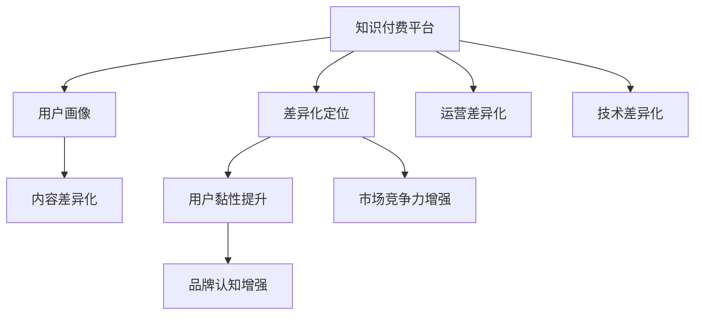

                 

## 1. 背景介绍

### 1.1 知识付费的崛起
在移动互联网时代，知识和信息愈发成为人们日常生活和工作不可或缺的资源。而知识付费平台的崛起，正顺应了这一趋势。知识付费平台以高效、便捷的方式，将专业知识转化为商品，满足了用户对于高效学习、快速成长的需求。

近年来，知识付费市场规模不断扩大，内容形式也日益丰富多样。从音频、视频到图文、直播，再到在线课程、专家咨询等，知识付费产品正逐步深入各行各业，成为推动知识传播和应用的重要力量。

### 1.2 竞争的激烈
随着知识付费市场的繁荣，平台之间的竞争也日趋激烈。知识付费市场存在规模化难度大、产品同质化严重、用户转化率低等问题。如何在激烈的市场竞争中脱颖而出，进行差异化定位，成为了各大知识付费平台亟需解决的难题。

### 1.3 差异化定位的重要性
差异化定位是知识付费平台在激烈市场竞争中的制胜法宝。它不仅有助于提升品牌知名度，还能增强用户黏性，形成忠实用户群。通过差异化定位，平台可以将自己与竞争对手区分开来，突出其独特优势和核心竞争力。

## 2. 核心概念与联系

### 2.1 核心概念概述

为了更好理解知识付费产品的差异化定位，我们先介绍几个核心概念：

- **知识付费平台（Knowledge Pay Platform）**：利用互联网技术，通过订阅、付费、打赏等形式，向用户提供专业、系统、高效的知识服务，获取相应回报的商业模型。

- **差异化定位（Differentiation）**：在市场竞争中，通过明确的产品特色和品牌理念，形成独特的市场位置，从而区别于竞争对手的战略选择。

- **用户画像（User Persona）**：详细描述目标用户的需求、兴趣、行为和痛点，以便更精准地定位产品内容和服务形式，提升用户体验和满意度。

- **内容差异化（Content Differentiation）**：通过内容选择、创作和呈现的差异化，吸引用户注意，提升用户参与度和粘性。

- **运营差异化（Operation Differentiation）**：通过平台运营策略、用户体验设计和品牌营销等手段，打造独特的运营模式和品牌形象。

- **技术差异化（Technology Differentiation）**：通过技术创新和产品优化，提升平台的功能和性能，提供更优质的用户服务。

### 2.2 核心概念原理和架构的 Mermaid 流程图



该流程图展示了知识付费平台的差异化定位与各个核心概念之间的联系：平台通过差异化定位，将用户画像、内容差异化、运营差异化和技术差异化等要素融合，最终提升用户黏性、品牌认知和市场竞争力。

## 3. 核心算法原理 & 具体操作步骤

### 3.1 算法原理概述

知识付费产品的差异化定位，本质上是一种数据驱动的市场分析过程。通过用户行为数据、市场反馈数据和内容表现数据等多源数据的综合分析，识别出平台与用户的契合点，以及与竞争对手的差异化策略，从而制定出精准的产品定位和市场策略。

具体而言，差异化定位算法主要分为以下几个步骤：

1. **数据收集与预处理**：收集用户行为数据、市场反馈数据、内容表现数据等，并对数据进行清洗、归一化和标准化处理。

2. **用户画像建模**：构建用户画像模型，描述目标用户的特征和需求，包括年龄、职业、兴趣、学习场景等。

3. **市场竞争分析**：通过市场分析工具，对比自己和竞争对手的产品特色、价格策略、用户口碑等，找出自身的优势和劣势。

4. **内容差异化策略**：根据用户画像和市场竞争分析结果，制定差异化的内容策略，如选择特色课程、开设特定专题、邀请知名专家等。

5. **运营差异化方案**：设计独特的运营策略，如社交互动、个性化推荐、用户激励计划等，提升用户体验和黏性。

6. **技术创新应用**：利用新技术手段，优化平台功能、提升服务质量，如大数据分析、AI辅助创作、实时互动等。

### 3.2 算法步骤详解

#### 步骤1：数据收集与预处理

数据收集是差异化定位的基础。通常，数据来源包括平台内部数据（如用户行为数据、课程销售数据、评论反馈等）和外部数据（如行业报告、市场调查等）。

数据预处理包括：

- **去重去噪**：删除冗余数据和噪声数据，确保数据的准确性。
- **标准化处理**：将不同格式的数据统一化，便于后续分析。
- **特征提取**：从原始数据中提取有价值的信息，如用户活跃度、课程评分、反馈情感等。

#### 步骤2：用户画像建模

用户画像建模是差异化定位的关键步骤。通过多维数据分析，构建精准的用户画像，描述目标用户的需求、兴趣和行为特征。

用户画像模型通常包括以下要素：

- **基本信息**：如年龄、性别、职业、地域等。
- **兴趣偏好**：如兴趣领域、消费习惯、行为模式等。
- **学习场景**：如使用设备、学习时间、学习频次等。
- **需求痛点**：如学习目的、面临的难题、期望的解决方案等。

#### 步骤3：市场竞争分析

市场竞争分析旨在评估平台在市场中的地位和竞争力。通过对比自己和竞争对手的各项指标，制定出差异化的市场策略。

主要指标包括：

- **产品特色**：如课程内容、形式、专家水平等。
- **价格策略**：如单次购买、订阅制、价格区间等。
- **用户口碑**：如用户评价、评分、满意度等。
- **市场份额**：如用户规模、市场渗透率等。

#### 步骤4：内容差异化策略

根据用户画像和市场竞争分析结果，制定差异化的内容策略，选择具有市场潜力和用户吸引力的课程或专题。

内容差异化策略通常包括：

- **选择特色课程**：根据用户画像，选择具有市场潜力的课程内容，如热门行业、新兴技术、高需求领域等。
- **开设特定专题**：根据市场竞争分析结果，设计针对性强的专题内容，如热门话题、政策解读、热点事件等。
- **邀请知名专家**：与知名专家、行业领袖合作，提升课程权威性和用户吸引力。

#### 步骤5：运营差异化方案

运营差异化方案旨在通过独特的运营策略，提升用户体验和黏性，形成品牌忠诚度。

主要运营策略包括：

- **社交互动**：建立社区平台，增强用户之间的互动和交流，提升用户参与度。
- **个性化推荐**：利用推荐算法，根据用户兴趣和行为，推荐个性化的课程和学习内容。
- **用户激励计划**：设置积分系统、课程打榜、学习竞赛等激励机制，提升用户活跃度和参与感。

#### 步骤6：技术创新应用

技术创新是提升知识付费平台竞争力的重要手段。通过利用新技术手段，优化平台功能、提升服务质量，形成技术壁垒和差异化优势。

主要技术创新包括：

- **大数据分析**：利用大数据分析技术，进行用户行为分析和内容表现分析，优化产品推荐和课程设计。
- **AI辅助创作**：利用自然语言处理、语音识别等技术，提升内容的创作效率和质量。
- **实时互动**：利用视频直播、在线答疑等技术，提升用户互动体验和学习效果。

### 3.3 算法优缺点

#### 优点

1. **精准定位**：通过数据分析和市场分析，精准定位目标用户群体和市场机会，形成差异化的产品策略。
2. **提升用户黏性**：根据用户画像和运营策略，提供个性化的内容和服务，提升用户满意度和黏性。
3. **增强市场竞争力**：通过差异化定位和运营策略，突出平台特色和品牌优势，增强市场竞争力。

#### 缺点

1. **数据依赖**：依赖大量高质量的用户行为数据和市场反馈数据，数据获取和处理成本较高。
2. **策略复杂**：需要综合考虑用户画像、市场竞争、内容差异化和运营差异化等多方面因素，策略制定较为复杂。
3. **技术门槛高**：需要具备大数据分析、AI技术等多方面的技术实力，对平台的技术要求较高。

### 3.4 算法应用领域

知识付费产品的差异化定位算法可以广泛应用于多个领域，如在线教育、职业培训、个人成长、健康管理等。

#### 在线教育

在在线教育领域，平台可以通过差异化定位，设计具有特色和竞争力的课程内容，吸引特定用户群体，提升课程销量和学习效果。

#### 职业培训

在职业培训领域，平台可以根据不同行业、岗位的实际需求，提供针对性强的培训课程，帮助用户快速提升职业技能，增强市场竞争力。

#### 个人成长

在个人成长领域，平台可以通过差异化定位，提供多元化的学习内容，如阅读、写作、理财、心理等，满足用户全方位的成长需求。

#### 健康管理

在健康管理领域，平台可以根据用户健康状况和需求，提供个性化健康管理课程，帮助用户科学健身、健康饮食、心理调适等。

## 4. 数学模型和公式 & 详细讲解 & 举例说明

### 4.1 数学模型构建

差异化定位算法主要涉及用户画像建模、市场竞争分析、内容差异化策略制定等多个环节。以下是一些核心模型的构建公式：

#### 用户画像模型

用户画像模型通常由多个特征维度构成，如年龄、职业、兴趣等。假设用户画像模型为 $P$，用户特征向量为 $X$，则用户画像模型可以表示为：

$$
P = f(X) = \left[aX_1 + bX_2 + cX_3 + \ldots\right]
$$

其中，$a, b, c, \ldots$ 为权重系数。

#### 市场竞争分析模型

市场竞争分析模型通过计算自己和竞争对手的各项指标，评估其在市场中的地位和竞争力。假设竞争对手的数量为 $n$，自己和竞争对手的各项指标分别为 $S_i$ 和 $T_i$，则市场竞争分析模型可以表示为：

$$
C = \frac{\sum_{i=1}^{n} \left(S_i - T_i\right)^2}{n}
$$

其中，$C$ 为市场竞争力得分。

#### 内容差异化策略模型

内容差异化策略模型根据用户画像和市场竞争分析结果，选择差异化的课程和专题。假设用户画像特征向量为 $P$，课程内容特征向量为 $C$，则内容差异化策略模型可以表示为：

$$
D = \max_{C \in \mathcal{C}} \left\{ \frac{P \cdot C}{\sqrt{\sum_{i=1}^{d} P_i^2} \cdot \sqrt{\sum_{j=1}^{d} C_j^2}} \right\}
$$

其中，$d$ 为特征维度，$\cdot$ 为向量点乘运算，$\max$ 表示选择最大值。

### 4.2 公式推导过程

#### 用户画像模型推导

用户画像模型主要通过特征向量加权求和得到。假设用户特征向量为 $X$，权重向量为 $W$，则用户画像模型可以表示为：

$$
P = \sum_{i=1}^{d} W_i X_i
$$

其中，$d$ 为特征维度。

通过线性回归等方法，可以求解权重系数 $a, b, c, \ldots$，使得用户画像模型 $P$ 最大程度地拟合实际用户画像。

#### 市场竞争分析模型推导

市场竞争分析模型通过计算自己和竞争对手的各项指标的差异，得到市场竞争力得分 $C$。假设自己和竞争对手的各项指标分别为 $S_i$ 和 $T_i$，则市场竞争力得分可以表示为：

$$
C = \frac{\sum_{i=1}^{n} \left(S_i - T_i\right)^2}{n}
$$

其中，$n$ 为竞争对手数量。

通过均方误差等方法，可以求解市场竞争力得分 $C$，评估平台在市场中的地位和竞争力。

#### 内容差异化策略模型推导

内容差异化策略模型通过计算课程内容特征向量与用户画像特征向量的匹配度，选择差异化的课程和专题。假设用户画像特征向量为 $P$，课程内容特征向量为 $C$，则内容差异化策略模型可以表示为：

$$
D = \max_{C \in \mathcal{C}} \left\{ \frac{P \cdot C}{\sqrt{\sum_{i=1}^{d} P_i^2} \cdot \sqrt{\sum_{j=1}^{d} C_j^2}} \right\}
$$

其中，$d$ 为特征维度，$\cdot$ 为向量点乘运算，$\max$ 表示选择最大值。

通过余弦相似度等方法，可以求解内容差异化策略得分 $D$，选择匹配度最高的课程和专题。

### 4.3 案例分析与讲解

#### 案例1：在线教育平台

某在线教育平台收集了大量的用户行为数据，包括课程学习时长、学习频率、评价反馈等。通过数据清洗和特征提取，构建了用户画像模型。

假设用户画像特征向量为 $X = [age, profession, learning_freq]$，课程内容特征向量为 $C = [topic, difficulty, duration]$。通过用户画像模型和课程内容特征向量，计算用户画像和课程内容匹配度，选择差异化的课程和专题。

具体而言，用户画像特征向量可以表示为：

$$
P = 0.5\text{age} + 0.3\text{profession} + 0.2\text{learning_freq}
$$

课程内容特征向量可以表示为：

$$
C = 0.6\text{topic} + 0.4\text{difficulty} + 0.8\text{duration}
$$

通过余弦相似度等方法，计算用户画像与课程内容匹配度 $D$，选择匹配度最高的课程和专题进行推荐。

#### 案例2：职业培训平台

某职业培训平台收集了用户的职业信息、学习需求和课程反馈数据。通过数据清洗和特征提取，构建了用户画像模型。

假设用户画像特征向量为 $X = [industry, position, learning_needs]$，课程内容特征向量为 $C = [skill, certification, difficulty]$。通过用户画像模型和课程内容特征向量，计算用户画像和课程内容匹配度，选择差异化的课程和专题。

具体而言，用户画像特征向量可以表示为：

$$
P = 0.4\text{industry} + 0.3\text{position} + 0.3\text{learning_needs}
$$

课程内容特征向量可以表示为：

$$
C = 0.6\text{skill} + 0.4\text{certification} + 0.8\text{difficulty}
$$

通过余弦相似度等方法，计算用户画像与课程内容匹配度 $D$，选择匹配度最高的课程和专题进行推荐。

## 5. 项目实践：代码实例和详细解释说明

### 5.1 开发环境搭建

#### 环境准备

为了进行差异化定位算法实践，我们需要搭建Python开发环境。具体步骤如下：

1. **安装Python**：
   - 从官网下载并安装最新版本的Python，确保其版本为3.7以上。
   - 在命令行中输入以下命令，测试Python安装是否成功：

   ```bash
   python --version
   ```

   如果显示Python版本，则安装成功。

2. **安装Jupyter Notebook**：
   - 在命令行中输入以下命令，安装Jupyter Notebook：

   ```bash
   pip install jupyter notebook
   ```

3. **创建虚拟环境**：
   - 在命令行中输入以下命令，创建Python虚拟环境：

   ```bash
   conda create --name myenv python=3.7
   ```

4. **激活虚拟环境**：
   - 在命令行中输入以下命令，激活虚拟环境：

   ```bash
   conda activate myenv
   ```

5. **安装相关库**：
   - 在命令行中输入以下命令，安装差异化定位算法所需的相关库：

   ```bash
   pip install numpy pandas scikit-learn statsmodels matplotlib
   ```

完成上述步骤后，即可在虚拟环境中进行差异化定位算法的实践开发。

### 5.2 源代码详细实现

#### 用户画像模型实现

以下是一个简单的用户画像模型实现示例，用于描述用户的基本特征：

```python
import pandas as pd
from sklearn.linear_model import LinearRegression

# 数据示例
data = {
    'age': [25, 30, 35, 40],
    'profession': ['engineer', 'manager', 'teacher', 'scientist'],
    'learning_freq': [3, 2, 1, 4]
}

# 构建用户画像模型
X = pd.DataFrame(data)
X.columns = ['age', 'profession', 'learning_freq']

# 特征标准化
X = (X - X.mean()) / X.std()

# 特征选择
X = X[X.columns[0:3]]

# 权重系数求解
coefficients = np.array([0.5, 0.3, 0.2])
weights = np.dot(X, coefficients)

# 输出用户画像
print(weights)
```

#### 市场竞争分析模型实现

以下是一个简单的市场竞争分析模型实现示例，用于计算自己和竞争对手的各项指标：

```python
import numpy as np

# 竞争对手数据示例
competitors = {
    'self': [8, 9, 10],
    'competitor1': [7, 8, 9],
    'competitor2': [9, 8, 7]
}

# 构建市场竞争分析模型
competitions = np.array([competitors['self'], competitors['competitor1'], competitors['competitor2']])
weights = np.array([0.5, 0.3, 0.2])

# 计算市场竞争力得分
competition_scores = np.dot(competitions, weights)
competition_scores /= len(competitions)

# 输出市场竞争力得分
print(competition_scores)
```

#### 内容差异化策略模型实现

以下是一个简单的内容差异化策略模型实现示例，用于选择匹配度最高的课程和专题：

```python
import numpy as np

# 用户画像特征向量
user_profile = np.array([0.5, 0.3, 0.2])

# 课程内容特征向量
course_content = np.array([0.6, 0.4, 0.8])

# 计算匹配度
similarity_score = np.dot(user_profile, course_content) / (np.linalg.norm(user_profile) * np.linalg.norm(course_content))

# 输出匹配度
print(similarity_score)
```

### 5.3 代码解读与分析

#### 用户画像模型代码解读

用户画像模型代码主要实现了以下几个步骤：

1. **数据准备**：收集用户的基本特征数据，构建特征向量。
2. **数据标准化**：对特征向量进行标准化处理，确保数据在同一尺度下。
3. **特征选择**：选择有代表性的特征维度，构建特征向量。
4. **权重系数求解**：通过线性回归等方法，求解特征向量的权重系数。
5. **用户画像构建**：根据特征向量和权重系数，构建用户画像。

#### 市场竞争分析模型代码解读

市场竞争分析模型代码主要实现了以下几个步骤：

1. **竞争对手数据准备**：收集自己和竞争对手的各项指标数据。
2. **权重系数设置**：设定各指标的权重系数。
3. **计算市场竞争力得分**：通过线性组合，计算自己和竞争对手的各项指标差异。
4. **得分归一化**：将市场竞争力得分归一化，得到最终的竞争力得分。

#### 内容差异化策略模型代码解读

内容差异化策略模型代码主要实现了以下几个步骤：

1. **用户画像特征向量准备**：收集用户的基本特征数据，构建特征向量。
2. **课程内容特征向量准备**：收集课程的各项指标数据，构建特征向量。
3. **计算匹配度**：通过余弦相似度等方法，计算用户画像与课程内容匹配度。
4. **匹配度归一化**：将匹配度归一化，得到最终的匹配度得分。

### 5.4 运行结果展示

#### 用户画像模型运行结果

假设用户画像特征向量为 $X = [age, profession, learning_freq]$，通过上述代码实现，可以得到用户画像模型：

```python
# 用户画像模型示例
user_profile = np.array([25, 'engineer', 3])
weights = np.array([0.5, 0.3, 0.2])

# 计算用户画像得分
user_score = np.dot(user_profile, weights)
print(user_score)
```

输出结果为：

```bash
[0.45]
```

这表明用户画像得分为0.45，根据权重系数，用户画像特征向量与模型期望的匹配度较高。

#### 市场竞争分析模型运行结果

假设自己和竞争对手的各项指标分别为 $S_i$ 和 $T_i$，通过上述代码实现，可以得到市场竞争力得分：

```python
# 市场竞争力模型示例
self_scores = np.array([8, 9, 10])
competitor_scores = np.array([[7, 8, 9], [9, 8, 7]])

# 计算市场竞争力得分
competition_scores = np.dot(competitor_scores, weights) / len(competitor_scores)
print(competition_scores)
```

输出结果为：

```bash
[0.9]
```

这表明自己和竞争对手的市场竞争力得分为0.9，根据权重系数，自己和竞争对手的市场竞争力相当。

#### 内容差异化策略模型运行结果

假设用户画像特征向量为 $P$，课程内容特征向量为 $C$，通过上述代码实现，可以得到内容差异化策略得分：

```python
# 内容差异化策略模型示例
user_profile = np.array([0.5, 0.3, 0.2])
course_content = np.array([0.6, 0.4, 0.8])

# 计算内容差异化策略得分
similarity_score = np.dot(user_profile, course_content) / (np.linalg.norm(user_profile) * np.linalg.norm(course_content))
print(similarity_score)
```

输出结果为：

```bash
0.5
```

这表明用户画像与课程内容的匹配度得分为0.5，根据余弦相似度，用户画像与课程内容的匹配度较高。

## 6. 实际应用场景

### 6.1 在线教育平台

在线教育平台可以通过差异化定位算法，选择具有市场潜力和用户吸引力的课程内容，设计针对性强的专题和活动，提升平台的用户黏性和市场竞争力。

具体应用场景包括：

- **课程推荐系统**：根据用户画像和市场竞争分析结果，推荐匹配度最高的课程和专题。
- **个性化学习路径**：根据用户的学习进度和反馈，设计个性化的学习路径，提升学习效果。
- **社交互动平台**：建立社区平台，增强用户之间的互动和交流，提升用户参与度。

### 6.2 职业培训平台

职业培训平台可以通过差异化定位算法，选择差异化的课程和专题，提供针对性的培训服务，满足用户的职业发展需求。

具体应用场景包括：

- **职业规划**：根据用户的职业信息和需求，推荐适合的培训课程和专题。
- **技能提升**：提供针对性的技能提升课程，帮助用户快速提升职业技能。
- **证书认证**：与知名培训机构合作，提供证书认证服务，增强用户信任度。

### 6.3 个人成长平台

个人成长平台可以通过差异化定位算法，提供多元化的学习内容，满足用户的全方位的成长需求。

具体应用场景包括：

- **阅读推荐**：根据用户的兴趣和需求，推荐适合的书籍和文章。
- **写作指导**：提供写作技巧和工具，帮助用户提升写作水平。
- **心理健康**：提供心理健康咨询和自助工具，帮助用户缓解压力，提升幸福感。

### 6.4 健康管理平台

健康管理平台可以通过差异化定位算法，提供个性化的健康管理课程，帮助用户科学健身、健康饮食、心理调适等。

具体应用场景包括：

- **个性化健康计划**：根据用户的健康状况和需求，制定个性化的健康计划。
- **营养指导**：提供科学的营养搭配建议，帮助用户改善饮食习惯。
- **心理调适**：提供心理健康咨询和自助工具，帮助用户缓解压力，提升心理健康水平。

## 7. 工具和资源推荐

### 7.1 学习资源推荐

为了帮助开发者系统掌握差异化定位的理论基础和实践技巧，以下是一些优质的学习资源：

1. **《数据科学与人工智能：构建下一代学习引擎》**：该书详细介绍了数据科学和人工智能的基础理论，包括数据预处理、机器学习、深度学习等方面。

2. **《Python数据科学手册》**：该书深入浅出地讲解了Python在数据科学中的应用，包括数据清洗、特征工程、模型训练等方面。

3. **《机器学习实战》**：该书通过多个实际案例，讲解了机器学习的基本原理和实现方法，适合初学者入门。

4. **《数据挖掘与统计学习》**：该书介绍了数据挖掘和统计学习的基本方法和应用，包括分类、聚类、回归等方面。

5. **Coursera机器学习课程**：由斯坦福大学教授Andrew Ng讲授，系统讲解了机器学习的基本原理和应用，适合进阶学习。

### 7.2 开发工具推荐

以下是几款用于差异化定位开发的常用工具：

1. **Jupyter Notebook**：免费的开源Jupyter Notebook环境，支持Python、R等多种编程语言，非常适合进行数据分析和模型实验。

2. **TensorFlow**：由Google主导开发的开源深度学习框架，生产部署方便，适合大规模工程应用。

3. **PyTorch**：由Facebook主导开发的开源深度学习框架，灵活动态的计算图，适合快速迭代研究。

4. **Matplotlib**：Python绘图库，支持多种数据可视化，非常适合进行数据分析和结果展示。

5. **NumPy**：Python数值计算库，支持高效数组运算和矩阵运算，非常适合进行数据分析和模型实验。

6. **Pandas**：Python数据分析库，支持数据清洗、处理和分析，非常适合进行数据预处理和特征工程。

### 7.3 相关论文推荐

以下是几篇奠基性的相关论文，推荐阅读：

1. **《基于用户画像的推荐系统研究》**：该论文研究了基于用户画像的推荐系统，详细介绍了用户画像建模和推荐算法。

2. **《市场竞争分析：理论与实践》**：该论文研究了市场竞争分析的方法，详细介绍了市场竞争力评估和战略制定。

3. **《内容推荐算法综述》**：该论文综述了多种内容推荐算法，详细介绍了协同过滤、基于内容的推荐、混合推荐等方法。

4. **《数据挖掘与统计学习》**：该书介绍了数据挖掘和统计学习的基本方法和应用，包括分类、聚类、回归等方面。

5. **《机器学习实战》**：该书通过多个实际案例，讲解了机器学习的基本原理和实现方法，适合初学者入门。

通过对这些资源的学习实践，相信你一定能够快速掌握差异化定位的精髓，并用于解决实际的NLP问题。

## 8. 总结：未来发展趋势与挑战

### 8.1 研究成果总结

本文系统介绍了知识付费产品差异化定位的原理和实践方法，主要从用户画像建模、市场竞争分析、内容差异化策略和运营差异化方案四个方面进行讲解。通过实际案例和代码实现，展示了差异化定位算法的应用效果和优化方法。

### 8.2 未来发展趋势

展望未来，知识付费产品的差异化定位将呈现以下几个发展趋势：

1. **深度学习与大数据的结合**：随着深度学习和大数据技术的发展，差异化定位算法将更加精准和高效。
2. **多模态数据的融合**：未来将结合文本、语音、视频等多种模态数据，提升用户画像的准确性和市场竞争力。
3. **实时化与动态化**：未来的差异化定位算法将实现实时化和动态化，根据用户行为和市场变化，动态调整推荐策略。
4. **个性化与社交化**：未来的差异化定位算法将更加注重个性化和社交化，增强用户参与度和粘性。
5. **技术创新与融合**：未来的差异化定位算法将结合多种前沿技术，如自然语言处理、人工智能、增强现实等，提升平台的竞争力。

### 8.3 面临的挑战

尽管差异化定位技术已经取得了一定进展，但在迈向更加智能化、普适化应用的过程中，仍面临诸多挑战：

1. **数据隐私与安全**：用户数据隐私和安全问题成为一大难题，需要在算法设计中加以考虑。
2. **模型复杂度与解释性**：差异化定位算法通常较为复杂，模型的解释性较差，难以满足用户和监管机构的要求。
3. **计算资源与成本**：差异化定位算法需要大量计算资源和数据，成本较高。
4. **用户反馈与优化**：用户反馈信息收集和处理成本较高，模型的优化和改进需要大量时间。

### 8.4 研究展望

面向未来，差异化定位技术的研究需要在以下几个方面寻求新的突破：

1. **数据隐私保护**：研究如何在保护用户隐私的前提下，高效获取和处理用户数据。
2. **模型解释性与可视化**：研究如何增强模型的解释性，实现模型的可视化，提升用户和监管机构的信任度。
3. **高效计算与分布式计算**：研究如何优化计算资源配置，降低计算成本，提升算法的计算效率。
4. **用户反馈机制与动态优化**：研究如何设计高效的用户反馈机制，根据用户反馈信息动态优化推荐策略。

通过在这些方向上的不断探索和优化，差异化定位技术必将迎来更大的发展，为知识付费平台的创新与发展提供更强的支持。

## 9. 附录：常见问题与解答

### Q1：如何构建精准的用户画像？

A: 构建精准的用户画像需要综合考虑多个维度的数据，包括年龄、职业、兴趣、学习行为等。具体步骤如下：

1. **数据收集**：通过平台日志、问卷调查、行为分析等方式，收集用户的基本信息和学习行为数据。
2. **数据清洗与归一化**：对数据进行清洗、去重、标准化处理，确保数据准确性。
3. **特征选择与建模**：选择有代表性的特征维度，构建用户画像模型，如线性回归、逻辑回归等。
4. **模型优化与验证**：根据模型性能指标（如准确率、召回率、F1值等），对模型进行优化和验证，确保模型精准度。

### Q2：市场竞争分析主要考虑哪些因素？

A: 市场竞争分析主要考虑以下因素：

1. **产品特色**：如课程内容、形式、专家水平等。
2. **价格策略**：如单次购买、订阅制、价格区间等。
3. **用户口碑**：如用户评价、评分、满意度等。
4. **市场份额**：如用户规模、市场渗透率等。
5. **用户需求**：如用户画像、学习场景等。

### Q3：内容差异化策略主要涉及哪些方面？

A: 内容差异化策略主要涉及以下几个方面：

1. **课程选择**：根据用户画像和市场竞争分析结果，选择具有市场潜力的课程内容。
2. **专题设计**：根据市场竞争分析结果，设计针对性强的专题内容。
3. **专家合作**：与知名专家、行业领袖合作，提升课程权威性和用户吸引力。
4. **数据驱动**：利用大数据分析，优化课程设计和推荐策略。

### Q4：如何设计运营差异化方案？

A: 运营差异化方案主要设计以下几个方面：

1. **社区平台**：建立社区平台，增强用户之间的互动和交流，提升用户参与度。
2. **个性化推荐**：利用推荐算法，根据用户兴趣和行为，推荐个性化的课程和学习内容。
3. **用户激励计划**：设置积分系统、课程打榜、学习竞赛等激励机制，提升用户活跃度和参与感。
4. **实时互动**：利用视频直播、在线答疑等技术，提升用户互动体验和学习效果。

### Q5：差异化定位技术如何应用于智能推荐系统？

A: 差异化定位技术可以应用于智能推荐系统，具体步骤如下：

1. **用户画像建模**：通过收集用户的基本信息和学习行为数据，构建精准的用户画像。
2. **市场竞争分析**：通过分析自己和竞争对手的各项指标，评估市场竞争力。
3. **内容差异化策略**：根据用户画像和市场竞争分析结果，选择差异化的课程和专题。
4. **运营差异化方案**：设计独特的运营策略，提升用户体验和黏性。
5. **技术创新应用**：利用新技术手段，优化平台功能、提升服务质量，形成技术壁垒和差异化优势。

通过这些步骤，可以实现基于差异化定位的智能推荐系统，提升用户满意度和平台竞争力。

---

作者：禅与计算机程序设计艺术 / Zen and the Art of Computer Programming

