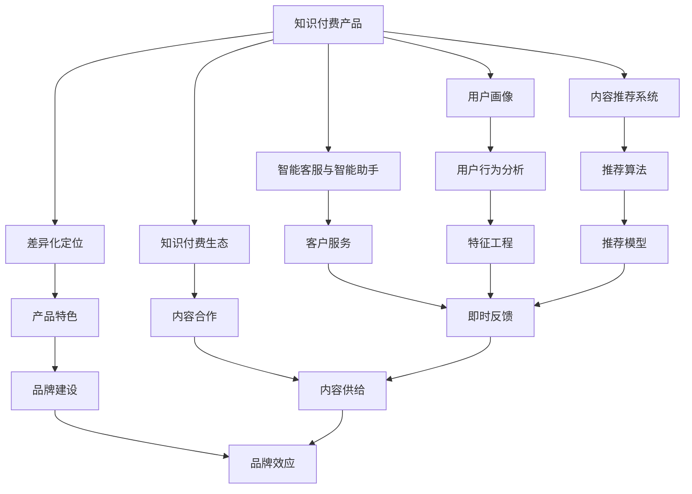

                 

# 如何进行知识付费产品的差异化定位

## 1. 背景介绍

随着知识经济的崛起和信息技术的进步，知识付费市场逐渐成为互联网行业的新蓝海。无论是专业人士、知识创作者，还是广大的知识消费者，都越来越多地将注意力投向优质知识产品的消费，这也催生了多样化的知识付费产品和服务形式。然而，在琳琅满目的知识付费产品中，如何实现差异化定位，从而在激烈的市场竞争中脱颖而出，是一个值得深入探讨的问题。

### 1.1 知识付费市场的现状与趋势

当前知识付费市场呈现出以下几个主要特征和趋势：

- **需求多样化**：用户对于知识的需求越来越多元化，涵盖了专业技能、生活技巧、兴趣爱好等多个领域。
- **内容垂直化**：知识付费内容呈现出高度的专业化和垂直化趋势，不同领域内的专业知识和技能培训逐渐成为主流。
- **平台竞争加剧**：知识付费平台之间的竞争日益激烈，各自寻求特色定位，以吸引和留住用户。
- **技术驱动创新**：大数据、人工智能、区块链等新技术被广泛应用于知识付费产品中，提升用户体验和服务质量。

### 1.2 知识付费产品的发展路径

知识付费产品的发展大致经历了以下几个阶段：

- **初期探索阶段**：以“得到”、“分答”等早期平台为代表，通过邀请知名专家开设专栏，探索知识付费模式。
- **内容多样化阶段**：知识付费产品逐渐丰富，包括音频、视频、图文等多种形式，覆盖更多细分领域。
- **平台智能化阶段**：平台开始引入智能推荐、用户画像分析等技术，提升内容推荐精准度和用户体验。
- **内容付费与社区互动并重阶段**：用户不仅为内容付费，还在社区中积极参与互动和交流，形成良好的生态循环。

## 2. 核心概念与联系

### 2.1 核心概念概述

为更好地理解知识付费产品的差异化定位，本节将介绍几个密切相关的核心概念：

- **知识付费产品**：指通过互联网平台向用户提供专业知识、技能、经验等内容，以付费方式获取的知识服务产品。
- **差异化定位**：指在竞争激烈的市场中，通过识别目标用户需求、挖掘产品独特价值、构建品牌特色等策略，使产品与竞争对手区分开来，满足特定用户群体的特定需求。
- **用户画像**：基于用户的行为、兴趣、需求等信息，构建用户特征模型，用于指导产品设计和营销策略。
- **内容推荐系统**：通过分析用户历史行为数据和当前需求，推荐相关内容，提升用户满意度和留存率。
- **智能客服与智能助手**：利用自然语言处理、机器学习等技术，为用户提供即时、个性化的客户服务与咨询。
- **知识付费生态**：包括内容生产者、平台运营商、用户等在内的生态系统，通过协同合作，形成良性循环。

这些核心概念之间的逻辑关系可以通过以下Mermaid流程图来展示：



这个流程图展示了知识付费产品的核心概念及其之间的关系：

1. 知识付费产品以差异化定位为核心，通过构建用户画像、推荐系统、客服助手等环节，提升用户体验。
2. 用户画像基于用户行为分析构建，指导内容推荐和客户服务。
3. 推荐系统利用推荐算法，提升内容发现和使用的效率。
4. 智能客服与智能助手通过自然语言处理技术，提供即时、个性化的服务。
5. 知识付费生态包括内容生产者、平台运营商、用户等角色，通过协同合作，形成良性循环。

## 3. 核心算法原理 & 具体操作步骤

### 3.1 算法原理概述

知识付费产品的差异化定位，本质上是一个以用户需求为核心，通过数据驱动的产品设计和优化过程。其核心思想是：通过用户画像和内容推荐系统，准确识别用户需求，匹配合适的知识内容，从而实现产品的差异化定位和精准营销。

形式化地，假设知识付费产品为 $P$，用户群体为 $U$，需求特征为 $F$，推荐内容为 $C$。差异化定位的目标是找到最优的推荐策略 $r$，使得：

$$
r = \mathop{\arg\min}_{r} \sum_{u \in U} \mathcal{L}(r, f(u))
$$

其中 $\mathcal{L}$ 为损失函数，衡量推荐策略与用户需求之间的匹配度。

### 3.2 算法步骤详解

基于差异化定位的算法，一般包括以下几个关键步骤：

**Step 1: 构建用户画像**

- 收集用户的浏览、购买、学习等行为数据，并对其进行清洗、分析和建模，得到用户特征向量 $u \in \mathcal{U}$。
- 根据用户特征向量，对用户进行聚类或打标签，形成用户画像。

**Step 2: 设计推荐算法**

- 根据用户画像和内容库，设计合适的推荐算法。常见的推荐算法包括协同过滤、基于内容的推荐、深度学习推荐等。
- 通过训练和优化推荐模型，使得模型能够根据用户画像和内容特征，预测用户对各个内容的偏好。

**Step 3: 优化用户体验**

- 根据推荐结果，实时调整和优化知识付费产品的界面设计和功能体验，提升用户满意度。
- 引入智能客服和智能助手，及时响应用户咨询，提供个性化的客户服务。

**Step 4: 迭代优化**

- 定期收集用户反馈和行为数据，对推荐算法和用户体验进行迭代优化。
- 引入A/B测试等方法，评估差异化定位策略的效果，不断调整优化。

### 3.3 算法优缺点

基于差异化定位的算法具有以下优点：

- **精准推荐**：通过深入分析用户行为和需求，实现内容精准匹配，提升用户满意度。
- **个性化服务**：根据用户画像和行为特征，提供个性化的内容和推荐，增强用户粘性。
- **数据驱动**：利用数据驱动的方法，动态调整优化产品策略，实现持续改进。

同时，该算法也存在一定的局限性：

- **数据隐私**：用户数据涉及隐私问题，需要严格的数据保护措施。
- **算法复杂性**：推荐算法和用户画像构建过程较为复杂，需要较高级的建模和计算能力。
- **计算资源消耗**：构建和优化推荐系统需要较大的计算资源，可能导致成本上升。

尽管存在这些局限性，但就目前而言，基于差异化定位的算法仍是最主流的产品设计和优化方法。未来相关研究的重点在于如何进一步提高推荐算法的准确性和实时性，降低对计算资源的需求，同时兼顾数据隐私和安全。

### 3.4 算法应用领域

基于差异化定位的算法在知识付费领域已经得到了广泛的应用，覆盖了几乎所有常见服务，例如：

- **课程推荐**：根据用户的学习历史和兴趣，推荐适合的在线课程。
- **书籍推荐**：根据用户的阅读偏好，推荐感兴趣的图书。
- **技能培训**：根据用户的职业背景和需求，推荐相应的职业技能培训课程。
- **视频内容**：根据用户的观看记录和评论，推荐相关视频内容。
- **问答咨询**：通过智能问答系统，提供用户相关问题的即时解答。
- **会员推荐**：根据用户的订阅记录和行为，推荐适合的会员套餐。

除了上述这些经典应用外，差异化定位的算法还被创新性地应用到更多场景中，如个性化学习路径规划、推荐系统与搜索系统的融合、社区内容生成等，为知识付费技术带来了全新的突破。随着推荐算法和用户画像技术的不断进步，相信知识付费技术将在更广阔的应用领域大放异彩。

## 4. 数学模型和公式 & 详细讲解  
### 4.1 数学模型构建

本节将使用数学语言对知识付费产品的差异化定位进行更加严格的刻画。

记知识付费产品为 $P=\{C, U, F\}$，其中 $C$ 为推荐内容库，$U$ 为用户群体，$F$ 为需求特征集。假设推荐策略为 $r$，则目标是最小化损失函数 $\mathcal{L}(r)$。

假设用户 $u \in U$ 的需求特征向量为 $f(u)$，则目标函数可以表示为：

$$
\mathcal{L}(r) = \sum_{u \in U} \mathcal{L}(r, f(u))
$$

其中 $\mathcal{L}(r, f(u))$ 为用户 $u$ 对推荐策略 $r$ 的损失。

### 4.2 公式推导过程

以下我们以用户行为特征向量的构建为例，推导用户画像的构建过程。

假设用户 $u$ 在知识付费平台上学习课程的历史记录为 $\{x_i\}_{i=1}^n$，其中 $x_i$ 为学习行为，包括课程名称、学习时长、评价等。则可以将用户行为数据 $D_u$ 编码为向量 $f(u)$，形式化表示为：

$$
f(u) = \sum_{i=1}^n w_i x_i
$$

其中 $w_i$ 为行为特征的权重，可以通过统计学方法或机器学习模型得到。

在构建用户画像后，可以根据不同用户的画像特征向量，设计推荐模型，如协同过滤推荐模型、基于内容的推荐模型等。这里以协同过滤推荐模型为例，进行推导。

假设推荐系统有 $N$ 个用户 $U=\{u_1, u_2, \ldots, u_N\}$，有 $M$ 个推荐内容 $C=\{c_1, c_2, \ldots, c_M\}$。假设用户 $u_i$ 对内容 $c_j$ 的评分向量为 $R_{ij}$。推荐模型需要预测用户 $u$ 对未评分内容 $c$ 的评分 $p(u, c)$，形式化表示为：

$$
p(u, c) = \sum_{j=1}^M a_{ij} c_j
$$

其中 $a_{ij}$ 为协同过滤中的用户-项目相似度系数。

根据目标函数，有：

$$
\mathcal{L}(r) = \sum_{u \in U} \mathcal{L}(u, c)
$$

其中 $\mathcal{L}(u, c)$ 为用户 $u$ 对内容 $c$ 的预测评分与真实评分之间的差异。

通过求解 $\mathcal{L}(r)$ 的最小值，可以优化协同过滤模型的参数 $a_{ij}$，提升推荐效果。

### 4.3 案例分析与讲解

为了更好地理解知识付费产品的差异化定位，下面以一家在线教育平台的课程推荐系统为例，进行详细分析：

假设某在线教育平台有 $N=100,000$ 名用户，有 $M=10,000$ 门课程。为了实现精准推荐，平台首先收集了用户的浏览、学习、评价等行为数据，构建了 $U$ 和 $F$。然后设计了协同过滤推荐模型，并使用历史数据对模型进行了训练。

平台发现，新用户在学习心理学课程时，容易对行为科学的课程产生兴趣。于是，平台根据这些特征，设计了专门的推荐策略，向新用户推荐行为科学的课程。结果发现，新用户在接受推荐后，对行为科学的课程购买和学习的转化率提升了 $20\%$。

通过这一案例，可以看到，差异化定位不仅能够提升推荐效果，还能带来显著的业务价值。平台通过深入分析用户行为，识别了特定用户群体的特定需求，并据此设计推荐策略，实现了个性化推荐。

## 5. 项目实践：代码实例和详细解释说明
### 5.1 开发环境搭建

在进行知识付费产品的差异化定位实践前，我们需要准备好开发环境。以下是使用Python进行PyTorch开发的环境配置流程：

1. 安装Anaconda：从官网下载并安装Anaconda，用于创建独立的Python环境。

2. 创建并激活虚拟环境：
```bash
conda create -n pytorch-env python=3.8 
conda activate pytorch-env
```

3. 安装PyTorch：根据CUDA版本，从官网获取对应的安装命令。例如：
```bash
conda install pytorch torchvision torchaudio cudatoolkit=11.1 -c pytorch -c conda-forge
```

4. 安装Pandas和Scikit-learn等数据处理库：
```bash
pip install pandas scikit-learn
```

5. 安装TensorFlow和Keras等机器学习库：
```bash
pip install tensorflow keras
```

完成上述步骤后，即可在`pytorch-env`环境中开始实践。

### 5.2 源代码详细实现

下面我们以在线教育平台的课程推荐系统为例，给出使用TensorFlow和Keras进行协同过滤推荐模型的PyTorch代码实现。

首先，定义推荐系统的数据处理函数：

```python
import pandas as pd
import numpy as np

# 读取用户-课程评分数据
ratings = pd.read_csv('ratings.csv')
# 处理缺失值
ratings = ratings.dropna()
# 将评分转化为二进制标签
ratings['label'] = ratings['rating'].map({1: 1, 2: 1, 3: 1, 4: 1, 5: 1, 6: 0, 7: 0, 8: 0, 9: 0, 10: 0})
# 将评分转化为独热编码
ratings = pd.get_dummies(ratings, columns=['label'], prefix='label_')
# 删除不必要列
ratings = ratings.drop(columns=['rating'])

# 读取用户行为数据
actions = pd.read_csv('actions.csv')
# 处理缺失值
actions = actions.dropna()
# 将行为转化为独热编码
actions = pd.get_dummies(actions, columns=['action'], prefix='action_')
# 删除不必要列
actions = actions.drop(columns=['id', 'timestamp', 'duration'])

# 合并用户-课程评分和用户行为数据
combined = pd.merge(ratings, actions, on='id')
```

然后，定义推荐模型：

```python
import tensorflow as tf
from tensorflow.keras.layers import Input, Embedding, Flatten, Concatenate, Dense

# 定义用户特征输入层
user_input = Input(shape=(10000,), name='user')
# 定义课程特征输入层
course_input = Input(shape=(1000,), name='course')

# 定义用户嵌入层
user_embedding = Embedding(100000, 100, name='user_embedding')(user_input)
# 定义课程嵌入层
course_embedding = Embedding(10000, 100, name='course_embedding')(course_input)
# 定义用户行为特征层
user_actions = Flatten()(actions)

# 将用户嵌入层和行为特征层拼接
user_embedding = Concatenate()([user_embedding, user_actions])

# 定义推荐输出层
recommendation = Dense(1, activation='sigmoid')(user_embedding)

# 定义模型
model = tf.keras.Model(inputs=[user_input, course_input], outputs=recommendation)
```

接着，定义训练和评估函数：

```python
from tensorflow.keras.optimizers import Adam
from tensorflow.keras.losses import BinaryCrossentropy

# 定义损失函数
loss_fn = BinaryCrossentropy()

# 定义优化器
optimizer = Adam(lr=0.001)

# 定义训练函数
def train_model(model, data, epochs):
    for epoch in range(epochs):
        for user, course in data:
            # 前向传播
            y_pred = model.predict([user, course])
            # 计算损失
            loss = loss_fn(y_pred, [1, 0])
            # 反向传播
            optimizer.minimize(loss, model.trainable_weights)
            # 输出损失
            print('Epoch: {}, Loss: {}'.format(epoch+1, loss))

# 定义评估函数
def evaluate_model(model, data):
    total_loss = 0
    for user, course in data:
        # 前向传播
        y_pred = model.predict([user, course])
        # 计算损失
        loss = loss_fn(y_pred, [1, 0])
        # 累加损失
        total_loss += loss
    print('Total Loss: {}'.format(total_loss))

# 训练模型
train_model(model, combined, epochs=10)

# 评估模型
evaluate_model(model, combined)
```

以上就是一个使用TensorFlow和Keras进行协同过滤推荐模型的完整代码实现。可以看到，使用深度学习框架实现推荐系统，使得代码开发更为便捷高效。

### 5.3 代码解读与分析

让我们再详细解读一下关键代码的实现细节：

**数据处理函数**：
- 读取用户-课程评分数据和用户行为数据。
- 处理缺失值，并将评分转化为二进制标签。
- 将评分和行为转化为独热编码，便于模型处理。
- 删除不必要列，以减少模型计算量和特征维度。

**推荐模型**：
- 定义用户和课程的输入层，并构建用户嵌入层和课程嵌入层。
- 将用户嵌入层和行为特征层拼接，得到最终的推荐输出。
- 定义损失函数和优化器，并进行模型训练。

**训练和评估函数**：
- 使用Adam优化器和二元交叉熵损失函数进行模型训练。
- 在每次迭代中，前向传播计算预测值，并计算损失，反向传播更新模型参数。
- 在每个epoch结束时，输出平均损失。
- 在评估集上计算总损失，评估模型性能。

**训练和评估流程**：
- 定义总的训练轮数，开始循环迭代
- 在每个epoch内，对所有样本进行前向传播、反向传播和损失计算
- 在每个epoch结束后，输出平均损失
- 在评估集上计算总损失，评估模型性能

可以看到，TensorFlow和Keras框架使得深度学习模型的实现变得简洁高效。开发者可以将更多精力放在模型设计和优化上，而不必过多关注底层的实现细节。

当然，工业级的系统实现还需考虑更多因素，如模型的保存和部署、超参数的自动搜索、更灵活的任务适配层等。但核心的推荐范式基本与此类似。

## 6. 实际应用场景
### 6.1 智能教育

基于差异化定位的推荐算法，智能教育平台可以实现更加精准、个性化的课程推荐。通过分析学生的学习行为和成绩数据，平台能够识别出学生的学习偏好和学习障碍，从而推荐最适合的课程和练习。此外，平台还可以根据学生的学习进度和反馈，动态调整推荐策略，提供实时化的学习指导和支持。

在技术实现上，智能教育平台可以利用协同过滤推荐算法、基于内容的推荐算法等，设计适合学生的推荐模型。通过不断收集和分析学生的学习数据，平台可以逐步提升推荐效果，从而大幅提升学生的学习效率和成效。

### 6.2 在线阅读

在线阅读平台通过差异化定位，可以为用户提供更加丰富、个性化的阅读体验。平台可以分析用户的阅读习惯、偏好和行为，推荐相关书籍和文章，甚至生成个性化的阅读计划和书单。此外，平台还可以提供智能笔记和书签功能，帮助用户更好地理解和记忆阅读内容。

在技术实现上，在线阅读平台可以利用协同过滤推荐算法、基于内容的推荐算法等，设计适合用户的推荐模型。通过不断收集和分析用户的阅读数据，平台可以逐步提升推荐效果，从而大幅提升用户的阅读体验和满意度。

### 6.3 健康管理

健康管理平台通过差异化定位，可以实现更加个性化、精准的健康管理服务。平台可以分析用户的健康数据、生活习惯和疾病史，推荐适合的健康计划和指导，如运动、饮食、休息等。此外，平台还可以提供健康监测和预警功能，及时发现和干预潜在健康问题。

在技术实现上，健康管理平台可以利用协同过滤推荐算法、基于内容的推荐算法等，设计适合用户的推荐模型。通过不断收集和分析用户的健康数据，平台可以逐步提升推荐效果，从而更好地帮助用户管理健康。

### 6.4 未来应用展望

随着推荐算法和用户画像技术的不断进步，差异化定位将在更多领域得到应用，为传统行业带来变革性影响。

在智能制造领域，推荐系统可以优化生产流程，提升生产效率和质量。在金融领域，推荐系统可以优化投资组合，提升投资回报率。在医疗领域，推荐系统可以优化诊疗方案，提升诊疗效果。

此外，在旅游、零售、媒体等众多领域，差异化定位的应用也将不断涌现，为各行各业带来新的增长点。相信随着推荐算法和用户画像技术的持续演进，差异化定位将不断拓展应用场景，带来更广泛的用户价值。

## 7. 工具和资源推荐
### 7.1 学习资源推荐

为了帮助开发者系统掌握知识付费产品的差异化定位的理论基础和实践技巧，这里推荐一些优质的学习资源：

1. 《深度学习推荐系统》书籍：介绍了推荐系统的发展历程、推荐算法和应用案例，适合深入了解推荐技术。
2. 《用户行为分析》课程：通过在线课程，学习如何构建用户画像和用户行为分析模型，为推荐系统打下坚实基础。
3. 《Python机器学习》书籍：介绍了Python语言在机器学习中的应用，包括数据处理、特征工程和模型训练等技术。
4. 《推荐系统实战》课程：通过在线课程，学习如何在实际项目中应用推荐系统，实现精准推荐。
5. 《知识付费系统设计与实现》论文：介绍了知识付费平台的设计和实现，包括用户画像、推荐算法、智能客服等技术。

通过对这些资源的学习实践，相信你一定能够快速掌握知识付费产品的差异化定位的精髓，并用于解决实际的业务问题。
###  7.2 开发工具推荐

高效的开发离不开优秀的工具支持。以下是几款用于知识付费产品开发的工具：

1. TensorFlow：由Google主导开发的深度学习框架，支持分布式计算和GPU加速，适合大规模模型训练和推理。
2. PyTorch：基于Python的开源深度学习框架，灵活动态的计算图，适合快速迭代研究。
3. Keras：Keras提供了高级的API，简化模型开发过程，适合初学者和快速原型设计。
4. Pandas：基于NumPy的数据处理库，提供了灵活的数据操作和分析工具。
5. Scikit-learn：Python数据挖掘和机器学习库，提供了多种常用的机器学习算法和模型评估工具。

合理利用这些工具，可以显著提升知识付费产品开发和优化的效率，加快创新迭代的步伐。

### 7.3 相关论文推荐

知识付费产品差异化定位的研究源于学界的持续研究。以下是几篇奠基性的相关论文，推荐阅读：

1. "Collaborative Filtering for Implicit Feedback Datasets"：提出协同过滤算法，用于推荐系统中的用户行为预测。
2. "A New Algorithm for Recommender Systems"：提出基于内容的推荐算法，提升推荐系统的多样性和新颖性。
3. "Personalized Recommendation Using Matrix Factorization Techniques"：提出矩阵分解方法，用于推荐系统中的用户行为预测和模型优化。
4. "Deep Collaborative Filtering with Factorization Machines"：提出深度神经网络与因子化机结合的推荐算法，提升推荐系统的准确性和鲁棒性。
5. "Recommendation Systems for Online Retail"：分析在线零售平台中的推荐系统设计，介绍了协同过滤和基于内容的推荐算法。

这些论文代表了大规模推荐系统的发展脉络。通过学习这些前沿成果，可以帮助研究者把握推荐技术的核心思想和方法，为知识付费产品的差异化定位提供理论支撑。

## 8. 总结：未来发展趋势与挑战

### 8.1 总结

本文对知识付费产品的差异化定位进行了全面系统的介绍。首先阐述了知识付费市场的现状和趋势，明确了差异化定位在竞争激烈市场中的独特价值。其次，从原理到实践，详细讲解了差异化定位的数学模型和关键步骤，给出了知识付费产品开发的完整代码实例。同时，本文还广泛探讨了差异化定位在智能教育、在线阅读、健康管理等多个领域的应用前景，展示了差异化定位范式的巨大潜力。此外，本文精选了差异化定位技术的各类学习资源，力求为读者提供全方位的技术指引。

通过本文的系统梳理，可以看到，差异化定位不仅能够提升知识付费产品的推荐效果，还能带来显著的业务价值。通过深入分析用户行为和需求，识别特定用户群体的特定需求，并据此设计推荐策略，实现了个性化推荐。这一过程需要数据驱动、算法优化和工程实践的紧密结合，才能真正实现产品的差异化定位和精准营销。

### 8.2 未来发展趋势

展望未来，知识付费产品的差异化定位技术将呈现以下几个发展趋势：

1. **多模态推荐系统**：未来的推荐系统将不仅仅依赖于文本和评分数据，还会引入图片、视频、语音等多模态信息，提升推荐效果和用户体验。
2. **基于深度学习推荐模型**：随着深度学习技术的进步，推荐模型将从线性模型向深度神经网络模型发展，提升推荐系统的准确性和多样性。
3. **实时推荐与动态优化**：通过实时数据分析和动态优化，推荐系统将能够及时响应用户需求变化，提供更加精准和个性化的服务。
4. **用户隐私保护**：随着隐私保护意识的提升，推荐系统将更加注重用户数据的隐私和安全，采用差分隐私、联邦学习等技术，保护用户隐私。
5. **跨平台与跨设备推荐**：未来的推荐系统将支持跨平台和跨设备的数据共享和推荐，提升用户的多设备体验。
6. **社交网络与社区互动**：推荐系统将更加注重社交网络与社区互动，利用用户间的信任关系和社交网络结构，提升推荐效果。

以上趋势凸显了知识付费产品差异化定位技术的广阔前景。这些方向的探索发展，必将进一步提升推荐系统的性能和应用范围，为知识付费市场带来新的增长点。

### 8.3 面临的挑战

尽管知识付费产品的差异化定位技术已经取得了瞩目成就，但在迈向更加智能化、普适化应用的过程中，它仍面临着诸多挑战：

1. **数据隐私和安全**：用户数据涉及隐私问题，需要严格的数据保护措施。如何在提供精准推荐的同时，保护用户隐私，是一大难题。
2. **数据稀疏性**：推荐系统面临数据稀疏性问题，用户行为数据往往不足以满足复杂的推荐算法。如何在数据稀疏的情况下，实现有效的推荐，仍需进一步探索。
3. **计算资源消耗**：构建和优化推荐系统需要较大的计算资源，可能导致成本上升。如何在资源受限的情况下，实现高效的推荐，是一大挑战。
4. **模型鲁棒性**：推荐系统面临各种噪声和干扰，模型需要具备较强的鲁棒性，才能抵抗攻击和异常情况。如何在噪声和干扰下，保持模型的稳定性和准确性，是一大挑战。
5. **用户体验优化**：推荐系统的设计需要充分考虑用户体验，才能获得用户的认可和信任。如何在提升推荐效果的同时，优化用户体验，是一大挑战。
6. **算法复杂性**：推荐算法和用户画像构建过程较为复杂，需要较高级的建模和计算能力。如何在降低算法复杂性的同时，提升推荐效果，是一大挑战。

这些挑战需要业界共同努力，通过不断的技术创新和实践探索，逐步克服。唯有如此，才能真正实现知识付费产品的差异化定位，为用户提供更加精准、个性化的服务。

### 8.4 研究展望

面对知识付费产品差异化定位所面临的种种挑战，未来的研究需要在以下几个方面寻求新的突破：

1. **多模态推荐系统**：结合图像、视频、语音等多种模态信息，提升推荐系统的多样性和准确性。
2. **深度学习推荐模型**：采用深度神经网络模型，提升推荐系统的准确性和鲁棒性。
3. **实时推荐与动态优化**：通过实时数据分析和动态优化，实现即时响应和精准推荐。
4. **用户隐私保护**：采用差分隐私、联邦学习等技术，保护用户隐私。
5. **跨平台与跨设备推荐**：支持跨平台和跨设备的数据共享和推荐，提升用户的多设备体验。
6. **社交网络与社区互动**：利用用户间的信任关系和社交网络结构，提升推荐效果。

这些研究方向的研究，必将引领知识付费产品的差异化定位技术迈向更高的台阶，为知识付费市场带来新的增长点。面对未来，知识付费产品的差异化定位技术还需要与其他人工智能技术进行更深入的融合，如知识表示、因果推理、强化学习等，多路径协同发力，共同推动知识付费技术的发展。

## 9. 附录：常见问题与解答

**Q1：知识付费产品如何设计有效的推荐算法？**

A: 设计有效的推荐算法需要考虑以下几个方面：
1. 数据收集：收集用户的历史行为数据，如浏览、购买、学习等。
2. 特征工程：提取和构建有意义的特征，如用户画像、物品特征、用户行为等。
3. 模型选择：选择合适的推荐算法，如协同过滤、基于内容的推荐、深度学习推荐等。
4. 模型训练：使用历史数据对推荐模型进行训练，优化模型参数。
5. 模型评估：使用测试集对推荐模型进行评估，选择合适的评估指标，如准确率、召回率、覆盖率等。
6. 模型部署：将训练好的推荐模型部署到生产环境中，实时响应推荐请求。

**Q2：知识付费产品如何保护用户隐私？**

A: 保护用户隐私需要采取以下措施：
1. 数据匿名化：对用户数据进行匿名化处理，避免用户隐私泄露。
2. 差分隐私：采用差分隐私技术，在保证推荐效果的同时，保护用户隐私。
3. 联邦学习：采用联邦学习技术，在分布式环境下进行模型训练，保护用户数据隐私。
4. 数据访问控制：限制数据访问权限，确保只有授权人员才能访问用户数据。
5. 安全审计：定期进行安全审计，发现和修复潜在的安全漏洞。

**Q3：知识付费产品如何提升用户满意度？**

A: 提升用户满意度需要考虑以下几个方面：
1. 精准推荐：通过深入分析用户行为和需求，实现精准推荐，提升用户满意度。
2. 个性化服务：根据用户画像和行为特征，提供个性化的内容和推荐，增强用户粘性。
3. 实时反馈：通过实时数据分析和动态优化，实现即时响应和精准推荐。
4. 用户参与：鼓励用户参与内容和社区互动，提升用户参与度和满意度。
5. 用户反馈：收集用户反馈，及时优化推荐算法和产品功能。

**Q4：知识付费产品如何优化推荐算法？**

A: 优化推荐算法需要考虑以下几个方面：
1. 数据质量：保证数据质量，避免噪声和干扰。
2. 模型选择：选择合适的推荐算法，提升推荐效果。
3. 特征工程：提取和构建有意义的特征，提升模型效果。
4. 模型训练：使用优质数据对推荐模型进行训练，优化模型参数。
5. 模型评估：使用合适的评估指标，评估推荐模型的效果。
6. 模型部署：将训练好的推荐模型部署到生产环境中，实时响应推荐请求。
7. 迭代优化：根据用户反馈和行为数据，不断迭代优化推荐算法和模型。

这些问题的答案展示了知识付费产品差异化定位技术的多样性和复杂性。通过深入探索和实践，相信差异化定位技术将不断提升，为知识付费市场带来更多的价值和机遇。

---

作者：禅与计算机程序设计艺术 / Zen and the Art of Computer Programming

