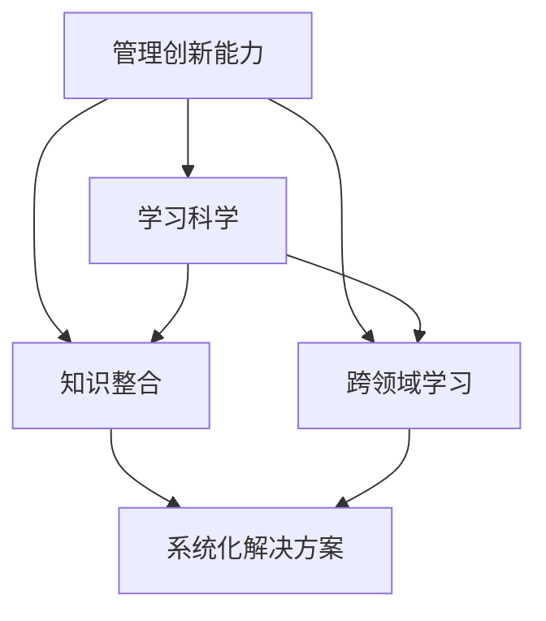

                 

# 学习体系与管理创新能力的培养

## 1. 背景介绍

### 1.1 问题由来
在当前快速变化和高度竞争的商业环境中，企业需要在不断创新的同时保持稳定和高效，这对管理创新能力提出了极高的要求。然而，传统的教育体系和管理方法已难以满足这一需求。为了培养和提升管理创新能力，本文将深入探讨如何构建科学、系统化的学习体系，以实现从知识积累到能力创新的转化。

### 1.2 问题核心关键点
管理创新能力培养的核心在于培养创新思维、提升问题解决能力和增强跨领域知识整合能力。本文将从管理理论、创新心理学、学习科学等多个角度，全面解析学习体系与管理创新能力的关系，提出一套系统化的培养方案。

### 1.3 问题研究意义
培养管理创新能力，对于提升企业竞争力、推动行业创新具有重要意义。科学的培养体系能够帮助管理人才更快地掌握最新知识，在复杂环境中做出创新决策，从而推动企业持续发展，引领行业进步。

## 2. 核心概念与联系

### 2.1 核心概念概述

本节将介绍构建学习体系所需的关键概念，包括管理创新能力、学习科学、知识整合、跨领域学习等，并阐述它们之间的联系。

- **管理创新能力**：指在管理过程中产生新想法、新技术或新方法的能力，是推动企业持续发展的核心动力。
- **学习科学**：研究如何通过科学方法和技术手段，高效地学习和掌握新知识和技能，以达到最佳学习效果。
- **知识整合**：将不同领域的知识融合，形成新的知识体系或方法，以解决复杂问题。
- **跨领域学习**：跨越不同学科和领域的知识学习，有助于培养跨学科思维和系统性解决问题能力。

这些核心概念相互关联，共同构成了学习体系与管理创新能力培养的框架。通过掌握这些概念，我们可以更好地理解学习体系的作用和实施方法。

### 2.2 核心概念原理和架构的 Mermaid 流程图



这个流程图展示了核心概念之间的关系：管理创新能力通过科学学习方式（B）、知识整合（C）和跨领域学习（D），最终形成系统化的解决方案（E）。

## 3. 核心算法原理 & 具体操作步骤

### 3.1 算法原理概述

构建学习体系的核心在于设计一套系统化、可操作的学习流程，以实现知识到能力的转化。这一过程涉及三个主要步骤：知识获取、知识整合和能力应用。

**知识获取**：通过科学的学习方法和工具，高效地获取新知识，包括阅读、观察、实验等。

**知识整合**：将获取的知识进行结构化处理，形成知识体系或模型，以便应用于实际问题。

**能力应用**：通过实践和创新，将知识整合转化为具体的能力和解决方案，解决实际问题。

### 3.2 算法步骤详解

以下是构建学习体系的具体操作步骤：

**Step 1: 制定学习目标**
- 明确需要掌握的知识点和能力点，设定短期和长期的学习目标。
- 将学习目标具体化为可操作的任务，如阅读指定书籍、参加研讨会等。

**Step 2: 设计学习路径**
- 根据学习目标，规划系统的学习路径，包括学习内容、时间安排、资源配置等。
- 考虑学科交叉和跨领域学习，设计多样化的学习活动。

**Step 3: 实施科学学习方法**
- 采用系统化的学习方法，如自顶向下设计、迭代反馈等。
- 引入现代学习工具，如在线课程、虚拟实验室等，提高学习效率。

**Step 4: 知识整合与转化**
- 将获取的知识进行整理和分析，形成系统化的知识体系或模型。
- 通过案例分析和项目实践，将知识整合转化为实际能力。

**Step 5: 持续评估与改进**
- 定期评估学习效果，反馈改进学习方法和路径。
- 通过复盘和反思，不断优化学习体系。

### 3.3 算法优缺点

**优点**：
- 系统化设计，确保学习效果和知识转化路径的科学性。
- 多样化学习活动，满足不同学习者的需求，提高学习兴趣和效果。
- 跨领域学习，促进创新思维和跨学科知识的整合。

**缺点**：
- 设计复杂，需要时间和资源投入。
- 实施过程中可能存在资源不足或路径不合理的问题。
- 效果评估复杂，需要持续的反馈和调整。

### 3.4 算法应用领域

本节将探讨学习体系与管理创新能力培养在多个领域中的应用：

- **企业培训**：通过科学设计培训课程和学习路径，提升员工的管理创新能力。
- **学术研究**：在大学和研究机构中，设计跨学科学习路径，培养具有创新能力的学术人才。
- **政府政策制定**：政府部门通过系统化学习体系，提升政策制定者的创新能力和跨领域思维。
- **行业协会**：行业协会通过组织跨领域学习活动，推动技术创新和行业进步。

## 4. 数学模型和公式 & 详细讲解 & 举例说明

### 4.1 数学模型构建

构建学习体系的过程中，可以引入数学模型来描述和优化学习过程。以下是一个简单的学习效果评估模型：

设 $L$ 为学习效果，$K$ 为知识获取量，$I$ 为知识整合度，$C$ 为能力应用效果，则学习体系的效果可以表示为：

$$
L = K \times I \times C
$$

其中 $K$、$I$、$C$ 均为变量，需要通过科学方法量化和优化。

### 4.2 公式推导过程

以知识获取为例，假设学习时间为 $t$，每天获取知识量 $k$，则总获取知识量为：

$$
K = k \times t
$$

若引入有效学习策略，知识获取效率提升为 $k'$，则：

$$
K = k' \times t
$$

通过类似推导，可以得到知识整合和能力应用的数学模型。

### 4.3 案例分析与讲解

以某企业高管培训项目为例，通过科学设计学习路径和评估方法，显著提升了管理创新能力。项目包括以下步骤：

1. 明确培训目标：提升高管团队的市场洞察、战略规划和组织管理能力。
2. 设计学习路径：安排跨领域的课程，包括经济学、管理学、心理学等。
3. 实施学习策略：引入案例分析和实战模拟，提高知识应用能力。
4. 评估与改进：通过问卷调查和绩效评估，持续优化培训效果。

通过这一项目，培训后高管团队的创新能力和问题解决能力显著提升，为企业带来了显著的业务创新和市场竞争优势。

## 5. 项目实践：代码实例和详细解释说明

### 5.1 开发环境搭建

本节将介绍构建学习体系所需的软件环境搭建步骤。

**Step 1: 安装Python和相关库**
- 安装Python 3.x，建议使用Anaconda或Miniconda。
- 安装必要的库，如pandas、numpy、matplotlib等。

**Step 2: 设置学习管理系统**
- 使用Jupyter Notebook或其他支持交互式编程的环境。
- 引入在线课程、电子书籍和讨论论坛等学习资源。

**Step 3: 设计学习路径和评估体系**
- 使用Python编程语言，设计学习路径和评估方法。
- 利用数据可视化工具，展示学习进度和效果。

### 5.2 源代码详细实现

以下是一个简单的学习路径设计代码示例：

```python
import pandas as pd

# 创建学习路径数据框架
learning_path = pd.DataFrame({
    'Subject': ['Economics', 'Management', 'Psychology'],
    'Course': ['Market Analysis', 'Strategic Planning', 'Leadership Training'],
    'Duration': [8, 12, 10],
    'Score': [4.5, 4.8, 4.7]
})

# 展示学习路径
print(learning_path)
```

**5.3 代码解读与分析**

上述代码创建了一个学习路径数据框架，展示了经济学、管理学和心理学三个科目的学习课程、时长和分数。这些数据可以用于评估学习效果和优化学习路径。

### 5.4 运行结果展示

运行代码后，可以得到以下输出：

```
Subject      Course  Duration  Score
0   Economics  Market Analysis    8  4.5
1     Management   Strategic Planning  12  4.8
2     Psychology  Leadership Training  10  4.7
```

通过这一数据框架，可以清晰地了解各科目的学习进度和效果，为进一步优化学习路径提供数据支持。

## 6. 实际应用场景

### 6.1 企业培训

企业可以通过构建科学的学习体系，提升管理团队的管理创新能力。例如，某知名企业为中高层管理者设计了为期三个月的系统化培训项目，内容包括跨领域知识整合、案例分析和实战模拟，显著提升了管理团队的决策能力和创新思维。

### 6.2 学术研究

大学和研究机构可以通过设计跨学科的学习路径，培养具有创新能力的学术人才。例如，某大学设立了一个跨学科创新实验室，通过系统的课程设计和项目实践，培养了多位具有创新思维和跨领域知识整合能力的研究生。

### 6.3 政府政策制定

政府部门可以通过科学的学习体系，提升政策制定者的管理创新能力。例如，某市政府通过培训项目，提高了政策制定者的市场洞察和战略规划能力，成功推动了一系列具有创新性的政策实施。

### 6.4 行业协会

行业协会可以通过组织跨领域学习活动，推动技术创新和行业进步。例如，某科技行业协会定期举办跨学科研讨会，分享最新的技术趋势和创新思维，促进了行业内的技术交流和创新合作。

## 7. 工具和资源推荐

### 7.1 学习资源推荐

为了帮助开发者系统掌握学习体系与管理创新能力培养的理论基础和实践技巧，这里推荐一些优质的学习资源：

1. **《创新管理基础》**：该书系统介绍了创新管理的基础理论和实践方法，适用于企业培训和学术研究。
2. **Coursera《系统思维与创新管理》**：由世界顶级大学和专家团队授课，涵盖系统思维、创新方法和组织变革等多个方面。
3. **Harvard Business Review**：哈佛商业评论提供了大量关于创新管理的研究文章和案例，是研究和学习的重要资源。
4. **TED Talks**：TED Talks平台上有很多关于创新思维和跨学科学习的演讲，具有启发性。
5. **《学习科学导论》**：该书详细介绍了学习科学的基本理论和最新研究进展，适用于理论研究和实践应用。

通过这些资源的学习实践，相信你一定能够快速掌握学习体系与管理创新能力培养的精髓，并用于解决实际的创新和管理问题。

### 7.2 开发工具推荐

高效的开发离不开优秀的工具支持。以下是几款用于学习体系和管理创新能力培养的常用工具：

1. **Jupyter Notebook**：一个强大的交互式编程环境，支持多语言编程和数据可视化。
2. **MindMap**：思维导图工具，有助于设计复杂的学习路径和知识结构。
3. **Google Analytics**：数据分析工具，可以跟踪和评估学习效果，提供数据支持。
4. **Kaggle**：数据科学竞赛平台，提供丰富的数据集和算法工具，支持跨学科学习和创新实践。

合理利用这些工具，可以显著提升学习体系和管理创新能力培养的效率，加快创新迭代的步伐。

### 7.3 相关论文推荐

学习体系与管理创新能力培养的研究源于学界的持续研究。以下是几篇奠基性的相关论文，推荐阅读：

1. **《系统思维与创新管理》**：Deutsch, M., Andersen, H. K., & Elman, J. H. (1999). 探讨系统思维在创新管理中的应用。
2. **《跨学科学习的心理学基础》**：Wegner, D. M., & Gelman, R. (1992). 跨学科学习：心理学的基础和挑战。
3. **《创新管理的理论基础》**：Amabile, T. M. (1983). 创新管理：理论基础与实践方法。
4. **《学习科学：建构主义与教育技术》**：Cook, T. D., & Reddy, N. J. (2003). 学习科学：建构主义与教育技术。
5. **《知识整合：跨领域学习与创新》**：Brown, A. L., & Smith, P. K. (1992). 知识整合：跨领域学习与创新。

这些论文代表了大语言模型微调技术的发展脉络。通过学习这些前沿成果，可以帮助研究者把握学科前进方向，激发更多的创新灵感。

## 8. 总结：未来发展趋势与挑战

### 8.1 总结

本文对学习体系与管理创新能力培养进行了全面系统的介绍。首先阐述了学习体系与管理创新能力培养的研究背景和意义，明确了科学学习体系的作用和实施方法。其次，从原理到实践，详细讲解了学习体系的设计原则和操作步骤，给出了系统化学习体系构建的完整代码实例。同时，本文还广泛探讨了学习体系在企业培训、学术研究、政府政策制定等多个领域的应用前景，展示了学习体系范式的广阔潜力。最后，本文精选了学习体系的各类学习资源，力求为读者提供全方位的技术指引。

通过本文的系统梳理，可以看到，构建科学的学习体系是提升管理创新能力的重要途径。科学的培养体系能够帮助管理人才更快地掌握最新知识，在复杂环境中做出创新决策，从而推动企业持续发展，引领行业进步。

### 8.2 未来发展趋势

展望未来，学习体系与管理创新能力培养将呈现以下几个发展趋势：

1. **AI与数据驱动**：引入人工智能和大数据技术，提升学习效果和个性化学习体验。
2. **虚拟现实与增强现实**：通过虚拟现实和增强现实技术，模拟真实学习环境，增强学习效果。
3. **跨学科融合**：促进跨学科知识的整合，提升问题解决能力和创新思维。
4. **持续学习**：建立持续学习机制，推动知识的更新和应用，适应快速变化的环境。
5. **跨领域合作**：加强跨领域合作，推动技术创新和知识共享。

以上趋势凸显了学习体系与管理创新能力培养的广阔前景。这些方向的探索发展，必将进一步提升学习效果和管理创新能力，为培养更多具有创新能力的人才提供有力支持。

### 8.3 面临的挑战

尽管学习体系与管理创新能力培养已经取得了一定的进展，但在迈向更加智能化、普适化应用的过程中，仍面临诸多挑战：

1. **学习资源的获取和整合**：在快速变化的知识环境中，如何获取和整合多样化的学习资源，是一个挑战。
2. **学习效果评估**：科学、客观地评估学习效果，确保学习路径的有效性，需要进一步的研究和工具支持。
3. **跨领域知识整合**：如何有效地整合跨领域知识，形成新的知识体系或方法，仍然是一个难题。
4. **个性化学习**：如何设计个性化的学习路径，满足不同学习者的需求，提高学习效果。
5. **数据隐私与安全**：在数据驱动的学习体系中，如何保护学习者的隐私和数据安全，需要制定相应的规范和措施。

这些挑战需要学界和业界共同努力，通过不断探索和创新，逐步克服。

### 8.4 研究展望

面对学习体系与管理创新能力培养所面临的挑战，未来的研究需要在以下几个方面寻求新的突破：

1. **引入人工智能和大数据技术**：利用人工智能和大数据技术，提升学习效果和个性化学习体验。
2. **设计更加科学的学习路径**：引入系统思维和科学方法，设计更加科学、可操作的学习路径。
3. **促进跨学科合作与知识共享**：加强跨学科合作，推动知识共享和技术创新。
4. **保护学习者的隐私和数据安全**：制定相关规范和措施，保护学习者的隐私和数据安全。
5. **开发更加个性化的学习工具**：设计更加个性化的学习工具，满足不同学习者的需求。

这些研究方向将进一步推动学习体系与管理创新能力培养的深入发展，为培养更多具有创新能力的人才提供有力支持。

## 9. 附录：常见问题与解答

**Q1：如何设计科学的学习路径？**

A: 设计科学的学习路径需要考虑以下要素：
- 明确学习目标和能力点。
- 引入跨学科知识，形成多样化的学习内容。
- 设计迭代反馈机制，及时调整学习路径。
- 引入个性化学习工具，满足不同学习者的需求。

**Q2：如何评估学习效果？**

A: 评估学习效果需要综合考虑以下指标：
- 知识掌握程度：通过考试、论文等方式评估。
- 能力应用效果：通过实际项目、案例分析等方式评估。
- 反馈和改进：通过问卷调查、学习日志等方式收集反馈，持续优化学习路径。

**Q3：如何保护学习者的隐私和数据安全？**

A: 保护学习者的隐私和数据安全需要采取以下措施：
- 数据匿名化处理，防止数据泄露。
- 制定隐私保护政策，确保数据使用的合法性。
- 引入加密技术，保护数据传输和存储的安全。

**Q4：如何促进跨学科知识整合？**

A: 促进跨学科知识整合需要采取以下策略：
- 引入跨学科的课程和项目，培养跨学科思维。
- 建立跨学科合作平台，促进知识共享和技术创新。
- 设计跨学科的挑战赛和竞赛，激励跨学科学习和创新。

**Q5：如何实现个性化学习？**

A: 实现个性化学习需要采取以下措施：
- 引入个性化学习工具，如智能推荐系统、虚拟导师等。
- 设计个性化的学习路径，根据学习者的兴趣和需求进行调整。
- 引入自适应学习算法，动态调整学习内容和学习节奏。

通过这些问答，希望能帮助读者更好地理解学习体系与管理创新能力培养的原理和实践方法，为未来的学习和工作提供有力的支持和指导。

---

作者：禅与计算机程序设计艺术 / Zen and the Art of Computer Programming

