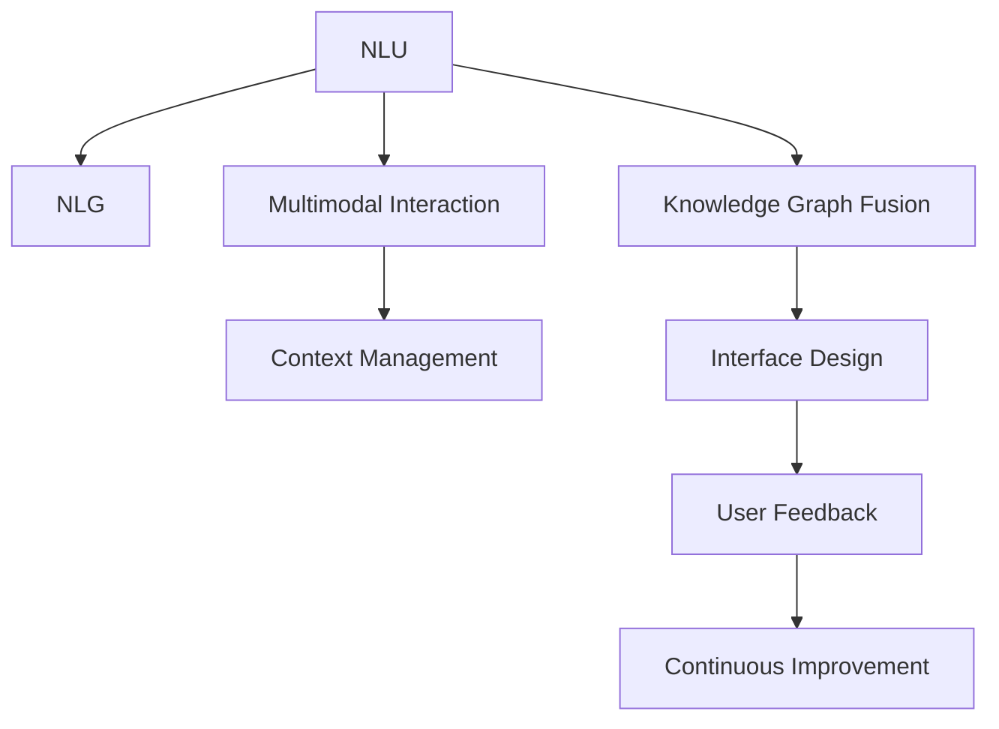

                 

# 对话式AI：构建更自然、更智能的交互界面

> 关键词：对话式AI,自然语言处理,自然语言理解(NLU),自然语言生成(NLG),交互界面设计,用户交互体验,多模态交互

## 1. 背景介绍

### 1.1 问题由来
在人工智能飞速发展的今天，人们对于人机交互的期望也愈发提高。传统的基于键盘、鼠标的交互方式已经无法满足用户日益复杂的需求。对话式AI，即自然语言处理(Natural Language Processing, NLP)和自然语言生成(Natural Language Generation, NLG)技术，使得人与机器之间的交互更加自然流畅。

对话式AI系统通过理解和生成自然语言，可以实现无障碍、高效率的人机交互，为各个领域带来革命性的变革。从智能客服到虚拟助手，从智能翻译到智能推荐，对话式AI技术正在逐渐渗透到各个行业中，成为构建未来智能社会的重要基础。

### 1.2 问题核心关键点
构建对话式AI系统的核心关键点在于自然语言处理和自然语言生成两个技术环节。自然语言理解(NLU)是指将自然语言转换为机器可理解的结构化数据，包括词法分析、句法分析、语义分析等步骤。自然语言生成(NLG)是指将机器理解的结构化数据转化为自然语言，生成流畅、自然的对话内容。

在实际应用中，构建对话式AI系统还需要考虑多模态交互、上下文管理、知识图谱融合等多个环节。这些技术环节互相配合，共同构建出更加自然、智能的交互界面。

## 2. 核心概念与联系

### 2.1 核心概念概述

为更好地理解对话式AI的构建方法，本节将介绍几个密切相关的核心概念：

- 自然语言处理(NLP)：通过计算机技术对自然语言进行理解、处理和生成，包括自然语言理解(NLU)和自然语言生成(NLG)。
- 自然语言理解(NLU)：将自然语言转换为机器可理解的结构化数据，包括词法分析、句法分析、语义分析等步骤。
- 自然语言生成(NLG)：将机器理解的结构化数据转化为自然语言，生成流畅、自然的对话内容。
- 多模态交互：结合文本、图像、语音等多种模态数据，提升交互的丰富性和多样性。
- 上下文管理：维护交互过程中的上下文信息，实现对话流畅、连贯。
- 知识图谱融合：将知识图谱中的结构化信息与自然语言处理技术相结合，提升系统的智能水平。
- 交互界面设计：根据用户行为和反馈，设计合理、易用的交互界面，提升用户体验。

这些核心概念之间的逻辑关系可以通过以下Mermaid流程图来展示：



这个流程图展示出对话式AI技术的核心组件及其之间的关系：

1. 自然语言理解(NLU)将用户输入的自然语言转化为结构化数据。
2. 自然语言生成(NLG)将结构化数据转化为流畅自然的对话内容。
3. 多模态交互提升交互的丰富性和多样性，用户可以通过图像、语音等多种方式与系统进行交互。
4. 上下文管理维护交互过程中的上下文信息，保证对话流畅和连贯。
5. 知识图谱融合将知识图谱中的结构化信息与自然语言处理技术相结合，提升系统的智能水平。
6. 交互界面设计根据用户行为和反馈，设计合理易用的交互界面，提升用户体验。
7. 用户反馈和持续改进循环作用，不断提高系统的性能和用户体验。

## 3. 核心算法原理 & 具体操作步骤
### 3.1 算法原理概述

对话式AI系统的核心算法原理主要基于自然语言处理和自然语言生成技术。自然语言处理技术将用户输入的自然语言转换为结构化数据，自然语言生成技术则将结构化数据转化为自然语言输出。

在自然语言理解(NLU)阶段，主要采用基于统计和深度学习的方法，包括词法分析、句法分析、语义分析等。其中，基于深度学习的词向量表示方法，如Word2Vec、GloVe、BERT等，能够更准确地表示单词之间的语义关系，提升自然语言理解的效果。

在自然语言生成(NLG)阶段，主要采用基于生成对抗网络(GAN)、变分自编码器(VAE)等方法，能够生成高质量的自然语言对话内容。同时，通过引入Transformer等模型架构，能够更高效地处理长距离依赖，生成流畅自然的对话内容。

### 3.2 算法步骤详解

对话式AI系统的构建过程大致可以分为以下几个步骤：

**Step 1: 数据预处理**
- 收集和整理对话数据，包括对话文本、上下文信息和用户标签等。
- 对数据进行清洗和标注，确保数据质量。
- 将数据分为训练集、验证集和测试集，进行划分。

**Step 2: 模型选择与训练**
- 选择合适的自然语言处理模型，如BERT、GPT等。
- 对模型进行微调或迁移学习，适应特定的对话任务。
- 使用训练集进行模型训练，优化模型参数。

**Step 3: 上下文管理**
- 设计上下文管理器，记录并维护对话上下文信息。
- 根据上下文信息，调整模型的输出策略。

**Step 4: 多模态融合**
- 设计多模态交互模块，将文本、图像、语音等多种模态数据融合到对话系统中。
- 根据不同的模态数据，采用不同的处理方式和算法。

**Step 5: 自然语言生成**
- 使用自然语言生成模型，生成流畅自然的对话内容。
- 对生成的对话内容进行后处理，提升语言质量。

**Step 6: 交互界面设计**
- 设计合理易用的交互界面，提升用户体验。
- 根据用户行为和反馈，不断优化界面设计和交互逻辑。

**Step 7: 用户反馈与持续改进**
- 收集用户反馈，进行模型和系统优化。
- 通过A/B测试等手段，评估不同方案的性能和效果。

### 3.3 算法优缺点

对话式AI系统的构建过程具有以下优点：

1. 提升用户体验：通过自然语言交互，用户能够更方便、自然地与机器进行交流，提高用户体验。
2. 降低开发成本：通过自然语言处理和生成技术，减少了传统交互界面的设计和开发成本。
3. 提高交互效率：自然语言交互能够实现多轮对话，快速获取用户需求和意图。

同时，对话式AI系统也存在以下缺点：

1. 语言理解偏差：自然语言处理技术尚未完全成熟，存在一定的语言理解偏差和误解。
2. 生成质量不稳定：自然语言生成技术的生成质量受到模型参数和训练数据的影响，可能出现生成内容不流畅、不自然等问题。
3. 多模态融合复杂：多模态数据的融合和处理较为复杂，需要结合多种技术手段和算法。

尽管存在这些缺点，但对话式AI系统在提升用户体验、降低开发成本、提高交互效率等方面的优势，使其在各个领域得到了广泛应用。

### 3.4 算法应用领域

对话式AI技术已经在多个领域得到了广泛应用，例如：

- 智能客服：通过自然语言处理和生成技术，实现自动问答和客户服务。
- 虚拟助手：通过自然语言理解和生成，实现个性化交互和任务执行。
- 智能推荐：通过自然语言处理和上下文管理，实现精准推荐和客户服务。
- 智能翻译：通过自然语言生成和上下文管理，实现高效、准确的翻译服务。
- 智能助手：通过自然语言处理和生成，实现日程管理、信息查询等功能。

除了上述这些经典应用外，对话式AI技术还在健康医疗、教育培训、金融服务等多个领域得到了创新性应用，为各行各业带来了新的发展机遇。

## 4. 数学模型和公式 & 详细讲解 & 举例说明
### 4.1 数学模型构建

对话式AI系统的数学模型主要基于自然语言处理和生成技术。以下以自然语言理解(NLU)中的词向量表示为例，介绍其数学模型构建。

设对话数据集为 $D=\{(x_i, y_i)\}_{i=1}^N$，其中 $x_i$ 为对话文本，$y_i$ 为对话标签。定义词向量表示为 $w \in \mathbb{R}^d$，其中 $d$ 为词向量维度。

假设词向量表示为 $w_i \in \mathbb{R}^d$，其中 $i$ 为单词的索引。定义词向量表示矩阵 $W \in \mathbb{R}^{n \times d}$，其中 $n$ 为单词数量。

定义单词的嵌入矩阵为 $E \in \mathbb{R}^{n \times d}$，其中 $E_{ij}$ 表示单词 $i$ 在 $j$ 个上下文中的嵌入向量。

自然语言理解的目标是将自然语言转换为机器可理解的结构化数据。通常采用基于深度学习的方法，如Transformer、LSTM等，通过学习单词和上下文之间的语义关系，生成词向量表示。

### 4.2 公式推导过程

以下以基于Transformer的词向量表示为例，推导其公式。

假设输入序列为 $x=\{x_1, x_2, ..., x_n\}$，其中 $x_i$ 表示单词 $i$。定义注意力机制为 $A \in \mathbb{R}^{n \times n}$，其中 $A_{ij}$ 表示单词 $i$ 对单词 $j$ 的注意力权重。

设注意力权重为 $\alpha \in \mathbb{R}^{n}$，其中 $\alpha_i$ 表示单词 $i$ 对上下文的注意力权重。定义上下文向量为 $C \in \mathbb{R}^{d}$，其中 $C_i$ 表示单词 $i$ 的上下文向量。

定义嵌入层为 $E \in \mathbb{R}^{d}$，其中 $E_i$ 表示单词 $i$ 的嵌入向量。定义嵌入层的输出为 $E'$，其中 $E'_i = E_i \cdot \alpha_i$。

定义注意力层的输出为 $A'$，其中 $A'_i = \sum_{j=1}^n A_{ij}E_j'$。

定义前向层为 $F \in \mathbb{R}^{d}$，其中 $F_i$ 表示单词 $i$ 的前向向量。定义前向层的输出为 $F'$，其中 $F'_i = F_i \cdot \alpha_i$。

定义输出层为 $O \in \mathbb{R}^{d}$，其中 $O_i$ 表示单词 $i$ 的输出向量。定义输出层的输出为 $O'$，其中 $O'_i = O_i \cdot \alpha_i$。

通过上述步骤，自然语言理解模型可以将自然语言转换为机器可理解的结构化数据，即词向量表示。

### 4.3 案例分析与讲解

以智能客服系统为例，介绍对话式AI技术的应用。

假设客服系统需要处理用户提出的关于产品故障的问题，可以采用基于深度学习的自然语言理解模型，将用户问题转换为机器可理解的结构化数据。具体步骤如下：

1. 收集并整理客服数据，包括对话文本、产品故障信息和用户标签等。
2. 对数据进行清洗和标注，确保数据质量。
3. 将数据分为训练集、验证集和测试集，进行划分。
4. 选择合适的自然语言理解模型，如BERT、GPT等。
5. 对模型进行微调或迁移学习，适应特定的客服任务。
6. 使用训练集进行模型训练，优化模型参数。
7. 设计上下文管理器，记录并维护对话上下文信息。
8. 根据上下文信息，调整模型的输出策略。
9. 设计多模态交互模块，将文本、图像、语音等多种模态数据融合到对话系统中。
10. 使用自然语言生成模型，生成流畅自然的客服回复。
11. 对生成的回复进行后处理，提升语言质量。
12. 设计合理易用的交互界面，提升用户体验。
13. 根据用户行为和反馈，不断优化界面设计和交互逻辑。

通过上述步骤，智能客服系统可以自动回答用户提出的产品故障问题，提升客服效率和服务质量。

## 5. 项目实践：代码实例和详细解释说明
### 5.1 开发环境搭建

在进行对话式AI系统开发前，我们需要准备好开发环境。以下是使用Python进行PyTorch开发的环境配置流程：

1. 安装Anaconda：从官网下载并安装Anaconda，用于创建独立的Python环境。

2. 创建并激活虚拟环境：
```bash
conda create -n pytorch-env python=3.8 
conda activate pytorch-env
```

3. 安装PyTorch：根据CUDA版本，从官网获取对应的安装命令。例如：
```bash
conda install pytorch torchvision torchaudio cudatoolkit=11.1 -c pytorch -c conda-forge
```

4. 安装Tensorflow：如果使用Tensorflow作为后端，可以使用以下命令安装：
```bash
conda install tensorflow
```

5. 安装TensorBoard：
```bash
conda install tensorboard
```

6. 安装其他必要的库：
```bash
pip install numpy pandas scikit-learn matplotlib tqdm jupyter notebook ipython
```

完成上述步骤后，即可在`pytorch-env`环境中开始对话式AI系统开发。

### 5.2 源代码详细实现

这里我们以智能客服系统为例，给出使用Transformers库对BERT模型进行微调的PyTorch代码实现。

首先，定义智能客服系统中的数据处理函数：

```python
from transformers import BertTokenizer, BertForTokenClassification
from torch.utils.data import Dataset, DataLoader
from tqdm import tqdm

class CustomerSupportDataset(Dataset):
    def __init__(self, texts, labels, tokenizer, max_len=128):
        self.texts = texts
        self.labels = labels
        self.tokenizer = tokenizer
        self.max_len = max_len
        
    def __len__(self):
        return len(self.texts)
    
    def __getitem__(self, item):
        text = self.texts[item]
        label = self.labels[item]
        
        encoding = self.tokenizer(text, return_tensors='pt', max_length=self.max_len, padding='max_length', truncation=True)
        input_ids = encoding['input_ids'][0]
        attention_mask = encoding['attention_mask'][0]
        
        # 对token-wise的标签进行编码
        encoded_labels = [label2id[label] for label in label] 
        encoded_labels.extend([label2id['O']] * (self.max_len - len(encoded_labels)))
        labels = torch.tensor(encoded_labels, dtype=torch.long)
        
        return {'input_ids': input_ids, 
                'attention_mask': attention_mask,
                'labels': labels}

# 标签与id的映射
label2id = {'O': 0, 'F': 1, 'T': 2, 'H': 3, 'S': 4}
id2label = {v: k for k, v in label2id.items()}

# 创建dataset
tokenizer = BertTokenizer.from_pretrained('bert-base-cased')

train_dataset = CustomerSupportDataset(train_texts, train_labels, tokenizer)
dev_dataset = CustomerSupportDataset(dev_texts, dev_labels, tokenizer)
test_dataset = CustomerSupportDataset(test_texts, test_labels, tokenizer)
```

然后，定义模型和优化器：

```python
from transformers import BertForTokenClassification, AdamW

model = BertForTokenClassification.from_pretrained('bert-base-cased', num_labels=len(label2id))

optimizer = AdamW(model.parameters(), lr=2e-5)
```

接着，定义训练和评估函数：

```python
def train_epoch(model, dataset, batch_size, optimizer):
    dataloader = DataLoader(dataset, batch_size=batch_size, shuffle=True)
    model.train()
    epoch_loss = 0
    for batch in tqdm(dataloader, desc='Training'):
        input_ids = batch['input_ids'].to(device)
        attention_mask = batch['attention_mask'].to(device)
        labels = batch['labels'].to(device)
        model.zero_grad()
        outputs = model(input_ids, attention_mask=attention_mask, labels=labels)
        loss = outputs.loss
        epoch_loss += loss.item()
        loss.backward()
        optimizer.step()
    return epoch_loss / len(dataloader)

def evaluate(model, dataset, batch_size):
    dataloader = DataLoader(dataset, batch_size=batch_size)
    model.eval()
    preds, labels = [], []
    with torch.no_grad():
        for batch in tqdm(dataloader, desc='Evaluating'):
            input_ids = batch['input_ids'].to(device)
            attention_mask = batch['attention_mask'].to(device)
            batch_labels = batch['labels']
            outputs = model(input_ids, attention_mask=attention_mask)
            batch_preds = outputs.logits.argmax(dim=2).to('cpu').tolist()
            batch_labels = batch_labels.to('cpu').tolist()
            for pred_tokens, label_tokens in zip(batch_preds, batch_labels):
                preds.append(pred_tokens[:len(label_tokens)])
                labels.append(label_tokens)
                
    print(classification_report(labels, preds))
```

最后，启动训练流程并在测试集上评估：

```python
epochs = 5
batch_size = 16

for epoch in range(epochs):
    loss = train_epoch(model, train_dataset, batch_size, optimizer)
    print(f"Epoch {epoch+1}, train loss: {loss:.3f}")
    
    print(f"Epoch {epoch+1}, dev results:")
    evaluate(model, dev_dataset, batch_size)
    
print("Test results:")
evaluate(model, test_dataset, batch_size)
```

以上就是使用PyTorch对BERT进行智能客服系统开发的完整代码实现。可以看到，得益于Transformers库的强大封装，我们可以用相对简洁的代码完成BERT模型的加载和微调。

### 5.3 代码解读与分析

让我们再详细解读一下关键代码的实现细节：

**CustomerSupportDataset类**：
- `__init__`方法：初始化文本、标签、分词器等关键组件。
- `__len__`方法：返回数据集的样本数量。
- `__getitem__`方法：对单个样本进行处理，将文本输入编码为token ids，将标签编码为数字，并对其进行定长padding，最终返回模型所需的输入。

**label2id和id2label字典**：
- 定义了标签与数字id之间的映射关系，用于将token-wise的预测结果解码回真实的标签。

**训练和评估函数**：
- 使用PyTorch的DataLoader对数据集进行批次化加载，供模型训练和推理使用。
- 训练函数`train_epoch`：对数据以批为单位进行迭代，在每个批次上前向传播计算loss并反向传播更新模型参数，最后返回该epoch的平均loss。
- 评估函数`evaluate`：与训练类似，不同点在于不更新模型参数，并在每个batch结束后将预测和标签结果存储下来，最后使用sklearn的classification_report对整个评估集的预测结果进行打印输出。

**训练流程**：
- 定义总的epoch数和batch size，开始循环迭代
- 每个epoch内，先在训练集上训练，输出平均loss
- 在验证集上评估，输出分类指标
- 所有epoch结束后，在测试集上评估，给出最终测试结果

可以看到，PyTorch配合Transformers库使得BERT微调的代码实现变得简洁高效。开发者可以将更多精力放在数据处理、模型改进等高层逻辑上，而不必过多关注底层的实现细节。

当然，工业级的系统实现还需考虑更多因素，如模型的保存和部署、超参数的自动搜索、更灵活的任务适配层等。但核心的微调范式基本与此类似。

## 6. 实际应用场景
### 6.1 智能客服系统

基于对话式AI技术的智能客服系统，可以提升客服效率和服务质量。传统客服往往需要配备大量人力，高峰期响应缓慢，且一致性和专业性难以保证。而使用基于自然语言处理和生成的对话式AI技术，可以7x24小时不间断服务，快速响应客户咨询，用自然流畅的语言解答各类常见问题。

在技术实现上，可以收集企业内部的历史客服对话记录，将问题和最佳答复构建成监督数据，在此基础上对预训练对话模型进行微调。微调后的对话模型能够自动理解用户意图，匹配最合适的答案模板进行回复。对于客户提出的新问题，还可以接入检索系统实时搜索相关内容，动态组织生成回答。如此构建的智能客服系统，能大幅提升客户咨询体验和问题解决效率。

### 6.2 虚拟助手

虚拟助手是一种典型的对话式AI应用，通过自然语言理解(NLU)和自然语言生成(NLG)技术，实现人与机器的自然对话。用户可以通过简单的自然语言指令，让虚拟助手完成各种任务，如日程管理、信息查询、娱乐互动等。

虚拟助手的构建过程与智能客服系统类似，包括数据收集、模型选择、微调、上下文管理、多模态融合、交互界面设计等多个环节。通过优化对话模型和交互界面，可以提升虚拟助手的用户体验和智能化水平。

### 6.3 智能推荐系统

当前的推荐系统往往只依赖用户的历史行为数据进行物品推荐，无法深入理解用户的真实兴趣偏好。基于对话式AI技术的推荐系统，可以通过自然语言处理和上下文管理，实现更精准、多样的推荐内容。

在实践中，可以收集用户浏览、点击、评论、分享等行为数据，提取和用户交互的物品标题、描述、标签等文本内容。将文本内容作为模型输入，用户的后续行为（如是否点击、购买等）作为监督信号，在此基础上微调预训练语言模型。微调后的模型能够从文本内容中准确把握用户的兴趣点。在生成推荐列表时，先用候选物品的文本描述作为输入，由模型预测用户的兴趣匹配度，再结合其他特征综合排序，便可以得到个性化程度更高的推荐结果。

### 6.4 未来应用展望

随着对话式AI技术的不断发展，其在各个领域的应用前景将更加广阔。

在智慧医疗领域，基于对话式AI的医疗问答、病历分析、药物研发等应用将提升医疗服务的智能化水平，辅助医生诊疗，加速新药开发进程。

在智能教育领域，对话式AI技术可应用于作业批改、学情分析、知识推荐等方面，因材施教，促进教育公平，提高教学质量。

在智慧城市治理中，对话式AI技术可应用于城市事件监测、舆情分析、应急指挥等环节，提高城市管理的自动化和智能化水平，构建更安全、高效的未来城市。

此外，在企业生产、社会治理、文娱传媒等众多领域，基于对话式AI的人工智能应用也将不断涌现，为经济社会发展注入新的动力。相信随着技术的日益成熟，对话式AI必将在构建人机协同的智能社会中扮演越来越重要的角色。

## 7. 工具和资源推荐
### 7.1 学习资源推荐

为了帮助开发者系统掌握对话式AI的理论基础和实践技巧，这里推荐一些优质的学习资源：

1. 《自然语言处理与深度学习》：斯坦福大学李飞飞教授的NLP入门课程，涵盖自然语言理解、生成、信息检索等多个环节。

2. 《深度学习与自然语言处理》：杜晓义教授的NLP讲义，深入浅出地介绍了自然语言处理的基础知识和前沿技术。

3. 《自然语言处理综述》：从语言学、计算语言学等多个角度，全面综述自然语言处理的理论、方法和应用。

4. 《深度学习中的自然语言处理》：结合深度学习技术，介绍自然语言处理的经典算法和实践案例。

5. 《自然语言处理：原理与实践》：介绍自然语言处理的基本概念、技术和应用，并结合Python实现代码实例。

通过对这些资源的学习实践，相信你一定能够快速掌握对话式AI的精髓，并用于解决实际的NLP问题。
###  7.2 开发工具推荐

高效的开发离不开优秀的工具支持。以下是几款用于对话式AI开发常用的工具：

1. PyTorch：基于Python的开源深度学习框架，灵活动态的计算图，适合快速迭代研究。大部分预训练语言模型都有PyTorch版本的实现。

2. TensorFlow：由Google主导开发的开源深度学习框架，生产部署方便，适合大规模工程应用。同样有丰富的预训练语言模型资源。

3. Transformers库：HuggingFace开发的NLP工具库，集成了众多SOTA语言模型，支持PyTorch和TensorFlow，是进行对话式AI开发的利器。

4. Weights & Biases：模型训练的实验跟踪工具，可以记录和可视化模型训练过程中的各项指标，方便对比和调优。与主流深度学习框架无缝集成。

5. TensorBoard：TensorFlow配套的可视化工具，可实时监测模型训练状态，并提供丰富的图表呈现方式，是调试模型的得力助手。

6. Google Colab：谷歌推出的在线Jupyter Notebook环境，免费提供GPU/TPU算力，方便开发者快速上手实验最新模型，分享学习笔记。

合理利用这些工具，可以显著提升对话式AI开发的效率，加快创新迭代的步伐。

### 7.3 相关论文推荐

对话式AI技术的发展源于学界的持续研究。以下是几篇奠基性的相关论文，推荐阅读：

1. Attention is All You Need：提出Transformer结构，开启了NLP领域的预训练大模型时代。

2. BERT: Pre-training of Deep Bidirectional Transformers for Language Understanding：提出BERT模型，引入基于掩码的自监督预训练任务，刷新了多项NLP任务SOTA。

3. Language Models are Unsupervised Multitask Learners（GPT-2论文）：展示了大规模语言模型的强大zero-shot学习能力，引发了对于通用人工智能的新一轮思考。

4. Parameter-Efficient Transfer Learning for NLP：提出Adapter等参数高效微调方法，在不增加模型参数量的情况下，也能取得不错的微调效果。

5. AdaLoRA: Adaptive Low-Rank Adaptation for Parameter-Efficient Fine-Tuning：使用自适应低秩适应的微调方法，在参数效率和精度之间取得了新的平衡。

这些论文代表了大语言模型微调技术的发展脉络。通过学习这些前沿成果，可以帮助研究者把握学科前进方向，激发更多的创新灵感。

## 8. 总结：未来发展趋势与挑战
### 8.1 总结

本文对对话式AI技术的构建方法进行了全面系统的介绍。首先阐述了对话式AI技术的研究背景和意义，明确了自然语言处理和自然语言生成技术在提升用户体验、降低开发成本、提高交互效率等方面的独特价值。其次，从原理到实践，详细讲解了对话式AI系统的构建流程，给出了智能客服系统、虚拟助手、智能推荐系统等实际应用案例。

通过本文的系统梳理，可以看到，对话式AI技术正在成为构建未来智能社会的重要基础，极大地提升了人机交互的智能化水平，为各行各业带来了革命性的变革。未来，伴随对话式AI技术的不断发展，其在智慧医疗、智能教育、智慧城市等领域的应用前景将更加广阔。

### 8.2 未来发展趋势

展望未来，对话式AI技术将呈现以下几个发展趋势：

1. 多模态对话技术：结合文本、图像、语音等多种模态数据，提升对话系统的丰富性和多样性，实现更加自然、智能的交互体验。

2. 上下文感知对话：通过上下文管理器，维护对话过程中的上下文信息，实现多轮对话，提升对话系统的连贯性和流畅性。

3. 个性化推荐对话：通过自然语言处理和上下文管理，实现更加精准、多样的推荐内容，提升推荐系统的用户体验。

4. 知识图谱融合对话：将知识图谱中的结构化信息与自然语言处理技术相结合，提升对话系统的智能水平，实现更加智能的问答和推荐。

5. 多任务对话系统：实现多个任务的对话功能，如问答、推荐、客服等，提升对话系统的综合能力和应用价值。

6. 分布式对话系统：通过分布式架构，提升对话系统的处理能力和服务稳定性，实现高并发、高可用的对话服务。

以上趋势凸显了对话式AI技术的广阔前景。这些方向的探索发展，必将进一步提升对话系统的性能和应用范围，为构建更加智能、自然的对话系统铺平道路。

### 8.3 面临的挑战

尽管对话式AI技术已经取得了瞩目成就，但在迈向更加智能化、普适化应用的过程中，它仍面临着诸多挑战：

1. 语言理解偏差：自然语言处理技术尚未完全成熟，存在一定的语言理解偏差和误解，需要进一步优化词向量表示和语言模型。

2. 生成质量不稳定：自然语言生成技术的生成质量受到模型参数和训练数据的影响，可能出现生成内容不流畅、不自然等问题，需要进一步优化模型架构和训练策略。

3. 多模态融合复杂：多模态数据的融合和处理较为复杂，需要结合多种技术手段和算法，实现高效、稳定、鲁棒的对话系统。

4. 上下文管理难度大：对话系统需要维护对话过程中的上下文信息，实现多轮对话，但上下文信息的管理和维护较为复杂，需要进一步优化上下文管理器。

5. 个性化推荐难度大：对话系统需要根据用户兴趣和需求生成个性化推荐内容，但用户兴趣的动态变化和推荐系统的复杂性，使得个性化推荐难度较大，需要进一步优化推荐算法和上下文管理。

6. 分布式架构复杂：分布式架构需要考虑节点间的通信、负载均衡、故障容错等多个环节，实现高并发、高可用的对话系统，需要进一步优化分布式架构和系统设计。

尽管存在这些挑战，但对话式AI技术的核心价值和广阔前景不容忽视。相信随着学界和产业界的共同努力，这些挑战终将一一被克服，对话式AI技术必将在构建智能社会中发挥越来越重要的作用。

### 8.4 研究展望

面对对话式AI技术所面临的种种挑战，未来的研究需要在以下几个方面寻求新的突破：

1. 优化自然语言处理模型：进一步优化词向量表示和语言模型，提升语言理解能力，减少语言理解偏差和误解。

2. 优化自然语言生成模型：进一步优化模型架构和训练策略，提升生成内容的质量和流畅性，减少生成质量不稳定的问题。

3. 结合多种技术手段：结合多模态数据处理、知识图谱融合、多任务对话等技术手段，提升对话系统的丰富性、多样性和智能水平。

4. 优化上下文管理器：优化上下文管理器，实现高效的上下文信息管理和多轮对话，提升对话系统的连贯性和流畅性。

5. 优化推荐算法：优化推荐算法，实现更加精准、多样的推荐内容，提升推荐系统的用户体验和智能水平。

6. 优化分布式架构：优化分布式架构和系统设计，实现高并发、高可用的对话服务，提升系统的性能和稳定性。

这些研究方向的探索，必将引领对话式AI技术迈向更高的台阶，为构建更加智能、自然的对话系统提供坚实的技术保障。面向未来，对话式AI技术还需要与其他人工智能技术进行更深入的融合，如知识表示、因果推理、强化学习等，协同发力，共同推动对话系统技术的进步。只有勇于创新、敢于突破，才能不断拓展对话系统的边界，让智能技术更好地造福人类社会。

## 9. 附录：常见问题与解答

**Q1：对话式AI技术在实际应用中存在哪些挑战？**

A: 对话式AI技术在实际应用中面临以下几个挑战：

1. 语言理解偏差：自然语言处理技术尚未完全成熟，存在一定的语言理解偏差和误解，需要进一步优化词向量表示和语言模型。

2. 生成质量不稳定：自然语言生成技术的生成质量受到模型参数和训练数据的影响，可能出现生成内容不流畅、不自然等问题，需要进一步优化模型架构和训练策略。

3. 多模态融合复杂：多模态数据的融合和处理较为复杂，需要结合多种技术手段和算法，实现高效、稳定、鲁棒的对话系统。

4. 上下文管理难度大：对话系统需要维护对话过程中的上下文信息，实现多轮对话，但上下文信息的管理和维护较为复杂，需要进一步优化上下文管理器。

5. 个性化推荐难度大：对话系统需要根据用户兴趣和需求生成个性化推荐内容，但用户兴趣的动态变化和推荐系统的复杂性，使得个性化推荐难度较大，需要进一步优化推荐算法和上下文管理。

6. 分布式架构复杂：分布式架构需要考虑节点间的通信、负载均衡、故障容错等多个环节，实现高并发、高可用的对话系统，需要进一步优化分布式架构和系统设计。

这些挑战需要结合实际应用场景进行优化和改进，提升对话式AI技术的性能和用户体验。

**Q2：对话式AI技术在实际应用中如何提升用户体验？**

A: 对话式AI技术可以通过以下方式提升用户体验：

1. 自然语言交互：通过自然语言处理和生成技术，实现无障碍、高效率的人机交互，提高用户体验。

2. 多模态融合：结合文本、图像、语音等多种模态数据，提升交互的丰富性和多样性，满足用户的多样化需求。

3. 上下文管理：维护交互过程中的上下文信息，实现对话流畅、连贯，提高用户的互动体验。

4. 个性化推荐：通过自然语言处理和上下文管理，实现精准、多样的推荐内容，提升用户的满意度。

5. 智能客服：通过自然语言理解和生成技术，实现自动问答和客户服务，提高客服效率和服务质量。

6. 虚拟助手：通过自然语言理解(NLU)和自然语言生成(NLG)技术，实现人与机器的自然对话，满足用户的多样化需求。

通过优化对话系统，结合多模态数据处理、上下文管理、个性化推荐等技术手段，可以提升用户的体验和满意度，构建更加智能、自然的对话系统。

**Q3：对话式AI技术在实际应用中如何优化模型性能？**

A: 对话式AI技术在实际应用中可以通过以下方式优化模型性能：

1. 优化自然语言处理模型：进一步优化词向量表示和语言模型，提升语言理解能力，减少语言理解偏差和误解。

2. 优化自然语言生成模型：进一步优化模型架构和训练策略，提升生成内容的质量和流畅性，减少生成质量不稳定的问题。

3. 结合多种技术手段：结合多模态数据处理、知识图谱融合、多任务对话等技术手段，提升对话系统的丰富性、多样性和智能水平。

4. 优化上下文管理器：优化上下文管理器，实现高效的上下文信息管理和多轮对话，提升对话系统的连贯性和流畅性。

5. 优化推荐算法：优化推荐算法，实现更加精准、多样的推荐内容，提升推荐系统的用户体验和智能水平。

6. 优化分布式架构：优化分布式架构和系统设计，实现高并发、高可用的对话服务，提升系统的性能和稳定性。

通过结合实际应用场景进行优化和改进，可以提升对话式AI技术的性能和用户体验，构建更加智能、自然的对话系统。

**Q4：对话式AI技术在实际应用中如何结合多种技术手段？**

A: 对话式AI技术可以通过以下方式结合多种技术手段：

1. 多模态数据处理：结合文本、图像、语音等多种模态数据，提升交互的丰富性和多样性，满足用户的多样化需求。

2. 知识图谱融合：将知识图谱中的结构化信息与自然语言处理技术相结合，提升系统的智能水平，实现更加智能的问答和推荐。

3. 多任务对话系统：实现多个任务的对话功能，如问答、推荐、客服等，提升对话系统的综合能力和应用价值。

4. 分布式架构：通过分布式架构，提升对话系统的处理能力和服务稳定性，实现高并发、高可用的对话服务。

5. 因果推理：将因果推断方法引入对话系统，识别出模型决策的关键特征，增强输出解释的因果性和逻辑性。

6. 强化学习：通过强化学习，训练对话模型在多轮对话中不断优化策略，提升对话系统的智能水平。

通过结合多种技术手段，可以提升对话式AI技术的性能和用户体验，构建更加智能、自然的对话系统。

**Q5：对话式AI技术在实际应用中如何优化推荐算法？**

A: 对话式AI技术可以通过以下方式优化推荐算法：

1. 结合上下文信息：结合用户的上下文信息，如历史行为、兴趣偏好等，实现更加精准、多样的推荐内容。

2. 实时数据处理：通过实时数据处理，及时更新推荐模型，捕捉用户兴趣的变化。

3. 多轮对话优化：通过多轮对话，了解用户需求，提升推荐的准确性和个性化程度。

4. 融合知识图谱：将知识图谱中的结构化信息与推荐算法相结合，提升推荐的智能水平，实现更加精准、多样化的推荐内容。

5. 优化模型架构：优化推荐模型的架构和算法，提升推荐模型的性能和效果。

6. 用户反馈机制：建立用户反馈机制，根据用户反馈不断优化推荐算法，提升推荐的准确性和个性化程度。

通过优化推荐算法，结合上下文信息、实时数据处理、多轮对话优化等技术手段，可以提升推荐系统的用户体验和智能水平，构建更加精准、个性化的推荐系统。

**Q6：对话式AI技术在实际应用中如何优化分布式架构？**

A: 对话式AI技术可以通过以下方式优化分布式架构：

1. 负载均衡：通过负载均衡算法，合理分配节点之间的任务，实现高并发、高可用的对话服务。

2. 故障容错：通过故障容错机制，保证节点故障时对话服务的稳定性，实现高可用的对话服务。

3. 数据同步：通过数据同步技术，实现节点之间的数据一致性和一致更新，保证对话服务的准确性。

4. 通信优化：通过通信优化算法，降低节点之间的通信开销，提升对话服务的效率。

5. 分布式训练：通过分布式训练技术，提升对话模型的训练效率和效果，实现高可用的对话服务。

6. 监控告警：通过监控告警机制，实时监测系统状态，及时发现和解决问题，保证对话服务的稳定性。

通过优化分布式架构和系统设计，可以提升对话式AI技术的性能和用户体验，构建高并发、高可用的对话服务。

---

作者：禅与计算机程序设计艺术 / Zen and the Art of Computer Programming

