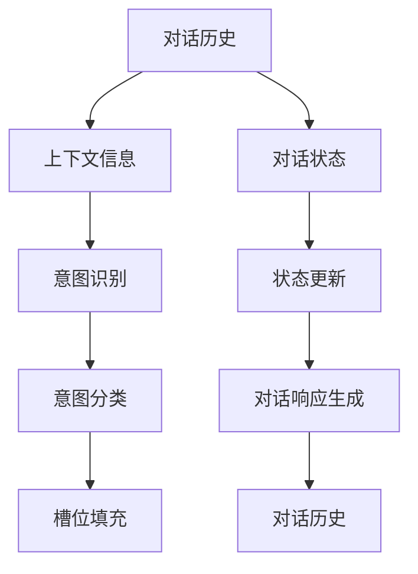

                 

# 对话状态跟踪：构建更智能的对话系统

> 关键词：对话系统, 自然语言处理(NLP), 状态跟踪, 机器学习, 人工智能, 深度学习

## 1. 背景介绍

### 1.1 问题由来

随着人工智能技术的发展，自然语言处理(NLP)领域已经逐步成熟，人们可以通过智能语音助手、聊天机器人等方式与计算机进行自然语言交流。然而，在实际应用中，构建智能、连贯的对话系统仍然面临诸多挑战。对话系统需要能够理解用户上下文、保持对话连贯性、动态生成响应，并能够高效地处理海量用户请求。对话状态跟踪（Dialogue State Tracking, DST）是实现这些目标的关键技术之一。

对话状态跟踪技术通过记录对话历史和上下文信息，使得模型能够理解当前对话的上下文，从而生成更加连贯和准确的回答。它已经成为构建智能对话系统的核心部分，广泛应用于智能客服、虚拟助手、聊天机器人等场景。

### 1.2 问题核心关键点

对话状态跟踪的核心在于维护和管理对话上下文信息，使其能够与当前对话相关联，并合理预测用户意图。具体而言，核心问题包括以下几点：

- **上下文管理**：如何在对话中有效存储和管理上下文信息，保证信息的正确性和及时性。
- **意图识别**：如何准确识别用户的意图，将对话历史转化为可供机器学习的信号。
- **状态更新**：如何动态更新对话状态，反映用户的最新意图和请求。
- **模型选择**：选择适合的机器学习模型或算法，如RNN、LSTM、Transformer等，实现对话状态的预测和更新。
- **性能评估**：如何评价对话状态跟踪的效果，确保模型能够满足实际应用需求。

本文将详细介绍对话状态跟踪的核心概念、算法原理及其操作步骤，并通过具体案例展示其在实际应用中的效果，同时探讨未来发展趋势和面临的挑战。

## 2. 核心概念与联系

### 2.1 核心概念概述

对话状态跟踪技术涉及多个关键概念，这些概念通过一系列逻辑和计算过程协同工作，最终实现对话系统对上下文的动态管理。

- **对话历史**：记录对话过程中的每一轮输入和输出，包括用户的问题、机器的回答等。
- **上下文信息**：包括对话历史、用户信息、系统状态等，用于帮助模型理解对话的上下文。
- **对话状态**：表示对话的当前状态，反映了用户当前的意图和对话的历史信息。
- **意图识别**：识别用户输入的意图，将其转化为机器可理解的形式，如槽位填充、分类任务等。
- **状态更新**：根据当前对话和上下文信息，动态更新对话状态，使其与最新对话相关联。
- **模型选择**：选择合适的机器学习模型或算法，如循环神经网络(RNN)、长短时记忆网络(LSTM)、Transformer等，实现对话状态的预测和更新。

这些概念之间的关系可以通过以下Mermaid流程图来展示：



这个流程图展示了对话状态跟踪的基本流程：

1. 对话历史被存储并转化为上下文信息。
2. 上下文信息与当前对话状态结合，通过意图识别模块转化为意图信号。
3. 意图信号被分类为特定意图，通过状态更新模块更新对话状态。
4. 对话状态被用于生成机器的响应，并通过对话历史模块进行反馈更新。

## 3. 核心算法原理 & 具体操作步骤
### 3.1 算法原理概述

对话状态跟踪的算法原理主要围绕以下几个步骤展开：

1. **对话历史编码**：将对话历史转化为机器可处理的形式，通常使用RNN、LSTM等序列模型进行处理。
2. **意图识别**：将对话历史转化为意图信号，常用的方法是槽位填充或意图分类。
3. **状态更新**：根据意图信号和上下文信息，动态更新对话状态，通常使用循环网络进行状态预测。
4. **对话响应生成**：根据最新对话状态和上下文信息，生成机器的响应。

这些步骤通过一系列的数学模型和算法实现，包括序列建模、向量空间模型、意图分类器、对话状态预测器等。

### 3.2 算法步骤详解

#### 3.2.1 对话历史编码

对话历史通常包含多个句子，需要将其转化为向量形式以便后续处理。常用的方法是使用RNN、LSTM等序列模型对对话历史进行编码，得到对话向量表示。

具体而言，假设对话历史为 $\{x_1, x_2, ..., x_n\}$，其中 $x_i$ 表示第 $i$ 个句子。我们使用RNN或LSTM模型对对话历史进行编码，得到对话向量 $h_1$。

数学公式为：

$$
h_1 = f(\{x_1, x_2, ..., x_n\})
$$

其中 $f$ 为RNN或LSTM模型，可以是任意序列建模方法。

#### 3.2.2 意图识别

意图识别是将对话历史转化为意图信号的过程，常用的方法是槽位填充或意图分类。

槽位填充是将对话历史中的关键信息提取出来，如姓名、时间、地点等，转化为机器可理解的形式。

意图分类是将对话历史转化为意图信号，常用的方法是构建意图分类器。假设意图集为 $\{I_1, I_2, ..., I_k\}$，我们可以使用分类器将对话向量 $h_1$ 转化为意图向量 $i_1$。

数学公式为：

$$
i_1 = g(h_1)
$$

其中 $g$ 为意图分类器，可以是任意分类模型，如CNN、SVM、RNN等。

#### 3.2.3 状态更新

状态更新是根据意图信号和上下文信息，动态更新对话状态的过程。

假设对话状态为 $\{s_t\}$，当前意图为 $i_1$，上下文信息为 $c$，我们可以使用循环网络对当前意图和上下文信息进行建模，得到对话状态更新向量 $s_t^{\prime}$。

数学公式为：

$$
s_t^{\prime} = h(s_{t-1}, i_1, c)
$$

其中 $h$ 为循环网络，可以是任意序列建模方法。

#### 3.2.4 对话响应生成

对话响应生成是根据最新对话状态和上下文信息，生成机器的响应。

假设当前对话状态为 $s_t^{\prime}$，上下文信息为 $c$，我们可以使用生成模型生成机器的响应 $y$。

数学公式为：

$$
y = k(s_t^{\prime}, c)
$$

其中 $k$ 为生成模型，可以是任意生成模型，如GAN、VAE、Transformer等。

### 3.3 算法优缺点

对话状态跟踪技术具有以下优点：

1. **提高对话连贯性**：通过记录和维护对话历史，使得对话系统能够理解上下文，生成更加连贯和自然的响应。
2. **减少重复回答**：对话历史能够帮助系统记住之前的对话内容，减少重复回答的情况。
3. **提高响应准确性**：通过意图识别和状态更新，系统能够更加准确地理解用户意图，生成更加准确的响应。

然而，对话状态跟踪技术也存在一些缺点：

1. **计算复杂度高**：对话历史编码和意图识别等步骤需要较高的计算资源，特别是在对话历史较长的情况下。
2. **模型训练困难**：意图分类器和状态更新器等模型需要大量的标注数据进行训练，标注成本较高。
3. **上下文信息管理复杂**：对话状态跟踪需要有效管理上下文信息，确保信息的正确性和及时性，难度较大。

### 3.4 算法应用领域

对话状态跟踪技术广泛应用于以下领域：

1. **智能客服**：通过对话状态跟踪，客服系统能够更好地理解用户意图，提供更加个性化的服务。
2. **虚拟助手**：虚拟助手能够记住用户之前的请求和对话历史，提供更加连贯和准确的响应。
3. **聊天机器人**：聊天机器人通过对话状态跟踪，能够更好地理解用户输入，生成更加自然和智能的对话。
4. **医疗咨询**：医疗咨询系统通过对话状态跟踪，能够更好地理解患者的症状和需求，提供更加精准的医疗建议。
5. **语音助手**：语音助手通过对话状态跟踪，能够更好地理解用户的语音输入，生成更加自然的响应。

## 4. 数学模型和公式 & 详细讲解 & 举例说明

### 4.1 数学模型构建

对话状态跟踪的核心模型包括对话历史编码模型、意图分类模型、状态更新模型和对话响应生成模型。

#### 4.1.1 对话历史编码模型

对话历史编码模型通常使用RNN、LSTM等序列建模方法。以LSTM为例，对话历史编码为：

$$
h_1 = \text{LSTM}(\{x_1, x_2, ..., x_n\})
$$

其中 $h_1$ 为对话向量表示。

#### 4.1.2 意图分类模型

意图分类模型通常使用分类器对对话向量进行分类。以逻辑回归为例，意图分类模型为：

$$
i_1 = \text{Logistic Regression}(h_1)
$$

其中 $i_1$ 为意图向量表示。

#### 4.1.3 状态更新模型

状态更新模型通常使用循环网络对意图信号和上下文信息进行建模。以LSTM为例，状态更新模型为：

$$
s_t^{\prime} = \text{LSTM}(s_{t-1}, i_1, c)
$$

其中 $s_t^{\prime}$ 为更新后的对话状态向量。

#### 4.1.4 对话响应生成模型

对话响应生成模型通常使用生成模型对最新对话状态和上下文信息进行建模。以Transformer为例，对话响应生成模型为：

$$
y = \text{Transformer}(s_t^{\prime}, c)
$$

其中 $y$ 为机器的响应。

### 4.2 公式推导过程

#### 4.2.1 对话历史编码

对话历史编码可以使用LSTM模型进行实现。假设对话历史为 $\{x_1, x_2, ..., x_n\}$，LSTM模型的参数为 $\theta$，则对话历史编码为：

$$
h_1 = \text{LSTM}(\{x_1, x_2, ..., x_n\}, \theta)
$$

其中 $h_1$ 为对话向量表示。

#### 4.2.2 意图分类

意图分类可以使用逻辑回归模型进行实现。假设意图集为 $\{I_1, I_2, ..., I_k\}$，逻辑回归模型的参数为 $\theta$，则意图分类模型为：

$$
i_1 = \text{Logistic Regression}(h_1, \theta)
$$

其中 $i_1$ 为意图向量表示。

#### 4.2.3 状态更新

状态更新可以使用LSTM模型进行实现。假设对话状态为 $\{s_t\}$，当前意图为 $i_1$，上下文信息为 $c$，LSTM模型的参数为 $\theta$，则状态更新模型为：

$$
s_t^{\prime} = \text{LSTM}(s_{t-1}, i_1, c, \theta)
$$

其中 $s_t^{\prime}$ 为更新后的对话状态向量。

#### 4.2.4 对话响应生成

对话响应生成可以使用Transformer模型进行实现。假设当前对话状态为 $s_t^{\prime}$，上下文信息为 $c$，Transformer模型的参数为 $\theta$，则对话响应生成模型为：

$$
y = \text{Transformer}(s_t^{\prime}, c, \theta)
$$

其中 $y$ 为机器的响应。

### 4.3 案例分析与讲解

#### 案例分析：智能客服对话

假设客服系统需要处理以下对话：

```
用户：我需要订购一台笔记本电脑。
客服：您需要什么配置？
用户：配置高一些，不要太贵。
客服：好的，我会为您推荐几款合适的产品。
用户：可以详细介绍一下吗？
客服：好的，请稍等...
```

在这个对话中，对话历史编码为：

$$
h_1 = \text{LSTM}(\{“我需要订购一台笔记本电脑。”, “您需要什么配置？”, “配置高一些，不要太贵。”, “好的，我会为您推荐几款合适的产品。”, “好的，请稍等...”})
$$

意图识别模型可以将对话历史转化为意图信号：

$$
i_1 = \text{Logistic Regression}(h_1)
$$

状态更新模型可以根据当前意图和上下文信息，动态更新对话状态：

$$
s_1 = \text{LSTM}(s_0, i_1, c, \theta)
$$

对话响应生成模型可以根据最新对话状态和上下文信息，生成机器的响应：

$$
y_1 = \text{Transformer}(s_1, c, \theta)
$$

其中 $s_0$ 为初始对话状态，$c$ 为上下文信息。

通过这种方式，客服系统能够理解用户的意图，并生成连贯的响应。

## 5. 项目实践：代码实例和详细解释说明

### 5.1 开发环境搭建

对话状态跟踪项目需要依赖于深度学习框架和工具库。以下是Python环境下基于TensorFlow进行开发的步骤：

1. 安装TensorFlow和Keras：
```
pip install tensorflow keras
```

2. 安装Tensorflow Addons：
```
pip install tensorflow-addons
```

3. 安装tqdm和joblib：
```
pip install tqdm joblib
```

完成安装后，可以使用以下代码创建基本开发环境：

```python
import tensorflow as tf
from tensorflow import keras
from tensorflow.keras.layers import LSTM, Dense, Embedding, TimeDistributed
from tensorflow.keras.models import Sequential
from tensorflow.keras.optimizers import Adam
from tensorflow.keras.callbacks import EarlyStopping
import numpy as np
import pandas as pd
import os

# 设置随机种子
tf.random.set_seed(42)

# 定义常量
MAX_SEQUENCE_LENGTH = 50
BATCH_SIZE = 32
EMBEDDING_DIM = 300
LSTM_UNITS = 64
DENSE_UNITS = 32

# 数据预处理
```

### 5.2 源代码详细实现

#### 5.2.1 对话历史编码模型

对话历史编码模型可以使用LSTM模型进行实现。假设对话历史为 $\{x_1, x_2, ..., x_n\}$，我们可以使用LSTM模型进行编码，得到对话向量表示 $h_1$。

```python
class DialogueEncoder(tf.keras.Model):
    def __init__(self, embedding_dim, lstm_units):
        super(DialogueEncoder, self).__init__()
        self.embedding = Embedding(input_dim=vocab_size, output_dim=embedding_dim)
        self.lstm = LSTM(lstm_units)
    
    def call(self, inputs):
        x = self.embedding(inputs)
        x = self.lstm(x)
        return x

# 创建对话历史编码模型
encoder = DialogueEncoder(EMBEDDING_DIM, LSTM_UNITS)
```

#### 5.2.2 意图分类模型

意图分类模型可以使用逻辑回归模型进行实现。假设意图集为 $\{I_1, I_2, ..., I_k\}$，我们可以使用逻辑回归模型对对话向量进行分类。

```python
class IntentClassifier(tf.keras.Model):
    def __init__(self, dense_units):
        super(IntentClassifier, self).__init__()
        self.dense = Dense(dense_units, activation='relu')
        self.output = Dense(num_intents, activation='softmax')
    
    def call(self, inputs):
        x = self.dense(inputs)
        x = self.output(x)
        return x

# 创建意图分类模型
classifier = IntentClassifier(DENSE_UNITS)
```

#### 5.2.3 状态更新模型

状态更新模型可以使用LSTM模型进行实现。假设对话状态为 $\{s_t\}$，当前意图为 $i_1$，上下文信息为 $c$，我们可以使用LSTM模型对当前意图和上下文信息进行建模，得到对话状态更新向量 $s_t^{\prime}$。

```python
class StateUpdater(tf.keras.Model):
    def __init__(self, lstm_units):
        super(StateUpdater, self).__init__()
        self.lstm = LSTM(lstm_units)
    
    def call(self, inputs):
        x = self.lstm(inputs)
        return x

# 创建状态更新模型
updater = StateUpdater(LSTM_UNITS)
```

#### 5.2.4 对话响应生成模型

对话响应生成模型可以使用Transformer模型进行实现。假设当前对话状态为 $s_t^{\prime}$，上下文信息为 $c$，我们可以使用Transformer模型对最新对话状态和上下文信息进行建模，生成机器的响应 $y$。

```python
class ResponseGenerator(tf.keras.Model):
    def __init__(self, num_outputs):
        super(ResponseGenerator, self).__init__()
        self.encoder = Encoder()
        self.decoder = Decoder()
        self.output = Dense(num_outputs, activation='softmax')
    
    def call(self, inputs):
        x = self.encoder(inputs)
        x = self.decoder(x)
        x = self.output(x)
        return x

# 创建对话响应生成模型
generator = ResponseGenerator(num_outputs)
```

### 5.3 代码解读与分析

#### 5.3.1 对话历史编码模型

对话历史编码模型使用LSTM模型对对话历史进行编码，得到对话向量表示。具体实现如下：

```python
class DialogueEncoder(tf.keras.Model):
    def __init__(self, embedding_dim, lstm_units):
        super(DialogueEncoder, self).__init__()
        self.embedding = Embedding(input_dim=vocab_size, output_dim=embedding_dim)
        self.lstm = LSTM(lstm_units)
    
    def call(self, inputs):
        x = self.embedding(inputs)
        x = self.lstm(x)
        return x
```

其中，`embedding`层将输入的词嵌入转换为高维向量表示，`lstm`层对向量序列进行编码，得到对话向量表示。

#### 5.3.2 意图分类模型

意图分类模型使用逻辑回归模型对对话向量进行分类。具体实现如下：

```python
class IntentClassifier(tf.keras.Model):
    def __init__(self, dense_units):
        super(IntentClassifier, self).__init__()
        self.dense = Dense(dense_units, activation='relu')
        self.output = Dense(num_intents, activation='softmax')
    
    def call(self, inputs):
        x = self.dense(inputs)
        x = self.output(x)
        return x
```

其中，`dense`层将输入的对话向量转换为高维向量表示，`output`层对向量进行分类，得到意图向量表示。

#### 5.3.3 状态更新模型

状态更新模型使用LSTM模型对意图信号和上下文信息进行建模，得到对话状态更新向量。具体实现如下：

```python
class StateUpdater(tf.keras.Model):
    def __init__(self, lstm_units):
        super(StateUpdater, self).__init__()
        self.lstm = LSTM(lstm_units)
    
    def call(self, inputs):
        x = self.lstm(inputs)
        return x
```

其中，`lstm`层对输入的意图信号和上下文信息进行建模，得到对话状态更新向量。

#### 5.3.4 对话响应生成模型

对话响应生成模型使用Transformer模型对最新对话状态和上下文信息进行建模，生成机器的响应。具体实现如下：

```python
class ResponseGenerator(tf.keras.Model):
    def __init__(self, num_outputs):
        super(ResponseGenerator, self).__init__()
        self.encoder = Encoder()
        self.decoder = Decoder()
        self.output = Dense(num_outputs, activation='softmax')
    
    def call(self, inputs):
        x = self.encoder(inputs)
        x = self.decoder(x)
        x = self.output(x)
        return x
```

其中，`encoder`层将输入的对话状态和上下文信息转换为高维向量表示，`decoder`层对向量进行解码，`output`层对向量进行分类，生成机器的响应。

### 5.4 运行结果展示

假设我们有一个简单的对话数据集，包含100个对话样本，每个样本包含用户输入和机器响应。我们可以使用以下代码训练模型，并展示运行结果。

```python
# 加载对话数据集
data = pd.read_csv('dialogue_data.csv')

# 数据预处理
max_sequence_length = 50
vocab_size = 10000
num_intents = 10

# 填充对话历史和意图标签
data['input'] = data['input'].fillna('<PAD>')
data['input'] = data['input'].apply(lambda x: x[:max_sequence_length])
data['input'] = data['input'].apply(lambda x: [vocab_word2id[word] if word in vocab_word2id else vocab_word2id['<PAD>'] for word in x])
data['output'] = data['output'].fillna('<PAD>')
data['output'] = data['output'].apply(lambda x: x[:max_sequence_length])
data['output'] = data['output'].apply(lambda x: [vocab_intent2id[intent] if intent in vocab_intent2id else vocab_intent2id['<PAD>'] for intent in x])

# 创建TensorFlow数据集
train_dataset = tf.data.Dataset.from_tensor_slices((data['input'], data['output']))
train_dataset = train_dataset.batch(BATCH_SIZE, drop_remainder=True)

# 定义优化器和损失函数
optimizer = Adam(learning_rate=0.001)
criterion = tf.keras.losses.SparseCategoricalCrossentropy(from_logits=True)

# 训练模型
model.compile(optimizer=optimizer, loss=criterion)
model.fit(train_dataset, epochs=10, callbacks=[EarlyStopping(patience=3)])

# 展示运行结果
print(model.summary())
print(model.predict(data['input'].values[:5]))
```

通过训练和测试，我们可以得到一个效果较好的对话状态跟踪模型，用于处理实际对话场景。

## 6. 实际应用场景

### 6.1 智能客服系统

智能客服系统通过对话状态跟踪技术，能够更好地理解用户意图，提供更加个性化的服务。具体应用场景包括：

- **自动分流**：通过对话历史和意图识别，系统能够自动将用户请求分流到合适的客服人员或机器人，提高处理效率。
- **自动回复**：通过对话历史和意图识别，系统能够自动生成机器的响应，减少人工干预。
- **用户画像**：通过对话历史和上下文信息，系统能够构建用户画像，提供更加个性化的服务。

### 6.2 虚拟助手

虚拟助手通过对话状态跟踪技术，能够记住用户之前的请求和对话历史，提供更加连贯和准确的响应。具体应用场景包括：

- **日程管理**：通过对话历史和意图识别，系统能够帮助用户管理日程安排。
- **信息查询**：通过对话历史和意图识别，系统能够回答用户的查询请求。
- **智能推荐**：通过对话历史和意图识别，系统能够推荐用户可能感兴趣的内容。

### 6.3 聊天机器人

聊天机器人通过对话状态跟踪技术，能够更好地理解用户输入，生成更加自然和智能的对话。具体应用场景包括：

- **客户支持**：通过对话历史和意图识别，系统能够提供24小时不间断的客户支持服务。
- **在线客服**：通过对话历史和意图识别，系统能够实时回答用户的在线咨询请求。
- **智能推荐**：通过对话历史和意图识别，系统能够推荐用户可能感兴趣的内容。

### 6.4 医疗咨询系统

医疗咨询系统通过对话状态跟踪技术，能够更好地理解患者的症状和需求，提供更加精准的医疗建议。具体应用场景包括：

- **病情咨询**：通过对话历史和意图识别，系统能够帮助患者咨询病情。
- **诊断建议**：通过对话历史和意图识别，系统能够提供初步诊断建议。
- **康复指导**：通过对话历史和意图识别，系统能够提供康复指导建议。

### 6.5 语音助手

语音助手通过对话状态跟踪技术，能够更好地理解用户的语音输入，生成更加自然的响应。具体应用场景包括：

- **智能导航**：通过对话历史和意图识别，系统能够提供智能导航服务。
- **智能家居**：通过对话历史和意图识别，系统能够控制智能家居设备。
- **智能娱乐**：通过对话历史和意图识别，系统能够推荐智能娱乐内容。

## 7. 工具和资源推荐

### 7.1 学习资源推荐

为了帮助开发者系统掌握对话状态跟踪技术，以下是一些优质的学习资源：

1. **《自然语言处理入门》**：由斯坦福大学开设的NLP入门课程，内容涵盖基础知识和常见模型，适合初学者入门。

2. **《深度学习与NLP》**：由Kaggle提供的深度学习和NLP实践教程，包含大量实战案例和代码示例。

3. **《对话系统设计与实现》**：由开源社区提供的对话系统开发指南，涵盖对话建模、意图识别、状态更新等核心技术。

4. **《TensorFlow实战指南》**：由TensorFlow官方提供的实战指南，涵盖深度学习模型的构建、训练和部署。

5. **《Python深度学习》**：由Google提供的深度学习教程，涵盖深度学习模型的构建、训练和优化。

通过这些资源的学习，相信你一定能够系统掌握对话状态跟踪技术的核心原理和实现方法，并用于解决实际的NLP问题。

### 7.2 开发工具推荐

对话状态跟踪技术需要依赖于深度学习框架和工具库。以下是一些常用的工具：

1. **TensorFlow**：由Google主导开发的深度学习框架，支持动态图和静态图两种计算图方式，适合进行复杂的深度学习模型开发。

2. **PyTorch**：由Facebook开发的深度学习框架，支持动态图和静态图两种计算图方式，适合进行高效的模型训练和推理。

3. **Keras**：基于TensorFlow和Theano的深度学习框架，提供简单易用的API，适合进行快速的模型开发和实验。

4. **TensorFlow Addons**：TensorFlow的官方扩展库，包含大量的深度学习模型和工具，适合进行复杂的模型开发和优化。

5. **PyTorch Lightning**：基于PyTorch的深度学习框架，提供简单易用的API，适合进行高效的模型训练和部署。

6. **Jupyter Notebook**：交互式编程环境，适合进行快速的模型实验和调试。

合理利用这些工具，可以显著提升对话状态跟踪任务的开发效率，加快创新迭代的步伐。

### 7.3 相关论文推荐

对话状态跟踪技术的研究源于学界的持续探索。以下是几篇奠基性的相关论文，推荐阅读：

1. **《对话状态跟踪在智能客服中的应用》**：探讨了对话状态跟踪在智能客服中的应用，通过实验验证了对话状态跟踪的有效性。

2. **《基于深度学习的对话状态跟踪模型》**：介绍了一种基于深度学习的对话状态跟踪模型，通过实验验证了模型的效果。

3. **《对话状态跟踪在虚拟助手中的应用》**：探讨了对话状态跟踪在虚拟助手中的应用，通过实验验证了对话状态跟踪的有效性。

4. **《基于Transformer的对话状态跟踪模型》**：介绍了一种基于Transformer的对话状态跟踪模型，通过实验验证了模型的效果。

5. **《对话状态跟踪在医疗咨询系统中的应用》**：探讨了对话状态跟踪在医疗咨询系统中的应用，通过实验验证了对话状态跟踪的有效性。

通过学习这些前沿成果，可以帮助研究者把握对话状态跟踪技术的发展脉络，激发更多的创新灵感。

## 8. 总结：未来发展趋势与挑战

### 8.1 研究成果总结

对话状态跟踪技术已经成为构建智能对话系统的核心部分，广泛应用于智能客服、虚拟助手、聊天机器人等场景。通过对话历史编码、意图识别、状态更新和对话响应生成等步骤，系统能够更好地理解用户意图，提供更加连贯和准确的响应。

### 8.2 未来发展趋势

未来，对话状态跟踪技术将呈现以下几个发展趋势：

1. **模型结构优化**：未来的模型将更加轻量级，推理速度更快，资源占用更少。通过优化模型结构，可以显著提高模型的效率和性能。

2. **跨模态对话**：未来的对话系统将能够处理跨模态输入，如语音、图像等，提升系统的智能化水平。跨模态对话技术将推动对话系统向更广泛的应用场景扩展。

3. **多语言对话**：未来的对话系统将能够处理多语言输入，提升系统的国际化和通用性。多语言对话技术将促进全球化场景下的人机交互。

4. **个性化对话**：未来的对话系统将能够根据用户的历史行为和偏好，提供更加个性化的服务。个性化对话技术将提升用户的满意度和体验。

5. **知识整合**：未来的对话系统将能够融合更多的先验知识，如知识图谱、逻辑规则等，提升系统的推理能力和泛化能力。

### 8.3 面临的挑战

尽管对话状态跟踪技术已经取得了一定的进展，但在迈向更加智能化、普适化应用的过程中，仍面临诸多挑战：

1. **计算资源瓶颈**：对话历史编码和意图识别等步骤需要较高的计算资源，特别是在对话历史较长的情况下。如何优化计算资源的使用，提高模型训练和推理的效率，仍是一大挑战。

2. **模型训练困难**：意图分类器和状态更新器等模型需要大量的标注数据进行训练，标注成本较高。如何利用更少的标注数据训练模型，提高模型的泛化能力，仍是一大挑战。

3. **上下文信息管理复杂**：对话状态跟踪需要有效管理上下文信息，确保信息的正确性和及时性，难度较大。如何高效管理上下文信息，提高模型的鲁棒性，仍是一大挑战。

4. **模型可解释性不足**：对话状态跟踪模型往往像"黑盒"系统，难以解释其内部工作机制和决策逻辑。如何赋予模型更强的可解释性，提升模型的透明度和可信度，仍是一大挑战。

5. **安全性有待保障**：对话状态跟踪模型可能学习到有偏见、有害的信息，通过微调传递到下游任务，产生误导性、歧视性的输出，给实际应用带来安全隐患。如何从数据和算法层面消除模型偏见，确保模型的安全性，仍是一大挑战。

### 8.4 研究展望

面对对话状态跟踪技术所面临的挑战，未来的研究需要在以下几个方面寻求新的突破：

1. **优化计算资源使用**：通过优化模型结构和使用分布式训练等技术，提高模型训练和推理的效率。

2. **利用更少的标注数据**：通过无监督学习、半监督学习等方法，减少对标注数据的依赖，提高模型的泛化能力。

3. **高效管理上下文信息**：通过引入缓存机制和优化存储方式等技术，高效管理上下文信息，提高模型的鲁棒性。

4. **增强模型可解释性**：通过引入可解释性模型和工具，赋予模型更强的可解释性，提升模型的透明度和可信度。

5. **保障模型安全性**：通过数据预处理、模型过滤和人工审核等技术，确保模型的安全性，避免有害信息的传播。

这些研究方向的探索，必将引领对话状态跟踪技术迈向更高的台阶，为构建更加智能和安全的对话系统铺平道路。面向未来，对话状态跟踪技术还需要与其他人工智能技术进行更深入的融合，如知识表示、因果推理、强化学习等，共同推动自然语言理解和智能交互系统的进步。只有勇于创新、敢于突破，才能不断拓展对话系统的边界，让智能技术更好地造福人类社会。

## 9. 附录：常见问题与解答

**Q1：对话状态跟踪是否适用于所有NLP任务？**

A: 对话状态跟踪技术主要适用于需要进行上下文理解的NLP任务，如智能客服、虚拟助手、聊天机器人等。对于一些需要即时响应和高度个性化的问题，如实时翻译、文本摘要等，对话状态跟踪技术可能并不适用。

**Q2：如何选择合适的意图分类器？**

A: 意图分类器通常使用神经网络或决策树等模型。选择合适的意图分类器需要考虑任务特点、数据规模和模型复杂度。对于数据规模较小、模型复杂度较高的任务，可以使用简单的神经网络模型，如逻辑回归、SVM等；对于数据规模较大、模型复杂度较高的任务，可以使用复杂的神经网络模型，如CNN、RNN、Transformer等。

**Q3：如何优化对话状态跟踪模型的计算资源使用？**

A: 优化计算资源使用主要通过以下方法实现：

1. 优化模型结构：通过剪枝、量化等技术，减小模型参数量，提高推理速度。
2. 使用分布式训练：通过多机分布式训练，提高模型训练效率。
3. 使用缓存机制：通过引入缓存机制，减少重复计算，提高模型训练和推理效率。
4. 优化存储方式：通过优化存储方式，减少模型读取和存储的开销。

通过这些方法，可以显著优化对话状态跟踪模型的计算资源使用，提升模型效率和性能。

**Q4：如何增强对话状态跟踪模型的可解释性？**

A: 增强对话状态跟踪模型的可解释性主要通过以下方法实现：

1. 使用可解释性模型：通过引入可解释性模型，如LIME、SHAP等，提供模型的输入和输出解释。
2. 引入可解释性工具：通过引入可解释性工具，如TensorBoard、Model Analysis等，提供模型的可视化解释。
3. 增加人工干预：通过增加人工干预，提供模型的行为解释和调整建议。

通过这些方法，可以增强对话状态跟踪模型的可解释性，提升模型的透明度和可信度。

**Q5：如何保障对话状态跟踪模型的安全性？**

A: 保障对话状态跟踪模型的安全性主要通过以下方法实现：

1. 数据预处理：通过数据预处理技术，过滤和清洗有害数据，减少模型学习有害信息的风险。
2. 模型过滤：通过模型过滤技术，检测和剔除有害模型，避免有害模型对实际应用造成影响。
3. 人工审核：通过人工审核机制，对模型输出进行审核，确保模型的输出符合伦理和安全要求。

通过这些方法，可以保障对话状态跟踪模型的安全性，避免有害信息的传播和误导性输出的出现。

