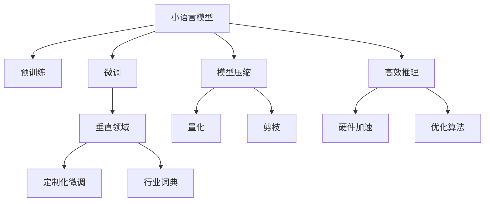

                 

# 小语言模型的应用前景:垂直领域的机遇

> 关键词：小语言模型,垂直领域,应用场景,行业定制,微调技术,自然语言处理(NLP),模型压缩,高效推理

## 1. 背景介绍

### 1.1 问题由来
近年来，随着深度学习技术的快速发展，大型预训练语言模型如BERT、GPT-3在自然语言处理(NLP)领域取得了显著进步。这些模型通过在大规模无标签文本语料上进行预训练，学习到了丰富的语言知识和常识，能够适应多种自然语言处理任务。

然而，尽管这些大模型在通用任务上表现优异，但它们也存在一些限制：

- **模型规模庞大**：典型的预训练语言模型参数动辄上亿，使得部署和推理成本高昂。
- **资源需求高**：需要高性能计算资源进行训练和推理，普通企业和开发者难以负担。
- **难以定制**：通用大模型无法很好地适应特定领域的需求，需要进行大量的任务定制化工作。

为解决这些问题，小语言模型（Small Language Models, SLMs）应运而生。SLMs通常具有较小的参数量，能够更快地训练和推理，同时可以针对垂直领域进行更精细的微调。本文将重点探讨小语言模型在垂直领域中的应用前景及其机遇。

## 2. 核心概念与联系

### 2.1 核心概念概述

为了更好地理解小语言模型的应用前景，我们需要了解几个核心概念：

- **小语言模型（Small Language Models, SLMs）**：指参数规模较小的语言模型，通常参数数量在百万级别，具有较快的训练和推理速度，能够灵活适应垂直领域的需求。
- **微调（Fine-Tuning）**：指在预训练模型的基础上，使用下游任务的少量标注数据，通过有监督学习优化模型在特定任务上的性能。
- **垂直领域（Vertical Domain）**：指特定的行业或专业领域，如金融、医疗、教育等。这些领域通常具有特定的语言特点和术语。
- **模型压缩（Model Compression）**：通过量化、剪枝等方法减小模型大小，提高推理效率。
- **高效推理（Efficient Inference）**：优化推理过程，减少计算量和内存消耗，提升服务速度和稳定性。

这些概念之间的逻辑关系可以通过以下Mermaid流程图来展示：



这个流程图展示从小语言模型到垂直领域应用的核心步骤：

1. 小语言模型通过预训练获得基础能力。
2. 微调优化模型在特定垂直领域的表现。
3. 通过模型压缩和高效推理提升模型性能和应用效率。

## 3. 核心算法原理 & 具体操作步骤

### 3.1 算法原理概述

小语言模型在垂直领域的应用，主要基于以下算法原理：

- **微调技术**：在预训练模型的基础上，使用垂直领域的少量标注数据进行微调，使模型在特定任务上表现优异。
- **模型压缩**：通过量化、剪枝等方法减小模型规模，提升推理速度和资源利用率。
- **高效推理**：通过硬件加速、优化算法等手段，优化推理过程，减少计算量和内存消耗，提高服务效率。

### 3.2 算法步骤详解

以下是小语言模型在垂直领域应用的详细步骤：

**Step 1: 准备预训练模型和数据集**
- 选择合适的预训练模型作为初始化参数，如RoBERTa、XLNet等。
- 准备垂直领域的标注数据集，划分为训练集、验证集和测试集。通常需要确保数据集与预训练数据的领域分布一致。

**Step 2: 添加任务适配层**
- 根据垂直领域的特定任务，设计合适的输出层和损失函数。例如，对于分类任务，添加线性分类器；对于生成任务，使用解码器输出概率分布。
- 使用模型适配工具，如HuggingFace的`transformers`库，将预训练模型转换为小模型，并添加任务适配层。

**Step 3: 微调模型**
- 选择适当的优化算法（如Adam、SGD等），并设置合适的学习率、批大小、迭代轮数等超参数。
- 应用正则化技术，如L2正则、Dropout、Early Stopping等，防止模型过拟合。
- 在垂直领域的标注数据集上进行微调训练。

**Step 4: 模型压缩**
- 使用量化、剪枝等方法，减小模型大小，降低推理内存和计算资源消耗。例如，使用TensorFlow的`tf.quantization`进行量化，使用ONNX剪枝工具进行剪枝。

**Step 5: 高效推理**
- 采用硬件加速技术，如TensorRT、ONNX Runtime等，优化推理速度。
- 优化模型结构和推理算法，例如，使用深度可分离卷积（Depthwise Separable Convolution）和通道注意力（Channel Attention）等优化算法，减少计算量。

**Step 6: 部署应用**
- 将微调后的模型保存为轻量级模型文件，如TensorFlow Lite、ONNX格式，便于在不同平台上部署。
- 集成模型到实际应用系统中，如Web应用、移动应用、嵌入式设备等。

### 3.3 算法优缺点

小语言模型在垂直领域的应用具有以下优点：

- **快速训练和推理**：模型规模较小，训练和推理速度快，适合对实时性要求高的应用场景。
- **资源需求低**：硬件需求较低，易于在普通PC上部署和推理。
- **垂直领域定制化**：针对特定垂直领域，进行精细化微调，适应领域特定的语言特点和术语。
- **低成本**：相比于大型预训练模型，小语言模型的训练和推理成本更低。

同时，这些方法也存在一定的局限性：

- **模型规模限制**：由于模型规模较小，可能无法覆盖通用语言模型的广泛知识。
- **数据需求高**：微调需要垂直领域的标注数据，数据获取和标注成本较高。
- **性能有限**：在小规模数据上进行微调，模型的泛化能力可能有限，难以处理复杂任务。

尽管存在这些局限性，但小语言模型仍然具备很大的应用潜力，特别是在对实时性、成本和资源要求较高的垂直领域。

### 3.4 算法应用领域

小语言模型在垂直领域的应用主要集中在以下几个方面：

- **医疗健康**：针对医疗领域的特定问题，如病历分析、药物研发等，进行小模型微调。医疗领域的语言特点和术语需要特别注意，以提高诊断和治疗的准确性。
- **金融保险**：针对金融领域的特定任务，如舆情分析、风险评估等，进行小模型微调。金融领域的文本和数据结构复杂，需要适应领域的特殊需求。
- **法律合规**：针对法律领域的特定任务，如合同生成、法律咨询等，进行小模型微调。法律领域的术语和技术细节要求高，需要精确的模型输出。
- **教育培训**：针对教育领域的特定问题，如作业批改、学习建议等，进行小模型微调。教育领域的语言和问题类型多样，需要灵活适应。
- **智能客服**：针对客户服务领域的具体问题，如问题解答、情感分析等，进行小模型微调。智能客服需要快速响应客户需求，实时处理对话。
- **物联网（IoT）**：针对物联网设备的文本处理需求，进行小模型微调。物联网设备对实时性和资源消耗有限制，需要轻量级模型。

## 4. 数学模型和公式 & 详细讲解 & 举例说明

### 4.1 数学模型构建

假设小语言模型为 $M_{\theta}$，其中 $\theta$ 为模型参数。针对垂直领域的标注数据集 $D=\{(x_i,y_i)\}_{i=1}^N, x_i \in \mathcal{X}, y_i \in \mathcal{Y}$。

定义模型 $M_{\theta}$ 在数据样本 $(x,y)$ 上的损失函数为 $\ell(M_{\theta}(x),y)$，则在数据集 $D$ 上的经验风险为：

$$
\mathcal{L}(\theta) = \frac{1}{N} \sum_{i=1}^N \ell(M_{\theta}(x_i),y_i)
$$

微调的优化目标是最小化经验风险，即找到最优参数：

$$
\theta^* = \mathop{\arg\min}_{\theta} \mathcal{L}(\theta)
$$

在实践中，我们通常使用基于梯度的优化算法（如SGD、Adam等）来近似求解上述最优化问题。设 $\eta$ 为学习率，$\lambda$ 为正则化系数，则参数的更新公式为：

$$
\theta \leftarrow \theta - \eta \nabla_{\theta}\mathcal{L}(\theta) - \eta\lambda\theta
$$

其中 $\nabla_{\theta}\mathcal{L}(\theta)$ 为损失函数对参数 $\theta$ 的梯度，可通过反向传播算法高效计算。

### 4.2 公式推导过程

以下我们以医疗领域的文本分类任务为例，推导交叉熵损失函数及其梯度的计算公式。

假设模型 $M_{\theta}$ 在输入 $x$ 上的输出为 $\hat{y}=M_{\theta}(x) \in [0,1]$，表示样本属于某类疾病的概率。真实标签 $y \in \{0,1\}$。则二分类交叉熵损失函数定义为：

$$
\ell(M_{\theta}(x),y) = -[y\log \hat{y} + (1-y)\log (1-\hat{y})]
$$

将其代入经验风险公式，得：

$$
\mathcal{L}(\theta) = -\frac{1}{N}\sum_{i=1}^N [y_i\log M_{\theta}(x_i)+(1-y_i)\log(1-M_{\theta}(x_i))]
$$

根据链式法则，损失函数对参数 $\theta_k$ 的梯度为：

$$
\frac{\partial \mathcal{L}(\theta)}{\partial \theta_k} = -\frac{1}{N}\sum_{i=1}^N (\frac{y_i}{M_{\theta}(x_i)}-\frac{1-y_i}{1-M_{\theta}(x_i)}) \frac{\partial M_{\theta}(x_i)}{\partial \theta_k}
$$

其中 $\frac{\partial M_{\theta}(x_i)}{\partial \theta_k}$ 可进一步递归展开，利用自动微分技术完成计算。

### 4.3 案例分析与讲解

以医疗领域的文本分类任务为例，展示小语言模型的微调过程：

**数据准备**
- 收集医疗领域的标注数据集，如病历文本和疾病标签。
- 对文本进行分词和向量化，使用RoBERTa等预训练模型进行编码。

**模型微调**
- 使用RoBERTa等小语言模型作为初始化参数。
- 添加分类器输出层，使用二分类交叉熵损失函数。
- 在标注数据集上进行微调训练，设定合适的超参数，如学习率、批大小等。
- 应用正则化技术，如L2正则、Dropout等，防止过拟合。

**模型压缩和高效推理**
- 使用TensorFlow的`tf.quantization`进行量化，使用ONNX剪枝工具进行剪枝。
- 优化推理过程，使用TensorRT进行硬件加速，减少计算量和内存消耗。

通过上述步骤，可以得到适用于医疗领域文本分类的小语言模型，并在实际应用中取得不错的效果。

## 5. 项目实践：代码实例和详细解释说明

### 5.1 开发环境搭建

在进行微调实践前，我们需要准备好开发环境。以下是使用Python进行TensorFlow开发的环境配置流程：

1. 安装Anaconda：从官网下载并安装Anaconda，用于创建独立的Python环境。

2. 创建并激活虚拟环境：
```bash
conda create -n tf-env python=3.8 
conda activate tf-env
```

3. 安装TensorFlow：根据CUDA版本，从官网获取对应的安装命令。例如：
```bash
conda install tensorflow
```

4. 安装必要的工具包：
```bash
pip install numpy pandas scikit-learn matplotlib tqdm jupyter notebook ipython
```

完成上述步骤后，即可在`tf-env`环境中开始微调实践。

### 5.2 源代码详细实现

下面我们以医疗领域的文本分类任务为例，给出使用TensorFlow进行小模型微调的Python代码实现。

首先，定义文本分类任务的数据处理函数：

```python
import tensorflow as tf
from tensorflow.keras.preprocessing.text import Tokenizer
from tensorflow.keras.preprocessing.sequence import pad_sequences

class MedicalTextDataset(tf.keras.preprocessing.text_dataset.TextDataset):
    def __init__(self, texts, labels, tokenizer, max_len=256):
        super().__init__(texts, labels, tokenizer, max_len=max_len)
```

然后，定义模型和优化器：

```python
from transformers import RoBERTaModel
from transformers import AutoTokenizer

model = RoBERTaModel.from_pretrained('roberta-base', output_hidden_states=True)
tokenizer = AutoTokenizer.from_pretrained('roberta-base')
max_len = 256
batch_size = 32
learning_rate = 2e-5
num_epochs = 5
```

接着，定义训练和评估函数：

```python
@tf.function
def train_step(texts, labels):
    with tf.GradientTape() as tape:
        outputs = model(texts, output_hidden_states=True)
        loss = tf.keras.losses.SparseCategoricalCrossentropy()(labels, outputs[1])
    gradients = tape.gradient(loss, model.trainable_variables)
    optimizer.apply_gradients(zip(gradients, model.trainable_variables))

def evaluate(texts, labels):
    model.eval()
    predictions = model(texts)
    labels = tf.reshape(labels, [predictions.shape[0]])
    loss = tf.keras.losses.SparseCategoricalCrossentropy()(labels, predictions[1])
    return loss
```

最后，启动训练流程并在测试集上评估：

```python
dataset = MedicalTextDataset(train_texts, train_labels, tokenizer, max_len=max_len)
train_dataset = dataset.shuffle(buffer_size=1024).batch(batch_size)
val_dataset = dataset.shuffle(buffer_size=1024).batch(batch_size)
test_dataset = dataset.shuffle(buffer_size=1024).batch(batch_size)

for epoch in range(num_epochs):
    for text, label in train_dataset:
        train_step(text, label)
    val_loss = evaluate(val_dataset)
    print(f"Epoch {epoch+1}, validation loss: {val_loss.numpy():.4f}")
    
print(f"Final validation loss: {val_loss.numpy():.4f}")
```

以上就是使用TensorFlow对小语言模型进行医疗领域文本分类任务微调的完整代码实现。可以看到，通过TensorFlow的高级API，微调过程变得简单高效。

### 5.3 代码解读与分析

让我们再详细解读一下关键代码的实现细节：

**MedicalTextDataset类**：
- `__init__`方法：初始化文本、标签、分词器等关键组件，继承自`TextDataset`类，并设定最大序列长度。

**RoBERTaModel和AutoTokenizer**：
- 使用HuggingFace的`transformers`库，加载RoBERTa预训练模型和分词器，以便进行微调。

**train_step函数**：
- 定义了微调函数，使用`tf.GradientTape`记录梯度，并使用`optimizer`更新模型参数。
- 使用`tf.keras.losses.SparseCategoricalCrossentropy`计算交叉熵损失。

**evaluate函数**：
- 定义了评估函数，计算模型在验证集上的损失。

**训练流程**：
- 对数据进行批处理，并在每个epoch内迭代训练和验证，输出验证集损失。
- 在最后输出最终验证集损失。

可以看到，TensorFlow的高级API使得小语言模型的微调过程变得简洁高效，开发者可以将更多精力放在任务适配和模型优化上。

## 6. 实际应用场景

### 6.1 智能客服系统

小语言模型在智能客服系统的构建中具有广泛的应用前景。传统客服系统依赖于人工客服，成本高、效率低，且服务质量难以保证。而小语言模型可以通过微调快速适应垂直领域的语言特点和术语，提供7x24小时不间断服务，快速响应客户咨询，生成自然流畅的回答。

在技术实现上，可以收集企业内部的历史客服对话记录，将问题和最佳答复构建成监督数据，在此基础上对小语言模型进行微调。微调后的模型能够自动理解客户意图，匹配最合适的答案模板进行回复。对于客户提出的新问题，还可以接入检索系统实时搜索相关内容，动态生成回答。

### 6.2 金融舆情监测

金融领域对数据实时性和准确性要求极高，传统的舆情监测系统往往依赖于人工干预，成本高、效率低。小语言模型可以通过微调快速适应金融领域的语言特点和术语，实时监测网络舆情，生成情感分析和舆情报告。

具体而言，可以收集金融领域相关的新闻、报道、评论等文本数据，并对其进行主题标注和情感标注。在此基础上对小语言模型进行微调，使其能够自动判断文本属于何种主题，情感倾向是正面、中性还是负面。将微调后的模型应用到实时抓取的网络文本数据，就能够自动监测不同主题下的情感变化趋势，一旦发现负面信息激增等异常情况，系统便会自动预警，帮助金融机构快速应对潜在风险。

### 6.3 个性化推荐系统

个性化推荐系统需要不断适应用户的兴趣变化，传统系统往往依赖于用户的历史行为数据，难以捕捉用户的实时兴趣。小语言模型可以通过微调快速适应用户的实时兴趣，并提供个性化的推荐内容。

在实践中，可以收集用户浏览、点击、评论、分享等行为数据，提取和用户交互的物品标题、描述、标签等文本内容。将文本内容作为模型输入，用户的后续行为（如是否点击、购买等）作为监督信号，在此基础上对小语言模型进行微调。微调后的模型能够从文本内容中准确把握用户的兴趣点。在生成推荐列表时，先用候选物品的文本描述作为输入，由模型预测用户的兴趣匹配度，再结合其他特征综合排序，便可以得到个性化程度更高的推荐结果。

### 6.4 未来应用展望

随着小语言模型和微调方法的不断发展，其在垂直领域的应用前景将更加广阔。

在智慧医疗领域，基于小语言模型的微调医疗问答、病历分析、药物研发等应用将提升医疗服务的智能化水平，辅助医生诊疗，加速新药开发进程。

在智能教育领域，小语言模型可应用于作业批改、学情分析、知识推荐等方面，因材施教，促进教育公平，提高教学质量。

在智慧城市治理中，小语言模型可应用于城市事件监测、舆情分析、应急指挥等环节，提高城市管理的自动化和智能化水平，构建更安全、高效的未来城市。

此外，在企业生产、社会治理、文娱传媒等众多领域，小语言模型微调也将不断涌现，为NLP技术带来新的突破。

## 7. 工具和资源推荐

### 7.1 学习资源推荐

为了帮助开发者系统掌握小语言模型微调的理论基础和实践技巧，这里推荐一些优质的学习资源：

1. **《深度学习与自然语言处理》（第二版）**：该书详细介绍了深度学习在NLP领域的应用，包括小语言模型和微调技术。

2. **《NLP with Transformers》**：该书由NLP领域的知名专家编写，介绍了Transformer架构和多种预训练语言模型的微调方法。

3. **Google TensorFlow官方文档**：该文档提供了TensorFlow的详细使用指南和API文档，是学习TensorFlow微调技术的最佳资源。

4. **HuggingFace官方文档**：该文档介绍了HuggingFace的`transformers`库，提供了多种预训练语言模型的微调样例代码。

5. **PyTorch官方文档**：该文档介绍了PyTorch的详细使用指南和API文档，是学习PyTorch微调技术的最佳资源。

通过对这些资源的学习实践，相信你一定能够快速掌握小语言模型微调的精髓，并用于解决实际的NLP问题。

### 7.2 开发工具推荐

高效的开发离不开优秀的工具支持。以下是几款用于小语言模型微调开发的常用工具：

1. **TensorFlow**：由Google主导开发的开源深度学习框架，生产部署方便，适合大规模工程应用。

2. **PyTorch**：基于Python的开源深度学习框架，灵活动态的计算图，适合快速迭代研究。

3. **TensorFlow Lite**：TensorFlow的移动端优化版本，适用于移动设备和嵌入式设备。

4. **ONNX**：开放神经网络交换格式，可以将不同框架训练的模型进行转换，方便部署和推理。

5. **ONNX Runtime**：ONNX的运行时环境，支持多种硬件加速，优化推理速度。

6. **TensorRT**：NVIDIA开发的深度学习推理平台，支持多种硬件加速，优化推理速度和资源利用率。

合理利用这些工具，可以显著提升小语言模型微调的开发效率，加快创新迭代的步伐。

### 7.3 相关论文推荐

小语言模型和微调技术的发展源于学界的持续研究。以下是几篇奠基性的相关论文，推荐阅读：

1. **《Attention is All You Need》**：提出Transformer结构，开启了NLP领域的预训练大模型时代。

2. **《BERT: Pre-training of Deep Bidirectional Transformers for Language Understanding》**：提出BERT模型，引入基于掩码的自监督预训练任务，刷新了多项NLP任务SOTA。

3. **《Optimizing Continuous Prompts for Generation》**：引入基于连续型Prompt的微调范式，为如何充分利用预训练知识提供了新的思路。

4. **《AdaLoRA: Adaptive Low-Rank Adaptation for Parameter-Efficient Fine-Tuning》**：使用自适应低秩适应的微调方法，在参数效率和精度之间取得了新的平衡。

5. **《Prompt Engineering for Text Generation》**：探索了不同Prompt设计对生成任务的影响，指导模型微调过程。

这些论文代表了大语言模型微调技术的发展脉络。通过学习这些前沿成果，可以帮助研究者把握学科前进方向，激发更多的创新灵感。

## 8. 总结：未来发展趋势与挑战

### 8.1 总结

本文对小语言模型在垂直领域的应用前景进行了全面系统的介绍。首先阐述了小语言模型和微调技术的研究背景和意义，明确了微调在拓展垂直领域应用、提升模型性能方面的独特价值。其次，从原理到实践，详细讲解了小语言模型微调的数学原理和关键步骤，给出了微调任务开发的完整代码实例。同时，本文还广泛探讨了小语言模型在智能客服、金融舆情、个性化推荐等多个垂直领域的应用前景，展示了微调范式的巨大潜力。最后，本文精选了小语言模型的学习资源，力求为读者提供全方位的技术指引。

通过本文的系统梳理，可以看到，小语言模型微调技术在垂直领域的应用前景广阔，具有很大的市场需求和发展潜力。面对垂直领域复杂多变的语言特点和术语，小语言模型提供了灵活的微调范式和高效的推理方法，能够快速适应特定场景的需求，提升业务价值。

### 8.2 未来发展趋势

展望未来，小语言模型微调技术将呈现以下几个发展趋势：

1. **模型规模可控**：小语言模型的规模将更加灵活可控，根据应用需求进行适当调整，同时保持一定的模型泛化能力。

2. **多模态融合**：小语言模型将与视觉、语音、时间序列等多种模态数据进行融合，提升综合处理能力。

3. **轻量级优化**：针对移动设备、嵌入式设备等资源受限场景，小语言模型将进行更加轻量级的优化，提升服务效率和稳定性。

4. **在线微调**：小语言模型将支持在线微调，通过不断收集新数据和用户反馈，进行持续优化和升级。

5. **隐私保护**：小语言模型将加强隐私保护，通过差分隐私等技术，确保用户数据的安全性和匿名性。

以上趋势凸显了小语言模型微调技术的广阔前景。这些方向的探索发展，必将进一步提升小语言模型的性能和应用效率，为垂直领域的应用提供更强大的支持。

### 8.3 面临的挑战

尽管小语言模型微调技术已经取得了显著成就，但在迈向更加智能化、普适化应用的过程中，它仍面临以下挑战：

1. **数据获取困难**：垂直领域的数据获取和标注成本较高，数据量有限，影响模型性能。

2. **模型泛化能力有限**：小语言模型在小规模数据上进行微调，泛化能力可能受限，难以应对复杂任务。

3. **资源消耗高**：尽管小语言模型参数较少，但在推理过程中仍需占用一定资源，特别是在高并发场景下。

4. **知识表示不足**：小语言模型难以充分利用领域内丰富的先验知识，如知识图谱、逻辑规则等，影响模型表现。

5. **安全性问题**：小语言模型可能学习到有害信息或偏见，影响系统的安全性。

尽管存在这些挑战，但随着技术的发展，这些问题有望得到解决。研究者将不断探索新方法，提升小语言模型在垂直领域的表现，确保系统的安全性和可解释性。

### 8.4 研究展望

面对小语言模型微调所面临的挑战，未来的研究需要在以下几个方面寻求新的突破：

1. **无监督和半监督学习**：探索无监督和半监督学习范式，最大程度利用非结构化数据，实现灵活高效的微调。

2. **知识图谱融合**：将符号化的先验知识，如知识图谱、逻辑规则等，与神经网络模型进行融合，提升模型的知识表示能力。

3. **多模态融合**：将视觉、语音、时间序列等多种模态数据进行融合，提升综合处理能力。

4. **轻量级优化**：针对移动设备、嵌入式设备等资源受限场景，进行更加轻量级的优化，提升服务效率和稳定性。

5. **在线微调**：支持在线微调，通过不断收集新数据和用户反馈，进行持续优化和升级。

6. **隐私保护**：加强隐私保护，通过差分隐私等技术，确保用户数据的安全性和匿名性。

这些研究方向的探索，必将引领小语言模型微调技术迈向更高的台阶，为垂直领域的应用提供更强大的支持。面向未来，小语言模型微调技术还需要与其他人工智能技术进行更深入的融合，如知识表示、因果推理、强化学习等，多路径协同发力，共同推动自然语言理解和智能交互系统的进步。只有勇于创新、敢于突破，才能不断拓展小语言模型的边界，让智能技术更好地造福人类社会。

## 9. 附录：常见问题与解答

**Q1：小语言模型在垂直领域的应用效果如何？**

A: 小语言模型在垂直领域的应用效果显著。由于小语言模型参数较少，训练和推理速度较快，能够快速适应特定领域的需求。通过针对垂直领域的数据进行微调，小语言模型在文本分类、情感分析、问答系统等任务上表现优异，尤其在需要实时响应和高效推理的场景中，小语言模型具有显著优势。

**Q2：如何选择合适的超参数？**

A: 小语言模型的微调超参数包括学习率、批大小、迭代轮数等。通常，学习率应该比预训练模型小1-2个数量级，以避免破坏预训练权重。批大小应该根据GPU/TPU的内存限制进行调整，一般为16-32。迭代轮数根据训练效果和资源情况确定，一般为5-10轮。

**Q3：小语言模型在垂直领域的应用有哪些局限性？**

A: 小语言模型在垂直领域的应用也存在一些局限性：
1. 模型规模限制：由于参数较少，模型难以覆盖通用语言模型的广泛知识。
2. 数据需求高：微调需要垂直领域的标注数据，数据获取和标注成本较高。
3. 性能有限：在小规模数据上进行微调，模型的泛化能力可能有限，难以处理复杂任务。

尽管存在这些局限性，但小语言模型仍然具备很大的应用潜力，特别是在对实时性、成本和资源要求较高的垂直领域。

**Q4：小语言模型在垂直领域的应用前景如何？**

A: 小语言模型在垂直领域的应用前景广阔。通过微调，小语言模型能够快速适应特定领域的需求，提升垂直领域应用的效果和效率。在智能客服、金融舆情、个性化推荐等垂直领域，小语言模型将发挥重要作用，成为推动行业数字化转型升级的重要技术手段。

**Q5：小语言模型在垂直领域的应用有哪些成功案例？**

A: 小语言模型在垂直领域的应用已经取得了不少成功案例：
1. 智能客服：应用于企业内部的智能客服系统，快速响应客户咨询，提升客户体验。
2. 金融舆情：应用于金融机构的舆情监测系统，实时监测网络舆情，生成情感分析和舆情报告。
3. 个性化推荐：应用于电商平台的推荐系统，根据用户行为数据，提供个性化推荐内容。
4. 医疗健康：应用于医疗领域的问答系统、病历分析等应用，辅助医生诊疗，提升医疗服务智能化水平。

这些案例展示了小语言模型在垂直领域应用的广泛性和有效性。

---

作者：禅与计算机程序设计艺术 / Zen and the Art of Computer Programming

