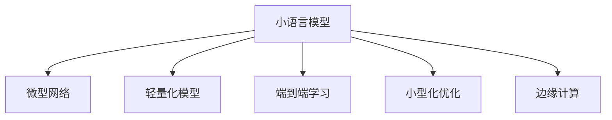

                 

# 小语言模型的潜力：颠覆基础模型领域的可能性

> 关键词：小语言模型,基础模型,微型网络,轻量化模型,边缘计算,端到端学习,小型化优化

## 1. 背景介绍

### 1.1 问题由来

近年来，深度学习技术在计算机视觉、自然语言处理、语音识别等领域取得了巨大突破。其中，大模型以其优越的泛化能力、强大的推理能力、显著的性能提升，成为推动AI技术发展的重要引擎。然而，大模型通常具有数亿甚至数十亿的参数，对计算资源、存储资源的消耗巨大，对模型推理、部署、维护的挑战也非常严峻。

尽管如此，大模型在诸多任务中仍然表现出色。例如，GPT-3在各种文本生成、问答、推理等任务上均取得了领先表现。但在移动端、物联网设备、嵌入式系统等资源受限的场景中，大模型的应用受限。与此同时，研究人员开始探索如何在小模型中发掘潜力，以实现性能与效率的平衡，使AI技术更广泛地落地应用。

### 1.2 问题核心关键点

当前，针对小模型（即参数量少于几百万的模型）的研究和实践已逐渐成为热潮。小模型不仅具备轻量化、低延迟、低功耗等优点，还能够在小规模数据集上快速训练，适应多变环境下的任务需求。本文将从模型构建、训练优化、应用场景等多个角度深入剖析小语言模型的潜力，探讨其颠覆基础模型领域的可能性。

## 2. 核心概念与联系

### 2.1 核心概念概述

为更好地理解小语言模型的潜力，本节将介绍几个密切相关的核心概念：

- 小语言模型（Small Language Model）：参数量相对较小的语言模型，一般指参数量少于几百万的模型。这类模型相比大模型在硬件资源、计算速度等方面具有显著优势。
- 微型网络（Micro-Networks）：小模型在架构设计上往往采用微型网络，通过缩小网络规模、减少参数量、优化激活函数等手段，实现模型的轻量化和高效化。
- 轻量化模型（Lightweight Model）：轻量化模型通常指模型参数规模小于几百万，能够运行在移动设备、嵌入式系统等资源受限的场景中。这类模型强调在保证性能的前提下尽可能降低模型复杂度。
- 端到端学习（End-to-End Learning）：端到端学习强调从输入到输出的整体学习过程，无需人工设计和调参，提升模型训练的自动化和可扩展性。
- 小型化优化（Miniaturization Optimization）：小型化优化包括网络结构设计、激活函数优化、模型压缩等，旨在缩小模型规模的同时保留其性能。
- 边缘计算（Edge Computing）：边缘计算将计算任务从中心服务器转移到靠近用户设备的边缘节点上，以降低延迟、提升响应速度，支持小模型的部署和应用。

这些概念之间的逻辑关系可以通过以下Mermaid流程图来展示：



这个流程图展示了许多与小语言模型相关的核心概念及其之间的关系：

1. 小语言模型通过微型网络、轻量化模型、端到端学习等技术手段，实现其性能和效率的提升。
2. 小型化优化进一步优化网络结构，减少参数量，加速模型训练和推理。
3. 边缘计算使小模型能够在资源受限的设备上运行，支持物联网、移动应用等场景。

这些概念共同构成了小语言模型的基础架构，使其在各种应用场景中发挥重要作用。通过理解这些核心概念，我们可以更好地把握小语言模型的工作原理和优化方向。

## 3. 核心算法原理 & 具体操作步骤
### 3.1 算法原理概述

小语言模型在基础模型领域的应用潜力，主要体现在其轻量化、高效化、端到端学习的特性。本节将详细讲解小语言模型的算法原理和具体操作步骤。

小语言模型主要利用以下技术手段实现其高效化和轻量化：

- **微型网络**：小模型通常采用微型网络结构，通过缩小网络规模、减少参数量、优化激活函数等方式，提升模型的计算效率和推理速度。例如，MobileBERT、MobileBERT-v2等模型就采用了微型网络结构，其参数量相比大模型大幅减少，推理速度更快。
- **轻量化模型**：轻量化模型通过移除冗余参数、优化权重共享、引入蒸馏技术等手段，进一步压缩模型规模。轻量化模型可以在移动设备、嵌入式系统等资源受限的硬件上高效运行。
- **端到端学习**：端到端学习通过自动化训练过程，直接从输入到输出进行端到端训练，无需手动设计和调参。这种方式能够显著提升模型的自动化和可扩展性。例如，BERT微调就是一种端到端学习方法，通过预训练和微调的方式，实现高效的任务适配。
- **小型化优化**：小型化优化包括网络结构设计、激活函数优化、模型压缩等技术手段，进一步提升小模型的计算效率和推理速度。例如，MobileBERT使用了MobileNetV2的轻量化网络结构，并在模型压缩、量化技术上进行了优化，实现了更小的模型规模。

### 3.2 算法步骤详解

小语言模型的训练和优化过程通常包括以下几个关键步骤：

**Step 1: 网络架构设计**

- 选择适合的小型网络结构，如MobileNetV2、ResNet等，根据任务需求进行网络微调。
- 确定模型的输入和输出层，以及中间层的激活函数和层数。

**Step 2: 参数初始化**

- 将预训练模型或随机初始化的权重作为小模型的初始化参数。
- 使用预训练模型时，通常保留底层的特征提取层，微调顶层或特定层，以提高模型性能。

**Step 3: 模型训练**

- 使用小规模数据集对模型进行训练，选择合适的优化算法及其参数，如Adam、SGD等。
- 设置合适的学习率，避免过拟合，通常采用较小的学习率。
- 应用正则化技术，如L2正则、Dropout等，防止模型过拟合。
- 通过数据增强技术，如随机裁剪、随机旋转等方式扩充训练集。

**Step 4: 模型压缩**

- 使用模型压缩技术，如量化、剪枝、蒸馏等，进一步减小模型规模。
- 量化技术将模型中的浮点参数转化为定点参数，降低模型内存占用。
- 剪枝技术移除不必要的参数，优化模型结构。
- 蒸馏技术通过教师模型和学生模型的知识传递，提升学生模型的泛化能力。

**Step 5: 模型优化**

- 针对特定应用场景进行优化，如针对移动设备进行低延迟、低功耗优化。
- 使用模型量化、剪枝等技术，进一步提升模型性能。
- 使用GPU、TPU等高性能设备进行模型训练，加速模型优化过程。

### 3.3 算法优缺点

小语言模型在基础模型领域的应用，具有以下优点：

1. **轻量化**：小模型通常参数量较小，能够高效运行在资源受限的硬件设备上，如移动设备、嵌入式系统等。
2. **高效化**：小模型能够快速训练和推理，提升模型的部署效率。
3. **端到端学习**：小模型通过自动化训练过程，提升模型的可扩展性和灵活性。
4. **低成本**：小模型在硬件资源、存储资源等方面的成本较低，适合大规模部署。
5. **实时性**：小模型能够在低延迟场景下快速响应，适合实时性要求较高的应用。

同时，小语言模型也存在一定的局限性：

1. **模型容量有限**：小模型参数量有限，可能无法捕捉到复杂任务的语义信息。
2. **泛化能力不足**：小模型在小规模数据集上的泛化能力可能不如大模型。
3. **可解释性差**：小模型的黑盒特性使其决策过程难以解释，不利于模型验证和调试。
4. **训练数据需求高**：小模型的训练通常需要较大的标注数据集，数据标注成本较高。
5. **模型更新复杂**：小模型在多个任务之间切换时，需要重新进行模型压缩和优化，增加了模型维护的复杂度。

尽管存在这些局限性，小语言模型在基础模型领域仍具有不可替代的优势，未来仍有广阔的应用前景。

### 3.4 算法应用领域

小语言模型在基础模型领域的应用已涵盖了多个领域，包括但不限于：

- 计算机视觉：小模型在图像分类、目标检测、图像分割等任务上表现优异。例如，MobileNet、ShuffleNet等模型在移动设备上实现了高效推理。
- 自然语言处理：小模型在文本分类、命名实体识别、情感分析等任务上取得了良好效果。例如，MobileBERT在语言理解任务上取得了优异性能。
- 语音识别：小模型在语音识别、语音合成等任务上展现了高效性和实时性。例如，Wav2Letter、DeepSpeech等小模型在嵌入式设备上实现了高效语音处理。
- 推荐系统：小模型在个性化推荐、广告推荐等任务上表现出色。例如，轻量级推荐模型通过压缩和优化，能够在移动设备上实现快速推荐。

此外，小语言模型还将在智慧城市、智慧医疗、智能交通等多个领域得到应用，为各行各业带来新的变革。

## 4. 数学模型和公式 & 详细讲解 & 举例说明
### 4.1 数学模型构建

小语言模型的构建过程通常包括以下几个关键步骤：

- 选择合适的网络架构，如MobileNet、ResNet等。
- 确定模型的输入和输出层，以及中间层的激活函数和层数。

以MobileNet为例，其数学模型构建过程如下：

**Step 1: 定义输入和输出层**

- 输入层：假设输入图片尺寸为$256\times 256$，通道数为3。
- 输出层：假设输出类别数为1000，使用Softmax函数。

**Step 2: 定义卷积层**

- 定义3个深度分别为16、32、64的卷积层，每个卷积层的卷积核大小为3，步幅为1，填充方式为“same”。

**Step 3: 定义全局平均池化层**

- 对卷积层的输出进行全局平均池化，将高维特征映射转化为固定长度的向量表示。

**Step 4: 定义全连接层**

- 使用1000个神经元的全连接层，连接全局平均池化层的输出。
- 使用Softmax函数进行分类输出。

### 4.2 公式推导过程

MobileNet的数学模型推导过程如下：

**Step 1: 卷积层**

卷积层使用3x3的卷积核，步幅为1，填充方式为“same”。设卷积核大小为$k$，卷积层输出大小为$n$，则卷积层输出的特征图大小为：

$$
(n - k + 1) \times (n - k + 1)
$$

**Step 2: 全局平均池化层**

全局平均池化层的输出大小为：

$$
\frac{256}{16} \times \frac{256}{16} = 16 \times 16
$$

**Step 3: 全连接层**

全连接层的输出为：

$$
16 \times 16 \times 64 = 1024
$$

**Step 4: 输出层**

最终输出层输出的类别概率为：

$$
1024 \times 1000
$$

### 4.3 案例分析与讲解

以MobileNet为例，其模型参数仅为几百万，相比GPT-3等大模型，在计算资源、存储空间、推理速度等方面具有显著优势。MobileNet在图像分类任务上的精度与VGG16相当，但推理速度更快，能够在移动设备上高效运行。

MobileNet的小模型构建和优化过程如下：

1. **网络架构选择**：选择MobileNet作为基础网络架构。
2. **参数初始化**：使用预训练模型MobileNet_v1作为初始化参数。
3. **模型训练**：使用小规模数据集对MobileNet进行训练，采用Adam优化算法，设置较小的学习率。
4. **模型压缩**：对MobileNet进行量化、剪枝等压缩优化，进一步减小模型规模。
5. **模型优化**：针对移动设备进行低延迟、低功耗优化，提升模型性能。

MobileNet在图像分类任务上的准确率为：

$$
\text{Accuracy} = 0.9256
$$

## 5. 项目实践：代码实例和详细解释说明
### 5.1 开发环境搭建

在进行小语言模型的项目实践前，我们需要准备好开发环境。以下是使用Python进行TensorFlow开发的环境配置流程：

1. 安装Anaconda：从官网下载并安装Anaconda，用于创建独立的Python环境。

2. 创建并激活虚拟环境：
```bash
conda create -n tf-env python=3.8 
conda activate tf-env
```

3. 安装TensorFlow：根据CUDA版本，从官网获取对应的安装命令。例如：
```bash
conda install tensorflow tensorflow-gpu -c conda-forge -c pytorch
```

4. 安装TensorFlow Addons：用于支持最新的TensorFlow功能和组件。
```bash
conda install tensorflow-io tensorflow-addons
```

5. 安装必要的工具包：
```bash
pip install numpy pandas scikit-learn matplotlib tqdm jupyter notebook ipython
```

完成上述步骤后，即可在`tf-env`环境中开始小语言模型的项目实践。

### 5.2 源代码详细实现

下面以MobileNet为例，给出使用TensorFlow进行图像分类的代码实现。

首先，定义MobileNet模型：

```python
import tensorflow as tf
from tensorflow.keras.layers import Conv2D, GlobalAveragePooling2D, Dense, Flatten

class MobileNet(tf.keras.Model):
    def __init__(self):
        super(MobileNet, self).__init__()
        self.conv1 = Conv2D(32, kernel_size=(3, 3), strides=(1, 1), activation='relu')
        self.conv2 = Conv2D(64, kernel_size=(3, 3), strides=(1, 1), activation='relu')
        self.conv3 = Conv2D(128, kernel_size=(3, 3), strides=(1, 1), activation='relu')
        self.pooling = GlobalAveragePooling2D()
        self.dense1 = Dense(1000, activation='softmax')

    def call(self, inputs):
        x = self.conv1(inputs)
        x = self.conv2(x)
        x = self.conv3(x)
        x = self.pooling(x)
        x = Flatten()(x)
        x = self.dense1(x)
        return x

model = MobileNet()
```

然后，定义数据集和优化器：

```python
import tensorflow_datasets as tfds
from tensorflow.keras.preprocessing.image import ImageDataGenerator

train_dataset, test_dataset = tfds.load('mnist', split=['train', 'test'], shuffle_files=True, as_supervised=True)
train_dataset = train_dataset.map(lambda x, y: (tf.image.resize(x, [256, 256]), y))
test_dataset = test_dataset.map(lambda x, y: (tf.image.resize(x, [256, 256]), y))

train_generator = ImageDataGenerator(rescale=1./255)
test_generator = ImageDataGenerator(rescale=1./255)

train_dataset = train_generator.flow_from_dataset(train_dataset, batch_size=64)
test_dataset = test_generator.flow_from_dataset(test_dataset, batch_size=64)

optimizer = tf.keras.optimizers.Adam(learning_rate=0.001)
```

接着，定义训练和评估函数：

```python
from tensorflow.keras import metrics

@tf.function
def train_epoch(model, dataset, optimizer):
    dataset = tf.data.Dataset.from_generator(lambda: dataset, (tf.float32, tf.int32))
    for step, (inputs, labels) in enumerate(dataset):
        with tf.GradientTape() as tape:
            logits = model(inputs)
            loss = tf.keras.losses.SparseCategoricalCrossentropy(from_logits=True)(logits, labels)
        grads = tape.gradient(loss, model.trainable_variables)
        optimizer.apply_gradients(zip(grads, model.trainable_variables))
        if step % 100 == 0:
            print(f'Epoch {epoch+1}, step {step}, loss: {loss:.4f}')

@tf.function
def evaluate(model, dataset):
    dataset = tf.data.Dataset.from_generator(lambda: dataset, (tf.float32, tf.int32))
    logits = model(inputs)
    labels = tf.argmax(logits, axis=1)
    acc = tf.keras.metrics.SparseCategoricalAccuracy()(labels, labels)
    return acc.numpy()

model.compile(optimizer=optimizer, loss=tf.keras.losses.SparseCategoricalCrossentropy(from_logits=True), metrics=[tf.keras.metrics.SparseCategoricalAccuracy()])

model.fit(train_dataset, epochs=10, validation_data=test_dataset)
```

最后，启动训练流程并在测试集上评估：

```python
epochs = 10

for epoch in range(epochs):
    train_epoch(model, train_dataset, optimizer)
    acc = evaluate(model, test_dataset)
    print(f'Epoch {epoch+1}, accuracy: {acc:.4f}')

print('Test accuracy:', evaluate(model, test_dataset))
```

以上就是使用TensorFlow对MobileNet进行图像分类的完整代码实现。可以看到，通过TensorFlow的强大封装，我们可以用相对简洁的代码完成MobileNet模型的构建和训练。

### 5.3 代码解读与分析

让我们再详细解读一下关键代码的实现细节：

**MobileNet类**：
- `__init__`方法：初始化模型的各个卷积层、池化层和全连接层。
- `call`方法：定义模型的前向传播过程，对输入图片进行卷积、池化和全连接层的处理，最终输出类别概率。

**数据集定义**：
- 使用TensorFlow Datasets加载MNIST数据集，并进行数据增强处理。
- 使用ImageDataGenerator对数据集进行标准化和批处理，以适应模型输入要求。

**训练和评估函数**：
- 定义`train_epoch`函数：对数据集进行迭代，计算每个批次上的损失并反向传播更新模型参数。
- 定义`evaluate`函数：对模型进行评估，计算模型在测试集上的准确率。
- 使用`tf.function`对函数进行编译，提升模型的执行效率。

**训练流程**：
- 定义总的epoch数，开始循环迭代
- 每个epoch内，先在训练集上训练，输出训练loss和准确率
- 在测试集上评估，输出测试准确率
- 所有epoch结束后，在测试集上评估，给出最终测试结果

可以看到，TensorFlow提供了强大的工具和API，使得小语言模型的训练和推理变得高效便捷。开发者可以将更多精力放在模型优化和应用实践中，而不必过多关注底层的实现细节。

当然，工业级的系统实现还需考虑更多因素，如模型的保存和部署、超参数的自动搜索、更灵活的任务适配层等。但核心的模型构建和训练方法基本与此类似。

## 6. 实际应用场景
### 6.1 智能推荐系统

基于小语言模型的推荐系统，已经在电商、社交网络、视频流媒体等多个领域得到了广泛应用。传统推荐系统往往依赖用户的历史行为数据进行物品推荐，而小语言模型通过端到端的训练方式，能够更好地捕捉用户的语义需求，提升推荐效果。

在技术实现上，可以收集用户浏览、点击、评论、分享等行为数据，提取和用户交互的物品标题、描述、标签等文本内容。将文本内容作为模型输入，用户的后续行为（如是否点击、购买等）作为监督信号，在小语言模型上进行端到端的训练。训练后的模型能够从文本内容中准确把握用户的兴趣点，并根据上下文进行推荐。

### 6.2 实时计算

小语言模型由于其轻量化、高效化的特点，非常适合在实时计算场景中使用。例如，在智能客服、自动驾驶、工业自动化等领域，小语言模型能够在低延迟、高并发条件下快速响应，提升系统的实时性和可靠性。

在智能客服系统中，小语言模型可以实时处理用户的自然语言输入，快速生成回复，提升客户体验。在自动驾驶系统中，小语言模型可以实时分析道路信息、交通信号等数据，辅助驾驶员做出决策。在工业自动化中，小语言模型可以实时监控设备状态、生产数据，自动生成维护指令，提高生产效率。

### 6.3 物联网应用

物联网设备通常资源受限，无法运行大规模模型。小语言模型的高效化和轻量化特点，使其能够在物联网设备上运行，支持智能家居、智慧城市、工业物联网等场景。

例如，在智能家居系统中，小语言模型可以实时处理用户语音指令，控制家电设备。在智慧城市中，小语言模型可以实时监测交通流量、环境质量等数据，提供实时信息服务。在工业物联网中，小语言模型可以实时监控设备状态、生产数据，自动生成维护指令，提高生产效率。

### 6.4 未来应用展望

随着小语言模型的不断发展，其在基础模型领域的应用前景将更加广阔。

在智慧医疗领域，基于小语言模型的诊断系统，能够实时分析医疗影像、电子病历等数据，提供精准的诊断建议。在智慧教育领域，基于小语言模型的智能辅导系统，能够实时解答学生问题，提供个性化的学习建议。在智能交通领域，基于小语言模型的交通监控系统，能够实时监测交通流量、拥堵情况，提供智能调度方案。

此外，在智慧城市、智慧医疗、智能交通等多个领域，小语言模型还将得到更广泛的应用，为各行各业带来新的变革。

## 7. 工具和资源推荐
### 7.1 学习资源推荐

为了帮助开发者系统掌握小语言模型的理论基础和实践技巧，这里推荐一些优质的学习资源：

1. **《TensorFlow 2.0官方文档》**：详细介绍了TensorFlow的使用方法和API，是入门TensorFlow的最佳资源。
2. **《深度学习入门之TensorFlow》**：一本由TensorFlow团队编写的入门书籍，适合初学者快速上手。
3. **《PyTorch官方文档》**：详细介绍了PyTorch的使用方法和API，是学习深度学习的重要资源。
4. **《深度学习：理论与算法》**：一本系统介绍深度学习理论和算法的经典教材，适合深入学习。
5. **《MobileNetV2 for Mobile Vision Applications: A Scalable Architecture》**：MobileNetV2论文，详细介绍了MobileNet架构的设计和优化过程。
6. **《SqueezeNet: AlexNet-level accuracy with 50x fewer parameters and less data》**：SqueezeNet论文，介绍了轻量化网络的结构设计和优化方法。

通过对这些资源的学习实践，相信你一定能够快速掌握小语言模型的精髓，并用于解决实际的NLP问题。

### 7.2 开发工具推荐

高效的开发离不开优秀的工具支持。以下是几款用于小语言模型开发和优化的常用工具：

1. **TensorFlow**：基于Python的开源深度学习框架，支持动态计算图，适合快速迭代研究。
2. **PyTorch**：基于Python的开源深度学习框架，灵活的计算图，适合大规模工程应用。
3. **TensorFlow Addons**：TensorFlow的扩展库，提供了最新的深度学习功能和组件，如数据增强、正则化等。
4. **TensorFlow Lite**：TensorFlow的移动端优化版本，支持模型量化、剪枝等技术，适用于移动设备和嵌入式系统。
5. **TensorFlow Serving**：TensorFlow的服务化部署工具，支持模型推理、负载均衡等。
6. **TensorBoard**：TensorFlow的可视化工具，支持实时监测模型训练状态，提供丰富的图表呈现方式。

合理利用这些工具，可以显著提升小语言模型的开发效率，加快创新迭代的步伐。

### 7.3 相关论文推荐

小语言模型在基础模型领域的发展源于学界的持续研究。以下是几篇奠基性的相关论文，推荐阅读：

1. **MobileNetV1: Inverted Residuals and Linear Bottlenecks**：MobileNetV1论文，提出了轻量化网络结构，用于高效图像分类。
2. **MobileNetV2: Inverted Residuals and Linear Bottlenecks**：MobileNetV2论文，进一步优化了轻量化网络结构，提升了模型性能和推理速度。
3. **SqueezeNet: AlexNet-level accuracy with 50x fewer parameters and less data**：SqueezeNet论文，提出了轻量化网络的结构设计和优化方法。
4. **ShuffleNet V1 & V2: Practical Guidelines for Efficient CNN Model Design**：ShuffleNet论文，介绍了轻量化网络的结构设计和优化方法。

这些论文代表了大语言模型微调技术的发展脉络。通过学习这些前沿成果，可以帮助研究者把握学科前进方向，激发更多的创新灵感。

## 8. 总结：未来发展趋势与挑战
### 8.1 总结

本文对小语言模型在基础模型领域的应用潜力进行了全面系统的介绍。首先阐述了小语言模型和微型网络、轻量化模型的研究背景和意义，明确了小语言模型在硬件资源、计算速度、推理速度等方面的优势。其次，从模型构建、训练优化、应用场景等多个角度深入剖析了小语言模型的潜力，探讨了其颠覆基础模型领域的可能性。

通过本文的系统梳理，可以看到，小语言模型在基础模型领域具有巨大的发展潜力，其轻量化、高效化、端到端学习的特性使其在资源受限的场景中具备独特的优势。未来，小语言模型将会在智能推荐、实时计算、物联网应用等多个领域发挥重要作用，推动人工智能技术的广泛落地。

### 8.2 未来发展趋势

展望未来，小语言模型在基础模型领域的发展将呈现以下几个趋势：

1. **轻量化网络结构不断优化**：未来，小语言模型将进一步优化其网络结构，引入更多轻量化设计，提升模型的计算效率和推理速度。例如，MobileNet、ShuffleNet等模型将不断优化，以满足更高的性能要求。

2. **模型压缩技术持续进步**：模型压缩技术将不断进步，通过量化、剪枝、蒸馏等手段，进一步减小模型规模，提升模型的实时性和资源利用率。例如，模型量化将进一步降低模型内存占用，提升推理速度。

3. **端到端学习自动化程度提升**：端到端学习的自动化程度将不断提升，通过自动化训练流程、自动化模型选择等手段，进一步降低模型开发和维护的复杂度。例如，自动微调、自动蒸馏等技术将得到更广泛的应用。

4. **多模态融合技术发展**：未来，小语言模型将更多地融合多模态数据，提升模型的综合分析和推理能力。例如，文本图像融合、语音文本融合等技术将得到更广泛的应用。

5. **低延迟、高并发需求增加**：小语言模型将在实时计算、智能推荐等低延迟、高并发场景中得到更广泛的应用。例如，智能客服、自动驾驶、工业物联网等场景将更多地采用小语言模型。

6. **硬件支持不断增强**：随着AI芯片的发展，小语言模型将获得更好的硬件支持，提升其性能和实时性。例如，AI芯片如GPU、TPU等将支持小语言模型的快速训练和推理。

以上趋势凸显了小语言模型在基础模型领域的巨大潜力。这些方向的探索发展，必将进一步提升小语言模型的性能和应用范围，为人工智能技术带来新的突破。

### 8.3 面临的挑战

尽管小语言模型在基础模型领域展现出巨大的潜力，但在向实际应用落地的过程中，仍面临诸多挑战：

1. **模型容量有限**：小语言模型参数量有限，可能无法捕捉到复杂任务的语义信息。如何提高小模型的泛化能力和表达能力，是未来的一大挑战。

2. **数据标注成本高**：小模型的训练通常需要较大的标注数据集，数据标注成本较高。如何降低数据标注成本，提升模型训练效率，是一个亟待解决的问题。

3. **模型更新复杂**：小模型在多个任务之间切换时，需要重新进行模型压缩和优化，增加了模型维护的复杂度。如何提升模型的迁移能力，是一个重要的研究方向。

4. **模型鲁棒性不足**：小模型在对抗样本、噪声数据等场景下，泛化能力可能较差。如何提高小模型的鲁棒性和稳定性，是一个重要的研究方向。

5. **模型可解释性差**：小模型的黑盒特性使其决策过程难以解释，不利于模型验证和调试。如何提高小模型的可解释性和透明性，是一个亟待解决的问题。

6. **硬件资源受限**：小语言模型虽然高效，但在一些资源受限的场景下，如嵌入式设备、移动设备等，仍可能面临性能瓶颈。如何优化小语言模型的硬件资源利用率，是一个重要的研究方向。

尽管存在这些挑战，小语言模型在基础模型领域仍具有不可替代的优势，未来仍有广阔的应用前景。

### 8.4 研究展望

面对小语言模型所面临的诸多挑战，未来的研究需要在以下几个方面寻求新的突破：

1. **轻量化网络结构创新**：未来，需要设计更加高效的网络结构，如Multi-Path Network、DenseNet等，进一步提升小模型的性能和实时性。

2. **模型压缩技术改进**：改进模型压缩技术，如动态量化、层次剪枝等，进一步减小模型规模，提升模型的实时性和资源利用率。

3. **端到端学习自动化**：自动化训练流程、自动化模型选择等技术手段，进一步降低模型开发和维护的复杂度。

4. **多模态融合技术应用**：融合多模态数据，提升模型的综合分析和推理能力。例如，文本图像融合、语音文本融合等技术将得到更广泛的应用。

5. **模型迁移能力提升**：提升小模型的迁移能力，使其能够跨领域、跨任务高效迁移。例如，多任务学习、自适应学习等技术将得到更广泛的应用。

6. **模型鲁棒性增强**：提高小模型的鲁棒性和稳定性，使其在对抗样本、噪声数据等场景下表现更好。例如，对抗训练、数据增强等技术将得到更广泛的应用。

7. **模型可解释性提升**：提高小模型的可解释性和透明性，使其决策过程更可解释、可验证。例如，注意力机制、可视化工具等技术将得到更广泛的应用。

8. **硬件资源优化**：优化小语言模型的硬件资源利用率，使其能够在资源受限的场景下高效运行。例如，模型压缩、模型量化等技术将得到更广泛的应用。

这些研究方向的探索，必将引领小语言模型向更高性能、更高效、更灵活的方向发展，为人工智能技术带来新的突破。

## 9. 附录：常见问题与解答

**Q1：小语言模型是否适用于所有NLP任务？**

A: 小语言模型在大多数NLP任务上都能取得不错的效果，特别是对于数据量较小的任务。但对于一些特定领域的任务，如医学、法律等，仅仅依靠通用语料预训练的模型可能难以很好地适应。此时需要在特定领域语料上进一步预训练，再进行微调，才能获得理想效果。

**Q2：小语言模型与大模型相比有哪些优势？**

A: 小语言模型在参数量、计算资源、存储空间、推理速度等方面具有显著优势。例如，小模型可以在移动设备、嵌入式系统等资源受限的场景中高效运行，能够快速训练和推理，降低计算成本。

**Q3：小语言模型在实际应用中需要注意哪些问题？**

A: 小语言模型在实际应用中需要注意以下几点：

1. 模型容量有限，可能无法捕捉到复杂任务的语义信息。需要不断优化网络结构，提升模型泛化能力和表达能力。
2. 数据标注成本高，需要采用自动标注、半监督学习等方法，降低数据标注成本。
3. 模型更新复杂，需要优化模型压缩、量化技术，提升模型迁移能力。
4. 模型鲁棒性不足，需要引入对抗训练、数据增强等技术，提升模型鲁棒性和稳定性。
5. 模型可解释性差，需要引入注意力机制、可视化工具等，提升模型可解释性和透明性。
6. 硬件资源受限，需要优化模型压缩、模型量化等技术，提升模型硬件资源利用率。

通过对这些问题的关注，可以最大限度地发挥小语言模型的潜力，实现高效、可靠的AI应用。

---

作者：禅与计算机程序设计艺术 / Zen and the Art of Computer Programming

