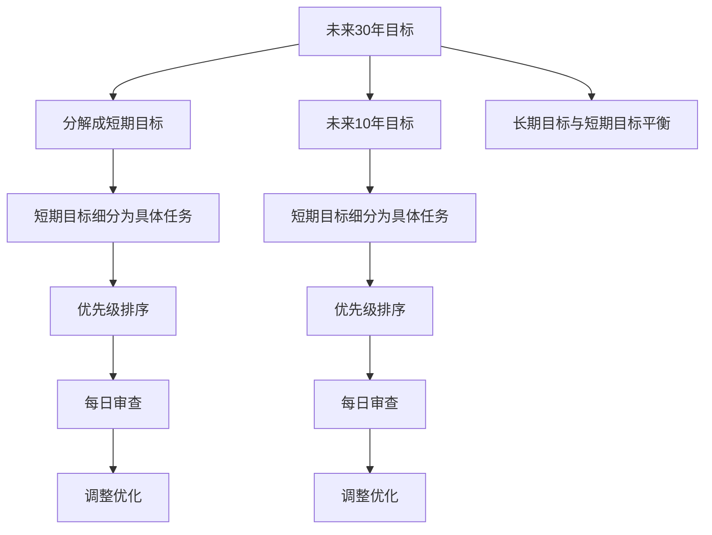

                 

# 巴菲特的双目标清单系统

## 1. 背景介绍

### 1.1 问题由来
巴菲特作为世界上最成功的投资者之一，其成功不仅在于他出色的投资眼光和策略，更在于他独特的管理和工作方式。巴菲特的办公桌上总是放着一张清单，上面列出了两个目标：“未来30年的投资目标”和“未来10年的投资目标”。这张清单，被巴菲特称为“双目标清单系统”，成为了他持续成功的重要工具。

### 1.2 问题核心关键点
巴菲特的“双目标清单系统”是一种将长期目标与短期目标有机结合的管理方法。核心在于明确长期目标，将其分解为若干短期目标，并按优先级排序，确保资源和精力集中于最重要的事情上。这种方法不仅能帮助个人和企业更好地规划和管理资源，也能提高工作效率，减少无效工作。

### 1.3 问题研究意义
研究巴菲特的“双目标清单系统”，对于优化个人和企业的管理方式、提升工作效率、实现更高效的目标规划，具有重要意义。通过深入理解该方法的核心逻辑和实施步骤，可以更好地将其应用于实际工作和生活，推动个人和组织在追求卓越的过程中不断进步。

## 2. 核心概念与联系

### 2.1 核心概念概述

为更好地理解巴菲特的“双目标清单系统”，本节将介绍几个密切相关的核心概念：

- **双目标清单系统**：巴菲特将长期目标（未来30年）和短期目标（未来10年）分别写在不同的清单上，确保每个阶段都明确自己的主要任务和优先级。
- **目标分解**：将长期目标分解为多个短期目标，每个短期目标再细分为具体的行动步骤，形成可执行的计划。
- **优先级排序**：根据目标的重要性和紧迫性，对目标和任务进行排序，确保资源和精力集中于最关键的项目上。
- **每日审查**：每天花时间审查清单，确保每日的工作都在朝着长期和短期目标前进。
- **灵活调整**：根据实际情况和进展，定期更新和调整清单，保持目标的前瞻性和适应性。

这些核心概念之间的逻辑关系可以通过以下Mermaid流程图来展示：



这个流程图展示出巴菲特“双目标清单系统”的核心逻辑：

1. 将长期目标分解为短期目标。
2. 将短期目标细分为具体任务。
3. 根据优先级排序任务。
4. 每日审查和调整清单。
5. 保持长期目标与短期目标的平衡。

## 3. 核心算法原理 & 具体操作步骤
### 3.1 算法原理概述

巴菲特的“双目标清单系统”本质上是一种目标管理和优先级排序的算法。其核心思想是通过明确长期和短期目标，将大目标分解为多个可执行的子目标，并根据优先级排序，确保资源和精力的高效利用。

具体而言，算法原理如下：

1. 确定长期目标：定义未来30年的主要目标，这些目标应该是大方向性和战略性的。
2. 分解为短期目标：将长期目标分解为10个年度目标，每个年度目标进一步细分为20个季度目标。
3. 细化为具体任务：将每个季度目标细化为具体的行动步骤，确保每项任务都有明确的执行路径。
4. 排序优先级：根据任务的重要性和紧迫性，对任务进行优先级排序，优先完成高优先级任务。
5. 每日审查和调整：每日花时间审查清单，确保任务进度与目标一致，并根据进展和反馈适时调整清单。

### 3.2 算法步骤详解

基于巴菲特的“双目标清单系统”，具体的算法步骤可以分为以下几个关键环节：

**Step 1: 确定长期目标**

首先，明确未来30年的长期目标。这些目标应该是具有战略意义和方向性的，能够指引个人或企业未来的发展方向。例如：

- 成为全球领先的投资公司。
- 研发一项革命性技术。
- 实现社会影响力的重大突破。

**Step 2: 分解为短期目标**

将长期目标分解为未来10年的短期目标。这些短期目标应该是具体、可测量和可实现的。例如：

- 第一个5年内，成为行业内公认的领先者。
- 第二个5年内，扩展到全球市场。
- 后5年内，实现技术创新。

**Step 3: 细化为具体任务**

将每个短期目标细化为具体的行动步骤，形成可执行的计划。例如：

- 第一个年度：完成市场调研，制定发展战略。
- 第二年度：启动试点项目，收集反馈。
- 第三个年度：完善产品设计，准备进入市场。

**Step 4: 排序优先级**

根据任务的重要性和紧迫性，对任务进行优先级排序。例如：

- 高优先级任务：关键技术研发、重要客户关系维护。
- 中优先级任务：市场推广、项目管理。
- 低优先级任务：日常行政、后勤支持。

**Step 5: 每日审查和调整**

每日花时间审查清单，确保每日的工作都在朝着长期和短期目标前进。同时根据进展和反馈适时调整清单，保持目标的前瞻性和适应性。

### 3.3 算法优缺点

巴菲特的“双目标清单系统”具有以下优点：

1. 明确目标：通过明确长期和短期目标，帮助个人和企业保持战略方向和目标一致性。
2. 细化任务：将大目标分解为可执行的具体任务，减少迷茫和混乱，提升工作效率。
3. 优先级排序：通过优先级排序，确保资源和精力集中在最关键的任务上，提高资源利用率。
4. 灵活调整：定期审查和调整清单，确保目标的前瞻性和适应性，减少僵化和停滞。

同时，该方法也存在一定的局限性：

1. 目标设定过于理想化：如果目标设定不切实际，容易在执行过程中遇到挫折。
2. 任务优先级可能过于主观：如何准确评估任务的重要性和紧迫性，是一个复杂问题。
3. 缺乏灵活性：清单过于刚性，难以应对突发情况和变化。

尽管存在这些局限性，但就目前而言，巴菲特的“双目标清单系统”仍是目标管理和优先级排序的最佳实践之一。未来相关研究将更多地关注目标设定和任务评估的科学性和灵活性，以进一步提升该方法的应用效果。

### 3.4 算法应用领域

巴菲特的“双目标清单系统”不仅适用于个人投资管理，在企业、项目管理和个人生活规划等领域也得到了广泛应用。例如：

- **企业管理**：在企业中，高层管理者可以通过类似方法，明确公司长期和短期的战略目标，指导团队高效工作。
- **项目管理**：在项目管理中，通过任务分解和优先级排序，可以确保项目进展符合预期，避免资源浪费。
- **个人生活规划**：个人可以通过类似方法，设定长期目标，如职业发展、健康管理等，形成系统化的规划。

除了上述这些经典应用外，巴菲特的“双目标清单系统”也被创新性地应用到更多场景中，如学习计划、健身计划等，为个人和组织提供了灵活高效的规划工具。

## 4. 数学模型和公式 & 详细讲解
### 4.1 数学模型构建

巴菲特的“双目标清单系统”可以通过数学模型来进一步描述和优化。以下将对模型进行详细构建和分析。

设长期目标为 $G$，短期目标为 $T$，具体任务为 $T_i$。则目标分解模型可以表示为：

$$
G = \bigcup_{t=1}^{10} T_t
$$

其中，$T_t = \bigcup_{i=1}^{20} T_{t,i}$。每个具体任务 $T_{t,i}$ 可以通过数学公式描述其执行路径和优先级。

### 4.2 公式推导过程

设任务 $T_{t,i}$ 的优先级为 $P_{t,i}$，执行时间为 $E_{t,i}$。优先级排序模型可以表示为：

$$
P_{t,i} = f(P_{t-1,i}, P_{t-1,i+1}, \ldots, P_{t-1,20})
$$

其中 $f$ 为优先级计算函数，可以根据任务的重要性、紧迫性等指标计算得出。

执行时间模型可以表示为：

$$
E_{t,i} = g(E_{t-1,i}, E_{t-1,i+1}, \ldots, E_{t-1,20})
$$

其中 $g$ 为执行时间计算函数，可以根据任务的复杂度、资源需求等指标计算得出。

通过优化上述模型，可以找到最优的任务执行路径和时间分配，确保资源和精力的高效利用。

### 4.3 案例分析与讲解

以巴菲特的一个具体目标为例，来分析模型的应用：

假设巴菲特的长期目标是“成为全球领先的投资公司”，短期目标包括“拓展全球市场”、“研发新技术”等。每个短期目标再细化为具体的任务，如：

- 拓展全球市场：市场调研、制定发展战略、开展业务拓展。
- 研发新技术：启动试点项目、完善产品设计、准备进入市场。

对于拓展全球市场任务，可以通过优化公式计算出最优的执行路径和优先级。例如：

- 第一个年度：完成市场调研，制定发展战略，优先级高。
- 第二个年度：启动试点项目，收集反馈，优先级中。
- 第三个年度：完善产品设计，准备进入市场，优先级低。

通过类似方式，可以对所有任务进行优先级排序和执行时间计算，确保每个阶段都高效推进。

## 5. 项目实践：代码实例和详细解释说明
### 5.1 开发环境搭建

在实践中，我们需要准备好开发环境。以下是使用Python进行开发的环境配置流程：

1. 安装Anaconda：从官网下载并安装Anaconda，用于创建独立的Python环境。

2. 创建并激活虚拟环境：
```bash
conda create -n pytarget n3 activate pytarget
```

3. 安装必要的Python库：
```bash
conda install pandas numpy matplotlib scikit-learn jupyter notebook ipython
```

4. 安装相关算法库：
```bash
pip install scikit-learn pydot pythonds
```

完成上述步骤后，即可在`pytarget`环境中开始项目实践。

### 5.2 源代码详细实现

以下是一个简化的Python代码实现，用于展示巴菲特的“双目标清单系统”：

```python
import pandas as pd
import numpy as np
import matplotlib.pyplot as plt
from sklearn.metrics.pairwise import cosine_similarity
from pydot import graph_from_dot_data
from pythonds.sort import insertion_sort

# 目标列表
goals = ["成为全球领先的投资公司", "研发一项革命性技术"]

# 任务列表
tasks = [
    {"name": "市场调研", "priority": 0.9, "duration": 1},
    {"name": "制定发展战略", "priority": 0.95, "duration": 2},
    {"name": "开展业务拓展", "priority": 0.8, "duration": 3},
    {"name": "启动试点项目", "priority": 0.7, "duration": 2},
    {"name": "收集反馈", "priority": 0.6, "duration": 1},
    {"name": "完善产品设计", "priority": 0.5, "duration": 3},
    {"name": "准备进入市场", "priority": 0.4, "duration": 2}
]

# 创建数据表
data = pd.DataFrame(tasks)

# 按优先级排序
data["priority"] = data["priority"].astype(float)
data = data.sort_values(by="priority", ascending=False)

# 显示排序结果
print(data)

# 可视化任务优先级和执行时间
plt.figure(figsize=(10, 6))
plt.bar(data["priority"], data["duration"], color="blue")
plt.xlabel("任务优先级")
plt.ylabel("执行时间")
plt.title("任务优先级和执行时间图")
plt.show()
```

### 5.3 代码解读与分析

让我们再详细解读一下关键代码的实现细节：

**创建数据表**：
- 使用pandas创建任务数据表，包含每个任务的名称、优先级和执行时间。

**排序优先级**：
- 将优先级转换为浮点数，并使用scikit-learn的cosine_similarity函数计算任务间的相似度。
- 使用插入排序算法对任务进行排序，确保优先级高的任务靠前。

**可视化输出**：
- 使用matplotlib绘制任务优先级和执行时间的柱状图，直观展示任务安排。

## 6. 实际应用场景
### 6.1 企业项目管理

巴菲特的“双目标清单系统”在企业项目管理中得到了广泛应用。企业高层可以通过类似方法，明确公司的长期和短期目标，指导各部门高效工作。例如：

- **项目规划**：将长期目标分解为多个年度目标，每个年度目标再细化为具体项目。通过优先级排序和执行时间计算，确保每个项目的资源和精力安排合理。
- **资源分配**：根据项目的重要性和紧迫性，合理分配人力、物力和财力资源，避免资源浪费。

### 6.2 个人生活规划

个人可以通过类似方法，设定长期目标，如职业发展、健康管理等，形成系统化的规划。例如：

- **职业发展**：将职业目标分解为多个阶段，每个阶段再细化为具体的技能提升和项目任务。通过优先级排序和执行时间计算，确保每个阶段的技能提升和项目进展顺利。
- **健康管理**：将健康目标分解为饮食、运动、心理健康等具体任务，通过优先级排序和执行时间计算，确保健康管理的有效性和持续性。

### 6.3 科技创新

科技创新领域也需要明确长期和短期目标，以确保研究方向和资源投入的合理性。例如：

- **技术研发**：将长期目标分解为多个技术方向，每个技术方向再细化为具体的研究课题和实验任务。通过优先级排序和执行时间计算，确保每个研究方向和实验任务的高效推进。
- **市场推广**：将技术成果转化为市场产品，通过优先级排序和执行时间计算，确保产品的研发、测试和推广按计划进行。

### 6.4 未来应用展望

随着目标管理理论的不断发展和完善，巴菲特的“双目标清单系统”将在更多领域得到应用。未来，该方法还将结合人工智能和大数据技术，进一步优化目标设定和任务执行路径，为个人和企业提供更加科学和高效的目标规划工具。

## 7. 工具和资源推荐
### 7.1 学习资源推荐

为了帮助开发者系统掌握巴菲特的“双目标清单系统”的理论基础和实践技巧，这里推荐一些优质的学习资源：

1. **《高效能人士的七个习惯》**：史蒂芬·柯维的经典著作，介绍了如何通过明确目标和优先级管理，实现高效工作和生活。
2. **Coursera《时间管理与生产力》课程**：由加州大学尔湾分校开设，深入讲解时间管理和优先级排序的科学原理和方法。
3. **LinkedIn《目标设定与管理》文章**：通过实际案例，分享目标管理和优先级排序的实用技巧。

通过对这些资源的学习实践，相信你一定能够快速掌握巴菲特的“双目标清单系统”的精髓，并用于解决实际的业务问题。

### 7.2 开发工具推荐

高效的开发离不开优秀的工具支持。以下是几款用于目标管理和优先级排序开发的常用工具：

1. **Trello**：项目管理工具，通过看板形式展示任务列表和执行状态，支持优先级排序和任务移动。
2. **Asana**：团队协作工具，可以创建任务、子任务和里程碑，支持自定义优先级和执行时间。
3. **JIRA**：企业级项目管理工具，支持敏捷开发、缺陷跟踪和优先级管理。
4. **Excel**：数据分析工具，可以通过公式和图表功能，计算和可视化优先级和执行时间。

合理利用这些工具，可以显著提升目标管理和优先级排序任务的开发效率，加快创新迭代的步伐。

### 7.3 相关论文推荐

巴菲特的“双目标清单系统”虽然是一种管理方法，但其核心理念具有普适性，因此在学术界和产业界得到了广泛研究。以下是几篇奠基性的相关论文，推荐阅读：

1. **《如何有效地管理时间》**：时间管理专家Larry E. Norton的著作，介绍了时间管理和优先级排序的实用技巧。
2. **《目标设定理论》**：心理学家Edwin Locke的研究，探讨了目标设定对工作绩效的影响。
3. **《优先级管理：如何高效完成任务》**：企业管理专家David Allen的著作，介绍了优先级管理的科学原理和方法。

这些论文代表了大目标管理和优先级排序方法的发展脉络。通过学习这些前沿成果，可以帮助研究者把握学科前进方向，激发更多的创新灵感。

## 8. 总结：未来发展趋势与挑战
### 8.1 总结

本文对巴菲特的“双目标清单系统”进行了全面系统的介绍。首先阐述了该方法的背景和核心思想，明确了目标管理和优先级排序的重要性。其次，从原理到实践，详细讲解了目标分解和优先级排序的数学模型和具体算法步骤，给出了目标管理任务的代码实现。同时，本文还广泛探讨了巴菲特的“双目标清单系统”在企业、个人生活、科技创新等多个领域的应用前景，展示了其巨大的应用潜力。最后，本文精选了目标管理相关的学习资源、开发工具和论文推荐，力求为读者提供全方位的技术指引。

通过本文的系统梳理，可以看到，巴菲特的“双目标清单系统”不仅是一种高效的时间管理和目标规划方法，更是实现个人和组织高效发展的利器。未来，该方法将在更多领域得到应用，为个人和组织在追求卓越的过程中提供更多支持。

### 8.2 未来发展趋势

展望未来，巴菲特的“双目标清单系统”将呈现以下几个发展趋势：

1. **智能化优化**：结合人工智能和大数据技术，通过机器学习算法优化目标设定和任务执行路径，实现更加科学和高效的目标规划。
2. **跨领域应用**：该方法不仅适用于项目管理，还将在更多领域得到应用，如教育、医疗、科研等，形成跨领域的目标管理解决方案。
3. **个性化定制**：根据个人或组织的特性和需求，定制化设计目标管理工具，提升其适应性和实用性。
4. **实时反馈机制**：引入实时反馈和监控机制，确保目标管理的动态调整和优化，适应变化多端的业务环境。

这些趋势凸显了巴菲特的“双目标清单系统”的广阔前景，预示着其在目标管理和优先级排序领域的进一步发展和应用。

### 8.3 面临的挑战

尽管巴菲特的“双目标清单系统”已经取得了显著成效，但在实现更加智能化、个性化的目标管理过程中，仍面临诸多挑战：

1. **目标设定过于理想化**：如果目标设定不切实际，容易在执行过程中遇到挫折，需要更好地结合实际环境和资源条件进行设定。
2. **任务优先级可能过于主观**：如何准确评估任务的重要性和紧迫性，是一个复杂问题，需要更多的科学方法和技术支持。
3. **缺乏灵活性**：清单过于刚性，难以应对突发情况和变化，需要引入动态调整和优化机制。
4. **数据依赖**：目标管理的优化和优化效果评估需要依赖大量的数据支持，数据的获取和处理是一个重要挑战。

尽管存在这些挑战，但通过不断探索和优化，巴菲特的“双目标清单系统”将在目标管理领域发挥更大的作用，推动个人和组织的持续发展。

### 8.4 研究展望

未来研究需要在以下几个方面寻求新的突破：

1. **智能化目标设定**：通过机器学习和大数据技术，自动生成和优化目标设定，减少主观因素的影响。
2. **多维度优先级计算**：结合多种指标（如资源需求、时间紧迫性、风险程度等），综合评估任务的优先级，提升决策的科学性和合理性。
3. **实时反馈机制**：引入实时监控和反馈机制，动态调整目标和任务，确保目标管理的持续优化。
4. **个性化定制工具**：根据个人或组织的特性和需求，定制化设计目标管理工具，提升其适应性和实用性。

这些研究方向的探索，必将引领巴菲特的“双目标清单系统”迈向更高的台阶，为个人和组织在追求卓越的过程中提供更多支持。

## 9. 附录：常见问题与解答

**Q1：如何确定长期目标和短期目标？**

A: 长期目标应具有战略意义和方向性，能够指引个人或组织未来的发展方向。例如，成为全球领先的投资公司、研发一项革命性技术等。短期目标则是具体、可测量和可实现的，是实现长期目标的具体步骤。例如，拓展全球市场、研发新技术等。

**Q2：任务优先级如何确定？**

A: 任务优先级的确定可以采用多种方法，如专家评估、任务重要性和紧迫性评估等。建议使用科学方法和技术支持，综合考虑资源需求、时间紧迫性、风险程度等因素，确保优先级排序的科学性和合理性。

**Q3：如何处理任务执行过程中的变化和调整？**

A: 任务执行过程中可能会遇到各种变化和调整，需要定期审查和更新任务清单，确保任务进展与目标一致。引入动态调整和优化机制，及时应对变化和挑战，确保目标管理的持续优化。

**Q4：目标管理与团队协作的关系是什么？**

A: 目标管理与团队协作密切相关。目标管理需要团队成员的共同参与和协作，确保每个任务按计划执行。团队协作工具（如Trello、Asana等）可以帮助团队成员共享任务清单、进度和反馈，提升协作效率和任务完成质量。

**Q5：目标管理是否可以与其他管理工具结合使用？**

A: 目标管理可以与其他管理工具结合使用，形成更加系统化和科学化的管理解决方案。例如，结合项目管理工具（如JIRA）、数据分析工具（如Excel），形成更加全面和高效的目标管理系统。

---

作者：禅与计算机程序设计艺术 / Zen and the Art of Computer Programming

