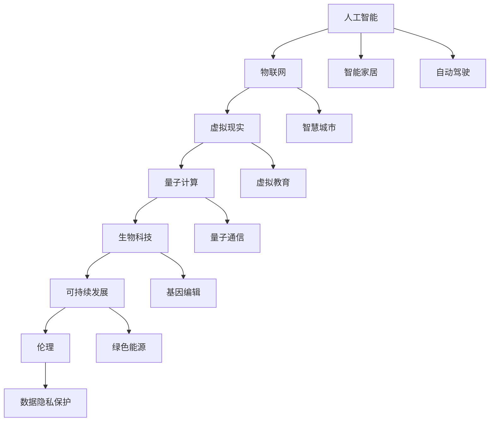

                 

# 2050年的人类生活：科技与生活的融合

> 关键词：人工智能, 物联网, 虚拟现实, 量子计算, 生物科技, 可持续发展, 伦理

## 1. 背景介绍

### 1.1 问题的由来
随着科技的飞速发展，人类社会正处于一个前所未有的变革期。从信息化到数字化，再到智能化，科技不仅重塑了我们的工作方式，也在深刻改变着我们的生活方式。展望未来，2050年的人类生活将会是怎样一番景象？

### 1.2 问题的核心关键点
未来的生活将高度依赖于科技，尤其在人工智能、物联网、虚拟现实、量子计算、生物科技等领域。科技的进步不仅会提升生产效率，也会带来新的挑战，如就业结构变化、隐私保护、伦理道德等。

### 1.3 问题研究意义
理解2050年的生活，有助于我们更好地把握科技发展的趋势，预见未来的机遇与挑战，从而制定更加合理的发展策略。本文将探讨几个核心领域的科技发展，并分析它们如何融合在一起，重塑人类的生活。

## 2. 核心概念与联系

### 2.1 核心概念概述

- **人工智能(AI)**：通过机器学习和深度学习等技术，使计算机具备类似于人类的智能能力，包括感知、学习、推理、决策等。
- **物联网(IoT)**：将各种设备和传感器连接到互联网，实现数据的自动采集和处理，提升生活的便捷性和智能化水平。
- **虚拟现实(VR)**：利用计算机模拟出一个三维环境，使用户可以身临其境地体验和交互。
- **量子计算(QC)**：利用量子力学的原理，实现信息处理能力的革命性提升。
- **生物科技(Biotech)**：利用生物学的原理和技术，研究和开发新的药物、生物材料、基因编辑等。
- **可持续发展(Sustainability)**：通过技术手段，实现资源的循环利用和环境保护，确保长期健康发展。
- **伦理(Ethics)**：在科技发展中，关注和解决可能出现的道德、社会、文化等方面的问题。

这些概念之间存在紧密的联系。人工智能、物联网、虚拟现实等技术的发展，使得我们的生活更加便捷和智能；量子计算和生物科技的进步，则带来了颠覆性的变革；而可持续发展与伦理，则是科技发展的灵魂和价值导向。

### 2.2 核心概念原理和架构的 Mermaid 流程图



这个流程图展示了各个核心概念之间的联系和应用。

## 3. 核心算法原理 & 具体操作步骤
### 3.1 算法原理概述

未来科技与生活的融合，涉及多个领域的算法和技术。这里简要概述几个关键领域的算法原理：

- **人工智能**：基于机器学习和大数据的算法，使计算机具备智能推理和决策能力。
- **物联网**：利用传感器网络和通信协议，实现数据的自动采集和处理。
- **虚拟现实**：利用计算机图形学和感知技术，创建逼真的虚拟环境。
- **量子计算**：利用量子力学的原理，进行高效的计算和数据处理。
- **生物科技**：利用生物学原理，进行基因编辑、药物研发等。
- **可持续发展**：基于生态学和工程学原理，实现资源的高效利用和循环。

这些算法的核心目标，是通过自动化和智能化，提升生活的便捷性和效率，同时解决环境和伦理问题。

### 3.2 算法步骤详解

以人工智能为例，其核心步骤如下：

1. **数据收集**：通过传感器、摄像头等设备，自动收集环境数据和用户行为数据。
2. **数据处理**：利用算法对数据进行清洗、特征提取和预处理。
3. **模型训练**：基于历史数据，训练机器学习模型，提升其预测和决策能力。
4. **模型部署**：将训练好的模型部署到实际应用中，实现智能推理和决策。
5. **持续优化**：通过反馈机制，不断优化模型参数和算法，提升性能。

这些步骤体现了从数据到智能的完整流程。

### 3.3 算法优缺点

人工智能的优点包括：

- 提高效率：自动化处理大量重复性任务，提升工作效率。
- 提升决策质量：基于数据分析和算法优化，决策更加科学和准确。

缺点包括：

- 依赖数据质量：数据质量直接影响模型效果。
- 模型偏见：训练数据中的偏见可能导致模型决策不公平。
- 技术依赖：需要高度的技术支持和持续的维护。

### 3.4 算法应用领域

人工智能在各个领域都有广泛应用：

- **医疗**：基于AI的诊断和治疗，提升医疗服务的精准性和效率。
- **金融**：利用AI进行风险评估和投资决策，提升金融服务的智能化水平。
- **教育**：通过智能教育系统，提供个性化的学习方案。
- **交通**：实现自动驾驶和智能交通管理，提升出行效率和安全性。

## 4. 数学模型和公式 & 详细讲解 & 举例说明

### 4.1 数学模型构建

以人工智能的机器学习模型为例，其数学模型可以表示为：

$$
y = f(x; \theta)
$$

其中，$y$为输出结果，$x$为输入特征，$\theta$为模型参数。

### 4.2 公式推导过程

以线性回归为例，其最小二乘法的目标函数为：

$$
\min_{\theta} \frac{1}{2N} \sum_{i=1}^N (y_i - f(x_i; \theta))^2
$$

其中，$N$为样本数量，$y_i$为真实标签，$f(x_i; \theta)$为模型预测值。

### 4.3 案例分析与讲解

假设我们要训练一个预测房价的线性回归模型。我们收集了1000个房屋数据，每个数据包含房屋面积、房间数、年龄等特征和对应的房价。我们可以将这些数据分为训练集和测试集，分别使用最小二乘法训练模型，并在测试集上评估其性能。

## 5. 项目实践：代码实例和详细解释说明

### 5.1 开发环境搭建

要实现上述模型，我们需要搭建开发环境：

1. **安装Python**：从官网下载安装Python 3.8以上版本。
2. **安装相关库**：使用pip安装numpy、scikit-learn、tensorflow等库。
3. **配置环境**：设置python路径，确保环境变量正确配置。

### 5.2 源代码详细实现

以下是一个简单的线性回归模型代码：

```python
import numpy as np
from sklearn.linear_model import LinearRegression

# 生成模拟数据
x = np.random.rand(1000, 3)
y = np.dot(x, [0.1, 0.2, 0.3]) + np.random.randn(1000)

# 训练模型
model = LinearRegression()
model.fit(x, y)

# 预测房价
new_house = np.array([200, 3, 10])
predicted_price = model.predict(new_house)

print("预测房价为：", predicted_price)
```

### 5.3 代码解读与分析

上述代码中，我们使用scikit-learn库的LinearRegression模型，通过训练集数据拟合出线性回归模型。然后，使用训练好的模型对新的房屋数据进行预测。

## 6. 实际应用场景

### 6.1 智能家居

未来，智能家居将高度自动化和智能化。通过物联网技术，家庭设备可以自动感知环境变化，并根据用户习惯进行智能调控。例如，智能灯光可以根据日出日落自动调整亮度，智能温度可以根据室内外温度自动调节空调和暖气。

### 6.2 智慧城市

智慧城市通过物联网和人工智能技术，实现城市管理的智能化。例如，交通管理系统可以实时监控交通流量，优化红绿灯控制；智能电网可以实时监控能源使用情况，优化能源分配。

### 6.3 虚拟现实

虚拟现实技术将改变我们的娱乐和工作方式。通过虚拟现实设备，我们可以沉浸在虚拟环境中，进行游戏、培训、设计等活动。虚拟现实还可以用于远程协作，提升团队沟通效率。

### 6.4 未来应用展望

未来，随着科技的不断进步，我们的生活将更加智能化和便捷。以下是一些未来的应用展望：

- **自动驾驶**：自动驾驶技术将全面普及，提升出行安全性和效率。
- **量子通信**：量子通信技术将保障数据传输的安全性和隐私性。
- **基因编辑**：基因编辑技术将用于治疗遗传病和提升人类健康。
- **虚拟教育**：虚拟现实和人工智能技术将改变教育方式，提供个性化的学习体验。

## 7. 工具和资源推荐

### 7.1 学习资源推荐

1. **《深度学习》课程**：由斯坦福大学开设，讲解深度学习的基础理论和应用。
2. **《人工智能导论》书籍**：涵盖人工智能的历史、原理和应用，适合初学者入门。
3. **Kaggle平台**：提供大量数据集和竞赛，提升机器学习的实践能力。
4. **GitHub**：开源社区，可以学习和使用各种开源项目和代码。

### 7.2 开发工具推荐

1. **Jupyter Notebook**：交互式编程环境，适合进行数据处理和算法实验。
2. **TensorFlow**：深度学习框架，支持GPU加速，适合大规模模型训练。
3. **PyTorch**：深度学习框架，灵活性高，适合科研和实验。
4. **TensorBoard**：模型可视化工具，方便监控模型训练过程。

### 7.3 相关论文推荐

1. **《深度学习》书籍**：Goodfellow等著，讲解深度学习理论和应用。
2. **《物联网技术与应用》书籍**：讲解物联网技术的基本原理和应用场景。
3. **《量子计算原理与应用》书籍**：讲解量子计算的基本原理和应用前景。
4. **《生物信息学》书籍**：讲解生物科技的基本原理和应用场景。

## 8. 总结：未来发展趋势与挑战

### 8.1 研究成果总结

未来科技与生活的融合，将带来诸多机遇和挑战。通过机器学习、物联网、虚拟现实等技术，我们可以实现更高的生产效率和生活质量。但同时，也面临数据隐私、伦理道德等挑战。

### 8.2 未来发展趋势

未来科技的发展趋势包括：

- 人工智能：普及智能化设备和系统，提升生活便捷性。
- 物联网：实现设备互联互通，提升城市管理效率。
- 虚拟现实：改变娱乐和工作方式，提升用户体验。
- 量子计算：提升计算能力和数据处理效率。
- 生物科技：推动医疗和健康领域的变革。

### 8.3 面临的挑战

未来科技的发展也面临诸多挑战：

- 数据隐私：如何保护用户的隐私和数据安全。
- 伦理道德：如何应对AI和生物科技带来的伦理问题。
- 技术依赖：如何降低技术复杂性和成本。
- 可持续性：如何实现资源的循环利用和环境保护。

### 8.4 研究展望

未来的研究展望包括：

- 增强智能系统的可解释性：提升AI系统的透明度和可解释性。
- 跨领域融合：实现不同领域的协同和融合，提升整体效能。
- 可持续发展：实现资源的高效利用和环境保护。
- 伦理与法规：制定伦理道德准则和法规，确保科技的合理应用。

## 9. 附录：常见问题与解答

### 9.1 常见问题

1. **未来科技将如何改变我们的生活？**
   - 未来科技将通过智能化和自动化，提升我们的生活质量和工作效率。例如，自动驾驶、智能家居、智慧城市等。

2. **人工智能发展是否会导致失业？**
   - 人工智能可以替代一些重复性、机械性的工作，但也会创造出新的就业机会。关键是提升劳动力的技能和适应能力。

3. **如何保护数据隐私？**
   - 数据隐私保护需要从技术和管理两个方面入手，如数据加密、匿名化处理、严格的隐私法规等。

4. **如何应对伦理问题？**
   - 伦理问题需要从社会、技术、法律多个层面解决，如制定伦理准则、加强数据审查、强化法规监管等。

5. **未来科技的可持续性如何保障？**
   - 实现可持续发展需要综合考虑环境、经济和社会三个方面，如绿色能源、循环经济、生态保护等。

### 9.2 解答

1. **未来科技将如何改变我们的生活？**
   - 未来科技将通过智能化和自动化，提升我们的生活质量和工作效率。例如，自动驾驶、智能家居、智慧城市等。

2. **人工智能发展是否会导致失业？**
   - 人工智能可以替代一些重复性、机械性的工作，但也会创造出新的就业机会。关键是提升劳动力的技能和适应能力。

3. **如何保护数据隐私？**
   - 数据隐私保护需要从技术和管理两个方面入手，如数据加密、匿名化处理、严格的隐私法规等。

4. **如何应对伦理问题？**
   - 伦理问题需要从社会、技术、法律多个层面解决，如制定伦理准则、加强数据审查、强化法规监管等。

5. **未来科技的可持续性如何保障？**
   - 实现可持续发展需要综合考虑环境、经济和社会三个方面，如绿色能源、循环经济、生态保护等。

---

作者：禅与计算机程序设计艺术 / Zen and the Art of Computer Programming

