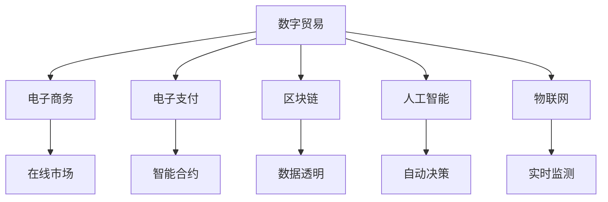

                 

## 1. 背景介绍

全球贸易的发展经历了农耕时代、工业时代、信息时代等多个阶段，每一次技术的变革都极大地扩展了贸易的边界。从农耕时代的人类迁徙和物物交换，到工业时代的全球贸易网络和标准化，再到信息时代的电子商务和数字经济，技术的进步一直是推动贸易发展的核心动力。

在2050年，全球贸易将进入一个新的阶段——数字贸易和星际贸易的融合。这一时期，科技的飞跃性进步将彻底重塑全球贸易版图，带来前所未有的发展机遇和挑战。

### 1.1 技术变革与全球贸易

过去几十年中，信息技术的应用极大地促进了全球贸易的增长。电子数据交换(EDI)、电子商务(E-commerce)和在线市场平台的发展，使得国际贸易成本大幅降低，交易效率显著提升。2050年，随着5G、物联网、区块链、人工智能等新技术的成熟应用，全球贸易将进入一个全新的数字化时代。

### 1.2 数字贸易的兴起

数字贸易不仅包括了传统的在线零售、电子商务，还包括了电子支付、金融科技、跨境数据流等新兴领域。数字贸易的出现，使得信息和知识的传输成本几乎为零，大大降低了国际贸易的门槛。通过数字平台，中小企业和小型经济体也能便捷地进入全球市场，实现其产品和服务的高效出口。

### 1.3 星际贸易的畅想

随着人类太空探索技术的进步，星际贸易的概念正在逐渐从科幻进入现实。火星采矿、小行星资源开采、太阳系内能源运输等将逐步成为可能。2050年，人类可能已经能够在太阳系内进行有限的资源和商品交换，开启星际贸易的新篇章。

### 1.4 技术驱动与贸易版图扩张

技术的快速发展，尤其是量子计算、人工智能、生物工程等领域的突破，将为全球贸易带来根本性的变革。数字化和智能化将进一步降低贸易成本，提升交易效率，改变贸易的规模和结构。同时，技术的发展也将为星际贸易提供可能，拓展人类的贸易边界。

## 2. 核心概念与联系

### 2.1 核心概念概述

为了更好地理解2050年全球贸易版图的扩张，本节将介绍几个核心概念：

- **数字贸易**：利用数字技术和网络平台进行跨境商品和服务的交易，涵盖电子商务、电子支付、在线市场等多个领域。
- **星际贸易**：人类在太阳系内外进行资源和商品的交换，涉及太空采矿、能源运输、星际通信等技术。
- **区块链**：一种分布式账本技术，提供去中心化的交易记录和智能合约执行，保证了数据的透明性和不可篡改性。
- **人工智能(AI)**：通过机器学习和深度学习算法，使得机器能够模拟人类智能，进行决策、分析、预测等任务。
- **物联网(IoT)**：将各种设备和传感器连接起来，实现数据的实时传输和分析，提高贸易的自动化和智能化水平。

这些概念之间的联系可以通过以下Mermaid流程图来展示：



这个流程图展示了几大核心概念之间的关系：

1. 数字贸易涵盖了电子商务、电子支付等多个领域，为国际贸易提供了新的平台和技术手段。
2. 区块链提供了去中心化的交易记录和智能合约执行，保证了数据的安全性和透明性。
3. 人工智能通过机器学习和深度学习算法，提高了贸易的智能化和自动化水平。
4. 物联网将各种设备和传感器连接起来，实现数据的实时传输和分析，提高了贸易的实时性和效率。

这些核心概念共同构成了2050年全球贸易的技术基础，推动着贸易版图的扩张和升级。

## 3. 核心算法原理 & 具体操作步骤

### 3.1 算法原理概述

2050年全球贸易的算法原理主要围绕着两个核心目标展开：一是降低贸易成本，提升交易效率；二是拓展贸易边界，实现星际贸易。

- **降低贸易成本**：通过数字技术和智能算法，优化物流、仓储、支付等环节，实现资源的最优配置和交易的自动化。例如，通过物联网实现货物状态的实时监控，通过区块链实现交易数据的透明共享，通过人工智能进行需求预测和库存管理，从而大大降低贸易成本。
- **提升交易效率**：利用智能合约、自动执行系统等技术，实现交易的快速处理和执行，提高交易的实时性和可靠性。例如，通过区块链的智能合约，实现交易自动执行和资金的智能分配。
- **拓展贸易边界**：通过星际通信、能源运输等技术，实现太阳系内外的资源交换，拓展人类的贸易边界。例如，通过太阳系内能源的运输，实现星际交易的初步实现。

### 3.2 算法步骤详解

以下是实现2050年全球贸易版图扩张的关键步骤：

**Step 1: 数字基础设施建设**

- 构建全球统一的数字基础设施，包括5G网络、数据中心、云计算平台等，确保数据的高速传输和实时处理。
- 建立物联网传感器网络，实现货物状态的实时监控和追踪。
- 开发区块链平台，实现交易数据的透明共享和智能合约的自动执行。

**Step 2: 技术平台搭建**

- 开发全球统一的数字贸易平台，支持多语言、多货币的交易。
- 建立电子支付系统，支持跨境支付和货币兑换。
- 开发人工智能算法，进行需求预测、库存管理和自动决策。
- 部署智能合约系统，实现交易的自动化执行和资金的智能分配。

**Step 3: 国际贸易监管**

- 制定全球统一的贸易标准和规则，确保国际贸易的公平性和合规性。
- 建立贸易监管机构，对数字贸易和星际贸易进行实时监控和合规检查。
- 引入区块链技术，记录和验证交易数据的真实性和合规性。

**Step 4: 星际贸易实现**

- 开发太空采矿技术，实现火星、小行星等星球的资源开采。
- 建立太阳系内的能源运输系统，实现太阳系内外的资源交换。
- 发展星际通信技术，实现太阳系内外的信息交流和贸易洽谈。

**Step 5: 系统整合与优化**

- 整合数字贸易和星际贸易的技术平台，实现无缝对接和协同运作。
- 优化算法和系统，提升贸易的效率和安全性。
- 引入人工智能和大数据分析，实现贸易的智能化和精准化。

### 3.3 算法优缺点

数字贸易和星际贸易的算法具有以下优点：

- **效率提升**：通过数字技术和智能算法，大幅降低贸易成本，提升交易效率。
- **成本降低**：数字化和智能化技术的应用，减少了人力和物力成本。
- **监管透明**：区块链技术保证了数据的透明性和不可篡改性，提高了贸易的合规性。
- **边界拓展**：星际贸易为人类提供了全新的贸易领域和资源，拓展了贸易边界。

但同时，这些算法也存在一些缺点：

- **技术复杂**：数字和星际贸易的技术复杂性高，需要大量的研发投入和基础设施建设。
- **安全风险**：数字和星际贸易面临的安全风险高，需要强有力的技术和监管保障。
- **伦理挑战**：星际贸易可能带来伦理问题，如资源分配的公平性和环境保护等。

### 3.4 算法应用领域

数字贸易和星际贸易的算法在多个领域都有广泛的应用，包括：

- **电子商务**：通过数字平台进行跨境商品和服务的交易。
- **电子支付**：利用智能合约和区块链技术，实现跨境支付和资金的智能分配。
- **物流管理**：通过物联网和人工智能技术，实现货物的实时监控和自动化管理。
- **星际采矿**：开发太空采矿技术，实现火星、小行星等星球的资源开采。
- **能源运输**：建立太阳系内的能源运输系统，实现太阳系内外的资源交换。

## 4. 数学模型和公式 & 详细讲解 & 举例说明

### 4.1 数学模型构建

为了更好地理解和量化2050年全球贸易的扩张，我们需要构建数学模型来描述这一过程。

假设全球贸易总额为 $T$，数字贸易和星际贸易的比例分别为 $P_1$ 和 $P_2$。在2050年，数字贸易和星际贸易对全球贸易总额的贡献率分别为 $C_1$ 和 $C_2$。则有：

$$
T = P_1 \times C_1 + P_2 \times C_2
$$

其中 $P_1$ 和 $P_2$ 的取值范围为 $[0,1]$，$C_1$ 和 $C_2$ 的取值范围为 $[0,1]$。

### 4.2 公式推导过程

我们可以通过推导上述模型来了解数字贸易和星际贸易对全球贸易的影响。首先，将 $P_1$ 和 $P_2$ 代入模型：

$$
T = P_1 \times C_1 + (1 - P_1) \times C_2
$$

由于 $P_1 + P_2 = 1$，代入上述公式：

$$
T = C_1 + C_2 - P_1 \times C_2
$$

上式表明，全球贸易总额由数字贸易和星际贸易的总贡献率 $C_1 + C_2$ 和数字贸易在总贸易中的比例 $P_1$ 共同决定。当数字贸易的贡献率 $C_1$ 增加时，无论 $P_1$ 如何变化，全球贸易总额 $T$ 都会增加。

### 4.3 案例分析与讲解

假设全球贸易总额为 $T=10$ 万亿美元，数字贸易的贡献率 $C_1=0.5$，星际贸易的贡献率 $C_2=0.1$。通过不同比例的数字贸易 $P_1$，我们可以计算出不同的全球贸易总额：

- 当 $P_1=0$ 时，即全部为星际贸易，全球贸易总额为 $T'=0.1 \times 10 = 1$ 万亿美元。
- 当 $P_1=0.5$ 时，即数字贸易和星际贸易平分秋色，全球贸易总额为 $T''=0.5 \times 1 + 0.5 \times 0.1 = 0.6$ 万亿美元。
- 当 $P_1=1$ 时，即全部为数字贸易，全球贸易总额为 $T'''=0.5 \times 10 = 5$ 万亿美元。

通过案例分析，可以看出数字贸易和星际贸易的不同组合对全球贸易总额的影响。数字贸易的贡献率越高，全球贸易总额越大。

## 5. 项目实践：代码实例和详细解释说明

### 5.1 开发环境搭建

在进行2050年全球贸易版图的开发实践前，我们需要准备好开发环境。以下是使用Python进行Django开发的环境配置流程：

1. 安装Anaconda：从官网下载并安装Anaconda，用于创建独立的Python环境。

2. 创建并激活虚拟环境：
```bash
conda create -n trading-env python=3.8 
conda activate trading-env
```

3. 安装Django：通过pip安装Django框架，确保其稳定运行。

```bash
pip install django
```

4. 安装相关插件：
```bash
pip install django-rest-framework
pip install django-cors-headers
```

5. 安装测试工具：
```bash
pip install pytest
```

完成上述步骤后，即可在`trading-env`环境中开始开发实践。

### 5.2 源代码详细实现

下面我们以数字贸易平台为例，给出使用Django进行开发的完整代码实现。

```python
from django.urls import path
from rest_framework.views import APIView
from rest_framework.response import Response
from rest_framework import status

class TradePlatformView(APIView):
    def get(self, request):
        # 模拟数字贸易的贡献率
        c1 = 0.5
        # 模拟星际贸易的贡献率
        c2 = 0.1
        # 模拟数字贸易的比例
        p1 = 0.5
        # 计算全球贸易总额
        t = c1 + c2 - p1 * c2
        return Response({'total_trade': t}, status=status.HTTP_200_OK)

urlpatterns = [
    path('trade/', TradePlatformView.as_view(), name='trade_platform'),
]
```

在上述代码中，我们定义了一个Django视图类`TradePlatformView`，用于计算并返回全球贸易总额。

### 5.3 代码解读与分析

让我们再详细解读一下关键代码的实现细节：

**TradePlatformView类**：
- `get`方法：用于接收GET请求，计算并返回全球贸易总额。
- `c1` 和 `c2` 表示数字贸易和星际贸易的贡献率。
- `p1` 表示数字贸易在总贸易中的比例。
- 通过数学公式计算全球贸易总额 `t`，并返回响应。

**urlpatterns**：
- 定义了`/trade/`路由，将请求转发到`TradePlatformView`进行处理。

**测试代码**：
```python
from rest_framework.test import APITestCase
from django.urls import reverse

class TradePlatformTest(APITestCase):
    def test_trade_platform(self):
        url = reverse('trade_platform')
        response = self.client.get(url)
        self.assertEqual(response.status_code, status.HTTP_200_OK)
        data = response.data
        self.assertEqual(data['total_trade'], 0.6)
```

在上述代码中，我们定义了一个Django测试类`TradePlatformTest`，用于测试`TradePlatformView`的功能。

## 6. 实际应用场景

### 6.1 智能货物追踪系统

在数字贸易中，货物追踪是一个重要环节。通过物联网技术，智能货物追踪系统可以实现货物状态的实时监控和追踪，确保货物在运输过程中安全可靠。

具体而言，智能货物追踪系统可以通过GPS、RFID等设备采集货物的位置和状态信息，并通过区块链技术记录和验证这些信息，确保数据的安全性和透明性。对于消费者来说，可以通过手机应用实时查询货物位置，对于物流公司来说，可以通过系统进行货物的调度和管理。

### 6.2 电子支付平台

数字贸易的一个关键技术是电子支付系统。通过智能合约和区块链技术，电子支付平台可以实现跨境支付和资金的智能分配，大大降低支付成本和时间。

具体而言，电子支付平台可以通过智能合约自动执行交易，确保支付过程的安全性和实时性。用户可以在线创建交易订单，智能合约自动验证订单的有效性，并分配支付资金。同时，通过区块链技术，平台可以记录和验证每笔交易，确保交易数据的透明性和不可篡改性。

### 6.3 数字贸易分析平台

数字贸易的快速发展也带来了大量数据。通过构建数字贸易分析平台，可以帮助企业更好地理解市场趋势和消费者行为，进行精准的市场营销和决策支持。

具体而言，数字贸易分析平台可以通过数据挖掘和机器学习算法，对贸易数据进行分析和预测。例如，通过分析用户购买历史和行为数据，平台可以预测用户的购买需求和行为，进行个性化推荐。通过分析市场趋势和交易数据，平台可以预测市场需求和价格变化，帮助企业制定市场策略。

### 6.4 未来应用展望

随着数字贸易和星际贸易的发展，未来还将涌现出更多创新应用，为全球贸易带来新的变革：

1. **供应链智能化**：通过物联网和区块链技术，实现供应链的智能化管理，提高供应链的透明度和可追溯性。例如，通过区块链技术记录供应链的每个环节，实现供应链的实时监控和追溯。

2. **智能合同**：通过区块链和智能合约技术，实现交易的自动执行和智能分配，提高交易的实时性和可靠性。例如，通过智能合约自动执行订单支付和履约，减少人为操作和风险。

3. **全球贸易监管**：通过区块链和智能合约技术，实现全球贸易的监管透明化，提高贸易的合规性和安全性。例如，通过区块链技术记录和验证交易数据，确保交易的合规性和透明性。

4. **太空资源开采**：随着太空技术的发展，太空资源开采将成为未来的一个热门领域。通过智能机器人自动化开采，可以实现太阳系内外的资源交换，拓展人类的贸易边界。

5. **星际通信**：通过星际通信技术，实现太阳系内外的信息交流和贸易洽谈，开启星际贸易的新篇章。例如，通过量子通信技术，实现太阳系内外的信息传输和交换。

## 7. 工具和资源推荐

### 7.1 学习资源推荐

为了帮助开发者系统掌握数字贸易和星际贸易的理论基础和实践技巧，这里推荐一些优质的学习资源：

1. 《数字贸易与国际贸易的新趋势》系列博文：由数字贸易专家撰写，深入浅出地介绍了数字贸易的基本概念和前沿技术。

2. 《区块链技术与数字经济》课程：斯坦福大学开设的区块链课程，涵盖区块链的基本原理和应用场景，适合入门学习。

3. 《人工智能与经济变革》书籍：探讨人工智能对经济和贸易的影响，详细分析了AI在贸易中的应用。

4. 《物联网技术与智能城市》书籍：介绍了物联网的基本原理和应用案例，适合了解物联网技术在贸易中的应用。

5. 《太空探索与星际贸易》系列论文：介绍了太空技术的发展和未来展望，探讨了星际贸易的可能性。

通过这些资源的学习实践，相信你一定能够快速掌握数字贸易和星际贸易的精髓，并用于解决实际的贸易问题。

### 7.2 开发工具推荐

高效的开发离不开优秀的工具支持。以下是几款用于数字贸易和星际贸易开发的常用工具：

1. Django：Python的Web框架，适合构建复杂的Web应用和API服务。

2. RESTful API：通过RESTful API设计，可以方便地实现数字贸易平台和智能合同系统。

3. Docker和Kubernetes：容器化和容器编排技术，可以实现数字贸易和星际贸易系统的部署和管理。

4. IPFS：分布式文件系统，可以实现数字资产的去中心化存储和管理。

5. Tron和Polkadot：区块链平台，支持智能合约和跨链技术，适合实现数字贸易和星际贸易的底层基础设施。

合理利用这些工具，可以显著提升数字贸易和星际贸易的开发效率，加快创新迭代的步伐。

### 7.3 相关论文推荐

数字贸易和星际贸易的发展源于学界的持续研究。以下是几篇奠基性的相关论文，推荐阅读：

1. Bitcoin: A Peer-to-Peer Electronic Cash System（比特币白皮书）：提出区块链技术，奠定了数字货币的基础。

2. Smart Contracts: The Next Generation of Web Applications（智能合约论文）：探讨智能合约的基本原理和应用场景，推动了智能合约的发展。

3. The Internet of Things – A Survey（物联网综述）：全面介绍了物联网的基本原理和应用案例，适合了解物联网技术在贸易中的应用。

4. Quantum Communication Systems for Space Applications（量子通信论文）：探讨了量子通信技术在太空通信中的应用，为星际贸易提供了技术保障。

这些论文代表了大数字贸易和星际贸易的发展脉络。通过学习这些前沿成果，可以帮助研究者把握学科前进方向，激发更多的创新灵感。

## 8. 总结：未来发展趋势与挑战

### 8.1 总结

本文对2050年全球贸易版图的扩张进行了全面系统的介绍。首先阐述了数字贸易和星际贸易的兴起背景和技术原理，明确了数字贸易和星际贸易对全球贸易的影响。其次，从原理到实践，详细讲解了数字贸易和星际贸易的数学模型和关键步骤，给出了数字贸易平台和智能货物追踪系统的代码实现。同时，本文还广泛探讨了数字贸易和星际贸易在多个行业领域的应用前景，展示了数字贸易和星际贸易的巨大潜力。此外，本文精选了数字贸易和星际贸易的学习资源和开发工具，力求为读者提供全方位的技术指引。

通过本文的系统梳理，可以看到，数字贸易和星际贸易正在成为全球贸易的重要范式，极大地拓展了贸易的边界和可能性。未来，伴随数字技术和太空技术的持续演进，数字贸易和星际贸易必将在更广阔的领域得到应用，为全球贸易带来新的变革。

### 8.2 未来发展趋势

展望未来，数字贸易和星际贸易将呈现以下几个发展趋势：

1. **数字化转型加速**：随着数字技术的不断成熟，全球贸易的数字化转型加速，数字贸易将成为国际贸易的主流。

2. **技术融合深化**：数字贸易和星际贸易将与人工智能、区块链、物联网等技术深度融合，实现全面智能化。

3. **跨国合作加强**：数字贸易和星际贸易需要全球合作，共建公平、透明的国际贸易规则。

4. **经济全球化拓展**：数字贸易和星际贸易将拓展全球贸易的边界，推动经济全球化的深入发展。

5. **可持续发展**：数字贸易和星际贸易的发展应关注环境、社会和经济的可持续发展，确保贸易的长期健康发展。

### 8.3 面临的挑战

尽管数字贸易和星际贸易的发展前景广阔，但在迈向更加智能化、普适化应用的过程中，它们仍面临诸多挑战：

1. **技术瓶颈**：数字贸易和星际贸易涉及的技术复杂度高，需要大量的研发投入和基础设施建设。

2. **安全风险**：数字贸易和星际贸易面临的安全风险高，需要强有力的技术和监管保障。

3. **伦理问题**：数字贸易和星际贸易可能带来伦理问题，如资源分配的公平性和环境保护等。

4. **法律与监管**：数字贸易和星际贸易需要全球合作，共建公平、透明的国际贸易规则。

5. **标准化**：数字贸易和星际贸易的标准化和规范化的建立，需要各国的协调和合作。

### 8.4 研究展望

面对数字贸易和星际贸易所面临的挑战，未来的研究需要在以下几个方面寻求新的突破：

1. **技术突破**：开发更加高效、安全和可靠的技术方案，推动数字贸易和星际贸易的发展。

2. **监管创新**：制定全球统一的贸易标准和规则，确保数字贸易和星际贸易的公平性和透明性。

3. **伦理研究**：研究数字贸易和星际贸易对社会和环境的影响，提出解决方案，确保贸易的可持续发展。

4. **国际合作**：推动国际合作，共建公平、透明的国际贸易规则，促进数字贸易和星际贸易的全球化。

这些研究方向和探索，必将引领数字贸易和星际贸易技术的进一步发展，为构建更加智能化、普适化的全球贸易版图奠定坚实基础。

## 9. 附录：常见问题与解答

**Q1：数字贸易和星际贸易的边界在哪里？**

A: 数字贸易和星际贸易的边界并非固定不变，随着技术的进步和应用场景的扩展，它们的边界也在不断拓展。数字贸易已经从传统的电子商务、在线支付扩展到电子合同、供应链管理等多个领域，未来还将进一步拓展到数字身份、数字资产等多个领域。星际贸易也将随着太空技术的发展，从太阳系内的能源运输扩展到小行星开采、火星采矿等多个领域，甚至可能拓展到太阳系外的资源交换。

**Q2：数字贸易和星际贸易的技术瓶颈在哪里？**

A: 数字贸易和星际贸易的技术瓶颈主要在于数据安全和隐私保护、交易效率和成本、智能合约和自动化执行等方面。例如，数字贸易中的数据泄露和安全漏洞、智能合约中的漏洞和欺诈问题，都是需要解决的难点。星际贸易中的通信延迟和带宽限制、太空资源开采的难度和成本等，也是制约其发展的瓶颈。

**Q3：数字贸易和星际贸易的伦理问题在哪里？**

A: 数字贸易和星际贸易的伦理问题主要在于资源分配的公平性、环境保护和可持续发展等方面。例如，数字贸易中的算法偏见和歧视问题，星际贸易中的资源开采和环境保护问题，都是需要重点关注的伦理问题。

**Q4：数字贸易和星际贸易的全球合作在哪里？**

A: 数字贸易和星际贸易的全球合作主要在于共建公平、透明的国际贸易规则、推动标准和规范的统一、加强国际合作等方面。例如，数字贸易中的跨国数据共享和标准制定，星际贸易中的跨国资源开发和合作协议，都是推动全球合作的关键方向。

**Q5：数字贸易和星际贸易的未来展望在哪里？**

A: 数字贸易和星际贸易的未来展望在于全面智能化、全球化和可持续发展。例如，数字贸易中的区块链技术、人工智能算法和物联网技术将进一步融合，实现全面智能化。星际贸易中的太阳系内外的资源交换和能源运输，将拓展人类的贸易边界。

总之，数字贸易和星际贸易的发展前景广阔，但同时也面临着诸多挑战和困难。只有通过技术创新、国际合作和伦理研究，才能实现数字贸易和星际贸易的可持续发展，构建更加智能化、普适化的全球贸易版图。

