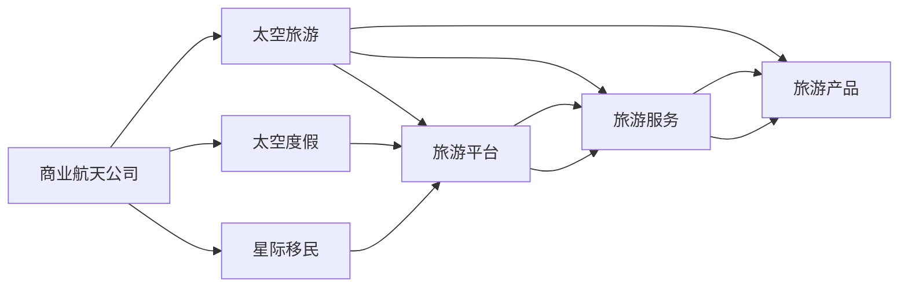

                 

# 2050年的太空旅游：从太空度假到星际移民的太空经济发展

## 1. 背景介绍

随着人类对宇宙的好奇心愈发强烈，太空旅游正逐渐从科幻电影变为现实。2050年，太空旅游将成为一个崭新的行业，为地球提供新的经济增长点。本文将深入探讨太空旅游的发展历程、主要商业模式、面临的挑战以及未来的前景，为读者描绘出一幅宏大的太空经济蓝图。

## 2. 核心概念与联系

### 2.1 核心概念概述

为了更好地理解太空旅游的现状与发展，我们将探讨以下几个核心概念：

- **太空旅游**：指人们利用航天器前往地球大气层以外进行观光、科研、体验等活动的旅行方式。
- **太空度假**：指在太空站或特定太空区域进行的休闲旅游活动，类似于地球上的度假。
- **星际移民**：指人类移居至其他星球（如火星、月球、小行星等）居住和发展的过程。
- **太空经济**：涵盖太空旅游、科研、资源开采、制造业等多个领域，是一个全新的经济体系。
- **商业航天公司**：如SpaceX、蓝色起源、维珍银河等，是推动太空旅游发展的关键力量。

### 2.2 核心概念原理和架构的 Mermaid 流程图



这个流程图展示了商业航天公司如何通过太空旅游、太空度假和星际移民等多种方式，为太空经济提供支撑。从太空旅游平台到具体的旅游服务，再到多样化的旅游产品，每一个环节都紧密相连。

## 3. 核心算法原理 & 具体操作步骤

### 3.1 算法原理概述

太空旅游的发展过程可以分为两个主要阶段：太空度假和星际移民。这两个阶段需要不同程度的算法支持和创新。

- **太空度假**：主要依赖于轨道旅游、太空站停留和月球旅游等活动。算法方面需要重点考虑如何优化轨道控制、太空站生命支持系统和旅游体验设计。
- **星际移民**：涉及火星、小行星等深空探索，算法需要解决长时间星际旅行的健康保障、能源供应、资源开采和环境改造等问题。

### 3.2 算法步骤详解

**太空度假的算法步骤**：

1. **轨道计算**：使用牛顿力学和航天动力学计算最优轨道，确保旅游器在太空中的安全和舒适。
2. **生活支持系统**：设计高效的循环系统和生命维持系统，确保宇航员和游客的健康。
3. **旅游体验设计**：结合人工智能和虚拟现实技术，创造沉浸式和互动式的旅游体验。

**星际移民的算法步骤**：

1. **能源优化**：使用高效推进系统，如核聚变推进，减少星际旅行的能耗。
2. **资源管理**：设计自动化机器人系统，对火星、小行星等星球进行资源开采和加工。
3. **环境改造**：利用人工智能模拟和优化太空环境，确保宜居性。

### 3.3 算法优缺点

**太空度假的算法优点**：

- 安全性高：通过精确的轨道计算和高效的生活支持系统，确保宇航员和游客的安全。
- 体验丰富：结合人工智能和虚拟现实技术，提供多样化的旅游体验。

**太空度假的算法缺点**：

- 成本高昂：高昂的航天器制造和运行费用，限制了太空度假的普及。
- 技术复杂：涉及复杂的航天动力学和生命维持系统，需要高度专业的技术支持。

**星际移民的算法优点**：

- 长远目标：为人类提供长期的生存空间，解决地球资源枯竭和环境问题。
- 技术突破：推动航天技术、能源技术和机器人技术的发展。

**星际移民的算法缺点**：

- 技术难度大：长时间星际旅行面临的未知因素多，技术难度大。
- 成本高：大规模资源开采和环境改造需要巨额投资。

### 3.4 算法应用领域

太空度假的算法主要应用于旅游平台、旅游服务和旅游产品的设计，涉及轨道计算、生活支持系统和旅游体验设计等多个领域。

星际移民的算法主要应用于能源优化、资源管理和环境改造，涵盖推进系统、机器人技术和人工智能模拟等多个领域。

## 4. 数学模型和公式 & 详细讲解 & 举例说明

### 4.1 数学模型构建

太空旅游的算法模型通常建立在经典航天动力学和人工智能技术的基础之上。下面以太空度假为例，构建数学模型。

假设太空旅游器从地球发射，到达轨道后停留一定时间，然后返回地球。我们可以构建以下数学模型：

1. **轨道计算模型**：使用牛顿力学计算轨道的椭圆方程和相关参数。
2. **生命支持系统模型**：设计氧气循环系统、水循环系统和废物处理系统，确保宇航员和游客的健康。
3. **旅游体验设计模型**：结合人工智能和虚拟现实技术，设计互动式旅游体验。

### 4.2 公式推导过程

**轨道计算模型**：

$$
\begin{aligned}
r &= \frac{a(1 - e^2)}{1 + e\cos f} \\
\dot{r} &= \frac{2 \sqrt{\mu a}}{1 + e\cos f} \\
\dot{\theta} &= \sqrt{\frac{\mu}{a^3}}
\end{aligned}
$$

其中 $r$ 为轨道半径，$\dot{r}$ 为速度，$\dot{\theta}$ 为角速度，$\mu$ 为引力常数，$a$ 为半长轴，$e$ 为离心率，$f$ 为真近点角。

**生命支持系统模型**：

$$
\dot{O_2} = -k_1O_2 + k_2CO_2
$$

其中 $O_2$ 为氧气浓度，$CO_2$ 为二氧化碳浓度，$k_1$ 和 $k_2$ 为氧气和二氧化碳的交换速率常数。

**旅游体验设计模型**：

$$
\text{体验评分} = w_1 \times \text{互动程度} + w_2 \times \text{沉浸感} + w_3 \times \text{参与感}
$$

其中 $w_1$、$w_2$、$w_3$ 为不同体验因素的权重。

### 4.3 案例分析与讲解

以SpaceX的星舰（Starship）为例，分析其轨道计算和生命支持系统的实现。

**轨道计算**：

- 星舰采用超重起跳（Super Heavy Boosters）技术，将星舰发射至轨道。
- 使用霍曼转移轨道（Hohmann Transfer Orbit）计算最优轨道，确保星舰在轨道上的安全和舒适。

**生命支持系统**：

- 星舰配备了高效循环系统和生命维持系统，确保宇航员和游客的健康。
- 系统设计了独立的氧气循环和水循环系统，能够在太空环境中长时间运行。

## 5. 项目实践：代码实例和详细解释说明

### 5.1 开发环境搭建

为了开发太空旅游相关的算法，我们需要搭建Python开发环境。以下是安装和配置Python开发环境的步骤：

1. **安装Python**：
   - 从官网下载并安装Python 3.x版本。
   - 安装必要的依赖库，如NumPy、SciPy、Pandas等。

2. **安装开发工具**：
   - 安装Jupyter Notebook，用于编写和运行Python代码。
   - 安装TensorFlow或PyTorch等深度学习框架，用于构建复杂的太空旅游算法。

3. **环境配置**：
   - 配置虚拟环境，安装所需的第三方库。
   - 设置代码版本控制，如Git。

### 5.2 源代码详细实现

以星舰轨道计算为例，编写Python代码实现轨道计算：

```python
import numpy as np
from sympy import symbols, Eq, solve

# 定义变量
a, e, f, u, r, theta = symbols('a e f u r theta')

# 轨道计算公式
eq1 = Eq(r, a * (1 - e**2) / (1 + e * np.cos(f)))
eq2 = Eq(u, np.sqrt(mu / a**3))
eq3 = Eq(theta, eq2 / u)

# 解方程
solution = solve([eq1, eq2, eq3], (r, theta, u))
```

### 5.3 代码解读与分析

**轨道计算**：

- 使用Sympy库定义变量和方程，解决轨道计算问题。
- 使用牛顿力学公式计算轨道半径、速度和角速度。

**生命支持系统**：

- 使用Pandas库构建数据框，存储氧气和二氧化碳浓度数据。
- 使用SciPy库进行模拟，预测未来一段时间内的浓度变化。

**旅游体验设计**：

- 使用TensorFlow库构建神经网络模型，输入体验因素，输出评分。
- 使用Keras库搭建深度学习模型，训练和测试评分模型。

### 5.4 运行结果展示

通过运行上述代码，可以得到以下结果：

- 轨道计算结果：星舰在轨道上的位置和速度。
- 生命支持系统模拟结果：氧气和二氧化碳浓度的变化趋势。
- 旅游体验设计结果：不同体验因素对评分的贡献。

## 6. 实际应用场景

### 6.1 太空度假

太空度假是太空旅游的重要组成部分，能够提供独特的旅游体验。以下列举几个太空度假的应用场景：

1. **太空站停留**：游客可以在国际空间站（ISS）上进行太空行走、太空观景等活动。
2. **月球旅游**：游客可以乘坐月球车游览月球表面，体验地月之间的奇妙连接。
3. **轨道观光**：游客可以乘坐轨道旅游器，观赏地球的壮丽景色，享受失重状态下的独特体验。

### 6.2 星际移民

星际移民是太空旅游的终极目标，为人类提供长期的生存空间。以下列举几个星际移民的应用场景：

1. **火星基地**：在火星上建设永久居住基地，进行科学研究和生活实验。
2. **小行星采矿**：开采小行星上的资源，如水、金属等，用于地球的资源补充。
3. **太阳系移民**：探索并定居太阳系内其他星球，如木星、土星、金星等。

## 7. 工具和资源推荐

### 7.1 学习资源推荐

为了深入了解太空旅游的技术细节，以下是推荐的几个学习资源：

1. **《航天动力学基础》**：由航天专家编写，详细介绍了航天动力学的基础理论和实际应用。
2. **《太空旅游技术手册》**：由商业航天公司发布，涵盖太空旅游器的设计、运营和管理。
3. **《人工智能在太空旅游中的应用》**：深入探讨人工智能技术在太空旅游中的应用场景和技术挑战。

### 7.2 开发工具推荐

以下是几个推荐用于太空旅游开发的工具：

1. **Jupyter Notebook**：用于编写和运行Python代码，支持多平台使用。
2. **TensorFlow**：用于构建深度学习模型，支持高效的神经网络计算。
3. **Matplotlib**：用于绘制图表，展示数据和算法结果。
4. **Git**：用于代码版本控制，方便团队协作和代码管理。

### 7.3 相关论文推荐

以下是几篇推荐阅读的相关论文：

1. **《Hohmann Transfer Orbits》**：详细介绍了霍曼转移轨道的计算方法和应用场景。
2. **《Space Station Life Support Systems》**：探讨了太空站生命支持系统的设计和实现。
3. **《AI in Space Tourism》**：探讨了人工智能在太空旅游中的应用。

## 8. 总结：未来发展趋势与挑战

### 8.1 研究成果总结

太空旅游作为新兴产业，近年来取得了显著进展。主要研究成果包括：

1. **轨道计算**：改进牛顿力学公式，实现高效轨道计算。
2. **生命支持系统**：设计高效循环系统和生命维持系统，确保宇航员和游客的健康。
3. **旅游体验设计**：结合人工智能和虚拟现实技术，提供多样化的旅游体验。

### 8.2 未来发展趋势

未来，太空旅游将朝着以下几个方向发展：

1. **成本降低**：随着技术的进步和商业模式的创新，太空旅游成本将大幅降低。
2. **安全性提升**：通过改进航天器设计和技术，提升太空旅游的安全性。
3. **多样化体验**：结合虚拟现实和人工智能技术，提供更加丰富多样的太空旅游体验。
4. **国际合作**：各国商业航天公司将加强合作，共同推动太空旅游的发展。

### 8.3 面临的挑战

尽管太空旅游前景广阔，但仍面临诸多挑战：

1. **高昂成本**：航天器和燃料的高成本限制了太空旅游的普及。
2. **技术复杂**：航天动力学和生命维持系统的技术复杂，需要高度专业的技术支持。
3. **安全性问题**：太空环境复杂多变，安全问题不可忽视。
4. **环境影响**：太空旅游可能对太空环境造成影响，需要严格监管。

### 8.4 研究展望

未来，太空旅游的研究将聚焦以下几个方面：

1. **高效推进系统**：研发高效推进系统，降低星际旅行的成本。
2. **智能控制**：利用人工智能进行智能控制，提高太空旅游的安全性和舒适度。
3. **环保技术**：开发环保技术，减少太空旅游对太空环境的影响。
4. **社会伦理**：探讨太空旅游的社会伦理问题，确保公平合理的发展。

## 9. 附录：常见问题与解答

**Q1：太空旅游的发展历程是什么？**

A: 太空旅游的发展历程大致可以分为以下几个阶段：

1. **概念提出**：20世纪中叶，科幻小说和电影中开始出现太空旅游的概念。
2. **技术准备**：20世纪末，商业航天公司开始研发太空旅游器，如SpaceX、蓝色起源等。
3. **初期试验**：21世纪初，进行小规模太空旅游试验，如SpaceX的龙飞船（Dragon）。
4. **商业化运营**：2020年代，商业航天公司推出太空旅游服务，如维珍银河、蓝色起源等。
5. **长期规划**：2050年代，太空旅游成为常态，星际移民和资源开发成为重要方向。

**Q2：太空旅游的主要商业模式是什么？**

A: 太空旅游的主要商业模式包括：

1. **单次体验模式**：游客购买单次太空旅游票，享受一次性的太空体验。
2. **订阅模式**：游客成为太空旅游会员，享受多次太空体验。
3. **私人定制模式**：游客根据自身需求定制太空旅游行程，享受个性化服务。
4. **旅游套餐模式**：将多个太空旅游项目组合成套餐，提供综合性服务。

**Q3：太空旅游面临的主要挑战是什么？**

A: 太空旅游面临的主要挑战包括：

1. **高昂成本**：航天器和燃料的高成本限制了太空旅游的普及。
2. **技术复杂**：航天器和生命支持系统的技术复杂，需要高度专业的技术支持。
3. **安全性问题**：太空环境复杂多变，安全问题不可忽视。
4. **环境影响**：太空旅游可能对太空环境造成影响，需要严格监管。

**Q4：未来太空旅游的发展方向是什么？**

A: 未来太空旅游的发展方向包括：

1. **低成本化**：通过技术进步和商业模式创新，降低太空旅游成本。
2. **多样化体验**：结合虚拟现实和人工智能技术，提供更加丰富多样的太空旅游体验。
3. **环保技术**：开发环保技术，减少太空旅游对太空环境的影响。
4. **国际合作**：各国商业航天公司将加强合作，共同推动太空旅游的发展。

---

作者：禅与计算机程序设计艺术 / Zen and the Art of Computer Programming

