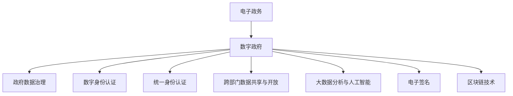

                 

# 2050年的数字治理：从电子政务到数字政府的转型升级

## 1. 背景介绍

### 1.1 问题由来

随着信息技术的快速发展，数字治理已成为现代国家治理的重要手段。传统的电子政务系统虽然提高了政府办公效率，但存在信息孤岛、服务割裂、用户体验差等问题。要实现国家治理体系和治理能力现代化，需要从电子政务向数字政府全面升级。

### 1.2 问题核心关键点

数字政府是基于大数据、云计算、人工智能等现代信息技术，对政府治理体系和服务模式进行深度变革的现代化治理模式。其核心目标是通过数据共享、协同治理、公共参与等机制，提升政府决策科学性、服务精准性和透明度。

### 1.3 问题研究意义

研究数字治理的转型升级，对于深化政府职能转变、提升公共服务质量、构建智慧型政府具有重要意义：

1. 提升政府决策水平。通过数据驱动的智能决策，辅助领导层决策，提高决策精准性和科学性。
2. 优化公共服务体验。构建一体化的数字服务体系，打破信息孤岛，实现服务全程在线，提升用户体验。
3. 增强治理透明性。通过公开透明的数据共享，构建信任型政府，提升社会监督效果。
4. 促进经济社会数字化。推动各行业数字化转型，激发经济活力，促进社会创新。

## 2. 核心概念与联系

### 2.1 核心概念概述

为更好地理解数字治理的转型升级，本节将介绍几个密切相关的核心概念：

- 电子政务(Electronic Government, e-Government)：基于信息技术，政府业务办理、信息公开等在线化的治理模式。

- 数字政府(Digital Government)：以数据为驱动，集成互联网、大数据、人工智能等现代信息技术，实现政府治理体系和服务的全面数字化、智能化。

- 政府数据治理：通过数据采集、存储、管理和共享，构建统一的数据平台，为数字政府建设提供基础支撑。

- 数字身份认证：利用密码、指纹、人脸识别等技术，确保网上政务服务的身份真实性。

- 统一身份认证(UAA, Single Sign-On)：实现多系统、多平台的单点登录和统一认证，简化用户操作。

- 跨部门数据共享与开放：通过标准化的数据接口和API，实现部门间数据的无缝对接和开放共享。

- 大数据分析与人工智能(AI)：利用大数据技术进行数据挖掘、模式识别、趋势预测，辅助政府决策；通过AI技术实现智能客服、智能推荐等功能。

- 电子签名(E-Signature)：通过数字证书和数字签名技术，确保电子文档的真实性和不可篡改性。

- 区块链技术(Blockchain)：利用分布式账本和智能合约等技术，保障数据安全和透明性。

这些核心概念之间的逻辑关系可以通过以下Mermaid流程图来展示：



这个流程图展示了大语言模型的核心概念及其之间的关系：

1. 数字政府建立在电子政务的基础上，实现数字化、智能化转型。
2. 政府数据治理是数字政府的基础设施，保障数据安全和共享。
3. 数字身份认证、统一身份认证、跨部门数据共享与开放是数字政府的重要组件，确保服务安全性和可用性。
4. 大数据分析和人工智能是数字政府的重要技术支撑，提升决策和服务的智能化水平。
5. 电子签名和区块链技术是数字政府的重要安全手段，保障数据的安全性和透明性。

这些概念共同构成了数字政府的完整框架，使其能够实现全面、高效、安全的治理目标。通过理解这些核心概念，我们可以更好地把握数字治理的转型升级方向。

## 3. 核心算法原理 & 具体操作步骤
### 3.1 算法原理概述

数字治理的转型升级，本质上是通过现代信息技术对政府治理体系和服务模式进行全面优化。其核心思想是：以数据为中心，通过集成互联网、大数据、人工智能等技术，实现政府决策、服务、管理的数字化和智能化。

形式化地，假设政府治理目标为 $G$，相关数据集为 $D=\{(x_i,y_i)\}_{i=1}^N$，其中 $x_i$ 表示政府决策和服务的输入数据，$y_i$ 表示相应的输出结果（如政策、服务、反馈等）。数字治理的目标是构建最优的治理模型 $M$，使得：

$$
M = \mathop{\arg\min}_{M} \mathcal{L}(M,D)
$$

其中 $\mathcal{L}$ 为损失函数，用于衡量模型预测结果与实际结果的差异。常见的损失函数包括均方误差、交叉熵等。

通过梯度下降等优化算法，数字治理过程不断更新模型参数，最小化损失函数，使得模型输出逼近理想结果。由于数字治理涉及多个部门和多种业务，模型构建和优化过程也更为复杂。

### 3.2 算法步骤详解

数字治理的转型升级主要包括以下几个关键步骤：

**Step 1: 数据采集与清洗**

- 收集政府决策、服务、反馈等多方面的数据，包括文本、图像、视频、语音等多种形式。
- 对原始数据进行清洗、去重、标注等预处理，确保数据质量和一致性。

**Step 2: 数据标准化与整合**

- 制定统一的数据标准和规范，如数据格式、编码、接口等，确保不同部门、不同业务的数据可以无缝对接。
- 使用ETL工具进行数据提取、转换、加载，构建一体化的数据仓库。

**Step 3: 数据治理与存储**

- 采用大数据技术进行数据治理，包括数据质量监控、数据生命周期管理、数据访问控制等。
- 利用云存储和分布式文件系统，实现大规模数据的存储和管理。

**Step 4: 数据分析与模型构建**

- 使用大数据技术进行数据挖掘、模式识别、趋势预测等分析，提取有价值的信息。
- 构建合适的治理模型，如深度学习、机器学习、规则引擎等，进行模型训练和优化。

**Step 5: 数字服务与决策支持**

- 将构建好的模型集成到数字服务系统中，实现智能客服、智能推荐、智能监管等功能。
- 提供决策支持工具，辅助领导层进行科学决策。

**Step 6: 安全与隐私保护**

- 采用数据加密、身份认证、访问控制等技术，保障数据安全和隐私。
- 引入区块链技术，构建透明、可信的数据共享机制。

**Step 7: 评估与优化**

- 定期对数字治理效果进行评估，收集用户反馈，优化模型和服务。
- 持续改进数据治理体系，提升政府治理效率和服务水平。

以上是数字治理转型升级的一般流程。在实际应用中，还需要根据具体任务的特点，对各个环节进行优化设计，如改进数据治理机制，引入更多的先进技术等，以进一步提升治理效果。

### 3.3 算法优缺点

数字治理的转型升级方法具有以下优点：

1. 提升治理效率。通过数据驱动的智能决策，辅助领导层决策，提高决策精准性和科学性。
2. 优化公共服务。构建一体化的数字服务体系，打破信息孤岛，实现服务全程在线，提升用户体验。
3. 增强治理透明性。通过公开透明的数据共享，构建信任型政府，提升社会监督效果。
4. 促进经济社会发展。推动各行业数字化转型，激发经济活力，促进社会创新。

同时，该方法也存在一定的局限性：

1. 数据依赖性强。数字治理的效果很大程度上取决于数据的质量和量，数据采集和清洗成本较高。
2. 技术复杂度高。涉及多种先进技术的集成和应用，技术实施难度较大。
3. 数据安全和隐私问题。大规模数据存储和共享，容易受到黑客攻击和信息泄露，需要采取严格的保护措施。
4. 资源消耗大。数据治理和模型构建需要大量计算资源和时间，初期投资成本较高。
5. 技术更新快。大数据、人工智能等技术日新月异，数字治理系统需要持续更新和维护。

尽管存在这些局限性，但就目前而言，数字治理的转型升级方法已成为政府治理现代化的重要手段。未来相关研究的重点在于如何进一步降低数据依赖，提高技术易用性，确保数据安全和隐私，同时兼顾可扩展性和灵活性。

### 3.4 算法应用领域

数字治理的转型升级方法已经在政府决策、公共服务、智能监管等多个领域得到广泛应用，成为现代政府治理的重要手段。

- **政府决策**：通过数据分析和模型构建，辅助领导层进行决策，提高决策的科学性和精准性。例如，利用大数据分析预测经济趋势，制定宏观调控政策。
- **公共服务**：构建一体化的数字服务体系，打破信息孤岛，实现服务全程在线，提升用户体验。例如，电子政务平台、公共服务平台等。
- **智能监管**：利用大数据和人工智能技术，进行数据监控和分析，实现智能监管和风险预警。例如，税务监管、环境监测、食品安全等。
- **智慧城市**：利用物联网、云计算、人工智能等技术，实现城市管理的智能化和精细化。例如，智慧交通、智能安防、智慧医疗等。
- **经济社会发展**：推动各行业数字化转型，激发经济活力，促进社会创新。例如，数字经济、智慧农业、智能制造等。

除了上述这些经典应用外，数字治理还被创新性地应用到更多场景中，如智慧教育、智慧健康、智慧社区等，为政府治理和公共服务提供了全新的可能性。

## 4. 数学模型和公式 & 详细讲解  
### 4.1 数学模型构建

本节将使用数学语言对数字治理的转型升级过程进行更加严格的刻画。

假设数字治理目标为 $G$，相关数据集为 $D=\{(x_i,y_i)\}_{i=1}^N$，其中 $x_i$ 表示政府决策和服务的输入数据，$y_i$ 表示相应的输出结果（如政策、服务、反馈等）。

定义模型 $M$ 在数据样本 $(x,y)$ 上的损失函数为 $\ell(M(x),y)$，则在数据集 $D$ 上的经验风险为：

$$
\mathcal{L}(M) = \frac{1}{N}\sum_{i=1}^N \ell(M(x_i),y_i)
$$

数字治理的目标是最小化经验风险，即找到最优模型：

$$
M^* = \mathop{\arg\min}_{M} \mathcal{L}(M)
$$

在实践中，我们通常使用基于梯度的优化算法（如SGD、Adam等）来近似求解上述最优化问题。设 $\eta$ 为学习率，$\lambda$ 为正则化系数，则参数的更新公式为：

$$
\theta \leftarrow \theta - \eta \nabla_{\theta}\mathcal{L}(\theta) - \eta\lambda\theta
$$

其中 $\nabla_{\theta}\mathcal{L}(\theta)$ 为损失函数对参数 $\theta$ 的梯度，可通过反向传播算法高效计算。

### 4.2 公式推导过程

以下我们以政府决策为例，推导交叉熵损失函数及其梯度的计算公式。

假设模型 $M_{\theta}$ 在输入 $x$ 上的输出为 $\hat{y}=M_{\theta}(x) \in [0,1]$，表示政府决策结果的概率。真实标签 $y \in \{0,1\}$。则二分类交叉熵损失函数定义为：

$$
\ell(M_{\theta}(x),y) = -[y\log \hat{y} + (1-y)\log (1-\hat{y})]
$$

将其代入经验风险公式，得：

$$
\mathcal{L}(\theta) = -\frac{1}{N}\sum_{i=1}^N [y_i\log M_{\theta}(x_i)+(1-y_i)\log(1-M_{\theta}(x_i))]
$$

根据链式法则，损失函数对参数 $\theta_k$ 的梯度为：

$$
\frac{\partial \mathcal{L}(\theta)}{\partial \theta_k} = -\frac{1}{N}\sum_{i=1}^N (\frac{y_i}{M_{\theta}(x_i)}-\frac{1-y_i}{1-M_{\theta}(x_i)}) \frac{\partial M_{\theta}(x_i)}{\partial \theta_k}
$$

其中 $\frac{\partial M_{\theta}(x_i)}{\partial \theta_k}$ 可进一步递归展开，利用自动微分技术完成计算。

在得到损失函数的梯度后，即可带入参数更新公式，完成模型的迭代优化。重复上述过程直至收敛，最终得到适应数字治理目标的最优模型参数 $\theta^*$。

## 5. 项目实践：代码实例和详细解释说明
### 5.1 开发环境搭建

在进行数字治理的转型升级实践前，我们需要准备好开发环境。以下是使用Python进行PyTorch开发的环境配置流程：

1. 安装Anaconda：从官网下载并安装Anaconda，用于创建独立的Python环境。

2. 创建并激活虚拟环境：
```bash
conda create -n pytorch-env python=3.8 
conda activate pytorch-env
```

3. 安装PyTorch：根据CUDA版本，从官网获取对应的安装命令。例如：
```bash
conda install pytorch torchvision torchaudio cudatoolkit=11.1 -c pytorch -c conda-forge
```

4. 安装Transformer库：
```bash
pip install transformers
```

5. 安装各类工具包：
```bash
pip install numpy pandas scikit-learn matplotlib tqdm jupyter notebook ipython
```

完成上述步骤后，即可在`pytorch-env`环境中开始数字治理的转型升级实践。

### 5.2 源代码详细实现

这里我们以智能客服系统的构建为例，给出使用Transformers库对BERT模型进行微调的PyTorch代码实现。

首先，定义智能客服系统的数据处理函数：

```python
from transformers import BertTokenizer
from torch.utils.data import Dataset
import torch

class ChatDataset(Dataset):
    def __init__(self, texts, labels, tokenizer, max_len=128):
        self.texts = texts
        self.labels = labels
        self.tokenizer = tokenizer
        self.max_len = max_len
        
    def __len__(self):
        return len(self.texts)
    
    def __getitem__(self, item):
        text = self.texts[item]
        label = self.labels[item]
        
        encoding = self.tokenizer(text, return_tensors='pt', max_length=self.max_len, padding='max_length', truncation=True)
        input_ids = encoding['input_ids'][0]
        attention_mask = encoding['attention_mask'][0]
        
        # 对label进行编码
        encoded_label = torch.tensor([label], dtype=torch.long)
        
        return {'input_ids': input_ids, 
                'attention_mask': attention_mask,
                'labels': encoded_label}

# 标签与id的映射
label2id = {'negative': 0, 'positive': 1}
id2label = {v: k for k, v in label2id.items()}

# 创建dataset
tokenizer = BertTokenizer.from_pretrained('bert-base-cased')

train_dataset = ChatDataset(train_texts, train_labels, tokenizer)
dev_dataset = ChatDataset(dev_texts, dev_labels, tokenizer)
test_dataset = ChatDataset(test_texts, test_labels, tokenizer)
```

然后，定义模型和优化器：

```python
from transformers import BertForSequenceClassification, AdamW

model = BertForSequenceClassification.from_pretrained('bert-base-cased', num_labels=2)

optimizer = AdamW(model.parameters(), lr=2e-5)
```

接着，定义训练和评估函数：

```python
from torch.utils.data import DataLoader
from tqdm import tqdm
from sklearn.metrics import accuracy_score, precision_recall_fscore_support

device = torch.device('cuda') if torch.cuda.is_available() else torch.device('cpu')
model.to(device)

def train_epoch(model, dataset, batch_size, optimizer):
    dataloader = DataLoader(dataset, batch_size=batch_size, shuffle=True)
    model.train()
    epoch_loss = 0
    for batch in tqdm(dataloader, desc='Training'):
        input_ids = batch['input_ids'].to(device)
        attention_mask = batch['attention_mask'].to(device)
        labels = batch['labels'].to(device)
        model.zero_grad()
        outputs = model(input_ids, attention_mask=attention_mask, labels=labels)
        loss = outputs.loss
        epoch_loss += loss.item()
        loss.backward()
        optimizer.step()
    return epoch_loss / len(dataloader)

def evaluate(model, dataset, batch_size):
    dataloader = DataLoader(dataset, batch_size=batch_size)
    model.eval()
    preds, labels = [], []
    with torch.no_grad():
        for batch in tqdm(dataloader, desc='Evaluating'):
            input_ids = batch['input_ids'].to(device)
            attention_mask = batch['attention_mask'].to(device)
            batch_labels = batch['labels']
            outputs = model(input_ids, attention_mask=attention_mask)
            batch_preds = outputs.logits.argmax(dim=2).to('cpu').tolist()
            batch_labels = batch_labels.to('cpu').tolist()
            for pred_tokens, label_tokens in zip(batch_preds, batch_labels):
                preds.append(pred_tokens[:len(label_tokens)])
                labels.append(label_tokens)
                
    acc = accuracy_score(labels, preds)
    precision, recall, f1, _ = precision_recall_fscore_support(labels, preds, average='binary')
    print(f"Accuracy: {acc:.2f}, Precision: {precision:.2f}, Recall: {recall:.2f}, F1 Score: {f1:.2f}")
```

最后，启动训练流程并在测试集上评估：

```python
epochs = 5
batch_size = 16

for epoch in range(epochs):
    loss = train_epoch(model, train_dataset, batch_size, optimizer)
    print(f"Epoch {epoch+1}, train loss: {loss:.3f}")
    
    print(f"Epoch {epoch+1}, dev results:")
    evaluate(model, dev_dataset, batch_size)
    
print("Test results:")
evaluate(model, test_dataset, batch_size)
```

以上就是使用PyTorch对BERT进行智能客服系统微调的完整代码实现。可以看到，得益于Transformers库的强大封装，我们可以用相对简洁的代码完成BERT模型的加载和微调。

### 5.3 代码解读与分析

让我们再详细解读一下关键代码的实现细节：

**ChatDataset类**：
- `__init__`方法：初始化文本、标签、分词器等关键组件。
- `__len__`方法：返回数据集的样本数量。
- `__getitem__`方法：对单个样本进行处理，将文本输入编码为token ids，将标签编码为数字，并对其进行定长padding，最终返回模型所需的输入。

**label2id和id2label字典**：
- 定义了标签与数字id之间的映射关系，用于将label-编号的预测结果解码回真实的标签。

**训练和评估函数**：
- 使用PyTorch的DataLoader对数据集进行批次化加载，供模型训练和推理使用。
- 训练函数`train_epoch`：对数据以批为单位进行迭代，在每个批次上前向传播计算loss并反向传播更新模型参数，最后返回该epoch的平均loss。
- 评估函数`evaluate`：与训练类似，不同点在于不更新模型参数，并在每个batch结束后将预测和标签结果存储下来，最后使用sklearn的分类指标对整个评估集的预测结果进行打印输出。

**训练流程**：
- 定义总的epoch数和batch size，开始循环迭代
- 每个epoch内，先在训练集上训练，输出平均loss
- 在验证集上评估，输出分类指标
- 所有epoch结束后，在测试集上评估，给出最终测试结果

可以看到，PyTorch配合Transformers库使得BERT微调的代码实现变得简洁高效。开发者可以将更多精力放在数据处理、模型改进等高层逻辑上，而不必过多关注底层的实现细节。

当然，工业级的系统实现还需考虑更多因素，如模型的保存和部署、超参数的自动搜索、更灵活的任务适配层等。但核心的微调范式基本与此类似。

## 6. 实际应用场景
### 6.1 智能客服系统

基于大语言模型微调的对话技术，可以广泛应用于智能客服系统的构建。传统客服往往需要配备大量人力，高峰期响应缓慢，且一致性和专业性难以保证。而使用微调后的对话模型，可以7x24小时不间断服务，快速响应客户咨询，用自然流畅的语言解答各类常见问题。

在技术实现上，可以收集企业内部的历史客服对话记录，将问题和最佳答复构建成监督数据，在此基础上对预训练对话模型进行微调。微调后的对话模型能够自动理解用户意图，匹配最合适的答案模板进行回复。对于客户提出的新问题，还可以接入检索系统实时搜索相关内容，动态组织生成回答。如此构建的智能客服系统，能大幅提升客户咨询体验和问题解决效率。

### 6.2 金融舆情监测

金融机构需要实时监测市场舆论动向，以便及时应对负面信息传播，规避金融风险。传统的人工监测方式成本高、效率低，难以应对网络时代海量信息爆发的挑战。基于大语言模型微调的文本分类和情感分析技术，为金融舆情监测提供了新的解决方案。

具体而言，可以收集金融领域相关的新闻、报道、评论等文本数据，并对其进行主题标注和情感标注。在此基础上对预训练语言模型进行微调，使其能够自动判断文本属于何种主题，情感倾向是正面、中性还是负面。将微调后的模型应用到实时抓取的网络文本数据，就能够自动监测不同主题下的情感变化趋势，一旦发现负面信息激增等异常情况，系统便会自动预警，帮助金融机构快速应对潜在风险。

### 6.3 个性化推荐系统

当前的推荐系统往往只依赖用户的历史行为数据进行物品推荐，无法深入理解用户的真实兴趣偏好。基于大语言模型微调技术，个性化推荐系统可以更好地挖掘用户行为背后的语义信息，从而提供更精准、多样的推荐内容。

在实践中，可以收集用户浏览、点击、评论、分享等行为数据，提取和用户交互的物品标题、描述、标签等文本内容。将文本内容作为模型输入，用户的后续行为（如是否点击、购买等）作为监督信号，在此基础上微调预训练语言模型。微调后的模型能够从文本内容中准确把握用户的兴趣点。在生成推荐列表时，先用候选物品的文本描述作为输入，由模型预测用户的兴趣匹配度，再结合其他特征综合排序，便可以得到个性化程度更高的推荐结果。

### 6.4 未来应用展望

随着数字治理技术的不断发展，数字政府的应用场景将不断拓展，实现全面、高效、安全的治理目标。

在智慧医疗领域，基于大语言模型微调的智能诊断、智能问答、智能健康管理等应用将大幅提升医疗服务的智能化水平，辅助医生诊疗，加速新药开发进程。

在智能教育领域，微调技术可应用于作业批改、学情分析、知识推荐等方面，因材施教，促进教育公平，提高教学质量。

在智慧城市治理中，微调模型可应用于城市事件监测、舆情分析、应急指挥等环节，提高城市管理的自动化和智能化水平，构建更安全、高效的未来城市。

此外，在企业生产、社会治理、文娱传媒等众多领域，基于大模型微调的人工智能应用也将不断涌现，为经济社会发展注入新的动力。相信随着技术的日益成熟，微调方法将成为政府治理现代化的重要范式，推动政府职能转变和经济社会发展。

## 7. 工具和资源推荐
### 7.1 学习资源推荐

为了帮助开发者系统掌握数字治理的理论基础和实践技巧，这里推荐一些优质的学习资源：

1. 《数字政府理论与实践》系列博文：由政府信息化专家撰写，深入浅出地介绍了数字政府的基本概念、核心技术、实施路径等。

2. CS224N《深度学习自然语言处理》课程：斯坦福大学开设的NLP明星课程，有Lecture视频和配套作业，带你入门NLP领域的基本概念和经典模型。

3. 《数字政府建设与实施指南》书籍：系统介绍了数字政府建设的背景、目标、方案和实施策略，适合各级政府和公共管理从业人员阅读。

4. 《数字身份认证技术与应用》书籍：深入浅出地介绍了数字身份认证的基本原理、关键技术、安全措施等。

5. 《大数据分析与政府决策》书籍：介绍大数据技术在政府决策中的应用，包括数据治理、数据建模、智能决策等内容。

6. 《区块链技术与应用》书籍：介绍区块链的基本概念、技术原理、应用场景等，适合对区块链技术感兴趣的读者。

通过对这些资源的学习实践，相信你一定能够快速掌握数字治理的精髓，并用于解决实际的NLP问题。
###  7.2 开发工具推荐

高效的开发离不开优秀的工具支持。以下是几款用于数字治理开发的常用工具：

1. PyTorch：基于Python的开源深度学习框架，灵活动态的计算图，适合快速迭代研究。大部分预训练语言模型都有PyTorch版本的实现。

2. TensorFlow：由Google主导开发的开源深度学习框架，生产部署方便，适合大规模工程应用。同样有丰富的预训练语言模型资源。

3. Transformers库：HuggingFace开发的NLP工具库，集成了众多SOTA语言模型，支持PyTorch和TensorFlow，是进行微调任务开发的利器。

4. Weights & Biases：模型训练的实验跟踪工具，可以记录和可视化模型训练过程中的各项指标，方便对比和调优。与主流深度学习框架无缝集成。

5. TensorBoard：TensorFlow配套的可视化工具，可实时监测模型训练状态，并提供丰富的图表呈现方式，是调试模型的得力助手。

6. Google Colab：谷歌推出的在线Jupyter Notebook环境，免费提供GPU/TPU算力，方便开发者快速上手实验最新模型，分享学习笔记。

合理利用这些工具，可以显著提升数字治理的开发效率，加快创新迭代的步伐。

### 7.3 相关论文推荐

数字治理的转型升级源于学界的持续研究。以下是几篇奠基性的相关论文，推荐阅读：

1. Data-Driven Policy Making: Governance by Analytics （数据驱动的决策制定）：提出了基于大数据和人工智能的智能决策框架，探讨了数据治理在政策制定中的应用。

2. A Survey on Digital Government Infrastructure: Opportunities and Challenges（数字政府基础设施综述）：总结了数字政府基础设施的研究现状，探讨了数字治理的技术框架和应用场景。

3. Intelligent Analytics for Public Sector Decision Making: A Survey（面向公共部门决策的智能分析综述）：介绍了智能分析在公共决策中的应用，包括数据分析、智能建模、可视化等内容。

4. Blockchain-based Governance Models: Opportunities and Challenges（区块链治理模型综述）：探讨了区块链技术在政府治理中的应用，包括透明性、安全性、隐私保护等内容。

5. Digital Identity and Privacy Protection in the Age of Smart Governance（智能治理时代的数据身份和隐私保护）：介绍了数字身份技术在智能治理中的应用，探讨了隐私保护和安全防范的措施。

这些论文代表了大语言模型微调技术的发展脉络。通过学习这些前沿成果，可以帮助研究者把握学科前进方向，激发更多的创新灵感。

## 8. 总结：未来发展趋势与挑战

### 8.1 总结

本文对数字治理的转型升级方法进行了全面系统的介绍。首先阐述了数字治理的研究背景和意义，明确了数字治理在提升政府决策水平、优化公共服务体验、增强治理透明性等方面的独特价值。其次，从原理到实践，详细讲解了数字治理的数学模型和关键步骤，给出了数字治理任务开发的完整代码实例。同时，本文还广泛探讨了数字治理在智能客服、金融舆情、个性化推荐等多个行业领域的应用前景，展示了数字治理范式的巨大潜力。此外，本文精选了数字治理技术的各类学习资源，力求为读者提供全方位的技术指引。

通过本文的系统梳理，可以看到，数字治理的转型升级方法正在成为现代政府治理的重要手段，极大地拓展了政府职能的数字化、智能化边界，催生了更多的落地场景。受益于大数据、云计算、人工智能等现代信息技术的深度融合，数字治理系统将在决策、服务、监管等各个环节发挥越来越重要的作用。未来，伴随数字治理技术的持续演进，相信数字政府将实现全面、高效、安全的治理目标，推动国家治理体系和治理能力现代化。

### 8.2 未来发展趋势

展望未来，数字治理的转型升级方法将呈现以下几个发展趋势：

1. 数据治理体系日益完善。随着数据采集、存储、管理技术的不断发展，数据治理体系将更加全面、高效，支撑政府决策和服务的智能化。

2. 智能决策水平不断提升。通过大数据和人工智能技术，智能决策模型将更加精准、智能，辅助领导层决策，提升决策效果。

3. 数字服务体系更加一体化。打破信息孤岛，实现跨部门、跨平台的数据和服务共享，构建无缝对接的数字服务体系。

4. 社会参与度进一步提高。利用互联网、社交媒体等平台，构建公众参与机制，增强政府透明度和公信力。

5. 数字治理标准不断统一。制定统一的数字治理标准和规范，保障数据和服务的标准化、规范化。

6. 智能监管手段更加丰富。引入区块链、物联网等新兴技术，实现智能监管和风险预警，提升治理效率。

7. 安全防护能力持续增强。加强数据加密、身份认证、访问控制等安全防护措施，保障数据安全和隐私。

以上趋势凸显了数字治理技术的广阔前景。这些方向的探索发展，必将进一步提升数字政府的服务质量和治理能力，为构建智慧型政府奠定坚实基础。

### 8.3 面临的挑战

尽管数字治理的转型升级方法已经取得了瞩目成就，但在迈向更加智能化、普适化应用的过程中，它仍面临着诸多挑战：

1. 数据依赖性强。数字治理的效果很大程度上取决于数据的质量和量，数据采集和清洗成本较高。

2. 技术复杂度高。涉及多种先进技术的集成和应用，技术实施难度较大。

3. 数据安全和隐私问题。大规模数据存储和共享，容易受到黑客攻击和信息泄露，需要采取严格的保护措施。

4. 资源消耗大。数据治理和模型构建需要大量计算资源和时间，初期投资成本较高。

5. 技术更新快。大数据、人工智能等技术日新月异，数字治理系统需要持续更新和维护。

尽管存在这些局限性，但就目前而言，数字治理的转型升级方法已成为现代政府治理的重要手段。未来相关研究的重点在于如何进一步降低数据依赖，提高技术易用性，确保数据安全和隐私，同时兼顾可扩展性和灵活性。

### 8.4 研究展望

面向未来，数字治理技术的研究还需要在以下几个方面寻求新的突破：

1. 探索无监督和半监督数字治理方法。摆脱对大规模标注数据的依赖，利用自监督学习、主动学习等无监督和半监督范式，最大限度利用非结构化数据，实现更加灵活高效的治理。

2. 研究参数高效和计算高效的数字治理范式。开发更加参数高效的数字治理方法，在固定大部分预训练参数的同时，只更新极少量的任务相关参数。同时优化数字治理模型的计算图，减少前向传播和反向传播的资源消耗，实现更加轻量级、实时性的部署。

3. 融合因果和对比学习范式。通过引入因果推断和对比学习思想，增强数字治理模型建立稳定因果关系的能力，学习更加普适、鲁棒的语言表征，从而提升模型泛化性和抗干扰能力。

4. 引入更多先验知识。将符号化的先验知识，如知识图谱、逻辑规则等，与神经网络模型进行巧妙融合，引导数字治理过程学习更准确、合理的语言模型。同时加强不同模态数据的整合，实现视觉、语音等多模态信息与文本信息的协同建模。

5. 结合因果分析和博弈论工具。将因果分析方法引入数字治理模型，识别出模型决策的关键特征，增强输出解释的因果性和逻辑性。借助博弈论工具刻画人机交互过程，主动探索并规避模型的脆弱点，提高系统稳定性。

6. 纳入伦理道德约束。在数字治理模型训练目标中引入伦理导向的评估指标，过滤和惩罚有害的输出倾向。同时加强人工干预和审核，建立模型行为的监管机制，确保输出符合人类价值观和伦理道德。

这些研究方向的探索，必将引领数字治理技术迈向更高的台阶，为构建安全、可靠、可解释、可控的智能系统铺平道路。面向未来，数字治理技术还需要与其他人工智能技术进行更深入的融合，如知识表示、因果推理、强化学习等，多路径协同发力，共同推动数字治理的进步。只有勇于创新、敢于突破，才能不断拓展数字治理的边界，让智能技术更好地造福社会。

## 9. 附录：常见问题与解答

**Q1：数字治理的转型升级是否适用于所有政府部门？**

A: 数字治理的转型升级方法适用于大部分政府部门，特别是那些职能较为明确的部门，如工商、税务、环保等。而对于一些职能较为分散或模糊的部门，如文化、宗教、教育等，实施难度较大。

**Q2：数字治理的转型升级能否提高政府效率？**

A: 数字治理的转型升级能够显著提高政府效率。通过数据驱动的智能决策，减少人工干预，提高决策精准性。通过统一的数字服务体系，打破信息孤岛，实现服务全程在线，提升用户体验。通过智能监管和风险预警，提高治理效率和效果。

**Q3：数字治理的转型升级对政府工作人员有什么影响？**

A: 数字治理的转型升级对政府工作人员提出了更高的要求。需要掌握大数据、人工智能等先进技术，提升数据处理和分析能力。需要适应新的工作模式和流程，增强信息化素养。需要不断学习和培训，保持技术前沿。

**Q4：数字治理的转型升级如何保障数据安全和隐私？**

A: 数字治理的转型升级需要采取多种措施保障数据安全和隐私。采用数据加密、身份认证、访问控制等技术，保障数据存储和传输的安全。引入区块链技术，构建透明、可信的数据共享机制。加强数据安全管理和审计，及时发现和防范数据泄露风险。

**Q5：数字治理的转型升级能否实现全程在线服务？**

A: 数字治理的转型升级可以实现全程在线服务。通过构建统一的数字服务体系，打破部门间的数据和业务壁垒，实现服务全程在线。利用大数据和人工智能技术，实现智能客服、智能推荐、智能监管等功能，提升服务效率和用户体验。

---

作者：禅与计算机程序设计艺术 / Zen and the Art of Computer Programming

