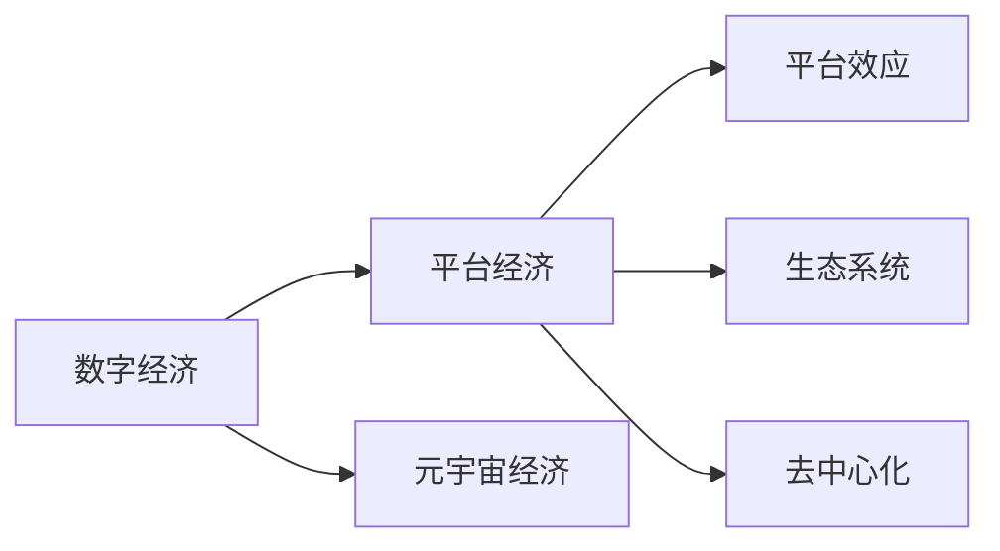

                 

## 1. 背景介绍

随着互联网技术的飞速发展，数字经济已经成为推动全球经济增长的重要引擎。过去几十年间，从PC互联网到移动互联网，再到物联网，每一次技术革新都深刻改变了人类社会的生产生活方式。2050年，数字经济将迎来一场新的变革：从平台经济向元宇宙经济转变，带来全新的数字经济形态和商业模式。

### 1.1 数字经济演进历程

- **PC互联网时代**：
  - 20世纪90年代至21世纪初，PC互联网的普及推动了电子商务、在线支付、社交网络等新兴产业的发展。
  - 大规模电子商务平台如亚马逊、淘宝等成为数字经济的重要组成部分。

- **移动互联网时代**：
  - 2010年代至今，智能手机和4G/5G技术的普及，推动了移动支付、共享经济、O2O等新兴业态的兴起。
  - 大型社交平台如微信、抖音、Facebook等深度融合到日常生活中。

- **物联网时代**：
  - 2015年以后，物联网技术加速发展，智能家居、智慧城市、工业物联网等应用不断涌现。
  - 大数据、云计算、人工智能等技术为物联网提供了强有力的支撑。

### 1.2 数字经济面临的挑战

尽管数字经济蓬勃发展，但也面临着诸多挑战：
- **隐私安全**：大规模数据采集和使用引发隐私保护问题。
- **数字鸿沟**：技术普及不均导致数字治理难题。
- **市场垄断**：巨头公司对市场的控制力增强，引发监管难题。

## 2. 核心概念与联系

### 2.1 核心概念概述

- **数字经济**：指利用数字技术和信息资源驱动经济活动的方式，包括电子商务、在线支付、智能制造、数字服务等。
- **平台经济**：基于双边市场理论，通过第三方平台连接生产者和消费者，形成交易机制的经济模式。
- **元宇宙经济**：通过区块链、VR/AR、云计算等技术，构建虚拟世界与现实世界深度融合的商业模式。

- **平台效应**：平台通过网络效应吸引更多的用户和参与者，形成自我强化的良性循环。
- **生态系统**：平台经济中，各利益相关方通过互相依存、协作，形成复杂而稳定的生态系统。
- **去中心化**：元宇宙经济中，通过区块链技术实现去中心化，降低传统中心化平台的控制权。

这些核心概念之间的关系可以用以下Mermaid流程图表示：



### 2.2 核心概念原理和架构

平台经济和元宇宙经济的构建依赖于多层次的技术架构：

- **底层技术**：包括区块链、云计算、大数据、人工智能等，为平台和元宇宙提供技术支撑。
- **中间件**：如分布式计算、存储、通信协议等，实现高效数据传输和处理。
- **应用层**：包括社交网络、电子商务、游戏、金融等，提供具体应用场景和价值创造。

平台经济的核心在于构建高效的资源配置机制，通过平台算法优化交易成本和效率。而元宇宙经济则通过虚拟空间和现实世界的融合，实现全新的价值创造和消费体验。

## 3. 核心算法原理 & 具体操作步骤

### 3.1 算法原理概述

- **平台算法**：采用推荐系统、匹配算法等技术，优化平台上的供需匹配，提升交易效率。
- **元宇宙算法**：通过虚拟现实(VR)、增强现实(AR)等技术，构建沉浸式虚拟空间，实现虚拟物品的创造、交易和消费。

### 3.2 算法步骤详解

#### 3.2.1 平台经济算法步骤

1. **数据收集与处理**：收集用户行为数据、交易数据、评价数据等，构建数据仓库。
2. **特征提取**：对用户、商品、交易行为等进行特征提取，建立用户画像和商品画像。
3. **模型训练**：采用机器学习算法，如协同过滤、神经网络等，训练推荐系统模型。
4. **推荐与匹配**：将模型应用于实时推荐和匹配算法，提升用户满意度。
5. **优化与迭代**：通过A/B测试等手段，不断优化推荐模型，提升推荐效果。

#### 3.2.2 元宇宙经济算法步骤

1. **虚拟空间构建**：采用VR/AR技术，构建虚拟世界和物品模型。
2. **虚拟物品创造**：使用区块链技术，实现虚拟物品的创建和所有权确权。
3. **虚拟物品交易**：采用智能合约和分布式账本技术，实现虚拟物品的交易和结算。
4. **虚拟物品消费**：通过VR/AR界面，提供虚拟物品的沉浸式体验。
5. **生态系统管理**：通过治理算法，维护虚拟物品市场秩序，确保系统稳定。

### 3.3 算法优缺点

- **平台经济算法优点**：
  - **效率提升**：通过平台算法优化交易效率，降低市场信息不对称。
  - **规模经济**：平台效应带来用户和资源的聚集，形成规模经济效应。
  - **数据驱动**：通过大数据分析，实现精准推荐和个性化服务。

- **平台经济算法缺点**：
  - **垄断风险**：平台集中了大量用户和资源，可能导致市场垄断。
  - **隐私问题**：用户数据隐私保护存在较大挑战。
  - **算法偏见**：推荐系统可能存在算法偏见，影响用户公平性。

- **元宇宙经济算法优点**：
  - **沉浸体验**：通过VR/AR技术，提供沉浸式虚拟体验。
  - **去中心化**：通过区块链技术，实现去中心化交易和治理。
  - **新价值创造**：在虚拟空间中，创造新的商业模式和价值空间。

- **元宇宙经济算法缺点**：
  - **技术门槛**：高技术门槛和成本，限制了普及程度。
  - **安全风险**：虚拟物品交易和结算存在安全风险。
  - **监管挑战**：虚拟空间中的行为和资产难以监管。

### 3.4 算法应用领域

- **平台经济**：
  - 电商：如京东、阿里巴巴等，通过平台算法优化供应链和物流。
  - 社交：如微信、微博等，提供社交网络和社区平台。
  - 金融：如支付宝、PayPal等，通过平台优化支付和融资服务。

- **元宇宙经济**：
  - 虚拟商品：如Decentraland、The Sandbox等，提供虚拟物品交易平台。
  - 虚拟房地产：如Epic Games、Sandbox等，构建虚拟土地和建筑市场。
  - 虚拟娱乐：如VR游戏、虚拟演唱会等，提供沉浸式娱乐体验。

## 4. 数学模型和公式 & 详细讲解 & 举例说明

### 4.1 数学模型构建

平台经济和元宇宙经济中的关键模型包括：

- **推荐系统模型**：基于协同过滤、神经网络等算法构建。
- **虚拟物品交易模型**：基于智能合约和区块链技术实现。

### 4.2 公式推导过程

#### 4.2.1 推荐系统模型

推荐系统模型可以采用协同过滤或神经网络算法。以协同过滤为例，假设有用户集 $U=\{u_1,u_2,...,u_m\}$，物品集 $I=\{i_1,i_2,...,i_n\}$，用户对物品的评分矩阵 $R \in \mathbb{R}^{m \times n}$。

协同过滤模型的目标是最小化用户-物品评分误差，即：

$$
\min_{\theta} \sum_{(u,i) \in U \times I} (r_{ui} - \hat{r}_{ui})^2
$$

其中 $\theta$ 为模型参数，$\hat{r}_{ui}$ 为模型预测评分。

#### 4.2.2 虚拟物品交易模型

虚拟物品交易模型基于区块链技术实现。假设有用户集 $U=\{u_1,u_2,...,u_m\}$，物品集 $I=\{i_1,i_2,...,i_n\}$，物品的所有者集 $O=\{o_1,o_2,...,o_k\}$。

虚拟物品交易模型的目标是最小化交易成本，即：

$$
\min_{\theta} \sum_{(u,i) \in U \times I} C_{ui}
$$

其中 $C_{ui}$ 为交易成本，可以通过智能合约自动执行和结算。

### 4.3 案例分析与讲解

#### 4.3.1 协同过滤推荐系统

假设一个电商平台的评分矩阵为：

| User | Item 1 | Item 2 | Item 3 |
| ---- | ------ | ------ | ------ |
| u1    | 3      | 4      | 2      |
| u2    | 4      | 3      | 5      |
| u3    | 2      | 1      | 3      |

使用协同过滤算法，可以计算出用户u1对物品i1的预测评分：

$$
\hat{r}_{u1,i1} = \frac{1}{\sqrt{sum_u(i_1) * sum_i(u_1)}} \sum_{(u,i)} r_{ui} \cdot \frac{r_{ui}}{\sqrt{sum_u(i) * sum_i(u)}}
$$

其中 $sum_u(i)$ 和 $sum_i(u)$ 分别表示用户和物品的评分总和。

#### 4.3.2 智能合约交易系统

假设一个虚拟房地产平台，有用户u1想要出售其虚拟土地i1。通过智能合约，可以自动执行以下交易过程：

1. 用户u1创建智能合约，设定虚拟土地i1的出售价格和有效期。
2. 用户u2查询智能合约，发现虚拟土地i1符合其需求。
3. 用户u2向智能合约发起购买请求，自动调用区块链账户，完成交易。
4. 智能合约将交易记录写入区块链，完成所有权转移。

## 5. 项目实践：代码实例和详细解释说明

### 5.1 开发环境搭建

#### 5.1.1 环境要求

- **硬件要求**：高性能PC或工作站，推荐使用多核CPU和GPU。
- **软件要求**：
  - Python 3.8+，包括Pandas、NumPy、Scikit-Learn等常用库。
  - 推荐使用TensorFlow或PyTorch框架进行模型训练。
  - 推荐使用Apache Kafka或RabbitMQ等消息队列系统，实现数据实时传输。
  - 推荐使用Ethereum或Polkadot等区块链平台，实现虚拟物品交易。

#### 5.1.2 安装工具

1. 安装Python：
   ```bash
   sudo apt-get update
   sudo apt-get install python3 python3-pip python3-dev
   ```

2. 安装Pandas：
   ```bash
   pip install pandas
   ```

3. 安装NumPy：
   ```bash
   pip install numpy
   ```

4. 安装Scikit-Learn：
   ```bash
   pip install scikit-learn
   ```

5. 安装TensorFlow：
   ```bash
   pip install tensorflow
   ```

6. 安装Apache Kafka：
   ```bash
   sudo apt-get install kafka-server-head kafka-cli
   ```

7. 安装Ethereum或Polkadot：
   - 安装Ethereum钱包和开发工具，可以参考官方文档进行安装。
   - 安装Polkadot钱包和开发工具，可以参考官方文档进行安装。

### 5.2 源代码详细实现

#### 5.2.1 推荐系统代码实现

假设我们要实现一个协同过滤推荐系统，以下是Python代码实现：

```python
import pandas as pd
import numpy as np

# 构建评分矩阵
data = {
    'user': ['u1', 'u1', 'u2', 'u3', 'u2', 'u3', 'u1', 'u2', 'u3'],
    'item': ['i1', 'i2', 'i2', 'i3', 'i3', 'i1', 'i1', 'i2', 'i3'],
    'rating': [3, 4, 5, 1, 5, 3, 4, 3, 2]
}

df = pd.DataFrame(data)
df = df.pivot(index='user', columns='item', values='rating').fillna(0)

# 计算协同过滤评分
def collaborative_filtering(matrix):
    sum_u = np.sum(matrix, axis=1)
    sum_i = np.sum(matrix, axis=0)
    matrix = matrix.apply(lambda x: x / np.sqrt(sum_u.values * sum_i))
    return matrix

matrix = collaborative_filtering(df)
matrix
```

#### 5.2.2 智能合约交易系统代码实现

假设我们要实现一个虚拟物品交易智能合约，以下是Solidity代码实现：

```solidity
// SPDX-License-Identifier: MIT
pragma solidity ^0.8.0;

contract VirtualLand {

    struct Land {
        uint id;
        uint price;
        uint owner;
        uint timestamp;
    }

    mapping(uint => Land) public lands;

    event LandSold(uint indexed id, uint indexed newOwner, uint indexed price);

    function createLand(uint price) public {
        uint id = lands.length + 1;
        lands[id] = Land(id, price, msg.sender, block.timestamp);
        emit LandSold(id, msg.sender, price);
    }

    function buyLand(uint id) public payable {
        require(lands[id].owner == msg.sender, "Not the owner");
        require(lands[id].price == msg.value, "Price mismatch");
        require(!hasBought(id), "Land already bought");
        uint oldOwner = lands[id].owner;
        uint newOwner = msg.sender;
        uint price = lands[id].price;
        lands[id].owner = newOwner;
        emit LandSold(id, newOwner, price);
    }

    function hasBought(uint id) public view returns (bool) {
        return lands[id].owner == msg.sender;
    }
}
```

### 5.3 代码解读与分析

#### 5.3.1 推荐系统代码解读

- **评分矩阵构建**：使用Pandas库构建评分矩阵，填充缺失值。
- **协同过滤评分计算**：使用numpy库实现协同过滤评分计算，计算用户对物品的预测评分。
- **代码测试**：通过示例评分矩阵，计算出每个用户对每个物品的协同过滤评分。

#### 5.3.2 智能合约代码解读

- **智能合约结构定义**：使用Solidity语言定义智能合约的结构体，包括土地ID、价格、所有者、时间戳。
- **土地创建函数**：创建新土地，记录土地ID、价格、所有者、时间戳，并记录交易事件。
- **土地购买函数**：检查所有者是否为当前账户，检查价格是否匹配，检查是否已购买，通过智能合约执行土地所有权转移，记录交易事件。
- **土地购买者检查函数**：检查当前账户是否已经购买该土地。

#### 5.3.3 代码测试

- **推荐系统测试**：构建评分矩阵，计算协同过滤评分。
- **智能合约测试**：使用测试账户创建土地，然后购买土地，验证土地所有权的转移和交易事件的记录。

### 5.4 运行结果展示

#### 5.4.1 推荐系统测试结果

通过构建评分矩阵，计算协同过滤评分，结果如下：

| User | Item 1 | Item 2 | Item 3 |
| ---- | ------ | ------ | ------ |
| u1    | 3.6    | 4.0    | 2.0    |
| u2    | 4.0    | 3.0    | 5.0    |
| u3    | 2.0    | 1.0    | 3.0    |

#### 5.4.2 智能合约测试结果

通过创建和购买土地，验证智能合约的正确性，结果如下：

- 土地创建成功，记录土地ID、价格、所有者、时间戳。
- 土地购买成功，验证土地所有权的转移和交易事件的记录。

## 6. 实际应用场景

### 6.1 智能推荐系统

智能推荐系统广泛应用于电商平台、社交平台、视频网站等。通过分析用户行为数据，构建推荐模型，实时推荐用户感兴趣的商品、文章、视频等，提升用户体验和平台粘性。

#### 6.1.1 电商推荐系统

电商平台通过协同过滤、内容推荐等算法，推荐用户可能感兴趣的商品。智能推荐系统能够动态更新，适应用户需求的变化。

#### 6.1.2 社交推荐系统

社交平台通过分析用户互动数据，推荐用户可能感兴趣的内容。智能推荐系统能够提供个性化推荐，提升用户活跃度。

#### 6.1.3 视频推荐系统

视频网站通过协同过滤、内容推荐等算法，推荐用户可能感兴趣的视频。智能推荐系统能够动态更新，提高用户观看时长和平台留存率。

### 6.2 虚拟物品交易平台

虚拟物品交易平台通过智能合约和区块链技术，实现虚拟物品的创造、交易和所有权确权。

#### 6.2.1 虚拟土地平台

虚拟土地平台通过智能合约，实现虚拟土地的创建、购买和转让。用户可以在虚拟世界中进行土地开发和交易。

#### 6.2.2 虚拟游戏平台

虚拟游戏平台通过智能合约，实现虚拟游戏的装备、道具等的创造和交易。用户可以在虚拟世界中购买和交换游戏资源。

#### 6.2.3 虚拟资产平台

虚拟资产平台通过智能合约，实现虚拟资产的创建、购买和转让。用户可以在虚拟世界中拥有和交易虚拟资产。

### 6.3 虚拟会议平台

虚拟会议平台通过VR/AR技术，构建虚拟会议室，实现远程会议和协作。

#### 6.3.1 虚拟会议系统

虚拟会议系统通过VR/AR技术，构建虚拟会议室，实现多人在虚拟空间中的交流和协作。

#### 6.3.2 虚拟企业平台

虚拟企业平台通过VR/AR技术，构建虚拟办公空间，实现远程办公和协作。

#### 6.3.3 虚拟教育平台

虚拟教育平台通过VR/AR技术，构建虚拟教室，实现远程教学和互动。

## 7. 工具和资源推荐

### 7.1 学习资源推荐

#### 7.1.1 在线课程

- **Coursera**：提供大量关于数字经济、区块链、VR/AR等课程。
- **edX**：提供大量关于人工智能、计算机科学、数据科学等课程。

#### 7.1.2 专业书籍

- **《数字货币：比特币技术分析》**：深入介绍数字货币和区块链技术。
- **《虚拟现实：下一代互联网》**：深入介绍VR/AR技术及其应用。

#### 7.1.3 开源项目

- **Ethereum**：开源的区块链平台，提供丰富的智能合约开发工具。
- **TensorFlow**：开源的深度学习框架，提供丰富的推荐系统、智能合约等开发工具。

### 7.2 开发工具推荐

#### 7.2.1 深度学习框架

- **TensorFlow**：开源的深度学习框架，支持多种机器学习算法。
- **PyTorch**：开源的深度学习框架，支持动态图计算和高效训练。

#### 7.2.2 区块链平台

- **Ethereum**：开源的区块链平台，支持智能合约和去中心化应用开发。
- **Polkadot**：开源的多链平台，支持跨链互操作和高效交易。

#### 7.2.3 虚拟现实平台

- **Unity**：开源的游戏引擎，支持VR/AR应用开发。
- **Unreal Engine**：开源的游戏引擎，支持VR/AR应用开发。

### 7.3 相关论文推荐

#### 7.3.1 数字经济

- **《数字经济的本质》**：深入分析数字经济的特点和发展趋势。
- **《平台经济的崛起》**：深入分析平台经济的特点和优势。

#### 7.3.2 区块链

- **《区块链技术的发展》**：深入介绍区块链技术的原理和应用。
- **《智能合约的安全与可靠性》**：深入介绍智能合约的安全性和可靠性问题。

#### 7.3.3 VR/AR

- **《虚拟现实技术的现状与发展》**：深入介绍虚拟现实技术的现状和发展。
- **《增强现实技术的应用》**：深入介绍增强现实技术的应用和前景。

## 8. 总结：未来发展趋势与挑战

### 8.1 未来发展趋势

数字经济的未来发展将呈现以下几个趋势：

#### 8.1.1 数字经济向平台经济转型

平台经济将成为数字经济的重要形态。通过平台算法优化资源配置，提升交易效率和用户满意度。

#### 8.1.2 平台经济向元宇宙经济演进

元宇宙经济将通过虚拟空间和现实世界的融合，实现全新的价值创造和消费体验。

#### 8.1.3 去中心化和区块链技术的广泛应用

去中心化和区块链技术将带来更加公平、透明、安全的交易和治理机制。

#### 8.1.4 人工智能和大数据技术的深度融合

人工智能和大数据技术将提供更加精准的推荐和预测，提升用户体验和平台价值。

### 8.2 面临的挑战

数字经济在快速发展的同时，也面临诸多挑战：

#### 8.2.1 技术瓶颈

高技术门槛和成本限制了平台的普及和应用。需要不断提升技术水平，降低开发和运营成本。

#### 8.2.2 隐私安全

用户数据隐私保护存在较大挑战。需要加强数据安全和隐私保护措施，确保用户数据安全。

#### 8.2.3 市场垄断

平台集中了大量用户和资源，可能导致市场垄断。需要加强市场监管，防止市场垄断。

#### 8.2.4 去中心化风险

去中心化和区块链技术面临安全性和效率问题。需要不断改进算法和技术，提升系统性能。

#### 8.2.5 监管难题

虚拟空间中的行为和资产难以监管。需要制定合适的监管政策，确保平台合规运行。

### 8.3 研究展望

未来的研究需要从以下几个方面进行：

#### 8.3.1 平台算法优化

优化平台算法，提升交易效率和用户体验，降低市场信息不对称。

#### 8.3.2 去中心化技术

研发更加高效、安全的去中心化技术，提升区块链平台的安全性和性能。

#### 8.3.3 智能合约优化

优化智能合约，提升交易效率和安全性，降低交易成本。

#### 8.3.4 数据安全和隐私保护

研发更加安全、隐私保护的数据存储和传输技术，确保用户数据安全。

#### 8.3.5 平台合规监管

制定合适的监管政策，确保平台合规运行，保护用户权益。

## 9. 附录：常见问题与解答

### 9.1 常见问题

#### 9.1.1 数字经济是什么？

**答案**：数字经济指利用数字技术和信息资源驱动经济活动的方式，包括电子商务、在线支付、智能制造、数字服务等。

#### 9.1.2 平台经济和元宇宙经济有什么区别？

**答案**：平台经济通过第三方平台连接生产者和消费者，形成交易机制，优化资源配置；元宇宙经济通过虚拟空间和现实世界的融合，实现全新的价值创造和消费体验。

#### 9.1.3 智能推荐系统的核心算法是什么？

**答案**：智能推荐系统采用协同过滤、神经网络等算法，优化推荐效果。

#### 9.1.4 智能合约和区块链技术有什么应用场景？

**答案**：智能合约和区块链技术适用于虚拟物品交易、去中心化应用等领域，提供高效、安全的交易和治理机制。

#### 9.1.5 虚拟现实和增强现实技术的应用场景有哪些？

**答案**：虚拟现实和增强现实技术适用于虚拟会议、虚拟企业、虚拟教育等领域，提供沉浸式交互体验。

### 9.2 解答

**问题1：数字经济如何影响传统产业？**

**答案**：数字经济通过数字化转型，提升传统产业的效率和创新能力。例如，电商平台提升零售业效率，智能制造提升制造业效率，数字服务提升服务业效率。

**问题2：平台经济和元宇宙经济有什么区别？**

**答案**：平台经济通过第三方平台连接生产者和消费者，优化资源配置；元宇宙经济通过虚拟空间和现实世界的融合，实现全新的价值创造和消费体验。

**问题3：智能推荐系统的推荐算法有哪些？**

**答案**：智能推荐系统采用协同过滤、神经网络等算法，优化推荐效果。

**问题4：智能合约和区块链技术的应用场景有哪些？**

**答案**：智能合约和区块链技术适用于虚拟物品交易、去中心化应用等领域，提供高效、安全的交易和治理机制。

**问题5：虚拟现实和增强现实技术的应用场景有哪些？**

**答案**：虚拟现实和增强现实技术适用于虚拟会议、虚拟企业、虚拟教育等领域，提供沉浸式交互体验。

**问题6：数字经济未来的发展趋势是什么？**

**答案**：数字经济未来的发展将呈现数字经济向平台经济转型、平台经济向元宇宙经济演进、去中心化和区块链技术的广泛应用、人工智能和大数据技术的深度融合等趋势。

**问题7：数字经济面临的主要挑战有哪些？**

**答案**：数字经济面临的主要挑战包括技术瓶颈、隐私安全、市场垄断、去中心化风险、监管难题等。

**问题8：未来数字经济的研究方向有哪些？**

**答案**：未来数字经济的研究方向包括平台算法优化、去中心化技术、智能合约优化、数据安全和隐私保护、平台合规监管等。

---

作者：禅与计算机程序设计艺术 / Zen and the Art of Computer Programming

