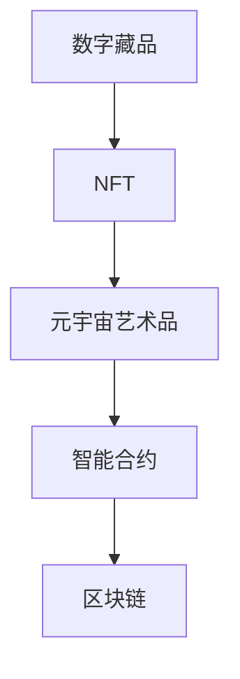

                 

# 2050年的数字艺术：从数字藏品到元宇宙艺术品的数字艺术品交易

## 1. 背景介绍

### 1.1 问题由来

随着数字技术的飞速发展，数字艺术领域正在经历前所未有的变革。从数字藏品、NFT（非同质化代币）到元宇宙艺术，数字艺术逐渐从边缘走向主流，成为数字化时代的重要组成部分。在2050年，数字艺术将在艺术市场、数字版权、社交互动等领域发挥越来越重要的作用，数字艺术品交易将成为一种全新的商业模式。

数字艺术品的交易与传统的艺术市场不同，其独特的特性带来了许多新的挑战和机遇。在当前的技术框架下，数字艺术品交易面临着数据确权、版权保护、去中心化交易等问题。随着区块链、智能合约等技术的成熟，这些问题有望得到更好的解决。

### 1.2 问题核心关键点

数字艺术品的交易涉及三个核心关键点：数据确权、版权保护和去中心化交易。数据确权是指明确数字艺术品的所有权和使用权，版权保护是确保数字艺术品不被未经授权的复制和传播，去中心化交易则是在不依赖中心化机构的情况下进行安全可靠的交换。

这些问题互相交织，需要通过技术手段和政策支持来解决。在2050年，数字艺术品交易将会在这些关键点上有显著的发展，形成更加透明、安全、高效的交易环境。

## 2. 核心概念与联系

### 2.1 核心概念概述

为了更好地理解数字艺术品交易的技术框架和应用场景，本文将介绍几个核心概念：

- 数字藏品(Digital Artworks)：以数字形式存在的艺术品，如数字画作、音乐、视频等。
- NFT（Non-Fungible Tokens）：不可替代的数字资产，每个NFT都有唯一的标识和所有权记录。
- 元宇宙艺术品(Metaverse Art)：在元宇宙中创作和展示的数字艺术品。
- 智能合约(Smart Contracts)：基于区块链技术的自动化合约，用于自动执行和验证交易条款。
- 区块链(Blockchain)：分布式账本技术，提供透明、不可篡改的数据记录和交易验证。

这些核心概念之间的逻辑关系可以通过以下Mermaid流程图来展示：



这个流程图展示了大规模数字艺术品的交易流程：数字藏品被铸造为NFT，进入元宇宙艺术品市场，智能合约自动执行交易，全部过程在区块链上记录，确保了数据确权和版权保护。

## 3. 核心算法原理 & 具体操作步骤
### 3.1 算法原理概述

数字艺术品交易的本质是通过区块链技术实现的去中心化交易，智能合约是实现这一过程的核心算法。

### 3.2 算法步骤详解

数字艺术品交易的算法步骤如下：

**Step 1: 数字藏品的创作与铸造**
- 艺术家创作数字艺术品，并通过区块链平台上的智能合约进行铸造。
- 铸造时，智能合约记录艺术品的元数据、版权信息、所有权状态等。

**Step 2: 数字藏品的认证与确权**
- 数字艺术品被铸造后，智能合约自动生成唯一的NFT，并记录在区块链上。
- 持有者可以查询和证明其NFT的所有权和版权信息。

**Step 3: 数字藏品的交易与流通**
- 买卖双方通过区块链平台上的智能合约进行交易。
- 交易自动验证和执行，确保交易的安全性和透明性。

**Step 4: 元宇宙艺术品的展示与互动**
- 数字艺术品在元宇宙中进行展示，并可以通过智能合约进行互动。
- 持有者可以在元宇宙中设置不同的展示方式和互动规则。

### 3.3 算法优缺点

数字艺术品交易的算法具有以下优点：
1. 去中心化：智能合约和区块链确保了交易的透明性和安全性，避免了中心化机构的干预。
2. 高效便捷：交易过程自动验证和执行，减少了中间环节和人工干预。
3. 数据确权：智能合约记录了所有权和版权信息，防止了版权纠纷。

同时，也存在一些缺点：
1. 技术门槛高：智能合约和区块链技术需要一定的专业知识，普及难度较大。
2. 交易成本高：智能合约和区块链的交易费用较高，增加了交易成本。
3. 法律风险：数字艺术品交易的法律框架尚未完全建立，存在一定的法律风险。

### 3.4 算法应用领域

数字艺术品交易的算法在以下领域具有广泛的应用前景：

- 数字艺术品市场：包括数字画作、音乐、视频等数字资产的交易。
- 数字版权保护：通过区块链和智能合约，保护数字作品的版权，防止侵权和盗版。
- 元宇宙艺术展示：在元宇宙中展示和互动数字艺术品，增强用户体验。
- 去中心化金融(DeFi)：基于区块链和智能合约的金融创新，如DeFi艺术品交易平台。
- 虚拟世界和虚拟现实：在虚拟世界中展示和交易数字艺术品，提供沉浸式体验。

## 4. 数学模型和公式 & 详细讲解

### 4.1 数学模型构建

数字艺术品交易的数学模型主要涉及区块链技术和智能合约的数学基础。以下是几个核心模型的构建：

- **区块链共识模型**：区块链的共识算法，如PoW（工作量证明）、PoS（权益证明）等，用于维护网络的稳定性和安全性。
- **智能合约执行模型**：智能合约的执行逻辑，包括合约状态、执行规则、交易验证等。
- **数字资产价值模型**：数字资产的价值评估模型，如基于市场供需、艺术品质等的估价模型。

### 4.2 公式推导过程

以智能合约的执行逻辑为例，智能合约的执行过程可以用以下伪代码表示：

```python
# 假设智能合约的执行逻辑为判断NFT的所有权是否转移
def execute_transaction(nft_id, buyer_address, seller_address):
    # 查询NFT的所有权状态
    current_owner = get_nft_owner(nft_id)
    
    # 判断当前所有者是否与卖家地址一致
    if current_owner == seller_address:
        # 执行所有权转移，更新NFT所有者
        update_nft_owner(nft_id, buyer_address)
        # 记录交易记录
        record_transaction(nft_id, buyer_address, seller_address)
        # 返回成功信息
        return "Transaction successful"
    else:
        # 返回所有权不匹配的错误信息
        return "Ownership mismatch"
```

该智能合约的执行逻辑涉及三个关键操作：
1. 查询NFT的所有权状态
2. 判断所有者是否与卖家一致
3. 执行所有权转移并记录交易记录

### 4.3 案例分析与讲解

假设有一幅数字画作被铸造并记录在区块链上，智能合约自动生成唯一的NFT。现在，持有者A希望将其出售给持有者B。

**Step 1:** A通过智能合约查询NFT的所有权状态，确认自己是该NFT的合法持有者。

**Step 2:** A和B在智能合约上执行交易操作，智能合约验证双方的身份和NFT所有权。

**Step 3:** 如果验证通过，智能合约自动执行所有权转移，并将交易记录记录在区块链上。

**Step 4:** A将NFT转让给B，B可以继续在元宇宙中进行展示和互动。

## 5. 项目实践：代码实例和详细解释说明
### 5.1 开发环境搭建

在进行数字艺术品交易的实践前，我们需要准备好开发环境。以下是使用Python进行Solidity开发的环境配置流程：

1. 安装Truffle开发框架：从官网下载并安装Truffle，用于管理智能合约和测试网络。

2. 创建并激活开发项目：
```bash
truffle init
```

3. 安装Web3.js：用于与区块链进行交互的JavaScript库。

4. 连接测试网络：可以使用本地测试网络或远程测试网络，如Ropsten或Rinkeby。

5. 编写智能合约：
```python
from solc import compile_source
import json
from web3 import Web3

# 连接测试网络
web3 = Web3(Web3.HTTPProvider('http://localhost:8545'))

# 编写智能合约代码
source_code = """
pragma solidity ^0.8.0;

contract NFT {
    struct NFTData {
        uint256 id;
        address owner;
        bool is_minted;
        bytes32 url;
        string description;
    }
    mapping(uint256 => NFTData) public nfts;

    constructor() {
        owner = msg.sender;
        is_minted = true;
    }

    function mint(uint256 id, bytes32 url, string memory description) public {
        if (is_minted) {
            nfts[id] = NFTData(id, msg.sender, true, url, description);
        }
    }

    function transfer(uint256 id, address receiver) public {
        if (owner != msg.sender) {
            return;
        }
        NFTData memory data = nfts[id];
        nfts[id].owner = receiver;
        data.owner = receiver;
    }
}
"""

# 编译智能合约
contract_abi = compile_source(source_code).json()

# 部署智能合约
contract_address = web3.eth.contract(
    abi=contract_abi['abi'],
    bytecode=contract_abi['bin'],
    deployedStorage={
        'owner': web3.eth.accounts[0],
        'is_minted': True
    }
).deploy()

# 查询智能合约地址
contract_address
```

### 5.2 源代码详细实现

现在我们以数字藏品交易为例，给出使用Solidity进行智能合约开发的完整代码实现。

**创建智能合约：**
```solidity
pragma solidity ^0.8.0;

contract NFT {
    struct NFTData {
        uint256 id;
        address owner;
        bool is_minted;
        bytes32 url;
        string memory description;
    }
    mapping(uint256 => NFTData) public nfts;

    constructor() {
        owner = msg.sender;
        is_minted = true;
    }

    function mint(uint256 id, bytes32 url, string memory description) public {
        if (is_minted) {
            nfts[id] = NFTData(id, msg.sender, true, url, description);
        }
    }

    function transfer(uint256 id, address receiver) public {
        if (owner != msg.sender) {
            return;
        }
        NFTData memory data = nfts[id];
        nfts[id].owner = receiver;
        data.owner = receiver;
    }
}
```

**部署智能合约：**
```python
from solc import compile_source
import json
from web3 import Web3

# 连接测试网络
web3 = Web3(Web3.HTTPProvider('http://localhost:8545'))

# 编写智能合约代码
source_code = """
pragma solidity ^0.8.0;

contract NFT {
    struct NFTData {
        uint256 id;
        address owner;
        bool is_minted;
        bytes32 url;
        string memory description;
    }
    mapping(uint256 => NFTData) public nfts;

    constructor() {
        owner = msg.sender;
        is_minted = true;
    }

    function mint(uint256 id, bytes32 url, string memory description) public {
        if (is_minted) {
            nfts[id] = NFTData(id, msg.sender, true, url, description);
        }
    }

    function transfer(uint256 id, address receiver) public {
        if (owner != msg.sender) {
            return;
        }
        NFTData memory data = nfts[id];
        nfts[id].owner = receiver;
        data.owner = receiver;
    }
}
"""

# 编译智能合约
contract_abi = compile_source(source_code).json()

# 部署智能合约
contract_address = web3.eth.contract(
    abi=contract_abi['abi'],
    bytecode=contract_abi['bin'],
    deployedStorage={
        'owner': web3.eth.accounts[0],
        'is_minted': True
    }
).deploy()

# 查询智能合约地址
contract_address
```

### 5.3 代码解读与分析

让我们再详细解读一下关键代码的实现细节：

**智能合约代码：**
- `NFTData`结构体：用于记录NFT的元数据，包括ID、所有者、是否铸造、URL、描述等。
- `mint`函数：铸造NFT，并将元数据记录在`nfts`映射中。
- `transfer`函数：转移NFT所有权，更新`nfts`映射中的所有者信息。

**部署代码：**
- `solc`：编译智能合约代码。
- `abi`：提取智能合约的ABI（应用二进制接口），用于与区块链交互。
- `bytecode`：提取智能合约的字节码，用于部署合约。
- `web3.eth.contract`：创建智能合约对象，并调用`deploy`方法进行部署。
- `contract_address`：获取部署后的智能合约地址。

## 6. 实际应用场景
### 6.1 数字艺术市场

数字艺术品交易在数字艺术市场中具有广泛的应用前景。数字艺术市场可以将数字藏品进行拍卖、展示和交易，为艺术家提供新的创作和展示平台。

**具体应用场景：**
- 数字画作和音乐作品：艺术家可以将自己的作品数字化并铸造为NFT，通过数字艺术品市场进行展示和交易。
- 元宇宙艺术品：艺术家可以在元宇宙中创作和展示自己的作品，并通过智能合约进行交易。
- 数字雕塑和装置艺术：艺术家可以将实体作品进行数字化，并参与数字艺术品的交易。

### 6.2 数字版权保护

数字艺术品交易可以用于数字版权保护，确保数字作品的版权不被未经授权的复制和传播。

**具体应用场景：**
- 版权证明：艺术家可以通过智能合约记录作品的版权信息，确保作品的唯一性和合法性。
- 版权交易：艺术家可以将作品的版权授权给他人使用，并通过智能合约进行交易。
- 版权监控：版权所有者可以通过智能合约监控作品的传播和使用情况，防止侵权行为。

### 6.3 去中心化金融(DeFi)

数字艺术品交易也可以用于去中心化金融(DeFi)，提供新的金融创新应用。

**具体应用场景：**
- DeFi艺术品交易平台：通过智能合约和区块链技术，实现数字艺术品的去中心化交易。
- 艺术品抵押借贷：艺术家可以通过智能合约将自己的艺术品进行抵押借贷，获取资金支持。
- 艺术品衍生品交易：基于智能合约，发行艺术品的衍生品，如期货、期权等。

### 6.4 未来应用展望

随着技术的不断进步，数字艺术品交易将会在更多的领域得到应用，形成更加广泛的数字经济生态系统。

- **虚拟世界和虚拟现实**：在虚拟世界中展示和交易数字艺术品，提供沉浸式体验。
- **游戏和交互式应用**：数字艺术品可以用于游戏和交互式应用，增强用户体验和互动性。
- **元宇宙治理**：数字艺术品交易可以在元宇宙中发挥作用，促进元宇宙治理和社区建设。

## 7. 工具和资源推荐
### 7.1 学习资源推荐

为了帮助开发者系统掌握数字艺术品交易的理论基础和实践技巧，这里推荐一些优质的学习资源：

1. Solidity官方文档：官方文档提供了Solidity语言的详细说明和示例，是学习智能合约开发的重要资源。

2. Truffle官方文档：Truffle是Solidity开发框架，提供了完整的开发工具和测试网络，是学习Solidity和智能合约开发的理想平台。

3. Web3.js官方文档：Web3.js是JavaScript库，用于与区块链进行交互，提供了丰富的API和示例。

4. Ethereum官网：以太坊官网提供了以太坊区块链和智能合约开发的详细介绍和文档。

5. CryptoZombies：一个互动式的学习平台，通过创建僵尸NFT，学习Solidity和智能合约开发。

通过对这些资源的学习实践，相信你一定能够快速掌握数字艺术品交易的精髓，并用于解决实际的数字艺术问题。

### 7.2 开发工具推荐

高效的开发离不开优秀的工具支持。以下是几款用于数字艺术品交易开发的常用工具：

1. Truffle：Solidity开发框架，提供了开发、测试、部署等一站式解决方案。

2. Remix：一个直观的IDE，支持Solidity、Web3.js等技术，适合初学者快速上手。

3. MetaMask：以太坊钱包，支持与区块链进行交互，方便用户进行数字艺术品交易。

4. Web3.js：JavaScript库，用于与区块链进行交互，支持多种区块链平台。

5. Ethereum：以太坊区块链，提供了智能合约和数字艺术品交易的基础设施。

合理利用这些工具，可以显著提升数字艺术品交易的开发效率，加快创新迭代的步伐。

### 7.3 相关论文推荐

数字艺术品交易的技术发展源于学界的持续研究。以下是几篇奠基性的相关论文，推荐阅读：

1. "Smart Contracts and Trading on Blockchains"（区块链上的智能合约和交易）：介绍了智能合约的基本原理和应用场景。

2. "Decentralized Autonomous Organizations"（去中心化自治组织）：探讨了DAO在数字艺术品交易中的应用。

3. "The Economics of Blockchain"（区块链经济学）：分析了区块链技术对经济和金融系统的影响。

4. "Blockchain-based Digital Art Markets"（基于区块链的数字艺术品市场）：讨论了数字艺术品市场和区块链技术的结合。

5. "Decentralized Art NFT Platforms"（去中心化艺术NFT平台）：介绍了去中心化艺术NFT平台的技术实现和应用案例。

这些论文代表了大规模数字艺术品的交易发展脉络。通过学习这些前沿成果，可以帮助研究者把握学科前进方向，激发更多的创新灵感。

## 8. 总结：未来发展趋势与挑战
### 8.1 研究成果总结

本文对数字艺术品交易的理论基础和实践方法进行了全面系统的介绍。首先阐述了数字艺术品交易的技术框架和应用场景，明确了智能合约和区块链技术的重要性。其次，从原理到实践，详细讲解了数字艺术品交易的算法步骤和数学模型，给出了智能合约开发的完整代码实例。同时，本文还广泛探讨了数字艺术品交易在数字艺术市场、版权保护、DeFi等领域的应用前景，展示了数字艺术品交易的广泛潜力。

通过本文的系统梳理，可以看到，数字艺术品交易正在成为数字经济的重要组成部分，数字艺术品的价值将得到广泛认可和应用。未来，伴随区块链和智能合约技术的不断成熟，数字艺术品交易必将在更广泛的领域得到应用，形成更加透明、安全、高效的交易环境。

### 8.2 未来发展趋势

展望未来，数字艺术品交易将呈现以下几个发展趋势：

1. 去中心化交易：随着区块链和智能合约技术的成熟，去中心化交易将更加广泛地应用，提升交易的透明性和安全性。
2. 元宇宙艺术品：元宇宙的兴起将带来新的艺术品展示和交易形式，提升数字艺术品的互动性和体验感。
3. 跨链交易：多区块链平台的互操作性将增强，跨链交易将变得更加便捷和高效。
4. DeFi平台创新：DeFi艺术品交易平台将不断创新，提供更多的金融创新应用。
5. 数字版权保护：数字艺术品交易将进一步推动数字版权保护技术的发展，确保数字作品的版权不被侵犯。

这些趋势凸显了数字艺术品交易技术的广阔前景。未来的技术发展将使得数字艺术品交易更加高效、便捷、安全，为数字艺术品的创作、展示和交易提供更广阔的平台。

### 8.3 面临的挑战

尽管数字艺术品交易技术已经取得了显著进展，但在迈向更加智能化、普适化应用的过程中，它仍面临着诸多挑战：

1. 技术门槛高：智能合约和区块链技术需要一定的专业知识，普及难度较大。
2. 交易成本高：智能合约和区块链的交易费用较高，增加了交易成本。
3. 法律风险：数字艺术品交易的法律框架尚未完全建立，存在一定的法律风险。
4. 去中心化治理：去中心化交易需要更加完善的市场治理机制，以解决平台信任和监管问题。
5. 用户体验差：现有的数字艺术品交易平台用户体验仍有不足，需要进一步优化。

这些挑战需要我们进一步研究和解决，以推动数字艺术品交易技术走向成熟。

### 8.4 研究展望

面对数字艺术品交易所面临的挑战，未来的研究需要在以下几个方面寻求新的突破：

1. 降低技术门槛：开发更加易用、易理解的技术工具，降低智能合约和区块链技术的入门门槛。
2. 优化交易成本：研究和应用更加高效的区块链和智能合约技术，降低交易费用。
3. 完善法律框架：推动数字艺术品交易的法律框架建设，确保交易的合法性和安全性。
4. 增强去中心化治理：研究和应用去中心化治理机制，提高平台信任和监管能力。
5. 提升用户体验：优化数字艺术品交易平台的用户体验，提供更好的交易体验和服务。

这些研究方向的探索，将使得数字艺术品交易技术更加成熟，为数字艺术品的创作、展示和交易提供更广阔的平台。面向未来，数字艺术品交易技术还需要与其他技术进行更深入的融合，如区块链、NFT、元宇宙等，共同推动数字艺术品的广泛应用。

## 9. 附录：常见问题与解答

**Q1：数字艺术品交易的智能合约是如何工作的？**

A: 智能合约通过区块链技术的共识算法和分布式账本技术，实现去中心化的数字艺术品交易。智能合约定义了交易的规则和逻辑，确保交易的透明性和安全性。交易过程中，买卖双方通过智能合约进行交互，自动验证和执行交易条款。

**Q2：数字艺术品交易中如何进行版权保护？**

A: 数字艺术品交易中，智能合约可以记录艺术品的版权信息，确保作品的所有权和使用权。通过区块链的不可篡改特性，可以防止版权纠纷和侵权行为。艺术家也可以通过智能合约授权他人使用作品，并通过智能合约进行交易和监控。

**Q3：数字艺术品交易的优点和缺点是什么？**

A: 数字艺术品交易的优点包括：
1. 去中心化：智能合约和区块链确保了交易的透明性和安全性，避免了中心化机构的干预。
2. 高效便捷：交易过程自动验证和执行，减少了中间环节和人工干预。
3. 数据确权：智能合约记录了所有权和版权信息，防止了版权纠纷。

数字艺术品交易的缺点包括：
1. 技术门槛高：智能合约和区块链技术需要一定的专业知识，普及难度较大。
2. 交易成本高：智能合约和区块链的交易费用较高，增加了交易成本。
3. 法律风险：数字艺术品交易的法律框架尚未完全建立，存在一定的法律风险。

**Q4：数字艺术品交易的未来发展趋势是什么？**

A: 数字艺术品交易的未来发展趋势包括：
1. 去中心化交易：随着区块链和智能合约技术的成熟，去中心化交易将更加广泛地应用，提升交易的透明性和安全性。
2. 元宇宙艺术品：元宇宙的兴起将带来新的艺术品展示和交易形式，提升数字艺术品的互动性和体验感。
3. 跨链交易：多区块链平台的互操作性将增强，跨链交易将变得更加便捷和高效。
4. DeFi平台创新：DeFi艺术品交易平台将不断创新，提供更多的金融创新应用。
5. 数字版权保护：数字艺术品交易将进一步推动数字版权保护技术的发展，确保数字作品的版权不被侵犯。

**Q5：数字艺术品交易的智能合约如何确保交易的安全性？**

A: 智能合约通过区块链技术的共识算法和分布式账本技术，实现去中心化的数字艺术品交易。智能合约定义了交易的规则和逻辑，确保交易的透明性和安全性。交易过程中，买卖双方通过智能合约进行交互，自动验证和执行交易条款。智能合约的代码和数据在区块链上记录，保证了交易的安全性和不可篡改性。

这些常见问题的解答，有助于读者更好地理解数字艺术品交易的原理和实践方法，推动数字艺术品交易技术的发展和应用。

