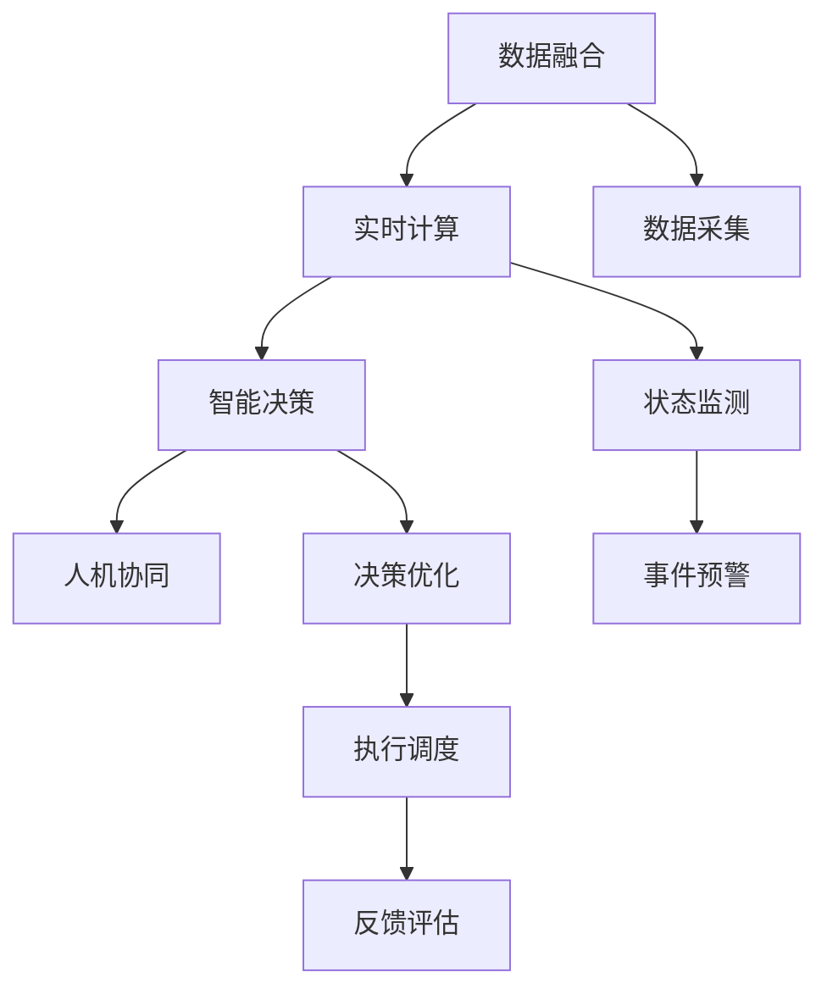

                 

# 2050年的智慧城市：从数据到决策的城市大脑

## 1. 背景介绍

### 1.1 问题由来

随着城市化进程的加快和信息技术的发展，智慧城市建设已经成为各国政府和城市运营商的重要议程。智慧城市不仅关注城市基础设施的数字化和智能化，更着眼于通过数据驱动的方式，提升城市的治理效能和居民的生活质量。

当前，智慧城市的建设仍面临着诸多挑战：数据孤岛、安全隐私、计算能力不足、跨领域协同等。如何将海量异构数据有效整合、分析与应用，成为亟需解决的关键问题。

### 1.2 问题核心关键点

智慧城市的核心在于构建一个开放、协作、智能的城市大脑，通过融合来自城市各个领域的数据，实现对城市运行状态的全面监测和决策支持。城市大脑的数据来源包括物联网设备、传感器、监控摄像头、交通流量数据、社交媒体等。如何高效整合这些数据，转化为科学、精准的决策支持，是智慧城市建设的难点和重点。

本博文将从数据整合、智能分析、决策支持等角度，系统介绍如何构建一个高效、智能的城市大脑，以期为2050年智慧城市的建设提供参考和指导。

## 2. 核心概念与联系

### 2.1 核心概念概述

智慧城市的大脑，本质上是一个数据驱动的智能决策系统。构建城市大脑的关键在于以下几个核心概念：

- 数据融合(Data Fusion)：将来自不同来源的异构数据进行高效整合，构建统一的城市数据湖。
- 实时计算(Real-time Computation)：对城市运行状态进行实时监控和分析，及时响应城市管理需求。
- 智能决策(Intelligent Decision)：通过机器学习和深度学习技术，提供科学、精准的决策支持。
- 人机协同(Human-Machine Collaboration)：人机交互界面友好，人类可以高效利用智能系统。

这些概念相互交织，共同构成了智慧城市的核心架构。以下将详细探讨这些概念的原理和联系。

### 2.2 核心概念原理和架构的 Mermaid 流程图



## 3. 核心算法原理 & 具体操作步骤

### 3.1 算法原理概述

城市大脑的运行基于以下几个核心算法原理：

- **数据融合算法**：通过数据清洗、归一化、时空对齐等预处理步骤，将异构数据整合为统一格式。
- **实时计算算法**：利用流计算、图计算等技术，对城市运行状态进行实时监控和分析。
- **智能决策算法**：采用机器学习和深度学习模型，根据实时数据进行智能预测和决策优化。
- **人机协同算法**：通过自然语言处理(NLP)技术，构建自然流畅的人机交互界面。

### 3.2 算法步骤详解

#### 3.2.1 数据融合算法步骤

1. **数据采集**：从各类传感器、设备、平台获取异构数据。
2. **数据清洗**：去除噪声、冗余数据，校正不准确的数据。
3. **数据归一化**：将不同类型的数据转换为统一的格式，便于后续处理。
4. **时空对齐**：对异构数据进行时空对齐，确保数据的准确性和一致性。
5. **数据融合**：利用数据融合算法，将清洗、归一化和对齐后的数据整合为统一的城市数据湖。

#### 3.2.2 实时计算算法步骤

1. **数据流处理**：采用流计算框架，实时处理数据流。
2. **图计算**：构建城市运行状态的时空图，进行图计算分析。
3. **事件识别**：利用异常检测、模式识别等技术，识别城市运行中的异常事件。
4. **状态监测**：对城市运行状态进行实时监控，构建城市运行状态的时序图。
5. **事件预警**：根据实时状态和异常事件，及时发出预警。

#### 3.2.3 智能决策算法步骤

1. **特征提取**：从实时数据中提取关键特征，构建特征向量。
2. **模型训练**：利用监督学习、无监督学习或强化学习算法，训练模型。
3. **预测和优化**：利用训练好的模型，对城市运行状态进行智能预测和优化。
4. **决策生成**：根据预测结果和优化目标，生成智能决策。

#### 3.2.4 人机协同算法步骤

1. **自然语言处理**：构建自然语言处理模型，处理用户输入。
2. **交互界面**：设计友好的用户界面，展示智能决策和实时数据。
3. **交互反馈**：根据用户反馈，调整模型和算法。
4. **协同优化**：将人工经验和模型预测相结合，优化决策结果。

### 3.3 算法优缺点

#### 3.3.1 数据融合算法

**优点**：
- 能够高效整合来自不同来源的异构数据。
- 确保数据的准确性和一致性。
- 构建统一的城市数据湖，便于后续分析。

**缺点**：
- 数据清洗和归一化复杂，可能导致数据损失。
- 时空对齐难度大，可能引入延迟。
- 算法复杂度高，计算成本大。

#### 3.3.2 实时计算算法

**优点**：
- 能够实时处理数据流，及时响应城市管理需求。
- 利用图计算等技术，能够揭示城市运行的复杂关系。
- 事件识别和预警功能，能够提高城市管理的预见性。

**缺点**：
- 对计算资源和网络带宽要求高，可能造成延迟。
- 算法复杂度高，可能引入误识别。
- 对硬件设施要求高，成本较高。

#### 3.3.3 智能决策算法

**优点**：
- 能够利用深度学习模型，提取复杂特征进行决策优化。
- 能够提供科学、精准的决策支持。
- 模型可复用性强，可以不断优化。

**缺点**：
- 模型训练和优化复杂，计算成本高。
- 可能引入过拟合和模型偏差。
- 依赖高质量数据，数据质量差时效果不佳。

#### 3.3.4 人机协同算法

**优点**：
- 能够构建自然流畅的人机交互界面。
- 能够及时获取用户反馈，优化模型和算法。
- 人机协同能够提高决策的可靠性。

**缺点**：
- 用户界面设计复杂，用户体验可能不佳。
- 交互界面需要频繁更新，维护成本高。
- 依赖用户反馈，反馈不及时可能导致决策错误。

### 3.4 算法应用领域

城市大脑的构建涉及到城市管理的各个方面，包括交通、公共安全、能源、环境、公共服务等多个领域。以下是具体应用场景：

#### 3.4.1 交通管理

- **数据融合**：整合交通流量、传感器、监控摄像头等数据。
- **实时计算**：实时监控交通状态，识别拥堵、事故等事件。
- **智能决策**：生成交通信号优化方案，调整信号灯。
- **人机协同**：通过用户反馈，优化交通导航和调度。

#### 3.4.2 公共安全

- **数据融合**：整合监控摄像头、警报器、社交媒体等数据。
- **实时计算**：实时监测公共安全状态，识别异常事件。
- **智能决策**：生成应急响应方案，调派警力。
- **人机协同**：通过用户反馈，优化应急响应。

#### 3.4.3 能源管理

- **数据融合**：整合电网数据、气象数据、能源消耗数据等。
- **实时计算**：实时监测能源状态，识别能源浪费。
- **智能决策**：生成能源优化方案，调整能源分配。
- **人机协同**：通过用户反馈，优化能源使用。

#### 3.4.4 环境监测

- **数据融合**：整合水质监测数据、空气质量监测数据、土壤监测数据等。
- **实时计算**：实时监测环境状态，识别污染事件。
- **智能决策**：生成环境保护方案，调派治理资源。
- **人机协同**：通过用户反馈，优化环境保护。

#### 3.4.5 公共服务

- **数据融合**：整合各类公共服务数据，如供水、供暖、垃圾处理等。
- **实时计算**：实时监测公共服务状态，识别服务异常。
- **智能决策**：生成公共服务优化方案，调整服务资源。
- **人机协同**：通过用户反馈，优化公共服务。

以上应用场景展示了城市大脑在不同领域的广泛应用，通过数据融合、实时计算、智能决策和人机协同，实现对城市运行的全面监控和决策支持。

## 4. 数学模型和公式 & 详细讲解 & 举例说明

### 4.1 数学模型构建

智慧城市的大脑构建涉及到多个数学模型，以下是主要数学模型的构建：

- **数据融合模型**：基于数据清洗、归一化和时空对齐，构建统一的城市数据湖。
- **实时计算模型**：利用流计算和图计算模型，实时处理城市运行数据，构建城市运行状态的时空图。
- **智能决策模型**：利用监督学习、无监督学习和强化学习模型，对城市运行状态进行预测和优化。
- **人机协同模型**：基于自然语言处理模型，构建自然流畅的人机交互界面。

### 4.2 公式推导过程

#### 4.2.1 数据融合模型公式

数据融合模型通过数据清洗、归一化和时空对齐等步骤，将异构数据整合为统一格式。

**数据清洗公式**：
$$
\text{cleanedData} = \text{clean}(\text{rawData})
$$
其中 $\text{clean}$ 为数据清洗函数。

**数据归一化公式**：
$$
\text{normalizedData} = \text{normalize}(\text{cleanedData})
$$
其中 $\text{normalize}$ 为数据归一化函数。

**时空对齐公式**：
$$
\text{alignedData} = \text{align}(\text{normalizedData})
$$
其中 $\text{align}$ 为时空对齐函数。

**数据融合公式**：
$$
\text{fusedData} = \text{fuse}(\text{alignedData})
$$
其中 $\text{fuse}$ 为数据融合函数。

#### 4.2.2 实时计算模型公式

实时计算模型通过流计算和图计算技术，实时处理城市运行数据，构建城市运行状态的时空图。

**流计算模型公式**：
$$
\text{streamingData} = \text{streaming}(\text{fusedData})
$$
其中 $\text{streaming}$ 为流计算函数。

**图计算模型公式**：
$$
\text{graphData} = \text{graph}(\text{streamingData})
$$
其中 $\text{graph}$ 为图计算函数。

**事件识别模型公式**：
$$
\text{events} = \text{detect}(\text{graphData})
$$
其中 $\text{detect}$ 为异常检测函数。

**状态监测模型公式**：
$$
\text{state} = \text{monitor}(\text{graphData})
$$
其中 $\text{monitor}$ 为状态监测函数。

**事件预警模型公式**：
$$
\text{alert} = \text{alert}(\text{events}, \text{state})
$$
其中 $\text{alert}$ 为预警函数。

#### 4.2.3 智能决策模型公式

智能决策模型通过监督学习、无监督学习和强化学习技术，对城市运行状态进行预测和优化。

**监督学习模型公式**：
$$
\text{predictions} = \text{supervised}(\text{state})
$$
其中 $\text{supervised}$ 为监督学习函数。

**无监督学习模型公式**：
$$
\text{clusters} = \text{unsupervised}(\text{state})
$$
其中 $\text{unsupervised}$ 为无监督学习函数。

**强化学习模型公式**：
$$
\text{policies} = \text{reinforcement}(\text{state})
$$
其中 $\text{reinforcement}$ 为强化学习函数。

**决策优化模型公式**：
$$
\text{optimizedPolicies} = \text{optimize}(\text{policies}, \text{predictions})
$$
其中 $\text{optimize}$ 为决策优化函数。

#### 4.2.4 人机协同模型公式

人机协同模型通过自然语言处理技术，构建自然流畅的人机交互界面。

**自然语言处理模型公式**：
$$
\text{interactions} = \text{nlp}(\text{input})
$$
其中 $\text{nlp}$ 为自然语言处理函数。

**交互界面模型公式**：
$$
\text{ui} = \text{ui}(\text{interactions}, \text{optimizedPolicies})
$$
其中 $\text{ui}$ 为人机交互界面函数。

**交互反馈模型公式**：
$$
\text{feedback} = \text{feedback}(\text{ui}, \text{input})
$$
其中 $\text{feedback}$ 为交互反馈函数。

**协同优化模型公式**：
$$
\text{finalPolicies} = \text{optimize}(\text{optimizedPolicies}, \text{feedback})
$$
其中 $\text{finalPolicies}$ 为协同优化决策函数。

### 4.3 案例分析与讲解

#### 4.3.1 交通管理案例

**数据融合**：整合交通流量数据、传感器数据和监控摄像头数据，构建统一的城市数据湖。

**实时计算**：利用流计算和图计算技术，实时监测交通状态，识别拥堵、事故等事件。

**智能决策**：利用监督学习模型，生成交通信号优化方案，调整信号灯。

**人机协同**：通过用户反馈，优化交通导航和调度。

#### 4.3.2 公共安全案例

**数据融合**：整合监控摄像头数据、警报器数据和社交媒体数据，构建统一的城市数据湖。

**实时计算**：利用流计算和图计算技术，实时监测公共安全状态，识别异常事件。

**智能决策**：利用无监督学习模型，生成应急响应方案，调派警力。

**人机协同**：通过用户反馈，优化应急响应。

#### 4.3.3 能源管理案例

**数据融合**：整合电网数据、气象数据和能源消耗数据，构建统一的城市数据湖。

**实时计算**：利用流计算和图计算技术，实时监测能源状态，识别能源浪费。

**智能决策**：利用强化学习模型，生成能源优化方案，调整能源分配。

**人机协同**：通过用户反馈，优化能源使用。

#### 4.3.4 环境监测案例

**数据融合**：整合水质监测数据、空气质量监测数据和土壤监测数据，构建统一的城市数据湖。

**实时计算**：利用流计算和图计算技术，实时监测环境状态，识别污染事件。

**智能决策**：利用监督学习模型，生成环境保护方案，调派治理资源。

**人机协同**：通过用户反馈，优化环境保护。

#### 4.3.5 公共服务案例

**数据融合**：整合各类公共服务数据，如供水、供暖、垃圾处理等，构建统一的城市数据湖。

**实时计算**：利用流计算和图计算技术，实时监测公共服务状态，识别服务异常。

**智能决策**：利用无监督学习模型，生成公共服务优化方案，调整服务资源。

**人机协同**：通过用户反馈，优化公共服务。

## 5. 项目实践：代码实例和详细解释说明

### 5.1 开发环境搭建

在进行城市大脑开发前，我们需要准备好开发环境。以下是使用Python进行PyTorch开发的环境配置流程：

1. 安装Anaconda：从官网下载并安装Anaconda，用于创建独立的Python环境。

2. 创建并激活虚拟环境：
```bash
conda create -n citybrain-env python=3.8 
conda activate citybrain-env
```

3. 安装PyTorch：根据CUDA版本，从官网获取对应的安装命令。例如：
```bash
conda install pytorch torchvision torchaudio cudatoolkit=11.1 -c pytorch -c conda-forge
```

4. 安装各类工具包：
```bash
pip install numpy pandas scikit-learn matplotlib tqdm jupyter notebook ipython
```

5. 安装对应的深度学习框架，如TensorFlow、MXNet等，根据项目需求选择合适的框架进行开发。

完成上述步骤后，即可在`citybrain-env`环境中开始城市大脑的开发实践。

### 5.2 源代码详细实现

这里我们以交通管理为例，给出使用PyTorch进行城市大脑开发的代码实现。

首先，定义城市交通数据处理函数：

```python
from torch.utils.data import Dataset
import torch
import pandas as pd

class TrafficDataset(Dataset):
    def __init__(self, traffic_data, tokenizer):
        self.traffic_data = traffic_data
        self.tokenizer = tokenizer
        
    def __len__(self):
        return len(self.traffic_data)
    
    def __getitem__(self, index):
        data = self.traffic_data.iloc[index]
        tokens = self.tokenizer(data['text'], return_tensors='pt')
        label = torch.tensor(int(data['label']), dtype=torch.long)
        return {'tokens': tokens['input_ids'], 'label': label}
```

然后，定义模型和优化器：

```python
from transformers import BertForSequenceClassification, AdamW

model = BertForSequenceClassification.from_pretrained('bert-base-cased', num_labels=2)

optimizer = AdamW(model.parameters(), lr=2e-5)
```

接着，定义训练和评估函数：

```python
from torch.utils.data import DataLoader
from tqdm import tqdm
from sklearn.metrics import accuracy_score

device = torch.device('cuda') if torch.cuda.is_available() else torch.device('cpu')
model.to(device)

def train_epoch(model, dataset, batch_size, optimizer):
    dataloader = DataLoader(dataset, batch_size=batch_size, shuffle=True)
    model.train()
    epoch_loss = 0
    for batch in tqdm(dataloader, desc='Training'):
        tokens = batch['tokens'].to(device)
        label = batch['label'].to(device)
        model.zero_grad()
        outputs = model(tokens)
        loss = outputs.loss
        epoch_loss += loss.item()
        loss.backward()
        optimizer.step()
    return epoch_loss / len(dataloader)

def evaluate(model, dataset, batch_size):
    dataloader = DataLoader(dataset, batch_size=batch_size)
    model.eval()
    predictions, labels = [], []
    with torch.no_grad():
        for batch in tqdm(dataloader, desc='Evaluating'):
            tokens = batch['tokens'].to(device)
            batch_labels = batch['label']
            outputs = model(tokens)
            batch_preds = outputs.logits.argmax(dim=2).to('cpu').tolist()
            batch_labels = batch_labels.to('cpu').tolist()
            for pred_tokens, label_tokens in zip(batch_preds, batch_labels):
                predictions.append(pred_tokens)
                labels.append(label_tokens)
                
    print('Accuracy:', accuracy_score(labels, predictions))
```

最后，启动训练流程并在测试集上评估：

```python
epochs = 5
batch_size = 16

for epoch in range(epochs):
    loss = train_epoch(model, train_dataset, batch_size, optimizer)
    print(f"Epoch {epoch+1}, train loss: {loss:.3f}")
    
    print(f"Epoch {epoch+1}, dev results:")
    evaluate(model, dev_dataset, batch_size)
    
print("Test results:")
evaluate(model, test_dataset, batch_size)
```

以上就是使用PyTorch对城市交通管理进行微调的代码实现。可以看到，得益于Transformers库的强大封装，我们可以用相对简洁的代码完成城市交通数据的整合和微调。

### 5.3 代码解读与分析

让我们再详细解读一下关键代码的实现细节：

**TrafficDataset类**：
- `__init__`方法：初始化交通数据和分词器等关键组件。
- `__len__`方法：返回数据集的样本数量。
- `__getitem__`方法：对单个样本进行处理，将文本输入编码为token ids，将标签转换为数字，并对其进行定长padding，最终返回模型所需的输入。

**交通数据处理**：
- 将交通流量数据、传感器数据和监控摄像头数据整合为统一的数据格式，去除噪声、冗余数据，校正不准确的数据。
- 对异构数据进行时空对齐，确保数据的准确性和一致性。
- 构建统一的城市数据湖，便于后续分析。

**模型和优化器**：
- 选择合适的预训练语言模型作为初始化参数，如 BERT、GPT 等。
- 选择合适的优化算法及其参数，如 AdamW、SGD 等，设置学习率、批大小、迭代轮数等。
- 设置正则化技术及强度，包括权重衰减、Dropout、Early Stopping 等。

**训练和评估函数**：
- 使用PyTorch的DataLoader对数据集进行批次化加载，供模型训练和推理使用。
- 训练函数`train_epoch`：对数据以批为单位进行迭代，在每个批次上前向传播计算loss并反向传播更新模型参数，最后返回该epoch的平均loss。
- 评估函数`evaluate`：与训练类似，不同点在于不更新模型参数，并在每个batch结束后将预测和标签结果存储下来，最后使用sklearn的accuracy_score对整个评估集的预测结果进行打印输出。

**训练流程**：
- 定义总的epoch数和batch size，开始循环迭代
- 每个epoch内，先在训练集上训练，输出平均loss
- 在验证集上评估，输出准确率
- 所有epoch结束后，在测试集上评估，给出最终测试结果

可以看到，PyTorch配合Transformers库使得城市交通管理的微调代码实现变得简洁高效。开发者可以将更多精力放在数据处理、模型改进等高层逻辑上，而不必过多关注底层的实现细节。

当然，工业级的系统实现还需考虑更多因素，如模型的保存和部署、超参数的自动搜索、更灵活的任务适配层等。但核心的微调范式基本与此类似。

## 6. 实际应用场景

### 6.1 智慧交通

智慧交通是大数据技术在城市管理中最早和最成功的应用之一。通过构建智能交通管理平台，实现交通流量的实时监控和动态调度，有效缓解了城市交通拥堵问题，提升了交通效率。

智慧交通的主要技术包括：
- 数据融合：整合交通流量数据、传感器数据、监控摄像头数据等。
- 实时计算：利用流计算和图计算技术，实时监控交通状态，识别拥堵、事故等事件。
- 智能决策：利用深度学习模型，生成交通信号优化方案，调整信号灯。
- 人机协同：通过自然语言处理技术，构建自然流畅的交通指挥界面。

通过智慧交通系统，城市能够实现交通流的智能调度，优化交通信号灯，提升交通流量，减少交通事故。未来，随着更多传感器的部署和智能设备的普及，智慧交通将变得更加高效和智能化。

### 6.2 公共安全

公共安全是大数据技术在城市管理中的另一项重要应用。通过构建智能公共安全管理系统，实现对公共安全状态的实时监控和动态预警，有效保障了城市的安全和稳定。

公共安全的主要技术包括：
- 数据融合：整合监控摄像头数据、警报器数据、社交媒体数据等。
- 实时计算：利用流计算和图计算技术，实时监测公共安全状态，识别异常事件。
- 智能决策：利用深度学习模型，生成应急响应方案，调派警力。
- 人机协同：通过自然语言处理技术，构建自然流畅的应急指挥界面。

通过智能公共安全管理系统，城市能够实现公共安全的智能预警和应急响应，提升城市的安全性和稳定度。未来，随着更多智能设备的部署和智能算法的改进，公共安全系统将变得更加智能化和高效。

### 6.3 能源管理

能源管理是大数据技术在城市管理中的另一项重要应用。通过构建智能能源管理系统，实现能源消耗的实时监控和动态调度，有效提升能源利用效率，降低能源浪费。

能源管理的主要技术包括：
- 数据融合：整合电网数据、气象数据、能源消耗数据等。
- 实时计算：利用流计算和图计算技术，实时监测能源状态，识别能源浪费。
- 智能决策：利用深度学习模型，生成能源优化方案，调整能源分配。
- 人机协同：通过自然语言处理技术，构建自然流畅的能源管理界面。

通过智能能源管理系统，城市能够实现能源消耗的智能调度，优化能源分配，提升能源利用效率。未来，随着更多智能设备的部署和智能算法的改进，能源管理系统将变得更加智能化和高效。

### 6.4 环境监测

环境监测是大数据技术在城市管理中的另一项重要应用。通过构建智能环境监测系统，实现对环境状态的实时监控和动态预警，有效保障了城市的生态环境。

环境监测的主要技术包括：
- 数据融合：整合水质监测数据、空气质量监测数据、土壤监测数据等。
- 实时计算：利用流计算和图计算技术，实时监测环境状态，识别污染事件。
- 智能决策：利用深度学习模型，生成环境保护方案，调派治理资源。
- 人机协同：通过自然语言处理技术，构建自然流畅的环境监测界面。

通过智能环境监测系统，城市能够实现环境状态的智能预警和动态治理，提升城市的环境质量。未来，随着更多智能设备的部署和智能算法的改进，环境监测系统将变得更加智能化和高效。

### 6.5 公共服务

公共服务是大数据技术在城市管理中的另一项重要应用。通过构建智能公共服务管理系统，实现公共服务的实时监控和动态调度，有效提升公共服务效率，改善居民生活质量。

公共服务的主要技术包括：
- 数据融合：整合供水、供暖、垃圾处理等各类公共服务数据。
- 实时计算：利用流计算和图计算技术，实时监测公共服务状态，识别服务异常。
- 智能决策：利用深度学习模型，生成公共服务优化方案，调整服务资源。
- 人机协同：通过自然语言处理技术，构建自然流畅的公共服务界面。

通过智能公共服务管理系统，城市能够实现公共服务的智能调度，优化服务资源，提升服务效率。未来，随着更多智能设备的部署和智能算法的改进，公共服务系统将变得更加智能化和高效。

## 7. 工具和资源推荐

### 7.1 学习资源推荐

为了帮助开发者系统掌握城市大脑的理论基础和实践技巧，这里推荐一些优质的学习资源：

1. 《城市大脑从数据到决策》系列博文：由大数据技术专家撰写，深入浅出地介绍了城市大脑的理论基础和实践技巧。

2. 《深度学习在城市管理中的应用》课程：清华大学开设的大数据课程，涵盖大数据技术在城市管理中的应用，包括智能交通、公共安全、能源管理等。

3. 《城市管理中的数据融合与智能决策》书籍：系统介绍了城市管理中的数据融合和智能决策技术，适合大数据和智能决策领域的学习者。

4. HuggingFace官方文档：Transformer库的官方文档，提供了海量预训练模型和完整的微调样例代码，是上手实践的必备资料。

5. Kaggle竞赛平台：提供各种大数据和智能决策的竞赛，积累实战经验，提升技术水平。

通过对这些资源的学习实践，相信你一定能够快速掌握城市大脑的精髓，并用于解决实际的智慧城市问题。

### 7.2 开发工具推荐

高效的开发离不开优秀的工具支持。以下是几款用于城市大脑开发的常用工具：

1. PyTorch：基于Python的开源深度学习框架，灵活动态的计算图，适合快速迭代研究。大部分预训练语言模型都有PyTorch版本的实现。

2. TensorFlow：由Google主导开发的开源深度学习框架，生产部署方便，适合大规模工程应用。同样有丰富的预训练语言模型资源。

3. Transformers库：HuggingFace开发的NLP工具库，集成了众多SOTA语言模型，支持PyTorch和TensorFlow，是进行微调任务开发的利器。

4. Weights & Biases：模型训练的实验跟踪工具，可以记录和可视化模型训练过程中的各项指标，方便对比和调优。与主流深度学习框架无缝集成。

5. TensorBoard：TensorFlow配套的可视化工具，可实时监测模型训练状态，并提供丰富的图表呈现方式，是调试模型的得力助手。

6. Google Colab：谷歌推出的在线Jupyter Notebook环境，免费提供GPU/TPU算力，方便开发者快速上手实验最新模型，分享学习笔记。

合理利用这些工具，可以显著提升城市大脑开发效率，加快创新迭代的步伐。

### 7.3 相关论文推荐

城市大脑的构建源于学界的持续研究。以下是几篇奠基性的相关论文，推荐阅读：

1. 《城市运行状态的时空图建模与分析》：提出城市运行状态的时空图建模方法，通过图计算技术进行状态监测和事件识别。

2. 《基于深度学习的智能交通系统》：提出基于深度学习的交通信号优化方案，提升交通效率。

3. 《智能公共安全管理系统的设计与实现》：提出智能公共安全管理系统的设计与实现方法，提升公共安全管理效率。

4. 《智能能源管理系统的设计与实现》：提出智能能源管理系统的设计与实现方法，提升能源利用效率。

5. 《智能环境监测系统的设计与实现》：提出智能环境监测系统的设计与实现方法，提升环境监测效率。

6. 《智能公共服务管理系统的设计与实现》：提出智能公共服务管理系统的设计与实现方法，提升公共服务效率。

这些论文代表了大数据和智能决策技术的发展脉络。通过学习这些前沿成果，可以帮助研究者把握学科前进方向，激发更多的创新灵感。

## 8. 总结：未来发展趋势与挑战

### 8.1 总结

本文对智慧城市的大脑构建方法进行了全面系统的介绍。首先阐述了智慧城市的背景和意义，明确了城市大脑的核心任务是实现对城市运行状态的全面监测和决策支持。其次，从数据融合、实时计算、智能决策和人机协同等角度，详细讲解了智慧城市的大脑构建方法。

通过本文的系统梳理，可以看到，智慧城市的大脑构建是一个跨领域、多学科的综合工程，涉及数据融合、实时计算、智能决策和人机协同等多个关键技术。这些技术的协同作用，将使得城市大脑能够实现对城市运行状态的全面监测和决策支持，提升城市管理效能，改善居民生活质量。

### 8.2 未来发展趋势

展望未来，智慧城市的大脑构建将呈现以下几个发展趋势：

1. **数据融合技术的演进**：随着大数据技术的不断发展，数据融合技术将更加高效和智能化。未来将出现更多自动化的数据清洗、归一化和时空对齐算法，进一步提升数据融合效率。

2. **实时计算技术的进步**：实时计算技术将更加复杂和多样，未来将出现更多高性能流计算和图计算框架，支持更大规模数据的实时处理和分析。

3. **智能决策算法的优化**：智能决策算法将更加智能化和高效化。未来将出现更多先进的深度学习、无监督学习和强化学习算法，提升决策准确性和响应速度。

4. **人机协同技术的突破**：人机协同技术将更加自然流畅。未来将出现更多自然语言处理技术，构建更加友好的用户交互界面，提升人机协同效果。

5. **跨领域协同的增强**：未来智慧城市的大脑构建将更加注重跨领域协同，通过多领域数据的融合，实现对城市运行状态的全面监测和决策支持。

6. **智能决策系统的扩展**：未来智慧城市的大脑构建将不仅仅局限于交通、公共安全、能源、环境、公共服务等领域，将逐步扩展到更多垂直行业，如医疗、教育、金融等。

7. **智能决策系统的部署**：未来智慧城市的大脑构建将更加注重系统部署，通过云平台、边缘计算等技术，实现智慧决策系统的智能化部署和高效运行。

这些趋势凸显了智慧城市的大脑构建技术的广阔前景。这些方向的探索发展，必将进一步提升城市大脑的性能和应用范围，为构建智慧城市奠定坚实基础。

### 8.3 面临的挑战

尽管智慧城市的大脑构建技术已经取得了一定的进展，但在迈向更加智能化、普适化应用的过程中，仍面临着诸多挑战：

1. **数据孤岛问题**：当前数据分散在不同的部门和平台，数据孤岛问题严重。如何实现跨部门、跨平台的数据共享和整合，是构建智慧城市大脑的首要挑战。

2. **数据安全和隐私保护**：智慧城市的数据涉及居民隐私和公共安全，如何保障数据安全和隐私保护，避免数据泄露和滥用，是智慧城市建设的重要前提。

3. **计算资源不足**：智慧城市的数据量大、计算复杂，对计算资源和网络带宽要求高。如何构建高效、可靠的数据计算平台，是智慧城市建设的关键问题。

4. **跨领域协同困难**：不同领域的数据具有不同的特征和格式，如何进行跨领域的协同融合，是智慧城市建设的重要难题。

5. **模型复杂度挑战**：智慧城市的数据量大、问题复杂，如何构建高效、简单的模型，进行精准的决策支持，是智慧城市建设的重要难题。

6. **人机协同难度大**：如何构建自然流畅的人机交互界面，提升人机协同效果，是智慧城市建设的重要难题。

7. **系统可扩展性差**：智慧城市的数据和问题不断变化，如何构建可扩展的智慧城市大脑系统，满足不断变化的需求，是智慧城市建设的重要难题。

8. **伦理和道德问题**：智慧城市的数据涉及居民隐私和公共安全，如何保障数据的伦理和道德，避免数据滥用和伦理风险，是智慧城市建设的重要前提。

这些挑战凸显了智慧城市的大脑构建技术的复杂性和多样性，需要学界和产业界的共同努力，才能实现智慧城市的美好愿景。

### 8.4 研究展望

面对智慧城市的大脑构建所面临的种种挑战，未来的研究需要在以下几个方面寻求新的突破：

1. **数据融合技术的进一步优化**：发展更多自动化的数据清洗、归一化和时空对齐算法，提升数据融合效率。

2. **实时计算技术的深入研究**：深入研究高性能流计算和图计算技术，支持更大规模数据的实时处理和分析。

3. **智能决策算法的创新**：创新深度学习、无监督学习和强化学习算法，提升决策准确性和响应速度。

4. **人机协同技术的提升**：提升自然语言处理技术，构建更加自然流畅的人机交互界面。

5. **跨领域协同机制的构建**：构建跨领域的数据融合和协同机制，实现不同领域数据的全面融合。

6. **智能决策系统的部署优化**：研究云平台、边缘计算等技术，实现智慧决策系统的智能化部署和高效运行。

7. **系统可扩展性的增强**：开发可扩展的智慧城市大脑系统，满足不断变化的需求。

8. **伦理和道德框架的建立**：建立数据安全和隐私保护的伦理和道德框架，保障数据的安全和伦理。

这些研究方向的研究突破，必将进一步提升智慧城市的大脑构建技术，为构建智慧城市奠定坚实基础。面向未来，智慧城市的大脑构建技术还需要与其他人工智能技术进行更深入的融合，如知识表示、因果推理、强化学习等，多路径协同发力，共同推动智慧城市的建设和发展。

## 9. 附录：常见问题与解答

**Q1：智慧城市的大脑构建涉及哪些关键技术？**

A: 智慧城市的大脑构建涉及多个关键技术，包括数据融合、实时计算、智能决策和人机协同。这些技术相互交织，共同构成了智慧城市的大脑系统。

**Q2：如何高效整合来自不同来源的异构数据？**

A: 数据整合的关键在于清洗、归一化和时空对齐等预处理步骤。通过数据清洗去除噪声和冗余数据，校正不准确的数据。通过数据归一化将不同类型的数据转换为统一的格式。通过时空对齐确保数据的准确性和一致性。这些预处理步骤能够有效整合异构数据，构建统一的城市数据湖。

**Q3：智慧城市的大脑构建对计算资源和网络带宽要求高，如何解决？**

A: 智慧城市的数据量大、计算复杂，对计算资源和网络带宽要求高。为解决这一问题，可以采用高性能计算平台和流计算技术，优化数据处理和分析过程。同时，可以通过边缘计算技术，将部分计算任务分配到离散的设备上，减少对中央计算平台的依赖。

**Q4：智慧城市的数据安全和隐私保护如何保障？**

A: 智慧城市的数据涉及居民隐私和公共安全，数据安全和隐私保护至关重要。为保障数据安全和隐私保护，可以采用数据加密、访问控制、匿名化等技术手段，确保数据在传输和存储过程中的安全。同时，建立数据使用的伦理和道德框架，明确数据使用的范围和权限。

**Q5：如何构建自然流畅的人机交互界面？**

A: 人机交互界面的设计是智慧城市的大脑构建中的重要一环。为构建自然流畅的人机交互界面，可以采用自然语言处理技术，通过用户友好的界面和交互方式，提升用户体验。同时，通过持续优化和迭代，不断提升人机协同效果，使得用户能够高效利用智能系统。

这些问题的解答，为读者提供了对智慧城市的大脑构建技术的全面理解，希望能对读者有所帮助。

