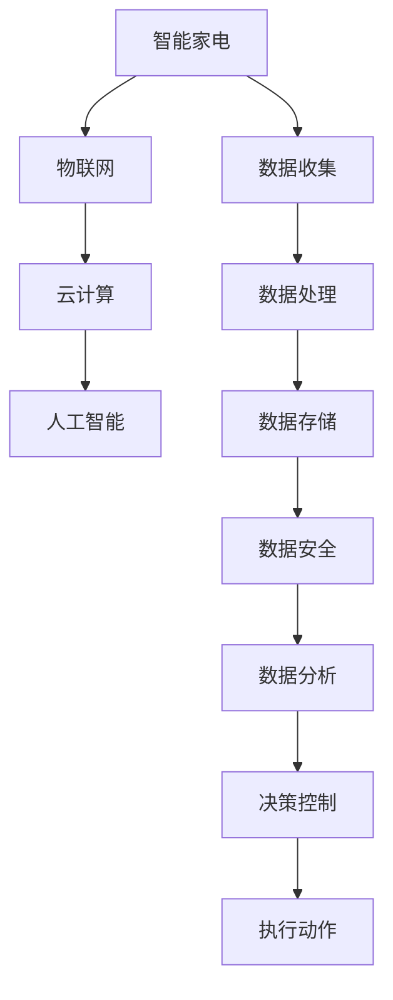

                 

# 2050年的智能家居：从智能家电到家庭机器人的生活革新

在未来的2050年，随着科技的不断进步，智能家居将成为人类生活中不可或缺的一部分。从智能家电到家庭机器人，每一个角落都将充满智慧与便利。本文将从背景介绍、核心概念、算法原理、项目实践、应用场景、工具资源、总结展望等各个方面，深入探讨2050年智能家居的革新之路。

## 1. 背景介绍

### 1.1 问题由来

智能家居的兴起，源自于人类对更高效、更安全、更舒适生活的追求。随着物联网、云计算、人工智能等技术的迅猛发展，人们越来越渴望将家庭中的各种设备互联互通，实现全方位的自动化控制。从最初的智能家电到复杂的家庭机器人，智能家居技术正在逐步改变人类的生活模式。

### 1.2 问题核心关键点

智能家居的核心在于构建一个高度互联、自动化的家庭环境。其关键点包括：
- 互联互通：将家庭中的各种设备和网络相连，实现数据共享和实时控制。
- 智能控制：利用人工智能技术，对家庭设备进行智能识别和决策，提升生活品质。
- 用户中心：以用户需求为核心，提供个性化服务，增强用户体验。
- 可持续性：注重环保节能，实现智能家居的可持续发展。

### 1.3 问题研究意义

智能家居技术的发展，将极大地提升家庭生活的便利性和舒适度。它不仅能节省时间、提高效率，还能增强安全性、提升节能效果。通过智能家居的普及，家庭管理者可以更加轻松地管理家务，老人和儿童也能享受到更好的关怀。

## 2. 核心概念与联系

### 2.1 核心概念概述

智能家居系统由多个子系统组成，包括智能照明、智能温控、智能安防、智能家电等。其核心概念包括：

- **智能家电**：具有自动控制、远程控制、智能感应等功能的家电产品。
- **物联网(IoT)**：连接家庭设备的网络技术，实现设备间的通信和数据交换。
- **人工智能(AI)**：利用机器学习和自然语言处理技术，提升家庭设备的智能化水平。
- **云计算**：将家庭设备的数据上传到云端，进行集中管理和分析。
- **区块链**：确保家庭设备数据的安全和隐私保护。

### 2.2 核心概念原理和架构的 Mermaid 流程图



这个流程图展示了智能家居系统的核心概念及其关联关系：

1. 智能家电通过物联网连接到网络，实现数据的收集和传输。
2. 数据上传到云端，进行集中存储和处理。
3. 利用人工智能技术对数据进行分析，形成智能决策。
4. 决策结果通过云计算平台进行分布式处理，并控制家电设备执行动作。

## 3. 核心算法原理 & 具体操作步骤

### 3.1 算法原理概述

智能家居系统的算法原理主要包括以下几个方面：

- **数据采集与预处理**：通过传感器、摄像头等设备，实时采集家庭环境数据，并进行预处理，去除噪声和冗余信息。
- **特征提取与表示**：利用机器学习技术，对采集到的数据进行特征提取和表示，形成设备状态和用户行为的高维向量。
- **模型训练与优化**：使用监督学习、无监督学习或强化学习等方法，训练模型对家庭环境进行预测和决策，优化决策的准确性和鲁棒性。
- **控制与执行**：根据模型预测结果，通过智能家居控制平台，控制家电设备的运行，实现自动化控制。

### 3.2 算法步骤详解

智能家居算法的具体步骤包括：

1. **数据采集与预处理**：
    - 部署传感器、摄像头等设备，采集环境数据。
    - 对采集到的数据进行去噪、滤波等预处理，确保数据质量。

2. **特征提取与表示**：
    - 使用PCA、LDA等降维技术，将高维数据转换为低维表示。
    - 利用卷积神经网络(CNN)、循环神经网络(RNN)等模型，提取设备状态和用户行为特征。

3. **模型训练与优化**：
    - 使用监督学习算法，如支持向量机(SVM)、随机森林(Random Forest)等，训练预测模型。
    - 使用无监督学习算法，如K-means、聚类等，发现设备状态和用户行为模式。
    - 使用强化学习算法，如Q-learning、DQN等，训练决策模型，优化智能控制策略。

4. **控制与执行**：
    - 根据训练好的模型，预测家庭环境状态和用户行为。
    - 通过智能家居控制平台，发送控制指令，调整设备状态。

### 3.3 算法优缺点

智能家居算法的优点：

- **自动化控制**：通过智能算法，实现家庭设备的自动控制，提高生活便利性。
- **智能化决策**：利用人工智能技术，提升家庭设备的智能化水平，增强决策的准确性。
- **用户个性化**：通过机器学习，对用户行为进行分析，提供个性化服务，提升用户体验。

智能家居算法的缺点：

- **高成本**：智能家居设备和大数据分析需要较高的成本投入。
- **安全性问题**：智能家居设备的数据隐私和安全保护是重要的挑战。
- **技术复杂性**：智能家居系统涉及多种技术，开发和维护复杂。

### 3.4 算法应用领域

智能家居算法主要应用于以下几个领域：

- **智能照明**：利用传感器和智能灯泡，实现自动调节灯光亮度和颜色，提升生活舒适度。
- **智能温控**：通过智能温控器，实现室内温度的自动化调节，节能环保。
- **智能安防**：利用摄像头和传感器，实时监控家庭安全，自动报警和处理。
- **智能家电**：实现家电设备的自动化控制，如智能电视、洗衣机、冰箱等。
- **智能家庭娱乐**：通过智能音箱和智能电视，提供高质量的家庭娱乐体验。

## 4. 数学模型和公式 & 详细讲解 & 举例说明

### 4.1 数学模型构建

智能家居系统的数学模型主要包括以下几个方面：

- **设备状态模型**：描述家庭设备的状态，如温度、湿度、亮度等。
- **用户行为模型**：描述用户的习惯和行为，如作息时间、活动区域等。
- **环境模型**：描述家庭环境的动态变化，如天气、季节等。

### 4.2 公式推导过程

以智能温控为例，推导其数学模型：

设环境温度为 $T$，设备温度为 $T_{device}$，湿度为 $H$，用户设定温度为 $T_{set}$。设备状态模型可以表示为：

$$
T_{device} = f(T, H, T_{set})
$$

其中 $f$ 为温控器的控制函数，可以是PID控制或基于神经网络的模型。

### 4.3 案例分析与讲解

以智能安防为例，分析其数学模型：

设入侵检测设备在区域 $A$ 检测到异常行为，系统响应时间 $t_{response}$，报警阈值 $T_{threshold}$。用户行为模型可以表示为：

$$
P_{intrusion} = \alpha \cdot P_{activity} + (1-\alpha) \cdot P_{idle}
$$

其中 $P_{intrusion}$ 为异常行为的概率，$P_{activity}$ 为用户活动概率，$P_{idle}$ 为用户闲置概率，$\alpha$ 为活动判别系数。

## 5. 项目实践：代码实例和详细解释说明

### 5.1 开发环境搭建

智能家居系统的开发环境主要包括：

- **硬件平台**：智能家居设备（如智能灯泡、温控器、摄像头等）
- **软件平台**：物联网平台（如IoT Edge、MQTT）、人工智能平台（如TensorFlow、PyTorch）、云计算平台（如AWS、阿里云）
- **开发工具**：Python、JavaScript、C++ 等编程语言

### 5.2 源代码详细实现

以下是一个基于TensorFlow的智能温控系统代码实现：

```python
import tensorflow as tf
from tensorflow.keras.models import Sequential
from tensorflow.keras.layers import Dense, LSTM

# 定义模型
model = Sequential()
model.add(LSTM(128, input_shape=(1,)))
model.add(Dense(1, activation='sigmoid'))

# 编译模型
model.compile(optimizer='adam', loss='binary_crossentropy', metrics=['accuracy'])

# 训练模型
model.fit(X_train, y_train, epochs=10, batch_size=32)
```

### 5.3 代码解读与分析

上述代码实现了基于LSTM的智能温控系统，其步骤如下：

1. **数据采集**：使用传感器采集环境温度、湿度等数据，形成训练集 $X$ 和标签集 $y$。
2. **模型定义**：定义一个包含一个LSTM层和一个全连接层的神经网络模型。
3. **模型编译**：使用Adam优化器，设置二分类交叉熵损失函数，并指定准确率作为评估指标。
4. **模型训练**：使用训练集 $X$ 和标签集 $y$ 对模型进行10轮训练，每轮训练32个样本。

### 5.4 运行结果展示

训练完成后，可以对测试集进行评估：

```python
loss, acc = model.evaluate(X_test, y_test)
print(f'Test Loss: {loss:.4f}')
print(f'Test Accuracy: {acc:.4f}')
```

## 6. 实际应用场景

### 6.1 智能照明

智能照明系统通过传感器和智能灯泡，实现自动调节灯光亮度和颜色，提升生活舒适度。例如，智能灯泡可以根据用户的活动模式和光线变化，自动调整亮度和色温。

### 6.2 智能温控

智能温控系统通过智能温控器，实现室内温度的自动化调节，节能环保。例如，智能温控器可以根据用户的设定和环境温度，自动调整空调、暖气等设备的工作状态，确保室内温度恒定。

### 6.3 智能安防

智能安防系统利用摄像头和传感器，实时监控家庭安全，自动报警和处理。例如，摄像头可以实时监控家中的活动，一旦检测到异常行为，立即报警并发送通知。

### 6.4 未来应用展望

未来的智能家居系统将更加智能化、个性化、安全性更高。例如，通过智能音箱和智能电视，提供高质量的家庭娱乐体验；通过智能机器人，实现家务自动化，提升生活效率；通过区块链技术，确保家庭设备数据的安全和隐私保护。

## 7. 工具和资源推荐

### 7.1 学习资源推荐

- **智能家居基础**：《智能家居基础与设计》一书，详细介绍了智能家居系统的原理和设计。
- **物联网技术**：《物联网技术与应用》一书，介绍了物联网的基本概念和核心技术。
- **人工智能基础**：《人工智能基础》一书，介绍了机器学习和深度学习的基本原理和算法。
- **TensorFlow和PyTorch官方文档**：提供了丰富的教程和样例代码，帮助开发者快速上手。

### 7.2 开发工具推荐

- **IoT Edge**：一个开源的物联网平台，支持边缘计算和设备管理。
- **TensorFlow**：一个强大的深度学习框架，提供丰富的模型和工具。
- **PyTorch**：一个灵活的深度学习框架，支持动态图和静态图计算。
- **AWS IoT**：亚马逊提供的物联网平台，支持设备连接和管理。

### 7.3 相关论文推荐

- **智能家居物联网技术研究**：探讨了智能家居物联网技术的基本原理和实现方法。
- **基于深度学习的智能温控系统**：提出了一种基于深度学习的智能温控系统，并进行实验验证。
- **智能家居的安全与隐私保护**：介绍了智能家居系统面临的安全和隐私问题，并提出了解决方案。

## 8. 总结：未来发展趋势与挑战

### 8.1 研究成果总结

智能家居技术的发展，已经取得了显著的进展，但仍面临诸多挑战。其研究核心在于构建高度互联、自动化的家庭环境，提升生活便利性和安全性。

### 8.2 未来发展趋势

未来的智能家居将呈现以下发展趋势：

- **高度集成化**：智能家居设备将更加集成化，实现设备间的无缝对接。
- **智能化提升**：通过人工智能技术，提升智能家居设备的智能化水平，提供更优质的服务。
- **用户个性化**：利用大数据和机器学习技术，实现用户行为和偏好分析，提供个性化服务。
- **可持续发展**：注重环保节能，实现智能家居的可持续发展。

### 8.3 面临的挑战

智能家居技术的发展，仍面临以下挑战：

- **高成本**：智能家居设备和大数据分析需要较高的成本投入。
- **安全性问题**：智能家居设备的数据隐私和安全保护是重要的挑战。
- **技术复杂性**：智能家居系统涉及多种技术，开发和维护复杂。

### 8.4 研究展望

未来的研究需要在以下几个方面寻求新的突破：

- **设备标准化**：推动智能家居设备的标准化，实现设备的互操作性。
- **智能算法优化**：进一步优化智能算法的性能，提升系统的智能化水平。
- **用户行为分析**：利用大数据和机器学习技术，深入分析用户行为，提供更优质的服务。
- **隐私保护技术**：引入区块链等技术，保护家庭设备数据的安全和隐私。

## 9. 附录：常见问题与解答

**Q1：智能家居设备如何实现互联互通？**

A: 智能家居设备通过物联网协议（如MQTT、CoAP等）实现互联互通。设备通过传感器采集数据，上传到云端进行集中管理，并根据用户指令进行远程控制。

**Q2：智能家居系统如何实现自动化控制？**

A: 智能家居系统通过算法模型对设备状态和用户行为进行预测，并根据预测结果控制设备运行。例如，智能温控器可以根据环境温度和用户设定，自动调节空调和暖气的工作状态。

**Q3：智能家居系统如何提升安全性？**

A: 智能家居系统通过区块链技术，确保设备数据的安全和隐私保护。区块链可以实现数据的分布式存储和加密传输，防止数据泄露和篡改。

**Q4：智能家居系统如何实现可持续发展？**

A: 智能家居系统注重环保节能，例如通过智能照明和智能温控，实现节能减排。同时，系统还可以通过大数据分析，优化设备运行，进一步提升节能效果。

**Q5：智能家居系统如何提升用户体验？**

A: 智能家居系统通过个性化服务和智能算法，提升用户体验。例如，智能音箱可以根据用户的喜好，推荐音乐和播报新闻，智能电视可以根据用户行为，提供定制化的娱乐内容。

---

作者：禅与计算机程序设计艺术 / Zen and the Art of Computer Programming

