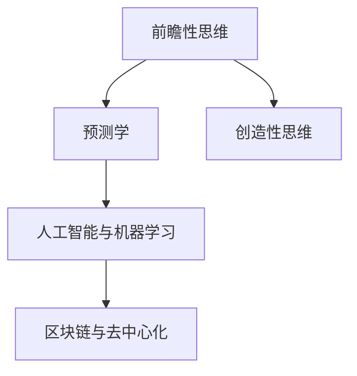

                 

# 2050年的未来学：从预测到创造的前瞻性思维

## 1. 背景介绍

随着科技的飞速发展，我们正处在人类历史上一个前所未有的变革时期。从互联网到人工智能，从量子计算到生物技术，技术的进步不断推动着社会形态和生活方式的演变。然而，未来的图景并非一成不变，而是充满了无限可能。在这一过程中，我们需要具备一种前瞻性的思维，既要理解现状，又要预见未来，从而在变化的浪潮中乘风破浪。

### 1.1 问题由来

当前，人类社会正面临诸多挑战，包括但不限于气候变化、人口老龄化、经济不平等、信息安全等。这些问题不仅仅是技术问题，更是社会问题。如何利用技术解决这些问题，实现可持续发展，成为摆在人类面前的重大课题。同时，科技的进步也带来了新的机遇，如智慧城市、精准医疗、虚拟现实等新兴领域，如何从中寻找创新点，创造新的价值，也是我们面临的重要课题。

### 1.2 问题核心关键点

为了应对未来的挑战和机遇，我们需要具备一种前瞻性的思维方式。这种思维方式不仅关注技术的发展趋势，更关注技术与社会、经济、环境的相互作用。以下是我认为的关键点：

1. **跨学科融合**：未来的科技发展将更加依赖跨学科的合作，如计算机科学、生物学、物理学、社会科学等。只有跨学科的融合，才能产生创新性的突破。
2. **数据驱动决策**：大数据和人工智能技术的发展，使得基于数据的决策成为可能。从政策制定到企业运营，数据驱动决策将成为未来的一种常态。
3. **伦理与责任**：技术的发展带来了伦理和责任的挑战，如何在技术创新与道德伦理之间找到平衡点，成为关键问题。
4. **可持续性**：科技发展的可持续性是未来社会发展的关键，如何实现技术的绿色低碳、社会公平，成为全球关注的焦点。
5. **技术与人的关系**：未来的技术将与人类生活更加紧密，如何构建人与技术和谐共存的社会，是未来的重要课题。

## 2. 核心概念与联系

### 2.1 核心概念概述

在探讨未来的思维方式时，我们需要先明确几个核心概念：

- **前瞻性思维**：指在当前的基础上，通过分析和预测未来的发展趋势，制定相应的策略和行动方案。
- **预测学**：通过模型和数据，预测未来可能发生的事件和趋势。
- **创造性思维**：指在现有技术基础上，结合新的理念和方法，创造出新的产品、服务和解决方案。
- **人工智能与机器学习**：通过数据和算法，让机器具备学习、推理和决策的能力。
- **区块链与去中心化**：一种分布式账本技术，通过去中心化手段，实现数据透明、安全和信任。

这些概念之间有着密切的联系，共同构成了未来思维的基础。以下是一个Mermaid流程图，展示了这些概念之间的联系：



## 3. 核心算法原理 & 具体操作步骤
### 3.1 算法原理概述

在未来的思维模式中，预测学和创造性思维是两个重要的工具。预测学通过数据和模型，对未来的趋势进行预测。创造性思维则是在预测的基础上，结合新的技术和方法，创造出新的解决方案。

### 3.2 算法步骤详解

#### 3.2.1 预测学

预测学的主要步骤包括：

1. **数据收集与处理**：收集与预测目标相关的数据，进行清洗和预处理。
2. **模型选择与训练**：选择合适的模型，如时间序列模型、回归模型、深度学习模型等，并使用历史数据进行训练。
3. **结果验证**：使用测试集验证模型性能，调整模型参数，确保预测结果的准确性。
4. **结果应用**：将预测结果应用于决策过程，指导行动。

#### 3.2.2 创造性思维

创造性思维的主要步骤包括：

1. **需求分析**：明确预测结果中需要解决的问题和需求。
2. **技术融合**：结合现有的技术手段，如人工智能、机器学习、区块链等，寻找创新点。
3. **方案设计**：设计新的解决方案，考虑技术的可行性、成本和效果。
4. **原型验证**：构建原型并进行测试，验证方案的实际效果。
5. **迭代优化**：根据测试结果，不断优化方案，直至满足需求。

### 3.3 算法优缺点

#### 3.3.1 预测学的优缺点

**优点**：
- 基于数据和模型，预测结果具有较高的可信度。
- 可以指导未来的决策，减少不确定性。

**缺点**：
- 数据的质量和完整性直接影响预测结果的准确性。
- 预测结果只能反映过去和现在的趋势，无法预测未来可能发生的新情况。

#### 3.3.2 创造性思维的优缺点

**优点**：
- 结合新技术和新方法，可以创造出全新的解决方案。
- 可以应对预测学无法预测的新情况。

**缺点**：
- 创新过程需要跨学科的知识和经验，难度较大。
- 创新的效果需要经过多次试验和验证，成本较高。

### 3.4 算法应用领域

#### 3.4.1 预测学

- **金融市场预测**：利用历史数据和机器学习模型，预测股票、期货等金融市场的走势。
- **天气预报**：通过气象数据和深度学习模型，预测未来的天气变化。
- **公共卫生**：使用传染病数据和统计模型，预测疫情的传播趋势。

#### 3.4.2 创造性思维

- **智慧城市**：结合人工智能、物联网、区块链等技术，构建智能化的城市管理系统。
- **精准医疗**：通过基因数据和机器学习模型，制定个性化的治疗方案。
- **虚拟现实**：结合计算机图形学、人工智能等技术，创造沉浸式的虚拟现实体验。

## 4. 数学模型和公式 & 详细讲解 & 举例说明

### 4.1 数学模型构建

在预测学中，常用的数学模型包括时间序列模型、回归模型、神经网络模型等。以下以时间序列模型为例，介绍其构建过程。

**时间序列模型**：
- **ARIMA模型**：自回归积分滑动平均模型，常用于预测时间序列数据。
- **LSTM模型**：长短期记忆网络，适合处理时间序列数据中的长期依赖关系。

### 4.2 公式推导过程

**ARIMA模型**：
- 自回归模型(AR)：$$AR(p) = \sum_{i=1}^p \phi_i B^i X_t = \epsilon_t$$
- 差分自回归模型(I)：$$I(d) = (1 - B)^d X_t = \epsilon_t$$
- 滑动平均模型(MA)：$$MA(q) = \sum_{i=1}^q \theta_i B^i \epsilon_t = Y_t$$

其中，$B$表示滞后算子，$X_t$表示时间序列，$\epsilon_t$表示误差项，$d$表示差分阶数，$\phi_i$和$\theta_i$为模型参数。

### 4.3 案例分析与讲解

以股票市场预测为例，使用ARIMA模型进行预测：

1. **数据收集**：收集历史股票价格数据，进行清洗和预处理。
2. **模型选择**：根据数据特性，选择合适的ARIMA模型。
3. **模型训练**：使用历史数据训练模型，调整参数。
4. **结果验证**：使用测试集验证模型性能，确保预测结果的准确性。
5. **结果应用**：将预测结果应用于股票交易策略中，指导投资决策。

## 5. 项目实践：代码实例和详细解释说明

### 5.1 开发环境搭建

为了进行预测学和创造性思维的实践，需要搭建一个开发环境。以下是具体的步骤：

1. **安装Python**：从官网下载Python安装程序，按照指引进行安装。
2. **安装相关库**：安装常用的Python库，如NumPy、Pandas、Scikit-learn、TensorFlow等。
3. **配置环境**：设置虚拟环境，安装相应的依赖包。

### 5.2 源代码详细实现

以下是一个使用Python和Scikit-learn库进行时间序列预测的示例代码：

```python
import pandas as pd
from sklearn.metrics import mean_squared_error
from statsmodels.tsa.arima.model import ARIMA
from matplotlib import pyplot as plt

# 加载数据
data = pd.read_csv('stock_prices.csv', index_col='Date', parse_dates=True)

# 数据预处理
data['Price'] = data['Close']  # 假设收盘价为预测目标
data = data[['Price']].dropna()

# 模型训练
model = ARIMA(data, order=(5, 1, 0))  # ARIMA(5, 1, 0)模型
model_fit = model.fit()

# 预测未来数据
forecast = model_fit.forecast(steps=30)  # 预测未来30个数据点

# 可视化结果
plt.plot(data['Price'], label='True Data')
plt.plot(forecast, label='Predicted Data')
plt.legend()
plt.show()

# 评估结果
mse = mean_squared_error(data['Price'], forecast)
print(f'Mean Squared Error: {mse:.2f}')
```

### 5.3 代码解读与分析

以上代码使用Scikit-learn库的ARIMA模型对股票价格进行预测。主要步骤包括：

1. **数据加载与预处理**：使用Pandas库加载数据，进行数据清洗和预处理。
2. **模型训练**：使用ARIMA模型对数据进行训练，得到模型参数。
3. **结果预测**：使用训练好的模型对未来数据进行预测。
4. **结果可视化**：使用Matplotlib库绘制预测结果和真实数据的对比图。
5. **结果评估**：使用均方误差评估预测结果的准确性。

## 6. 实际应用场景

### 6.1 智能交通

智能交通是未来城市发展的重要方向。结合预测学和创造性思维，可以实现交通流量的智能化管理。

**预测学**：通过历史交通数据和机器学习模型，预测未来交通流量变化。
**创造性思维**：结合物联网、区块链等技术，构建智能交通系统，实时调整信号灯和路网布局，优化交通流量。

### 6.2 智慧医疗

智慧医疗是未来医疗发展的重要方向。结合预测学和创造性思维，可以实现精准医疗和个性化治疗。

**预测学**：通过患者历史数据和统计模型，预测疾病的传播趋势和患者风险。
**创造性思维**：结合基因数据和机器学习模型，制定个性化的治疗方案，提高治疗效果。

### 6.3 虚拟现实

虚拟现实是未来娱乐和教育的重要方向。结合预测学和创造性思维，可以创造沉浸式的虚拟现实体验。

**预测学**：通过用户行为数据和机器学习模型，预测用户的喜好和行为。
**创造性思维**：结合计算机图形学、人工智能等技术，创造出沉浸式的虚拟现实体验，满足用户需求。

### 6.4 未来应用展望

#### 6.4.1 技术融合

未来的科技发展将更加依赖跨学科的合作，如计算机科学、生物学、物理学、社会科学等。只有跨学科的融合，才能产生创新性的突破。

#### 6.4.2 数据驱动决策

大数据和人工智能技术的发展，使得基于数据的决策成为可能。从政策制定到企业运营，数据驱动决策将成为未来的一种常态。

#### 6.4.3 伦理与责任

技术的发展带来了伦理和责任的挑战，如何在技术创新与道德伦理之间找到平衡点，成为关键问题。

#### 6.4.4 可持续性

科技发展的可持续性是未来社会发展的关键，如何实现技术的绿色低碳、社会公平，成为全球关注的焦点。

#### 6.4.5 技术与人的关系

未来的技术将与人类生活更加紧密，如何构建人与技术和谐共存的社会，是未来的重要课题。

## 7. 工具和资源推荐

### 7.1 学习资源推荐

为了帮助开发者系统掌握预测学和创造性思维的理论基础和实践技巧，这里推荐一些优质的学习资源：

1. **《数据科学与机器学习》**：介绍数据科学和机器学习的基础知识，涵盖数据收集、处理、分析和建模等方面。
2. **《深度学习》**：介绍深度学习的基本概念和算法，涵盖神经网络、卷积神经网络、循环神经网络等。
3. **《人工智能：一种现代方法》**：介绍人工智能的发展历程和前沿技术，涵盖搜索算法、逻辑推理、知识表示等方面。
4. **Coursera《机器学习》**：由斯坦福大学教授Andrew Ng开设的机器学习课程，涵盖线性回归、逻辑回归、神经网络等。
5. **edX《人工智能基础》**：由MIT教授Patrick Winston开设的人工智能课程，涵盖符号推理、人工智能历史等方面。

通过这些资源的学习实践，相信你一定能够快速掌握预测学和创造性思维的精髓，并用于解决实际的问题。

### 7.2 开发工具推荐

高效的开发离不开优秀的工具支持。以下是几款用于预测学和创造性思维开发的常用工具：

1. **Python**：广泛使用的编程语言，支持数据处理、机器学习、人工智能等方面。
2. **NumPy**：高效的多维数组计算库，支持向量、矩阵等运算。
3. **Pandas**：数据分析库，支持数据清洗、处理、可视化等方面。
4. **Scikit-learn**：机器学习库，支持各种经典算法的实现和应用。
5. **TensorFlow**：开源深度学习框架，支持神经网络的构建和训练。
6. **Keras**：高级神经网络库，支持快速搭建和训练深度学习模型。
7. **Jupyter Notebook**：交互式开发环境，支持代码、数据、文档的整合展示。

合理利用这些工具，可以显著提升预测学和创造性思维的开发效率，加快创新迭代的步伐。

### 7.3 相关论文推荐

预测学和创造性思维的研究源于学界的持续研究。以下是几篇奠基性的相关论文，推荐阅读：

1. **《时间序列分析》**：介绍时间序列分析的基本概念和常用方法，涵盖ARIMA、LSTM等模型。
2. **《深度学习》**：介绍深度学习的基本概念和算法，涵盖卷积神经网络、循环神经网络等。
3. **《人工智能：一种现代方法》**：介绍人工智能的发展历程和前沿技术，涵盖符号推理、人工智能历史等方面。
4. **《自然语言处理综述》**：介绍自然语言处理的基本概念和常用方法，涵盖词向量、序列模型等。
5. **《深度强化学习》**：介绍深度强化学习的基本概念和算法，涵盖DQN、ACER等模型。

这些论文代表了大数据和人工智能的发展脉络。通过学习这些前沿成果，可以帮助研究者把握学科前进方向，激发更多的创新灵感。

## 8. 总结：未来发展趋势与挑战

### 8.1 总结

本文对预测学和创造性思维的未来发展趋势进行了系统梳理。首先阐述了预测学和创造性思维的理论基础和应用场景，明确了其在前瞻性思维中的重要地位。其次，从原理到实践，详细讲解了预测学和创造性思维的数学模型和操作步骤，给出了具体的代码实例。同时，本文还广泛探讨了预测学和创造性思维在智能交通、智慧医疗、虚拟现实等多个行业领域的应用前景，展示了其在未来发展中的广阔前景。

通过本文的系统梳理，可以看到，预测学和创造性思维在未来的科技发展中具有重要的地位，可以应对多变的世界，引导未来的创新和变革。

### 8.2 未来发展趋势

展望未来，预测学和创造性思维将呈现以下几个发展趋势：

1. **跨学科融合**：预测学和创造性思维将更加依赖跨学科的合作，如计算机科学、生物学、物理学、社会科学等。只有跨学科的融合，才能产生创新性的突破。
2. **数据驱动决策**：大数据和人工智能技术的发展，使得基于数据的决策成为可能。从政策制定到企业运营，数据驱动决策将成为未来的一种常态。
3. **伦理与责任**：技术的发展带来了伦理和责任的挑战，如何在技术创新与道德伦理之间找到平衡点，成为关键问题。
4. **可持续性**：科技发展的可持续性是未来社会发展的关键，如何实现技术的绿色低碳、社会公平，成为全球关注的焦点。
5. **技术与人的关系**：未来的技术将与人类生活更加紧密，如何构建人与技术和谐共存的社会，是未来的重要课题。

以上趋势凸显了预测学和创造性思维的广阔前景。这些方向的探索发展，必将进一步提升预测学和创造性思维的威力，为构建智能社会提供新的动力。

### 8.3 面临的挑战

尽管预测学和创造性思维已经取得了显著成果，但在迈向更加智能化、普适化应用的过程中，仍面临诸多挑战：

1. **数据质量**：预测学的效果很大程度上依赖于数据的质量和完整性，如何获取高质量的数据，成为一大难题。
2. **模型复杂度**：预测学和创造性思维中的模型通常较为复杂，如何简化模型，提升效率，是需要解决的问题。
3. **伦理问题**：预测学和创造性思维中可能涉及隐私、公平等伦理问题，如何保护用户隐私，确保公平，是亟需解决的问题。
4. **可解释性**：预测学和创造性思维中的模型通常较为复杂，难以解释其内部工作机制和决策逻辑。如何赋予模型可解释性，将是重要的研究方向。
5. **资源消耗**：预测学和创造性思维中的模型通常需要大量的计算资源和存储空间，如何优化资源消耗，是重要的研究方向。

正视预测学和创造性思维面临的这些挑战，积极应对并寻求突破，将是大数据和人工智能技术不断成熟的重要保证。

### 8.4 研究展望

为了应对未来挑战，预测学和创造性思维的研究方向需要不断拓展：

1. **深度学习与可解释性**：结合深度学习与可解释性技术，提升模型的可解释性和公平性。
2. **跨领域融合**：将预测学和创造性思维与其他领域的知识和技术进行融合，如生物医学、地理信息系统等。
3. **去中心化与隐私保护**：结合区块链和去中心化技术，保护用户隐私，提升数据安全。
4. **可持续发展**：结合可持续发展的理念，设计和实现绿色低碳的预测学和创造性思维系统。
5. **伦理与社会**：结合伦理与社会学的研究，制定预测学和创造性思维的伦理规范，保障技术的安全性和可靠性。

这些研究方向将引领预测学和创造性思维走向更高的台阶，为构建智能社会提供更坚实的理论和技术基础。面向未来，预测学和创造性思维的研究需要不断创新，不断突破，为构建更加美好的未来贡献力量。

## 9. 附录：常见问题与解答

**Q1：预测学和创造性思维是否可以应用于所有行业？**

A: 预测学和创造性思维可以应用于几乎所有行业，包括金融、医疗、教育、制造等。然而，不同行业的具体应用方式和难点各异，需要根据行业特点进行调整。

**Q2：预测学和创造性思维需要哪些数据和资源？**

A: 预测学和创造性思维需要高质量的数据和充足的计算资源。数据的质量和完整性直接影响预测结果的准确性和模型的效果。同时，计算资源的高效利用，也是提升预测学和创造性思维效率的重要保障。

**Q3：如何提升预测学和创造性思维的模型性能？**

A: 提升预测学和创造性思维的模型性能，可以从以下几个方面入手：
- 数据清洗与预处理：确保数据的质量和完整性，减少噪声和缺失值的影响。
- 模型选择与优化：选择适合问题的模型，并进行调参优化，提升模型效果。
- 模型融合与集成：结合多个模型的优势，提升模型的鲁棒性和泛化能力。
- 数据增强与合成：通过数据增强和合成技术，扩充数据集，提高模型的泛化能力。

**Q4：预测学和创造性思维在实际应用中需要注意哪些问题？**

A: 预测学和创造性思维在实际应用中需要注意以下问题：
- 数据隐私与伦理：确保数据隐私和安全，遵守相关法律法规，避免伦理问题。
- 模型公平与可解释性：确保模型的公平性，提升模型的可解释性，增强用户的信任。
- 系统可靠性与稳定性：确保系统的可靠性和稳定性，避免系统崩溃或故障。
- 资源消耗与成本：合理优化资源消耗，控制系统的成本，确保经济效益。

**Q5：未来预测学和创造性思维将面临哪些新的挑战？**

A: 未来预测学和创造性思维将面临以下新的挑战：
- 数据爆炸与数据治理：数据量迅速增长，如何管理和治理数据成为一大难题。
- 计算资源与算法效率：计算资源的需求不断增长，如何提升算法的效率，降低计算成本。
- 跨领域融合与知识整合：预测学和创造性思维需要与其他领域的知识进行融合，如何实现知识整合，提升模型的泛化能力。
- 技术与伦理的平衡：技术的发展带来了伦理和责任的挑战，如何在技术创新与道德伦理之间找到平衡点，成为关键问题。

这些挑战需要预测学和创造性思维的研究者不断探索和突破，才能推动其技术不断成熟和应用。

---

作者：禅与计算机程序设计艺术 / Zen and the Art of Computer Programming

