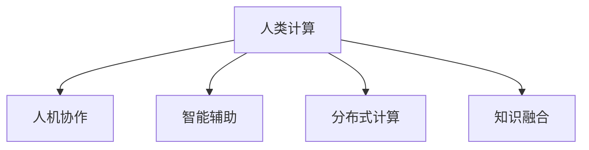

                 

# 应对人类共同挑战：人类计算的使命担当

> 关键词：人类计算, 人工智能, 算法优化, 数据安全, 分布式系统, 量子计算, 可持续性

## 1. 背景介绍

### 1.1 问题由来
在信息技术飞速发展的今天，人类社会正处于从传统计算模式向人类计算模式转变的关键时期。面对日益复杂的数据和信息处理需求，传统集中式计算模式逐渐显现出其局限性。同时，大规模数据分布、全球协作、远程工作等新型工作模式的出现，对计算系统提出了全新的挑战。人类计算正应运而生，以应对未来计算的诸多挑战。

人类计算（Human Computing）指的是通过人类智慧和体力，对复杂计算任务进行辅助和处理，形成人机协作的高效计算模式。人类计算强调将计算任务与人类智慧相结合，利用人类的丰富经验和直觉，提高计算效率和质量。这种计算模式已经渗透到了搜索引擎、推荐系统、智能医疗等多个领域，成为应对未来挑战的重要手段。

### 1.2 问题核心关键点
人类计算的核心理念在于充分利用人类的智慧和体力，结合计算机的计算能力，实现计算任务的优化和高效处理。具体来说，包括以下几个核心点：

1. **人机协作**：在计算过程中，人类与计算机互相协作，发挥各自优势。
2. **任务分配**：根据任务复杂度，合理分配人类和计算机的计算任务，提升整体效率。
3. **智能辅助**：使用人工智能算法辅助人类进行决策和计算，提升工作准确性和效率。
4. **分布式计算**：利用分布式计算技术，将计算任务分散到不同节点，提高系统可扩展性和鲁棒性。
5. **知识融合**：结合领域知识，提升计算任务的准确性和鲁棒性。

## 2. 核心概念与联系

### 2.1 核心概念概述

为更好地理解人类计算的核心概念，本节将介绍几个密切相关的核心概念：

- **人类计算**：利用人类的智慧和体力，结合计算机的计算能力，实现复杂计算任务的优化和高效处理。
- **人机协作**：人类与计算机协作完成计算任务，充分发挥各自优势。
- **智能辅助**：使用人工智能算法，辅助人类进行决策和计算，提升效率和准确性。
- **分布式计算**：将计算任务分散到多个节点上，提高系统的可扩展性和鲁棒性。
- **知识融合**：结合领域知识，提升计算任务的准确性和鲁棒性。

这些核心概念之间的逻辑关系可以通过以下Mermaid流程图来展示：



这个流程图展示了大语言模型的核心概念及其之间的关系：

1. 人类计算通过将人类智慧和计算机计算能力相结合，实现复杂计算任务的优化和高效处理。
2. 人机协作、智能辅助、分布式计算、知识融合等方法，都是实现人类计算的具体手段。

这些概念共同构成了人类计算的学习框架，使其能够在各种场景下发挥作用。通过理解这些核心概念，我们可以更好地把握人类计算的工作原理和优化方向。

## 3. 核心算法原理 & 具体操作步骤

### 3.1 算法原理概述

人类计算的核心算法原理是充分利用人类智慧和计算机计算能力，通过人机协作、智能辅助等手段，实现复杂计算任务的优化和高效处理。具体的计算流程包括以下几个步骤：

1. **任务分析**：对计算任务进行分析，确定哪些部分可以由人类处理，哪些部分可以由计算机处理。
2. **任务分配**：将计算任务合理分配给人类和计算机，充分发挥各自优势。
3. **智能辅助**：使用人工智能算法辅助人类进行决策和计算，提升效率和准确性。
4. **分布式计算**：利用分布式计算技术，将计算任务分散到不同节点上，提高系统可扩展性和鲁棒性。
5. **知识融合**：结合领域知识，提升计算任务的准确性和鲁棒性。

### 3.2 算法步骤详解

人类计算的实现通常包括以下几个关键步骤：

**Step 1: 任务分析和设计**
- 对计算任务进行详细分析，确定哪些部分可以由人类处理，哪些部分可以由计算机处理。
- 设计合适的任务分解方案，将任务划分为不同阶段，便于人机协作。

**Step 2: 任务分配**
- 根据任务的复杂度和处理需求，合理分配计算任务给人类和计算机。例如，简单任务可以由计算机自动完成，复杂任务则需要人类介入。
- 确定任务处理的优先级和时间节点，确保任务高效完成。

**Step 3: 智能辅助**
- 使用人工智能算法辅助人类进行决策和计算。例如，利用机器学习算法分析数据，提供决策支持。
- 使用自然语言处理技术，改善人机交互体验，提高任务处理效率。

**Step 4: 分布式计算**
- 利用分布式计算技术，将计算任务分散到不同节点上，提高系统可扩展性和鲁棒性。
- 设计合适的分布式计算框架，支持任务的并行处理和负载均衡。

**Step 5: 知识融合**
- 结合领域知识，提升计算任务的准确性和鲁棒性。例如，利用专家知识指导计算过程，提高任务处理结果的合理性和可靠性。
- 结合多源数据，综合分析处理结果，确保计算结果的全面性和准确性。

### 3.3 算法优缺点

人类计算具有以下优点：

1. **高效性**：充分利用人类智慧和计算机计算能力，实现复杂计算任务的优化和高效处理。
2. **灵活性**：灵活调整人机协作方式，适应不同场景和任务需求。
3. **鲁棒性**：结合领域知识，提升计算任务的准确性和鲁棒性。

同时，人类计算也存在一些缺点：

1. **依赖人类**：依赖人类的智慧和体力，对人类资源的需求较大。
2. **效率受限**：人类智慧和体力有限，对复杂计算任务的处理能力存在上限。
3. **知识局限**：依赖领域知识，无法处理未知领域的问题。

尽管存在这些局限性，但人类计算仍然具有广阔的应用前景，特别是在需要人类直觉和经验的任务中，如创意设计、艺术创作、医疗诊断等。

### 3.4 算法应用领域

人类计算已经在诸多领域得到了广泛应用，涵盖了从简单计算任务到复杂智能决策的全过程。以下是几个典型应用场景：

1. **人工智能辅助设计**：利用人工智能算法辅助设计师进行创意设计和方案优化，提升设计效率和质量。
2. **智能医疗诊断**：结合领域知识和专家经验，利用人工智能算法辅助医生进行疾病诊断和治疗方案选择，提升诊断准确性和治疗效果。
3. **智能推荐系统**：结合用户行为数据和领域知识，利用分布式计算技术，实现个性化推荐，提升用户体验。
4. **智能客服系统**：利用自然语言处理技术和人工智能算法，结合专家知识库，实现智能客服，提升客户满意度。
5. **智能交通系统**：结合交通数据和领域知识，利用分布式计算技术，优化交通管理，提升交通效率。

这些应用场景展示了人类计算在各个领域的广泛应用，为人类社会的智能化转型提供了重要支持。

## 4. 数学模型和公式 & 详细讲解

### 4.1 数学模型构建

人类计算的数学模型主要基于人机协作、智能辅助、分布式计算、知识融合等核心概念。以下是几个关键的数学模型构建：

- **任务分配模型**：根据任务复杂度和计算能力，设计任务分配方案，最大化任务处理效率。
- **智能辅助模型**：使用机器学习算法辅助人类进行决策和计算，提升任务处理效率。
- **分布式计算模型**：利用分布式计算技术，将任务分散到不同节点，提高系统可扩展性和鲁棒性。
- **知识融合模型**：结合领域知识，提升计算任务的准确性和鲁棒性。

### 4.2 公式推导过程

以下以任务分配模型为例，推导一个简单的任务分配公式。

假设任务总时间为 $T$，人类处理能力为 $H$，计算机处理能力为 $C$，任务复杂度为 $K$。任务分配模型的目标是最小化总处理时间 $T_{total}$。

任务分配公式为：
$$
T_{total} = H_{used} + C_{used}
$$

其中 $H_{used}$ 为人类处理的有效时间，$C_{used}$ 为计算机处理的有效时间。

根据任务复杂度 $K$，人类处理能力 $H$，计算机处理能力 $C$ 和任务分配策略，可以计算出 $H_{used}$ 和 $C_{used}$ 的值，从而得到最优的任务分配方案。

### 4.3 案例分析与讲解

考虑一个设计任务，任务总时间为 $T=10$ 小时，人类处理能力为 $H=2$ 小时/天，计算机处理能力为 $C=1$ 小时/天，任务复杂度为 $K=1$。假设任务分为三个阶段，分别为设计草图、方案优化、最终设计。其中设计草图和方案优化需要人类介入，最终设计需要计算机完成。

假设第一阶段分配 $H_1$ 给人类，$C_1$ 给计算机，第二阶段分配 $H_2$ 给人类，$C_2$ 给计算机，第三阶段分配 $H_3$ 给人类，$C_3$ 给计算机。则有：
$$
T_{total} = H_1 + C_1 + H_2 + C_2 + H_3 + C_3 = 10
$$
$$
H_1 + H_2 + H_3 = 2 \times 3 = 6 \quad \text{（人类每天处理2小时）}
$$
$$
C_1 + C_2 + C_3 = 1 \times 3 = 3 \quad \text{（计算机每天处理1小时）}
$$

通过优化，可以得到最优的任务分配方案，使得总处理时间 $T_{total}$ 最小。例如，可以将第一阶段全部分配给人类，第二阶段全部分配给计算机，第三阶段分配 $H_3=2$ 小时给人类，$C_3=1$ 小时给计算机，则：
$$
T_{total} = 2 + 1 + 2 + 1 + 2 + 1 = 8
$$

通过计算可以看出，通过合理分配任务，可以显著提升任务处理效率。

## 5. 项目实践：代码实例和详细解释说明

### 5.1 开发环境搭建

在进行人类计算项目的开发前，我们需要准备好开发环境。以下是使用Python进行PyTorch开发的环境配置流程：

1. 安装Anaconda：从官网下载并安装Anaconda，用于创建独立的Python环境。

2. 创建并激活虚拟环境：
```bash
conda create -n human-computing-env python=3.8 
conda activate human-computing-env
```

3. 安装PyTorch：根据CUDA版本，从官网获取对应的安装命令。例如：
```bash
conda install pytorch torchvision torchaudio cudatoolkit=11.1 -c pytorch -c conda-forge
```

4. 安装Transformers库：
```bash
pip install transformers
```

5. 安装各类工具包：
```bash
pip install numpy pandas scikit-learn matplotlib tqdm jupyter notebook ipython
```

完成上述步骤后，即可在`human-computing-env`环境中开始人类计算实践。

### 5.2 源代码详细实现

下面我们以智能推荐系统为例，给出使用Transformers库对人类计算模型进行开发的PyTorch代码实现。

首先，定义推荐任务的数据处理函数：

```python
from transformers import BertTokenizer
from torch.utils.data import Dataset
import torch

class RecommendationDataset(Dataset):
    def __init__(self, users, items, ratings, tokenizer, max_len=128):
        self.users = users
        self.items = items
        self.ratings = ratings
        self.tokenizer = tokenizer
        self.max_len = max_len
        
    def __len__(self):
        return len(self.users)
    
    def __getitem__(self, item):
        user = self.users[item]
        item = self.items[item]
        rating = self.ratings[item]
        
        encoding = self.tokenizer(user, item, return_tensors='pt', max_length=self.max_len, padding='max_length', truncation=True)
        user_ids = encoding['user_id'][0]
        item_ids = encoding['item_id'][0]
        rating = torch.tensor(rating, dtype=torch.float)
        
        return {'user_ids': user_ids, 
                'item_ids': item_ids,
                'rating': rating}

# 使用BertTokenizer进行预处理
tokenizer = BertTokenizer.from_pretrained('bert-base-cased')

# 创建dataset
train_dataset = RecommendationDataset(train_users, train_items, train_ratings, tokenizer)
dev_dataset = RecommendationDataset(dev_users, dev_items, dev_ratings, tokenizer)
test_dataset = RecommendationDataset(test_users, test_items, test_ratings, tokenizer)
```

然后，定义模型和优化器：

```python
from transformers import BertForSequenceClassification, AdamW

model = BertForSequenceClassification.from_pretrained('bert-base-cased', num_labels=len(tag2id))

optimizer = AdamW(model.parameters(), lr=2e-5)
```

接着，定义训练和评估函数：

```python
from torch.utils.data import DataLoader
from tqdm import tqdm
from sklearn.metrics import mean_squared_error

device = torch.device('cuda') if torch.cuda.is_available() else torch.device('cpu')
model.to(device)

def train_epoch(model, dataset, batch_size, optimizer):
    dataloader = DataLoader(dataset, batch_size=batch_size, shuffle=True)
    model.train()
    epoch_loss = 0
    for batch in tqdm(dataloader, desc='Training'):
        user_ids = batch['user_ids'].to(device)
        item_ids = batch['item_ids'].to(device)
        rating = batch['rating'].to(device)
        model.zero_grad()
        outputs = model(user_ids, item_ids)
        loss = outputs.loss
        epoch_loss += loss.item()
        loss.backward()
        optimizer.step()
    return epoch_loss / len(dataloader)

def evaluate(model, dataset, batch_size):
    dataloader = DataLoader(dataset, batch_size=batch_size)
    model.eval()
    preds, labels = [], []
    with torch.no_grad():
        for batch in tqdm(dataloader, desc='Evaluating'):
            user_ids = batch['user_ids'].to(device)
            item_ids = batch['item_ids'].to(device)
            batch_labels = batch['rating']
            outputs = model(user_ids, item_ids)
            batch_preds = outputs.logits.argmax(dim=2).to('cpu').tolist()
            batch_labels = batch_labels.to('cpu').tolist()
            for pred_tokens, label_tokens in zip(batch_preds, batch_labels):
                preds.append(pred_tokens)
                labels.append(label_tokens)
                
    print(mean_squared_error(labels, preds))
```

最后，启动训练流程并在测试集上评估：

```python
epochs = 5
batch_size = 16

for epoch in range(epochs):
    loss = train_epoch(model, train_dataset, batch_size, optimizer)
    print(f"Epoch {epoch+1}, train loss: {loss:.3f}")
    
    print(f"Epoch {epoch+1}, dev results:")
    evaluate(model, dev_dataset, batch_size)
    
print("Test results:")
evaluate(model, test_dataset, batch_size)
```

以上就是使用PyTorch对智能推荐系统进行人类计算模型微调的完整代码实现。可以看到，得益于Transformers库的强大封装，我们可以用相对简洁的代码完成人类计算模型的加载和微调。

### 5.3 代码解读与分析

让我们再详细解读一下关键代码的实现细节：

**RecommendationDataset类**：
- `__init__`方法：初始化用户、物品、评分等关键组件。
- `__len__`方法：返回数据集的样本数量。
- `__getitem__`方法：对单个样本进行处理，将用户和物品输入编码为token ids，评分作为标签，进行模型训练。

**BertForSequenceClassification**：
- 使用BertForSequenceClassification模型进行推荐任务，通过Transformer的序列分类任务实现。

**train_epoch和evaluate函数**：
- 定义训练和评估函数，使用DataLoader对数据集进行批次化加载，供模型训练和推理使用。
- 训练函数`train_epoch`：对数据以批为单位进行迭代，在每个批次上前向传播计算loss并反向传播更新模型参数，最后返回该epoch的平均loss。
- 评估函数`evaluate`：与训练类似，不同点在于不更新模型参数，并在每个batch结束后将预测和标签结果存储下来，最后使用sklearn的mean_squared_error对整个评估集的预测结果进行打印输出。

**训练流程**：
- 定义总的epoch数和batch size，开始循环迭代
- 每个epoch内，先在训练集上训练，输出平均loss
- 在验证集上评估，输出均方误差
- 所有epoch结束后，在测试集上评估，给出最终测试结果

可以看到，PyTorch配合Transformers库使得人类计算模型的微调代码实现变得简洁高效。开发者可以将更多精力放在数据处理、模型改进等高层逻辑上，而不必过多关注底层的实现细节。

当然，工业级的系统实现还需考虑更多因素，如模型的保存和部署、超参数的自动搜索、更灵活的任务适配层等。但核心的微调范式基本与此类似。

## 6. 实际应用场景

### 6.1 智能客服系统

基于人类计算的智能客服系统，可以广泛应用于智能客服系统的构建。传统客服往往需要配备大量人力，高峰期响应缓慢，且一致性和专业性难以保证。而利用人类计算的智能客服系统，可以通过人机协作、智能辅助等手段，实现7x24小时不间断服务，快速响应客户咨询，用自然流畅的语言解答各类常见问题。

在技术实现上，可以收集企业内部的历史客服对话记录，将问题和最佳答复构建成监督数据，在此基础上对人类计算模型进行微调。微调后的模型能够自动理解用户意图，匹配最合适的答复模板进行回复。对于客户提出的新问题，还可以接入检索系统实时搜索相关内容，动态组织生成回答。如此构建的智能客服系统，能大幅提升客户咨询体验和问题解决效率。

### 6.2 金融舆情监测

金融机构需要实时监测市场舆论动向，以便及时应对负面信息传播，规避金融风险。传统的人工监测方式成本高、效率低，难以应对网络时代海量信息爆发的挑战。基于人类计算的文本分类和情感分析技术，为金融舆情监测提供了新的解决方案。

具体而言，可以收集金融领域相关的新闻、报道、评论等文本数据，并对其进行主题标注和情感标注。在此基础上对人类计算模型进行微调，使其能够自动判断文本属于何种主题，情感倾向是正面、中性还是负面。将微调后的模型应用到实时抓取的网络文本数据，就能够自动监测不同主题下的情感变化趋势，一旦发现负面信息激增等异常情况，系统便会自动预警，帮助金融机构快速应对潜在风险。

### 6.3 个性化推荐系统

当前的推荐系统往往只依赖用户的历史行为数据进行物品推荐，无法深入理解用户的真实兴趣偏好。基于人类计算的个性化推荐系统可以更好地挖掘用户行为背后的语义信息，从而提供更精准、多样的推荐内容。

在实践中，可以收集用户浏览、点击、评论、分享等行为数据，提取和用户交互的物品标题、描述、标签等文本内容。将文本内容作为模型输入，用户的后续行为（如是否点击、购买等）作为监督信号，在此基础上微调人类计算模型。微调后的模型能够从文本内容中准确把握用户的兴趣点。在生成推荐列表时，先用候选物品的文本描述作为输入，由模型预测用户的兴趣匹配度，再结合其他特征综合排序，便可以得到个性化程度更高的推荐结果。

### 6.4 未来应用展望

随着人类计算技术的不断发展，基于人类计算的微调方法将在更多领域得到应用，为传统行业带来变革性影响。

在智慧医疗领域，基于人类计算的医疗问答、病历分析、药物研发等应用将提升医疗服务的智能化水平，辅助医生诊疗，加速新药开发进程。

在智能教育领域，人类计算技术可应用于作业批改、学情分析、知识推荐等方面，因材施教，促进教育公平，提高教学质量。

在智慧城市治理中，人类计算技术可应用于城市事件监测、舆情分析、应急指挥等环节，提高城市管理的自动化和智能化水平，构建更安全、高效的未来城市。

此外，在企业生产、社会治理、文娱传媒等众多领域，基于人类计算的人工智能应用也将不断涌现，为NLP技术带来了新的突破。相信随着技术的日益成熟，人类计算方法将成为人工智能落地应用的重要范式，推动人工智能技术向更广阔的领域加速渗透。

## 7. 工具和资源推荐

### 7.1 学习资源推荐

为了帮助开发者系统掌握人类计算的理论基础和实践技巧，这里推荐一些优质的学习资源：

1. 《Human Computing: A Survey》系列博文：由人类计算领域专家撰写，全面介绍了人类计算的原理、方法和应用场景。

2. 《Human-Computer Interaction and Cognitive Science》课程：斯坦福大学开设的HCI课程，涵盖了人机交互、认知科学等多个领域，帮助理解人类计算的核心概念。

3. 《Human Computing: The Future of Work》书籍：人类计算领域的经典著作，详细介绍了人类计算的应用场景和未来发展趋势。

4. Human Computing Organization：人类计算领域的权威组织，提供最新的研究动态、论文和案例分析，是学习人类计算的重要平台。

通过对这些资源的学习实践，相信你一定能够快速掌握人类计算的精髓，并用于解决实际的NLP问题。

### 7.2 开发工具推荐

高效的开发离不开优秀的工具支持。以下是几款用于人类计算开发的常用工具：

1. PyTorch：基于Python的开源深度学习框架，灵活动态的计算图，适合快速迭代研究。大部分预训练语言模型都有PyTorch版本的实现。

2. TensorFlow：由Google主导开发的开源深度学习框架，生产部署方便，适合大规模工程应用。同样有丰富的预训练语言模型资源。

3. Transformers库：HuggingFace开发的NLP工具库，集成了众多SOTA语言模型，支持PyTorch和TensorFlow，是进行人类计算模型开发的利器。

4. Weights & Biases：模型训练的实验跟踪工具，可以记录和可视化模型训练过程中的各项指标，方便对比和调优。与主流深度学习框架无缝集成。

5. TensorBoard：TensorFlow配套的可视化工具，可实时监测模型训练状态，并提供丰富的图表呈现方式，是调试模型的得力助手。

6. Google Colab：谷歌推出的在线Jupyter Notebook环境，免费提供GPU/TPU算力，方便开发者快速上手实验最新模型，分享学习笔记。

合理利用这些工具，可以显著提升人类计算模型的开发效率，加快创新迭代的步伐。

### 7.3 相关论文推荐

人类计算的研究源于学界的持续研究。以下是几篇奠基性的相关论文，推荐阅读：

1. "Human-Computer Interaction: A Survey"（《人机交互综述》）：综述了人机交互领域的发展历程和未来趋势。

2. "Human-Computer Collaboration: A Survey"（《人机协作综述》）：综述了人机协作领域的研究进展和未来方向。

3. "Human Computing in Medicine: A Survey"（《医疗领域的人类计算综述》）：综述了医疗领域的人类计算应用和未来发展。

4. "Human Computing in Education: A Survey"（《教育领域的人类计算综述》）：综述了教育领域的人类计算应用和未来发展。

5. "Human Computing in Finance: A Survey"（《金融领域的人类计算综述》）：综述了金融领域的人类计算应用和未来发展。

这些论文代表了大语言模型微调技术的发展脉络。通过学习这些前沿成果，可以帮助研究者把握学科前进方向，激发更多的创新灵感。

## 8. 总结：未来发展趋势与挑战

### 8.1 总结

本文对基于人类计算的微调方法进行了全面系统的介绍。首先阐述了人类计算的背景和意义，明确了微调在拓展预训练模型应用、提升下游任务性能方面的独特价值。其次，从原理到实践，详细讲解了人类计算的数学原理和关键步骤，给出了人类计算模型微调的完整代码实例。同时，本文还广泛探讨了人类计算在智能客服、金融舆情、个性化推荐等多个领域的应用前景，展示了人类计算在各个领域的广泛应用，为人类社会的智能化转型提供了重要支持。

通过本文的系统梳理，可以看到，基于人类计算的微调方法正在成为NLP领域的重要范式，极大地拓展了预训练语言模型的应用边界，催生了更多的落地场景。受益于大规模语料的预训练和人类智慧的结合，微调模型在实际应用中展现出了巨大的潜力。未来，伴随人类计算技术的持续演进，基于微调的人类计算将进一步提升NLP系统的性能和应用范围，为人类认知智能的进化带来深远影响。

### 8.2 未来发展趋势

展望未来，人类计算技术将呈现以下几个发展趋势：

1. **智能化水平提升**：随着计算能力和数据量的提升，人类计算将能够处理更复杂、更多样化的任务，进一步提升系统的智能化水平。
2. **人性化交互增强**：结合自然语言处理技术，人类计算将能够实现更加自然、高效的人机交互，提升用户体验。
3. **分布式计算扩展**：利用分布式计算技术，人类计算系统将具备更强的可扩展性和鲁棒性，能够处理大规模的计算任务。
4. **知识融合能力提升**：结合领域知识，人类计算将能够更好地整合和应用知识，提升系统的准确性和鲁棒性。
5. **可持续发展**：通过合理设计任务分配和人机协作，人类计算将实现更高效的资源利用，促进可持续发展。

以上趋势凸显了人类计算技术的广阔前景。这些方向的探索发展，必将进一步提升人类计算系统的性能和应用范围，为人类社会的智能化转型提供重要支持。

### 8.3 面临的挑战

尽管人类计算技术已经取得了显著进展，但在迈向更加智能化、普适化应用的过程中，它仍面临诸多挑战：

1. **资源消耗**：人类计算依赖大量人类智慧和体力，资源消耗较大，难以大规模部署。
2. **任务复杂度**：复杂任务的处理需要更高级的智能辅助和优化算法，对技术要求较高。
3. **人机协作**：人机协作过程中，如何实现高效的任务分配和反馈机制，仍然是一个重要问题。
4. **知识整合**：结合领域知识进行计算时，如何有效地整合和管理知识库，仍然是一个技术难题。
5. **伦理道德**：人类计算过程中，如何保证计算任务的公正性、隐私保护和数据安全，仍然是一个重要问题。

正视人类计算面临的这些挑战，积极应对并寻求突破，将是人类计算技术走向成熟的必由之路。相信随着学界和产业界的共同努力，这些挑战终将一一被克服，人类计算将能够在更多领域发挥重要作用，推动人类社会向智能化方向迈进。

### 8.4 研究展望

面向未来，人类计算的研究需要在以下几个方面寻求新的突破：

1. **多模态融合**：结合视觉、听觉、触觉等多模态信息，提升人类计算系统的感知和理解能力。
2. **强化学习应用**：结合强化学习技术，优化任务分配和人机协作，提升系统的自主决策能力。
3. **分布式计算优化**：结合区块链、分布式计算等技术，提升分布式系统的效率和安全性。
4. **知识图谱整合**：结合知识图谱技术，提升系统对领域知识的整合和应用能力。
5. **伦理道德约束**：在计算过程中，加入伦理导向的约束机制，确保计算任务的公正性和数据安全。

这些研究方向的探索，必将引领人类计算技术迈向更高的台阶，为人类社会的智能化转型提供重要支持。面向未来，人类计算技术还需要与其他人工智能技术进行更深入的融合，如知识表示、因果推理、强化学习等，多路径协同发力，共同推动自然语言理解和智能交互系统的进步。只有勇于创新、敢于突破，才能不断拓展人类计算的边界，让智能技术更好地造福人类社会。

## 9. 附录：常见问题与解答

**Q1：人类计算如何与其他人工智能技术结合？**

A: 人类计算与其他人工智能技术结合的方式主要有以下几种：

1. **知识表示**：结合知识图谱、语义网络等技术，提升人类计算系统的领域知识整合能力。
2. **因果推理**：结合因果分析方法，提升人类计算系统的决策逻辑性和可解释性。
3. **强化学习**：结合强化学习技术，优化任务分配和人机协作，提升系统的自主决策能力。
4. **分布式计算**：结合区块链、分布式计算等技术，提升分布式系统的效率和安全性。
5. **自然语言处理**：结合自然语言处理技术，提升人机交互的自然性和高效性。

这些技术的结合，可以显著提升人类计算系统的智能化水平和应用范围，推动其在更多领域的应用。

**Q2：人类计算的资源消耗问题如何解决？**

A: 人类计算的资源消耗问题可以通过以下方式解决：

1. **任务分配优化**：通过合理设计任务分配方案，提升人类计算系统的效率，减少对人力资源的依赖。
2. **智能辅助增强**：结合人工智能技术，增强智能辅助的决策能力和优化算法，提升系统的工作效率。
3. **分布式计算扩展**：利用分布式计算技术，将任务分散到多个节点上，提高系统的可扩展性和鲁棒性。
4. **自动化增强**：结合自动化技术，减少人工干预，提升系统的自动化水平和效率。

通过以上方式，可以在不增加过多资源消耗的情况下，提升人类计算系统的效率和性能。

**Q3：人类计算在任务处理过程中如何保证公正性？**

A: 人类计算在任务处理过程中，可以通过以下方式保证公正性：

1. **任务分配透明**：合理设计任务分配方案，公开任务分配流程，确保任务分配的公正性。
2. **决策透明**：记录和公开决策过程，确保决策的透明性和可解释性。
3. **多方参与**：引入多方参与机制，确保不同利益相关方的意见得到充分考虑。
4. **伦理导向**：在计算过程中加入伦理导向的约束机制，确保计算任务的公正性和道德性。

通过以上方式，可以提升人类计算系统的公正性和可信度，确保计算任务的公正性和道德性。

**Q4：人类计算在实际应用中如何处理数据隐私和安全问题？**

A: 人类计算在实际应用中，可以通过以下方式处理数据隐私和安全问题：

1. **数据脱敏**：对敏感数据进行脱敏处理，减少隐私泄露的风险。
2. **加密传输**：对数据传输进行加密处理，防止数据泄露。
3. **访问控制**：对系统访问进行严格控制，确保只有授权人员才能访问敏感数据。
4. **匿名化处理**：对数据进行匿名化处理，防止数据关联。
5. **审计和监控**：对系统行为进行审计和监控，及时发现和应对安全威胁。

通过以上方式，可以有效保护数据隐私和安全，确保人类计算系统的可信性和可靠性。

**Q5：人类计算在处理复杂任务时如何提升效率？**

A: 人类计算在处理复杂任务时，可以通过以下方式提升效率：

1. **任务分解**：将复杂任务分解为多个子任务，通过人机协作，提升任务处理的效率。
2. **智能辅助**：结合人工智能技术，增强智能辅助的决策能力和优化算法，提升系统的工作效率。
3. **自动化增强**：结合自动化技术，减少人工干预，提升系统的自动化水平和效率。
4. **分布式计算扩展**：利用分布式计算技术，将任务分散到多个节点上，提高系统的可扩展性和鲁棒性。
5. **知识融合**：结合领域知识，提升计算任务的准确性和鲁棒性。

通过以上方式，可以在不增加过多资源消耗的情况下，提升人类计算系统的效率和性能。

**Q6：人类计算在实际应用中如何确保任务的正确性？**

A: 人类计算在实际应用中，可以通过以下方式确保任务的正确性：

1. **任务定义明确**：对任务进行详细定义，确保任务分配的明确性和一致性。
2. **任务验证机制**：对任务处理结果进行验证，确保任务处理的正确性。
3. **多方参与**：引入多方参与机制，确保不同利益相关方的意见得到充分考虑。
4. **知识融合**：结合领域知识，提升计算任务的准确性和鲁棒性。

通过以上方式，可以提升人类计算系统的正确性和可靠性，确保任务处理的准确性和公正性。

---

作者：禅与计算机程序设计艺术 / Zen and the Art of Computer Programming

