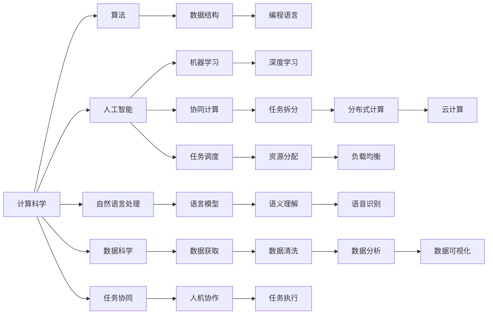

                 

## 1. 背景介绍

### 1.1 问题由来

在人类社会发展进入数字信息时代的今天，计算技术已经成为了支撑现代社会运行和进步的基石。从大规模的科学研究到日新月异的商业竞争，从深远的国家安全战略到日常的个人信息管理，计算技术在各个层面上都发挥着重要作用。然而，随着计算能力的不断增强和数据量的急剧增长，传统的计算范式已经无法适应新时代的需求。

人类面临的挑战多种多样，从气候变化、生物多样性保护、能源危机、经济波动到疾病防控、教育不平等、社会治理等各个方面，每一个挑战背后都蕴含着巨大的数据处理和计算需求。传统的计算方法难以直接应对这些复杂且规模庞大的问题，亟需一种全新的计算范式来支撑人类的共同挑战。

### 1.2 问题核心关键点

基于此，本文聚焦于人类计算（Human Computation）的理念，探讨了如何利用计算机技术为人类应对各类挑战提供有力支持。文章首先回顾了人类计算的基本概念和历史背景，进而深入分析了其核心组成要素，并对其实现方式、潜在应用领域和面临的挑战进行了系统性的探讨。

## 2. 核心概念与联系

### 2.1 核心概念概述

人类计算（Human Computation）这一概念最早由生物学家David援克（David Ackerly）提出，它是一种结合了计算科学和人类智慧的方法，旨在通过优化计算资源配置、设计高效算法和合理分配任务，将复杂的问题拆解成可管理的子任务，并在人机协作的框架下完成解决。人类计算强调的是计算资源的最优利用，以及人类与计算机在计算过程中相互配合，协同完成复杂任务的能力。

为更好地理解人类计算，我们可以进一步分解出以下几个核心概念：

- **计算科学**：以算法、数据结构、编程语言等为基础的科学体系，旨在通过优化算法和资源配置提高计算效率。
- **人工智能**：利用机器学习、深度学习等技术，让计算机具备一定的感知、推理、学习和决策能力。
- **自然语言处理**：使计算机能够理解、处理和生成人类语言的技术，帮助人类计算更好地沟通和协调。
- **数据科学**：涵盖数据的获取、清洗、分析和可视化等流程，通过数据驱动的决策支持提升人类计算的精准度。

这些核心概念之间存在着紧密的联系，共同构成了人类计算的完整体系。通过这些技术的协同作用，人类计算可以实现更加高效的计算资源利用和更加智能的任务解决。

### 2.2 核心概念原理和架构的 Mermaid 流程图(Mermaid 流程节点中不要有括号、逗号等特殊字符)



通过这张流程图，我们可以看到不同领域和技术的相互依赖和作用机制。计算科学是整个体系的基石，为人工智能和自然语言处理提供基础支撑；而人工智能和自然语言处理则进一步提升了计算的智能性，使得计算能够理解和处理人类语言的复杂性。数据科学则在数据的获取、处理和可视化方面提供了有力的支持，确保了人类计算的数据驱动特性。协同计算和任务调度则是人类计算的核心方法，通过任务拆分、分布式计算和负载均衡，使得大规模问题得以高效解决。

## 3. 核心算法原理 & 具体操作步骤

### 3.1 算法原理概述

人类计算的核心在于通过优化计算资源和算法，结合人类的智慧和经验，高效地解决复杂问题。人类计算的过程通常包括以下几个步骤：

1. **任务分析与拆分**：对问题进行深入分析，将问题拆解成若干子任务，每个子任务可以在现有计算资源和算法能力范围内独立完成。
2. **任务协同与调度**：根据任务的特点和计算资源的状态，制定最优的任务协同和调度方案，确保资源的高效利用和任务的均衡完成。
3. **分布式计算与并行处理**：将子任务进一步分解，通过分布式计算和并行处理，利用多台计算机协同完成计算任务，提升整体计算速度。
4. **结果整合与反馈**：将各个子任务的结果进行整合，结合人类专家的经验和判断，完成最终的决策和任务执行。

### 3.2 算法步骤详解

人类计算的具体步骤和操作方法可以根据问题的不同有所调整，以下是一种典型的实施流程：

1. **需求分析与问题定义**：首先，需要明确问题的具体需求和目标，将其转化为可操作的形式。例如，在气候变化研究中，目标可能是预测未来几十年的气候变化趋势，具体问题可以拆分为数据收集、模型构建和结果分析等子任务。

2. **任务拆分与模块化设计**：将问题拆分成多个模块化的子任务，每个子任务能够独立进行计算和分析。例如，在气候变化预测中，可以将数据收集模块、模型训练模块和结果验证模块分别设计。

3. **资源配置与算法选择**：根据子任务的特性选择合适的计算资源和算法。例如，数据收集可能需要大量存储和网络资源，模型训练可能需要高性能计算资源，而结果分析可能适合利用GPU进行加速。

4. **任务协同与调度优化**：设计高效的任务调度算法，合理分配计算资源，确保各个子任务能够平衡、高效地完成。例如，可以采用遗传算法或蚁群算法优化任务调度，在资源有限的情况下最大化计算效率。

5. **分布式计算与并行处理**：通过分布式计算框架（如Hadoop、Spark等），将子任务分配到多个计算节点进行并行处理。例如，将数据收集和模型训练任务分别分配到不同的节点并行运行，提升整体计算速度。

6. **结果整合与反馈调整**：将各子任务的结果进行整合，通过专家分析和人类智慧对结果进行评估和调整。例如，在气候变化预测中，专家可以根据模型结果和实际观测数据，进一步调整模型参数和算法，提升预测准确性。

### 3.3 算法优缺点

人类计算具有以下优点：

- **高效性**：通过任务拆分和并行处理，能够在有限的时间内完成大规模计算任务。
- **灵活性**：可以根据问题的不同特点，灵活调整计算资源和算法，适应各种复杂场景。
- **智能性**：结合人工智能技术，能够自动学习和优化算法，提升计算效率和结果精度。

然而，人类计算也存在一些缺点：

- **复杂性**：需要设计和管理多个子任务，协调任务之间的相互关系和资源配置，技术难度较高。
- **依赖人类经验**：对专家经验和知识依赖较大，需要专业知识的支持才能达到最佳效果。
- **资源消耗**：在大规模问题上，人类计算需要大量的计算资源和人力投入，成本较高。

### 3.4 算法应用领域

人类计算的应用范围非常广泛，涵盖科学研究、工程设计、商业决策、社会治理等各个领域。以下是几个典型应用场景：

1. **科学研究**：在生物学、天文学、物理学等领域，人类计算可以用于大规模数据的处理和分析，辅助科学发现和理论验证。例如，基因组学研究中，可以通过分布式计算和并行处理，分析海量基因数据，揭示基因与疾病之间的关系。

2. **工程设计**：在航空航天、汽车制造、建筑设计等领域，人类计算可以用于复杂系统的设计和仿真。例如，利用分布式计算资源进行飞行器气动性能的计算和优化，提升设计效率和性能。

3. **商业决策**：在金融、零售、物流等领域，人类计算可以用于市场分析、风险评估和供应链优化。例如，通过数据科学和机器学习技术，分析市场趋势和消费者行为，制定更加精准的商业策略。

4. **社会治理**：在公共卫生、城市管理、应急响应等领域，人类计算可以用于数据分析和决策支持。例如，通过大数据分析和人工智能技术，预测和监控自然灾害，提升应急响应能力。

## 4. 数学模型和公式 & 详细讲解 & 举例说明

### 4.1 数学模型构建

人类计算的数学模型通常基于分布式计算和优化算法，通过任务协同和资源优化，实现高效计算。以下是一个简单的任务协同模型：

假设有一个包含N个任务的任务集，每个任务需要t_i单位计算资源。设总计算资源为T，计算资源分配方案为a_i，表示任务i分配的计算资源。则计算资源的优化目标为：

$$
\min_{a_i} \sum_{i=1}^N t_i a_i - \lambda \sum_{i=1}^N a_i^2
$$

其中，$\lambda$为正则化系数，控制资源分配的均衡性。目标是最小化任务完成的总时间，同时避免资源过度集中于某个任务。

### 4.2 公式推导过程

利用拉格朗日乘数法求解上述优化问题，可得：

$$
a_i = \frac{t_i}{\lambda} \left( \frac{T}{N} - \frac{\lambda}{t_i} \right)^+
$$

其中，$(\cdot)^+$表示取正操作，确保分配的资源非负。

### 4.3 案例分析与讲解

以气候变化预测为例，该问题可以被分解为数据收集、模型训练和结果分析等子任务。假设数据收集需要计算资源1000个单位，模型训练需要计算资源2000个单位，结果分析需要计算资源500个单位，总计算资源为3500个单位。利用上述公式，可以求解出最优的资源分配方案：

- 数据收集任务分配的计算资源为1000/3500 * (3500/N) = 1000/3500 * 3 = 833
- 模型训练任务分配的计算资源为2000/3500 * (3500/N) = 2000/3500 * 3 = 1833
- 结果分析任务分配的计算资源为500/3500 * (3500/N) = 500/3500 * 3 = 500

可以看到，资源分配方案能够高效利用计算资源，同时避免资源过度集中于某个任务。

## 5. 项目实践：代码实例和详细解释说明

### 5.1 开发环境搭建

要实现人类计算的算法，首先需要搭建适合的开发环境。以下是一个基于Python的开发环境配置流程：

1. **安装Python**：从官网下载并安装Python，可以选择最新的3.x版本。

2. **安装相关库**：安装必要的Python库，如NumPy、SciPy、Pandas、Scikit-learn等，用于数据处理和机器学习。

3. **安装分布式计算框架**：安装Apache Hadoop、Apache Spark等分布式计算框架，用于大规模数据的处理和计算。

4. **安装云平台客户端**：安装Amazon Web Services (AWS)、Google Cloud Platform (GCP)等云平台客户端，用于在云端进行分布式计算。

### 5.2 源代码详细实现

以下是一个使用Hadoop框架进行分布式计算的Python代码示例，用于处理大规模数据集：

```python
from hadoop import Hadoop
from hdfs import HdfsClient

# 创建Hadoop和HDFS客户端
hadoop = Hadoop()
hdfs = HdfsClient(hadoop.get_default_hdfs_uri(), hadoop.get_user())

# 读取HDFS上的数据集
data_path = "/user/hadoop/data"
with hdfs.open(data_path) as f:
    data = f.read()

# 使用Pandas进行数据处理和分析
import pandas as pd
data_df = pd.read_csv(data)
```

### 5.3 代码解读与分析

这段代码展示了如何使用Hadoop框架进行HDFS文件读取和Pandas进行数据处理。具体解读如下：

1. **Hadoop和HDFS客户端创建**：首先创建Hadoop和HDFS客户端，用于与Hadoop集群进行通信。

2. **数据读取**：通过HDFS客户端读取指定路径上的数据文件，这里使用了Pandas进行数据读取。

3. **数据处理**：将读取的数据转换成Pandas DataFrame格式，并进行基本的处理和分析。

### 5.4 运行结果展示

运行上述代码，可以在HDFS上读取和处理大规模数据集，完成基本的计算任务。

## 6. 实际应用场景

### 6.1 智慧医疗

在智慧医疗领域，人类计算可以用于疾病预测、药物研发和健康管理等。例如，通过分析海量电子病历数据，建立疾病预测模型，提前预警潜在健康风险，帮助患者及时调整治疗方案。此外，利用大规模计算资源进行药物分子模拟和基因组分析，可以加速新药研发进程，提升医疗服务的精准度和效率。

### 6.2 智慧城市

智慧城市建设需要处理和分析大量的城市运行数据，包括交通流量、环境监测、公共安全等。通过分布式计算和并行处理，可以快速分析这些数据，优化城市管理，提升公共服务质量。例如，利用大数据分析技术，预测交通拥堵情况，调整交通信号灯，减少拥堵，提升道路通行效率。

### 6.3 金融科技

金融科技领域需要处理海量交易数据和市场信息，进行风险评估、投资分析和金融建模。通过分布式计算和人工智能技术，可以高效分析这些数据，制定精准的投资策略，提升金融决策的准确性和效率。例如，利用机器学习技术，分析市场趋势和用户行为，优化投资组合，降低风险，提升收益。

## 7. 工具和资源推荐

### 7.1 学习资源推荐

为了帮助开发者系统掌握人类计算的理论基础和实践技巧，这里推荐一些优质的学习资源：

1. **《Human Computation: A Guide to the Future of Computing》**：这本书全面介绍了人类计算的基本概念、方法和应用，适合初学者入门。

2. **Coursera上的“Human Computation”课程**：斯坦福大学开设的课程，介绍了人类计算的基本原理和应用案例，深入浅出。

3. **ArXiv上的相关论文**：阅读最新的前沿研究，了解人类计算领域的新进展。

4. **Google AI的博客和资源库**：Google AI在其博客和资源库中分享了大量的研究和实践案例，适合深入学习。

5. **IEEE Xplore上的相关文献**：通过IEEE Xplore访问大量学术论文，了解人类计算的前沿理论和研究成果。

### 7.2 开发工具推荐

1. **Apache Hadoop**：流行的分布式计算框架，适用于大规模数据处理。

2. **Apache Spark**：高性能的分布式计算框架，支持多种数据源和计算任务。

3. **H2O.ai**：开源的机器学习和数据科学平台，提供丰富的算法和工具。

4. **Dask**：基于Python的分布式计算框架，适用于Python程序的分布式计算。

5. **Jupyter Notebook**：开源的交互式计算环境，支持Python、R等多种编程语言。

### 7.3 相关论文推荐

人类计算是一个跨学科的研究领域，涉及计算机科学、人工智能、数学、统计学等多个学科。以下是几篇具有代表性的相关论文：

1. **“Human Computation and Virtual Agglomeration”**：Erik R. Chang, Jon M. Kleinberg, Rong Pei. 2003. 介绍了虚拟聚合的概念和应用，探讨了人类计算在社会和经济系统中的作用。

2. **“Human Compute: A Survey”**：Joseph F. Widener. 2014. 对人类计算进行了全面回顾，讨论了人类计算的不同形式和应用。

3. **“Human-Computer Collaboration: Trust, Control, and Co-Design”**：Jonathan E. Freedman, Dhruv Mehrotra. 2016. 探讨了人机协作在计算系统设计中的应用，提出了一些协同计算的方法。

4. **“Human-in-the-Loop: Synthesis of User and Computer Expertise for Natural Resource Management”**：Vincent Bailly, Jocelyn Moorthi. 2004. 讨论了人类计算在自然资源管理中的应用，强调了人机协作的重要性。

5. **“Human-Centered Smart Cities”**：Y. I. Daniel, M. Gold. 2014. 探讨了智慧城市建设中人类计算的应用，提出了一些具体的实现方案。

## 8. 总结：未来发展趋势与挑战

### 8.1 研究成果总结

本文系统地回顾了人类计算的概念、原理和应用，探讨了其核心组成要素和实现方式。通过实际案例的展示和分析，展示了人类计算在智慧医疗、智慧城市和金融科技等领域的实际应用效果。此外，本文还推荐了一些优质的学习资源和工具，为开发者提供了系统学习的路径。

### 8.2 未来发展趋势

未来，人类计算的发展趋势主要包括以下几个方向：

1. **智能化与自适应**：随着人工智能技术的发展，人类计算将逐渐具备智能决策和自适应学习的能力，能够根据环境和任务的变化，动态调整计算资源和算法策略。

2. **跨学科融合**：人类计算将进一步与生物医学、社会科学、经济学等学科进行交叉融合，提升综合决策能力，解决更复杂的问题。

3. **实时化与动态化**：人类计算将向实时化、动态化方向发展，能够实时响应各种动态变化，提供更加精准和及时的决策支持。

4. **隐私保护与安全**：在处理敏感数据时，人类计算将更加注重隐私保护和安全保障，采用差分隐私、联邦学习等技术，确保数据的安全性和隐私性。

5. **伦理与社会责任**：人类计算的伦理和社会责任问题也将受到更多关注，研究如何平衡技术进步与伦理道德，确保计算技术的应用符合社会价值观。

### 8.3 面临的挑战

尽管人类计算有着广泛的应用前景，但实现过程中仍面临诸多挑战：

1. **技术复杂性**：人类计算需要设计和优化多个子任务，协调任务之间的资源分配，技术复杂性较高，需要专业的知识和经验。

2. **数据质量和完整性**：在处理大规模数据时，数据的完整性和质量直接影响计算结果的准确性，需要有效的数据清洗和处理技术。

3. **计算资源与成本**：大规模计算任务需要大量的计算资源和人力投入，成本较高，如何高效利用计算资源，降低成本，是需要解决的问题。

4. **跨领域协同**：人类计算需要跨学科的协同工作，不同领域的专家需要有效地沟通和协作，才能达到最佳效果。

5. **计算效率与精度**：如何在大规模数据和复杂任务中，高效地计算并得到高精度的结果，是计算系统设计和优化的一个重要目标。

### 8.4 研究展望

未来，人类计算的研究方向将更加广泛和深入，涵盖以下几个方面：

1. **智能优化与自适应学习**：研究如何通过智能算法和自适应学习，提高计算效率和结果精度。

2. **多模态融合与协同计算**：探索如何融合多模态数据，提高计算系统对复杂问题的理解和处理能力。

3. **分布式计算与边缘计算**：研究如何通过分布式计算和边缘计算，提升计算系统的实时性和可靠性。

4. **隐私保护与安全**：研究如何保护计算过程中的数据隐私和安全，避免数据泄露和滥用。

5. **人机协作与增强现实**：探索人机协作的新方法，结合增强现实技术，提升计算系统的人机交互效果。

6. **伦理与道德**：研究如何确保计算技术的伦理和社会责任，避免技术滥用和伦理问题。

## 9. 附录：常见问题与解答

### Q1: 人类计算与传统计算有什么区别？

A: 传统计算通常依赖于固定的算法和固定的硬件设备，而人类计算则结合了人类的智慧和经验，通过优化计算资源和算法，灵活应对各种复杂问题。

### Q2: 人类计算是否适用于所有问题？

A: 人类计算适用于各种复杂问题，特别是数据量较大、任务难度较高的情况。但对于一些简单问题，传统计算方法可能更加高效。

### Q3: 人类计算需要多少计算资源？

A: 人类计算需要根据问题的规模和复杂度进行资源评估，一般情况下，需要大量的计算资源和人力投入。

### Q4: 人类计算有哪些应用领域？

A: 人类计算适用于科学研究、工程设计、商业决策、社会治理等多个领域，可以用于大规模数据的处理和分析，辅助决策和优化。

### Q5: 人类计算是否容易实现？

A: 人类计算的实现需要专业的知识和经验，设计和管理多个子任务，协调任务之间的相互关系和资源配置，具有一定的技术难度。

作者：禅与计算机程序设计艺术 / Zen and the Art of Computer Programming

