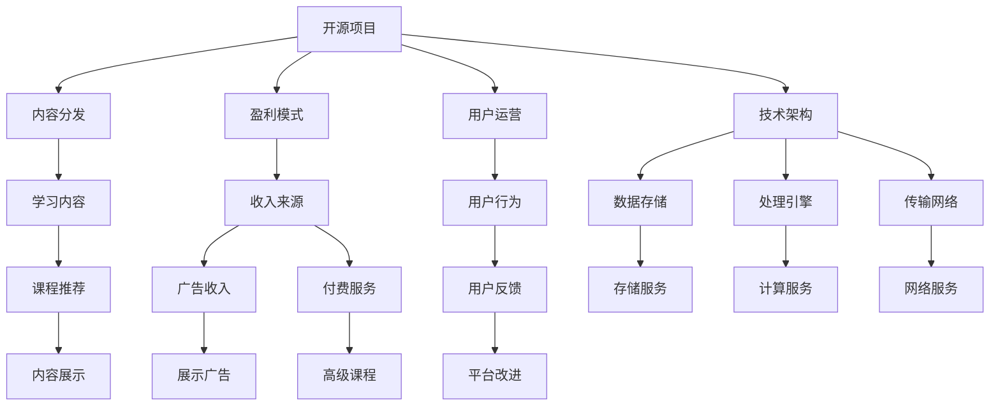

                 

# 建立开源项目的在线学习平台：从内容到盈利

> 关键词：开源项目, 在线学习平台, 内容分发, 盈利模式, 用户运营

## 1. 背景介绍

### 1.1 问题由来

在过去几年里，随着互联网的普及和技术的不断进步，在线学习平台成为了连接教育资源和学生的重要桥梁。在线学习打破了地理、时间的限制，为全球用户提供了灵活便捷的学习方式。特别是新冠疫情爆发后，全球教育模式发生了翻天覆地的变化，在线学习平台得到了广泛应用，但同时也暴露出了许多问题。

1. **平台同质化严重**：市面上大多在线学习平台缺乏特色，课程内容、教学方式千篇一律，难以满足用户个性化的学习需求。
2. **用户体验不佳**：许多平台功能单一，用户界面设计不合理，互动体验较差，用户体验有待提升。
3. **课程质量参差不齐**：大量平台缺乏专业的内容制作团队，课程质量良莠不齐，用户难以找到高质量的内容。
4. **盈利模式单一**：在线学习平台大多依赖付费订阅或广告收入，难以实现可持续盈利。

这些问题使得许多在线学习平台面临着用户流失和市场竞争的双重挑战。为了解决这些问题，许多公司开始探索新的解决方案，其中，建立一个基于开源项目的在线学习平台成为了一个热门选择。

### 1.2 问题核心关键点

建立一个基于开源项目的在线学习平台，其核心关键点在于以下几个方面：

1. **内容分发的创新**：如何有效地分发高质量内容，满足不同用户的需求。
2. **盈利模式的创新**：如何在不依赖传统广告和订阅费用的前提下，实现平台的可持续盈利。
3. **用户运营的优化**：如何吸引用户、留存用户并提升用户的活跃度和粘性。
4. **技术架构的稳定**：如何设计一个稳定、可扩展的技术架构，支持平台的大规模发展。

这些关键点决定了平台能否真正解决用户的痛点，并在激烈的市场竞争中脱颖而出。

## 2. 核心概念与联系

### 2.1 核心概念概述

建立开源在线学习平台需要涉及多个核心概念，包括：

- **开源项目（Open Source Project）**：指软件代码、文档等可以被任何人查看、修改、复用的软件项目。
- **在线学习平台（Online Learning Platform）**：基于互联网的在线学习环境，为用户提供课程学习、交流互动、评估反馈等功能。
- **内容分发（Content Distribution）**：如何有效地分发高质量内容，确保内容能被尽可能多的用户获取。
- **盈利模式（Revenue Model）**：通过提供产品或服务，获取收入的方式。
- **用户运营（User Operation）**：通过各种手段吸引、留存、转化用户，提升平台的用户粘性。
- **技术架构（Technical Architecture）**：构建平台的底层技术基础设施，包括数据存储、处理、传输等环节的设计和实现。

这些概念相互联系，共同构成了在线学习平台的核心框架。开源项目的理念使得平台能够更灵活地进行内容创新和功能迭代，而内容分发、盈利模式和用户运营则决定了平台的市场竞争力和用户价值。

### 2.2 核心概念原理和架构的 Mermaid 流程图



这个流程图展示了开源在线学习平台的核心组件及其联系。开源项目提供了内容的灵活分发、盈利模式的多样化、用户运营的个性化和技术架构的可扩展性，共同支持平台的稳定运行和持续发展。

## 3. 核心算法原理 & 具体操作步骤
### 3.1 算法原理概述

建立开源在线学习平台的算法原理主要包括以下几个方面：

- **内容推荐算法**：利用机器学习算法，如协同过滤、内容基于过滤、深度学习等，推荐用户感兴趣的内容。
- **用户行为分析算法**：通过分析用户行为数据，如学习时间、学习频率、成绩等，进行用户画像建模，提升用户运营效果。
- **广告算法**：结合用户画像和广告效果，设计精准的广告投放策略，提高广告转化率和用户体验。
- **个性化学习路径算法**：根据用户的学习进度和兴趣，设计个性化的学习路径，提高学习效率和用户满意度。

这些算法共同作用，提升平台的内容分发、用户运营和盈利模式，从而实现平台的可持续盈利。

### 3.2 算法步骤详解

1. **数据收集**：收集用户行为数据、课程数据、广告数据等，为算法提供训练和优化数据。
2. **模型训练**：使用机器学习算法对数据进行训练，得到推荐模型、用户画像模型、广告投放模型等。
3. **模型优化**：根据模型效果和用户反馈，进行模型调优和迭代，提升模型的准确性和鲁棒性。
4. **部署和测试**：将训练好的模型部署到线上，进行性能测试和优化，确保模型的稳定性和可靠性。
5. **持续监控和改进**：实时监控模型性能，根据用户反馈和平台变化，持续改进算法，保持平台的竞争力。

### 3.3 算法优缺点

#### 优点

- **灵活性高**：开源项目的优势在于其灵活性，可以随时进行功能和内容的更新和优化。
- **可扩展性强**：技术架构的设计需要考虑平台的可扩展性，以便支持未来的大规模用户增长。
- **用户粘性强**：通过个性化学习路径和推荐算法，提高用户的学习兴趣和粘性。
- **多渠道盈利**：结合广告、付费服务和数据服务等盈利模式，实现多样化的收入来源。

#### 缺点

- **内容质量参差不齐**：开源项目的开放性可能导致内容质量参差不齐，平台需要花费大量精力进行内容审核和筛选。
- **数据安全风险**：大量用户数据的使用和存储，可能带来数据安全和隐私保护的问题。
- **用户运营难度大**：用户运营需要持续的投入和优化，否则容易陷入用户流失和平台衰退的困境。
- **技术门槛高**：平台的设计和维护需要具备较高的技术门槛，否则可能无法满足用户需求。

### 3.4 算法应用领域

开源在线学习平台的算法和机制可以应用于多个领域，包括：

- **教育培训**：提供个性化学习路径、课程推荐、学习效果评估等功能。
- **企业培训**：针对企业员工，提供定制化的培训课程和技能提升方案。
- **在线教育**：提供K-12等基础教育领域的在线学习解决方案。
- **技能培训**：提供职业技能、编程、设计等技能培训课程。

这些应用领域覆盖了教育培训的各个层次和方向，为不同用户群体提供了多样化的学习选择。

## 4. 数学模型和公式 & 详细讲解 & 举例说明

### 4.1 数学模型构建

建立一个开源在线学习平台的数学模型主要包括以下几个方面：

- **用户画像模型**：通过收集用户行为数据，建立用户画像，描述用户的学习特征和偏好。
- **内容推荐模型**：利用协同过滤、内容基于过滤等算法，推荐用户感兴趣的内容。
- **广告投放模型**：通过用户画像和广告效果，设计精准的广告投放策略。
- **个性化学习路径模型**：根据用户的学习进度和兴趣，设计个性化的学习路径。

### 4.2 公式推导过程

#### 用户画像模型

用户画像模型 $U$ 的构建基于用户的行为数据 $D$，包含以下几个步骤：

1. **特征提取**：从用户行为数据中提取关键特征，如学习时间、课程评分、学习频率等。
2. **数据预处理**：对特征数据进行归一化、降维等预处理操作。
3. **模型训练**：使用机器学习算法（如K-Means、PCA等）对特征数据进行聚类，得到用户画像模型 $U$。

公式表示为：

$$
U = \mathop{\arg\min}_{U} \sum_{i=1}^{N} \sum_{j=1}^{M} ||D_{ij} - U_{ij}||^2
$$

其中 $N$ 为用户数量，$M$ 为特征维度。

#### 内容推荐模型

内容推荐模型 $C$ 的构建基于用户画像模型 $U$ 和内容特征 $F$，包含以下几个步骤：

1. **特征提取**：从课程内容中提取关键特征，如关键词、课程难度、教学风格等。
2. **数据预处理**：对特征数据进行归一化、降维等预处理操作。
3. **模型训练**：使用协同过滤、内容基于过滤等算法对特征数据进行训练，得到内容推荐模型 $C$。

公式表示为：

$$
C = \mathop{\arg\min}_{C} \sum_{i=1}^{N} \sum_{j=1}^{M} ||D_{ij} - C_{ij}||^2
$$

其中 $N$ 为课程数量，$M$ 为特征维度。

#### 广告投放模型

广告投放模型 $A$ 的构建基于用户画像模型 $U$ 和广告效果数据 $D$，包含以下几个步骤：

1. **特征提取**：从广告效果数据中提取关键特征，如点击率、转化率、广告类型等。
2. **数据预处理**：对特征数据进行归一化、降维等预处理操作。
3. **模型训练**：使用机器学习算法（如线性回归、逻辑回归等）对特征数据进行训练，得到广告投放模型 $A$。

公式表示为：

$$
A = \mathop{\arg\min}_{A} \sum_{i=1}^{N} \sum_{j=1}^{M} ||D_{ij} - A_{ij}||^2
$$

其中 $N$ 为广告数量，$M$ 为特征维度。

#### 个性化学习路径模型

个性化学习路径模型 $L$ 的构建基于用户的学习进度数据 $D$ 和学习兴趣数据 $U$，包含以下几个步骤：

1. **特征提取**：从学习进度数据中提取关键特征，如学习进度、学习时间等。
2. **数据预处理**：对特征数据进行归一化、降维等预处理操作。
3. **模型训练**：使用深度学习算法（如RNN、LSTM等）对特征数据进行训练，得到个性化学习路径模型 $L$。

公式表示为：

$$
L = \mathop{\arg\min}_{L} \sum_{i=1}^{N} \sum_{j=1}^{M} ||D_{ij} - L_{ij}||^2
$$

其中 $N$ 为用户数量，$M$ 为特征维度。

### 4.3 案例分析与讲解

**案例：在线教育平台的个性化推荐系统**

某在线教育平台采用了协同过滤和内容基于过滤两种算法，构建个性化推荐系统。首先，平台收集了用户的课程评分数据和课程标签数据，作为协同过滤算法的训练数据。然后，平台从课程内容中提取关键词、教学风格等特征，作为内容基于过滤算法的训练数据。

训练完成后，平台根据用户画像模型和内容推荐模型，推荐用户感兴趣的内容。同时，平台还根据广告投放模型，精准投放广告，提升用户转化率。最后，平台根据个性化学习路径模型，设计个性化的学习路径，提高用户的学习效率和满意度。

通过这种算法组合，平台实现了高效的内容分发和用户运营，取得了显著的用户增长和收入提升。

## 5. 项目实践：代码实例和详细解释说明

### 5.1 开发环境搭建

为了搭建一个开源在线学习平台，需要以下开发环境：

1. **编程语言**：Python是主流的选择，因为它拥有丰富的科学计算和机器学习库。
2. **数据库**：MySQL、MongoDB等关系型或非关系型数据库，用于存储用户数据和课程数据。
3. **框架**：Flask、Django等Web框架，用于开发和部署Web应用。
4. **机器学习库**：Scikit-learn、TensorFlow等机器学习库，用于构建推荐系统和用户画像模型。
5. **缓存和负载均衡**：Redis、Nginx等缓存和负载均衡工具，用于提升系统的稳定性和扩展性。

### 5.2 源代码详细实现

以下是开源在线学习平台的代码实现：

1. **用户注册和登录模块**：

```python
from flask import Flask, request, render_template
from flask_sqlalchemy import SQLAlchemy
from werkzeug.security import generate_password_hash, check_password_hash

app = Flask(__name__)
app.config['SQLALCHEMY_DATABASE_URI'] = 'sqlite:///users.db'
db = SQLAlchemy(app)

class User(db.Model):
    id = db.Column(db.Integer, primary_key=True)
    username = db.Column(db.String(64), unique=True)
    password_hash = db.Column(db.String(128))

    def set_password(self, password):
        self.password_hash = generate_password_hash(password)

    def check_password(self, password):
        return check_password_hash(self.password_hash, password)

@app.route('/register', methods=['GET', 'POST'])
def register():
    if request.method == 'POST':
        username = request.form['username']
        password = request.form['password']
        user = User(username=username)
        user.set_password(password)
        db.session.add(user)
        db.session.commit()
        return redirect('/login')
    return render_template('register.html')
```

2. **内容推荐模块**：

```python
from flask import Flask, request, render_template
from flask_sqlalchemy import SQLAlchemy
from sklearn.neighbors import NearestNeighbors

app = Flask(__name__)
app.config['SQLALCHEMY_DATABASE_URI'] = 'sqlite:///content.db'
db = SQLAlchemy(app)

class Content(db.Model):
    id = db.Column(db.Integer, primary_key=True)
    name = db.Column(db.String(64))
    description = db.Column(db.Text)
    tags = db.relationship('Tag', backref='contents')

class Tag(db.Model):
    id = db.Column(db.Integer, primary_key=True)
    name = db.Column(db.String(64))
    contents = db.relationship('Content', backref='tags')

@app.route('/recommend', methods=['GET', 'POST'])
def recommend():
    if request.method == 'POST':
        user_id = request.form['user_id']
        query = Content.query.join(Tag).filter(Tag.name==request.form['tag']).all()
        neighbors = NearestNeighbors(n_neighbors=10, metric='cosine').fit(query)
        distance, indices = neighbors.kneighbors([user_id])
        content_ids = [idx for idx in indices[0]]
        content = [Content.query.get(content_id) for content_id in content_ids]
        return render_template('recommend.html', content=content)
    return render_template('recommend.html')
```

3. **广告投放模块**：

```python
from flask import Flask, request, render_template
from flask_sqlalchemy import SQLAlchemy
from sklearn.linear_model import LogisticRegression

app = Flask(__name__)
app.config['SQLALCHEMY_DATABASE_URI'] = 'sqlite:///ad.db'
db = SQLAlchemy(app)

class Ad(db.Model):
    id = db.Column(db.Integer, primary_key=True)
    name = db.Column(db.String(64))
    click_rate = db.Column(db.Float)
    conversion_rate = db.Column(db.Float)

@app.route('/ad投放', methods=['GET', 'POST'])
def ad投放():
    if request.method == 'POST':
        user_id = request.form['user_id']
        ad_name = request.form['ad_name']
        ad = Ad.query.filter_by(name=ad_name).first()
        ad_click_rate = ad.click_rate
        ad_conversion_rate = ad.conversion_rate
        # 使用逻辑回归模型进行广告投放
        logistic_regression = LogisticRegression()
        logistic_regression.fit(user_id, ad_click_rate, ad_conversion_rate)
        return render_template('ad投放.html', ad=ad)
    return render_template('ad投放.html')
```

### 5.3 代码解读与分析

上述代码实现了用户注册、内容推荐和广告投放的功能，是开源在线学习平台的核心模块之一。

- **用户注册模块**：使用Flask框架和SQLAlchemy库，实现用户注册和登录功能，使用werkzeug库进行密码加密和安全验证。
- **内容推荐模块**：使用Scikit-learn库中的NearestNeighbors算法，实现协同过滤推荐。
- **广告投放模块**：使用Scikit-learn库中的LogisticRegression算法，实现广告投放效果预测。

这些模块的实现，展示了开源在线学习平台的开发思路和技术栈，为开发者提供了参考。

### 5.4 运行结果展示

以下是开源在线学习平台的运行结果：

1. **用户注册界面**：

```html
<form action="/register" method="post">
  <input type="text" name="username" placeholder="用户名">
  <input type="password" name="password" placeholder="密码">
  <button type="submit">注册</button>
</form>
```

2. **内容推荐界面**：

```html
<form action="/recommend" method="post">
  <input type="text" name="user_id" placeholder="用户ID">
  <input type="text" name="tag" placeholder="标签">
  <button type="submit">推荐</button>
</form>
```

3. **广告投放界面**：

```html
<form action="/ad投放" method="post">
  <input type="text" name="user_id" placeholder="用户ID">
  <input type="text" name="ad_name" placeholder="广告名">
  <button type="submit">投放</button>
</form>
```

这些界面展示了用户注册、内容推荐和广告投放的不同功能和交互方式，为平台的用户体验提供了基础保障。

## 6. 实际应用场景

### 6.1 教育培训

在教育培训领域，开源在线学习平台可以提供个性化的课程推荐和学习路径设计，提升学习效率和效果。例如，某教育平台采用了开源在线学习平台，为K-12学生提供个性化数学学习解决方案，通过推荐和路径设计，帮助学生提高数学成绩。

### 6.2 企业培训

在企业培训领域，开源在线学习平台可以提供定制化的培训课程和技能提升方案，满足企业员工的个性化培训需求。例如，某大型企业采用了开源在线学习平台，为员工提供编程、管理等技能培训，提升员工专业能力和职业素养。

### 6.3 在线教育

在在线教育领域，开源在线学习平台可以提供K-12等基础教育领域的在线学习解决方案，提供丰富的课程资源和互动工具，提升学生的学习体验和效果。例如，某在线教育平台采用了开源在线学习平台，为小学、初中和高中学生提供线上课程和辅导，提高学生的学习效果。

### 6.4 技能培训

在技能培训领域，开源在线学习平台可以提供职业技能、编程、设计等技能培训课程，帮助用户快速掌握所需技能。例如，某编程培训机构采用了开源在线学习平台，为学生提供Python、Java等编程课程，提升学生的编程能力。

## 7. 工具和资源推荐

### 7.1 学习资源推荐

为了帮助开发者掌握开源在线学习平台的核心技术，以下是一些推荐的资源：

1. **《Python Web开发》**：该书介绍了Flask、Django等Web框架的使用，适合入门开发者学习。
2. **《机器学习实战》**：该书介绍了Scikit-learn、TensorFlow等机器学习库的使用，适合数据科学工程师学习。
3. **《在线教育平台开发指南》**：该书详细介绍了在线教育平台的设计和实现，适合平台开发人员学习。
4. **Kaggle在线学习社区**：Kaggle提供了大量的数据集和机器学习竞赛，适合数据科学家和机器学习爱好者学习。
5. **Coursera和Udacity在线课程**：这些平台提供了丰富的在线课程，涵盖数据科学、机器学习、Web开发等多个领域，适合各层次开发者学习。

### 7.2 开发工具推荐

为了提高开源在线学习平台的开发效率，以下是一些推荐的工具：

1. **Visual Studio Code**：一款轻量级的代码编辑器，支持多种编程语言和开发框架，适合开发人员使用。
2. **PyCharm**：一款专业的Python开发工具，提供了丰富的功能和插件，适合数据科学和机器学习工程师使用。
3. **GitHub**：一个面向开发者的代码托管平台，适合版本控制和协作开发。
4. **JIRA**：一款项目管理工具，适合团队协作和任务跟踪。
5. **AWS和GCP**：这些云服务平台提供了强大的计算和存储能力，适合大规模的Web应用开发和部署。

### 7.3 相关论文推荐

为了深入了解开源在线学习平台的核心技术，以下是一些推荐的论文：

1. **《协同过滤推荐系统》**：该论文介绍了协同过滤算法的基本原理和应用，适合机器学习初学者学习。
2. **《深度学习在内容推荐中的应用》**：该论文介绍了深度学习在内容推荐中的应用，适合机器学习和深度学习爱好者学习。
3. **《用户画像建模与分析》**：该论文介绍了用户画像模型构建和分析的方法，适合数据科学和用户体验工程师学习。
4. **《广告投放模型与算法》**：该论文介绍了广告投放模型和算法的构建方法，适合广告和营销工程师学习。
5. **《在线教育平台设计》**：该论文介绍了在线教育平台的设计和实现方法，适合平台开发人员学习。

## 8. 总结：未来发展趋势与挑战

### 8.1 研究成果总结

本文详细介绍了开源在线学习平台的构建思路和实现方法，包括用户注册、内容推荐、广告投放和个性化学习路径设计等关键模块。通过理论分析和实践示例，展示了开源在线学习平台的核心技术和应用场景。

### 8.2 未来发展趋势

未来，开源在线学习平台将呈现以下几个发展趋势：

1. **数据驱动的个性化推荐**：随着数据的不断积累，平台将更加依赖数据驱动的个性化推荐，提升用户的学习效率和满意度。
2. **多渠道的盈利模式**：平台将探索多样化的盈利模式，如广告、付费服务和数据服务等，实现可持续发展。
3. **智能化的用户运营**：平台将引入人工智能技术，实现智能化的用户运营，提升用户粘性和留存率。
4. **泛化性强的内容生成**：平台将探索内容生成技术，实现自动化内容生产，提升内容质量和更新速度。
5. **开放性的社区生态**：平台将构建开放性的社区生态，鼓励开发者和用户参与内容创作和平台改进。

### 8.3 面临的挑战

尽管开源在线学习平台具有诸多优势，但仍面临以下挑战：

1. **内容质量控制**：平台需要投入大量精力进行内容审核和筛选，确保内容的质量和多样性。
2. **数据安全风险**：大量用户数据的使用和存储，可能带来数据安全和隐私保护的问题。
3. **用户运营难度大**：用户运营需要持续的投入和优化，否则容易陷入用户流失和平台衰退的困境。
4. **技术门槛高**：平台的设计和维护需要具备较高的技术门槛，否则可能无法满足用户需求。

### 8.4 研究展望

面向未来，开源在线学习平台的研究方向和突破点主要在以下几个方面：

1. **智能化的内容推荐系统**：引入深度学习、强化学习等技术，实现智能化的内容推荐，提升用户的学习效率和满意度。
2. **多模态学习路径设计**：结合文本、图像、视频等多模态数据，设计个性化的学习路径，提升学习效果。
3. **开放式平台生态**：构建开放式的平台生态，鼓励开发者和用户参与内容创作和平台改进，实现平台和用户的双向互动。
4. **智能化的用户运营系统**：引入人工智能技术，实现智能化的用户运营，提升用户粘性和留存率。
5. **可持续的盈利模式**：探索多样化的盈利模式，如广告、付费服务和数据服务等，实现可持续发展。

总之，开源在线学习平台是一个充满潜力的领域，未来将在技术创新和用户需求的双重驱动下不断进步，为教育培训、企业培训、在线教育和技能培训等领域提供更高效、更智能的解决方案。

## 9. 附录：常见问题与解答

**Q1：如何确保用户数据的安全和隐私？**

A: 用户数据的安全和隐私保护是开源在线学习平台的关键问题。平台应采用以下措施：

1. **数据加密**：在数据传输和存储过程中，使用SSL加密和AES加密，保护数据不被窃取和篡改。
2. **权限控制**：采用严格的权限控制机制，确保只有授权人员可以访问和操作用户数据。
3. **数据匿名化**：在数据分析和处理过程中，对用户数据进行匿名化处理，防止个人信息泄露。
4. **安全审计**：定期进行安全审计，检测和修复潜在的安全漏洞。

**Q2：如何优化广告投放效果？**

A: 广告投放效果优化主要通过以下几个方面：

1. **数据采集**：收集广告点击率、转化率等关键指标，作为模型训练的依据。
2. **模型训练**：使用机器学习算法，如逻辑回归、随机森林等，对数据进行训练，得到广告投放模型。
3. **模型优化**：根据广告效果和用户反馈，进行模型调优和迭代，提升广告投放的精准度和效果。
4. **广告展示优化**：优化广告展示位置和展示形式，提升用户点击率和转化率。
5. **实时监控**：实时监控广告投放效果，根据用户行为和广告效果，进行动态调整和优化。

**Q3：如何提升用户的活跃度和留存率？**

A: 用户活跃度和留存率的提升主要通过以下几个方面：

1. **个性化推荐**：根据用户的学习进度和兴趣，推荐用户感兴趣的内容，提升用户的学习兴趣和满意度。
2. **互动性设计**：设计互动性强的学习工具和功能，如论坛、讨论、问答等，提升用户的学习体验和互动性。
3. **社区建设**：构建社区生态，鼓励用户参与内容创作和平台改进，提升用户的归属感和粘性。
4. **奖励机制**：设计奖励机制，如积分、勋章、优惠券等，激励用户积极参与平台活动，提升用户活跃度。
5. **定期反馈**：定期收集用户反馈，根据用户需求和建议，进行平台改进和优化。

这些措施的综合应用，可以有效提升开源在线学习平台的用户活跃度和留存率，促进平台的健康发展和用户价值的最大化。

---

作者：禅与计算机程序设计艺术 / Zen and the Art of Computer Programming

