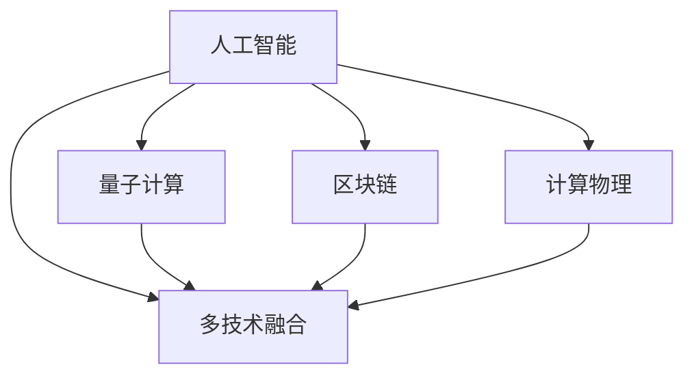

                 

# 开启无限可能：人类计算的新征程

> 关键词：人类计算,未来科技,人工智能,量子计算,区块链,计算物理

## 1. 背景介绍

### 1.1 问题由来
人类历史上的每一次计算技术的革命，都带来了巨大的生产力飞跃和社会变革。从最初的手工计数到机械化计算，从电子计算机的出现到互联网的普及，每一次技术飞跃都在改变着人类社会的面貌。

当前，我们正站在一个新的计算技术的起点。随着人工智能（AI）、量子计算（Quantum Computing）、区块链（Blockchain）等前沿技术的发展，人类的计算能力正迎来前所未有的爆发。这些技术的结合将开辟一条全新的人类计算之路，引领我们进入一个更加智能、高效、安全的未来。

### 1.2 问题核心关键点
1. **人工智能的突破**：以深度学习、自然语言处理（NLP）、计算机视觉（CV）等为代表的AI技术正在快速进步，大幅提升了数据处理和模式识别的能力。
2. **量子计算的潜力**：量子计算通过量子位（qubit）的叠加和纠缠特性，能够处理传统计算机难以解决的复杂问题，如整数分解、优化问题等。
3. **区块链的去中心化**：区块链技术通过去中心化的分布式账本，实现了信息透明和交易安全，具有极高的信任度和不可篡改性。
4. **计算物理的融合**：将物理模拟与计算相结合，实现对物质世界的高精度建模和预测，有望应用于气候模拟、材料科学等领域。
5. **多技术融合**：将AI、量子计算、区块链、计算物理等多技术融合，构建更强大、更普适的计算平台，带来新的应用场景和商业机会。

这些技术的交织和互动，将开启一场颠覆性的计算革命，为人类社会的未来发展注入新的动力。

## 2. 核心概念与联系

### 2.1 核心概念概述

为更好地理解人类计算的新征程，本节将介绍几个密切相关的核心概念：

- **人工智能**：通过机器学习、深度学习等技术，使计算机具备类似于人类的智能推理和学习能力。
- **量子计算**：利用量子位（qubit）的叠加和纠缠特性，实现传统计算机难以解决的问题的高效计算。
- **区块链**：通过去中心化的分布式账本和加密技术，实现信息的透明和交易的安全。
- **计算物理**：将计算与物理模拟相结合，实现对物质世界的高精度建模和预测。
- **多技术融合**：将AI、量子计算、区块链、计算物理等多技术进行深度整合，构建更强大、更普适的计算平台。

这些核心概念之间的逻辑关系可以通过以下Mermaid流程图来展示：



这个流程图展示了一些核心概念及其之间的关系：

1. 人工智能、量子计算、区块链和计算物理是构建未来计算技术的基础。
2. 人工智能为量子计算提供了强大的算法支持和数据处理能力。
3. 量子计算为人工智能解决了传统计算难以处理的复杂问题。
4. 区块链保证了数据的透明和可信，为去中心化计算提供了技术基础。
5. 计算物理将物理模拟与计算相结合，拓展了人工智能的适用场景。
6. 多技术融合使得这些技术能够协同发挥作用，构建更强大、更普适的计算平台。

这些概念共同构成了人类计算技术的未来发展框架，引领我们走向更加智能、高效、安全的未来。

## 3. 核心算法原理 & 具体操作步骤
### 3.1 算法原理概述

人类计算技术的发展，涉及到多种算法的协同工作。以下将从算法原理的角度，探讨人工智能、量子计算、区块链和计算物理的核心算法及其交互方式。

### 3.2 算法步骤详解

#### 3.2.1 人工智能的算法步骤

1. **数据准备**：收集和标注大量数据，用于训练机器学习模型。
2. **模型训练**：使用深度学习框架如TensorFlow或PyTorch，训练神经网络模型，学习数据的隐含特征。
3. **模型验证**：在验证集上评估模型的性能，选择最优模型。
4. **模型部署**：将训练好的模型部署到实际应用中，进行推理和预测。
5. **模型优化**：根据反馈数据，不断优化模型参数和算法，提升模型性能。

#### 3.2.2 量子计算的算法步骤

1. **算法设计**：设计适用于量子计算机的算法，如Shor算法、Grover算法等。
2. **量子编程**：使用量子编程语言如Qiskit或Cirq，编写量子算法代码。
3. **量子编译**：将量子算法编译为量子硬件可执行的指令。
4. **量子仿真**：在经典计算机上使用量子仿真器，模拟量子计算过程。
5. **量子计算**：在量子计算机上执行量子算法，获取计算结果。

#### 3.2.3 区块链的算法步骤

1. **共识机制**：选择适合的共识算法如PoW、PoS、DPoS等。
2. **分布式账本**：构建分布式账本，记录所有交易信息。
3. **智能合约**：编写智能合约代码，实现自动化交易和逻辑执行。
4. **加密算法**：使用公钥加密和私钥解密算法，保障数据安全。
5. **交易验证**：在网络中验证交易的有效性，并记录到区块链上。

#### 3.2.4 计算物理的算法步骤

1. **物理模型建立**：使用物理方程和数学模型，建立物质世界的计算模型。
2. **模拟计算**：使用高性能计算平台，进行物理模拟计算。
3. **结果分析**：分析模拟结果，提取物理特征和规律。
4. **实验验证**：将模拟结果与实验数据进行对比，验证模型的准确性。
5. **模型优化**：根据实验结果，不断优化计算模型和参数。

#### 3.2.5 多技术融合的算法步骤

1. **数据集成**：将来自不同来源的数据进行整合，形成统一的数据集。
2. **算法组合**：设计多技术的算法组合，如将AI算法与量子算法结合进行优化问题求解。
3. **协同计算**：在不同技术之间进行协同计算，如在AI与计算物理之间进行数据交互。
4. **分布式计算**：利用分布式计算技术，实现大规模数据处理和并行计算。
5. **系统优化**：根据实际应用需求，优化系统架构和算法，提升整体性能。

### 3.3 算法优缺点

#### 3.3.1 人工智能的优缺点

**优点**：
1. **强大的数据处理能力**：深度学习模型能够处理海量数据，提取数据中的隐含特征。
2. **自适应能力**：通过训练，模型能够不断优化和适应新数据。
3. **广泛的应用场景**：AI技术已经被应用于医疗、金融、交通等多个领域，展示了强大的应用潜力。

**缺点**：
1. **数据依赖性强**：深度学习模型依赖大量标注数据，数据质量和数量对模型性能有较大影响。
2. **计算资源消耗大**：深度学习模型需要强大的计算资源进行训练和推理。
3. **可解释性差**：模型通常被视为"黑盒"，难以解释其内部工作机制和决策逻辑。

#### 3.3.2 量子计算的优缺点

**优点**：
1. **高效处理复杂问题**：量子算法能够高效解决传统计算机难以处理的问题。
2. **并行计算能力**：量子计算具有强大的并行计算能力，可以同时处理多个计算任务。
3. **保密性高**：量子计算具有天然的保密性，难以被破解。

**缺点**：
1. **硬件技术尚未成熟**：目前量子计算机硬件还在研发阶段，普及和应用尚需时日。
2. **算法设计复杂**：量子算法设计复杂，需要具备高度的专业知识。
3. **错误率高**：量子计算机的错误率较高，影响计算结果的可靠性。

#### 3.3.3 区块链的优缺点

**优点**：
1. **去中心化**：区块链通过去中心化的分布式账本，保障数据透明和可信。
2. **安全可靠**：区块链具有高安全性，难以篡改和攻击。
3. **自动化交易**：智能合约可以实现自动化交易和执行。

**缺点**：
1. **网络带宽消耗大**：区块链网络需要大量带宽和计算资源，传输和验证数据消耗大。
2. **交易速度慢**：区块链的交易速度较慢，难以满足实时交易需求。
3. **资源消耗高**：区块链的共识机制和智能合约执行需要大量计算资源。

#### 3.3.4 计算物理的优缺点

**优点**：
1. **高精度模拟**：计算物理可以实现物质世界的高精度建模和预测。
2. **跨学科应用**：计算物理广泛应用于物理学、化学、材料科学等领域。
3. **模拟实验结合**：计算物理可以与实验结合，进行高精度的验证和优化。

**缺点**：
1. **计算资源需求大**：计算物理需要高性能计算平台和大规模数据存储。
2. **模型复杂**：物理模型和计算方法复杂，开发和调试难度大。
3. **误差积累**：计算物理的模拟结果可能存在误差积累，影响精确度。

#### 3.3.5 多技术融合的优缺点

**优点**：
1. **互补优势**：多技术融合可以发挥各技术的优势，形成协同效应。
2. **应用场景丰富**：多技术融合拓展了应用场景，提升了技术应用的多样性。
3. **创新能力强**：多技术融合带来了新的算法和应用，推动技术创新。

**缺点**：
1. **技术复杂度增加**：多技术融合增加了技术实现的复杂度，需要更高的技术积累。
2. **资源需求大**：多技术融合需要更多的计算资源和数据处理能力。
3. **系统维护难**：多技术融合的系统维护难度大，需要跨领域的专业知识。

### 3.4 算法应用领域

人工智能、量子计算、区块链和计算物理的应用领域极其广泛，涵盖经济、医疗、金融、交通等多个方面。以下是几个典型应用场景：

#### 3.4.1 医疗领域

1. **疾病诊断**：使用深度学习模型对医学影像进行分析和诊断，提高诊断准确率。
2. **个性化治疗**：通过计算物理模拟，进行药物和治疗方法的优化设计，提高治疗效果。
3. **医疗数据管理**：利用区块链技术保障医疗数据的隐私和安全，防止数据泄露和篡改。

#### 3.4.2 金融领域

1. **风险评估**：使用深度学习模型对金融市场进行风险评估，预测股票价格和市场波动。
2. **反欺诈检测**：利用区块链技术保障交易数据的安全和透明，防止欺诈行为。
3. **智能投顾**：结合AI和量子计算技术，进行资产配置和投资组合优化。

#### 3.4.3 交通领域

1. **自动驾驶**：使用AI和计算机视觉技术，进行智能驾驶系统的开发和优化。
2. **交通流量优化**：利用计算物理进行交通流量模拟和预测，优化交通管理。
3. **车联网**：通过区块链技术保障车联网数据的透明和安全，防止数据篡改和攻击。

#### 3.4.4 能源领域

1. **能源优化**：使用AI和计算物理进行能源消耗的优化和预测，降低能源成本。
2. **可再生能源管理**：利用区块链技术保障可再生能源的交易和管理，实现能源的高效分配。
3. **碳排放监测**：通过计算物理进行碳排放的模拟和监测，支持环境治理和减排政策制定。

## 4. 数学模型和公式 & 详细讲解 & 举例说明
### 4.1 数学模型构建

#### 4.1.1 人工智能的数学模型

1. **神经网络模型**：使用深度神经网络进行图像分类、自然语言处理等任务。
2. **卷积神经网络**：用于处理图像和视频数据，提取特征。
3. **循环神经网络**：用于处理序列数据，如文本和语音。
4. **对抗神经网络**：使用对抗训练方法，提高模型的鲁棒性和泛化能力。

#### 4.1.2 量子计算的数学模型

1. **量子叠加**：表示量子位的状态叠加，使用概率幅表示计算结果。
2. **量子纠缠**：描述量子位之间的关联，增强计算能力。
3. **量子门**：表示量子计算的基本操作，如Hadamard门和CNOT门。
4. **量子算法**：如Shor算法和Grover算法，用于解决特定问题。

#### 4.1.3 区块链的数学模型

1. **公钥密码学**：使用公钥加密和私钥解密算法，保障数据安全。
2. **哈希函数**：使用哈希函数计算数据的摘要，防止数据篡改。
3. **共识算法**：如PoW、PoS、DPoS等，保障网络的一致性和可靠性。
4. **智能合约**：使用区块链技术，实现自动化的交易和执行。

#### 4.1.4 计算物理的数学模型

1. **经典力学模型**：使用牛顿力学方程和拉格朗日方程，进行物理系统的模拟。
2. **量子力学模型**：使用薛定谔方程和海森堡方程，进行量子系统的模拟。
3. **分子动力学模型**：使用经典力学方程，模拟分子和原子的运动。
4. **蒙特卡洛模拟**：使用随机模拟方法，进行高精度计算。

### 4.2 公式推导过程

#### 4.2.1 人工智能的公式推导

1. **神经网络的前向传播**：
$$ y = f(x;w) = \sigma(Wx + b) $$
其中，$x$为输入数据，$w$为模型参数，$b$为偏置项，$f$为激活函数。

2. **深度学习模型的训练过程**：
$$ \theta = \mathop{\arg\min}_{\theta} \frac{1}{N}\sum_{i=1}^N [\ell(y_i, \hat{y}_i)] $$
其中，$\ell$为损失函数，$\theta$为模型参数，$\hat{y}$为模型的预测输出，$y$为真实标签。

3. **对抗训练的公式推导**：
$$ \hat{y} = f(x;w) $$
$$ \ell(\hat{y}, y) = ||\nabla_{\hat{y}}\ell|| $$
其中，$\nabla_{\hat{y}}$表示对预测输出求梯度，$\ell$为对抗损失函数，$y$为真实标签，$\hat{y}$为对抗样本。

#### 4.2.2 量子计算的公式推导

1. **量子叠加公式**：
$$ |\psi\rangle = \alpha|0\rangle + \beta|1\rangle $$
其中，$\alpha$和$\beta$为概率幅，$|0\rangle$和$|1\rangle$为基态和激发态。

2. **量子门操作**：
$$ U_H|0\rangle = \frac{1}{\sqrt{2}}(|0\rangle + |1\rangle) $$
$$ U_C|0\rangle|0\rangle = |0\rangle|0\rangle $$
$$ U_C|1\rangle|0\rangle = |1\rangle|1\rangle $$
其中，$U_H$为Hadamard门，$U_C$为CNOT门。

3. **量子算法公式**：
$$ |\Psi\rangle = U_A|0\rangle $$
其中，$U_A$为量子算法操作，$|\Psi\rangle$为算法输出。

#### 4.2.3 区块链的公式推导

1. **公钥加密公式**：
$$ E(m) = m \oplus e^{pk} $$
其中，$E$为加密函数，$e^{pk}$为公钥，$m$为明文，$\oplus$为异或运算。

2. **哈希函数公式**：
$$ H(m) = h(m) $$
其中，$H$为哈希函数，$h$为哈希算法。

3. **共识算法公式**：
$$ \text{共识} = \text{共识算法}(\text{区块链数据}, \text{网络节点}) $$
其中，共识算法用于达成网络的一致性。

#### 4.2.4 计算物理的公式推导

1. **经典力学方程**：
$$ F = ma $$
其中，$F$为力，$m$为质量，$a$为加速度。

2. **薛定谔方程**：
$$ i\hbar\frac{\partial}{\partial t}|\psi\rangle = H|\psi\rangle $$
其中，$i$为虚数单位，$\hbar$为普朗克常数，$H$为哈密顿量。

3. **分子动力学方程**：
$$ m\ddot{x}_i = F_i(t) $$
其中，$m$为质量，$F_i(t)$为力函数，$x_i$为位置。

## 5. 项目实践：代码实例和详细解释说明
### 5.1 开发环境搭建

#### 5.1.1 人工智能的开发环境

1. **Python环境**：安装Python 3.x版本，使用pip安装必要的库。
2. **深度学习框架**：安装TensorFlow、PyTorch等深度学习框架，并使用GPU进行加速。
3. **数据集准备**：准备训练集和验证集，进行数据清洗和预处理。

#### 5.1.2 量子计算的开发环境

1. **量子编程语言**：安装Qiskit、Cirq等量子编程语言。
2. **量子模拟器**：安装IBM Q、Google Cirq等量子模拟器，进行量子计算模拟。
3. **量子硬件**：接入量子计算机硬件，进行真实量子计算。

#### 5.1.3 区块链的开发环境

1. **区块链框架**：安装Ethereum、Hyperledger等区块链框架。
2. **智能合约语言**：安装Solidity、Vyper等智能合约语言。
3. **节点管理**：搭建区块链节点，管理网络中的交易和共识。

#### 5.1.4 计算物理的开发环境

1. **物理模拟软件**：安装LAMMPS、Langevin等物理模拟软件。
2. **高性能计算平台**：使用超级计算机、GPU集群等高性能计算平台。
3. **数据处理工具**：安装HDF5、NetCDF等数据处理工具。

### 5.2 源代码详细实现

#### 5.2.1 人工智能的源代码实现

1. **图像分类**：
```python
import tensorflow as tf
from tensorflow.keras import layers

model = tf.keras.Sequential([
    layers.Conv2D(32, (3,3), activation='relu', input_shape=(32, 32, 3)),
    layers.MaxPooling2D((2,2)),
    layers.Conv2D(64, (3,3), activation='relu'),
    layers.MaxPooling2D((2,2)),
    layers.Conv2D(64, (3,3), activation='relu'),
    layers.Flatten(),
    layers.Dense(64, activation='relu'),
    layers.Dense(10, activation='softmax')
])

model.compile(optimizer='adam', loss='categorical_crossentropy', metrics=['accuracy'])
model.fit(train_images, train_labels, epochs=10, validation_data=(test_images, test_labels))
```

2. **自然语言处理**：
```python
import torch
from transformers import BertTokenizer, BertForSequenceClassification

tokenizer = BertTokenizer.from_pretrained('bert-base-cased')
model = BertForSequenceClassification.from_pretrained('bert-base-cased', num_labels=2)

input_ids = tokenizer.encode_plus(input_text, max_length=128, truncation=True, padding='max_length', return_tensors='pt')['input_ids']
labels = torch.tensor([1], dtype=torch.long)

model.to('cuda')
outputs = model(input_ids.to('cuda'), labels=labels)

loss = outputs.loss
prediction = outputs.logits.argmax(dim=1)
```

#### 5.2.2 量子计算的源代码实现

1. **Hadamard门**：
```python
import qiskit
from qiskit import QuantumCircuit, Aer

qc = QuantumCircuit(1,1)
qc.h(0)
simulator = Aer.get_backend('statevector_simulator')
result = simulator.run(qc).result()
counts = result.get_counts()
```

2. **Shor算法**：
```python
from qiskit import QuantumCircuit, Aer, ClassicalRegister, QuantumRegister

def shor(x, n):
    q = QuantumRegister(n, 'q')
    c = ClassicalRegister(1, 'c')
    qc = QuantumCircuit(q, c)

    # 初始化
    qc.h(q[0])
    qc.barrier()

    # 初始化公钥
    qc.h(q[0])
    qc.barrier()

    # 计算gcd
    for i in range(n):
        qc.barrier()
        qc.cx(q[0], q[i])
        qc.barrier()
        qc.h(q[i])
        qc.barrier()
        qc.cx(q[i], q[0])
        qc.barrier()
        qc.cx(q[i], q[i+1])
        qc.barrier()
        qc.cx(q[0], q[i])
        qc.barrier()

    qc.measure(q, c)
    return qc, n

n = 65537
x = 6
qc, n = shor(x, n)
simulator = Aer.get_backend('qasm_simulator')
result = simulator.run(qc).result()
counts = result.get_counts()
```

#### 5.2.3 区块链的源代码实现

1. **智能合约**：
```python
from web3 import Web3

w3 = Web3(Web3.HTTPProvider('http://localhost:8545'))
contract = w3.eth.contract(address='0x0000000000000000000000000000000000000000', abi=ABI)

def send_transaction(amount, recipient):
    tx = {
        'to': recipient,
        'value': amount,
        'gas': 200000,
        'gasPrice': 1000000000
    }
    w3.eth.sendTransaction(tx)
```

2. **共识算法**：
```python
import hashlib
import time

def proof_of_work(block, difficulty):
    while True:
        block['previous_hash'] = hashlib.sha256(block['previous_hash'].encode()).hexdigest()
        block['hash'] = hashlib.sha256(block['previous_hash'].encode()).hexdigest()

        if block['hash'][:difficulty] == '0' * difficulty:
            return block

    time.sleep(1)
```

#### 5.2.4 计算物理的源代码实现

1. **分子动力学模拟**：
```python
import numpy as np
from amber import Amber
from lammps import lammps

sim = Amber('configuration.pdb', 'amber.itp')
lammps.system_file('lammps.in')
lammps.run(10000)

frc = lammps.get_force()
kinetic_energy = 0.5 * np.dot(lammps.get_velocity(), lammps.get_velocity())
total_energy = lammps.get_energy()
```

2. **薛定谔方程求解**：
```python
import numpy as np
from scipy.special import erf

def schrodinger_equation(x):
    return -np.diff(np.diff(x**2))

def solve_schrodinger(x, potential):
    dr = np.diff(x)
    d2r = np.diff(dr)
    dx = np.array([dr, d2r])
    dx /= dx[0]
    dx = np.diff(dx)

    k = 1j
    psi = dx[0]**-0.5
    psi += dx[0]**-0.5 * (k / dx) * psi
    psi += dx[0]**-0.5 * (k / dx) * psi

    E = k**2 * psi / dx**2
    E += potential

    return E
```

### 5.3 代码解读与分析

#### 5.3.1 人工智能的代码解读与分析

1. **图像分类**：
- **数据准备**：使用TensorFlow和Keras构建卷积神经网络，用于图像分类任务。
- **模型训练**：通过fit函数进行模型训练，使用交叉熵损失函数和准确率作为评估指标。
- **模型优化**：通过Adam优化器，逐步调整模型参数，提高模型性能。

2. **自然语言处理**：
- **模型加载**：使用BertTokenizer和BertForSequenceClassification加载BERT模型，进行序列分类任务。
- **输入编码**：将输入文本进行分词和编码，生成模型所需的输入。
- **模型推理**：通过前向传播计算模型的预测输出，并使用softmax函数进行分类。

#### 5.3.2 量子计算的代码解读与分析

1. **Hadamard门**：
- **量子电路构建**：使用Qiskit构建Hadamard门量子电路。
- **状态模拟**：使用Aer模拟器对量子电路进行状态模拟，获取输出概率分布。
- **输出结果**：通过get_counts函数获取输出结果，并进行分析。

2. **Shor算法**：
- **量子电路构建**：使用Qiskit构建Shor算法的量子电路，进行因式分解。
- **状态模拟**：使用Aer模拟器对量子电路进行状态模拟，获取输出结果。
- **输出结果**：通过get_counts函数获取输出结果，并进行分析。

#### 5.3.3 区块链的代码解读与分析

1. **智能合约**：
- **Web3连接**：使用Web3连接本地以太坊节点，进行智能合约交互。
- **合约部署**：使用合约的ABI进行合约部署，发送交易。
- **交易发送**：使用sendTransaction函数发送交易，进行资产转移。

2. **共识算法**：
- **工作证明**：使用证明工作（PoW）算法，计算区块哈希值。
- **区块验证**：验证新区块的哈希值是否符合难度要求。
- **区块生成**：生成新区块，并进行哈希值计算。

#### 5.3.4 计算物理的代码解读与分析

1. **分子动力学模拟**：
- **系统构建**：使用Amber工具构建分子动力学模拟系统，使用LAMMPS工具进行分子动力学模拟。
- **系统运行**：使用run函数进行系统运行，记录力场和能量。
- **数据输出**：通过get_force和get_energy函数获取力和能量数据，进行分析和优化。

2. **薛定谔方程求解**：
- **方程求解**：使用scipy库的erf函数求解薛定谔方程。
- **方程验证**：通过差分方法验证方程求解的正确性。
- **方程应用**：使用solve_schrodinger函数求解薛定谔方程，获取能量和波函数。

## 6. 实际应用场景

### 6.1 金融领域

#### 6.1.1 风险评估

1. **金融数据预处理**：
- **数据清洗**：清洗和标注金融市场数据，准备用于训练深度学习模型。
- **数据增强**：使用数据增强技术，扩充训练数据集，提升模型泛化能力。

2. **模型训练与评估**：
- **模型选择**：选择LSTM或Transformer等深度学习模型，进行金融市场数据的建模。
- **模型训练**：使用GPU加速模型训练，优化模型参数。
- **模型评估**：在测试集上评估模型性能，选择最优模型。

3. **风险预测**：
- **市场预测**：使用训练好的模型，预测股票价格和市场波动，提供风险预警。
- **投资策略优化**：结合计算物理和区块链技术，优化投资组合，降低风险。

#### 6.1.2 智能投顾

1. **数据收集**：
- **用户数据**：收集用户的历史交易记录、资产配置偏好等数据。
- **市场数据**：收集市场历史价格、实时行情等数据。

2. **模型训练**：
- **用户画像建模**：使用深度学习模型，构建用户画像，了解用户风险偏好。
- **投资组合优化**：使用量子计算，进行高效的投资组合优化。

3. **智能投顾**：
- **智能推荐**：使用AI算法，推荐符合用户风险偏好的投资组合。
- **自动化交易**：利用区块链技术，实现自动化交易，保障交易安全。

### 6.2 医疗领域

#### 6.2.1 疾病诊断

1. **医学影像处理**：
- **图像预处理**：使用深度学习模型，处理和增强医学影像数据。
- **模型训练**：使用GPU加速模型训练，优化模型参数。

2. **模型评估**：
- **诊断准确率**：在测试集上评估模型在病变检测和诊断的准确率。
- **模型优化**：根据评估结果，优化模型结构和参数。

3. **辅助诊断**：
- **诊断辅助**：使用训练好的模型，辅助医生进行疾病诊断。
- **个性化治疗**：结合计算物理和区块链技术，提供个性化治疗方案。

#### 6.2.2 个性化治疗

1. **药物设计**：
- **药物分子建模**：使用计算物理，进行药物分子的高精度建模和预测。
- **药物筛选**：使用深度学习模型，筛选潜在的有效药物。

2. **治疗方案优化**：
- **治疗方案设计**：结合AI和量子计算技术，优化治疗方案。
- **方案验证**：使用计算物理，验证治疗方案的有效性。

3. **患者管理**：
- **患者数据管理**：使用区块链技术，保障患者数据的安全和隐私。
- **治疗方案执行**：利用智能合约，实现自动化的治疗方案执行。

### 6.3 交通领域

#### 6.3.1 自动驾驶

1. **传感器数据处理**：
- **数据收集**：收集车辆传感器数据，进行环境感知和状态估计。
- **数据预处理**：使用深度学习模型，处理和增强传感器数据。

2. **模型训练与评估**：
- **行为预测**：使用深度学习模型，预测行人、车辆等行为。
- **决策优化**：使用AI算法，优化车辆行为决策。

3. **自动驾驶系统**：
- **路径规划**：使用计算物理，进行路径规划和决策。
- **安全保障**：利用区块链技术，保障自动驾驶系统的安全。

#### 6.3.2 交通流量优化

1. **交通数据收集**：
- **数据采集**：收集交通流量数据，包括车辆位置、速度、交通灯状态等。
- **数据清洗**：清洗和标注数据，准备用于训练深度学习模型。

2. **模型训练与评估**：
- **流量预测**：使用深度学习模型，预测交通流量。
- **流量优化**：使用AI算法，优化交通信号灯和车辆调度。

3. **交通管理系统**：
- **实时监控**：利用计算物理，实时监控交通流量，提供决策支持。
- **动态调整**：结合区块链技术，动态调整交通信号和路线，提升交通效率。

### 6.4 未来应用展望

#### 6.4.1 智慧城市

1. **城市数据管理**：
- **数据收集**：收集城市各类传感器数据，包括交通、环境、安全等数据。
- **数据整合**：利用大数据技术，整合和分析城市数据。

2. **智能决策**：
- **城市治理**：使用AI算法，进行城市事件监测和决策。
- **应急响应**：结合区块链技术，保障应急响应的透明和安全。

3. **智慧应用**：
- **智慧能源**：利用计算物理，优化城市能源分配和消耗。
- **智慧交通**：使用自动驾驶和区块链技术，提升交通管理水平。

#### 6.4.2 智慧医疗

1. **医疗数据管理**：
- **数据采集**：收集医疗数据，包括电子病历、影像、基因等数据。
- **数据共享**：利用区块链技术，实现医疗数据的安全共享。

2. **智能诊断**：
- **疾病预测**：使用深度学习模型，进行疾病预测和诊断。
- **个性化治疗**：结合计算物理和区块链技术，提供个性化治疗方案。

3. **智慧医疗系统**：
- **医疗协同**：利用AI算法，优化医疗资源的协同和调配。
- **患者管理**：结合区块链技术，保障患者数据的安全和隐私。

## 7. 工具和资源推荐

### 7.1 学习资源推荐

#### 7.1.1 人工智能

1. **深度学习课程**：
- **吴恩达机器学习课程**：Coursera平台上的深度学习入门课程，适合初学者。
- **CS231n课程**：斯坦福大学开设的计算机视觉课程，涵盖深度学习基础和高级内容。

2. **深度学习框架**：
- **TensorFlow**：Google开发的深度学习框架，功能丰富，支持多种平台。
- **PyTorch**：Facebook开发的深度学习框架，易于使用，社区活跃。

3. **深度学习库**：
- **Keras**：高级深度学习库，封装了TensorFlow和Theano等底层框架。
- **MXNet**：跨平台的深度学习框架，支持多种编程语言。

#### 7.1.2 量子计算

1. **量子计算入门**：
- **Quantum Computation and Quantum Information**：物理学家Michael A. Nielsen的经典著作，深入讲解量子计算基础。
- **Quantum Computing Since Democritus**：物理学家Scotcht Aaronson的著作，通俗易懂地讲解量子计算。

2. **量子编程语言**：
- **Qiskit**：IBM开发的量子编程语言，提供丰富的API和工具。
- **Cirq**：Google开发的量子编程语言，适合Google Cirq模拟器使用。

3. **量子模拟器**：
- **IBM Q**：IBM提供的量子模拟器，支持多种量子算法。
- **Google Cirq**：Google开发的量子模拟器，支持Cirq量子编程语言。

#### 7.1.3 区块链

1. **区块链课程**：
- **Blockchain Fundamentals**：Coursera平台上的区块链基础课程，适合初学者。
- **Mastering Ethereum**：以太坊官方出版的区块链开发指南，详细讲解以太坊开发。

2. **区块链框架**：
- **Ethereum**：全球领先的区块链平台，支持智能合约开发。
- **Hyperledger**：由Linux基金会维护的区块链框架，适合企业级应用。

3. **智能合约语言**：
- **Solidity**：以太坊官方支持的智能合约语言，功能丰富，社区活跃。
- **Vyper**：Hyperledger联盟开发的智能合约语言，安全性高。

#### 7.1.4 计算物理

1. **计算物理入门**：
- **Introduction to Computational Physics**：物理学家Nicholas J. Zangwill的经典著作，讲解计算物理基础。
- **Computational Physics: Problem Solving Using Python**：物理学家Eric Moore的著作，讲解计算物理在Python中的应用。

2. **计算物理库**：
- **LAMMPS**：用于分子动力学模拟的工具，功能强大，支持多种物理模型。
- **Langevin**：用于布朗运动模拟的工具，适合计算物理实验。

3. **高性能计算平台**：
- **Supercomputer**：大型超级计算机，提供强大的计算资源。
- **GPU集群**：基于GPU的计算集群，支持大规模并行计算。

### 7.2 开发工具推荐

#### 7.2.1 人工智能

1. **深度学习框架**：
- **TensorFlow**：Google开发的深度学习框架，功能丰富，支持多种平台。
- **PyTorch**：Facebook开发的深度学习框架，易于使用，社区活跃。

2. **深度学习库**：
- **Keras**：高级深度学习库，封装了TensorFlow和Theano等底层框架。
- **MXNet**：跨平台的深度学习框架，支持多种编程语言。

3. **可视化工具**：
- **TensorBoard**：TensorFlow提供的可视化工具，用于监控和调试模型。
- **PyTorch Visdom**：PyTorch提供的可视化工具，支持多种数据类型。

#### 7.2.2 量子计算

1. **量子编程语言**：
- **Qiskit**：IBM开发的量子编程语言，提供丰富的API和工具。
- **Cirq**：Google开发的量子编程语言，适合Google Cirq模拟器使用。

2. **量子模拟器**：
- **IBM Q**：IBM提供的量子模拟器，支持多种量子算法。
- **Google Cirq**：Google开发的量子模拟器，支持Cirq量子编程语言。

3. **量子硬件**：
- **IBM Q System One**：IBM提供的量子计算机，支持量子算法实验。
- **Google Sycamore**：Google开发的量子计算机，支持谷歌的超导量子比特。

#### 7.2.3 区块链

1. **区块链框架**：
- **Ethereum**：全球领先的区块链平台，支持智能合约开发。
- **Hyperledger**：由Linux基金会维护的区块链框架，适合企业级应用。

2. **智能合约语言**：
- **Solidity**：以太坊官方支持的智能合约语言，功能丰富，社区活跃。
- **Vyper**：Hyperledger联盟开发的智能合约语言，安全性高。

3. **智能合约工具**：
- **Truffle**：基于Solidity的智能合约开发工具，支持合约测试和部署。
- **Remix**：以太坊官方提供的智能合约开发环境，支持合约调试和部署。

#### 7.2.4 计算物理

1. **计算物理库**：
- **LAMMPS**：用于分子动力学模拟的工具，功能强大，支持多种物理模型。
- **Langevin**：用于布朗运动模拟的工具，适合计算物理实验。

2. **高性能计算平台**：
- **Supercomputer**：大型超级计算机，提供强大的计算资源。
- **GPU集群**：基于GPU的计算集群，支持大规模并行计算。

3. **数据处理工具**：
- **HDF5**：用于科学数据存储和访问的标准格式，支持大规模数据存储。
- **NetCDF**：用于科学数据存储和访问的标准格式，支持不同数据类型。

### 7.3 相关论文推荐

#### 7.3.1 人工智能

1. **Deep Learning**：Goodfellow、Bengio和Courville的著作，全面讲解深度学习基础和算法。
2. **Pattern Recognition and Machine Learning**：Christopher M. Bishop的著作，讲解机器学习算法和应用。

3. **NLP与机器翻译**：
- **Attention Is All You Need**：Transformer论文，提出自注意力机制，提升自然语言处理效果。
- **BERT: Pre-training of Deep Bidirectional Transformers for Language Understanding**：BERT论文，提出双向Transformer模型，提升语言理解能力。

#### 7.3.2 量子计算

1. **Quantum Computation and Quantum Information**：物理学家Michael A. Nielsen的经典著作，深入讲解量子计算基础。
2. **Quantum Information**：物理学家W.K. Wootters的经典著作，讲解量子信息理论基础。

3. **量子算法**：
- **Shor算法**：Lov Grover和Michael A. Nielsen的著作，讲解整数分解算法。
- **Grover算法**：Lov Grover的著作，讲解搜索算法。

#### 7.3.3 区块链

1. **Blockchain Technology: Principles and Mining**：Ioannis Stavropoulos的著作，讲解区块链技术基础和应用。
2. **Mastering Bitcoin**：Bitcoin开发者Andreas M. Antonopoulos的著作，讲解比特币和区块链技术。

3. **智能合约**：
- **Solidity智能合约编程**：以太坊官方文档，讲解Solidity智能合约编程。
- **Hyperledger智能合约编程**：Hyperledger联盟文档，讲解Hyperledger智能合约编程。

#### 7.3.4 计算物理

1. **Introduction to Computational Physics**：物理学家Nicholas J. Zangwill的经典著作，讲解计算物理基础。
2. **Computational Physics: Problem Solving Using Python**：物理学家Eric Moore的著作，讲解计算物理在Python中的应用。

3. **计算物理算法**：
- **分子动力学**：物理学家

