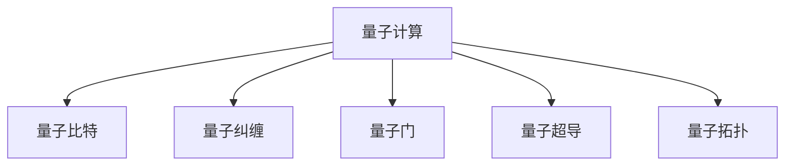

                 

# 开启无限可能：人类计算的新征程

> 关键词：计算革命,超级计算,量子计算,人工智能,大数据,自动化,未来科技,前沿科技

## 1. 背景介绍

### 1.1 问题由来
随着科技的飞速发展，人类社会进入了一个前所未有的计算时代。从早期的电子管计算机到如今的超级计算机，从串行计算到分布式计算，计算能力一直在以指数级增长。然而，面对日益增长的数据量和日益复杂的计算任务，传统的计算模式已难以满足需求。

在这一背景下，计算技术的革新成为必然趋势。量子计算、分布式计算、超级计算、人工智能等前沿技术，正不断突破人类对计算的认知极限。其中，量子计算因其在处理某些特定问题上的强大能力，被视为未来计算的革命性突破。

### 1.2 问题核心关键点
本节将探讨量子计算的原理及其在实际应用中的潜力，并分析其在未来科技发展中的关键地位。

## 2. 核心概念与联系

### 2.1 核心概念概述

为更好地理解量子计算的理论基础和实际应用，本节将介绍几个关键概念：

- **量子计算(QC)**：一种基于量子力学原理的新型计算范式，通过操纵量子比特(qubit)实现高效计算。与传统二进制比特(bit)不同，量子比特可以同时存在于0和1的叠加态，从而实现并行计算。

- **量子比特(Qubit)**：量子计算的基本单位，可以同时处于0和1的叠加态，通过量子纠缠、量子门等操作进行计算。

- **量子纠缠(Quantum Entanglement)**：多个量子比特之间的非局域关联，可以超越经典物理的因果关系，实现超高并行度的计算。

- **量子门(Quantum Gate)**：对量子比特进行运算的单位，通过不同的量子门操作，可以实现量子比特状态的变化。

- **量子超导(Superconducting Quantum Computing)**：利用超导技术实现量子比特存储和操作的计算方式，是目前最成熟的量子计算方案之一。

- **量子拓扑(Quantum Topology)**：利用拓扑学的原理，通过编码和纠错技术，提高量子比特的稳定性和容错率。

这些核心概念之间的逻辑关系可以通过以下Mermaid流程图来展示：



这个流程图展示了几类关键概念的关联：

1. 量子计算依赖于量子比特作为计算单位。
2. 量子比特之间的纠缠实现了超高并行度。
3. 量子门操作实现量子比特状态的变换。
4. 超导技术是量子比特操作的物理实现方式之一。
5. 拓扑学原理提高量子比特的稳定性和容错率。

## 3. 核心算法原理 & 具体操作步骤

### 3.1 算法原理概述

量子计算的核心算法包括Shor算法、Grover算法、量子纠错算法等。这些算法通过量子比特的特殊性质，实现了传统计算机难以企及的计算效率。

以Shor算法为例，它主要用于解决大数分解问题，其基本原理是通过量子叠加和量子干涉，将大数的分解问题转化为小数的整数分解问题，从而在多项式时间内实现分解。

### 3.2 算法步骤详解

量子计算的基本步骤包括量子比特的初始化、量子门的操作、量子纠缠的建立和测量结果的输出。以下以Shor算法为例，详细讲解其操作步骤：

1. **量子比特初始化**：将大数N分解为两个部分，每个部分含有一个量子比特。初始化量子比特为|0>态。

2. **量子叠加和干涉**：通过对量子比特进行一系列量子门操作，实现量子叠加和干涉，最终得到量子态。

3. **量子比特测量**：通过测量量子比特的塌缩态，得到整数分解的结果。

4. **迭代优化**：通过多次迭代和优化，提高算法的效率和准确性。

### 3.3 算法优缺点

量子计算相比传统计算具有以下优点：

1. **超高并行度**：通过量子纠缠和量子门操作，实现超高并行度计算，能够快速解决一些传统计算机难以处理的复杂问题。

2. **高效算法**：量子计算中的某些算法（如Shor算法、Grover算法）能够以多项式时间复杂度解决传统算法指数时间复杂度的问题。

3. **广泛应用**：量子计算在密码学、材料科学、药物设计等领域具有广阔的应用前景。

然而，量子计算也存在一些缺点：

1. **技术瓶颈**：量子计算技术尚处于早期发展阶段，硬件实现、算法优化等方面仍需突破。

2. **噪声和误差**：量子比特容易受到环境干扰，导致噪声和误差。

3. **容错率低**：量子比特的稳定性和容错率较低，错误传播难以控制。

4. **资源需求高**：量子计算需要大量的物理资源和复杂的控制技术。

### 3.4 算法应用领域

量子计算在多个领域具有广泛的应用前景，例如：

- **密码学**：利用量子计算破解传统密码，如RSA算法。
- **材料科学**：利用量子计算模拟材料分子结构，加速新材料的研发。
- **药物设计**：利用量子计算模拟分子反应，提高新药研发效率。
- **人工智能**：利用量子计算优化机器学习算法，提升智能系统的性能。
- **金融工程**：利用量子计算进行风险管理和投资策略优化。
- **交通运输**：利用量子计算进行交通流量优化和路径规划。

这些领域的应用展示了量子计算的强大潜力和广阔前景。

## 4. 数学模型和公式 & 详细讲解

### 4.1 数学模型构建

量子计算的数学模型通常基于量子力学原理，通过量子比特、量子门和量子纠缠等概念进行建模。以下以Shor算法为例，介绍其数学模型构建过程。

设大数为N，分解为两个部分，每个部分含有一个量子比特。令$|0\rangle$表示量子比特初始态，$|1\rangle$表示量子比特测量态。令$|+\rangle = \frac{|0\rangle + |1\rangle}{\sqrt{2}}$，$|-\rangle = \frac{|0\rangle - |1\rangle}{\sqrt{2}}$，$|\varphi\rangle$表示算术函数值。令$|k\rangle$表示迭代计算中的量子比特状态，$|\psi_k\rangle$表示迭代中的量子叠加态。

### 4.2 公式推导过程

Shor算法的核心公式为：

$$
\begin{aligned}
&|k\rangle \to |k+1\rangle \\
&|k+1\rangle \to |k+2\rangle \\
&\vdots \\
&|N-1\rangle \to |0\rangle
\end{aligned}
$$

其中，$|0\rangle$表示初始态，$|1\rangle$表示测量态，$|k\rangle$表示迭代计算中的量子比特状态。

Shor算法的具体推导过程涉及量子叠加和干涉等量子力学原理，需要深厚的量子计算理论基础。

### 4.3 案例分析与讲解

以RSA加密算法为例，Shor算法通过量子计算快速分解大数，从而破解RSA密码。以下通过一个简单的案例，展示Shor算法的应用过程：

假设有一个2048位的RSA加密密钥，可以使用Shor算法在多项式时间内分解该密钥。首先，将大数分解为两个部分，每个部分含有一个量子比特。初始化量子比特为|0>态。通过一系列量子门操作，实现量子叠加和干涉，最终得到量子态。测量量子比特，得到整数分解的结果。通过多次迭代和优化，得到最终分解结果。

## 5. 项目实践：代码实例和详细解释说明

### 5.1 开发环境搭建

在进行量子计算实践前，我们需要准备好开发环境。以下是使用Qiskit框架进行量子计算环境配置的流程：

1. 安装Qiskit：
```bash
pip install qiskit
```

2. 配置IBM量子云服务：
```bash
qiskit ibmq register
```

3. 连接IBM量子云服务：
```python
from qiskit import IBMQ
IBMQ.load_account()
IBMQ.set_active_account()
IBMQ.set_provider(hub='ibm-q', group='main', project='default')
```

完成上述步骤后，即可在IBM量子云服务上运行量子计算代码。

### 5.2 源代码详细实现

以下是一个简单的Qiskit代码，用于实现Shor算法的量子比特初始化和量子门操作：

```python
from qiskit import QuantumCircuit, transpile, Aer, execute
from qiskit.visualization import plot_histogram, plot_bloch_multivector

# 创建量子电路
qc = QuantumCircuit(2)

# 初始化量子比特
qc.h(0)  # 对量子比特0进行H门操作，将其变为叠加态
qc.cx(0, 1)  # 对量子比特0和量子比特1进行CNOT操作

# 测量量子比特
qc.measure_all()

# 输出量子电路
print(qc)

# 运行量子电路
backend = Aer.get_backend('qasm_simulator')
job = execute(qc, backend)
result = job.result()

# 输出量子比特测量结果
counts = result.get_counts()
print(counts)
```

该代码实现了Shor算法中的量子比特初始化和量子门操作。通过H门和CNOT门操作，实现量子叠加和量子纠缠，并进行量子比特测量，得到最终结果。

### 5.3 代码解读与分析

让我们再详细解读一下关键代码的实现细节：

**QuantumCircuit类**：
- `__init__`方法：初始化量子电路，设定量子比特数量。
- `h`方法：对量子比特进行H门操作，实现量子叠加。
- `cx`方法：对量子比特进行CNOT操作，实现量子纠缠。
- `measure_all`方法：对所有量子比特进行测量。

**H门和CNOT门操作**：
- H门（Hadamard门）：将量子比特从|0>态转换为叠加态|+>。
- CNOT门（Controlled-NOT门）：实现量子比特之间的纠缠。

**Aer.get_backend方法**：
- 获取模拟器，用于执行量子电路。

**IBMQ.set_active_account方法**：
- 设置IBM量子云服务的活跃账户。

通过Qiskit，开发者可以便捷地实现量子计算算法，并在IBM量子云上运行代码，获取计算结果。这大大降低了量子计算的入门门槛，使得更多研究者能够参与到量子计算的研究和应用中。

## 6. 实际应用场景

### 6.1 智能制造

量子计算在智能制造领域具有广泛的应用前景。通过量子计算，可以实现复杂生产流程的优化和预测，提升生产效率和产品质量。例如，通过量子计算模拟化学反应过程，优化材料配方和生产工艺，减少生产成本和环境影响。

在实际应用中，量子计算可以在以下几个方面发挥作用：

- **供应链管理**：通过量子计算优化供应链流程，降低库存成本，提高物流效率。
- **设备预测性维护**：利用量子计算对设备运行状态进行预测，及时发现和修复问题，减少停机时间。
- **产品设计优化**：通过量子计算进行产品设计优化，提高产品性能和生产效率。

### 6.2 金融工程

量子计算在金融工程领域具有广阔的应用前景。通过量子计算，可以实现复杂的金融模型计算和风险管理，提高投资决策的科学性和准确性。

在实际应用中，量子计算可以在以下几个方面发挥作用：

- **期权定价**：通过量子计算快速计算期权定价模型，提高定价效率和准确性。
- **组合优化**：利用量子计算优化投资组合，降低投资风险。
- **信用风险评估**：通过量子计算评估企业信用风险，提高风险管理能力。

### 6.3 生物医药

量子计算在生物医药领域具有巨大的潜力。通过量子计算，可以加速药物研发和生物分子模拟，提高研发效率和成功率。

在实际应用中，量子计算可以在以下几个方面发挥作用：

- **药物设计**：利用量子计算模拟分子反应，优化药物分子结构和活性。
- **疾病预测**：通过量子计算预测疾病发展趋势，提高诊断和治疗的准确性。
- **生物大分子模拟**：利用量子计算模拟生物大分子结构，加速新药物和治疗方法的研发。

### 6.4 未来应用展望

展望未来，量子计算在多个领域具有广阔的应用前景，将为人类计算能力带来革命性突破。

在科学研究方面，量子计算可以加速复杂物理模拟、材料科学、天文学等领域的计算，推动基础科学研究的发展。

在经济应用方面，量子计算可以优化金融模型、供应链管理、智能制造等领域的计算，提高经济活动的效率和效益。

在社会治理方面，量子计算可以应用于城市管理、公共安全、环境保护等领域，提升社会治理的智能化和精准化水平。

此外，量子计算还可以应用于教育、医疗、娱乐等众多领域，为人类社会带来更加智能化、高效化的生活方式。

## 7. 工具和资源推荐

### 7.1 学习资源推荐

为了帮助开发者系统掌握量子计算的理论基础和实践技巧，这里推荐一些优质的学习资源：

1. **量子计算教程**：由MIT OpenCourseWare提供，系统介绍量子计算的基本原理和应用。

2. **Quantum Computation and Quantum Information**：由Michael A. Nielsen和Isaac L. Chuang所著，全面介绍量子计算的理论基础和实践技术。

3. **Qiskit官方文档**：Qiskit框架的官方文档，提供了丰富的量子计算教程和样例代码，是量子计算实践的重要参考。

4. **Quantum Computation with IBM Q Experience**：IBM提供的量子计算在线平台，可以免费使用IBM量子云服务进行量子计算实验。

5. **Quantum Machine Learning**：由Stefan J. Glaser等人所著，介绍量子计算在机器学习中的应用。

通过对这些资源的学习实践，相信你一定能够快速掌握量子计算的精髓，并用于解决实际的计算问题。

### 7.2 开发工具推荐

高效的量子计算开发离不开优秀的工具支持。以下是几款用于量子计算开发的常用工具：

1. **Qiskit**：IBM开发的量子计算框架，提供丰富的量子计算算法和优化工具。

2. **Cirq**：Google开发的量子计算框架，支持Google的量子硬件和模拟器。

3. **Qiskit Composer**：IBM提供的量子计算可视化工具，帮助开发者构建和优化量子电路。

4. **TensorFlow Quantum**：TensorFlow和Google合作开发的量子计算框架，支持TensorFlow和Google的量子硬件和模拟器。

5. **Quantum Development Kit**：微软提供的量子计算开发工具包，支持Q#量子编程语言。

6. **Cirq**：Google提供的量子计算框架，支持Google的量子硬件和模拟器。

合理利用这些工具，可以显著提升量子计算的开发效率，加快创新迭代的步伐。

### 7.3 相关论文推荐

量子计算的研究始于20世纪80年代，并不断发展至今。以下是几篇奠基性的相关论文，推荐阅读：

1. **Quantum Computation and Quantum Information**：由Michael A. Nielsen和Isaac L. Chuang所著，全面介绍了量子计算的理论基础和实践技术。

2. **A New Kind of Quantum Computation**：由Peter W. Shor所著，提出了著名的Shor算法，展示了量子计算在密码学领域的应用潜力。

3. **Analyst's Zoo**：由Robinett, C. J.等所著，全面介绍了各类量子计算算法和应用场景。

4. **Quantum Algorithms**：由Harrow, Aram W.等所著，介绍了量子计算中的各类算法和优化技术。

5. **Quantum Computing Since Democritus**：由Scott Aaronson所著，介绍了量子计算的基本原理和未来发展趋势。

这些论文代表了大量子计算研究的发展脉络。通过学习这些前沿成果，可以帮助研究者把握学科前进方向，激发更多的创新灵感。

## 8. 总结：未来发展趋势与挑战

### 8.1 总结

本文对量子计算的原理和应用进行了全面系统的介绍。首先阐述了量子计算的背景和意义，明确了量子计算在多个领域的巨大潜力。其次，从原理到实践，详细讲解了量子计算的数学模型和算法步骤，给出了量子计算任务开发的完整代码实例。同时，本文还广泛探讨了量子计算在智能制造、金融工程、生物医药等众多领域的应用前景，展示了量子计算的强大潜力和广阔前景。此外，本文精选了量子计算的学习资源，力求为读者提供全方位的技术指引。

通过本文的系统梳理，可以看到，量子计算正处于快速发展阶段，具有广阔的应用前景和无限可能。未来，随着量子计算技术的不断成熟，其在多个领域的应用将得到进一步拓展和深化。

### 8.2 未来发展趋势

展望未来，量子计算将在多个领域带来颠覆性变革：

1. **计算能力爆发**：量子计算的超高并行度和高效率，将显著提升计算能力，加速科学研究、工业制造等领域的发展。

2. **新算法诞生**：量子计算的原理和算法将为传统计算机算法带来新的突破，推动人工智能、机器学习等领域的发展。

3. **量子网络**：量子计算网络将实现量子比特之间的快速通信，加速量子信息传输和量子计算协同。

4. **量子安全**：量子计算将破解传统加密算法，推动量子安全通信和数据保护技术的发展。

5. **多模态计算**：量子计算将与其他计算范式如经典计算、分布式计算等融合，实现多模态协同计算。

6. **新兴应用**：量子计算将在新材料、新药研发、新工艺等领域带来新的应用突破。

以上趋势凸显了量子计算的广阔前景，预示着未来计算技术的革命性变革。

### 8.3 面临的挑战

尽管量子计算的发展前景广阔，但仍面临诸多挑战：

1. **技术瓶颈**：量子计算技术尚处于早期发展阶段，硬件实现、算法优化等方面仍需突破。

2. **噪声和误差**：量子比特容易受到环境干扰，导致噪声和误差。

3. **容错率低**：量子比特的稳定性和容错率较低，错误传播难以控制。

4. **资源需求高**：量子计算需要大量的物理资源和复杂的控制技术。

5. **计算难度大**：量子计算的计算难度较大，需要高水平的理论基础和实践经验。

6. **安全性问题**：量子计算将破解传统加密算法，带来新的安全挑战。

这些挑战需要研究者不断探索和解决，才能推动量子计算技术向成熟化发展。

### 8.4 研究展望

面对量子计算所面临的挑战，未来的研究需要在以下几个方面寻求新的突破：

1. **优化量子门操作**：研究更高效的量子门操作，减少量子比特的干扰和误差，提高量子计算的准确性。

2. **量子纠错技术**：开发更先进的量子纠错技术，提高量子比特的稳定性和容错率。

3. **量子超导技术**：研究更高效的超导量子比特，降低量子计算的成本和资源需求。

4. **多模态计算**：研究多模态计算模型，实现量子计算与其他计算范式的协同。

5. **量子安全加密**：开发新的量子安全加密算法，保护数据安全。

6. **量子互联网**：构建量子互联网基础设施，实现量子比特的远距离通信和协同计算。

这些研究方向将推动量子计算技术向成熟化发展，为人类计算能力带来革命性突破。面向未来，量子计算技术需要更多研究者的不懈努力和探索，方能实现其广阔的应用前景。

## 9. 附录：常见问题与解答

**Q1：量子计算是否只适用于理论研究？**

A: 量子计算不仅仅是理论研究，已经在多个领域实现了实际应用。例如，量子计算在金融、医疗、智能制造等领域已经展示了其强大的潜力。未来，随着量子计算技术的不断成熟，其应用范围将进一步扩大，带来更广泛的经济和社会效益。

**Q2：量子计算的计算速度是否真的比传统计算快？**

A: 量子计算在处理某些特定问题时，确实具有显著的计算优势。例如，Shor算法在大数分解问题上的计算速度比传统算法快很多。然而，量子计算并非适用于所有问题，对于一些传统计算已经能够高效解决的问题，量子计算的优势并不明显。因此，量子计算的应用需要根据具体问题的特点进行选择。

**Q3：量子计算的资源需求是否很高？**

A: 量子计算的资源需求确实较高，包括高精度量子比特、复杂的控制技术、大规模的量子模拟器等。然而，随着量子技术的不断发展，一些新的硬件技术如量子纠错技术、量子超导技术等也在不断进步，有望降低资源需求，提高量子计算的可扩展性和可实用性。

**Q4：量子计算的安全性如何？**

A: 量子计算具有破解传统加密算法的能力，带来新的安全挑战。然而，量子计算也具有保护数据安全的能力，可以通过量子安全加密算法实现更安全的通信和数据保护。未来的量子计算技术需要在保障数据安全的前提下，不断优化算法和提升硬件性能。

**Q5：量子计算的应用前景如何？**

A: 量子计算在多个领域具有广阔的应用前景，包括科学研究、金融工程、智能制造、生物医药等。通过量子计算，可以加速复杂问题的计算，优化生产流程，提高决策的科学性和准确性。未来，随着量子计算技术的不断发展，其应用前景将进一步拓展，带来更广泛的经济和社会效益。

通过本文的系统梳理，可以看到，量子计算正处于快速发展阶段，具有广阔的应用前景和无限可能。未来，随着量子计算技术的不断成熟，其在多个领域的应用将得到进一步拓展和深化，为人类计算能力带来革命性变革。

