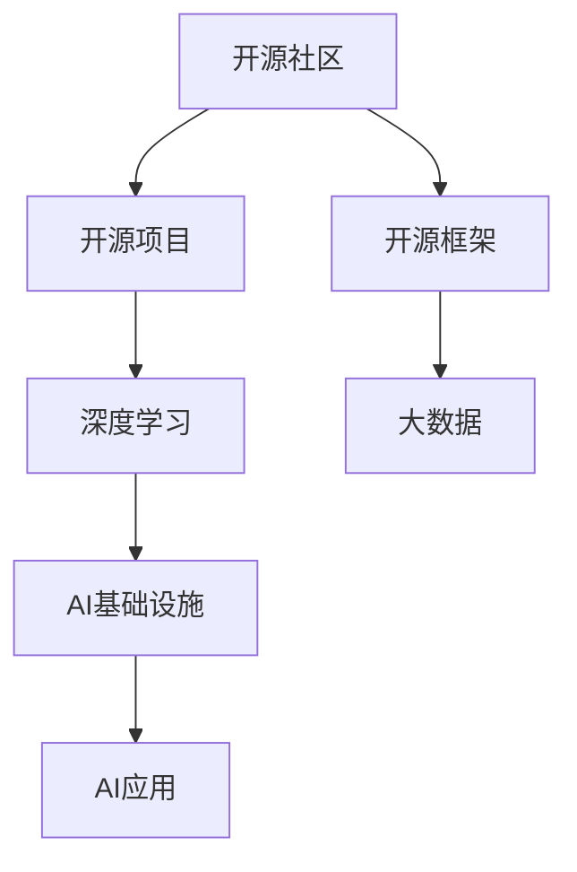

                 

# 开源技术在AI进步中的作用

> 关键词：开源社区,人工智能,机器学习,深度学习,大数据,开源框架,开源项目

## 1. 背景介绍

### 1.1 问题由来
人工智能（AI）正经历着前所未有的飞速发展，其核心驱动力之一便是开源技术的广泛应用。开源社区为AI技术提供了丰富的资源和工具，为科研人员和开发者们提供了强大的支持。

从早期的PyTorch和TensorFlow，到后来的OpenAI的GPT系列模型、Google的BERT等，开源技术正日益成为推动AI进步的关键因素。AI的进步离不开开源社区的广泛贡献和支持，而开源社区也借此蓬勃发展。

### 1.2 问题核心关键点
本文将详细探讨开源技术在AI发展中的重要作用，分析开源框架、工具和数据集等关键资源，以及它们是如何推动AI技术的快速进步和广泛应用的。

## 2. 核心概念与联系

### 2.1 核心概念概述

为深入理解开源技术在AI进步中的作用，本节将介绍几个关键概念：

- **开源社区**：一个开放的社区，成员共同开发和分享软件，免费使用和分发，推动技术进步。
- **开源框架**：一套开放源代码的软件库和工具，为开发者提供高效、灵活的AI开发环境。
- **开源项目**：开源社区内基于某种特定目标的协作开发项目，如机器学习算法、数据集等。
- **深度学习**：一种基于神经网络的机器学习技术，能够处理复杂、高维度的数据。
- **大数据**：规模巨大、复杂度高、难以处理的数据集，为深度学习提供了丰富的训练数据。
- **AI基础设施**：支持AI研究和开发的软硬件资源，包括高性能计算、云计算等。

这些概念共同构成了开源技术在AI发展中的基础框架，其相互作用推动了AI技术的不断进步。

### 2.2 核心概念原理和架构的 Mermaid 流程图



这个流程图展示了开源技术在AI发展中的作用：开源社区为开源框架和开源项目提供了协作环境，而开源框架和大数据又为深度学习和AI基础设施提供了支持，最终推动了AI应用的发展。

## 3. 核心算法原理 & 具体操作步骤

### 3.1 算法原理概述

开源技术在AI进步中的作用，主要体现在以下几个方面：

- **开源框架**：提供了高效、灵活的AI开发环境，使得科研人员和开发者可以更加便捷地实现AI算法。
- **开源项目**：丰富了AI技术生态，为开发者提供了广泛的算法和数据集支持。
- **开源社区**：促进了AI技术的共享与交流，加速了技术进步。

### 3.2 算法步骤详解

开源技术在AI进步中的具体操作步骤如下：

1. **选择开源框架**：根据项目需求选择合适的开源框架，如TensorFlow、PyTorch等。
2. **安装和配置**：在本地或云端环境中安装和配置所选的开源框架。
3. **使用开源项目**：根据具体任务，从开源社区寻找和下载合适的开源项目，包括预训练模型、算法库等。
4. **训练和优化**：使用开源框架和工具，对数据进行预处理、训练模型，并根据性能调整超参数。
5. **应用和部署**：将训练好的模型应用到实际业务场景中，并进行优化和部署。
6. **持续更新**：持续关注开源社区的更新，及时获取最新的技术进展和资源。

### 3.3 算法优缺点

开源技术在AI进步中具有以下优点：

- **高效灵活**：开源框架和工具提供了丰富的功能和灵活性，使得开发者可以快速实现算法和应用。
- **成本低廉**：开源软件免费使用和分发，降低了研究和开发的成本。
- **社区支持**：开源社区提供了大量的文档、教程和支持，帮助开发者解决技术问题。

同时，开源技术也存在一些缺点：

- **质量参差不齐**：开源项目质量不一，可能存在错误或性能问题。
- **依赖问题**：依赖于第三方库可能导致兼容性问题。
- **学习曲线陡峭**：某些开源框架和工具的学习曲线较陡，需要较高的技术门槛。

### 3.4 算法应用领域

开源技术在多个AI应用领域都发挥了重要作用：

- **计算机视觉**：OpenCV、TensorFlow等开源工具为图像处理、目标检测等提供了强大支持。
- **自然语言处理**：BERT、GPT等预训练模型，以及NLTK、SpaCy等开源工具，推动了NLP领域的快速发展。
- **机器学习**：Scikit-learn、XGBoost等开源算法库，为科研和工程应用提供了广泛的支持。
- **大数据处理**：Hadoop、Spark等开源项目，使得大规模数据处理变得高效可行。
- **深度学习**：TensorFlow、PyTorch等开源框架，为深度学习研究提供了强大的工具。

## 4. 数学模型和公式 & 详细讲解 & 举例说明

### 4.1 数学模型构建

为了深入理解开源技术在AI中的应用，我们以深度学习中的卷积神经网络（Convolutional Neural Network, CNN）为例，介绍其数学模型的构建。

卷积神经网络的基本结构包括卷积层、池化层、全连接层等。其前向传播的数学模型如下：

$$
\text{forward}(Z) = \text{ReLU}(\text{Conv}(\text{ReLU}(\text{Conv}(X)), \theta^c_1) + \theta^c_2) + \theta^f
$$

其中，$X$ 为输入数据，$\theta^c_1$、$\theta^c_2$、$\theta^f$ 分别为卷积层、全连接层的权重和偏置，$\text{Conv}$ 表示卷积操作，$\text{ReLU}$ 为激活函数。

### 4.2 公式推导过程

卷积神经网络的后向传播算法可以基于前向传播的梯度反向传播。假设目标为 $y$，损失函数为 $L$，则后向传播的数学模型如下：

$$
\frac{\partial L}{\partial \theta} = \frac{\partial L}{\partial Z} \cdot \frac{\partial Z}{\partial X}
$$

其中，$\frac{\partial L}{\partial Z}$ 表示对输出 $Z$ 的损失梯度，$\frac{\partial Z}{\partial X}$ 表示对输入 $X$ 的导数。

### 4.3 案例分析与讲解

以LeNet-5为例，介绍卷积神经网络的应用。LeNet-5是一个经典的卷积神经网络，用于手写数字识别任务。通过使用开源工具TensorFlow，可以方便地构建和训练LeNet-5网络，其代码如下：

```python
import tensorflow as tf
from tensorflow.keras import layers

model = tf.keras.Sequential([
    layers.Conv2D(6, (3, 3), activation='relu', input_shape=(28, 28, 1)),
    layers.MaxPooling2D((2, 2)),
    layers.Conv2D(16, (3, 3), activation='relu'),
    layers.MaxPooling2D((2, 2)),
    layers.Flatten(),
    layers.Dense(120, activation='relu'),
    layers.Dense(10, activation='softmax')
])

model.compile(optimizer='adam',
              loss='categorical_crossentropy',
              metrics=['accuracy'])

model.fit(train_images, train_labels, epochs=5)
```

这个例子展示了如何利用开源工具TensorFlow，快速构建和训练卷积神经网络。

## 5. 项目实践：代码实例和详细解释说明

### 5.1 开发环境搭建

在开始项目实践之前，需要先搭建好开发环境。以下是使用Python进行TensorFlow开发的指南：

1. 安装Anaconda：从官网下载并安装Anaconda，用于创建独立的Python环境。

2. 创建并激活虚拟环境：
```bash
conda create -n tensorflow-env python=3.8 
conda activate tensorflow-env
```

3. 安装TensorFlow：根据CUDA版本，从官网获取对应的安装命令。例如：
```bash
conda install tensorflow tensorflow-gpu -c conda-forge
```

4. 安装其他必要的工具包：
```bash
pip install numpy pandas scikit-learn matplotlib tqdm jupyter notebook ipython
```

完成上述步骤后，即可在`tensorflow-env`环境中开始项目开发。

### 5.2 源代码详细实现

我们以图像分类任务为例，展示如何使用TensorFlow进行开源项目的应用。

```python
import tensorflow as tf
from tensorflow.keras import layers

model = tf.keras.Sequential([
    layers.Conv2D(32, (3, 3), activation='relu', input_shape=(28, 28, 1)),
    layers.MaxPooling2D((2, 2)),
    layers.Conv2D(64, (3, 3), activation='relu'),
    layers.MaxPooling2D((2, 2)),
    layers.Flatten(),
    layers.Dense(64, activation='relu'),
    layers.Dense(10, activation='softmax')
])

model.compile(optimizer='adam',
              loss='categorical_crossentropy',
              metrics=['accuracy'])

model.fit(train_images, train_labels, epochs=5)
```

### 5.3 代码解读与分析

上述代码展示了如何使用TensorFlow构建和训练一个简单的卷积神经网络，用于图像分类任务。具体来说：

- `Sequential` 模型定义了一个简单的线性堆叠模型。
- 第一层为卷积层，使用 `Conv2D` 层，设置卷积核大小为 (3,3)，输出通道数为 32，使用 ReLU 激活函数。
- 第二层为池化层，使用 `MaxPooling2D` 层，池化大小为 (2,2)。
- 第三层和第四层结构类似，卷积层和池化层交替出现，以提高模型的深度和表达能力。
- 第五层为全连接层，使用 `Dense` 层，设置节点数为 64，使用 ReLU 激活函数。
- 第六层为输出层，使用 `Dense` 层，设置节点数为 10，使用 softmax 激活函数，用于分类。

在模型编译时，使用 `adam` 优化器和交叉熵损失函数。在模型训练时，使用 `fit` 方法，指定训练集、标签集和训练轮数。

### 5.4 运行结果展示

训练完成后，可以使用测试集进行模型评估，例如：

```python
test_loss, test_acc = model.evaluate(test_images, test_labels, verbose=2)
print('Test accuracy:', test_acc)
```

可以看到，测试集上的准确率指标，可以评估模型的性能。

## 6. 实际应用场景

### 6.1 智能推荐系统

智能推荐系统是AI技术的重要应用之一。基于开源技术的推荐系统可以高效地处理大规模数据，实现个性化推荐。

例如，Netflix使用TensorFlow构建了推荐系统，通过对用户行为数据的分析，为用户推荐个性化的电影和电视节目。通过使用开源社区提供的模型和算法，Netflix可以快速迭代和优化推荐算法，提升用户体验。

### 6.2 自动驾驶

自动驾驶是AI技术的另一重要应用领域。通过开源技术，可以实现高效的数据处理和模型训练，提高自动驾驶的准确性和可靠性。

例如，Waymo使用开源工具TensorFlow和PyTorch构建了自动驾驶模型，通过大规模数据集进行训练，实现了高效的道路场景理解和安全决策。

### 6.3 医疗诊断

在医疗诊断领域，AI技术可以帮助医生更准确地进行疾病诊断。基于开源技术的AI诊断系统可以高效地处理医学图像和文本数据，提高诊断的准确性和效率。

例如，Google Health使用开源框架TensorFlow构建了医疗图像分类模型，通过对医学图像的深度学习，实现了多种疾病的自动诊断。

### 6.4 未来应用展望

未来，开源技术在AI发展中的作用将进一步凸显。随着AI技术的不断进步，开源社区将提供更加丰富和高效的工具和资源，推动AI技术的广泛应用和产业化。

1. **自监督学习**：通过大规模无标签数据，实现更高效和鲁棒的AI模型训练。
2. **联邦学习**：在分布式环境中，实现高效的数据共享和模型训练。
3. **边缘计算**：在本地设备上实现高效的AI模型推理和部署。
4. **开源算法库**：提供更多高性能、易用性强的算法库，加速科研和工程应用。
5. **开源数据集**：提供更多高质量、大规模的数据集，支持更广泛的AI研究和应用。

## 7. 工具和资源推荐

### 7.1 学习资源推荐

为了帮助开发者掌握开源技术在AI中的应用，这里推荐一些优质的学习资源：

1. TensorFlow官方文档：提供了详细的API文档和教程，帮助开发者快速上手TensorFlow。
2. PyTorch官方文档：提供了丰富的API文档和示例，支持PyTorch的深度学习开发。
3. Keras官方文档：提供了简单易用的高级API，适合初学者使用。
4. Coursera《深度学习专项课程》：由深度学习专家Andrew Ng教授，涵盖深度学习的基础和实践。
5. Udacity《机器学习工程师纳米学位》：涵盖机器学习算法和开源工具，适合工程应用。
6. GitHub开源项目：提供了丰富的开源代码和示例，支持开发者学习和实践。

### 7.2 开发工具推荐

高效的开发离不开优秀的工具支持。以下是几款用于AI开发的常用工具：

1. Jupyter Notebook：提供了交互式的编程环境，支持Python、R等多种语言。
2. PyCharm：支持Python和TensorFlow等开源工具的开发环境，提供高效的IDE功能。
3. Visual Studio Code：支持Python和TensorFlow等开源工具的开发环境，提供了丰富的扩展插件。
4. Git和GitHub：提供了版本控制和代码托管服务，支持开发者协作开发。
5. Docker：提供了轻量级的容器化解决方案，支持开发者部署和管理模型。

### 7.3 相关论文推荐

开源技术在AI发展中的作用，引起了学术界的广泛关注。以下是几篇奠基性的相关论文，推荐阅读：

1. TensorFlow: A System for Large-Scale Machine Learning：介绍TensorFlow的架构和应用。
2. PyTorch: An Open Source Machine Learning Library：介绍PyTorch的架构和应用。
3. Scikit-learn: Machine Learning in Python：介绍Scikit-learn的机器学习算法和应用。
4. Google's Web Search Experiments with Deep Neural Networks：介绍TensorFlow在Web搜索中的应用。
5. Training Deep Architectures for Semantic Segmentation：介绍TensorFlow在图像分割中的应用。

## 8. 总结：未来发展趋势与挑战

### 8.1 总结

本文对开源技术在AI发展中的作用进行了全面系统的介绍。首先阐述了开源技术在AI发展中的重要作用，明确了开源社区、框架和项目等关键资源对AI进步的推动作用。其次，从原理到实践，详细讲解了开源框架的应用方法，并给出了代码实例和详细解释说明。同时，本文还广泛探讨了开源技术在智能推荐、自动驾驶、医疗诊断等实际应用场景中的应用前景，展示了开源技术的广阔应用空间。最后，本文精选了开源技术的各类学习资源，力求为读者提供全方位的技术指引。

通过对这些资源的学习实践，相信你一定能够快速掌握开源技术在AI中的关键作用，并用于解决实际的AI问题。

### 8.2 未来发展趋势

展望未来，开源技术在AI发展中仍将持续发挥重要作用。以下趋势将进一步推动AI技术的发展：

1. **自监督学习**：通过大规模无标签数据，实现更高效和鲁棒的AI模型训练。
2. **联邦学习**：在分布式环境中，实现高效的数据共享和模型训练。
3. **边缘计算**：在本地设备上实现高效的AI模型推理和部署。
4. **开源算法库**：提供更多高性能、易用性强的算法库，加速科研和工程应用。
5. **开源数据集**：提供更多高质量、大规模的数据集，支持更广泛的AI研究和应用。

### 8.3 面临的挑战

尽管开源技术在AI发展中发挥了重要作用，但在其发展和应用过程中仍面临一些挑战：

1. **质量参差不齐**：开源项目质量不一，可能存在错误或性能问题。
2. **依赖问题**：依赖于第三方库可能导致兼容性问题。
3. **学习曲线陡峭**：某些开源框架和工具的学习曲线较陡，需要较高的技术门槛。
4. **性能瓶颈**：大规模模型的训练和推理可能面临硬件瓶颈。
5. **数据隐私**：在分布式环境中，数据隐私和安全问题需要重点关注。

### 8.4 研究展望

未来，开源技术在AI发展中将面临新的挑战和机遇。研究者需要关注以下方向：

1. **提高开源项目质量**：通过社区协作，提高开源项目的一致性和稳定性。
2. **降低学习门槛**：提供更易用的工具和文档，降低学习曲线。
3. **优化性能瓶颈**：开发更高效的工具和算法，优化性能瓶颈。
4. **加强数据隐私保护**：确保数据隐私和安全，支持联邦学习等分布式训练方法。

总之，开源技术在AI发展中将发挥更加重要的作用，但也需要不断优化和改进。只有在开源社区、科研机构和工业界共同努力下，才能实现AI技术的持续进步和广泛应用。

## 9. 附录：常见问题与解答

**Q1：开源技术是否只适用于科研？**

A: 开源技术不仅适用于科研，也广泛应用于工业界。工业界通过开源技术，实现了高效和低成本的AI应用开发，推动了技术的产业化进程。

**Q2：开源框架是否存在性能瓶颈？**

A: 开源框架在处理大规模数据和复杂模型时，可能面临性能瓶颈。开发者需要通过优化代码、调整超参数等手段，提高模型的运行效率。

**Q3：开源项目质量如何保证？**

A: 开源项目质量参差不齐，开发者需要仔细评估和选择开源项目，可以参考社区评价和代码质量等指标。

**Q4：如何处理开源项目依赖问题？**

A: 依赖问题可能影响模型的兼容性和稳定性。开发者需要仔细处理依赖项，保持不同开源项目之间的兼容性。

**Q5：开源技术是否适用于跨领域应用？**

A: 开源技术适用于多种应用领域，包括自然语言处理、计算机视觉、语音识别等。通过跨领域应用，可以更好地实现AI技术的普适性和实用性。

---

作者：禅与计算机程序设计艺术 / Zen and the Art of Computer Programming

