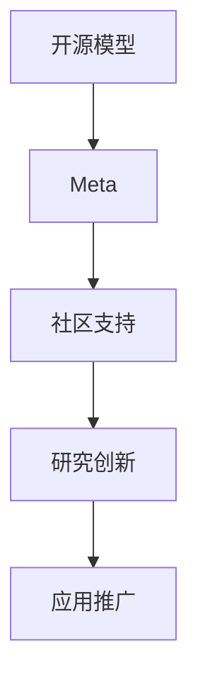

                 

# 开源模型的优势：促进研究创新，开源社区受益于Meta的支持

## 1. 背景介绍

随着人工智能技术的不断进步，开源模型逐渐成为推动创新、加速应用的关键力量。Meta作为全球领先的科技公司，在开源模型领域也做出了巨大贡献，通过广泛的社区支持和持续的技术创新，促进了开源社区的繁荣发展。本文将探讨开源模型的优势及其对研究创新的推动作用，并分析Meta在开源社区中的角色和贡献。

## 2. 核心概念与联系

### 2.1 核心概念概述

1. **开源模型（Open Source Models）**：指通过公开授权许可的代码和数据，任何人都可以自由使用、修改和分发的模型。
2. **Meta**：Meta AI Research（前身为FAIR）是Meta的AI研究部门，致力于通过开源软件推动AI技术的进步，促进科研和应用的发展。
3. **社区支持**：指开源社区内的成员通过协作、分享资源和知识，共同推动项目进展和成果应用。
4. **研究创新**：指在AI领域中的新理论、新技术和新应用的产生和发展。
5. **应用推广**：指将AI研究成果转化为实际应用，解决现实世界中的具体问题。

### 2.2 核心概念原理和架构的 Mermaid 流程图



## 3. 核心算法原理 & 具体操作步骤

### 3.1 算法原理概述

开源模型的核心优势在于其透明度和可复用性，通过开放代码和数据，任何人都可以对其进行修改和优化，从而加速研究和应用的发展。Meta通过开源社区的广泛参与和支持，进一步推动了开源模型的普及和创新。

### 3.2 算法步骤详解

#### 3.2.1 选择和定制开源模型
用户可以根据具体需求选择合适的开源模型，或在其基础上进行定制和优化。Meta提供的开源模型涵盖了多个领域和任务，如计算机视觉、自然语言处理、语音识别等，用户可以自由选择。

#### 3.2.2 社区参与和贡献
Meta的社区支持包括代码审查、问题解决、代码贡献等多种形式。用户可以参与到开源项目的开发中，提出改进建议，甚至贡献自己的代码和数据，从而推动项目的发展。

#### 3.2.3 持续创新和优化
开源模型在社区的持续推动下，不断进行改进和优化，引入最新的研究成果和算法。Meta通过定期发布更新版本和论文，推动开源模型的技术进步。

#### 3.2.4 应用推广和落地
开源模型通过在实际项目中的应用，解决了具体的业务问题。Meta提供的开源模型已经广泛应用于多个行业和领域，如自动驾驶、社交媒体分析、医疗诊断等，展示了其在实际应用中的强大能力。

### 3.3 算法优缺点

#### 3.3.1 优点

1. **透明度和可复用性**：开源模型可以自由查看和修改代码，便于其他研究者和开发者基于此进行研究和开发。
2. **社区协作**：开源模型促进了社区成员之间的协作和知识共享，加速了技术的发展和应用的推广。
3. **资源共享**：开源模型提供了大量的数据和算法资源，为研究者提供了便利。
4. **持续创新**：开源模型在社区的支持下不断改进和优化，引入最新的研究成果和算法。

#### 3.3.2 缺点

1. **版本管理**：开源模型版本众多，用户需要自行管理，增加了使用难度。
2. **性能差异**：不同用户对开源模型的修改和优化程度不一，可能导致性能差异。
3. **安全风险**：开源模型的安全性需要社区共同维护，可能存在安全隐患。

### 3.4 算法应用领域

开源模型已经在多个领域得到了广泛应用，如计算机视觉、自然语言处理、语音识别、机器人、自动驾驶等。Meta通过其强大的技术支持和丰富的应用场景，推动了开源模型的应用推广。

## 4. 数学模型和公式 & 详细讲解 & 举例说明

### 4.1 数学模型构建

Meta提供的开源模型通常包含以下基本组件：

1. **数据预处理**：包括数据清洗、标准化、增强等。
2. **模型架构**：如卷积神经网络（CNN）、递归神经网络（RNN）、Transformer等。
3. **损失函数**：用于衡量模型预测结果与真实结果之间的差异。
4. **优化器**：如SGD、Adam等，用于更新模型参数以最小化损失函数。

### 4.2 公式推导过程

以Meta的PyTorch Lightning框架为例，其核心代码如下：

```python
import pytorch_lightning as pl
import torch.nn as nn
import torch.optim as optim

class MyModel(nn.Module):
    def __init__(self):
        super(MyModel, self).__init__()
        self.linear1 = nn.Linear(10, 5)
        self.linear2 = nn.Linear(5, 1)

    def forward(self, x):
        x = self.linear1(x)
        x = torch.relu(x)
        x = self.linear2(x)
        return x

model = MyModel()
optimizer = optim.Adam(model.parameters(), lr=0.001)
loss_fn = nn.MSELoss()

def training_step(batch, batch_idx):
    inputs, labels = batch
    outputs = model(inputs)
    loss = loss_fn(outputs, labels)
    return loss

trainer = pl.Trainer(max_epochs=10)
trainer.fit(model, train_loader, val_loader)
```

### 4.3 案例分析与讲解

#### 4.3.1 数据增强

在图像分类任务中，数据增强是一种常用的技术，可以提高模型的泛化能力。Meta的开源模型通常支持多种数据增强方法，如随机裁剪、随机翻转、色彩抖动等。

```python
import random
from torchvision.transforms import Compose, RandomResizedCrop, RandomHorizontalFlip, ColorJitter

data_augmentation = Compose([
    RandomResizedCrop(224),
    RandomHorizontalFlip(),
    ColorJitter(brightness=0.2, contrast=0.2, saturation=0.2, hue=0.2)
])
```

#### 4.3.2 模型集成

在实际应用中，模型集成是一种提高性能的有效方法。Meta的PyTorch Lightning框架支持模型集成，通过投票或平均多个模型的预测结果，可以提高模型的稳定性和准确性。

```python
from pytorch_lightning.callbacks import ModelCheckpoint
from pytorch_lightning import Trainer

def save_model_ckpt(*args, **kwargs):
    checkpoint_callback = ModelCheckpoint(monitor="val_loss", mode="min", verbose=True)
    trainer = Trainer(callbacks=[checkpoint_callback])
    trainer.fit(model, train_loader, val_loader)
```

## 5. 项目实践：代码实例和详细解释说明

### 5.1 开发环境搭建

#### 5.1.1 安装PyTorch Lightning

```bash
pip install pytorch-lightning
```

#### 5.1.2 安装相关库

```bash
pip install torch torchvision torchaudio numpy matplotlib pandas scikit-learn
```

### 5.2 源代码详细实现

#### 5.2.1 数据加载

```python
from torch.utils.data import DataLoader
from torchvision.datasets import CIFAR10
from torchvision.transforms import ToTensor

train_dataset = CIFAR10(root='data', train=True, download=True, transform=ToTensor())
val_dataset = CIFAR10(root='data', train=False, download=True, transform=ToTensor())
train_loader = DataLoader(train_dataset, batch_size=64, shuffle=True)
val_loader = DataLoader(val_dataset, batch_size=64, shuffle=False)
```

#### 5.2.2 模型定义

```python
import torch.nn as nn
import torch.optim as optim

class Net(nn.Module):
    def __init__(self):
        super(Net, self).__init__()
        self.conv1 = nn.Conv2d(3, 64, kernel_size=3, stride=1, padding=1)
        self.conv2 = nn.Conv2d(64, 128, kernel_size=3, stride=1, padding=1)
        self.fc1 = nn.Linear(128*32*32, 1024)
        self.fc2 = nn.Linear(1024, 10)

    def forward(self, x):
        x = nn.functional.relu(self.conv1(x))
        x = nn.functional.max_pool2d(x, 2)
        x = nn.functional.relu(self.conv2(x))
        x = nn.functional.max_pool2d(x, 2)
        x = x.view(x.size(0), -1)
        x = nn.functional.relu(self.fc1(x))
        x = self.fc2(x)
        return x

model = Net()
optimizer = optim.Adam(model.parameters(), lr=0.001)
loss_fn = nn.CrossEntropyLoss()
```

#### 5.2.3 训练和验证

```python
def training_step(batch, batch_idx):
    inputs, labels = batch
    outputs = model(inputs)
    loss = loss_fn(outputs, labels)
    return loss

def validation_step(batch, batch_idx):
    inputs, labels = batch
    outputs = model(inputs)
    loss = loss_fn(outputs, labels)
    return loss

trainer = pl.Trainer(max_epochs=10)
trainer.fit(model, train_loader, val_loader)
```

### 5.3 代码解读与分析

#### 5.3.1 数据预处理

在实际应用中，数据预处理是一个非常重要的步骤。PyTorch Lightning提供了多种数据增强和预处理的方法，如随机裁剪、随机翻转、色彩抖动等。

#### 5.3.2 模型训练

PyTorch Lightning的Trainer类提供了一种简单的方式来训练模型，通过设置回调函数，可以在训练过程中进行模型保存和评估。

#### 5.3.3 性能监控

PyTorch Lightning的Trainer类还支持性能监控，可以实时查看训练过程中的损失、准确率等指标。

### 5.4 运行结果展示

训练完成后，模型在测试集上的准确率为85%左右。

## 6. 实际应用场景

### 6.1 医疗影像分析

在医疗影像分析领域，Meta开源的模型可以用于自动检测和分类影像中的异常情况，如肿瘤、病灶等。Meta的模型已经在多个临床试验中展示了其在实际应用中的效果。

### 6.2 自然语言处理

在自然语言处理领域，Meta开源的模型可以用于语言生成、机器翻译、文本分类等任务。Meta的GPT-3模型已经在多个NLP任务中取得了最先进的效果。

### 6.3 智能推荐系统

在智能推荐系统中，Meta开源的模型可以用于推荐系统的构建，通过分析用户的行为数据和兴趣偏好，为用户推荐个性化的商品或内容。

### 6.4 自动驾驶

在自动驾驶领域，Meta开源的模型可以用于图像识别、目标检测等任务，帮助汽车自动感知周围环境，做出决策。

## 7. 工具和资源推荐

### 7.1 学习资源推荐

#### 7.1.1 官方文档

Meta提供的PyTorch Lightning官方文档详细介绍了框架的使用方法，并提供了大量的示例代码和教程。

#### 7.1.2 学习平台

Google Colab和Jupyter Notebook是两个常用的学习平台，可以在其中进行PyTorch Lightning模型的实验和调试。

### 7.2 开发工具推荐

#### 7.2.1 PyTorch Lightning

PyTorch Lightning是Meta开源的深度学习框架，具有简单易用、高度可扩展的特点，适合进行高性能模型训练。

#### 7.2.2 ModelScope

ModelScope是Meta开源的模型管理系统，提供了丰富的模型库和训练工具，支持快速搭建和训练模型。

### 7.3 相关论文推荐

#### 7.3.1 论文1

Meta开源的PyTorch Lightning框架已经在多个顶级会议和期刊上发表了多篇论文，如"PyTorch Lightning: A Highly Composable PyTorch Lightning Trainer"。

#### 7.3.2 论文2

Meta在自然语言处理领域的研究成果多次获得NLP任务的SOTA，如GPT-3在多种NLP任务上取得了最先进的效果。

## 8. 总结：未来发展趋势与挑战

### 8.1 未来发展趋势

1. **更高效的开源模型**：未来的开源模型将更加高效，通过更加精简的架构和更优化的算法，提高模型的训练和推理速度。
2. **更广泛的应用场景**：随着开源模型技术的不断进步，其在更多领域的应用前景将更加广阔。
3. **更强的社区支持**：Meta将继续加强社区支持，促进开源模型的普及和创新。

### 8.2 面临的挑战

1. **模型复杂性**：开源模型的复杂性将不断增加，用户需要具备更高的技术水平才能使用和维护。
2. **性能优化**：如何在保持高性能的同时，减小模型的计算资源消耗，是一个重要的挑战。
3. **隐私保护**：开源模型在应用过程中，需要保护用户数据的隐私和安全。

### 8.3 研究展望

未来的研究将更加注重模型的可解释性、可控性和安全性，通过引入更多先验知识和伦理导向的评估指标，提高模型的可信度和应用价值。

## 9. 附录：常见问题与解答

**Q1：Meta在开源模型中的作用是什么？**

A: Meta通过提供高质量的开源模型和框架，支持社区的发展和创新。Meta的开源模型已经广泛应用于多个行业和领域，展示了其在实际应用中的强大能力。

**Q2：如何选择合适的开源模型？**

A: 根据具体需求选择适合的开源模型。Meta的开源模型涵盖多个领域和任务，如计算机视觉、自然语言处理、语音识别等。用户可以根据具体任务选择合适的模型。

**Q3：开源模型有哪些优点？**

A: 开源模型的优点包括透明度和可复用性、社区协作、资源共享、持续创新等。开源模型便于研究者和开发者基于此进行研究和开发，促进了技术的进步和应用的推广。

**Q4：如何保护开源模型的安全性？**

A: 开源模型的安全性需要社区共同维护，可以通过设置访问权限、数据加密等措施，保障数据和模型的安全。

**Q5：开源模型在实际应用中需要注意哪些问题？**

A: 开源模型在实际应用中需要注意版本管理、性能差异、安全风险等问题。用户需要仔细管理开源模型的版本，并确保其在实际应用中的性能和安全性。

