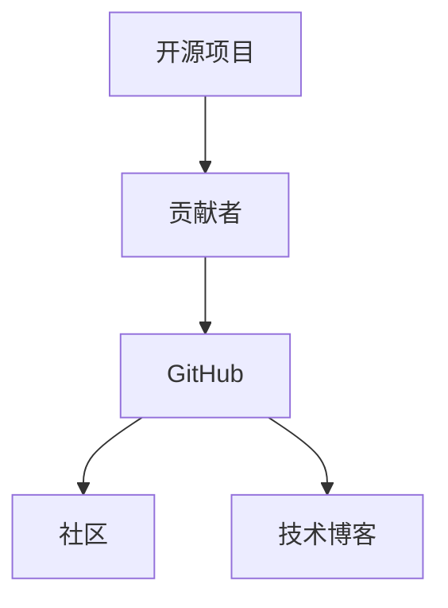

                 

## 1. 背景介绍

在当今数字化、开源驱动的软件开发生态中，开源贡献（Contribution to Open Source Projects）成为了许多软件开发人员和工程师简历中的一项重要亮点。无论是应届生、经验丰富的开发者，还是专业软件架构师，开源贡献不仅能展示个人的技术能力和项目经验，还能在潜在的雇主面前树立良好的专业形象。因此，本文将深入探讨开源贡献的价值，并指导如何有效展示和利用这些贡献，以提升个人职业发展的竞争力。

## 2. 核心概念与联系

### 2.1 核心概念概述

在开始深入探讨开源贡献的价值和展示方法之前，首先需要理解几个核心概念：

- **开源项目（Open Source Projects）**：指使用开源许可证（如Apache、MIT等）发布、供任何人自由使用、修改和分发软件的项目。

- **开源贡献（Contribution to Open Source Projects）**：指开发者向开源项目提交代码、文档、设计等，以帮助项目改进和发展的行为。

- **GitHub**：全球最大的代码托管平台之一，开源社区的主要活动基地，开发者们通过GitHub管理代码、协作开发、分享成果。

- **社区（Community）**：指围绕一个开源项目聚集的开发者群体，包括核心开发者、贡献者、用户等，社区是项目生态的重要组成部分。

- **技术博客**：指开发者在个人或公司博客上分享技术经验、项目成果、学习心得的写作形式，也是展示个人品牌和影响力的一种方式。

这些概念之间的联系如下：开源贡献是开发者通过GitHub等平台为开源项目做出贡献，通常包括编写代码、修复Bug、优化性能、改进文档等。这些贡献不仅增强了项目的质量和可用性，也提升了开发者在社区中的知名度和影响力。同时，技术博客是展示这些贡献的重要渠道，通过分享经验和技术，可以进一步巩固和扩大这些影响。

### 2.2 核心概念原理和架构的 Mermaid 流程图



这个流程图展示了开源贡献、GitHub、社区和技术博客之间的联系。开发者向开源项目（A）贡献代码和技术，通过GitHub（C）提交和管理代码，从而融入项目社区（D），并通过技术博客（E）分享经验和展示成果。

## 3. 核心算法原理 & 具体操作步骤

### 3.1 算法原理概述

开源贡献的价值在于其对项目生态的影响。一个优秀的开源贡献通常能够：

- 增强项目的稳定性和性能
- 吸引更多的开发者参与项目
- 扩大项目的用户基础和影响力

具体来说，开源贡献的价值可以分为以下几个方面：

- **技术价值**：贡献代码、修复Bug等，提升项目的技术水平和用户体验。
- **社区价值**：通过积极参与社区讨论、文档编写等，促进社区氛围，提升项目活力。
- **影响力价值**：通过技术博客等形式分享项目成果，提升个人品牌和影响力。

### 3.2 算法步骤详解

展示和利用开源贡献的步骤如下：

1. **选择合适的开源项目**：
   - 评估自己的技能和兴趣，寻找与专业背景和兴趣相符的项目。
   - 关注项目的活跃度、社区规模和贡献方向，确保项目的成长性和可持续性。

2. **开始贡献**：
   - 通过GitHub等平台，注册账号并加入项目。
   - 了解项目的贡献流程和规范，包括代码风格、代码审查等。
   - 开始编写代码、修复Bug、优化性能等，并提交Pull Request（PR）。

3. **参与社区活动**：
   - 积极参与项目讨论、问题解决、代码审查等，建立良好的社区关系。
   - 提出改进建议，参与项目规划和设计，提升项目的整体方向。

4. **展示和分享**：
   - 在个人博客或公司博客上撰写技术文章，分享贡献经历和技术心得。
   - 在社交媒体、技术论坛上分享开源贡献成果，提升个人品牌和影响力。

### 3.3 算法优缺点

开源贡献的主要优点包括：

- **技术提升**：在实践中学习新技术、提升编程能力。
- **社区认可**：获得社区成员的认可和感谢，提升职业成就感。
- **职业竞争力**：展示技术能力和项目经验，提升简历的吸引力。

主要缺点包括：

- **时间投入**：开源贡献需要花费大量时间和精力，可能影响日常工作。
- **潜在风险**：开源项目的不确定性可能带来风险，如代码不被接受或项目停止维护等。
- **成果认可度**：贡献成果有时可能不易量化，难以在简历中直接展示。

### 3.4 算法应用领域

开源贡献广泛应用于软件开发、数据分析、机器学习等多个领域。例如：

- **软件开发**：贡献代码、修复Bug、优化性能等。
- **数据分析**：处理数据、编写脚本、开发分析工具等。
- **机器学习**：开发和优化模型、编写训练脚本、处理数据集等。

不同领域的开源贡献展示方式略有差异，但核心方法一致。

## 4. 数学模型和公式 & 详细讲解 & 举例说明

### 4.1 数学模型构建

设一个开源项目有 $N$ 个贡献者，每位贡献者提交了 $n_i$ 次代码。设 $R$ 为贡献者收到的认可度评分，$A$ 为收到的感谢次数，$D$ 为收到的讨论次数。则数学模型可以表示为：

$$ R = \sum_{i=1}^N \alpha_i n_i $$
$$ A = \sum_{i=1}^N \beta_i n_i $$
$$ D = \sum_{i=1}^N \gamma_i n_i $$

其中，$\alpha_i, \beta_i, \gamma_i$ 为每次贡献对认可度、感谢次数、讨论次数的贡献系数。

### 4.2 公式推导过程

通过以上模型，可以推导出每个贡献者对项目整体价值的贡献度：

$$ V_i = \frac{\alpha_i R + \beta_i A + \gamma_i D}{N} $$

其中 $V_i$ 为第 $i$ 个贡献者的价值贡献度。

### 4.3 案例分析与讲解

假设某开源项目有 $N=1000$ 个贡献者，每个贡献者平均贡献次数为 $n_i=100$。设 $\alpha_i=0.2, \beta_i=0.3, \gamma_i=0.5$。则：

$$ R = 1000 \times 0.2 \times 100 = 20000 $$
$$ A = 1000 \times 0.3 \times 100 = 30000 $$
$$ D = 1000 \times 0.5 \times 100 = 50000 $$

每个贡献者的价值贡献度为：

$$ V_i = \frac{0.2 \times 20000 + 0.3 \times 30000 + 0.5 \times 50000}{1000} = 400 $$

因此，每个贡献者的价值贡献度为400，反映出开源贡献的实际价值。

## 5. 项目实践：代码实例和详细解释说明

### 5.1 开发环境搭建

要在GitHub上展示和利用开源贡献，首先需要配置开发环境。具体步骤如下：

1. 安装Git和GitHub Desktop或Git命令行工具。
2. 在GitHub上创建账号，注册并加入感兴趣的开源项目。
3. 安装项目依赖的开发环境，如Python、Node.js等。
4. 克隆项目代码到本地，配置代码编辑器和版本控制系统。

### 5.2 源代码详细实现

以下是一个简单的开源贡献代码实现示例：

假设我们要为一个名为 `example` 的开源项目贡献代码，项目使用 `Node.js` 和 `Express` 框架。步骤如下：

1. 克隆项目代码：
```bash
git clone https://github.com/example/example.git
cd example
```

2. 设置开发环境：
```bash
npm install
```

3. 编写代码并提交Pull Request：
```javascript
// example/app.js
const express = require('express');
const app = express();

app.get('/', (req, res) => {
  res.send('Hello, World!');
});

app.listen(3000, () => {
  console.log('Server started on port 3000');
});
```

4. 提交代码并创建Pull Request：
```bash
git add app.js
git commit -m 'Add hello world route'
git push origin master
```

在GitHub上创建一个新的Pull Request，填写PR描述，等待项目维护者审核。

### 5.3 代码解读与分析

在上述代码中，我们为 `example` 项目添加了一个简单的 `hello world` 路由，用于展示项目的启动和运行情况。

通过上述步骤，我们完成了对 `example` 项目的代码贡献，并成功创建了Pull Request。

### 5.4 运行结果展示

项目成功运行后，我们可以通过访问 `http://localhost:3000` 来查看 `hello world` 的输出。

## 6. 实际应用场景

开源贡献在实际应用场景中，可以显著提升个人职业发展的竞争力。以下是几个具体应用场景：

### 6.1 软件开发职位

在应聘软件开发职位时，开源贡献可以直接展示个人的技术能力和项目经验，增强简历的吸引力。例如：

- **招聘需求**：应聘一个Web开发者职位，要求熟悉JavaScript和Express框架。
- **简历展示**：列出在GitHub上为 `example` 项目贡献了多个功能模块，包括路由、中间件、数据库访问等。

### 6.2 技术博客和公开演讲

开源贡献还可以作为技术博客和公开演讲的重要内容，展示个人的影响力和专业水平。例如：

- **技术博客**：撰写一篇关于开源贡献的博客文章，分享自己的贡献经历和学习心得。
- **公开演讲**：在技术会议上分享开源项目贡献的经验和技术细节，提升个人知名度。

### 6.3 公司内部项目

在企业内部，开源贡献可以提升个人的技术领导力，增强项目的协作和创新能力。例如：

- **公司项目**：为公司内部项目提供开源解决方案，提升项目的开源意识和开放性。
- **技术分享**：在公司技术分享会上介绍开源贡献的经验和技术，促进团队技术交流。

## 7. 工具和资源推荐

### 7.1 学习资源推荐

- **GitHub官方文档**：提供了Git和GitHub的基本使用指南，适合初学者快速上手。
- **GitHub Learning Lab**：GitHub官方提供的在线学习平台，涵盖Git和GitHub的各个方面。
- **《开源软件的未来》（The Future of Open Source Software）**：介绍了开源社区的发展趋势和未来展望，适合了解开源生态。

### 7.2 开发工具推荐

- **Git**：版本控制系统，用于管理代码变更。
- **GitHub Desktop**：GitHub官方客户端，简化GitHub操作。
- **Visual Studio Code**：轻量级代码编辑器，支持Git和其他开发工具。

### 7.3 相关论文推荐

- **《开源软件的经济学》（The Economics of Open Source Software）**：研究开源项目的经济特性和贡献动机，适合了解开源社区的经济结构。
- **《开源社区的成功因素》（What Drives Success in Open Source Communities）**：分析开源社区成功的关键因素，适合了解社区管理和发展。

## 8. 总结：未来发展趋势与挑战

### 8.1 研究成果总结

本文通过探讨开源贡献的价值、展示和利用方法，强调了开源社区和个人职业发展的紧密联系。开源贡献不仅是技术能力的体现，更是个人品牌和影响力的重要来源。通过系统地展示和利用开源贡献，可以显著提升个人在职业发展中的竞争力。

### 8.2 未来发展趋势

开源贡献将继续在软件开发、数据分析、机器学习等领域发挥重要作用，推动技术创新和行业进步。未来趋势包括：

- **开源贡献社区化**：开源贡献将更注重社区的参与和协作，提升项目的凝聚力和可持续性。
- **开源贡献技术化**：开源贡献将更加注重技术细节和代码质量，提升项目的整体水平。
- **开源贡献普及化**：开源贡献将成为开发者必备的技能，广泛应用于各种开发场景。

### 8.3 面临的挑战

开源贡献面临的主要挑战包括：

- **时间和资源投入**：开源贡献需要投入大量时间和精力，可能影响日常工作。
- **技术差异和沟通障碍**：开源项目的社区和项目可能有技术差异，沟通和协作需要技巧。
- **项目风险和维护问题**：开源项目的不确定性和维护问题可能带来风险。

### 8.4 研究展望

未来开源贡献研究需要关注以下几个方向：

- **开源贡献自动化**：利用自动化工具和流程，提高开源贡献的效率和质量。
- **开源贡献量化**：通过数据和分析工具，量化开源贡献的影响和价值。
- **开源贡献教育**：加强开源贡献的教育和培训，提升开发者的贡献能力和素养。

通过系统地展示和利用开源贡献，开发者可以在技术能力和职业发展方面获得双重提升，成为开源社区和企业文化的重要组成部分。开源贡献不仅提升了个人在行业内的竞争力，也为开源社区的发展和创新提供了坚实的基础。面向未来，开源贡献将继续成为技术创新的重要驱动力，推动软件开发和人工智能等领域不断进步。

## 9. 附录：常见问题与解答

**Q1: 如何选择合适的开源项目？**

A: 选择合适的开源项目需要考虑以下几个因素：

1. **技能匹配**：选择与自己技术能力和兴趣相符的项目。
2. **项目活跃度**：选择活跃度和社区规模较大的项目，确保能够获得及时的反馈和支持。
3. **项目需求**：选择有明确需求和规划的项目，避免参与无效贡献。

**Q2: 开源贡献如何提升个人职业竞争力？**

A: 开源贡献通过以下方式提升个人职业竞争力：

1. **技术能力展示**：贡献代码和修复Bug等，展示个人技术能力和项目经验。
2. **社区认可**：通过积极参与社区讨论和贡献，获得社区认可和感谢。
3. **影响力提升**：通过技术博客和公开演讲等形式，提升个人品牌和影响力。

**Q3: 开源贡献是否需要花费大量时间？**

A: 开源贡献确实需要投入大量时间和精力，但可以通过以下方式提升效率：

1. **选择合适的项目**：选择感兴趣且技术水平相当的项目，减少学习成本。
2. **利用开源工具**：使用Git、GitHub Desktop等工具，简化代码提交和管理流程。
3. **团队协作**：与项目维护者和社区成员合作，共同解决问题，提高贡献效率。

**Q4: 开源贡献的成果如何量化？**

A: 开源贡献的成果可以通过以下几个方面量化：

1. **代码提交次数**：统计每次提交的代码量和修改内容。
2. **PR审核通过率**：统计提交的Pull Request被接受的比例。
3. **社区互动**：统计收到的讨论次数、感谢次数和认可度评分。

通过以上方式，可以系统地量化开源贡献的影响和价值，展示个人贡献效果。

**Q5: 开源贡献过程中如何避免技术差异？**

A: 开源贡献过程中可以通过以下方式避免技术差异：

1. **学习项目规范**：详细阅读项目文档和贡献规范，了解项目技术栈和开发标准。
2. **参与社区讨论**：积极参与项目讨论和代码审查，理解项目需求和技术细节。
3. **及时反馈和改进**：根据社区反馈和代码审查结果，及时改进代码和贡献方式。

通过以上方法，可以有效避免技术差异和沟通障碍，提升开源贡献的质量和效果。

---

作者：禅与计算机程序设计艺术 / Zen and the Art of Computer Programming

