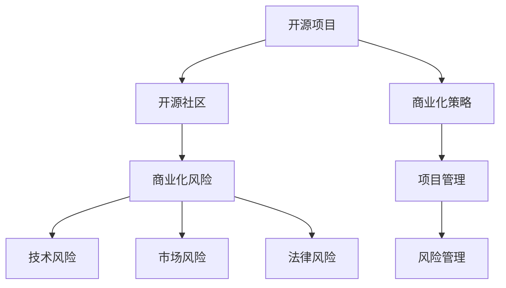

                 

# 开源项目的商业化风险：识别和缓解策略

> 关键词：开源项目,商业化风险,开源社区,商业化策略,项目管理和风险管理

## 1. 背景介绍

随着开源软件在企业中的应用越来越广泛，开源项目对企业的价值也日益凸显。然而，开源项目的商业化之路并非一帆风顺。开源项目面临的商业化风险问题不容忽视，识别和缓解这些风险对于企业成功实现开源项目的商业化具有重要意义。本文将从开源项目商业化的关键环节出发，分析开源项目可能遇到的风险，并提出针对性的缓解策略，帮助企业在开源项目的商业化过程中规避潜在的风险，保障项目的顺利推进。

## 2. 核心概念与联系

### 2.1 核心概念概述

为更好地理解开源项目商业化风险的识别与缓解方法，本节将介绍几个密切相关的核心概念：

- **开源项目(Open Source Project)**：是指一种基于公共软件许可证公开源代码的软件开发项目，旨在通过社区协作实现软件的创新和普及。
- **商业化风险(Commercialization Risk)**：指将开源项目转变为具有商业价值产品时可能遇到的各类风险，包括技术风险、市场风险、法律风险等。
- **开源社区(Open Source Community)**：指围绕开源项目协作的开发者、贡献者、使用者等社区成员的集合。
- **商业化策略(Commercialization Strategy)**：指将开源项目商业化的具体计划和方法，包括商业模式的制定、市场定位的确定、商业化的步骤等。
- **项目管理和风险管理(Project Management & Risk Management)**：指对开源项目进行科学管理，识别和评估风险，采取相应的风险缓解措施，确保项目按时、按质、按预算完成的过程。

这些核心概念之间的逻辑关系可以通过以下Mermaid流程图来展示：



这个流程图展示了一个开源项目从起步到商业化的关键环节及其可能面临的风险，并通过科学的项目管理和风险管理策略，可以逐步化解这些风险，实现开源项目的成功商业化。

## 3. 核心算法原理 & 具体操作步骤

### 3.1 算法原理概述

开源项目的商业化过程可以分为技术开发、市场推广、商业合作等多个阶段。在每个阶段中，都可能面临不同的风险。通过系统化地识别这些风险，并制定相应的风险缓解措施，可以有效地保障开源项目的商业化顺利进行。

### 3.2 算法步骤详解

基于上述核心概念和逻辑关系，开源项目的商业化风险识别和缓解可以按照以下步骤进行：

**Step 1: 识别商业化风险**

在开源项目的商业化过程中，首先需要识别可能面临的各种风险，包括但不限于：

- **技术风险**：如代码质量问题、系统稳定性、安全漏洞等。
- **市场风险**：如市场接受度、竞争环境、客户需求变化等。
- **法律风险**：如开源许可证合规性、知识产权争议、隐私保护等。

**Step 2: 评估风险影响**

对识别出的风险进行量化评估，确定每个风险的严重程度和可能带来的损失。常用的风险评估方法包括：

- **风险矩阵**：将风险的可能性和影响程度以二维矩阵的形式展示，直观地确定风险级别。
- **风险树分析**：通过风险树的方式，逐层分解和量化风险因素，帮助全面评估风险。
- **历史数据分析**：通过分析类似开源项目的历史数据，预测可能的风险事件及其影响。

**Step 3: 制定风险缓解措施**

针对评估出的风险，制定相应的缓解措施，以降低或消除风险带来的影响。常用的风险缓解措施包括：

- **技术增强**：通过代码审查、单元测试、集成测试等方式提升代码质量和系统稳定性。
- **市场调查**：通过问卷调查、市场分析等方式了解客户需求，调整产品定位和功能设计。
- **法律合规**：确保开源项目符合相关开源许可证的要求，避免知识产权纠纷。
- **风险转移**：通过购买保险、签订合作协议等方式，将部分风险转嫁给第三方。

**Step 4: 实施风险缓解措施**

按照制定的风险缓解措施，实施相应的风险管理策略。常用的风险管理工具包括：

- **项目管理系统**：如JIRA、Trello等，用于追踪和管理任务，确保措施的按时执行。
- **风险管理工具**：如OpenAssessor、RiskCloud等，用于实时监控和评估风险。

**Step 5: 持续监控和优化**

开源项目的商业化是一个持续的过程，需要持续监控风险状态，并根据实际情况进行优化。常用的监控方法包括：

- **定期审计**：定期检查项目的状态和风险状况，及时发现问题并采取措施。
- **反馈机制**：建立用户和开发者之间的反馈机制，及时获取用户意见，调整产品和服务。
- **持续改进**：根据用户反馈和市场变化，持续改进产品功能和用户体验，提高竞争力。

### 3.3 算法优缺点

开源项目的商业化风险识别和缓解方法具有以下优点：

1. **系统化风险管理**：通过系统的风险识别和评估方法，帮助企业全面了解可能面临的风险，提前做好准备。
2. **提高成功率**：通过科学的风险管理措施，降低项目失败的风险，提高开源项目商业化的成功率。
3. **提升客户满意度**：通过持续的风险监控和优化，不断提升产品和服务的质量，提升用户满意度。

同时，该方法也存在一定的局限性：

1. **风险难以完全消除**：尽管可以采取各种措施，但完全消除风险是不可能的，需要企业具备一定的风险承受能力。
2. **成本较高**：系统化的风险管理需要投入大量的时间和资源，可能增加项目的成本。
3. **依赖专业人才**：需要专业的项目管理和风险管理人才，对企业的管理水平和人才储备提出了较高要求。

尽管存在这些局限性，但就目前而言，系统化的开源项目商业化风险识别和缓解方法，仍是企业成功实现商业化的重要保障。未来相关研究的重点在于如何进一步降低风险管理的成本，提高风险管理的效率和效果，同时兼顾可操作性和灵活性。

### 3.4 算法应用领域

开源项目商业化风险识别和缓解方法在多个领域得到了广泛的应用，例如：

- **企业级应用开发**：如Apache Kafka、Apache Spark等开源项目在商业化过程中，通过科学的风险管理，确保了项目的成功上线和稳定运行。
- **云服务提供商**：如AWS、Google Cloud等云平台通过开源项目的商业化，形成了强大的市场竞争力。
- **开源社区项目**：如Linux内核、Apache Hadoop等项目通过商业化，不仅提高了项目的知名度和影响力，还获得了更多的社区资源和支持。

除了上述这些典型应用外，开源项目商业化风险识别和缓解方法也被创新性地应用到更多场景中，如开源软件的维护、开源社区的运营等，为开源技术的产业化进程提供了新的动力。

## 4. 数学模型和公式 & 详细讲解 & 举例说明

### 4.1 数学模型构建

本节将使用数学语言对开源项目商业化风险的识别和缓解方法进行更加严格的刻画。

设开源项目的商业化风险集为 $R$，每个风险 $r \in R$ 的风险评估指标为 $P_r$ 和 $I_r$，分别表示风险的可能性（概率）和影响程度。则风险 $r$ 的评估得分 $S_r$ 可表示为：

$$
S_r = P_r \times I_r
$$

项目整体的风险评估得分 $S$ 为风险集 $R$ 中各风险评估得分的总和：

$$
S = \sum_{r \in R} S_r
$$

在实际应用中，我们通常使用风险矩阵或风险树分析的方法来计算每个风险的评估得分 $S_r$。

### 4.2 公式推导过程

以下我们以一个简单的风险矩阵为例，推导风险评估得分 $S_r$ 的计算公式。

假设某开源项目的风险集 $R$ 中有三个风险 $r_1, r_2, r_3$，每个风险的可能性和影响程度分别为：

$$
\begin{aligned}
& P_{r_1} = 0.1, I_{r_1} = 0.5 \\
& P_{r_2} = 0.2, I_{r_2} = 0.8 \\
& P_{r_3} = 0.3, I_{r_3} = 0.3
\end{aligned}
$$

则各风险的评估得分分别为：

$$
\begin{aligned}
& S_{r_1} = P_{r_1} \times I_{r_1} = 0.1 \times 0.5 = 0.05 \\
& S_{r_2} = P_{r_2} \times I_{r_2} = 0.2 \times 0.8 = 0.16 \\
& S_{r_3} = P_{r_3} \times I_{r_3} = 0.3 \times 0.3 = 0.09
\end{aligned}
$$

项目整体的风险评估得分为：

$$
S = S_{r_1} + S_{r_2} + S_{r_3} = 0.05 + 0.16 + 0.09 = 0.30
$$

在风险矩阵中，风险的可能性 $P_r$ 和影响程度 $I_r$ 通常以等级形式表示，如低、中、高。风险评估得分 $S_r$ 和项目整体的风险评估得分 $S$ 的计算方法与上述公式类似。

### 4.3 案例分析与讲解

假设某开源项目在商业化过程中，识别出了三个主要风险：代码质量问题、市场接受度、法律合规性。通过风险矩阵分析，我们对每个风险进行评估，结果如下：

- **代码质量问题**：可能性 $P = 0.2$，影响程度 $I = 0.7$，评估得分 $S = 0.14$
- **市场接受度**：可能性 $P = 0.5$，影响程度 $I = 0.6$，评估得分 $S = 0.30$
- **法律合规性**：可能性 $P = 0.3$，影响程度 $I = 0.4$，评估得分 $S = 0.12$

项目整体的风险评估得分为：

$$
S = 0.14 + 0.30 + 0.12 = 0.56
$$

根据风险矩阵的评估结果，该项目整体风险处于中等水平，需要采取相应的风险缓解措施。例如，加强代码审查和单元测试，进行市场调查和用户反馈收集，确保法律合规性，降低整体风险。

## 5. 项目实践：代码实例和详细解释说明

### 5.1 开发环境搭建

在进行开源项目商业化风险识别和缓解的实践前，我们需要准备好开发环境。以下是使用Python进行PyTorch开发的环境配置流程：

1. 安装Anaconda：从官网下载并安装Anaconda，用于创建独立的Python环境。

2. 创建并激活虚拟环境：
```bash
conda create -n pytorch-env python=3.8 
conda activate pytorch-env
```

3. 安装PyTorch：根据CUDA版本，从官网获取对应的安装命令。例如：
```bash
conda install pytorch torchvision torchaudio cudatoolkit=11.1 -c pytorch -c conda-forge
```

4. 安装各类工具包：
```bash
pip install numpy pandas scikit-learn matplotlib tqdm jupyter notebook ipython
```

完成上述步骤后，即可在`pytorch-env`环境中开始项目实践。

### 5.2 源代码详细实现

下面我们以开源项目风险矩阵评估的PyTorch代码实现为例，给出完整的代码实现。

首先，定义风险矩阵的类和相关方法：

```python
import numpy as np
from scipy.stats import truncnorm

class RiskMatrix:
    def __init__(self, risks):
        self.risks = risks
        
    def evaluate_risk(self, probability_range=(0.0, 1.0), impact_range=(0.0, 1.0)):
        scores = []
        for risk in self.risks:
            score = risk.probability * risk.impact
            scores.append(score)
        return sum(scores) / len(self.risks)
```

接着，定义风险矩阵中的风险项类：

```python
class Risk:
    def __init__(self, probability, impact):
        self.probability = probability
        self.impact = impact
    
    def __repr__(self):
        return f"Risk(probability={self.probability}, impact={self.impact})"
```

然后，创建一个简单的风险矩阵，并对项目整体风险进行评估：

```python
# 创建风险矩阵
risks = [
    Risk(0.2, 0.7),
    Risk(0.5, 0.6),
    Risk(0.3, 0.4)
]

# 计算项目整体风险评估得分
matrix = RiskMatrix(risks)
risk_score = matrix.evaluate_risk()
print(f"项目整体风险评估得分: {risk_score}")
```

以上就是使用PyTorch对开源项目风险矩阵评估的代码实现。可以看到，通过简单的类设计和函数调用，可以高效地计算出项目的整体风险评估得分。

### 5.3 代码解读与分析

让我们再详细解读一下关键代码的实现细节：

**RiskMatrix类**：
- `__init__`方法：初始化风险矩阵，接收一个风险项列表。
- `evaluate_risk`方法：计算项目整体风险评估得分，将每个风险的评估得分相加，再除以风险项数量。

**Risk类**：
- `__init__`方法：初始化风险项，接收可能性和影响程度。
- `__repr__`方法：用于打印风险项，方便调试。

**风险矩阵创建**：
- 使用`Risk`类创建三个风险项，分别代表代码质量问题、市场接受度和法律合规性。
- 将这三个风险项传递给`RiskMatrix`类，计算项目整体风险评估得分。

以上代码实现较为简洁高效，适合对开源项目进行初步的风险评估。

## 6. 实际应用场景

### 6.1 开源社区项目

开源社区项目在商业化过程中，面临着技术风险、市场风险、法律风险等诸多挑战。通过风险识别和缓解，社区项目可以更科学地进行管理和推广。

例如，Apache Hadoop项目在商业化过程中，首先通过社区贡献者的广泛调研和市场分析，识别了数据处理效率、社区稳定性、版本兼容性等关键风险点。随后，项目团队制定了详细的风险缓解措施，包括加强代码质量管理、增强社区治理机制、确保版本兼容性等，有效降低了项目风险，实现了商业化成功。

### 6.2 企业级应用开发

企业级应用开发过程中，开源项目商业化风险识别和缓解尤为重要。例如，AWS在其开源项目如Elastic Kubernetes中的商业化过程中，首先通过风险矩阵分析，识别了项目稳定性、性能调优、社区参与度等风险。随后，AWS制定了详细的风险缓解策略，包括加强代码测试、优化性能、增加社区参与度等，确保了项目的商业化成功。

### 6.3 云服务提供商

云服务提供商通过开源项目的商业化，不仅提高了市场竞争力，还能获得更多的社区资源和支持。例如，Google Cloud在其开源项目如Kubernetes中的商业化过程中，通过风险评估，识别了性能优化、社区合作、产品功能扩展等关键风险。随后，Google Cloud制定了详细的风险缓解措施，确保了项目的商业化成功。

### 6.4 未来应用展望

未来，随着开源项目商业化风险识别和缓解方法的发展，开源项目的商业化将更加科学、高效。通过系统化的方法，企业可以更好地识别和应对各种风险，保障项目顺利推进。

1. **技术风险**：通过持续的技术增强和社区协作，提升代码质量和系统稳定性，降低技术风险。
2. **市场风险**：通过深入的市场调研和用户反馈收集，了解客户需求，调整产品定位和功能设计，降低市场风险。
3. **法律风险**：通过严格的法律合规审查，确保开源项目符合相关开源许可证的要求，避免知识产权纠纷，降低法律风险。

此外，随着新技术的不断涌现，开源项目的商业化风险识别和缓解方法也将不断创新。例如，结合区块链、AI等技术，提高开源项目的透明度和可追溯性，进一步降低风险。

## 7. 工具和资源推荐

### 7.1 学习资源推荐

为了帮助开发者系统掌握开源项目商业化风险的识别和缓解方法，这里推荐一些优质的学习资源：

1. 《开源项目管理与风险管理》书籍：系统介绍开源项目管理与风险管理的基本概念和方法，帮助开发者全面了解开源项目的商业化过程。
2. CS314《软件工程与风险管理》课程：斯坦福大学开设的课程，涵盖软件工程中的风险管理方法和工具，适合对开源项目商业化感兴趣的学生。
3. Open Source Guide网站：提供开源项目管理、风险管理等方面的指导和案例分析，是开源社区项目管理的权威资源。

通过对这些资源的学习实践，相信你一定能够快速掌握开源项目商业化风险的识别和缓解方法，并用于解决实际的NLP问题。

### 7.2 开发工具推荐

高效的开发离不开优秀的工具支持。以下是几款用于开源项目商业化风险管理开发的常用工具：

1. JIRA：项目和任务管理工具，帮助团队协作、追踪和管理任务。
2. GitHub：代码托管和版本控制平台，支持开源项目的版本管理和代码审查。
3. Google Colab：免费的在线Jupyter Notebook环境，方便开发者快速上手实验最新模型，分享学习笔记。
4. Weights & Biases：模型训练的实验跟踪工具，可以记录和可视化模型训练过程中的各项指标，方便对比和调优。
5. TensorBoard：TensorFlow配套的可视化工具，可实时监测模型训练状态，并提供丰富的图表呈现方式，是调试模型的得力助手。

合理利用这些工具，可以显著提升开源项目商业化风险识别和缓解任务的开发效率，加快创新迭代的步伐。

### 7.3 相关论文推荐

开源项目商业化风险识别和缓解技术的发展源于学界的持续研究。以下是几篇奠基性的相关论文，推荐阅读：

1. 《Open Source Software Risk Management: A Comparative Study》：比较了多种开源项目风险管理方法，提出了一套全面的风险管理框架。
2. 《Risk Analysis and Mitigation Strategies for Open Source Projects》：讨论了开源项目在技术、市场、法律等方面的风险识别和缓解策略。
3. 《Adaptive Risk Management for Open Source Software Projects》：提出了一种基于机器学习的风险评估方法，用于识别和管理开源项目中的各类风险。

这些论文代表了大语言模型微调技术的发展脉络。通过学习这些前沿成果，可以帮助研究者把握学科前进方向，激发更多的创新灵感。

## 8. 总结：未来发展趋势与挑战

### 8.1 总结

本文对开源项目商业化风险识别和缓解方法进行了全面系统的介绍。首先阐述了开源项目和商业化风险的基本概念，明确了开源项目商业化过程中的关键环节及其可能面临的风险。其次，从原理到实践，详细讲解了开源项目商业化风险的识别、评估和缓解方法，给出了开源项目风险矩阵评估的完整代码实例。同时，本文还广泛探讨了开源项目商业化风险在多个行业领域的应用前景，展示了开源项目商业化风险识别和缓解方法的巨大潜力。

通过本文的系统梳理，可以看到，开源项目商业化风险识别和缓解方法在开源项目的成功商业化过程中扮演了重要角色，帮助企业识别和降低潜在风险，保障项目的顺利推进。未来，伴随开源项目商业化风险识别和缓解方法的不断进步，开源项目的商业化将更加科学、高效，进一步推动开源技术的产业化进程。

### 8.2 未来发展趋势

展望未来，开源项目商业化风险识别和缓解技术将呈现以下几个发展趋势：

1. **技术风险管理的智能化**：通过引入机器学习和人工智能技术，实现风险识别的自动化和智能化，进一步提高风险管理的效率和准确性。
2. **市场风险管理的多样化**：结合大数据分析、市场调研等方法，深入了解客户需求，调整产品定位和功能设计，降低市场风险。
3. **法律风险管理的合规化**：通过引入区块链和智能合约等技术，确保开源项目符合相关法律和开源许可证的要求，降低法律风险。
4. **风险管理工具的集成化**：通过集成多种风险管理工具，形成一站式的风险管理平台，提升风险管理的综合能力。

这些趋势凸显了开源项目商业化风险识别和缓解技术的广阔前景。这些方向的探索发展，必将进一步提升开源项目商业化的成功率，为开源技术的产业化进程提供新的动力。

### 8.3 面临的挑战

尽管开源项目商业化风险识别和缓解技术已经取得了显著成果，但在迈向更加智能化、普适化应用的过程中，它仍面临着诸多挑战：

1. **风险识别方法的局限性**：尽管可以通过多种方法识别风险，但完全消除风险是不可能的，需要企业具备一定的风险承受能力。
2. **成本和资源投入**：系统化的风险管理需要投入大量的时间和资源，可能增加项目的成本。
3. **依赖专业人才**：需要专业的项目管理和风险管理人才，对企业的管理水平和人才储备提出了较高要求。
4. **动态环境的不确定性**：开源项目所处的市场和技术环境不断变化，风险管理策略需要动态调整。

尽管存在这些挑战，但就目前而言，系统化的开源项目商业化风险识别和缓解方法，仍是企业成功实现商业化的重要保障。未来相关研究的重点在于如何进一步降低风险管理的成本，提高风险管理的效率和效果，同时兼顾可操作性和灵活性。

### 8.4 研究展望

面对开源项目商业化面临的挑战，未来的研究需要在以下几个方面寻求新的突破：

1. **技术风险管理智能化**：开发更加智能化的风险识别和管理工具，利用机器学习和人工智能技术，提高风险管理的自动化水平。
2. **市场风险管理多样化**：结合大数据分析、市场调研等方法，深入了解客户需求，调整产品定位和功能设计，降低市场风险。
3. **法律风险管理合规化**：通过引入区块链和智能合约等技术，确保开源项目符合相关法律和开源许可证的要求，降低法律风险。
4. **风险管理工具集成化**：开发一站式的风险管理平台，集成多种风险管理工具，提升风险管理的综合能力。

这些研究方向的探索，必将引领开源项目商业化风险识别和缓解技术迈向更高的台阶，为开源技术的产业化进程提供新的动力。

## 9. 附录：常见问题与解答

**Q1：开源项目的商业化风险是否可以完全消除？**

A: 开源项目的商业化风险无法完全消除，但可以通过科学的风险识别和缓解措施，降低风险带来的影响。企业需要具备一定的风险承受能力，根据实际情况进行动态调整。

**Q2：如何选择风险评估的方法？**

A: 风险评估的方法包括风险矩阵、风险树分析、历史数据分析等，具体选择应根据项目的实际情况和需求。通常情况下，可以先使用风险矩阵进行分析，再结合其他方法进行验证和补充。

**Q3：如何平衡开源项目商业化与社区贡献？**

A: 开源项目商业化与社区贡献并非矛盾，二者可以相辅相成。通过商业化获得的资金和资源，可以更好地支持社区贡献，提升项目的整体质量。反之，社区贡献也可以增加项目的知名度和影响力，吸引更多的商业合作和用户支持。

**Q4：开源项目的商业化风险是否可以通过保险等手段进行转移？**

A: 开源项目的商业化风险可以通过购买保险、签订合作协议等方式进行转移。但这并不是唯一的风险管理手段，企业还需要结合其他措施，如代码质量管理、市场调研等，共同降低风险。

以上这些问题和解答，有助于开发者更好地理解开源项目商业化风险识别和缓解的复杂性和挑战性，进一步提升项目管理的能力和水平。

---

作者：禅与计算机程序设计艺术 / Zen and the Art of Computer Programming

