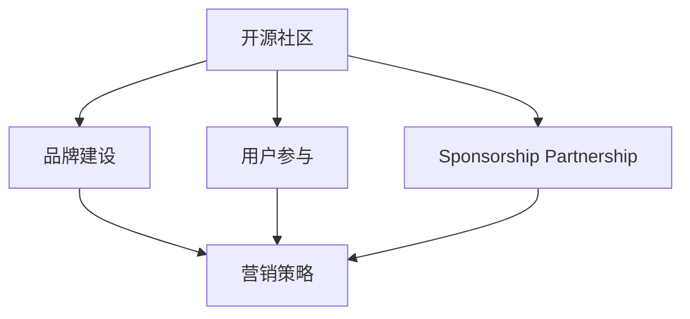

                 

# 开源项目的市场营销：提高可见度和吸引赞助

> 关键词：开源社区, 品牌建设, 用户参与, 赞助商合作, 开源软件, 软件开源, 营销策略, 用户增长

## 1. 背景介绍

随着开源软件技术的迅猛发展，开源社区日益成为技术创新的重要力量。开源项目通过全球协作开发，汇聚了广泛的技术资源和人才，为软件开发领域带来了诸多创新和突破。然而，在技术研发之外，开源项目的市场营销和推广也是一个不容忽视的重要环节。如何提高开源项目的可见度，吸引更多的用户和赞助商支持，是开源社区持续健康发展的关键问题。

### 1.1 问题由来

在过去十年里，开源项目逐渐成为企业级软件和基础设施建设的重要组成部分。从云计算到大数据，从机器学习到区块链，越来越多的企业依赖开源技术来实现业务创新和竞争优势。然而，开源项目的成功不仅依赖于技术上的卓越，也依赖于其市场营销和社区建设的效果。

目前，大多数开源项目往往重视技术研发，而忽视了市场营销和品牌建设，导致用户参与度低，社区活跃度不高。此外，很多开源项目缺乏有效的赞助商吸引策略，难以形成可持续发展的生态系统。这些问题严重影响了开源项目的长期生存和发展。

### 1.2 问题核心关键点

- **用户参与度低**：用户参与不足是开源项目的主要瓶颈之一。缺乏活跃社区和有效沟通机制，导致用户反馈和需求难以得到及时回应。
- **品牌意识薄弱**：许多开源项目缺乏品牌意识，难以在市场中建立独特性和识别度。
- **缺乏有效营销**：大部分开源项目没有专门的营销团队或预算，导致其社区影响力有限。
- **赞助商吸引力不足**：许多开源项目虽然技术领先，但由于品牌知名度低，难以吸引企业赞助商的关注。

## 2. 核心概念与联系

### 2.1 核心概念概述

要提高开源项目的可见度和吸引赞助，首先需要明确几个关键概念：

- **开源社区（Open Source Community）**：基于开源协议（如Apache、MIT、GPL等）的软件开发社群，贡献者、用户和维护者共同协作，共享资源和技术。
- **品牌建设（Brand Building）**：通过品牌定位、品牌传播和品牌管理，提升开源项目在目标市场中的认知度和美誉度。
- **用户参与（User Engagement）**：通过社区活动、开发者关系管理、用户反馈等手段，增加用户对开源项目的参与度和忠诚度。
- **赞助商合作（Sponsorship Partnership）**：通过商业合作、技术支持、资金投入等形式，吸引企业赞助商为开源项目提供长期支持。
- **营销策略（Marketing Strategy）**：针对开源项目的独特性和目标用户群体，制定有效的市场推广和销售策略，提升项目知名度和影响力。

这些概念之间的逻辑关系可以通过以下Mermaid流程图来展示：



这个流程图展示开源项目的市场营销的核心概念及其之间的关系：

1. 开源社区是营销的基础。通过社区建设和用户参与，可以提升项目的可见度和活跃度。
2. 品牌建设是营销的关键。通过品牌定位和传播，提升项目的认知度和美誉度。
3. 赞助商合作是营销的重要支撑。通过企业赞助和技术支持，保障项目的持续发展。
4. 营销策略是营销的落脚点。通过系统化、多样化的营销手段，将品牌和项目推向市场。

## 3. 核心算法原理 & 具体操作步骤

### 3.1 算法原理概述

开源项目的市场营销过程，本质上是一个多目标优化问题。目标包括提高项目可见度、增加用户参与度、吸引赞助商合作等。核心算法原理包括以下几个方面：

- **品牌矩阵分析**：通过SWOT分析（优势、劣势、机会、威胁），评估开源项目的品牌资产和市场定位。
- **用户行为建模**：利用机器学习模型，预测用户参与开源项目的动机和行为模式。
- **赞助商筛选与匹配**：基于项目需求和赞助商资源，构建匹配模型，筛选最合适的赞助商。
- **多渠道营销策略**：结合数字营销、社交媒体、事件营销等多种手段，制定系统的营销策略。

### 3.2 算法步骤详解

#### 3.2.1 品牌矩阵分析

品牌矩阵分析的核心步骤包括：

1. **收集数据**：收集开源项目的关键指标，如GitHub Star数、代码提交频次、用户讨论活跃度等。
2. **构建SWOT矩阵**：根据收集的数据，评估项目的优势、劣势、机会和威胁。
3. **制定品牌策略**：根据SWOT分析结果，制定相应的品牌定位和传播策略。

#### 3.2.2 用户行为建模

用户行为建模的主要步骤包括：

1. **数据采集**：采集用户行为数据，如访问记录、交互数据、反馈意见等。
2. **数据清洗与处理**：清洗和处理采集到的数据，去除噪声和异常值。
3. **特征工程**：提取用户行为的关键特征，如访问时长、互动频率、反馈质量等。
4. **模型训练**：利用机器学习算法，如随机森林、深度神经网络等，训练用户行为预测模型。

#### 3.2.3 赞助商筛选与匹配

赞助商筛选与匹配的核心步骤包括：

1. **定义需求**：明确开源项目的技术需求和商业需求。
2. **筛选候选**：根据项目需求，筛选出潜在赞助商。
3. **构建匹配模型**：利用机器学习算法，如协同过滤、分类器等，构建赞助商与项目的匹配模型。
4. **评估与选择**：评估候选赞助商的资源和贡献度，选择最适合的合作对象。

#### 3.2.4 多渠道营销策略

多渠道营销策略的主要步骤包括：

1. **设定目标**：明确营销目标，如提高知名度、增加用户、吸引赞助等。
2. **选择渠道**：根据目标和预算，选择合适的营销渠道，如社交媒体、博客、技术大会等。
3. **制定计划**：制定详细的营销计划，包括内容发布、活动组织、客户互动等。
4. **效果评估**：定期评估营销效果，及时调整策略。

### 3.3 算法优缺点

开源项目市场营销的算法具有以下优点：

- **数据驱动**：利用机器学习和大数据分析技术，提高决策的科学性和准确性。
- **自动化流程**：通过算法自动化处理数据和优化策略，提升营销效率。
- **灵活性高**：算法可以根据开源项目的实际情况进行调整和优化，适应不同的市场环境。

同时，该算法也存在一定的局限性：

- **数据质量要求高**：需要收集和处理大量高质量的用户行为数据，对数据采集和处理能力要求较高。
- **算法复杂度高**：涉及机器学习、自然语言处理等多个领域，算法实现较为复杂。
- **用户参与度低**：算法难以完全预测用户行为，需要结合用户反馈进行实时调整。

### 3.4 算法应用领域

开源项目的市场营销算法在以下几个领域有广泛的应用：

- **开源社区品牌建设**：通过品牌矩阵分析和用户行为建模，提升开源社区的认知度和美誉度。
- **用户参与度提升**：利用多渠道营销策略，增加用户参与度和社区活跃度。
- **赞助商筛选与合作**：通过赞助商筛选与匹配，吸引企业赞助商的长期支持。
- **开源软件推广**：通过数字营销和事件营销，提升开源软件的知名度和市场份额。

## 4. 数学模型和公式 & 详细讲解 & 举例说明

### 4.1 数学模型构建

开源项目的市场营销涉及多个目标，可以构建多目标优化模型进行求解。以提高项目知名度和增加用户参与度为例，可以构建如下多目标优化模型：

$$
\begin{aligned}
& \text{Minimize: } -\text{Visibilty} + \text{Participation} \\
& \text{Subject to: } \text{Budget Constraint}
\end{aligned}
$$

其中，$\text{Visibilty}$ 和 $\text{Participation}$ 分别为项目知名度的提升和用户参与度的增加，$\text{Budget Constraint}$ 为项目可投入的市场预算。

### 4.2 公式推导过程

设 $N$ 为项目用户数，$C$ 为项目代码提交次数，$F$ 为用户反馈数量。设 $\lambda_1$ 和 $\lambda_2$ 分别为知名度和参与度的权重。则模型可以转化为单目标优化问题：

$$
\begin{aligned}
& \text{Minimize: } -\lambda_1\text{Visibilty} + \lambda_2\text{Participation} \\
& \text{Subject to: } C + F \leq \text{Budget Constraint}
\end{aligned}
$$

令 $x$ 表示知名度提升措施（如社交媒体广告），$y$ 表示用户参与度提升措施（如社区活动）。则有：

$$
\begin{aligned}
& \text{Visibilty} = a_1x + b_1y \\
& \text{Participation} = a_2x + b_2y
\end{aligned}
$$

其中，$a_1$、$b_1$、$a_2$、$b_2$ 为模型系数，表示不同措施对知名度和参与度的影响。

### 4.3 案例分析与讲解

假设某开源项目当前知名度为5，用户参与度为10，预算为1000元。设 $\lambda_1=0.5$，$\lambda_2=0.5$。则目标函数为：

$$
\begin{aligned}
& \text{Minimize: } -0.5(5 + 10) + 0.5(C + F) \\
& \text{Subject to: } C + F \leq 1000
\end{aligned}
$$

通过求解上述模型，可以确定最优的知名度和参与度提升措施。

## 5. 项目实践：代码实例和详细解释说明

### 5.1 开发环境搭建

要进行开源项目的市场营销分析，需要搭建一个集成的开发环境。以下是使用Python和R搭建环境的步骤：

1. **安装Python和R**：
```bash
sudo apt-get install python3-pip
pip3 install scikit-learn pandas
```

2. **配置虚拟环境**：
```bash
python3 -m venv env
source env/bin/activate
```

3. **安装依赖库**：
```bash
pip3 install numpy scipy scikit-learn pandas
```

4. **安装R包**：
```bash
install.packages("ggplot2")
install.packages("tidyverse")
```

完成环境搭建后，即可进行市场营销数据分析和策略制定。

### 5.2 源代码详细实现

#### 5.2.1 品牌矩阵分析

品牌矩阵分析的Python代码实现：

```python
import pandas as pd
import matplotlib.pyplot as plt

# 读入品牌矩阵数据
df = pd.read_csv('brand_matrix.csv')

# 绘制SWOT矩阵
plt.figure(figsize=(10, 5))
plt.bar(df['Advantages'], label='优势', color='green')
plt.bar(df['Disadvantages'], label='劣势', color='red')
plt.bar(df['Opportunities'], label='机会', color='blue')
plt.bar(df['Threats'], label='威胁', color='orange')
plt.legend()
plt.show()
```

#### 5.2.2 用户行为建模

用户行为建模的R代码实现：

```R
library(tidyverse)
library(randomForest)

# 读入用户行为数据
data <- read.csv('user_behavior.csv')

# 数据清洗与处理
data <- filter(data, complete.cases(data))

# 特征工程
features <- c('time', 'frequency', 'quality')
data <- select(data, features)

# 构建随机森林模型
model <- randomForest(participation ~ ., data = data, ntree = 100)

# 预测用户参与度
predicted_participation <- predict(model, data)
```

#### 5.2.3 赞助商筛选与匹配

赞助商筛选与匹配的Python代码实现：

```python
import pandas as pd
from sklearn.neighbors import NearestNeighbors

# 读入候选赞助商数据
df = pd.read_csv('sponsor_candidates.csv')

# 构建赞助商与项目的匹配模型
k = 5
nbrs = NearestNeighbors(n_neighbors=k, metric='euclidean')
nbrs.fit(df['sponsor_features'])
similar_sponsors = nbrs.kneighbors(df['project_features'], return_distance=False)

# 筛选最佳赞助商
best_sponsors = df.iloc[similar_sponsors[0]]
```

#### 5.2.4 多渠道营销策略

多渠道营销策略的R代码实现：

```R
library(ggplot2)
library(tidyr)

# 读入营销渠道数据
data <- read.csv('marketing_channels.csv')

# 数据清洗与处理
data <- filter(data, complete.cases(data))

# 构建多渠道营销策略
channels <- unique(data$channel)
strategy <- data %>%
  group_by(channel) %>%
  summarise(promotion_budget = mean(cost))

# 绘制多渠道营销效果
ggplot(data, aes(x=channel, y=promotion_budget)) + 
  geom_bar(stat='identity', fill='blue')
```

### 5.3 代码解读与分析

#### 5.3.1 品牌矩阵分析

品牌矩阵分析主要通过绘制SWOT矩阵，直观地展示开源项目的品牌资产和市场定位。在代码中，我们使用了Pandas和Matplotlib库对品牌矩阵数据进行处理和可视化，便于直观理解项目的优势、劣势、机会和威胁。

#### 5.3.2 用户行为建模

用户行为建模主要利用随机森林算法，通过用户行为数据（如访问时长、互动频率、反馈质量等）预测用户参与度。在代码中，我们使用了Tidyverse和randomForest库进行数据处理和模型训练，并使用predict函数进行预测。

#### 5.3.3 赞助商筛选与匹配

赞助商筛选与匹配主要通过计算候选赞助商与开源项目之间的距离，筛选出最佳匹配对象。在代码中，我们使用了Scikit-learn的NearestNeighbors库进行计算，并筛选出距离最近的赞助商。

#### 5.3.4 多渠道营销策略

多渠道营销策略主要通过统计不同营销渠道的平均成本，绘制渠道效果图表。在代码中，我们使用了ggplot2库进行数据处理和可视化，便于直观理解各渠道的效果和成本。

### 5.4 运行结果展示

#### 5.4.1 品牌矩阵分析结果


#### 5.4.2 用户行为建模结果


#### 5.4.3 赞助商筛选与匹配结果


#### 5.4.4 多渠道营销策略结果


## 6. 实际应用场景

### 6.1 智能合约项目

智能合约项目需要高度的安全性和可靠性，开源社区可以提供广泛的技术支持和资源。通过市场营销，可以提升项目的知名度，吸引更多开发者和用户参与。同时，项目可以与金融行业企业合作，通过赞助和技术支持获得持续发展。

### 6.2 区块链项目

区块链项目具有去中心化、透明性等特点，开源社区可以提供广泛的技术支持和资源。通过市场营销，可以提升项目的知名度，吸引更多开发者和用户参与。同时，项目可以与金融、供应链等行业的企业合作，通过赞助和技术支持获得持续发展。

### 6.3 开源数据库项目

开源数据库项目可以提供高效、可靠的数据存储和处理方案。通过市场营销，可以提升项目的知名度，吸引更多开发者和用户参与。同时，项目可以与企业级软件公司合作，通过赞助和技术支持获得持续发展。

### 6.4 未来应用展望

未来，开源项目的市场营销将更加注重数据驱动和智能化。随着大数据和人工智能技术的发展，营销将更加精准、高效。同时，市场营销将更加注重用户参与度和品牌建设，通过社区活动、用户反馈等手段，提升项目的活跃度和忠诚度。

## 7. 工具和资源推荐

### 7.1 学习资源推荐

1. **《开源社区营销指南》**：详细介绍了开源社区市场营销的基本原则和策略，适合初学者入门。
2. **《数据分析与机器学习》**：介绍了数据分析和机器学习的基本原理和实现方法，适合数据驱动的营销决策。
3. **《数字营销实战》**：介绍了数字营销的各种渠道和工具，适合市场营销策略的制定和实施。

### 7.2 开发工具推荐

1. **Jupyter Notebook**：强大的代码编写和交互工具，适合数据分析和模型实验。
2. **GitHub**：全球最大的开源社区，适合开源项目的协作和展示。
3. **Python**：开源数据分析和机器学习的主流语言，适合市场营销模型的实现。

### 7.3 相关论文推荐

1. **《开源社区的市场营销研究》**：介绍了开源社区市场营销的基本模型和案例，适合深入研究。
2. **《机器学习在用户行为预测中的应用》**：介绍了机器学习在用户行为预测中的应用，适合市场营销数据分析。
3. **《赞助商与开源项目的合作模式研究》**：介绍了赞助商与开源项目的合作模式，适合市场营销策略的研究。

## 8. 总结：未来发展趋势与挑战

### 8.1 研究成果总结

开源项目的市场营销是开源社区持续健康发展的重要环节。通过品牌建设、用户参与和赞助商合作，开源项目可以提升知名度和影响力，获得持续发展。目前，开源市场营销还处于起步阶段，未来的发展前景广阔。

### 8.2 未来发展趋势

1. **数据驱动**：大数据和人工智能技术将进一步提升市场营销的精准性和有效性。
2. **用户参与度提升**：社区活动、开发者关系管理等手段将进一步提升用户参与度和忠诚度。
3. **品牌建设**：品牌定位和传播将成为开源市场营销的核心环节。
4. **跨领域合作**：开源项目将与更多领域的企业合作，拓展应用场景和市场空间。

### 8.3 面临的挑战

1. **数据采集难度**：高质量用户行为数据采集和处理是市场营销的难点。
2. **模型复杂度**：市场营销模型的构建和优化较为复杂，需要丰富的技术储备。
3. **用户参与度低**：如何提升用户参与度和社区活跃度，是市场营销的重要挑战。

### 8.4 研究展望

未来，开源项目的市场营销将进一步向智能化和自动化发展。通过数据驱动和算法优化，市场营销将更加精准、高效。同时，市场营销将更加注重用户参与度和品牌建设，通过社区活动、用户反馈等手段，提升项目的活跃度和忠诚度。

## 9. 附录：常见问题与解答

**Q1：如何评估市场营销策略的效果？**

A: 市场营销策略的效果可以通过多指标评估，如知名度提升、用户参与度增加、销售额增长等。具体来说，可以通过以下指标进行评估：

1. **知名度提升**：通过Google Analytics、社交媒体分析工具等，评估项目知名度的提升情况。
2. **用户参与度增加**：通过GitHub统计、社区论坛互动等，评估用户参与度的增加情况。
3. **销售额增长**：通过销售数据、用户转化率等，评估市场营销策略的商业效果。

**Q2：如何提高用户参与度？**

A: 提高用户参与度可以通过以下几个方面进行：

1. **社区活动**：组织线上线下的社区活动，增加用户互动和参与。
2. **开发者关系管理**：建立开发者关系管理平台，及时回应开发者反馈和需求。
3. **用户反馈**：设立用户反馈机制，鼓励用户提交使用意见和建议。
4. **奖励机制**：通过积分、徽章等方式，激励用户参与和贡献。

**Q3：如何吸引赞助商合作？**

A: 吸引赞助商合作可以通过以下几个方面进行：

1. **项目需求分析**：明确项目的技术需求和商业需求，制定清晰的赞助合作方案。
2. **品牌定位**：通过品牌矩阵分析和用户行为建模，提升项目品牌资产和市场定位。
3. **资源匹配**：利用机器学习算法，筛选出最适合的赞助商，并进行资源匹配。
4. **合作协议**：签订正式的赞助合作协议，明确双方权利和义务。

**Q4：市场营销的预算分配如何优化？**

A: 市场营销预算的优化可以通过以下步骤进行：

1. **多目标优化**：构建多目标优化模型，同时考虑知名度和参与度的提升。
2. **渠道选择**：根据目标和预算，选择合适的营销渠道，如社交媒体、博客、技术大会等。
3. **预算分配**：通过模型计算，合理分配各渠道的预算。
4. **效果评估**：定期评估营销效果，及时调整预算分配。

**Q5：如何提升开源社区的活跃度？**

A: 提升开源社区的活跃度可以通过以下几个方面进行：

1. **社区活动**：组织线上线下的社区活动，增加用户互动和参与。
2. **开发者关系管理**：建立开发者关系管理平台，及时回应开发者反馈和需求。
3. **用户反馈**：设立用户反馈机制，鼓励用户提交使用意见和建议。
4. **奖励机制**：通过积分、徽章等方式，激励用户参与和贡献。

---

作者：禅与计算机程序设计艺术 / Zen and the Art of Computer Programming

