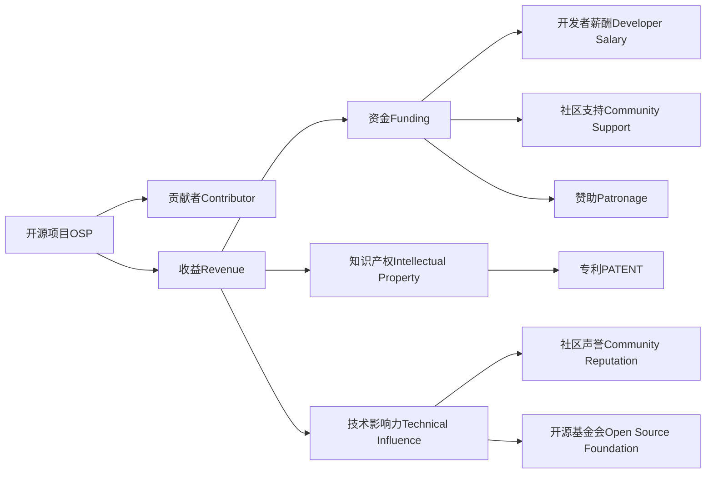

                 

# 开源项目的收益分配：团队激励和可持续性

## 1. 背景介绍

### 1.1 问题由来

随着开源软件在技术界和商业界的迅速崛起，越来越多的开发者和公司开始投入开源项目的开发与维护。然而，如何有效分配开源项目的收益，激励开发者持续贡献，实现项目的长期可持续性，成为了一个复杂且亟待解决的问题。

开源项目的收益分配涉及众多方面，如资金支持、代码贡献、知识产权归属、技术影响力等。合理分配这些收益，不仅能激励开发者积极参与开源项目，还能保障项目的持续发展和健康成长。

### 1.2 问题核心关键点

开源项目的收益分配不仅关乎经济利益，更是对开发者贡献的认可与激励。公平、透明、高效的收益分配机制，能够激发开发者的积极性和创造力，进而推动项目的成功和长远发展。

在实践中，以下是关键点需要重点关注：

- **公平性**：确保每个贡献者都得到应有的回报，避免大贡献者受到不公平待遇。
- **透明性**：收益分配过程和结果应公开透明，便于开发者理解和监督。
- **激励性**：收益分配应能激励开发者持续投入时间和精力，提升代码质量和项目活跃度。
- **可持续性**：确保开源项目有稳定的收益来源，保障项目的长期运营和维护。

## 2. 核心概念与联系

### 2.1 核心概念概述

为更好地理解开源项目收益分配的原理，本节将介绍几个关键概念：

- **开源项目(Open Source Project, OSP)**：指以共享代码和资源为核心的软件项目，遵循开源许可证，允许自由复制、修改和分发。
- **贡献者(Contributor)**：指在开源项目中积极投入代码、文档、测试等资源的人，可能是全职员工、兼职开发者、志愿者等。
- **收益(Benefit)**：指开源项目带来的经济、名誉等正面效应，包括资金、荣誉、社会影响力等。
- **收益分配(Revenue Distribution)**：指开源项目的收益如何在贡献者、社区成员、组织之间进行分配的过程和规则。

### 2.2 核心概念原理和架构的 Mermaid 流程图(Mermaid 流程节点中不要有括号、逗号等特殊字符)



这个流程图展示了开源项目及其相关关键要素的相互关系：

1. 开源项目是贡献者的合作平台，通过贡献者提供资源，产生收益。
2. 收益包括资金、知识产权、技术影响力等，需要根据不同的收益类型进行分配。
3. 资金可以用于支持开发者薪酬、社区活动、技术研究等。
4. 知识产权可以通过专利、商标等方式进行归属和利用。
5. 技术影响力则通过社区声誉、开源基金会等形式加以体现。

## 3. 核心算法原理 & 具体操作步骤

### 3.1 算法原理概述

开源项目的收益分配本质上是一种多维度的资源分配问题，涉及到资金、知识产权、技术影响力等不同类型的收益。其算法原理可以概括为以下几点：

1. **贡献度计算**：计算每个贡献者在项目中的实际贡献，通常包括代码提交数量、代码质量、文档编写、问题解决等方面。
2. **收益类型定义**：明确不同类型收益的分配原则，如资金用于开发者薪酬和社区活动，知识产权保护贡献者技术成果，技术影响力提升项目知名度和声誉。
3. **分配策略设计**：设计合理的分配策略，确保贡献者得到公平对待，同时兼顾项目的可持续发展。

### 3.2 算法步骤详解

以下是开源项目收益分配的详细操作步骤：

**Step 1: 贡献度量化与统计**

- 定义贡献度指标：如代码行数、提交次数、bug修复数量、文档编写等。
- 使用工具自动追踪贡献：如GitHub、GitLab等版本控制系统，结合代码审查、代码质量评估工具进行量化统计。
- 计算每个贡献者的贡献度得分。

**Step 2: 收益类型划分**

- 列出所有可能的收益类型，如资金、知识产权、技术影响力等。
- 定义不同收益的分配原则和权重。例如，资金分配可以优先支持核心开发者，而技术影响力分配则应考虑社区的活跃度和影响力。

**Step 3: 分配策略设计**

- 根据项目的实际情况，设计收益分配策略。例如，可以采用比例分配、按贡献度分配、社区投票分配等。
- 确保分配过程透明，允许贡献者了解和监督收益分配。
- 设计激励机制，如年度奖金、特别贡献奖等，以进一步激发开发者积极性。

**Step 4: 收益分配与监督**

- 根据分配策略，将收益分配给贡献者、社区成员、组织等。
- 定期公开收益分配结果，接受社区监督和反馈。
- 建立争议解决机制，处理可能的分配不公和争议。

**Step 5: 效果评估与调整**

- 定期评估收益分配效果，检查激励机制是否有效。
- 根据评估结果调整分配策略，确保收益分配的公平性和可持续性。
- 优化工具和流程，提高收益分配的效率和透明度。

### 3.3 算法优缺点

开源项目收益分配的算法具有以下优点：

- **透明公平**：公开透明的分配过程和结果，确保每个贡献者都能得到公正对待。
- **灵活多样**：可以灵活定义收益类型和分配策略，适应不同项目和社区的需求。
- **持续激励**：通过合理的收益分配，激励开发者持续贡献，推动项目发展。

同时，该算法也存在一些局限性：

- **复杂度较高**：需要设计多个分配策略和指标，处理过程较为复杂。
- **资源消耗大**：自动追踪和量化统计需要大量计算资源，可能影响项目的运营效率。
- **利益冲突**：不同贡献者之间可能存在利益冲突，需要妥善处理。
- **依赖社区**：社区的积极参与和支持是关键，依赖社区的凝聚力和信任度。

## 4. 数学模型和公式 & 详细讲解 & 举例说明

### 4.1 数学模型构建

开源项目收益分配的数学模型可以抽象为一个多目标优化问题。假设收益有n种类型，每种类型的收益量记为$R_i$（$i=1,2,...,n$），贡献度记为$C_j$（$j=1,2,...,m$），其中$m$为贡献者的数量。收益分配的目标是最大化贡献者满意度，即：

$$
\max_{\alpha} \sum_{j=1}^m C_j \cdot \alpha_j
$$

其中，$\alpha_j$为贡献者$j$得到的收益分配比例。

### 4.2 公式推导过程

为了最大化贡献者满意度，我们可以引入一个权重向量$w_i$，表示不同收益类型的相对重要性。则目标函数变为：

$$
\max_{\alpha} \sum_{j=1}^m \sum_{i=1}^n w_i \cdot C_j \cdot \alpha_j
$$

约束条件为：

$$
\sum_{j=1}^m \alpha_j = 1
$$

解这个多目标优化问题，我们可以使用权重向量$w_i$来调整各收益类型的贡献度权重，从而实现更公平的收益分配。

### 4.3 案例分析与讲解

假设一个开源项目有三个收益类型：资金、专利和技术影响力。有四个贡献者，他们的贡献度分别为50、40、30和20。设资金分配比例为$x_1$，专利分配比例为$x_2$，技术影响力分配比例为$x_3$。

则目标函数为：

$$
\max_{x} (50 \cdot x_1 + 40 \cdot x_2 + 30 \cdot x_3 + 20 \cdot x_1)
$$

约束条件为：

$$
x_1 + x_2 + x_3 = 1
$$

我们可以将目标函数重写为：

$$
\max_{x} (70 \cdot x_1 + 60 \cdot x_2 + 50 \cdot x_3)
$$

通过调整权重向量$w_i=(70,60,50)$，使得贡献度高的贡献者获得更多的收益，而贡献度低的贡献者也能得到一定的回报。

## 5. 项目实践：代码实例和详细解释说明

### 5.1 开发环境搭建

开源项目收益分配的实践需要借助各种开源工具和系统。以下是搭建开发环境的基本步骤：

1. 选择版本控制系统：如Git、GitLab、GitHub等。
2. 安装相关工具：如Git、GitHub Desktop、GitLab等。
3. 搭建开源平台：如GitLab Pages、GitHub Pages等，用于发布开源项目和收益分配信息。

### 5.2 源代码详细实现

以下是一个简化版的开源项目收益分配代码实现，基于Python和GitLab API：

```python
import requests
import json

# 获取GitLab API的Token
token = 'your_gitlab_token'

# 获取所有贡献者信息
contributors = requests.get(f'https://gitlab.com/api/v4/projects/{project_id}/contributors', headers={'PRIVATE-TOKEN': token}).json()

# 计算每个贡献者的贡献度
contribution_scores = {}
for contributor in contributors:
    contribution_scores[contributor['username']] = sum(contributor['total_commits'])
    
# 定义收益类型和权重
benefits = ['funding', 'patent', 'technical_influence']
weights = [0.7, 0.6, 0.5]

# 计算每个贡献者的收益分配比例
allocation = {}
for username, score in contribution_scores.items():
    total_score = sum(contribution_scores.values())
    allocation[username] = (score * sum(weights)) / total_score

# 输出分配结果
print(allocation)
```

这段代码实现了通过GitLab API获取贡献者信息，计算贡献度，并根据预先定义的收益类型和权重进行收益分配。

### 5.3 代码解读与分析

**代码解读：**

- 第一行获取GitLab API的Token，这是访问GitLab资源的必要权限。
- 第二行获取所有贡献者信息，通过API获取GitLab项目的贡献者数据。
- 第三行计算每个贡献者的贡献度，这里简单统计了提交次数。
- 第四行定义了收益类型和权重，这里假设有三种收益类型，分别赋予不同的权重。
- 第五行计算每个贡献者的收益分配比例，根据贡献度和权重计算结果。
- 最后输出分配结果。

**代码分析：**

- 代码实现了收益分配的基本功能，但由于简化处理，可能无法适应所有开源项目的实际需求。
- 代码中的贡献度计算较为简单，实际应用中可能需要综合考虑代码质量、问题解决等多种因素。
- 代码未考虑收益分配的透明性和监督机制，可能存在利益冲突和争议风险。

## 6. 实际应用场景

### 6.1 智能客服系统

开源项目的收益分配可以应用于智能客服系统的收益分配。在智能客服系统中，开发者需要持续投入时间和精力，不断优化系统性能和用户体验。通过合理分配项目的收益，可以激励开发者积极贡献，推动项目持续改进。

### 6.2 金融舆情监测

在金融舆情监测系统中，开发者需要处理大量数据，并开发高质量的模型。通过将收益分配给开发者、社区成员，可以激励他们持续改进系统和算法，提升舆情监测的准确性和时效性。

### 6.3 个性化推荐系统

个性化推荐系统依赖于用户的反馈和贡献，开发者需要不断优化推荐算法和用户体验。通过公平透明的收益分配，可以激励开发者持续改进系统，提高推荐的准确性和多样性。

### 6.4 未来应用展望

未来，开源项目收益分配将进一步应用于更多领域，推动更多开源技术的普及和应用。随着开源社区的不断发展，项目的收益分配将变得更加复杂和多样化，开发者激励机制将更加完善。

## 7. 工具和资源推荐

### 7.1 学习资源推荐

为了深入理解开源项目收益分配的理论和实践，推荐以下学习资源：

1. 《开源社区的激励机制》：详细探讨了开源社区激励机制的设计和实施，适合开发者和项目管理者参考。
2. 《Open Source: The Definitive Guide》：介绍了开源项目的各个方面，包括收益分配、社区管理等，适合初入开源领域的人士学习。
3. 《GitLab: The Definitive Guide》：介绍了GitLab的使用和管理，适合项目管理和开发团队参考。

### 7.2 开发工具推荐

开源项目收益分配的实践需要各种开发工具和系统，以下是推荐工具列表：

1. GitHub：版本控制系统，适合代码托管和版本控制。
2. GitLab：开源项目管理平台，支持版本控制、持续集成、代码审查等功能。
3. Docker：容器化技术，适合部署和运行分布式系统。
4. Jenkins：持续集成和持续部署工具，适合自动化构建和部署。
5. Ansible：自动化配置管理工具，适合系统部署和维护。

### 7.3 相关论文推荐

开源项目收益分配的研究涉及多个学科，以下是几篇重要论文推荐：

1. "Fairness in Open Source Software"：探讨了开源社区中的公平问题，适合开发者和管理者参考。
2. "The Economics of Open Source"：分析了开源项目的经济模型，适合经济学和管理学专业人士参考。
3. "Incentive Mechanisms in Open Source"：讨论了激励机制的设计和实施，适合项目管理者参考。

## 8. 总结：未来发展趋势与挑战

### 8.1 研究成果总结

开源项目的收益分配已经成为开源社区和企业管理中的一个重要课题。通过合理分配收益，可以激励开发者持续贡献，推动项目健康成长。目前，开源项目的收益分配主要集中在资金和知识产权方面，未来将逐渐拓展到技术影响力、社区声誉等方面。

### 8.2 未来发展趋势

开源项目收益分配的未来发展趋势如下：

1. **多元化收益分配**：除了资金和知识产权，技术影响力、社区声誉等收益类型将逐渐被重视，进一步丰富分配机制。
2. **透明化管理**：收益分配过程将更加透明化，通过公开透明的分配机制，增强社区的信任和凝聚力。
3. **激励机制创新**：通过引入年度奖金、特别贡献奖等激励机制，激发开发者持续贡献，提升项目活跃度。
4. **自动化工具支持**：自动化工具和系统将进一步普及，提高收益分配的效率和公平性。

### 8.3 面临的挑战

开源项目收益分配虽然有诸多优点，但在实践中仍面临一些挑战：

1. **利益冲突**：不同贡献者之间可能存在利益冲突，需要妥善处理。
2. **透明度不足**：收益分配过程和结果的透明度可能不足，影响社区信任。
3. **资源消耗**：收益分配的计算和处理需要大量资源，可能影响项目运营效率。
4. **分配公平性**：公平性问题仍需进一步解决，避免大贡献者受到不公平待遇。

### 8.4 研究展望

未来的研究需要在以下几个方面进行进一步探索：

1. **多目标优化**：将收益分配问题建模为多目标优化问题，考虑不同类型的收益和贡献度。
2. **激励机制设计**：设计更多激励机制，如年度奖金、特别贡献奖等，激发开发者持续贡献。
3. **自动化工具开发**：开发更高效的自动化工具，提高收益分配的效率和透明度。
4. **社区治理**：探索社区治理机制，增强社区凝聚力和信任度，确保公平分配。

## 9. 附录：常见问题与解答

**Q1：如何避免开源项目中的利益冲突？**

A: 避免利益冲突的关键在于公平和透明的收益分配机制。建议通过社区投票、公开透明的方式，让所有贡献者参与到收益分配决策中来，确保每个贡献者都能得到公正对待。

**Q2：如何确保收益分配的公平性？**

A: 公平性是开源项目收益分配的核心目标。建议引入贡献度计算、贡献度公开等机制，确保每个贡献者都能根据实际贡献得到相应的回报。同时，通过社区监督和反馈，及时调整分配策略，确保分配公平。

**Q3：如何提高开源项目收益分配的透明度？**

A: 透明度是开源项目成功的重要保障。建议定期公开收益分配结果，接受社区监督和反馈。通过社区投票、公开记录等方式，确保收益分配过程和结果的透明性。

**Q4：开源项目收益分配需要考虑哪些因素？**

A: 开源项目收益分配需要综合考虑贡献度、贡献者的期望、项目的实际需求等多个因素。建议制定清晰的收益类型和分配策略，确保收益分配的公平性和合理性。

---

作者：禅与计算机程序设计艺术 / Zen and the Art of Computer Programming

