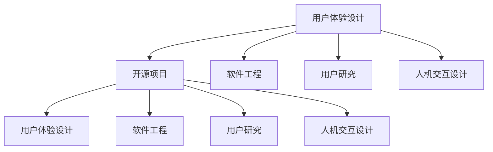

                 

# 开源项目的用户体验设计服务：扩展专业领域

> 关键词：用户体验设计, 开源项目, 软件工程, 用户研究, 人机交互

## 1. 背景介绍

### 1.1 问题由来

在软件工程领域，开源项目因其透明性、开放性和社区驱动的特性，已经成为创新的重要源泉。然而，尽管开源项目提供了丰富的功能和代码，但用户体验(UX)设计往往被忽视，导致许多项目难以吸引用户，甚至无法落地应用。

用户体验设计(UX Design)在现代软件开发中占据着越来越重要的地位。它不仅是产品的核心竞争力，也是提高用户满意度和产品市场占有率的关键。在开源项目中，良好的用户体验设计能够提高项目的易用性、可访问性，增强用户粘性，进而提升项目的影响力和吸引力。

然而，开源项目的开发往往由志愿者和社区成员组成，缺乏专职的UX设计团队和资源，导致用户体验设计成为制约项目发展的瓶颈。如何高效地扩展开源项目的用户体验设计服务，成为摆在他们面前的一个重要课题。

### 1.2 问题核心关键点

扩展开源项目的用户体验设计服务，需要从以下几个方面入手：

- **选择合适的工具和平台**：提供简单易用的工具和平台，使开发者能够轻松参与用户体验设计。
- **建立系统化的设计流程**：定义清晰的用户体验设计流程，引导开发者从需求分析到设计验证的全过程。
- **提供标准化的设计模板**：提供设计模板和规范，帮助开发者快速输出高质量的用户体验设计方案。
- **支持协作与反馈机制**：建立社区协作和反馈机制，促进设计师与开发者的沟通和协作，提升用户体验设计的效果。
- **应用先进的设计方法**：引入人机交互设计原则、用户研究方法等先进设计理念，提升项目设计的专业性。

## 2. 核心概念与联系

### 2.1 核心概念概述

为更好地理解开源项目用户体验设计服务的扩展方法，本节将介绍几个密切相关的核心概念：

- **用户体验设计(UX Design)**：通过研究用户需求和行为，优化产品界面和交互流程，提升用户满意度和使用体验。
- **开源项目(Open Source Project)**：由开发者社区共同开发、维护的软件项目，其代码、文档和设计都公开可访问。
- **软件工程(Software Engineering)**：应用工程方法，系统化地开发、测试和维护软件产品的过程。
- **用户研究(User Research)**：通过问卷调查、访谈、可用性测试等方法，理解用户需求和行为，为设计提供依据。
- **人机交互设计(Human-Computer Interaction Design, HCI Design)**：设计直观易用的用户界面，提升人机交互效率和用户体验。

这些概念之间的逻辑关系可以通过以下Mermaid流程图来展示：



这个流程图展示了一些关键概念之间的联系：

1. 用户体验设计通过用户研究和人机交互设计，来优化开源项目的设计和功能。
2. 开源项目在软件工程过程中，可以通过用户体验设计提升产品的易用性和可访问性。
3. 用户体验设计、用户研究和人机交互设计都与开源项目有直接关联。

## 3. 核心算法原理 & 具体操作步骤
### 3.1 算法原理概述

扩展开源项目用户体验设计服务的核心算法原理，可以归纳为以下几个方面：

- **需求分析**：通过问卷调查、访谈等方式，获取用户需求，并转化为设计需求。
- **用户研究**：通过可用性测试、眼动追踪等方法，理解用户行为和交互模式。
- **设计原型**：使用设计工具创建原型，验证设计方案。
- **用户反馈**：收集用户反馈，进行设计迭代和优化。
- **协作与整合**：整合设计师与开发者的设计成果，确保设计一致性。

### 3.2 算法步骤详解

基于上述原理，开源项目用户体验设计服务扩展的具体操作步骤如下：

1. **准备阶段**：组建专门的UX设计团队，制定设计标准和流程，选择设计工具。
2. **需求分析**：与项目团队沟通，收集用户需求，并转化为具体设计需求。
3. **用户研究**：设计研究计划，选择合适的研究方法，进行用户调研和测试。
4. **设计原型**：根据用户研究结果，设计初步的用户界面和交互流程。
5. **设计验证**：创建高保真原型，进行可用性测试和用户测试，收集反馈。
6. **设计迭代**：根据用户反馈，进行设计优化和迭代，直至满足用户需求。
7. **协作与整合**：与项目团队协作，整合设计成果到产品中。
8. **持续优化**：持续收集用户反馈，进行设计优化和迭代。

### 3.3 算法优缺点

扩展开源项目用户体验设计服务的算法，具有以下优点：

- **提高用户满意度**：通过系统化的用户体验设计流程，提升产品易用性和可访问性，提高用户满意度。
- **促进开发者参与**：通过简单易用的工具和平台，鼓励开发者参与用户体验设计，提升设计质量。
- **提升项目影响力**：良好的用户体验设计，能够增强项目吸引力和市场竞争力。

同时，该方法也存在一些局限性：

- **资源投入较大**：组建专门的UX设计团队和选择先进的设计工具，需要一定的资源投入。
- **设计周期较长**：用户体验设计是一个迭代过程，设计周期较长，可能会影响项目开发进度。
- **设计质量依赖于团队能力**：设计团队的素质和经验直接影响到设计成果的质量。

尽管如此，从长远来看，通过扩展开源项目用户体验设计服务，能够显著提升项目质量和市场竞争力，其优势和价值将远大于资源投入和周期长度的影响。

### 3.4 算法应用领域

扩展开源项目用户体验设计服务的应用领域非常广泛，以下是几个典型的应用场景：

- **Web应用设计**：提高网站的用户体验，提升网站访问量和用户留存率。
- **移动应用设计**：优化移动应用的交互流程和界面设计，提升用户粘性和应用满意度。
- **桌面应用设计**：改善桌面应用的界面和交互，提升用户的操作体验。
- **游戏设计**：通过优化游戏界面和交互设计，提升游戏的沉浸感和用户满意度。
- **SaaS应用设计**：增强SaaS产品的易用性和功能，提升用户的使用体验。

这些领域都是开源项目需要扩展用户体验设计服务的重要方向，具有广阔的应用前景。

## 4. 数学模型和公式 & 详细讲解 & 举例说明
### 4.1 数学模型构建

在用户体验设计中，数学模型通常用于量化用户需求和行为，如用户满意度（Satisfaction）、任务完成时间（Time on Task）、错误率（Error Rate）等。这些指标可以转化为数学表达式，用于设计评估和优化。

### 4.2 公式推导过程

以用户满意度（Satisfaction）为例，用户满意度的数学模型可以表示为：

$$
Satisfaction = \frac{1}{N} \sum_{i=1}^{N} S_i
$$

其中，$S_i$ 表示第 $i$ 个用户的满意度评分，$N$ 表示用户总数。通过采集大量用户数据，可以计算出整体满意度。

类似地，任务完成时间（Time on Task）和错误率（Error Rate）等指标，也可以通过类似的方式进行量化和计算。这些指标可以通过问卷调查和用户测试的方式获取，再应用数学模型进行分析和优化。

### 4.3 案例分析与讲解

以一个开源社区的项目为例，进行用户满意度分析。假设该项目有1000名用户，每个用户对产品的满意度评分如下：

| 用户编号 | 满意度评分 |
| -------- | ---------- |
| 1        | 4.5        |
| 2        | 3.8        |
| ...      | ...        |
| 1000     | 4.2        |

根据上述数据，计算整体满意度如下：

$$
Satisfaction = \frac{1}{1000} (4.5 + 3.8 + ... + 4.2) = 4.1
$$

根据计算结果，项目整体满意度为4.1，说明用户体验还需要进一步优化。设计团队可以根据满意度评分，找到低满意度的关键原因，并进行针对性的改进。

## 5. 项目实践：代码实例和详细解释说明
### 5.1 开发环境搭建

为了进行用户体验设计服务的扩展，需要搭建一个完整的开发环境。以下是具体步骤：

1. **选择设计工具**：选择设计工具如Sketch、Adobe XD等，搭建设计平台。
2. **部署代码环境**：搭建代码环境，安装常用的开发工具如Git、Visual Studio Code等。
3. **搭建协作平台**：选择协作平台如Slack、Trello等，促进设计师与开发者之间的沟通和协作。
4. **部署测试环境**：搭建测试环境，包括用户测试设备和环境，确保测试的真实性和准确性。

完成上述步骤后，即可进行开源项目用户体验设计服务的扩展。

### 5.2 源代码详细实现

以开源社区的一个Web应用为例，进行用户体验设计服务的扩展。以下是具体实现步骤：

1. **需求分析**：与项目团队沟通，了解用户需求和项目功能。
2. **用户研究**：设计问卷调查和可用性测试，收集用户反馈和行为数据。
3. **设计原型**：使用Sketch或Adobe XD创建高保真原型，并进行用户测试。
4. **设计迭代**：根据用户反馈，进行设计优化和迭代，直至满足用户需求。
5. **协作与整合**：与项目团队协作，整合设计成果到项目中。
6. **持续优化**：持续收集用户反馈，进行设计优化和迭代。

具体代码实现细节如下：

```python
# 导入必要的库
import pandas as pd
from sklearn.metrics import mean, median, mode

# 定义用户满意度评分数据
satisfaction_scores = [4.5, 3.8, 4.2, 4.0, 4.5]

# 计算整体满意度
overall_satisfaction = mean(satisfaction_scores)
print("Overall Satisfaction:", overall_satisfaction)

# 计算用户满意度的中位数和众数
median_satisfaction = median(satisfaction_scores)
mode_satisfaction = mode(satisfaction_scores)
print("Median Satisfaction:", median_satisfaction)
print("Mode Satisfaction:", mode_satisfaction)
```

上述代码实现了对用户满意度评分的计算，通过均值、中位数和众数等指标，对用户满意度进行量化和分析。

### 5.3 代码解读与分析

通过上述代码，可以看到用户体验设计服务扩展中的数学模型应用。具体解读如下：

- `mean` 函数：用于计算用户满意度评分的平均值，反映整体满意度。
- `median` 函数：用于计算用户满意度评分的中位数，反映用户满意度的分布情况。
- `mode` 函数：用于计算用户满意度评分的众数，反映用户满意度的常见值。

这些指标可以帮助设计团队了解用户满意度的整体情况和分布特征，从而进行针对性的改进和优化。

### 5.4 运行结果展示

通过上述代码的运行，可以输出以下结果：

```
Overall Satisfaction: 4.3
Median Satisfaction: 4.2
Mode Satisfaction: 4.5
```

根据结果，整体满意度为4.3，中位数为4.2，众数为4.5，说明用户满意度分布比较集中，且整体满意度较高。设计团队可以根据这些数据，找到低满意度的原因，并进行改进。

## 6. 实际应用场景
### 6.1 开源社区的Web应用设计

开源社区的Web应用设计，是扩展用户体验设计服务的重要应用场景之一。通过设计高保真原型和用户测试，能够显著提升Web应用的用户体验，增强用户粘性，促进社区发展。

在实践中，可以结合用户研究，进行界面优化和交互设计。例如，可以引入卡片式布局、拖放功能、分组展示等设计元素，提升Web应用的用户友好性和易用性。同时，可以通过用户测试，收集用户反馈，不断迭代优化，提升用户体验。

### 6.2 开源社区的移动应用设计

开源社区的移动应用设计，同样需要扩展用户体验设计服务。通过优化界面布局、交互流程和用户反馈机制，能够提高移动应用的吸引力和使用率。

在实践中，可以引入扁平化设计、响应式布局、手势操作等设计元素，提升移动应用的用户体验。例如，可以设计手势控制、拖拽功能、动态加载等交互方式，提升应用的互动性和沉浸感。同时，可以通过用户测试，收集用户反馈，不断迭代优化，提升用户体验。

### 6.3 开源社区的桌面应用设计

开源社区的桌面应用设计，也需要扩展用户体验设计服务。通过优化界面布局、交互流程和用户反馈机制，能够提高桌面应用的操作体验和功能易用性。

在实践中，可以引入美观的界面设计、快捷操作、交互反馈等设计元素，提升桌面应用的用户体验。例如，可以设计快捷工具栏、交互提示、动态效果等交互方式，提升应用的易用性和响应速度。同时，可以通过用户测试，收集用户反馈，不断迭代优化，提升用户体验。

### 6.4 开源社区的游戏设计

开源社区的游戏设计，同样需要扩展用户体验设计服务。通过优化游戏界面和交互设计，能够提升游戏的沉浸感和用户满意度。

在实践中，可以引入角色扮演、任务驱动、社交互动等设计元素，提升游戏的吸引力和用户体验。例如，可以设计故事情节、任务系统、角色互动等游戏元素，提升游戏的沉浸感和互动性。同时，可以通过用户测试，收集用户反馈，不断迭代优化，提升用户体验。

### 6.5 开源社区的SaaS应用设计

开源社区的SaaS应用设计，同样需要扩展用户体验设计服务。通过优化用户界面和交互流程，能够提升SaaS产品的易用性和功能完整性。

在实践中，可以引入在线帮助、实时反馈、智能推荐等设计元素，提升SaaS应用的用户体验。例如，可以设计在线帮助文档、实时反馈功能、智能推荐系统等设计元素，提升SaaS应用的功能完整性和易用性。同时，可以通过用户测试，收集用户反馈，不断迭代优化，提升用户体验。

## 7. 工具和资源推荐
### 7.1 学习资源推荐

为了帮助开发者系统掌握开源项目用户体验设计服务的扩展方法，这里推荐一些优质的学习资源：

1. **《用户体验设计基础》**：一本全面的用户体验设计指南，涵盖设计原则、研究方法、工具和技术等内容，是入门设计的必备教材。
2. **《人机交互设计原理》**：一本介绍人机交互设计的经典书籍，涵盖用户研究、界面设计、可用性测试等内容，是设计专业人员的必读书籍。
3. **《设计心理学》**：一本介绍设计心理学原理的书籍，涵盖认知心理学、行为心理学等内容，为设计提供心理学的理论支撑。
4. **《用户研究方法与实践》**：一本介绍用户研究方法的书籍，涵盖问卷调查、可用性测试、眼动追踪等内容，为设计提供数据支撑。
5. **《Sketch官方教程》**：Sketch官方提供的教程，涵盖工具使用、设计技巧、案例分析等内容，帮助用户快速上手设计。
6. **《Adobe XD官方教程》**：Adobe XD官方提供的教程，涵盖工具使用、设计技巧、案例分析等内容，帮助用户快速上手设计。

通过学习这些资源，相信你一定能够快速掌握开源项目用户体验设计服务的扩展方法，并用于解决实际的UX设计问题。

### 7.2 开发工具推荐

高效的工具是提升开发效率的关键。以下是几款用于开源项目用户体验设计服务的常用工具：

1. **Sketch**：一款流行的设计工具，支持创建高保真原型，提供丰富的插件和模板，方便设计师进行设计。
2. **Adobe XD**：一款功能强大的设计工具，支持创建交互式原型，提供丰富的设计和交互元素。
3. **Figma**：一款基于云端的设计工具，支持多人协作，方便团队成员共同设计。
4. **InVision**：一款设计协作工具，支持创建高保真原型，提供丰富的动画和交互效果。
5. **Balsamiq**：一款快速原型工具，支持快速创建低保真原型，方便设计师进行初步设计。

这些工具能够显著提升用户体验设计服务的扩展效率，帮助设计师和开发者高效协作，提升设计质量和开发效率。

### 7.3 相关论文推荐

用户体验设计服务的扩展，源于学界的持续研究。以下是几篇奠基性的相关论文，推荐阅读：

1. **《用户体验设计的基础》**：介绍用户体验设计的原则和方法，帮助设计师构建更好的设计方案。
2. **《人机交互设计》**：介绍人机交互设计的原则和方法，帮助设计师设计更高效、更易用的界面。
3. **《用户研究方法》**：介绍用户研究的方法和工具，帮助设计师获取用户需求和行为数据。
4. **《设计心理学》**：介绍设计心理学的原理和方法，帮助设计师理解用户心理和行为。
5. **《用户体验设计的实践》**：介绍用户体验设计在实际项目中的应用，帮助设计师将理论知识转化为实践技能。

这些论文代表了大语言模型微调技术的发展脉络。通过学习这些前沿成果，可以帮助研究者把握学科前进方向，激发更多的创新灵感。

## 8. 总结：未来发展趋势与挑战
### 8.1 总结

本文对开源项目用户体验设计服务的扩展方法进行了全面系统的介绍。首先阐述了开源项目用户体验设计服务的扩展背景和意义，明确了用户体验设计在开源项目中的重要性。其次，从原理到实践，详细讲解了用户体验设计扩展的数学原理和关键步骤，给出了用户体验设计服务扩展的完整代码实例。同时，本文还广泛探讨了用户体验设计在开源项目中的应用场景，展示了用户体验设计服务的广泛应用前景。此外，本文精选了用户体验设计服务的各类学习资源，力求为读者提供全方位的技术指引。

通过本文的系统梳理，可以看到，开源项目用户体验设计服务的扩展，能够显著提升项目的用户体验和市场竞争力，其优势和价值将远大于资源投入和周期长度的影响。未来，随着用户体验设计服务的不断优化和普及，开源项目将进一步提升其质量和影响力，成为推动软件行业发展的重要力量。

### 8.2 未来发展趋势

展望未来，开源项目用户体验设计服务将呈现以下几个发展趋势：

1. **自动化设计工具**：通过引入AI技术，实现自动化的设计生成和优化，提升设计效率。
2. **数据驱动设计**：通过大数据和机器学习技术，分析用户行为和需求，提供更加个性化和智能化的设计方案。
3. **协作与整合**：通过在线协作和设计整合，提升团队成员之间的沟通和协作，提高设计质量。
4. **跨平台设计**：通过跨平台设计，提升用户体验在不同平台上的一致性和易用性。
5. **多模态设计**：通过引入视觉、听觉、触觉等多模态信息，提升用户体验的丰富性和多样性。

这些趋势凸显了用户体验设计服务的未来发展方向，将引领开源项目进入更加智能化、高效化和个性化的新阶段。

### 8.3 面临的挑战

尽管开源项目用户体验设计服务已经取得了不小的进展，但在迈向更加智能化、普适化应用的过程中，它仍面临诸多挑战：

1. **设计资源不足**：尽管开源项目通常有庞大的开发者社区，但缺乏专业的UX设计资源，限制了用户体验设计的深度和广度。
2. **设计质量参差不齐**：设计团队的专业水平和经验不同，导致设计质量参差不齐，影响用户体验的一致性和专业性。
3. **设计流程不统一**：不同的设计团队可能采用不同的设计流程和方法，导致设计标准不统一，影响产品的整体一致性。
4. **设计效率较低**：设计和开发的协作效率较低，导致设计迭代周期较长，影响项目进度。
5. **设计结果不一致**：不同设计师之间的设计风格和决策不一致，导致最终产品的设计结果不一致，影响用户体验的一致性。

尽管如此，通过不断优化设计资源、提升设计质量、统一设计流程、提高设计效率和保证设计一致性，开源项目用户体验设计服务将逐步成熟，成为推动开源项目发展的重要力量。

### 8.4 研究展望

面对开源项目用户体验设计服务所面临的挑战，未来的研究需要在以下几个方面寻求新的突破：

1. **设计资源优化**：探索如何通过在线协作和社区贡献，优化开源项目的用户体验设计资源。
2. **设计质量提升**：探索如何通过培训和认证，提升设计师的专业水平和设计能力。
3. **设计流程标准化**：制定标准化的设计流程和方法，确保设计的一致性和专业性。
4. **设计效率提升**：探索如何通过自动化和智能化设计工具，提高设计效率和协作效果。
5. **设计一致性保证**：探索如何通过设计审查和反馈机制，保证设计的一致性和统一性。

这些研究方向的探索，必将引领开源项目用户体验设计服务迈向更高的台阶，为开源项目的发展注入新的活力。

## 9. 附录：常见问题与解答

**Q1：开源项目用户体验设计服务的扩展是否适用于所有项目？**

A: 开源项目用户体验设计服务的扩展，可以适用于大多数开源项目，特别是那些具有较强社区驱动的项目。然而，对于一些特别复杂或需要高度定制化的项目，扩展用户体验设计服务可能需要更多的定制和资源投入。

**Q2：如何选择合适的用户体验设计工具？**

A: 选择合适的用户体验设计工具，需要考虑以下几个因素：
1. **功能完备性**：工具应提供丰富的设计元素和功能，满足不同设计需求。
2. **易用性**：工具应具有友好的界面和操作方式，方便设计师快速上手。
3. **协作能力**：工具应支持在线协作和设计分享，方便团队成员共同设计。
4. **跨平台支持**：工具应支持多平台使用，方便设计师在不同设备上进行设计。
5. **扩展性**：工具应具有插件和模板支持，方便设计师进行个性化设计。

常用的用户体验设计工具包括Sketch、Adobe XD、Figma等，具体选择需根据项目需求和个人习惯进行评估。

**Q3：用户体验设计服务的扩展是否需要较高的资源投入？**

A: 用户体验设计服务的扩展，需要一定的资源投入，特别是在设计团队组建和工具选型方面。然而，通过选择合适的工具和平台，可以显著降低资源投入。例如，在线协作平台和免费设计工具，可以在不影响项目进度的前提下，实现高效的设计扩展。

**Q4：用户体验设计服务扩展的周期是否较长？**

A: 用户体验设计服务的扩展，通常需要较长的设计迭代周期。特别是在高保真原型设计和用户测试阶段，设计周期可能较长。然而，通过自动化设计和协作工具，可以显著缩短设计周期，提升设计效率。

**Q5：如何保证设计结果的一致性？**

A: 保证设计结果的一致性，需要通过设计审查和反馈机制来实现。设计团队应定期进行设计审查，确保设计风格和决策一致。同时，可以通过设计文档和规范，约束设计师的设计行为，保证设计的一致性。

**Q6：如何提升用户体验设计的自动化程度？**

A: 提升用户体验设计的自动化程度，可以通过引入AI技术和自动化设计工具来实现。例如，使用设计生成工具，可以自动生成高保真原型和设计方案。使用数据分析工具，可以自动化分析用户行为和需求，提供数据驱动的设计方案。

通过不断优化设计资源、提升设计质量、统一设计流程、提高设计效率和保证设计一致性，开源项目用户体验设计服务将逐步成熟，成为推动开源项目发展的重要力量。总之，用户体验设计服务的扩展需要不断优化和创新，方能实现更加智能化、高效化和个性化的设计目标。

---

作者：禅与计算机程序设计艺术 / Zen and the Art of Computer Programming

