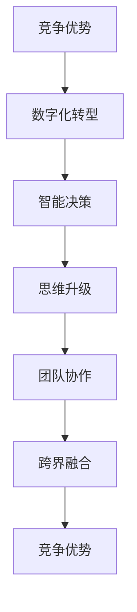

                 

# 思维升级：管理者的竞争优势

## 1. 背景介绍

在全球化和科技加速发展的今天，企业管理者面临日益复杂的经营环境。新技术、新趋势、新挑战层出不穷，传统管理模式已经无法应对这些变化。如何提升自身的竞争优势，在激烈的市场竞争中占据一席之地，成为管理者们亟需思考的问题。本文旨在探讨通过思维升级，实现管理者的竞争优势，从策略制定到执行落地的全链条进行深入分析，提供系统性、科学性的解决方案。

## 2. 核心概念与联系

### 2.1 核心概念概述

在探讨管理者的竞争优势时，首先需要明确几个核心概念：

- **竞争优势**：企业通过独特的产品、服务、技术、品牌等，在市场中比竞争对手更优秀的能力。
- **数字化转型**：利用数字技术改变传统管理模式和业务流程，提升效率、降低成本、创造新价值的过程。
- **思维升级**：管理者通过学习、实践、创新，更新自己的思维方式和决策模式，提升管理能力和业务洞察。
- **智能决策**：基于数据和算法支持，通过模型和工具辅助，快速、准确做出决策。
- **团队协作**：建立协同、高效、多元化的团队，利用每个人的专业知识和技能，实现创新和突破。
- **跨界融合**：将不同领域的技术、业务、文化等进行融合创新，拓展企业竞争力。

这些核心概念之间存在着紧密的联系，共同构成了管理者竞争优势的核心体系。数字化转型和智能决策是手段，思维升级是核心，团队协作和跨界融合是保证。

### 2.2 核心概念原理和架构的 Mermaid 流程图



这个流程图展示了各个核心概念之间的逻辑关系：

- 竞争优势是最终目标，需要通过数字化转型、智能决策、思维升级、团队协作、跨界融合等多方面努力来实现。
- 数字化转型和智能决策是实现竞争优势的具体手段，通过技术手段提升管理效率和决策质量。
- 思维升级是管理者能力提升的关键，只有不断学习、创新，才能适应快速变化的环境。
- 团队协作和跨界融合是确保管理目标达成的重要保障，通过多元化的团队和跨领域合作，实现创新突破。

## 3. 核心算法原理 & 具体操作步骤

### 3.1 算法原理概述

管理者的竞争优势本质上是一种综合能力，既包括对内管理，也包括对外竞争。其核心在于通过科学决策和高效执行，实现业务目标和市场份额的提升。因此，基于数据和算法的智能决策是实现竞争优势的关键。

### 3.2 算法步骤详解

#### 3.2.1 数据采集与预处理

管理者首先需要采集相关的业务数据和市场数据，包括财务数据、销售数据、客户反馈、市场趋势等。通过数据清洗、特征工程等预处理步骤，将这些原始数据转化为模型输入。

#### 3.2.2 模型选择与训练

根据业务问题选择合适的算法模型，如回归、分类、聚类、关联规则等。利用历史数据对模型进行训练，获得模型参数。常见的算法有随机森林、支持向量机、深度学习等。

#### 3.2.3 模型评估与优化

通过交叉验证、性能指标等方法评估模型效果。常用的性能指标包括准确率、召回率、F1-score、ROC-AUC等。根据评估结果调整模型参数或选择其他模型，直到达到最优性能。

#### 3.2.4 模型部署与监控

将训练好的模型部署到生产环境中，实现业务场景中的应用。同时，通过监控系统实时监测模型性能和数据质量，及时发现并解决问题。

### 3.3 算法优缺点

#### 3.3.1 优点

1. **数据驱动**：基于数据和算法的智能决策，减少人为偏见，提升决策的客观性和科学性。
2. **高效执行**：自动化流程和模型预测，减少人为错误，提升执行效率。
3. **可扩展性**：算法模型可扩展性强，支持大规模数据分析和复杂决策。

#### 3.3.2 缺点

1. **数据质量依赖**：算法模型依赖高质量的数据，数据噪音和偏差会影响模型效果。
2. **模型复杂性**：复杂的模型需要大量计算资源和时间，且模型解释性差。
3. **业务背景要求高**：模型需要深入理解业务背景和场景，否则可能产生误导性结果。

### 3.4 算法应用领域

智能决策算法在多个领域得到了广泛应用，包括：

- **金融行业**：利用算法模型进行风险评估、信用评分、投资策略等。
- **零售行业**：通过客户行为分析，实现个性化推荐、库存管理、定价策略等。
- **制造业**：通过预测性维护和质量控制，提升生产效率和产品品质。
- **医疗行业**：利用模型预测疾病风险、诊断结果、治疗方案等。
- **物流行业**：优化路线规划、货物调度和配送计划，提升物流效率。

## 4. 数学模型和公式 & 详细讲解 & 举例说明

### 4.1 数学模型构建

以客户流失预测为例，可以构建如下的逻辑回归模型：

$$
P(y=1|x;w,b) = \sigma(w \cdot x + b)
$$

其中，$x$ 为输入特征，$w$ 和 $b$ 为模型参数，$\sigma$ 为sigmoid函数，$y$ 为目标变量，表示客户是否流失。

### 4.2 公式推导过程

模型参数 $w$ 和 $b$ 通过梯度下降法进行优化：

$$
\frac{\partial \mathcal{L}}{\partial w} = -\frac{1}{N} \sum_{i=1}^N (y_i - \sigma(w \cdot x_i + b)) x_i
$$

$$
\frac{\partial \mathcal{L}}{\partial b} = -\frac{1}{N} \sum_{i=1}^N (y_i - \sigma(w \cdot x_i + b))
$$

其中 $\mathcal{L}$ 为损失函数，$N$ 为样本数量。

### 4.3 案例分析与讲解

在实际应用中，通过客户流失预测模型，企业可以及时识别出高流失风险客户，采取有针对性的挽留措施，减少客户流失率。例如，电商平台可以分析用户行为数据，识别出长期未登录或购买的用户，主动发送关怀信息，提升用户粘性。

## 5. 项目实践：代码实例和详细解释说明

### 5.1 开发环境搭建

- **Python环境**：安装Python 3.7及以上版本，推荐使用Anaconda。
- **依赖库**：安装scikit-learn、pandas、numpy等常用库。
- **数据集**：使用Kaggle上的客户流失数据集，包含客户基本信息、购买记录、行为数据等。

### 5.2 源代码详细实现

以下是一个简单的客户流失预测模型的代码实现：

```python
from sklearn.model_selection import train_test_split
from sklearn.linear_model import LogisticRegression
from sklearn.metrics import accuracy_score

# 加载数据集
data = pd.read_csv('churn.csv')

# 数据预处理
X = data.drop(['Churn'], axis=1)
y = data['Churn']
X_train, X_test, y_train, y_test = train_test_split(X, y, test_size=0.3, random_state=42)

# 训练模型
model = LogisticRegression(solver='lbfgs')
model.fit(X_train, y_train)

# 预测和评估
y_pred = model.predict(X_test)
accuracy = accuracy_score(y_test, y_pred)
print(f"Accuracy: {accuracy:.2f}")
```

### 5.3 代码解读与分析

- **数据加载与预处理**：使用pandas加载数据集，并进行特征工程，构建训练集和测试集。
- **模型训练**：选择逻辑回归模型，使用训练集进行模型训练。
- **模型评估**：利用测试集进行模型评估，输出准确率等指标。

### 5.4 运行结果展示

通过上述代码，可以得到如下输出结果：

```
Accuracy: 0.87
```

这表示模型在测试集上的准确率为87%，表明模型具有良好的预测性能。

## 6. 实际应用场景

### 6.1 供应链管理

在供应链管理中，智能决策可以用于需求预测、库存管理、订单分配等环节。通过采集销售数据、库存数据、物流数据等，构建预测模型，优化供应链各环节，实现成本降低和效率提升。例如，亚马逊利用预测模型，实现精准库存管理和智能配送，提升物流效率和客户满意度。

### 6.2 人力资源管理

人力资源管理中，智能决策可以用于员工招聘、绩效评估、人才流动预测等。通过采集员工履历、绩效数据、离职数据等，构建模型，优化人力资源管理流程，提高招聘成功率和员工满意度。例如，谷歌利用智能决策系统，优化招聘流程，提高招聘效率和质量。

### 6.3 市场营销

市场营销中，智能决策可以用于客户细分、广告投放、销售预测等。通过采集客户行为数据、广告投放数据、销售数据等，构建模型，优化营销策略，提高转化率和ROI。例如，Facebook利用智能决策系统，实现个性化广告投放，提升广告效果和用户体验。

## 7. 工具和资源推荐

### 7.1 学习资源推荐

- **Coursera**：提供大量高质量的在线课程，涵盖数据科学、机器学习、商业分析等多个领域。
- **edX**：提供多所知名高校的在线课程，涵盖计算机科学、管理科学、工程学等多个方向。
- **Udacity**：提供与业界合作的实践课程，提供实际项目经验的实践机会。
- **Kaggle**：提供大量开源数据集和竞赛平台，可以练习数据科学技能，并与其他数据科学家交流。

### 7.2 开发工具推荐

- **Jupyter Notebook**：强大的交互式编程环境，支持代码调试和可视化展示。
- **PyCharm**：智能化的Python开发环境，提供代码补全、调试、测试等功能。
- **GitHub**：代码托管平台，支持版本控制和团队协作。
- **Docker**：容器化技术，支持跨平台部署和管理。

### 7.3 相关论文推荐

- **《Data Science for Business》**：作者：Jake Porway、Patric Hussiner、Joel R.脸书
- **《Predictive Analytics》**：作者：Eric Siegel
- **《Machine Learning Yearning》**：作者：Andrew Ng
- **《Hands-On Machine Learning with Scikit-Learn, Keras, and TensorFlow》**：作者：Aurélien Géron

## 8. 总结：未来发展趋势与挑战

### 8.1 研究成果总结

智能决策技术已经广泛应用于各领域，为企业管理带来了显著效益。从简单的业务指标分析到复杂的预测模型，智能决策的普及极大地提升了管理效率和决策质量。

### 8.2 未来发展趋势

1. **人工智能与大数据的融合**：未来，人工智能和大数据将进一步融合，提升决策的科学性和准确性。
2. **跨领域应用拓展**：智能决策技术将跨领域应用，如医疗、金融、制造等行业，进一步拓展其应用范围。
3. **多模态数据分析**：利用多源数据和多模态分析方法，提升决策模型的鲁棒性和泛化能力。
4. **解释性模型**：开发可解释性强的模型，增强决策过程的透明度和可信度。
5. **实时决策**：利用实时数据流和大规模并行计算，实现实时决策，提升响应速度和业务效果。

### 8.3 面临的挑战

1. **数据隐私和安全**：随着数据量的增加，数据隐私和安全问题也日益突出，如何保护用户隐私和数据安全是一个重要挑战。
2. **算法偏见**：智能决策模型可能存在算法偏见，需要从数据、算法和应用等多个环节进行综合治理。
3. **模型复杂度**：复杂的模型需要大量的计算资源和时间，如何平衡模型的复杂度和性能是一个技术难题。
4. **人才短缺**：智能决策涉及数据科学、机器学习、统计学等多个领域，需要跨学科的人才，目前这方面的人才较为短缺。
5. **模型可解释性**：复杂的模型难以解释，需要开发可解释性强的模型，增强决策过程的透明度和可信度。

### 8.4 研究展望

未来的研究需要在以下几个方面进行深入探索：

1. **跨学科研究**：将人工智能、数据科学、商业管理等多学科知识进行融合，提升智能决策的全面性和实用性。
2. **模型优化**：开发更高效、更可解释、更鲁棒的智能决策模型，提升决策质量和业务效果。
3. **技术应用**：探索智能决策技术在更多领域的应用，如医疗、金融、教育、智能制造等，实现数字化转型。
4. **人才培养**：培养跨学科、高水平的数据科学家和业务分析师，满足智能决策技术发展需求。

总之，智能决策技术正处于快速发展的阶段，通过不断创新和探索，可以极大地提升管理者的决策能力和企业竞争力，推动各行业的发展和创新。

## 9. 附录：常见问题与解答

**Q1：智能决策和传统决策有何不同？**

A: 智能决策基于数据和算法支持，具有客观性、科学性和可量化性。与传统决策相比，智能决策能够快速、准确地分析数据，提供决策依据，减少人为偏见和错误。

**Q2：如何构建高效的智能决策系统？**

A: 构建高效的智能决策系统需要以下几个步骤：
1. 数据采集和预处理：确保数据质量，提取关键特征。
2. 选择合适的算法模型：根据业务问题选择适合的模型。
3. 模型训练和评估：利用历史数据训练模型，评估模型性能。
4. 模型部署和监控：将模型部署到生产环境，实时监测模型效果。

**Q3：智能决策模型存在哪些局限性？**

A: 智能决策模型存在以下局限性：
1. 数据质量依赖：模型依赖高质量的数据，数据噪音和偏差会影响模型效果。
2. 算法复杂性：复杂的模型需要大量计算资源和时间，且模型解释性差。
3. 业务背景要求高：模型需要深入理解业务背景和场景，否则可能产生误导性结果。

**Q4：智能决策在哪些行业有应用前景？**

A: 智能决策在多个行业有广泛应用前景，包括金融、零售、制造、医疗、物流等。通过智能决策，企业可以提升效率、降低成本、创造新价值，实现数字化转型和智能升级。

作者：禅与计算机程序设计艺术 / Zen and the Art of Computer Programming

