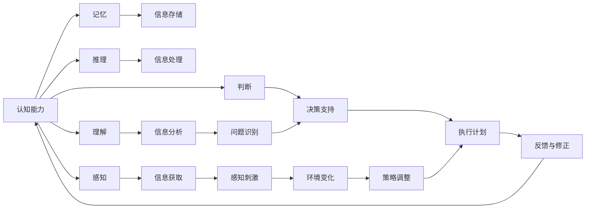

                 

# 思维的敏捷性：快速适应变化的能力

> 关键词：思维敏捷性,快速适应能力,敏捷思维,认知能力,创新,决策,适应性

## 1. 背景介绍

### 1.1 问题由来
在当今快速变化的时代，无论是技术、市场还是社会环境，都在不断演变。企业和个人需要不断地学习和适应，以保持竞争力和创新能力。思维的敏捷性，即快速适应变化的能力，成为了一种至关重要的能力。无论是科技创业公司，还是传统行业的转型升级，都迫切需要培养和发展敏捷思维。

敏捷思维不仅涉及解决问题的方法和技巧，还涵盖了认知能力、决策力和创新能力等多元维度。掌握敏捷思维，不仅能提升个人和团队的效率，还能在复杂多变的环境中做出更精准的决策，推动企业的创新和发展。

### 1.2 问题核心关键点
敏捷思维的核心在于如何快速、有效地应对变化。这包括：

1. **快速学习与适应**：在新的环境中迅速掌握知识，调整原有的认知和行为模式。
2. **创新与改进**：在变化中找到新的解决方案，改进既有流程和产品。
3. **决策与执行**：在复杂情境下，做出快速、准确的决策，并有效执行。
4. **信息处理**：高效筛选和利用信息，避免信息过载。
5. **团队协作**：在多变的环境中，协调团队成员，共同面对挑战。

本文将围绕敏捷思维的核心关键点，详细探讨其原理、操作步骤及应用，并通过实际案例，展示敏捷思维在多个场景中的应用。

## 2. 核心概念与联系

### 2.1 核心概念概述

敏捷思维是一种高度适应性和创新性的思维方式，它涉及学习、创新、决策、执行等多方面能力的综合运用。以下是几个关键概念及其之间的联系：

1. **认知能力**：认知能力是敏捷思维的基础，包括感知、理解、记忆、推理、判断等多个方面。
2. **决策力**：在掌握信息的基础上，做出快速、合理的决策是敏捷思维的核心。
3. **执行能力**：将决策付诸实践，能够有效执行并调整方案。
4. **创新能力**：在变化中寻找新的可能性，创新解决方案。
5. **适应能力**：在不断变化的环境中，灵活调整策略和行为。

这些概念之间相互联系，共同构成了敏捷思维的框架。认知能力提供了信息基础，决策力决定了行动方向，执行能力确保了决策的实现，创新能力拓展了思维边界，适应能力保障了长期应对变化的灵活性。

### 2.2 核心概念原理和架构的 Mermaid 流程图



这个流程图展示了敏捷思维的各个组件及其相互作用。感知、理解、推理、判断等认知能力帮助获取和分析信息，信息处理能力为决策提供支持，决策力在反馈与修正的循环中不断优化，执行能力确保计划实施，适应能力在环境变化中调整策略。

## 3. 核心算法原理 & 具体操作步骤

### 3.1 算法原理概述

敏捷思维的算法原理主要涉及信息处理和决策模型。通过信息处理算法，快速获取、筛选和整合信息，然后通过决策模型，结合已有知识和经验，做出快速且准确的决策。

敏捷思维的核心算法包括：

1. **信息获取与筛选**：从大量信息中提取有用的信息。
2. **信息整合与理解**：将信息整合后，进行深度理解。
3. **决策模型构建**：建立基于知识、规则和数据的决策模型。
4. **决策执行与调整**：执行决策并根据反馈进行调整。

### 3.2 算法步骤详解

1. **信息获取与筛选**：
   - 使用数据挖掘、网络爬虫等技术，获取相关信息。
   - 利用文本处理、图像识别等技术，对信息进行初步筛选。
   - 将相关信息分类存储，以便后续处理。

2. **信息整合与理解**：
   - 利用自然语言处理技术，对文本信息进行分词、词性标注、情感分析等处理。
   - 利用知识图谱、逻辑规则等工具，对信息进行更深层次的理解。
   - 将信息整合为知识图谱或向量表示，形成知识库。

3. **决策模型构建**：
   - 根据历史数据和经验，构建决策模型，如决策树、贝叶斯网络等。
   - 引入机器学习算法，如随机森林、支持向量机等，进行模型训练。
   - 结合领域专家的知识，对模型进行调整和优化。

4. **决策执行与调整**：
   - 根据决策模型输出，制定行动计划。
   - 执行行动计划，并根据反馈进行评估和调整。
   - 持续迭代，提升决策模型的准确性和适用性。

### 3.3 算法优缺点

#### 优点：
1. **快速响应变化**：利用信息处理和决策模型，快速获取和分析信息，做出快速决策。
2. **高效信息整合**：通过信息整合和理解，形成更全面、准确的知识库。
3. **决策精准性**：利用决策模型，结合专家知识和经验，提升决策准确性。
4. **适应性强**：在变化中不断调整和优化决策模型，提升适应性。

#### 缺点：
1. **信息过载**：在处理大量信息时，可能面临信息过载的问题。
2. **模型复杂性**：决策模型的构建和优化需要大量的知识和资源。
3. **执行偏差**：执行过程中可能出现偏差，需要持续监控和调整。
4. **不确定性**：在面对复杂多变的环境时，决策的准确性和适应性存在不确定性。

### 3.4 算法应用领域

敏捷思维广泛应用于多个领域，以下是几个典型的应用场景：

1. **金融行业**：在快速变化的市场环境中，金融机构需要迅速做出投资决策，调整风险管理策略。
2. **医疗健康**：在不断涌现的新型疾病和治疗方法中，医疗健康机构需要快速识别和应对。
3. **科技创业**：在快速迭代的产品开发过程中，科技创业者需要灵活调整产品设计和市场策略。
4. **制造业**：在市场和技术不断变化的环境下，制造企业需要快速适应市场需求和供应链变化。
5. **教育培训**：在不断变化的教育环境和学生需求中，教育机构需要灵活调整教学方法和内容。

## 4. 数学模型和公式 & 详细讲解 & 举例说明

### 4.1 数学模型构建

敏捷思维的数学模型主要围绕信息处理和决策模型构建。以下是一个简化的数学模型框架：

1. **信息获取与筛选**：
   - 使用文本处理算法，如TF-IDF、LDA等，对文本进行特征提取和主题建模。
   - 利用图像识别算法，如卷积神经网络(CNN)，对图像信息进行提取和分类。

2. **信息整合与理解**：
   - 利用向量表示法，将文本和图像信息转换为高维向量，形成特征表示。
   - 使用知识图谱技术，将文本信息转换为图形结构，进行实体和关系抽取。

3. **决策模型构建**：
   - 使用决策树算法，如ID3、C4.5等，构建分类决策模型。
   - 使用贝叶斯网络算法，如朴素贝叶斯、贝叶斯网络等，构建推理决策模型。

### 4.2 公式推导过程

以决策树为例，其基本公式推导过程如下：

1. **信息增益计算**：
   $$
   Gain(S_i, A) = \sum_{x \in S_i} \frac{|S_i|}{|S|} \times entropy(S_i)
   $$
   其中，$S$ 为样本集，$S_i$ 为样本子集，$A$ 为特征属性。

2. **特征选择**：
   选择信息增益最大的特征作为决策树的根节点。
   $$
   A_{best} = \mathop{\arg\max}_{A} Gain(S, A)
   $$

3. **决策树构建**：
   递归地对子集进行划分，直到满足停止条件（如最大深度、最小样本数等）。

### 4.3 案例分析与讲解

**案例：智能投顾系统**

智能投顾系统利用敏捷思维，通过快速获取和分析市场信息，结合用户画像和历史数据，做出投资建议。

1. **信息获取与筛选**：
   - 使用网络爬虫获取实时市场数据。
   - 利用文本处理算法，对新闻和社交媒体信息进行筛选和分类。

2. **信息整合与理解**：
   - 利用自然语言处理技术，对文本信息进行情感分析和实体抽取。
   - 结合市场数据和历史交易记录，构建用户画像和行为模型。

3. **决策模型构建**：
   - 使用决策树算法，根据市场趋势和用户画像，构建投资建议模型。
   - 结合机器学习算法，如随机森林、支持向量机等，优化模型预测准确性。

4. **决策执行与调整**：
   - 根据决策模型输出，生成投资建议。
   - 实时监控市场动态，调整模型参数和投资策略。

## 5. 项目实践：代码实例和详细解释说明

### 5.1 开发环境搭建

1. **Python环境**：
   - 安装Python 3.x版本，推荐使用Anaconda或Miniconda。
   - 安装必要的Python包，如NumPy、Pandas、Scikit-learn等。

2. **机器学习框架**：
   - 安装Scikit-learn，用于构建决策树、贝叶斯网络等模型。
   - 安装TensorFlow或PyTorch，用于构建神经网络模型。

3. **数据处理工具**：
   - 安装NLTK、SpaCy等文本处理库，用于文本特征提取和处理。
   - 安装OpenCV、Pillow等图像处理库，用于图像特征提取和处理。

4. **数据库与存储**：
   - 安装MySQL、PostgreSQL等关系型数据库，用于存储和管理数据。
   - 安装Elasticsearch等搜索引擎，用于快速检索信息。

### 5.2 源代码详细实现

**案例：情感分析系统**

以下是一个简单的情感分析系统的代码实现，利用Python和Scikit-learn构建。

1. **数据准备**：
   - 使用Pandas库，读取文本数据。
   - 使用NLTK库，对文本进行分词和情感分析。

2. **特征提取**：
   - 使用TF-IDF算法，提取文本特征。
   - 使用Scikit-learn库，进行特征向量的构建。

3. **模型训练**：
   - 使用Scikit-learn库，构建决策树模型。
   - 使用交叉验证，调整模型参数。

4. **模型评估与优化**：
   - 使用Scikit-learn库，评估模型性能。
   - 使用GridSearchCV库，进行模型参数优化。

```python
import pandas as pd
from sklearn.feature_extraction.text import TfidfVectorizer
from sklearn.ensemble import DecisionTreeClassifier
from sklearn.model_selection import train_test_split, GridSearchCV

# 读取数据
df = pd.read_csv('data.csv')

# 特征提取
vectorizer = TfidfVectorizer()
X = vectorizer.fit_transform(df['text'])

# 构建模型
clf = DecisionTreeClassifier()
X_train, X_test, y_train, y_test = train_test_split(X, df['label'], test_size=0.2, random_state=42)

# 模型训练
clf.fit(X_train, y_train)

# 模型评估
score = clf.score(X_test, y_test)
print(f"模型准确率：{score}")

# 模型优化
param_grid = {'criterion': ['gini', 'entropy'],
             'max_depth': [3, 5, 7],
             'min_samples_split': [2, 5, 10]}
grid_search = GridSearchCV(clf, param_grid, cv=5)
grid_search.fit(X_train, y_train)

# 输出最优参数
print(f"最优参数：{grid_search.best_params_}")
```

### 5.3 代码解读与分析

1. **数据准备**：
   - 使用Pandas库读取数据，导入文本和标签字段。
   - 使用NLTK库进行文本处理，包括分词和情感分析。

2. **特征提取**：
   - 使用TF-IDF算法，将文本转换为特征向量。
   - 使用Scikit-learn库，构建特征向量。

3. **模型构建**：
   - 使用Scikit-learn库，构建决策树模型。
   - 使用train_test_split函数，将数据集划分为训练集和测试集。

4. **模型训练与评估**：
   - 使用fit函数，训练决策树模型。
   - 使用score函数，评估模型在测试集上的性能。

5. **模型优化**：
   - 使用GridSearchCV库，进行模型参数的网格搜索。
   - 输出最优模型参数，提升模型性能。

## 6. 实际应用场景

### 6.1 智能投顾系统

智能投顾系统通过敏捷思维，快速响应市场变化，帮助用户做出投资决策。

1. **信息获取与筛选**：
   - 使用网络爬虫获取实时市场数据。
   - 利用文本处理算法，对新闻和社交媒体信息进行筛选和分类。

2. **信息整合与理解**：
   - 利用自然语言处理技术，对文本信息进行情感分析和实体抽取。
   - 结合市场数据和历史交易记录，构建用户画像和行为模型。

3. **决策模型构建**：
   - 使用决策树算法，根据市场趋势和用户画像，构建投资建议模型。
   - 结合机器学习算法，如随机森林、支持向量机等，优化模型预测准确性。

4. **决策执行与调整**：
   - 根据决策模型输出，生成投资建议。
   - 实时监控市场动态，调整模型参数和投资策略。

### 6.2 医疗健康

医疗健康领域需要快速响应新疾病和治疗方法的变化。

1. **信息获取与筛选**：
   - 使用网络爬虫获取最新的医学研究和临床试验信息。
   - 利用文本处理算法，对医学文献进行筛选和分类。

2. **信息整合与理解**：
   - 利用自然语言处理技术，对文本信息进行实体抽取和关系抽取。
   - 结合医学知识库，构建疾病和治疗的知识图谱。

3. **决策模型构建**：
   - 使用贝叶斯网络算法，构建疾病诊断和治疗决策模型。
   - 结合临床数据，进行模型参数优化。

4. **决策执行与调整**：
   - 根据决策模型输出，制定治疗方案。
   - 实时监控患者数据，调整治疗方案。

### 6.3 科技创业

科技创业公司需要快速迭代产品，应对市场变化。

1. **信息获取与筛选**：
   - 使用网络爬虫获取市场和用户反馈信息。
   - 利用文本处理算法，对用户评论和社交媒体信息进行筛选和分类。

2. **信息整合与理解**：
   - 利用自然语言处理技术，对文本信息进行情感分析和实体抽取。
   - 结合用户画像和行为数据，构建产品需求模型。

3. **决策模型构建**：
   - 使用决策树算法，根据市场趋势和用户需求，构建产品开发模型。
   - 结合机器学习算法，如随机森林、支持向量机等，优化模型预测准确性。

4. **决策执行与调整**：
   - 根据决策模型输出，制定产品开发计划。
   - 实时监控市场动态，调整产品策略和开发计划。

## 7. 工具和资源推荐

### 7.1 学习资源推荐

1. **《敏捷思维的艺术》**：详细介绍了敏捷思维的原理和应用，推荐给想要系统学习敏捷思维的读者。
2. **Coursera的“Cognitive Psychology and Learning”课程**：介绍了认知心理学和学习理论，是理解敏捷思维的重要基础。
3. **edX的“Data Science Essentials”课程**：涵盖了数据科学和机器学习的基本知识，为敏捷思维提供技术支持。

### 7.2 开发工具推荐

1. **Anaconda**：提供了科学计算和数据科学所需的各种库和环境管理工具。
2. **Jupyter Notebook**：用于快速迭代和分享代码，支持多种语言和库的集成。
3. **TensorBoard**：用于可视化模型训练过程，监控模型性能和参数变化。

### 7.3 相关论文推荐

1. **“Decision Tree Algorithms”论文**：介绍了决策树的基本原理和算法实现。
2. **“Natural Language Processing with Transformers”论文**：介绍了基于Transformer的文本处理技术。
3. **“Bayesian Networks for Data Analysis”论文**：介绍了贝叶斯网络的基本原理和应用。

## 8. 总结：未来发展趋势与挑战

### 8.1 总结

敏捷思维是一种快速适应变化的能力，涉及认知能力、决策力、执行能力、创新能力和适应能力等多元维度的综合运用。敏捷思维的应用范围广泛，涵盖金融、医疗、科技等多个领域，其核心在于快速获取、整合信息，并在此基础上做出快速、准确的决策。

### 8.2 未来发展趋势

1. **智能决策系统的普及**：随着人工智能技术的进步，智能决策系统将在更多领域得到应用，如医疗、金融、物流等。
2. **跨领域融合**：未来将会有更多跨领域的创新，如结合自然语言处理和物联网技术，提升智能决策系统的能力。
3. **持续学习与优化**：未来的决策系统将具备持续学习的能力，不断优化决策模型，提升适应性。
4. **人工智能伦理与安全**：在智能决策系统中，保障数据隐私、避免偏见和歧视等问题将变得更加重要。

### 8.3 面临的挑战

1. **数据隐私与安全**：在处理大量敏感信息时，数据隐私和安全问题将更加突出。
2. **模型复杂性与解释性**：模型过于复杂可能导致解释性不足，影响决策的透明性和可解释性。
3. **实时性要求**：在实时决策中，需要快速处理和分析大量数据，对计算资源和算法效率提出更高要求。
4. **多模态数据整合**：不同模态数据的整合和融合，如文本、图像、音频等，将带来新的技术挑战。

### 8.4 研究展望

1. **多模态决策模型**：结合文本、图像、音频等多种模态数据，构建更全面、准确的决策模型。
2. **深度学习与强化学习结合**：利用深度学习和强化学习技术，提升决策模型的复杂性和鲁棒性。
3. **可解释性研究**：开发更加可解释的决策模型，提升决策透明度和信任度。
4. **伦理与安全**：建立决策模型的伦理与安全评估机制，确保决策的公正性和安全性。

## 9. 附录：常见问题与解答

### Q1: 敏捷思维和传统思维方式有何不同？

A: 敏捷思维强调快速适应变化，重视信息获取、整合和快速决策。而传统思维方式则更注重逻辑推理和长期规划。敏捷思维在变化的环境中更加灵活，能够快速调整策略，而传统思维方式可能在变化缓慢的环境下表现更佳。

### Q2: 如何提升敏捷思维能力？

A: 提升敏捷思维能力需要多方面的努力：
1. **持续学习**：不断更新知识，掌握最新的技术和发展趋势。
2. **实践经验**：通过实际项目和案例，积累经验和解决问题的能力。
3. **跨学科知识**：具备多学科的知识背景，提高综合解决问题的能力。
4. **团队协作**：在团队中发挥协同作用，共同应对复杂问题。

### Q3: 敏捷思维有哪些应用场景？

A: 敏捷思维广泛应用于各个领域，如金融、医疗、科技、制造等。在复杂多变的环境中，敏捷思维能够帮助快速适应变化，提升决策效率和效果。

---

作者：禅与计算机程序设计艺术 / Zen and the Art of Computer Programming

