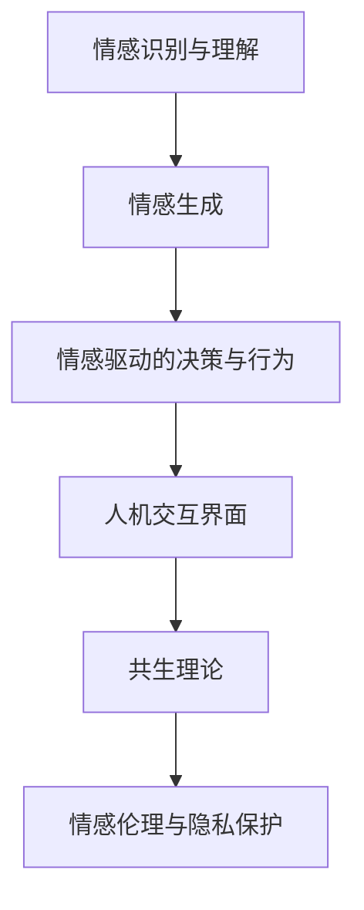
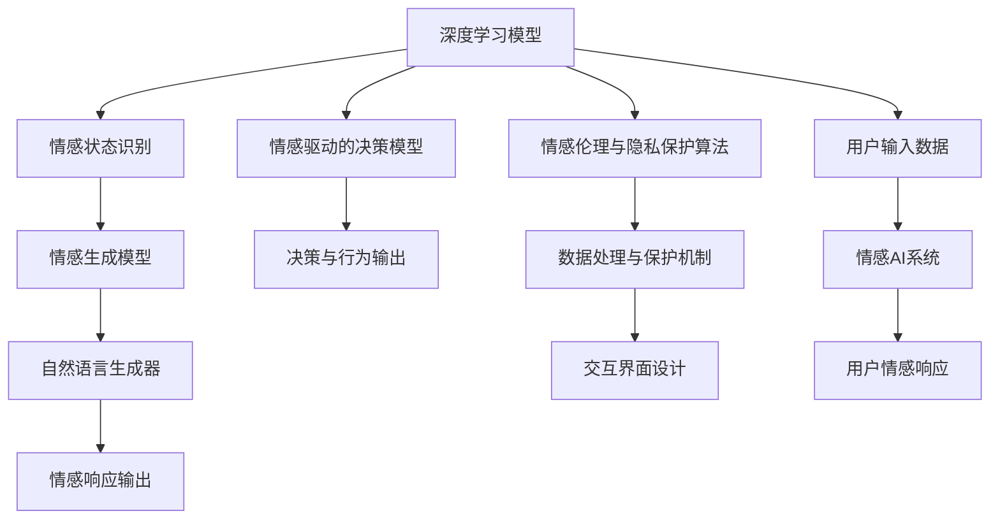

                 

# 情感AI共生理论：人机情感互动新范式

> 关键词：情感AI, 共生理论, 人机情感互动, 交互界面设计, 情感识别与响应, 伦理与隐私

## 1. 背景介绍

随着人工智能技术的飞速发展，AI在诸多领域的应用越来越广泛，从智能客服、推荐系统到自动驾驶，AI正在以越来越深入的层次融入我们的日常生活。然而，传统AI系统普遍缺乏情感理解与处理能力，难以在高度人性化、情感丰富的场景中胜任。这不仅限制了AI技术的应用范围，也影响了用户体验和情感连接。因此，如何在AI系统中融入情感，成为当前研究的热点。

### 1.1 情感AI的兴起

情感AI（Affective Artificial Intelligence）是指具备情感识别、理解、生成和响应的AI技术。情感AI不仅能够处理数据的逻辑信息，还能理解和生成情感信息，更好地与人类进行情感互动。情感AI技术在医疗咨询、教育辅助、人机交互等多个领域展现出巨大潜力，逐渐成为AI研究的前沿领域之一。

### 1.2 情感AI的研究现状

目前，情感AI的研究方向主要集中在以下几个方面：

1. **情感识别与理解**：通过图像、声音、文本等数据，使用深度学习模型识别用户的情感状态，如快乐、悲伤、愤怒等。
2. **情感生成**：利用自然语言生成（NLG）等技术，根据用户情感状态生成适当的响应。
3. **情感驱动的决策与行为**：结合情感信息，优化机器学习模型，实现更加人性化的决策与行为。

尽管情感AI取得了显著进展，但现有技术仍存在局限性，如情感理解的泛化能力不足、情感响应的多样性不够等。因此，探索新的理论框架和方法，成为情感AI研究的重要课题。

## 2. 核心概念与联系

### 2.1 核心概念概述

为更好地理解情感AI，本节将介绍几个密切相关的核心概念：

- **情感识别与理解**：通过图像、声音、文本等数据，使用深度学习模型识别用户的情感状态。
- **情感生成**：利用自然语言生成（NLG）等技术，根据用户情感状态生成适当的响应。
- **情感驱动的决策与行为**：结合情感信息，优化机器学习模型，实现更加人性化的决策与行为。
- **共生理论**：一种新的AI系统设计理念，强调人与AI的互动过程应相互影响、共同成长。
- **人机交互界面**：用于实现人机情感互动的界面设计，如智能聊天机器人、虚拟助手等。
- **情感伦理与隐私保护**：在情感AI应用中，保护用户的情感隐私，确保AI行为符合伦理规范。

这些概念之间通过以下Mermaid流程图展示其联系：



### 2.2 核心概念原理和架构的 Mermaid 流程图



通过上述流程图，我们可以看到情感AI系统的核心架构和各组件之间的联系。

## 3. 核心算法原理 & 具体操作步骤

### 3.1 算法原理概述

情感AI的实现过程大致可以分为情感识别、情感生成、情感驱动的决策与行为三个步骤。这些步骤通过深度学习模型、自然语言生成技术等手段实现，其核心算法原理如下：

- **情感识别**：通过训练数据，使用卷积神经网络（CNN）、循环神经网络（RNN）等模型，识别用户输入的情感状态。
- **情感生成**：根据情感识别结果，使用生成对抗网络（GAN）、变分自编码器（VAE）等模型，生成适当的情感响应。
- **情感驱动的决策与行为**：结合情感信息，优化决策模型，如使用强化学习（RL）、贝叶斯网络等，实现更加人性化的决策与行为。

### 3.2 算法步骤详解

#### 3.2.1 情感识别

1. **数据准备**：收集标注情感数据，如IEMOCAP、AffectNet等数据集。
2. **模型训练**：使用CNN、RNN等模型训练情感识别模型，如ResNet、LSTM等。
3. **情感分类**：将新输入的文本、图像等数据，通过训练好的模型进行情感分类，输出情感状态。

#### 3.2.2 情感生成

1. **生成任务设计**：定义情感生成任务，如生成一句话回应，生成一段对话等。
2. **生成模型训练**：使用GAN、VAE等生成模型训练情感生成模型，如TextGAN、SeqGAN等。
3. **生成情感响应**：根据情感识别结果，生成适当的情感响应，如自然语言生成（NLG）。

#### 3.2.3 情感驱动的决策与行为

1. **决策模型设计**：根据任务需求，设计情感驱动的决策模型，如决策树、贝叶斯网络等。
2. **决策与行为优化**：使用强化学习（RL）等方法优化决策模型，实现情感驱动的决策与行为。
3. **输出响应**：根据优化后的决策模型，生成适当的决策与行为输出。

### 3.3 算法优缺点

情感AI技术具有以下优点：

- **提升用户体验**：通过情感理解和生成，AI系统能够更好地与用户进行情感互动，提升用户体验。
- **促进人机融合**：情感AI技术能够实现人机情感共生，使AI系统更加人性化和可信。
- **提高决策准确性**：结合情感信息，优化决策模型，提高决策准确性和用户满意度。

但情感AI技术也存在以下缺点：

- **技术复杂度高**：情感AI需要多模态数据的处理，模型复杂度高，实现难度大。
- **数据标注成本高**：情感数据的标注成本较高，且标注数据往往存在偏见，影响模型泛化能力。
- **伦理与隐私问题**：情感数据的收集和处理需要遵循伦理和隐私保护原则，确保用户数据安全。

### 3.4 算法应用领域

情感AI技术在多个领域都有广泛的应用，包括但不限于：

- **智能客服**：通过情感识别和生成，提升客户服务质量，增强客户满意度。
- **医疗咨询**：结合情感信息，提供更人性化的医疗服务，增强患者体验。
- **教育辅助**：根据学生情感状态，提供个性化的学习建议和反馈，提升学习效果。
- **虚拟助手**：通过情感驱动的决策与行为，实现更自然的人机交互体验。
- **娱乐应用**：结合情感信息，优化游戏体验、音乐推荐等娱乐内容，提升用户粘性。

## 4. 数学模型和公式 & 详细讲解 & 举例说明

### 4.1 数学模型构建

情感AI系统通常包含以下几类模型：

- **情感识别模型**：如CNN、RNN等，用于识别输入数据的情感状态。
- **情感生成模型**：如GAN、VAE等，用于生成适当的情感响应。
- **决策模型**：如决策树、贝叶斯网络等，用于结合情感信息进行决策与行为输出。

这些模型可以统一用数学公式表达。以情感识别模型为例，其数学模型为：

$$
P(y_i|x_i; \theta) = \frac{e^{\mathbf{w} \cdot \mathbf{x}_i + b}}{\sum_{j=1}^{n} e^{\mathbf{w} \cdot \mathbf{x}_j + b}}
$$

其中 $y_i$ 表示情感状态，$x_i$ 表示输入数据，$\theta$ 表示模型参数，$\mathbf{w}$ 和 $b$ 分别为权重和偏置。

### 4.2 公式推导过程

以情感识别模型为例，推导其公式如下：

1. **输入预处理**：将输入数据 $x_i$ 转换为模型所需的格式，如将文本数据转换为词向量。
2. **特征提取**：使用卷积或池化等操作提取输入数据的特征，如CNN中的卷积操作。
3. **情感分类**：将提取的特征输入全连接层进行分类，输出情感状态。

### 4.3 案例分析与讲解

以智能客服情感识别为例，分析其数学模型和公式推导过程：

1. **输入预处理**：将客户输入的文本数据转换为词向量。
2. **特征提取**：使用卷积神经网络（CNN）提取文本特征。
3. **情感分类**：将提取的特征输入全连接层进行分类，输出客户情感状态。

## 5. 项目实践：代码实例和详细解释说明

### 5.1 开发环境搭建

在进行情感AI项目实践前，我们需要准备好开发环境。以下是使用Python进行PyTorch开发的环境配置流程：

1. 安装Anaconda：从官网下载并安装Anaconda，用于创建独立的Python环境。
2. 创建并激活虚拟环境：
```bash
conda create -n affectiveai-env python=3.8 
conda activate affectiveai-env
```
3. 安装PyTorch：根据CUDA版本，从官网获取对应的安装命令。例如：
```bash
conda install pytorch torchvision torchaudio cudatoolkit=11.1 -c pytorch -c conda-forge
```
4. 安装相关库：
```bash
pip install torch nn torchaudio transformers 
```

### 5.2 源代码详细实现

这里以智能客服情感识别为例，给出使用PyTorch实现情感识别的代码实现：

```python
import torch
import torch.nn as nn
import torch.optim as optim

class SentimentClassifier(nn.Module):
    def __init__(self):
        super(SentimentClassifier, self).__init__()
        self.conv1 = nn.Conv2d(1, 64, kernel_size=3, padding=1)
        self.pool = nn.MaxPool2d(kernel_size=2, stride=2)
        self.fc1 = nn.Linear(64 * 50 * 50, 500)
        self.fc2 = nn.Linear(500, 2)
        self.softmax = nn.Softmax(dim=1)

    def forward(self, x):
        x = self.pool(F.relu(self.conv1(x)))
        x = x.view(-1, 64 * 50 * 50)
        x = F.relu(self.fc1(x))
        x = self.fc2(x)
        x = self.softmax(x)
        return x

model = SentimentClassifier()
criterion = nn.CrossEntropyLoss()
optimizer = optim.Adam(model.parameters(), lr=0.001)

# 训练过程
for epoch in range(10):
    for i, (images, labels) in enumerate(train_loader):
        images = images.to(device)
        labels = labels.to(device)
        optimizer.zero_grad()
        outputs = model(images)
        loss = criterion(outputs, labels)
        loss.backward()
        optimizer.step()
```

### 5.3 代码解读与分析

让我们再详细解读一下关键代码的实现细节：

**SentimentClassifier类**：
- `__init__`方法：初始化卷积层、池化层、全连接层等关键组件。
- `forward`方法：实现前向传播过程，将输入数据依次通过卷积、池化、全连接层等模型，最后输出情感分类结果。

**训练过程**：
- 使用交叉熵损失函数，计算模型输出与真实标签之间的差异。
- 通过Adam优化器更新模型参数，最小化损失函数。
- 在训练过程中，不断迭代模型，直到收敛。

**预测过程**：
- 将测试数据输入模型，获取情感分类结果。
- 使用softmax函数将输出转化为概率分布，选择概率最大的情感分类作为预测结果。

## 6. 实际应用场景

### 6.1 智能客服系统

智能客服系统通过情感识别技术，可以更好地理解客户情感状态，提供更人性化、高效的服务。

在技术实现上，可以收集历史客服对话记录，使用情感识别模型对客户情感进行分类。基于情感分类结果，生成适当的回应，如安抚客户情绪、提供常见问题解答等。在生成回应时，还可以引入情感生成模型，生成更加个性化和灵活的对话内容。

### 6.2 医疗咨询

医疗咨询系统通过情感识别技术，可以更好地理解患者情感状态，提供更人性化的医疗服务。

在技术实现上，可以收集患者病历和咨询记录，使用情感识别模型对患者情感进行分类。基于情感分类结果，生成适当的回复，如安抚患者情绪、解释治疗方案等。在生成回复时，还可以引入情感生成模型，生成更加温暖和专业的回复内容。

### 6.3 教育辅助

教育辅助系统通过情感识别技术，可以更好地理解学生情感状态，提供个性化的学习建议和反馈。

在技术实现上，可以收集学生学习数据，使用情感识别模型对学生情感进行分类。基于情感分类结果，生成适当的学习建议，如调整教学内容、提供心理辅导等。在生成建议时，还可以引入情感生成模型，生成更加温暖和鼓励的回复内容。

### 6.4 未来应用展望

随着情感AI技术的不断发展，其在更多领域的应用前景将更加广阔：

- **智慧城市**：通过情感识别技术，优化城市管理，提高市民满意度。
- **智能家居**：结合情感识别和生成技术，实现更加智能化的家居交互体验。
- **金融服务**：通过情感识别技术，优化客户服务，提高用户粘性和满意度。

未来，情感AI技术将深度融合到人机交互的各个环节，提升用户体验和系统智能水平，成为人工智能应用的重要方向。

## 7. 工具和资源推荐

### 7.1 学习资源推荐

为了帮助开发者系统掌握情感AI的理论基础和实践技巧，这里推荐一些优质的学习资源：

1. **《情感计算导论》**：一本系统介绍情感计算的理论和实践的书籍，适合初学者和研究者阅读。
2. **Kaggle情感识别竞赛**：Kaggle平台上的情感识别竞赛，通过实际数据集练习情感识别模型，提升实战能力。
3. **DeepLearning.ai情感AI课程**：由Andrew Ng教授开设的情感AI课程，涵盖情感识别、情感生成等多个方面。
4. **HuggingFace Transformers库**：提供了丰富的情感识别和生成模型，适合快速上手情感AI开发。

通过对这些资源的学习实践，相信你一定能够快速掌握情感AI的精髓，并用于解决实际的情感识别和生成问题。

### 7.2 开发工具推荐

高效的开发离不开优秀的工具支持。以下是几款用于情感AI开发的常用工具：

1. **PyTorch**：基于Python的开源深度学习框架，灵活的计算图，适合快速迭代研究。
2. **TensorFlow**：由Google主导开发的开源深度学习框架，生产部署方便，适合大规模工程应用。
3. **Transformers库**：HuggingFace开发的NLP工具库，集成了丰富的情感识别和生成模型，支持PyTorch和TensorFlow。
4. **TensorBoard**：TensorFlow配套的可视化工具，实时监测模型训练状态，提供丰富的图表呈现方式。
5. **Weights & Biases**：模型训练的实验跟踪工具，记录和可视化模型训练过程中的各项指标。

合理利用这些工具，可以显著提升情感AI项目的开发效率，加快创新迭代的步伐。

### 7.3 相关论文推荐

情感AI的研究方向涉及多个领域，以下是几篇奠基性的相关论文，推荐阅读：

1. **《情绪感知机器人的感知、情感和互动模型》**：提出了一种基于情感感知模型的机器人，可以与用户进行情感互动。
2. **《基于深度学习的情感分析》**：介绍了情感分析的深度学习模型，如CNN、RNN等，并分析了其在情感识别中的应用。
3. **《情感生成模型综述》**：综述了情感生成模型的最新进展，包括GAN、VAE等生成模型，并探讨了其在情感生成中的应用。
4. **《情感驱动的决策与行为》**：讨论了情感驱动的决策与行为模型，如决策树、贝叶斯网络等，并分析了其在情感驱动的决策中的应用。

这些论文代表了大情感AI研究的发展脉络。通过学习这些前沿成果，可以帮助研究者把握学科前进方向，激发更多的创新灵感。

## 8. 总结：未来发展趋势与挑战

### 8.1 研究成果总结

本文对情感AI的实现原理和操作步骤进行了详细介绍，分析了情感AI的核心概念和应用领域，并给出了情感AI项目实践的代码实例。通过系统梳理，我们可以看到情感AI技术在多个领域的应用前景。

### 8.2 未来发展趋势

展望未来，情感AI技术将呈现以下几个发展趋势：

1. **情感识别的泛化能力增强**：通过引入更多模态数据和更多训练样本，提高情感识别的准确性和泛化能力。
2. **情感生成的多样化**：通过改进生成模型，实现更加多样化和自然的情感生成。
3. **情感驱动的决策优化**：通过优化决策模型，实现更加人性化和高效的情感驱动决策与行为。
4. **跨模态情感识别**：结合图像、声音、文本等多种模态数据，实现更加全面和准确的情感识别。
5. **实时情感生成**：通过改进模型架构和优化算法，实现实时情感生成，提高系统响应速度。

### 8.3 面临的挑战

尽管情感AI技术已经取得了显著进展，但在迈向更加智能化、普适化应用的过程中，仍面临诸多挑战：

1. **数据标注成本高**：情感数据的标注成本较高，且标注数据往往存在偏见，影响模型泛化能力。
2. **技术复杂度高**：情感AI需要多模态数据的处理，模型复杂度高，实现难度大。
3. **伦理与隐私问题**：情感数据的收集和处理需要遵循伦理和隐私保护原则，确保用户数据安全。
4. **情感识别的鲁棒性**：现有情感识别模型在面对复杂情感表达时，泛化能力不足，需要进一步提高模型的鲁棒性。
5. **情感生成的多样性**：现有情感生成模型生成的回应多样性不够，需要改进模型架构，生成更加灵活和自然的回应。

### 8.4 研究展望

面对情感AI面临的这些挑战，未来的研究需要在以下几个方面寻求新的突破：

1. **引入更多模态数据**：结合图像、声音、文本等多种模态数据，实现更加全面和准确的情感识别。
2. **改进生成模型**：通过改进生成模型，实现更加多样化和自然的情感生成。
3. **优化决策模型**：通过优化决策模型，实现更加人性化和高效的情感驱动决策与行为。
4. **提高模型鲁棒性**：通过引入对抗训练、正则化等技术，提高情感识别模型的鲁棒性。
5. **加强隐私保护**：引入隐私保护技术，确保情感数据的收集和处理符合伦理和隐私保护原则。

这些研究方向的探索，必将引领情感AI技术迈向更高的台阶，为构建安全、可靠、可解释、可控的智能系统铺平道路。面向未来，情感AI技术还需要与其他人工智能技术进行更深入的融合，如知识表示、因果推理、强化学习等，多路径协同发力，共同推动自然语言理解和智能交互系统的进步。只有勇于创新、敢于突破，才能不断拓展情感AI技术的边界，让智能技术更好地造福人类社会。

## 9. 附录：常见问题与解答

**Q1：情感AI在落地应用中需要注意哪些问题？**

A: 情感AI在落地应用中需要注意以下几个问题：

1. **数据标注成本**：情感数据的标注成本较高，且标注数据往往存在偏见，影响模型泛化能力。可以通过众包标注、主动学习等方法降低标注成本。
2. **数据隐私保护**：情感数据的收集和处理需要遵循伦理和隐私保护原则，确保用户数据安全。可以使用匿名化、加密等技术保护用户隐私。
3. **模型泛化能力**：现有情感识别模型在面对复杂情感表达时，泛化能力不足，需要进一步提高模型的鲁棒性。可以通过引入对抗训练、正则化等技术，提高情感识别模型的鲁棒性。
4. **情感生成的多样性**：现有情感生成模型生成的回应多样性不够，需要改进模型架构，生成更加灵活和自然的回应。可以通过改进生成模型，引入更多生成技巧，如样式控制、情感调节等。

**Q2：情感AI系统在实际应用中如何优化模型性能？**

A: 情感AI系统在实际应用中可以通过以下方法优化模型性能：

1. **数据增强**：通过回译、近义替换等方式扩充训练集，提高模型的泛化能力。
2. **正则化**：使用L2正则、Dropout等技术，防止模型过度拟合，提高模型的泛化能力。
3. **迁移学习**：将情感AI模型在多个任务上进行迁移学习，提升模型的迁移能力和泛化能力。
4. **模型剪枝**：去除不必要的层和参数，减小模型尺寸，提高推理速度和内存效率。
5. **超参数优化**：通过网格搜索、随机搜索等方法，优化模型的超参数，提升模型性能。

**Q3：情感AI技术在实际应用中如何实现情感驱动的决策与行为？**

A: 情感AI技术在实际应用中可以通过以下方法实现情感驱动的决策与行为：

1. **情感分类**：使用情感识别模型对用户情感进行分类，得到情感状态。
2. **情感生成**：根据情感分类结果，使用情感生成模型生成适当的情感回应。
3. **决策优化**：结合情感信息，优化决策模型，如使用强化学习、贝叶斯网络等，实现情感驱动的决策与行为。
4. **行为输出**：根据优化后的决策模型，生成适当的行为输出，如推荐产品、调整策略等。

**Q4：情感AI技术在实际应用中如何保证用户数据隐私？**

A: 情感AI技术在实际应用中可以通过以下方法保证用户数据隐私：

1. **数据匿名化**：对用户数据进行匿名化处理，防止数据泄露。
2. **数据加密**：对用户数据进行加密存储和传输，防止数据被非法获取。
3. **隐私保护算法**：引入隐私保护算法，如差分隐私、联邦学习等，保护用户数据隐私。
4. **隐私政策透明化**：公开隐私政策，明确数据使用范围和方式，增强用户信任。
5. **数据访问控制**：严格控制数据访问权限，防止数据被滥用。

**Q5：情感AI技术在实际应用中如何确保系统鲁棒性？**

A: 情感AI技术在实际应用中可以通过以下方法确保系统鲁棒性：

1. **数据增强**：通过回译、近义替换等方式扩充训练集，提高模型的泛化能力。
2. **正则化**：使用L2正则、Dropout等技术，防止模型过度拟合，提高模型的泛化能力。
3. **对抗训练**：引入对抗样本，提高模型鲁棒性，防止模型被欺骗性输入所影响。
4. **多模态融合**：结合图像、声音、文本等多种模态数据，实现更加全面和准确的情感识别。
5. **模型剪枝**：去除不必要的层和参数，减小模型尺寸，提高推理速度和内存效率。

这些方法可以协同使用，从不同角度提高情感AI系统的鲁棒性和泛化能力，确保系统在复杂和多样化的环境中能够稳定运行。

---

作者：禅与计算机程序设计艺术 / Zen and the Art of Computer Programming

