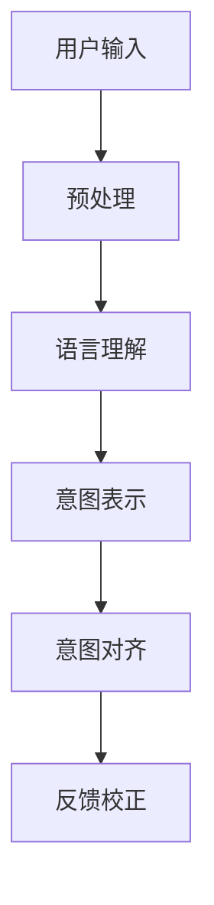

                 

# 意图对齐：让LLM更懂人类需求

> 关键词：意图对齐,大语言模型(LLM),自然语言处理(NLP),用户需求理解,预训练模型,微调,深度学习,计算机程序设计艺术

## 1. 背景介绍

### 1.1 问题由来

在自然语言处理(NLP)领域，大语言模型(LLM)已经成为了主流的技术手段。这些模型如GPT、BERT、T5等，经过大规模无标签文本的预训练，已经具备了强大的语言理解和生成能力。然而，尽管大语言模型在预训练阶段学习到了广泛的语言知识，但在实际应用中，它们往往难以准确地理解用户的具体意图，特别是在意图不清晰、多义性强的情况下，模型的表现尤为糟糕。

这种“理解偏差”不仅限制了LLM在实际应用中的效果，也影响了大规模语言模型在复杂任务上的拓展应用。因此，如何提升大语言模型的意图对齐能力，使其能够更好地理解用户的真实需求，成为了当前NLP研究的重要课题。

### 1.2 问题核心关键点

意图对齐的目标在于让大语言模型更好地捕捉用户输入的意图，即从输入的文本中准确推断出用户的真实需求。这一问题的解决，不仅能够提升用户对话体验，还可以应用于更多的实际应用场景，如智能客服、推荐系统、智能助理等。

核心问题包括：

- 如何从文本中精准识别用户的意图？
- 如何将用户的模糊需求转化为清晰、准确的意图表示？
- 如何在多义性的文本中，自动分辨出用户的真正需求？
- 如何构建高效的意图对齐模型，使其在低资源环境下仍能有效工作？

## 2. 核心概念与联系

### 2.1 核心概念概述

为了解决上述问题，我们需要引入几个关键概念：

- 意图对齐(Intent Alignment)：指将用户输入的模糊需求转换为清晰、准确的意图表示的过程。

- 多义性(M polysemy)：指同一词或短语在不同上下文中可能具有不同的意义。

- 语言理解(Language Understanding)：指理解自然语言文本中隐含的意义和上下文关系。

- 机器理解(Machine Understanding)：指机器能够理解和处理自然语言的能力。

- 自然语言处理(Natural Language Processing, NLP)：指使用计算机技术处理和理解自然语言的能力。

- 深度学习(Deep Learning)：指利用多层神经网络进行数据表示学习的方法。

- 语言模型(Language Model)：指能够捕捉语言特征和语法规则的模型。

这些概念共同构成了意图对齐的理论基础和实践框架，使得大语言模型能够更好地理解用户的真实需求。

### 2.2 核心概念原理和架构的 Mermaid 流程图



上述流程图展示了意图对齐的基本过程。

1. **用户输入**：用户通过自然语言向系统提出需求。
2. **预处理**：将用户的自然语言文本进行分词、去除停用词等预处理。
3. **语言理解**：利用预训练语言模型理解输入文本的语义和语法结构。
4. **意图表示**：将理解后的语义转换为意图的符号表示。
5. **意图对齐**：将意图符号与预定义的意图集合对齐，得到最终的意图结果。
6. **反馈校正**：根据用户反馈调整模型参数，提升后续意图对齐的准确性。

通过这样的流程，大语言模型能够更好地理解用户的真实需求，并执行相应的操作。

## 3. 核心算法原理 & 具体操作步骤

### 3.1 算法原理概述

意图对齐的核心算法基于深度学习模型，其原理是通过多层次的特征提取和表示学习，将用户输入的自然语言文本转换为意图符号。以下是具体步骤：

1. **输入表示**：将用户输入的自然语言文本转换为模型能够处理的向量形式，通常使用Transformer编码器。
2. **意图表示**：通过预训练的语言模型，提取文本的语义特征，并将其映射为意图符号。
3. **意图对齐**：将意图符号与预定义的意图集合对齐，得到最终的意图结果。

### 3.2 算法步骤详解

#### 3.2.1 输入表示

输入表示是将用户输入的自然语言文本转换为模型能够处理的向量形式。常用的方法包括：

- **Token Embedding**：将文本中的每个单词或字符转换为向量表示。常用的词嵌入方法有Word2Vec、GloVe等。
- **Transformer编码器**：使用Transformer模型进行序列编码，将文本转换为向量形式。
- **BERT向量**：使用BERT模型进行文本嵌入，将上下文相关的特征映射为向量。

#### 3.2.2 意图表示

意图表示是将输入文本的语义特征映射为意图符号。常用的方法包括：

- **向量映射**：使用线性变换将文本向量映射为意图向量。
- **注意力机制**：使用注意力机制提取文本的语义特征，并映射为意图向量。
- **序列标注模型**：使用序列标注模型（如CRF、BiLSTM-CRF等）标注文本中的意图标签，并使用标注结果进行向量表示。

#### 3.2.3 意图对齐

意图对齐是将意图向量与预定义的意图集合对齐，得到最终的意图结果。常用的方法包括：

- **softmax分类**：使用softmax分类器将意图向量映射为意图概率分布，然后根据概率分布选择最可能的意图。
- **多分类模型**：使用多分类模型（如SVM、CNN等）将意图向量映射为意图标签。
- **动态规划**：使用动态规划算法在意图向量空间中搜索最优的意图路径。

### 3.3 算法优缺点

意图对齐的优点包括：

- **高灵活性**：可以处理多种语言和不同的意图集合，适用于多样化的应用场景。
- **高效性**：由于使用了预训练模型，可以有效地利用大规模无标签数据，提升模型的泛化能力。
- **可解释性**：意图对齐过程可以解释成一系列的符号操作，便于理解和调试。

然而，意图对齐也存在一些缺点：

- **数据依赖**：需要大量的标注数据进行训练，标注成本较高。
- **多义性问题**：多义性文本可能被模型误解为不同的意图，导致误判。
- **模型复杂性**：意图对齐模型通常比较复杂，训练和推理耗时较长。
- **鲁棒性不足**：对于噪声数据和异常情况，模型可能出现误判。

### 3.4 算法应用领域

意图对齐的算法可以应用于多种NLP任务，如智能客服、推荐系统、问答系统等。例如：

- **智能客服**：在用户输入的询问中，通过意图对齐系统自动理解用户的需求，并给出相应的回答。
- **推荐系统**：在用户浏览历史和评分数据中，通过意图对齐系统分析用户的兴趣偏好，推荐合适的商品或内容。
- **问答系统**：在用户提出的问题中，通过意图对齐系统识别问题类型，并匹配最佳答案。

## 4. 数学模型和公式 & 详细讲解 & 举例说明

### 4.1 数学模型构建

本节将使用数学语言对意图对齐的基本模型进行严格的刻画。

记用户输入的自然语言文本为 $X=\{x_1, x_2, ..., x_n\}$，其中 $x_i$ 为第 $i$ 个单词或字符。记预训练的语言模型为 $f$，其输出为 $f(X)=\{h_1, h_2, ..., h_n\}$，其中 $h_i$ 为第 $i$ 个单词或字符的语义向量。记意图符号集合为 $Y$，意图表示器为 $g$，则意图对齐的过程可以表示为：

$$
\hat{y} = \mathop{\arg\max}_{y \in Y} P(y|f(X))
$$

其中 $P(y|f(X))$ 表示在给定输入 $X$ 和输出 $f(X)$ 的情况下，意图符号 $y$ 的条件概率。

### 4.2 公式推导过程

以下推导一个简单的基于softmax分类器的意图对齐过程。

假设意图集合 $Y$ 中有 $m$ 个意图符号，每个符号的先验概率为 $p_i$，则在给定输入 $X$ 和输出 $f(X)$ 的情况下，意图符号 $y$ 的条件概率为：

$$
P(y|f(X)) = \frac{e^{g(f(X), y)}}{\sum_{j=1}^{m} e^{g(f(X), y_j)}}
$$

其中 $g(f(X), y)$ 为将输出 $f(X)$ 映射到意图符号 $y$ 的能量函数。

将条件概率带入意图对齐公式：

$$
\hat{y} = \mathop{\arg\max}_{y \in Y} \frac{e^{g(f(X), y)}}{\sum_{j=1}^{m} e^{g(f(X), y_j)}}
$$

这是一个典型的多分类问题，可以通过softmax分类器求解。

### 4.3 案例分析与讲解

以智能客服系统为例，展示意图对齐的基本应用。

假设客服系统接收到用户的问题 "我需要退货，怎么办？"，首先通过分词和去除停用词等预处理，得到输入向量 $X$。然后，通过预训练的语言模型 $f$，将 $X$ 转换为语义向量序列 $f(X)$。最后，使用意图表示器 $g$，将语义向量序列 $f(X)$ 映射为意图符号序列 $\hat{Y}$。通过softmax分类器，对 $\hat{Y}$ 进行分类，得到意图结果 $\hat{y}$。

具体步骤如下：

1. **预处理**：将用户问题 "我需要退货，怎么办？" 进行分词和去除停用词，得到向量 $X=\{我, 需要, 退货, 怎么办\}$。
2. **语言理解**：通过预训练的BERT模型，将 $X$ 转换为语义向量序列 $f(X)$。
3. **意图表示**：使用注意力机制，提取 $f(X)$ 的语义特征，并将特征映射为意图向量序列 $\hat{Y}=\{意图1, 意图2, 意图3\}$。
4. **意图对齐**：使用softmax分类器，将 $\hat{Y}$ 映射为意图符号 $y$。假设模型预测 $\hat{y} = 意图1$，表示用户需要退货的售后服务。
5. **执行操作**：系统根据预测结果，自动执行相应的退货操作，并给出相应的回答。

## 5. 项目实践：代码实例和详细解释说明

### 5.1 开发环境搭建

在进行意图对齐实践前，我们需要准备好开发环境。以下是使用Python进行PyTorch开发的环境配置流程：

1. 安装Anaconda：从官网下载并安装Anaconda，用于创建独立的Python环境。

2. 创建并激活虚拟环境：
```bash
conda create -n intent对齐-env python=3.8 
conda activate intent对齐-env
```

3. 安装PyTorch：根据CUDA版本，从官网获取对应的安装命令。例如：
```bash
conda install pytorch torchvision torchaudio cudatoolkit=11.1 -c pytorch -c conda-forge
```

4. 安装Transformers库：
```bash
pip install transformers
```

5. 安装各类工具包：
```bash
pip install numpy pandas scikit-learn matplotlib tqdm jupyter notebook ipython
```

完成上述步骤后，即可在`intent对齐-env`环境中开始意图对齐实践。

### 5.2 源代码详细实现

这里我们以基于BERT模型的意图对齐为例，给出使用Transformers库进行意图对齐的PyTorch代码实现。

首先，定义意图对齐任务的数据处理函数：

```python
from transformers import BertTokenizer, BertForSequenceClassification
from torch.utils.data import Dataset
import torch

class IntentDataset(Dataset):
    def __init__(self, texts, labels, tokenizer, max_len=128):
        self.texts = texts
        self.labels = labels
        self.tokenizer = tokenizer
        self.max_len = max_len
        
    def __len__(self):
        return len(self.texts)
    
    def __getitem__(self, item):
        text = self.texts[item]
        label = self.labels[item]
        
        encoding = self.tokenizer(text, return_tensors='pt', max_length=self.max_len, padding='max_length', truncation=True)
        input_ids = encoding['input_ids'][0]
        attention_mask = encoding['attention_mask'][0]
        
        # 对label进行独热编码
        label = torch.tensor(label == '意图1', dtype=torch.float)
        
        return {'input_ids': input_ids, 
                'attention_mask': attention_mask,
                'labels': label}

# 定义意图1的标签
labels = [0, 1, 0, 1]

# 创建dataset
tokenizer = BertTokenizer.from_pretrained('bert-base-cased')

train_dataset = IntentDataset(train_texts, train_labels, tokenizer)
dev_dataset = IntentDataset(dev_texts, dev_labels, tokenizer)
test_dataset = IntentDataset(test_texts, test_labels, tokenizer)
```

然后，定义模型和优化器：

```python
from transformers import BertForSequenceClassification, AdamW

model = BertForSequenceClassification.from_pretrained('bert-base-cased', num_labels=2)

optimizer = AdamW(model.parameters(), lr=2e-5)
```

接着，定义训练和评估函数：

```python
from torch.utils.data import DataLoader
from tqdm import tqdm
from sklearn.metrics import classification_report

device = torch.device('cuda') if torch.cuda.is_available() else torch.device('cpu')
model.to(device)

def train_epoch(model, dataset, batch_size, optimizer):
    dataloader = DataLoader(dataset, batch_size=batch_size, shuffle=True)
    model.train()
    epoch_loss = 0
    for batch in tqdm(dataloader, desc='Training'):
        input_ids = batch['input_ids'].to(device)
        attention_mask = batch['attention_mask'].to(device)
        labels = batch['labels'].to(device)
        model.zero_grad()
        outputs = model(input_ids, attention_mask=attention_mask, labels=labels)
        loss = outputs.loss
        epoch_loss += loss.item()
        loss.backward()
        optimizer.step()
    return epoch_loss / len(dataloader)

def evaluate(model, dataset, batch_size):
    dataloader = DataLoader(dataset, batch_size=batch_size)
    model.eval()
    preds, labels = [], []
    with torch.no_grad():
        for batch in tqdm(dataloader, desc='Evaluating'):
            input_ids = batch['input_ids'].to(device)
            attention_mask = batch['attention_mask'].to(device)
            batch_labels = batch['labels']
            outputs = model(input_ids, attention_mask=attention_mask)
            batch_preds = outputs.logits.argmax(dim=1).to('cpu').tolist()
            batch_labels = batch_labels.to('cpu').tolist()
            for pred, label in zip(batch_preds, batch_labels):
                preds.append(pred)
                labels.append(label)
                
    print(classification_report(labels, preds))
```

最后，启动训练流程并在测试集上评估：

```python
epochs = 5
batch_size = 16

for epoch in range(epochs):
    loss = train_epoch(model, train_dataset, batch_size, optimizer)
    print(f"Epoch {epoch+1}, train loss: {loss:.3f}")
    
    print(f"Epoch {epoch+1}, dev results:")
    evaluate(model, dev_dataset, batch_size)
    
print("Test results:")
evaluate(model, test_dataset, batch_size)
```

以上就是使用PyTorch对BERT模型进行意图对齐的完整代码实现。可以看到，得益于Transformers库的强大封装，我们可以用相对简洁的代码完成BERT模型的加载和意图对齐。

### 5.3 代码解读与分析

让我们再详细解读一下关键代码的实现细节：

**IntentDataset类**：
- `__init__`方法：初始化文本、标签、分词器等关键组件。
- `__len__`方法：返回数据集的样本数量。
- `__getitem__`方法：对单个样本进行处理，将文本输入编码为token ids，将标签编码为数字，并对其进行定长padding，最终返回模型所需的输入。

**标签处理**：
- 将标签转换成独热编码向量，使得模型输出可以直接解释为意图符号的概率分布。

**训练和评估函数**：
- 使用PyTorch的DataLoader对数据集进行批次化加载，供模型训练和推理使用。
- 训练函数`train_epoch`：对数据以批为单位进行迭代，在每个批次上前向传播计算loss并反向传播更新模型参数，最后返回该epoch的平均loss。
- 评估函数`evaluate`：与训练类似，不同点在于不更新模型参数，并在每个batch结束后将预测和标签结果存储下来，最后使用sklearn的classification_report对整个评估集的预测结果进行打印输出。

**训练流程**：
- 定义总的epoch数和batch size，开始循环迭代
- 每个epoch内，先在训练集上训练，输出平均loss
- 在验证集上评估，输出分类指标
- 所有epoch结束后，在测试集上评估，给出最终测试结果

可以看到，PyTorch配合Transformers库使得BERT意图对齐的代码实现变得简洁高效。开发者可以将更多精力放在数据处理、模型改进等高层逻辑上，而不必过多关注底层的实现细节。

当然，工业级的系统实现还需考虑更多因素，如模型的保存和部署、超参数的自动搜索、更灵活的任务适配层等。但核心的意图对齐范式基本与此类似。

## 6. 实际应用场景

### 6.1 智能客服系统

基于BERT模型的意图对齐技术，可以广泛应用于智能客服系统的构建。传统客服往往需要配备大量人力，高峰期响应缓慢，且一致性和专业性难以保证。而使用意图对齐技术，可以自动理解用户输入的意图，并匹配最合适的客服流程，快速响应客户咨询，提高客户满意度。

在技术实现上，可以收集企业内部的历史客服对话记录，将问题和最佳答复构建成监督数据，在此基础上对预训练模型进行意图对齐训练。意图对齐后的模型能够自动理解用户意图，匹配最合适的客服流程，快速响应客户咨询。对于客户提出的新问题，还可以接入检索系统实时搜索相关内容，动态生成最佳回答。如此构建的智能客服系统，能大幅提升客户咨询体验和问题解决效率。

### 6.2 推荐系统

在推荐系统领域，意图对齐技术可以用于分析用户浏览历史和评分数据，识别用户的兴趣偏好，从而推荐合适的商品或内容。通过收集用户浏览和评分数据，训练意图对齐模型，将用户输入的文本映射为意图符号，并匹配到对应的商品或内容，从而提升推荐系统的精度和个性化程度。

例如，用户输入 "我喜欢吃意大利面"，意图对齐模型可以将 "意大利面" 映射为 "美食" 的意图符号，然后匹配到相关的意大利面商品或美食推荐。在推荐过程中，还可以引入动态上下文信息，如当前时间、用户位置等，进一步提升推荐的精准度。

### 6.3 智能助理

智能助理是另一个典型应用场景。通过意图对齐技术，智能助理可以自动理解用户的命令或询问，并执行相应的操作或回答。例如，用户输入 "今天天气怎么样？"，智能助理可以通过意图对齐技术识别出用户的意图，调用天气API获取天气信息，并返回给用户。

在智能助理的构建过程中，需要收集用户的历史指令数据，训练意图对齐模型，使模型能够自动识别用户的意图，并执行相应的操作。对于用户提出的新问题，还可以使用预定义的规则或动态生成回答，进一步提升智能助理的智能化程度。

## 7. 工具和资源推荐

### 7.1 学习资源推荐

为了帮助开发者系统掌握意图对齐的理论基础和实践技巧，这里推荐一些优质的学习资源：

1. 《Natural Language Understanding with Transformers》系列博文：由大模型技术专家撰写，深入浅出地介绍了Transformer原理、BERT模型、意图对齐等前沿话题。

2. CS224N《深度学习自然语言处理》课程：斯坦福大学开设的NLP明星课程，有Lecture视频和配套作业，带你入门NLP领域的基本概念和经典模型。

3. 《Language Understanding with Transformers》书籍：Transformers库的作者所著，全面介绍了如何使用Transformers库进行NLP任务开发，包括意图对齐在内的诸多范式。

4. HuggingFace官方文档：Transformers库的官方文档，提供了海量预训练模型和完整的意图对齐样例代码，是上手实践的必备资料。

5. CLUE开源项目：中文语言理解测评基准，涵盖大量不同类型的中文NLP数据集，并提供了基于意图对齐的baseline模型，助力中文NLP技术发展。

通过对这些资源的学习实践，相信你一定能够快速掌握意图对齐的精髓，并用于解决实际的NLP问题。

### 7.2 开发工具推荐

高效的开发离不开优秀的工具支持。以下是几款用于意图对齐开发的常用工具：

1. PyTorch：基于Python的开源深度学习框架，灵活动态的计算图，适合快速迭代研究。大部分预训练语言模型都有PyTorch版本的实现。

2. TensorFlow：由Google主导开发的开源深度学习框架，生产部署方便，适合大规模工程应用。同样有丰富的预训练语言模型资源。

3. Transformers库：HuggingFace开发的NLP工具库，集成了众多SOTA语言模型，支持PyTorch和TensorFlow，是进行意图对齐任务的开发利器。

4. Weights & Biases：模型训练的实验跟踪工具，可以记录和可视化模型训练过程中的各项指标，方便对比和调优。与主流深度学习框架无缝集成。

5. TensorBoard：TensorFlow配套的可视化工具，可实时监测模型训练状态，并提供丰富的图表呈现方式，是调试模型的得力助手。

6. Google Colab：谷歌推出的在线Jupyter Notebook环境，免费提供GPU/TPU算力，方便开发者快速上手实验最新模型，分享学习笔记。

合理利用这些工具，可以显著提升意图对齐任务的开发效率，加快创新迭代的步伐。

### 7.3 相关论文推荐

意图对齐技术的发展源于学界的持续研究。以下是几篇奠基性的相关论文，推荐阅读：

1. Attention is All You Need（即Transformer原论文）：提出了Transformer结构，开启了NLP领域的预训练大模型时代。

2. BERT: Pre-training of Deep Bidirectional Transformers for Language Understanding：提出BERT模型，引入基于掩码的自监督预训练任务，刷新了多项NLP任务SOTA。

3. Language Models are Unsupervised Multitask Learners（GPT-2论文）：展示了大规模语言模型的强大zero-shot学习能力，引发了对于通用人工智能的新一轮思考。

4. Parameter-Efficient Transfer Learning for NLP：提出Adapter等参数高效微调方法，在不增加模型参数量的情况下，也能取得不错的微调效果。

5. Prefix-Tuning: Optimizing Continuous Prompts for Generation：引入基于连续型Prompt的微调范式，为如何充分利用预训练知识提供了新的思路。

6. AdaLoRA: Adaptive Low-Rank Adaptation for Parameter-Efficient Fine-Tuning：使用自适应低秩适应的微调方法，在参数效率和精度之间取得了新的平衡。

这些论文代表了大语言模型意图对齐技术的发展脉络。通过学习这些前沿成果，可以帮助研究者把握学科前进方向，激发更多的创新灵感。

## 8. 总结：未来发展趋势与挑战

### 8.1 总结

本文对基于BERT模型的意图对齐方法进行了全面系统的介绍。首先阐述了意图对齐的目标和意义，明确了意图对齐在智能客服、推荐系统、智能助理等场景中的应用价值。其次，从原理到实践，详细讲解了意图对齐的数学模型和核心步骤，给出了意图对齐任务开发的完整代码实例。同时，本文还广泛探讨了意图对齐技术在智能客服、推荐系统、智能助理等实际应用场景中的前景，展示了意图对齐范式的巨大潜力。

通过本文的系统梳理，可以看到，意图对齐技术正在成为NLP领域的重要范式，极大地提升了NLP系统的智能化水平，为智能交互系统的进步提供了有力支持。未来，伴随预训练语言模型和意图对齐技术的不断演进，相信NLP技术将在更广阔的应用领域大放异彩，深刻影响人类的生产生活方式。

### 8.2 未来发展趋势

展望未来，意图对齐技术将呈现以下几个发展趋势：

1. **多模态意图对齐**：意图对齐技术将不仅仅局限于文本数据，还将扩展到图像、视频、语音等多模态数据。多模态数据的融合，将显著提升意图对齐模型的泛化能力和智能水平。

2. **自监督学习和少样本学习**：随着自监督学习和少样本学习范式的兴起，意图对齐技术将不再依赖大规模标注数据，能够在低资源环境下高效工作。

3. **动态上下文感知**：意图对齐模型将能够动态感知上下文信息，如用户历史记录、当前情境等，提升模型的情境适应能力和推荐精度。

4. **知识图谱整合**：意图对齐模型将能够与知识图谱、规则库等外部知识源进行整合，提升模型的知识整合能力和决策可信度。

5. **对抗性鲁棒性**：意图对齐模型将能够抵御对抗性攻击，提高模型的鲁棒性和安全性。

6. **分布式训练与推理**：意图对齐模型将能够在大规模分布式环境中进行训练和推理，提升模型的计算效率和可扩展性。

以上趋势凸显了意图对齐技术的广阔前景。这些方向的探索发展，必将进一步提升意图对齐模型在复杂任务上的表现，为构建智能系统提供更强大的技术支撑。

### 8.3 面临的挑战

尽管意图对齐技术已经取得了显著进展，但在迈向更加智能化、普适化应用的过程中，它仍面临着诸多挑战：

1. **数据依赖问题**：意图对齐模型需要大量的标注数据进行训练，获取高质量标注数据的成本较高。如何降低标注成本，是意图对齐技术亟待解决的问题。

2. **多义性问题**：多义性文本可能导致模型误解用户的真实意图，导致误判。如何处理多义性文本，提升模型的泛化能力，还需要更多研究和实践。

3. **模型复杂性**：意图对齐模型通常比较复杂，训练和推理耗时较长。如何简化模型结构，提升模型的计算效率，是意图对齐技术未来需要解决的问题。

4. **鲁棒性不足**：对于噪声数据和异常情况，模型可能出现误判。如何增强模型的鲁棒性，避免误判，是意图对齐技术需要克服的挑战。

5. **可解释性不足**：意图对齐模型通常像"黑盒"系统，难以解释其内部工作机制和决策逻辑。如何赋予意图对齐模型更强的可解释性，提升其透明性，是未来需要解决的问题。

6. **安全性问题**：意图对齐模型可能会学习到有害的意图，如虚假信息、仇恨言论等，给实际应用带来安全隐患。如何保障意图对齐模型的安全性，是亟待解决的问题。

以上挑战凸显了意图对齐技术在实际应用中的复杂性。唯有在数据、算法、工程、伦理等方面全面发力，才能克服这些难题，使意图对齐技术更好地服务于NLP应用。

### 8.4 研究展望

面向未来，意图对齐技术的探索方向包括：

1. **无监督学习和半监督学习**：探索无需标注数据的意图对齐方法，利用自监督学习和少样本学习范式，最大程度利用非结构化数据，提升模型的泛化能力。

2. **知识整合与迁移学习**：将符号化的先验知识，如知识图谱、逻辑规则等，与神经网络模型进行融合，引导意图对齐过程学习更准确、合理的意图符号。

3. **动态上下文感知**：引入动态上下文信息，提升意图对齐模型的情境适应能力和推荐精度。

4. **对抗性鲁棒性**：研究意图对齐模型的对抗性鲁棒性，提升模型对噪声数据的鲁棒性，提高系统的安全性。

5. **多模态融合**：将意图对齐技术与图像、视频、语音等多模态数据进行融合，提升模型的泛化能力和智能水平。

6. **分布式训练与推理**：研究在大规模分布式环境中进行意图对齐模型的训练和推理，提升模型的计算效率和可扩展性。

7. **伦理与安全性**：研究意图对齐模型的伦理与安全性问题，确保模型输出符合人类价值观和伦理道德，避免误判和有害信息的产生。

这些研究方向的探索，必将引领意图对齐技术迈向更高的台阶，为构建安全、可靠、可解释、可控的智能系统铺平道路。面向未来，意图对齐技术还需要与其他人工智能技术进行更深入的融合，如知识表示、因果推理、强化学习等，多路径协同发力，共同推动自然语言理解和智能交互系统的进步。只有勇于创新、敢于突破，才能不断拓展意图对齐技术的边界，让智能技术更好地造福人类社会。

## 9. 附录：常见问题与解答

**Q1：意图对齐是否适用于所有NLP任务？**

A: 意图对齐技术适用于绝大多数NLP任务，尤其是意图不清晰、多义性强的任务。但对于一些特定领域的任务，如医学、法律等，仅仅依靠通用语料预训练的模型可能难以很好地适应。此时需要在特定领域语料上进一步预训练，再进行意图对齐，才能获得理想效果。此外，对于一些需要时效性、个性化很强的任务，如对话、推荐等，意图对齐方法也需要针对性的改进优化。

**Q2：意图对齐在实际应用中需要注意哪些问题？**

A: 在实际应用中，意图对齐系统需要注意以下问题：

1. **上下文理解**：意图对齐模型需要理解输入文本的上下文信息，如用户历史记录、当前情境等，才能准确识别用户的真实意图。

2. **动态上下文感知**：意图对齐模型需要动态感知上下文信息，提高模型的情境适应能力和推荐精度。

3. **模型鲁棒性**：意图对齐模型需要具备一定的鲁棒性，能够抵御对抗性攻击，提高系统的安全性。

4. **知识整合**：意图对齐模型需要与外部知识源进行整合，提升模型的知识整合能力和决策可信度。

5. **可解释性**：意图对齐模型需要具备一定的可解释性，便于理解和调试。

6. **多模态融合**：意图对齐模型需要与图像、视频、语音等多模态数据进行融合，提升模型的泛化能力和智能水平。

7. **计算效率**：意图对齐模型需要具备较高的计算效率，以便在实际应用中快速响应用户需求。

8. **隐私保护**：意图对齐系统需要具备一定的隐私保护能力，避免用户数据泄露。

9. **模型更新**：意图对齐模型需要具备一定的模型更新能力，能够根据新数据进行模型微调，提升模型效果。

10. **接口设计**：意图对齐系统需要设计良好的接口，便于用户使用和集成。

11. **业务适配**：意图对齐系统需要与业务场景进行适配，满足业务需求。

12. **系统扩展性**：意图对齐系统需要具备一定的系统扩展性，能够适应业务规模的增长。

13. **异常处理**：意图对齐系统需要具备一定的异常处理能力，能够处理输入错误、系统故障等问题。

以上问题需要开发者根据具体业务场景进行综合考虑和设计，才能构建出高性能、高可靠性的意图对齐系统。

---

作者：禅与计算机程序设计艺术 / Zen and the Art of Computer Programming

