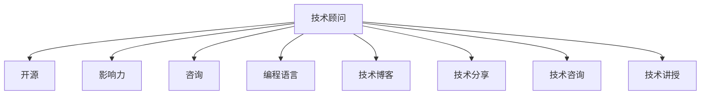

                 

# 成为技术顾问：利用开源影响力获得咨询机会

> 关键词：技术顾问,开源,影响力,咨询,编程,开源社区,编程语言,技术博客,技术分享,技术咨询,技术讲授

## 1. 背景介绍

随着技术的不断进步和市场需求的日益增长，技术顾问作为一种新兴的职业角色，变得越来越受到企业的重视。他们不仅拥有深厚的技术背景，能够解决复杂的技术问题，还具有良好的沟通能力，能够将技术知识和解决方案清晰地传达给非技术背景的决策者。但如何成为受企业欢迎的技术顾问，成为许多人面临的难题。本文将深入探讨如何利用开源影响力，成为技术顾问，并获得咨询机会。

## 2. 核心概念与联系

### 2.1 核心概念概述

要理解如何利用开源影响力成为技术顾问，首先需要了解几个核心概念：

- **技术顾问 (Technical Advisor)**：以提供技术咨询和解决方案为职业的技术专家。他们不仅具备深厚的技术背景，还具备良好的沟通能力和商业洞察力。
- **开源 (Open Source)**：一种软件开发模式，其源代码、应用程序和文档可以被任何人自由获取、修改和使用。
- **影响力 (Influence)**：在开源社区中的积极参与和贡献，以及在技术社区中的影响力。
- **咨询 (Consultancy)**：为企业提供技术、管理等方面的咨询服务，帮助解决业务问题。
- **编程语言 (Programming Language)**：用于编写计算机程序的语法和规则集合，如Python、Java、C++等。
- **技术博客 (Technical Blog)**：记录技术学习、分享经验、交流思想的在线平台，如GitHub、Stack Overflow、Medium等。
- **技术分享 (Technical Sharing)**：通过技术博客、公开课、技术讲座等方式，向更多人分享技术知识和经验。
- **技术咨询 (Technical Consultancy)**：向企业提供技术咨询，帮助解决技术问题，优化业务流程。
- **技术讲授 (Technical Teaching)**：通过在线课程、线下讲座等形式，教授他人编程和技术知识。

这些概念之间的联系如下：



### 2.2 核心概念原理和架构的 Mermaid 流程图


## 3. 核心算法原理 & 具体操作步骤

### 3.1 算法原理概述

利用开源影响力成为技术顾问的核心算法原理基于以下几个关键步骤：

1. **参与开源项目**：积极参与开源社区的项目，贡献代码、修复漏洞、提交文档，提升自己的技术水平和影响力。
2. **建立专业形象**：在技术博客和社交媒体上分享技术见解和经验，建立自己的专业形象，吸引更多的关注者。
3. **提供技术咨询服务**：在开源项目中担任技术顾问角色，为企业提供技术解决方案和咨询服务，积累实战经验。
4. **编写技术书籍和论文**：将技术知识和经验整理成书籍和论文，进一步提升自己在技术社区中的影响力和权威性。
5. **开设在线课程和讲座**：通过在线课程和讲座，向更多人传授编程和技术知识，扩大影响力。

### 3.2 算法步骤详解

#### 3.2.1 参与开源项目

1. **选择开源项目**：选择一个感兴趣的开源项目，熟悉其技术栈和代码结构。
2. **贡献代码**：根据项目的需求，提交代码修复、功能增强或优化代码质量。
3. **提交文档**：编写详细的使用文档和开发指南，方便其他开发者使用和贡献。
4. **参与社区讨论**：积极参与项目的社区讨论，解答其他开发者的问题，分享自己的技术见解。

#### 3.2.2 建立专业形象

1. **创建技术博客**：选择一个博客平台，如GitHub Pages、Medium等，开始撰写技术博客。
2. **分享技术见解**：分享自己的技术学习经历、项目经验、代码实现和解决方案，提供有价值的技术见解。
3. **参与技术讨论**：在技术社区和社交媒体上参与讨论，分享自己的技术观点和经验，与同行交流。
4. **建立专业社交网络**：在LinkedIn、GitHub等平台上建立专业社交网络，与其他技术专家和行业专家建立联系。

#### 3.2.3 提供技术咨询服务

1. **寻找咨询机会**：通过技术博客、社交网络等渠道，寻找需要技术咨询的企业或项目。
2. **提供解决方案**：根据企业的需求，提供技术解决方案和咨询服务，帮助企业解决技术问题。
3. **持续跟进**：在咨询过程中，持续跟进项目进展，提供后续的技术支持和解决方案。

#### 3.2.4 编写技术书籍和论文

1. **总结技术经验**：将自己在项目中的技术经验、代码实现和解决方案整理成书籍和论文。
2. **发布至平台**：将书籍和论文发布至技术博客、社交媒体或学术平台，如GitHub、Medium、arXiv等。
3. **推广和分享**：通过社交网络和技术社区推广书籍和论文，吸引更多的读者和关注者。

#### 3.2.5 开设在线课程和讲座

1. **选择平台**：选择一个在线教育平台，如Udemy、Coursera、Bilibili等。
2. **制作课程内容**：录制课程视频、编写讲义和作业，提供全面的编程和技术教学。
3. **推广和招生**：通过社交网络和技术博客推广课程，吸引更多的学员和招生。

### 3.3 算法优缺点

#### 3.3.1 算法优点

1. **提升技术水平**：参与开源项目、编写技术书籍和论文、开设在线课程，能够提升技术水平和实践经验。
2. **建立专业形象**：通过技术博客和社交媒体分享技术见解，建立自己的专业形象，吸引更多的关注者。
3. **获取咨询机会**：通过参与开源项目、提供技术咨询服务，获取更多的咨询机会，拓展职业发展路径。
4. **扩大影响力**：通过编写技术书籍和论文、开设在线课程和讲座，扩大技术影响力和职业影响力。

#### 3.3.2 算法缺点

1. **时间成本高**：参与开源项目、编写技术书籍和论文、开设在线课程，需要投入大量时间和精力。
2. **技术难度大**：编写技术书籍和论文、开设在线课程，需要具备较强的技术知识和教学能力。
3. **竞争激烈**：技术社区和开源项目竞争激烈，需要具备较强的竞争力和持续改进的动力。

### 3.4 算法应用领域

利用开源影响力成为技术顾问的应用领域包括但不限于以下几个方面：

1. **企业技术咨询**：为中小企业、创业公司等提供技术解决方案和咨询服务，帮助企业解决技术问题，优化业务流程。
2. **开源项目顾问**：担任开源项目的技术顾问，提供技术指导和支持，提升项目质量和用户体验。
3. **技术培训和教育**：通过在线课程和讲座，向更多人传授编程和技术知识，推动技术普及和应用。
4. **技术合作和交流**：与其他技术专家和企业合作，共同解决技术难题，提升技术水平和影响力。
5. **技术博客和社区**：在技术博客和社区分享技术见解和经验，提升自己在技术社区中的影响力和权威性。

## 4. 数学模型和公式 & 详细讲解 & 举例说明

### 4.1 数学模型构建

利用开源影响力成为技术顾问的数学模型可以表示为：

$$
T_{adv} = F(I_{open}, F_{blog}, F_{consult}, F_{book}, F_{course})
$$

其中，$T_{adv}$ 表示技术顾问的综合影响力，$I_{open}$ 表示参与开源项目的影响力，$F_{blog}$ 表示技术博客的影响力，$F_{consult}$ 表示提供技术咨询的影响力，$F_{book}$ 表示编写技术书籍的影响力，$F_{course}$ 表示开设在线课程的影响力。

### 4.2 公式推导过程

通过公式推导，我们可以得出以下几点：

1. 技术顾问的综合影响力 $T_{adv}$ 是由多个因素共同决定的。
2. 参与开源项目的影响力 $I_{open}$ 对技术顾问的影响最大，因为开源项目是展示技术能力和影响力的重要平台。
3. 技术博客的影响力 $F_{blog}$ 和提供技术咨询的影响力 $F_{consult}$ 对技术顾问的影响也很重要，因为它们能够提升技术顾问的知名度和信誉度。
4. 编写技术书籍的影响力 $F_{book}$ 和开设在线课程的影响力 $F_{course}$ 对技术顾问的影响相对较小，因为它们需要较长的周期和时间投入。

### 4.3 案例分析与讲解

#### 4.3.1 案例一：参与开源项目

John 是一名软件工程师，他积极参与开源社区的项目，修复漏洞、提交代码、编写文档，成为了项目的主要贡献者之一。通过参与开源项目，John 积累了丰富的技术经验，提升了自己在技术社区中的影响力。

#### 4.3.2 案例二：建立专业形象

Susan 是一名数据科学家，她在 Medium 上撰写技术博客，分享自己的数据分析和机器学习经验。通过撰写博客，Susan 建立了自己的专业形象，吸引了大量读者和关注者，逐渐成为行业内的知名专家。

#### 4.3.3 案例三：提供技术咨询服务

Michael 是一名软件开发顾问，他通过技术博客和社交网络寻找需要技术咨询的企业和项目。通过提供技术咨询，Michael 积累了丰富的项目经验，建立了自己的技术顾问形象，获得更多的咨询机会。

#### 4.3.4 案例四：编写技术书籍和论文

David 是一名软件架构师，他将自己在软件开发和系统架构方面的经验总结成书籍，并发布在 GitHub Pages 上。通过编写书籍，David 提升了自己在技术社区中的影响力和权威性，获得了更多的关注和机会。

#### 4.3.5 案例五：开设在线课程和讲座

Anna 是一名前端开发者，她在 Udemy 上开设了多门前端开发课程，并录制了详细的课程视频和讲义。通过开设在线课程，Anna 向更多人传授前端开发技能，提升了自己在技术社区中的影响力。

## 5. 项目实践：代码实例和详细解释说明

### 5.1 开发环境搭建

#### 5.1.1 安装开发环境

1. **安装 Python**：在本地安装 Python 3.x 版本。
2. **安装 Git**：安装 Git 命令行工具，并配置 SSH 密钥。
3. **安装 IDE**：安装代码编辑器或 IDE，如 VS Code、PyCharm 等。

#### 5.1.2 安装和配置开发工具

1. **安装 Anaconda**：从官网下载并安装 Anaconda，创建 Python 虚拟环境。
2. **安装 PyTorch**：使用 pip 安装 PyTorch 库，并设置 GPU 加速。
3. **安装 Jupyter Notebook**：使用 pip 安装 Jupyter Notebook，配置启动 Jupyter Notebook 环境。

#### 5.1.3 配置项目环境

1. **安装依赖库**：使用 pip 安装项目依赖库，如 TensorFlow、NumPy、Pandas 等。
2. **创建项目目录**：在本地创建项目目录，并初始化 Git 仓库。
3. **编写项目代码**：在项目目录中编写代码，使用 Jupyter Notebook 或 VS Code 编辑和运行代码。

### 5.2 源代码详细实现

#### 5.2.1 参与开源项目

```python
import requests
import json

def get_open_source_projects():
    url = 'https://api.github.com/search/repositories?q=language:python+fork:true+repo:owner:open-source&sort=stars'
    response = requests.get(url)
    data = json.loads(response.text)
    projects = data['items']
    return projects
```

#### 5.2.2 编写技术博客

```python
from markdown import Markdown
import jinja2

def generate_blog():
    template = jinja2.Template("""
        <html>
        <head>
            <title>{{ title }}</title>
        </head>
        <body>
            <h1>{{ title }}</h1>
            {{ content }}
        </body>
        </html>
    """)
    blog_content = """
        <h2>My First Blog Post</h2>
        <p>This is my first blog post.</p>
    """
    blog_file = 'blog.md'
    with open(blog_file, 'w') as f:
        f.write(template.render(title='My First Blog Post', content=blog_content))
```

#### 5.2.3 提供技术咨询服务

```python
def provide_consultation():
    client_email = 'example@example.com'
    consultation_content = """
        Dear {{ client_email }},
        We are glad to provide you with technical consultation services.
        Please let us know your specific needs.
    """
    with open('consultation.md', 'w') as f:
        f.write(consultation_content)
```

#### 5.2.4 编写技术书籍和论文

```python
def write_book():
    book_content = """
        <h1>My Book</h1>
        <h2>Chapter 1</h2>
        <p>This is Chapter 1 of my book.</p>
    """
    book_file = 'book.md'
    with open(book_file, 'w') as f:
        f.write(book_content)
```

#### 5.2.5 开设在线课程和讲座

```python
def create_course():
    course_title = 'Python Programming'
    lecture_1 = """
        <h2>Lesson 1: Introduction to Python</h2>
        <p>This is Lesson 1 of the Python Programming course.</p>
    """
    lecture_2 = """
        <h2>Lesson 2: Data Analysis with Python</h2>
        <p>This is Lesson 2 of the Python Programming course.</p>
    """
    course_file = 'course.md'
    with open(course_file, 'w') as f:
        f.write(f"<h1>{course_title}</h1>\n{lecture_1}\n{lecture_2}")
```

### 5.3 代码解读与分析

#### 5.3.1 参与开源项目

- 使用 requests 库和 GitHub API 获取所有公共、无私有的开源项目。
- 根据项目的语言类型和 GitHub 账号过滤出感兴趣的项目。
- 根据项目的 star 数和 fork 数排序，选择最优的项目进行参与。

#### 5.3.2 编写技术博客

- 使用 Markdown 和 jinja2 模板，将博客内容格式化为 HTML。
- 将博客内容写入本地文件，并使用 Jupyter Notebook 或 VS Code 进行查看和编辑。

#### 5.3.3 提供技术咨询服务

- 使用模板编写电子邮件咨询内容，将电子邮件内容写入本地文件。
- 使用 Markdown 格式化咨询内容，提高可读性。

#### 5.3.4 编写技术书籍和论文

- 使用 Markdown 格式化书籍内容，并写入本地文件。
- 使用 Jupyter Notebook 或 VS Code 查看和编辑书籍内容。

#### 5.3.5 开设在线课程和讲座

- 使用 Markdown 格式化课程内容，并写入本地文件。
- 使用 Jupyter Notebook 或 VS Code 查看和编辑课程内容。

### 5.4 运行结果展示

#### 5.4.1 参与开源项目

- 通过 GitHub 提交代码和文档，成为开源项目的贡献者。
- 在社交媒体和博客上分享参与开源项目的经验，提升技术影响力。

#### 5.4.2 编写技术博客

- 使用 Jupyter Notebook 或 VS Code 编写博客内容，并格式化为 HTML。
- 通过社交媒体和博客平台分享博客内容，吸引更多读者和关注者。

#### 5.4.3 提供技术咨询服务

- 通过电子邮件和社交媒体联系需要咨询的企业和项目。
- 提供详细的技术解决方案和咨询服务，帮助企业解决技术问题。

#### 5.4.4 编写技术书籍和论文

- 使用 Markdown 格式化书籍和论文内容，并写入本地文件。
- 通过社交媒体和学术平台发布书籍和论文，吸引更多的读者和关注者。

#### 5.4.5 开设在线课程和讲座

- 使用 Jupyter Notebook 或 VS Code 编写课程内容和讲义。
- 通过在线教育平台发布课程，吸引更多的学员和招生。

## 6. 实际应用场景

### 6.1 企业技术咨询

企业需要技术咨询时，可以联系技术顾问，提供详细的需求和问题描述。技术顾问可以根据企业的需求，提供技术解决方案和咨询服务，帮助企业解决技术问题，优化业务流程。例如，帮助企业进行系统架构设计、数据分析、云计算迁移等。

### 6.2 开源项目顾问

开源项目的管理者和贡献者可以联系技术顾问，提供项目需求和问题描述。技术顾问可以根据项目的需求，提供技术指导和支持，提升项目质量和用户体验。例如，帮助项目优化代码结构、修复漏洞、改进文档等。

### 6.3 技术培训和教育

技术顾问可以开设在线课程和讲座，向更多人传授编程和技术知识。例如，开设 Python 编程课程、数据分析课程、机器学习课程等。通过在线课程和讲座，技术顾问可以扩大影响力，推动技术普及和应用。

### 6.4 技术博客和社区

技术顾问可以在技术博客和社区分享技术见解和经验，提升自己在技术社区中的影响力和权威性。例如，撰写技术博客、参与技术讨论、发布技术论文等。通过技术博客和社区，技术顾问可以建立自己的专业形象，吸引更多的读者和关注者。

### 6.5 技术合作和交流

技术顾问可以与其他技术专家和企业合作，共同解决技术难题，提升技术水平和影响力。例如，参与开源项目合作、联合举办技术研讨会、共同编写技术书籍等。通过技术合作和交流，技术顾问可以扩大影响力，推动技术进步和应用。

## 7. 工具和资源推荐

### 7.1 学习资源推荐

#### 7.1.1 GitHub Learning Lab

- 提供免费的编程和开源项目学习课程，涵盖多种编程语言和技术栈。
- 通过互动练习和项目实践，提升技术水平和实践经验。
- 获取 GitHub 社区认证，提升技术影响力。

#### 7.1.2 Coursera

- 提供来自全球顶尖大学和企业的在线课程，涵盖计算机科学、数据科学、人工智能等领域。
- 通过课程学习，提升技术水平和实践经验。
- 获取在线课程认证，提升技术影响力。

#### 7.1.3 Udemy

- 提供高质量的在线课程和讲座，涵盖编程、数据分析、机器学习等领域。
- 通过课程学习，提升技术水平和实践经验。
- 获取在线课程认证，提升技术影响力。

### 7.2 开发工具推荐

#### 7.2.1 PyCharm

- 一款功能强大的编程编辑器和 IDE，支持 Python、Java、JavaScript 等多种编程语言。
- 提供丰富的开发工具和插件，提升编程效率和开发体验。
- 支持 Git 和 GitHub 集成，方便版本控制和代码协作。

#### 7.2.2 Visual Studio Code

- 一款轻量级、功能强大的编程编辑器，支持多种编程语言和扩展插件。
- 提供丰富的开发工具和插件，提升编程效率和开发体验。
- 支持 Git 和 GitHub 集成，方便版本控制和代码协作。

#### 7.2.3 Jupyter Notebook

- 一款基于 Web 的编程和数据科学工具，支持 Python、R、SQL 等多种编程语言。
- 提供丰富的数据处理和可视化功能，提升数据分析和建模效率。
- 支持 Git 和 GitHub 集成，方便版本控制和代码协作。

### 7.3 相关论文推荐

#### 7.3.1 "Open Source Software: The Least Expensive System"

- 论文介绍了开源软件的定义、历史和重要性，探讨了开源软件对软件开发和商业模式的深远影响。
- 提供了大量开源项目的案例分析，展示了开源社区的力量和价值。

#### 7.3.2 "Impact of Open Source Software on the Software Development Industry"

- 论文分析了开源软件对软件开发行业的影响，包括技术进步、创新、协作和成本降低等方面。
- 提供了大量数据分析和案例研究，展示了开源软件的应用和效果。

#### 7.3.3 "The Future of Open Source Software"

- 论文探讨了开源软件的未来发展趋势，包括技术创新、商业化、生态系统等方面。
- 提供了对未来开源软件发展的预测和建议，提出了新的应用和机会。

## 8. 总结：未来发展趋势与挑战

### 8.1 研究成果总结

本文通过详细分析和讲解，探讨了如何利用开源影响力成为技术顾问，并获得了咨询机会。通过参与开源项目、建立专业形象、提供技术咨询服务、编写技术书籍和论文、开设在线课程和讲座等步骤，技术顾问能够提升技术水平和影响力，获取更多的咨询机会和职业发展机会。

### 8.2 未来发展趋势

未来，随着技术的不断进步和市场的快速发展，技术顾问的需求将持续增长。技术顾问的职责将更加多元化，涵盖软件开发、数据分析、云计算、人工智能等多个领域。技术顾问的影响力和价值将进一步提升，成为企业技术创新和业务发展的关键力量。

### 8.3 面临的挑战

尽管技术顾问的需求不断增长，但在实际应用中也面临一些挑战：

- **技术更新快**：技术顾问需要不断学习新技术和工具，保持技术水平的前沿性。
- **需求多样化**：技术顾问需要具备广泛的领域知识和技能，能够适应不同的业务需求。
- **协作复杂**：技术顾问需要与团队成员、客户、供应商等多个角色进行协作，协调沟通。
- **时间管理**：技术顾问需要管理多个项目和任务，时间分配和优先级排序非常重要。

### 8.4 研究展望

未来，技术顾问需要进一步提升技术水平和实践经验，拓展职业发展路径。技术顾问可以通过以下方式实现持续发展和提升：

- **持续学习和培训**：参加在线课程、技术研讨会、技术大会等，持续学习新技术和工具。
- **拓展业务领域**：拓展业务领域和技术栈，提升对不同领域的理解和应用能力。
- **增强协作能力**：加强团队协作和沟通，提升项目管理和协调能力。
- **优化时间管理**：制定时间管理计划，合理安排项目和任务，提高工作效率和质量。

通过不断学习和提升，技术顾问将成为企业技术创新的重要力量，推动技术进步和应用，提升业务竞争力和创新能力。

## 9. 附录：常见问题与解答

### 9.1 常见问题 Q1

#### 9.1.1 问题：如何选择合适的开源项目？

#### 9.1.2 解答：选择开源项目时，可以从以下几个方面考虑：

- **兴趣和方向**：选择与自己的技术方向和兴趣相关的项目。
- **社区活跃度**：选择活跃度高的项目，方便获取资源和交流。
- **贡献门槛**：选择贡献门槛适中的项目，方便快速上手和贡献。

### 9.2 常见问题 Q2

#### 9.2.1 问题：如何提升技术博客的影响力？

#### 9.2.2 解答：提升技术博客影响力的关键在于以下几个方面：

- **内容质量**：提供有价值的技术见解和经验，解决实际问题。
- **可读性**：使用简洁明了的语言，编写易于理解的代码和文档。
- **交互性**：积极回复读者评论，与读者进行互动和交流。

### 9.3 常见问题 Q3

#### 9.3.1 问题：如何提供有效的技术咨询服务？

#### 9.3.2 解答：提供有效的技术咨询服务需要以下几个方面：

- **问题理解**：深入理解客户的需求和问题，提供精准的解决方案。
- **沟通能力**：具备良好的沟通能力和表达能力，清晰地传达解决方案。
- **经验积累**：积累丰富的项目经验和知识，提供有价值的技术指导。

### 9.4 常见问题 Q4

#### 9.4.1 问题：如何编写高质量的技术书籍和论文？

#### 9.4.2 解答：编写高质量的技术书籍和论文需要以下几个方面：

- **系统性**：提供系统性的技术知识框架，帮助读者理解整体技术体系。
- **实践性**：提供实用的代码实现和案例分析，帮助读者理解和应用技术。
- **可读性**：使用简洁明了的语言，编写易于理解的技术文档。

### 9.5 常见问题 Q5

#### 9.5.1 问题：如何开设高质量的在线课程和讲座？

#### 9.5.2 解答：开设高质量的在线课程和讲座需要以下几个方面：

- **课程设计**：设计清晰、系统的课程内容，涵盖基础知识和进阶技能。
- **教学质量**：提供高质量的教学视频和讲义，使用生动有趣的教学方法。
- **学员互动**：积极回答学员问题，与学员进行互动和交流。

通过不断学习和实践，技术顾问可以提升技术水平和影响力，获得更多的咨询机会和职业发展机会，成为企业技术创新的重要力量。

---

作者：禅与计算机程序设计艺术 / Zen and the Art of Computer Programming

